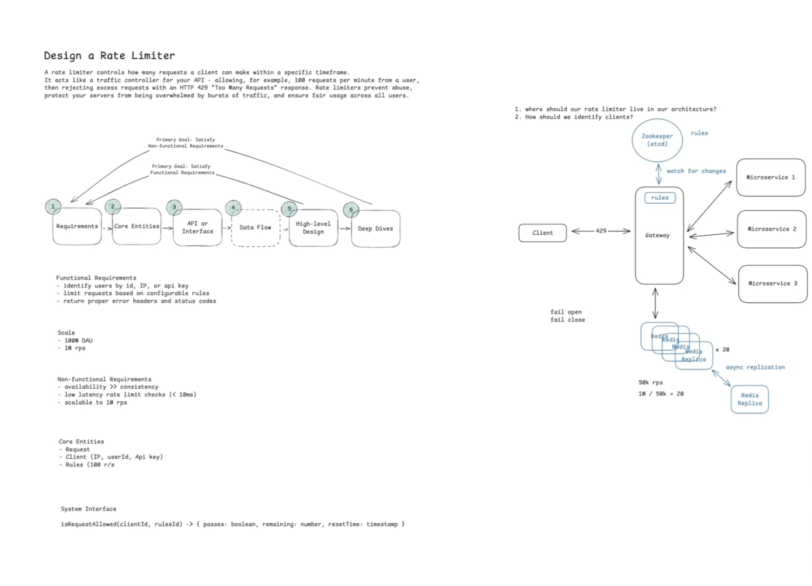

# Designing a Distributed Rate Limiter

> **Organizing thesis:** A rate limiter is a *write-heavy, contention-bound counter service* whose correctness hinges on one atomic read-modify-write per request. Every decision below flows from that: placement (where the counter lives), algorithm (what the counter tracks), atomicity (how we avoid lost updates on a hot counter), and sharding (how we spread hot counters). **AP per path** — we trade a little accuracy for latency and availability, *except* the one place where we deliberately fail-closed.

---

## 1. Requirements (~5 min)

### Clarifying dialogue (what I'd ask the interviewer)

| Question | Assumed answer | Consequence for design |
|---|---|---|
| What granularity — request-level or business-action? | Request-level (HTTP requests) | Lives at the gateway, keys off request metadata only |
| Server-side or client-side? | Server-side (clients can't be trusted) | Must be enforced centrally; client-side is a *complement*, not a substitute |
| What scale? | 1M req/s, 100M DAU | Single Redis won't do it → sharding is a first-class concern |
| Strong or eventual consistency of counts across nodes? | Eventual is fine | AP posture; slight over/under-count across regions acceptable |
| What key identifies a client? | user ID / IP / API key (layered) | Rules engine must evaluate multiple rules, enforce most restrictive |

### Functional Requirements (top 3)

1. **Identify clients** by user ID, IP, or API key and apply the appropriate limit.
2. **Limit requests** against configurable rules (e.g. 100 req/min/user), enforcing the *most restrictive* applicable rule.
3. **Reject over-limit requests** with HTTP `429` plus `X-RateLimit-*` headers so well-behaved clients can back off.

### Non-Functional Requirements (quantified)

- **Latency:** the check adds **< 10 ms** to every request. (This is the tightest constraint — it kills any design that adds a synchronous DB read.)
- **Availability >> Consistency:** **AP** system. Eventual consistency of counters is acceptable; a request counted twice or missed across nodes is fine. *Exception:* under Redis failure we deliberately choose **fail-closed** for this workload (justified in Deep Dive 2).
- **Scale:** **1M req/s** across **100M DAU**. Every request pays the check, so the check path is the whole system.
- **Out of scope:** analytics on limit data, long-term persistence of counters, strong global consistency.

### Capacity note
No front-loaded math. The one number that *changes a decision*: a Redis instance does ~**100–200k ops/s**, each check is ≥2 ops, so ~**50–100k checks/s per instance** → at 1M req/s we need **~10–20 shards**. That single calculation is what forces sharding into the design; everything else is qualitative.

---

## 2. Core Entities (~2 min)

- **Rule** — a policy: `{ scope (user|ip|key|endpoint|global), limit, window, refill_rate }`. E.g. "authed users: 1000/hr", "search API: 10/min/IP".
- **Client** — the entity being limited (user ID / IP / API key). Carries the rate-limit *state* (its bucket).
- **Request** — the incoming HTTP call carrying `{ clientId, endpoint, timestamp }`; evaluated against all matching Rules.

Interaction: Request arrives → identify Client → look up applicable Rules → check state → allow/deny.

---

## 3. API / Interface (~5 min)

A rate limiter is infrastructure other services (or the gateway itself) call. Single internal method:

```
isRequestAllowed(clientId, ruleId)
  -> { passes: boolean, remaining: number, resetTime: timestamp }
```

- `clientId` derived from the request (JWT sub / `X-Forwarded-For` / `X-API-Key`) — **never trusted from a request body**.
- Return value feeds the response headers `X-RateLimit-Remaining` and `X-RateLimit-Reset`.

On the wire, rejection looks like:

```
HTTP/1.1 429 Too Many Requests
X-RateLimit-Limit: 100
X-RateLimit-Remaining: 0
X-RateLimit-Reset: 1640995200
Retry-After: 60
```

---

## 4. High-Level Design (~10–15 min)

I'll build endpoint-by-endpoint against the three functional requirements.

### FR1 — Identify clients → *where does the limiter live?*

Three placements, each trading context vs. latency vs. accuracy:

| Placement | Pros | Cons | Verdict |
|---|---|---|---|
| **In-process** (per app server) | Fastest (in-memory, no network) | Each server sees only *its* slice of traffic → global limit off by a factor of N servers | ❌ approximate only |
| **Dedicated service** | Global state, rich business context | Extra network hop on *every* request → violates <10 ms; new failure point | ⚠️ flexible but costly |
| **API Gateway** | Blocks bad traffic at the edge; app servers never see it; centralized | Only sees HTTP-level context (headers/IP/JWT); needs external state store | ✅ **chosen** |

**Decision: API Gateway.** It's the "bouncer at the door" — over-limit traffic never touches app servers. Context limitation (can't see deep business state) is acceptable because tier/premium status rides in the JWT.

**Client identity** comes purely from the request: user ID (JWT), IP (`X-Forwarded-For`), or API key (`X-API-Key`). In practice we layer rules — per-user *and* per-IP *and* global — and **enforce the most restrictive**: if Alice is under her 1000/hr but her IP hit 100/min, she's blocked.

### FR2 — Limit against rules → *which algorithm?*

Four production algorithms, on a memory-vs-accuracy axis:

| Algorithm | State per client | Accuracy | Weakness |
|---|---|---|---|
| **Fixed Window** | `(count, window_start)` | Low | 2× burst at window boundary |
| **Sliding Window Log** | every timestamp | Perfect | Memory blows up (1000 req = 1000 timestamps) |
| **Sliding Window Counter** | 2 counters | Good (approx) | Assumes uniform intra-window traffic |
| **Token Bucket** | `(tokens, last_refill)` | Good | Tuning burst vs. refill; cold-start full bucket |

**Decision: Token Bucket.** Two fields per client, handles *sustained* load (refill rate) *and* *bursts* (bucket capacity) — which matches real bursty API traffic. This is what Stripe uses.

**Mechanics:** bucket holds N tokens (burst capacity), refills at R tokens/sec. Each request consumes 1 token; empty bucket → reject. On each check we compute `tokens = min(capacity, tokens + elapsed * R)` lazily from `last_refill` — no background refill job needed.

### FR2 cont. — *where does the bucket state live?*

In-gateway memory reintroduces the split-brain problem (Alice's 50 reqs to Gateway A + 50 to Gateway B each look fine). We need **shared state**: **Redis** — sub-ms, in-memory, reachable by all gateways, with `EXPIRE` for automatic cleanup of idle buckets.

Per-request flow against Redis:
1. `HMGET alice:bucket tokens last_refill`
2. Compute refilled token count from elapsed time.
3. Atomically update: `HSET tokens/last_refill` + `EXPIRE alice:bucket 3600`.
4. If tokens ≥ 1 → allow, decrement; else → `429`.

**⚠️ Race condition:** the *read* (`HMGET`) is outside the write transaction. Two concurrent requests read the same count, both decide "allow," both write → we let 2 through on 1 token (lost update). `MULTI/EXEC` alone doesn't fix it because the read already happened outside. **Fix: a Lua script** — Redis runs it atomically, collapsing read-compute-write into one indivisible step. *(This is the "Dealing with Contention" pattern: expand the atomic boundary to cover the whole read-modify-write.)*

### FR3 — Reject with 429

**Fail fast, don't queue.** Queuing over-limit requests burns memory, makes latency unpredictable, and clients retry anyway thinking it failed. Return `429` immediately with `X-RateLimit-*` + `Retry-After` headers so disciplined clients back off cleanly.

### High-Level Architecture Diagram




*(Architecture: Client → API Gateway (with Token-Bucket check via Lua) → Redis for bucket state; on pass → backend microservices, on fail → 429 to client.)*

---

## 5. Deep Dives (~10 min)

### Deep Dive 1 — Scaling to 1M req/s (*Scaling Writes*)

One Redis tops out at ~50–100k checks/s; we need 1M. **Shard Redis.** But sharding a stateful counter has one hard rule: **all of a client's requests must hit the same shard**, or their bucket splits and becomes meaningless.

**Consistent hashing** on the identifier: `hash(userId | ip | apiKey) → shard`. Each client's bucket lives on exactly one shard; load spreads evenly. With ~10–20 shards at ~100k checks/s each, we clear 1M req/s.

In production this is **Redis Cluster** — it hashes keys into 16,384 slots spread across nodes automatically, so gateways just talk to the cluster instead of hand-rolling consistent hashing.

*This is a canonical **scaling-writes** problem: millions of atomic read-modify-write counter updates/sec, spread by key. (DDIA Ch. 6, Partitioning — partition by key hash so a single key's state is co-located.)*

*(Sharded architecture: gateways → consistent-hash routing → Redis Cluster of N shards, each owning a disjoint set of client buckets, each with a read replica.)*

### Deep Dive 2 — Availability & fault tolerance (fail-open vs fail-closed)

Each shard is now critical: if it dies, every client hashed to it loses limiting. When Redis is unreachable:

- **Fail-open:** skip the check, forward everything. Keeps the API up, but *loses protection exactly when you may need it most* — and if Redis fell over *because* of a load spike, fail-open dumps all that traffic downstream → cascade collapse.
- **Fail-closed:** reject (`503`/`429`). Takes the API "offline" for affected clients, but prevents overload.

**Decision for a social platform: fail-closed.** Counterintuitive given we said AP, but rate-limiter failures *correlate* with traffic spikes (viral events) — precisely when unshielded backends would melt. Brief rejection beats total collapse. (A payments system would reason the same way for different reasons; a low-stakes read API might fail-open.)

**Prevention > damage control:** each shard gets **master–replica replication** with automatic failover (built into Redis Cluster). Replica promotes on master death; the trade-off is replication lag and cost. Pair with monitoring on shard CPU/memory + alerts when we enter degraded mode.

<!-- sequence diagram intentionally left empty per request -->
*(Sequence: Gateway → Redis master check → (master down) → Cluster detects failure → replica promoted → subsequent checks route to new master; during the gap, gateway applies fail-closed.)*

### Deep Dive 3 — Minimizing latency (<10 ms budget)

Every check is a Redis round-trip. Two optimizations that matter:

1. **Connection pooling** — persistent pooled connections to Redis eliminate per-request TCP handshake (20–50 ms otherwise). This is the single biggest win and is non-negotiable.
2. **Geographic distribution** — co-locate gateways + Redis with users (Tokyo users shouldn't cross to Virginia). Accept eventual consistency *between* regions in exchange for regional low latency — consistent with our AP posture.

Lua scripts / pipelining also cut round-trips, but I'd skip mentioning them unless pushed — pooling + geo already meet the budget.

### Deep Dive 4 — Hot keys (viral / abusive traffic) (*Scaling Reads*)

**The core insight: a hot key is architecturally un-shardable.** Our sharding routes `hash(clientId) → one shard`, deliberately — a client's bucket must be co-located or the count splits and becomes meaningless. But that means *all* of one client's traffic funnels to *one* master, where rate limiting is a serialized read-modify-write on a single key. You cannot shard *within* a client without breaking correctness. So a single hot client (tens of thousands of req/s from one source) is a **single-shard bottleneck** — and the fix is never "add more Redis," it's **reduce how often the hot key is touched**. Split the response by cause.

#### Case 1 — Abusive traffic (DDoS, runaway bot)

You don't want to "handle" this load gracefully — you want to **shed it before it reaches Redis**:

- **Blocklist / early ejection.** Once a client trips its limit repeatedly (e.g. 10 breaches/min), add it to a blocklist checked *first* at the gateway. Those requests are then rejected on an **in-memory set lookup** — they never touch the token-bucket Redis at all. The expensive read-modify-write is bypassed for known-bad actors, so even the *limiter* isn't overwhelmed by an attacker.
- **Upstream DDoS scrubbing** (Cloudflare / AWS Shield / Akamai) drops volumetric floods at the edge — *upstream of your gateway* — before they hit your limiter layer at all. Note the cold-start caveat: signature-based L3/L4 floods are dropped instantly, but behavioral (app-layer) attacks that look legitimate only get scrubbed after a detection threshold trips, so a novel attacker's *first* burst reaches your gateway during that window — which is exactly where the token bucket + blocklist backstop earns its place.

#### Case 2 — Legitimate high-volume client (analytics pipeline, mobile refresh storm)

Here you don't reject the client — you **reduce the rate of Redis writes**, not the client's traffic:

- **Client-side rate limiting** — a well-behaved SDK paces its own requests so it never floods one shard, respecting `Retry-After` / `X-RateLimit-*` headers.
- **Local pre-aggregation / batching** — the gateway receiving Alice's burst counts her requests in **local memory** for, say, 100 ms, then does **one** Redis update reflecting the batch instead of N. This is the key throughput trick: it **converts N read-modify-writes into 1**, at the cost of slight over-admission (a few requests slip through in the batch window). Fully consistent with our **AP posture**.
- **Approximate counting / probabilistic admission** for truly extreme keys — sample a fraction of requests to Redis and extrapolate the count.
- **Premium tiers** — offer higher limits / dedicated infra to power users who legitimately need the volume.

**Design-forward fix:** set **higher IP-based limits upfront** (corporate NAT / public WiFi share IPs) and lean on authenticated per-user limits — avoid *creating* hot keys rather than mopping them up after the fact.

*(Hot-key mitigation: gateway checks blocklist (in-memory) → known-bad rejected here, never reaching Redis; legitimate burst pre-aggregated in gateway memory (100 ms window) → single batched Redis write; Cloudflare/Shield scrubbing sits upstream of the gateway.)*

### Deep Dive 5 — Dynamic rule configuration

Rules must change without redeploying (launch bumps, emergency clamps). Two approaches:

- **Pull (poll):** gateways poll a config DB every ~30 s, cache locally. Simple; downside is up-to-30 s propagation delay — fine for most ops.
- **Push:** **ZooKeeper / etcd** (or Redis pub/sub) pushes changes to all gateways within seconds via watches. Faster, but adds complexity (partial failures, some gateways updated and others not, fallback handling).

**Default: pull**, escalate to **push** only if the system needs near-instant clamps (security incidents). *(This is exactly ZooKeeper's design purpose — distributed config with real-time watch notifications; DDIA Ch. 8–9 on coordination services.)*

<!-- final architecture diagram intentionally left empty per request -->
*(Final design: Client → API Gateway (Token Bucket via Lua, consistent-hash routing) → Redis Cluster (sharded, master+replica) for bucket state; ZooKeeper/etcd feeding rules to gateways via watch; blocklist on a shard; Cloudflare/Shield in front.)*

---

## Real-World Anchor

- **Stripe** uses token-bucket rate limiting precisely because API traffic is bursty — the bucket absorbs spikes while the refill rate enforces the sustained ceiling.
- **Cloudflare / AWS Shield** sit *in front of* application rate limiters, absorbing volumetric DDoS so the limiter only sees traffic worth counting — a layered-defense mental model straight out of the Bytebytego archive.
- The **fail-closed-under-spike** reasoning mirrors how large platforms protect databases during viral events: the limiter's job is most valuable exactly when it's most stressed.

---

## 🔍 Senior-Signal Questions to Ask in Your Interview

- **"Is the read outside our atomic boundary?"** → *Why it matters: catches the classic lost-update race in distributed counters; naming the Lua-script fix signals you understand that `MULTI/EXEC` around only the write is insufficient.*
- **"What's our failure mode — fail-open or fail-closed — and does it depend on *why* Redis failed?"** → *Why it matters: shows you reason about correlated failures (limiter dies during the exact spike it should absorb), not just the happy path.*
- **"How do we guarantee a client's bucket is always co-located on one shard?"** → *Why it matters: surfaces the hard constraint that stateful counters can't be sharded like stateless load — consistent hashing / hash-slot routing is the answer.*
- **"Where's our <10 ms budget actually spent, and what's the biggest single cost?"** → *Why it matters: connection pooling (TCP handshake elimination) over micro-optimizations shows you profile before optimizing.*
- **"How fast must a rule change propagate, and does that justify push over poll?"** → *Why it matters: ties an operational requirement (emergency clamp latency) to an architecture cost (ZooKeeper complexity) rather than reaching for coordination infra by default.*
- **"At what shard count does Redis Cluster cross-slot behavior or hot-key skew become the new bottleneck?"** → *Why it matters: identifies the next scaling inflection point beyond the naive "just add shards."*