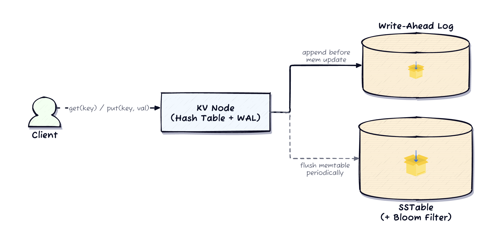
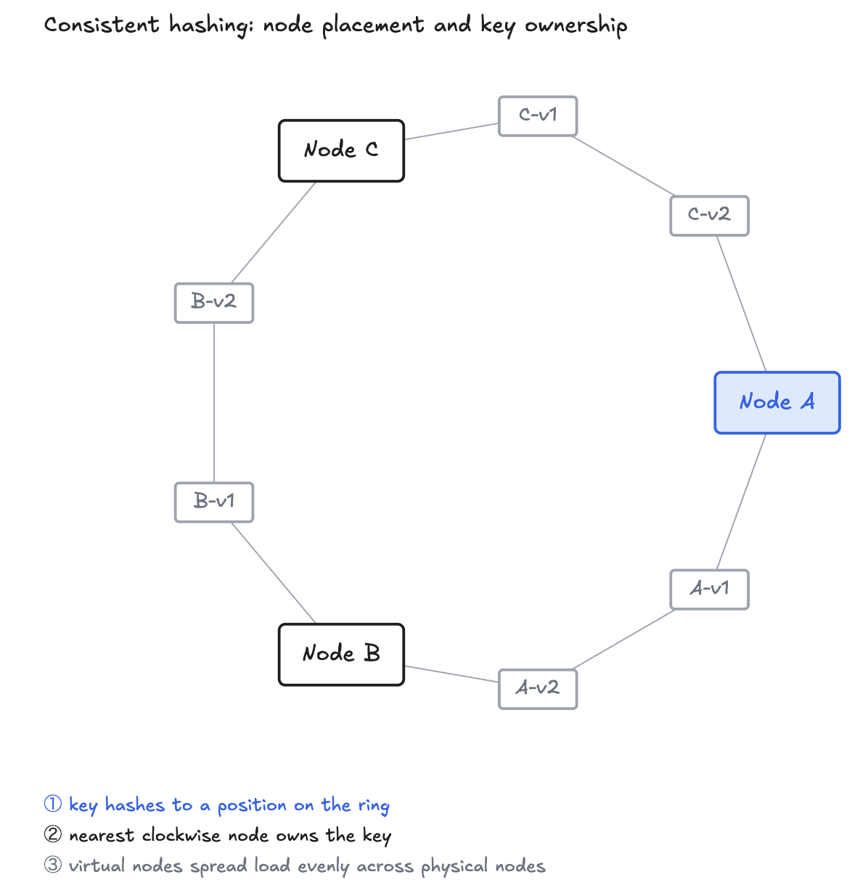
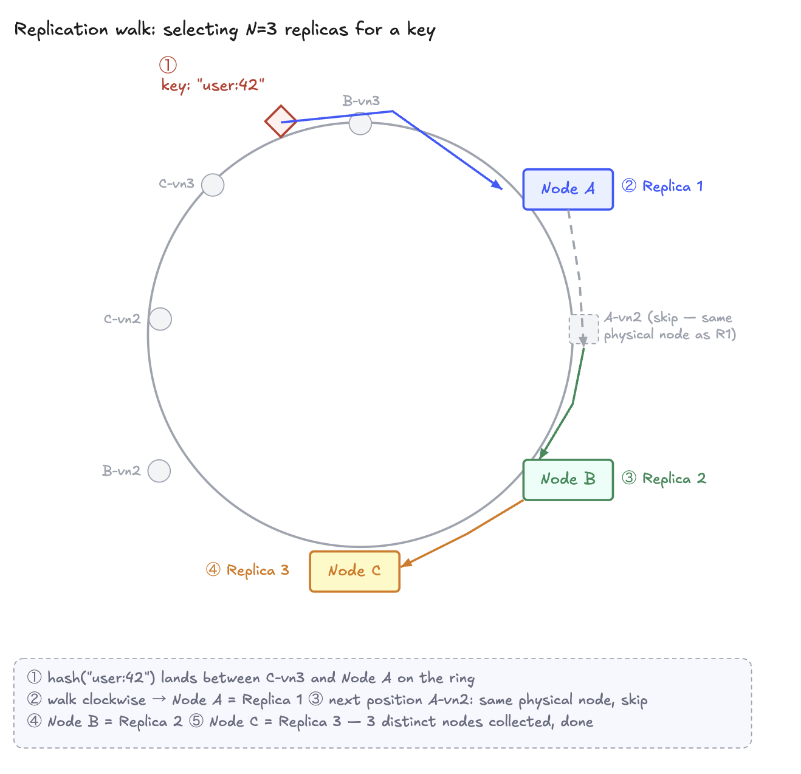
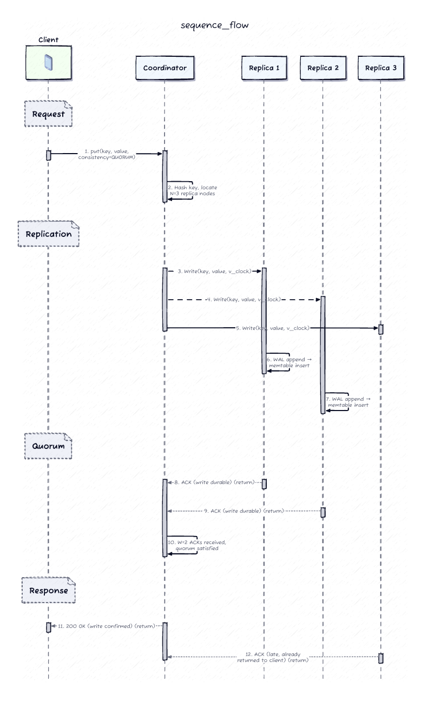
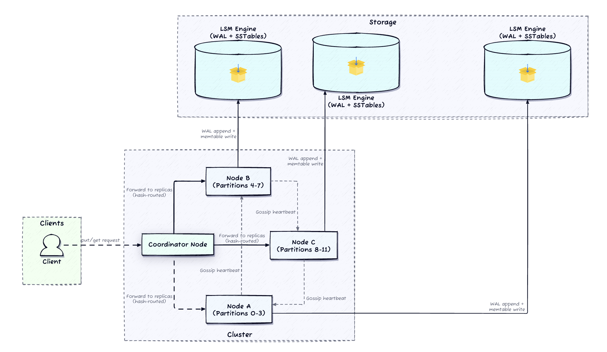
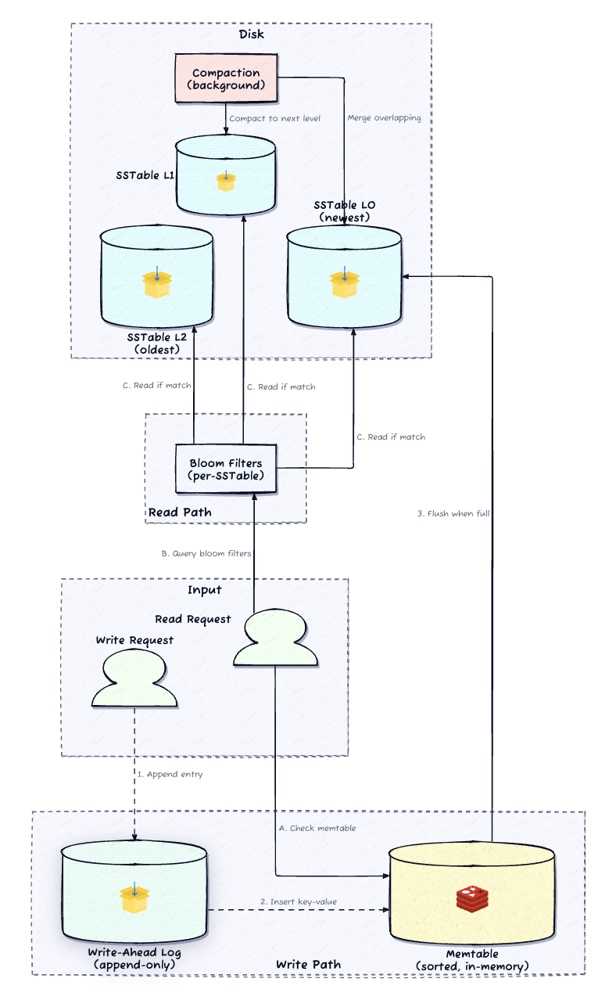
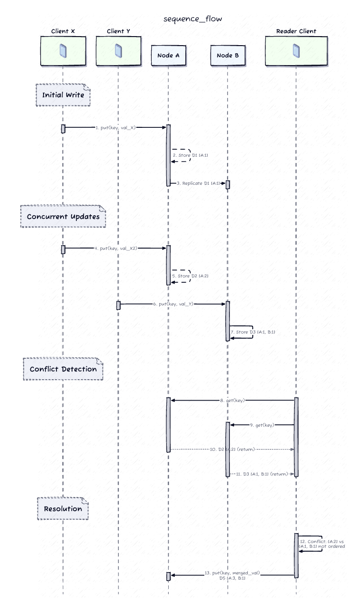
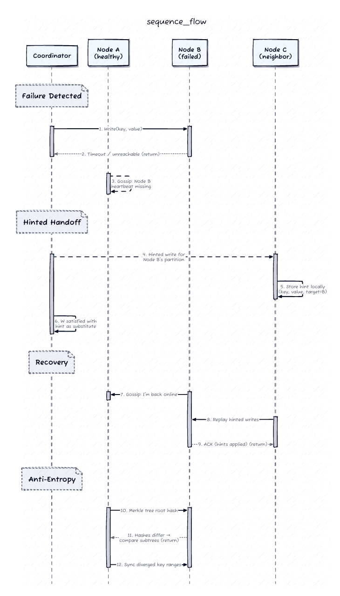

# Design a Distributed Key-Value Store

>
> A key-value store maps opaque keys to opaque values behind a two-method API — `put(key, value)` and `get(key)`. The difficulty is not the interface; it's everything the interface hides: partitioning 100 TB across 75+ nodes, replicating every key for durability, and exposing a single tunable dial that trades consistency against latency. This is the canonical Dynamo/Cassandra design.

---

## 1. Requirements

### Clarifying questions (the dialogue that scopes the problem)

| You ask | Interviewer says | What it locks in |
|---|---|---|
| What's the API surface — do we need range scans, secondary indexes, or multi-key transactions? | Single-key only. `put`/`get` with opaque values. | Local storage engines can optimize for raw throughput; no distributed multi-key coordination. |
| During a partition, do we stay available and serve stale reads, or reject requests that can't reach a full quorum? | **Availability first.** Stale reads during a partition are acceptable. | AP by default → we need a *tunable* replication model plus conflict detection. |
| Can an acknowledged write be lost if the accepting node crashes immediately? | **No.** Once we ack, the write survives a single-node crash. | Ack must be tied to disk persistence (WAL), not just an in-memory buffer. |
| Read-to-write ratio and value size? | Reads ≈ 4× writes. Values < 10 KB. | Read-dominant, small payloads → serving reads from memory is essential. |
| Total data volume and cluster size? | ~100 TB today → petabytes, across ~75 nodes. | Horizontal sharding that adds/removes nodes without a cluster-wide reshuffle. |
| Two clients write the same key on different replicas, then those replicas sync — silently pick a winner, or detect the conflict? | LWW is an acceptable *default*, but the system must **detect** writes it can't causally order. | We must track concurrency explicitly (vector clocks) even if we resolve via LWW. |

### Functional requirements (top priority first)

1. **`put(key, value)` and `get(key)`** as the sole client-facing operations.
2. **Partition** data across nodes via consistent hashing with virtual nodes.
3. **Replicate** each key to **N** nodes for fault tolerance.
4. **Tunable consistency** via quorum parameters **(N, W, R)** per request.
5. **Self-healing:** detect node failures and rebalance on join/leave.

### Non-functional requirements (quantified)

- **Availability:** 99.99% uptime; keep serving through node failures and network partitions (**AP default, tunable CP via quorum**).
- **Latency:** p99 single-key read/write **< 10 ms**.
- **Scale:** horizontal to **petabytes across hundreds of nodes**, with automatic rebalancing.
- **Durability:** **no acknowledged write is lost** after a single-node crash.

### Capacity estimation (only what changes a decision)

The numbers that actually drive design choices:

| Parameter | Value |
|---|---|
| Value size | ≤ 10 KB |
| Total data | ~100 TB (→ petabytes) |
| Replication factor (N) | 3 → **~300 TB** stored |
| Usable/node | ~4 TB → **~75 nodes** |
| Write throughput | ~50K writes/s |
| Read throughput | ~200K reads/s |
| Quorum default | **N=3, W=2, R=2** |

The one number that matters: with **N=3, W=2, R=2**, we get `W + R = 4 > 3 = N`, so the write and read sets always overlap (strong reads) *while still tolerating one unavailable replica on either path.* Everything downstream hangs off this inequality.

---

## 2. Core Entities

- **Key** — opaque byte string (≤ 256 B), hashed to a ring position.
- **Value** — opaque byte payload (≤ 10 KB), carrying a **version (vector clock)**.
- **Node** — a physical server; owns many **virtual nodes** on the ring, runs a local LSM engine.
- **Partition / Ring Range** — a hash range on the consistent-hash ring, owned by the node clockwise-nearest to it.
- **Replica Set** — the N distinct physical nodes walking clockwise from a key's position.

---

## 3. API / System Interface

A deliberately minimal REST contract. The interesting design is *behind* it.

**Store a value**

```
PUT /kv/{key}
  body: <value bytes>                       # application/octet-stream
  headers:
    X-Consistency-Level: ONE | QUORUM | ALL # optional, default QUORUM
→ 200 OK  { "version": "<vector_clock>" }
```

**Retrieve a value**

```
GET /kv/{key}
→ 200 OK  { "value": "<bytes>", "version": "<vector_clock>" }
→ 404 Not Found
```

**Delete** is not special internally — the coordinator writes a **tombstone** that propagates down the same replication path, and compaction reclaims it after a grace period (so a slow replica can't "resurrect" the key during anti-entropy).

| Level | Write | Read | Trade-off |
|---|---|---|---|
| ONE | ack after 1 | 1 replica | Fastest, risks stale reads |
| **QUORUM** | ack after W | R replicas, pick latest | **Strong when W+R>N** |
| ALL | ack after N | all N | Strongest; any dead replica blocks |

> **Senior framing:** "I'd default both reads and writes to QUORUM and explain the `W + R > N` invariant. It shows the consistency model is understood without over-engineering the API surface." Identity/version comes from the vector clock in the request, which is why writes are idempotent under retry.

---

## 4. High-Level Design

### Start naive, then break it (senior signal)

The simplest KV store is a **single-node in-memory hash map**: fast, but capped at ~64 GB of RAM and loses everything on crash. That failure motivates three evolutions in order — **durability**, then **partitioning**, then **replication** — and each maps to a specific non-functional requirement.

**Step 1 — durability via WAL + LSM.** Append every write to a sequential **Write-Ahead Log** on disk *before* touching memory, so an acknowledged write survives a crash (WAL is replayed on restart). Since RAM has a ceiling, the in-memory map becomes a **Log-Structured Merge-tree**: writes land in the WAL then an in-memory sorted **memtable**; when it fills, it flushes to an immutable sorted **SSTable** on disk. Reads check the memtable, then SSTables (newest-first) using **Bloom filters** to skip files that can't contain the key.

*This is the same engine as RocksDB / LevelDB (DDIA Ch. 3, "SSTables and LSM-Trees").*

### The single-node engine


*Read path: memtable → Bloom-filtered SSTables newest-first, first match wins. Write path: WAL (durable) → memtable (queryable), p99 dominated by one sequential disk write.*

### Step 2 — partitioning via consistent hashing

75+ nodes means we shard the keyspace. **Consistent hashing** maps both keys and nodes onto a ring; a key is owned by the first node clockwise. Adding/removing a node moves only the adjacent segment — not the whole cluster. Plain hashing skews load, so each physical node claims **~150 virtual nodes**, smoothing distribution and letting bigger machines take proportionally more.



### Step 3 — replication via quorum

<br><br><br><br><br><br><br><br><br><br><br><br><br><br><br>

Walk clockwise from the key's position and pick the next **N distinct physical nodes**. On write, the coordinator fans to all N and returns after **W** ack; on read, it queries **R** and returns the freshest. `W + R > N` guarantees the read set overlaps the write set — so a read always sees the latest write.





### Full architecture

<br><br><br><br><br><br><br><br><br><br><br><br><br><br><br>


**Four logical layers:** (1) **Coordinator** — any node the client hits; hashes the key, finds owners, enforces quorum. (2) **Storage engine** — per-node LSM tree. (3) **Replication layer** — fan-out + W/R collection. (4) **Gossip module** — background heartbeats + ring dissemination; drives self-healing, never on the read/write path.

Because every node holds the full ring (via gossip), there is no routing bottleneck — clients can even cache the ring and hit the owner directly, saving a hop.

---

## 5. Deep Dives

### Deep Dive 1 — The LSM tree: compaction & Bloom filters



Left alone, SSTables accumulate forever: read amplification climbs linearly and tombstones never reclaim space. **Compaction** merges SSTables in the background.

- **Size-tiered:** merge ~4 similarly-sized SSTables into a bigger one. Moderate write amp (`O(log N)`), but temporary space amp when old + new coexist. Good for **write-heavy**.
- **Leveled:** levels L0…Ln, each 10× the last, non-overlapping key ranges within a level. Bounds read amp to the level count (~5 for 100 TB) at the cost of higher write amp. **Cassandra/RocksDB default for read-heavy** — which is our workload (4:1 read:write).

> **Bloom-filter tuning:** 10 bits/key ≈ 1% false positive; 20 bits/key ≈ 0.01% but doubles the filter's memory footprint. Naming this trade-off shows you can reason about memory budgets at scale.


### Deep Dive 2 — Quorum + vector clocks (the hardest correctness argument)

`N, W, R` are **not three independent knobs** — the single rule `W + R > N` guarantees write/read overlap. With **N=3, W=2, R=2**, a read hits ≥1 replica holding the latest write. If two read replicas disagree, the coordinator returns the newer version and pushes it to the stale one — **read repair**.

Relax to **W=1, R=1** and you gain availability/latency but lose the overlap guarantee — fine for session caches, not for anything requiring freshness. When we relax, **vector clocks** detect the conflicts:



Each value carries a vector clock — `(node, counter)` pairs. If neither clock descends from the other, the writes are **concurrent** and the conflict is surfaced (resolved by LWW or returned for merge). A **sloppy quorum** keeps writes flowing during partitions: if a target replica is down, write to a healthy substitute with a **hint** for the intended owner, forwarded on recovery.

> **How I'd say it:** "`W + R > N` gives me consistency. Relax it for availability and I pick up vector clocks for conflict detection. Sloppy quorum is the escape hatch for writes during partition. Those three are one coherent toolkit."

*DDIA Ch. 5 ("Detecting Concurrent Writes," version vectors) and Ch. 9 (quorum consistency, `w + r > n`) are the direct anchors.*

### Deep Dive 3 — Failure detection, hinted handoff, Merkle repair

"What happens when a node goes down?" — the answer must separate **temporary** from **permanent** failure.



- **Detection:** gossip heartbeats to random peers; a missed ~2 s timeout spreads suspicion, and once enough nodes confirm, the node is marked down. Converges in `O(log N)` rounds, no central health-checker SPOF.
- **Temporary failure → hinted handoff:** coordinator writes to a substitute + hint; on the node's return (re-announced via gossip), hints replay. Cheap fix for the common case (blips, rolling restarts).
- **Permanent failure (> ~3 h):** discard hints, re-replicate. **Merkle trees** compare hash-tree roots between replicas — matching roots = in sync; differing roots let them walk down to the **divergent ranges only**, cutting sync from `O(total keys)` to `O(divergent + log total)`.

---

## Other Considerations (raise proactively — senior signal)

- **TTL / expiration:** lazy deletion on the read path (expired key → "not found," no write); space reclaimed during compaction (expired = implicit tombstone). A **grace period** (~10 days) ensures tombstones outlive propagation so slow replicas can't resurrect keys.
- **Quorum vs. Raft:** our design is **AP** (eventual, tunable, vector clocks, writable under partition — good for carts/sessions). **Raft (etcd, TiKV)** is **CP**: linearizable, no conflict resolution needed, but minority partitions go read-only and the leader is a latency bottleneck — good for lock/config stores.
- **Service discovery:** static **seed list** bootstraps clients (any seed returns the ring); gossip handles all node-to-node membership — no ZooKeeper SPOF.

### Going global — cross-region replication

The base design is implicitly **single-region, multi-AZ**: the p99 < 10 ms budget and synchronous W=2 quorum only close if replicas are ~1–2 ms apart. AZs are separate buildings (km apart, failure-independent) joined by low-latency fiber — the *widest* blast radius you can still span with a **synchronous** quorum. Crossing a region boundary (50–200 ms RTT) breaks that, and forces four changes:

1. **Quorum stays local, replication goes async across regions.** You cannot put a synchronous quorum over the WAN without blowing the latency SLO. Each region runs its own N/W/R locally; a background stream ships committed writes to peers.
2. **Async replication makes conflicts a normal-path problem.** Two regions *will* accept concurrent writes and reconcile seconds later, so **vector clocks become load-bearing** (LWW-by-wall-clock is dangerous here — cross-region clock skew silently drops writes).
3. **Ring/topology choice.** *Per-region ring + geo-replication* (each region fully owns a copy of the keyspace; WAN carries only the stream) is the common production choice — this is Cassandra's `NetworkTopologyStrategy`, where **replication factor is declared per datacenter**. A key then lives on **N nodes per participating region** (N × #regions), still a small deterministic set — never all nodes.
4. **Geo-routing.** GeoDNS/anycast steers clients to their nearest region, and you owe an explicit answer on **read-your-writes** across regions (a us-east write may not be visible in eu-west until the stream catches up).

**The design fork** (a PACELC choice): **async multi-region** (AP — local quorum, conflicts via vector clocks/CRDTs; *Cassandra, Dynamo*) vs. **home-region-per-key** (one region is the sole writer for a key → **single-leader-per-key → no conflicts by construction**; the WAN stream just replays that region's ordered log one-way to read-replicas; cost = non-home writers pay WAN latency + home-region **failover** becomes a leader-election/split-brain problem) vs. **synchronous global consensus** (CP — linearizable, e.g. *Spanner* paying the latency cost, tolerable only via TrueTime; *DDIA Ch. 9*).

**Propagation mechanics (how a write reaches another node — same everywhere, sync vs async is the only knob):** the coordinator's replication RPC triggers a **WAL + memtable** write on each target and returns an ack. *Same-AZ replicas are synchronous quorum members* (blocked on for W); *cross-region replicas are fire-and-forget async followers*. What the foreground path leaves behind, three background mechanisms repair: **read repair** (fix stale replicas on the read path), **hinted handoff** (replay writes to a briefly-down node on recovery), and **Merkle-tree anti-entropy** (compare hash-tree roots, stream only the divergent key ranges — `O(divergent + log total)`, critical over expensive WAN links). *DDIA Ch. 5.*

### Protocol choices per boundary (REST vs gRPC vs binary; HTTP versions)

Protocol is chosen by **who's talking to whom and how often** — not one default everywhere. Everything runs over **TCP** except gossip.

- **Client edge → REST over HTTP.** The caller may be a **browser**, which speaks HTTP natively but can't speak gRPC without a grpc-web proxy. REST/JSON maximizes reach and reuses HTTP auth/CDN/LB/TLS. HTTP/1.1 vs HTTP/2 is a transparent optimization here — REST is agnostic and merely *benefits* from HTTP/2's multiplexing + HPACK header compression.
- **Node-to-node edge → gRPC (or a custom binary protocol) over TCP.** Both ends are our own code at 50K+ ops/sec, so browser reach is irrelevant and per-message JSON/HTTP-header parsing wastes CPU. gRPC uses **protobuf** (binary, typed, schema-required — *DDIA Ch. 4*) and **hard-requires HTTP/2**, because its streaming call types map directly onto HTTP/2's multiplexed bidirectional streams. Real-named binary alternatives when a system predates gRPC or wants zero-copy control: **Kafka wire protocol**, Cassandra's **CQL native protocol** (client + internode), **RESP** (Redis) — a KV store like this would use a CQL-native-style length-prefixed binary framing.
- **Gossip → UDP.** Membership/heartbeat/ring topology carry no client data and are loss-tolerant, so periodic UDP (not TCP) — converges in `O(log N)` rounds.

*Real-time transport note (for the streaming edge of adjacent systems):* **SSE** is a plain long-lived HTTP response → multiplexes cleanly over HTTP/2, server→client only, free `EventSource` reconnect. **WebSocket** is an **HTTP/1.1 `Upgrade` → `101 Switching Protocols`** that then *seizes the whole TCP connection* (full-duplex, but one socket per connection, no multiplexing). It's tied to HTTP/1.1 because HTTP/2 removed `Upgrade`; RFC 8441 tunnels a WebSocket inside a single HTTP/2 stream but support is thin. **One-liner:** *REST/HTTP at the edge for reach; binary RPC internally for throughput and typed contracts; TCP underneath everywhere except loss-tolerant gossip on UDP.*

---

## Real-World Anchor

This is essentially **Amazon Dynamo** (the 2007 paper) and its open-source descendants **Cassandra** and **Riak**. Dynamo introduced the exact toolkit here — consistent hashing + virtual nodes, `(N, W, R)` quorums, vector clocks for concurrent-write detection, hinted handoff, and Merkle-tree anti-entropy. **Cassandra** defaults to **leveled compaction** for read-heavy workloads (matching our 4:1 ratio) and swaps vector clocks for last-write-wins-by-timestamp to simplify operations; **DynamoDB** later moved conflict-prone paths toward stronger consistency options. Bytebytego's Dynamo/Cassandra cheat sheet maps one-to-one onto this design.

---

## 🔍 Senior-Signal Questions to Ask in Your Interview

- **"Are we defaulting to LWW or exposing sibling values to the application for merge?"** → *Why it matters: LWW silently drops a concurrent write; surfacing siblings (like Dynamo's shopping cart) preserves them. Knowing when data loss is acceptable is a correctness judgment, not a config toggle.*
- **"What's the tombstone grace period versus the max hinted-handoff / down-node window?"** → *Why it matters: if a tombstone is compacted before a slow replica sees it, deleted keys resurrect during anti-entropy. This coupling between compaction and repair timing is where real clusters lose data.*
- **"Is read repair synchronous or background, and does that change our effective R?"** → *Why it matters: background read repair means a QUORUM read can still briefly return stale data to the client even with W+R>N — exposes whether the candidate understands the gap between the invariant and the runtime path.*
- **"How do we handle a hot key that all traffic hammers on one replica set?"** → *Why it matters: consistent hashing balances keyspace, not access frequency. Virtual nodes don't fix a single hot key — you need request coalescing, client caching, or key-splitting. Tests hot-spot reasoning beyond "just add nodes."*
- **"During rebalancing when a node joins, do we serve reads from the old or new owner mid-transfer?"** → *Why it matters: bootstrap-then-flip ownership vs. serving during transfer determines whether we briefly violate the quorum guarantee — a subtle availability/consistency trade-off at the operational seam.*
- **"When a key's home region fails, who becomes the writer, and how do we avoid overwriting its un-replicated writes?"** → *Why it matters: home-region-per-key buys conflict-freedom by making replication single-leader-per-key — but that re-imports leader-failover and split-brain. Shows you know conflict-freedom moved the cost, didn't remove it.*
- **"Where's the REST/gRPC boundary, and is any browser-facing path forced through a grpc-web proxy?"** → *Why it matters: distinguishes the client edge (browser reach → REST/HTTP) from internal hot paths (throughput → binary RPC/HTTP/2). Choosing protocol by audience + call volume, not one default, is the calibration.*