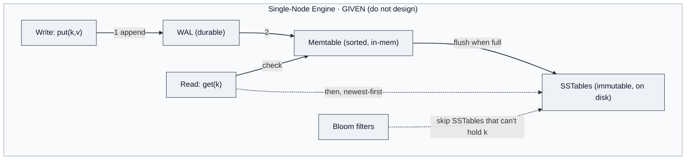
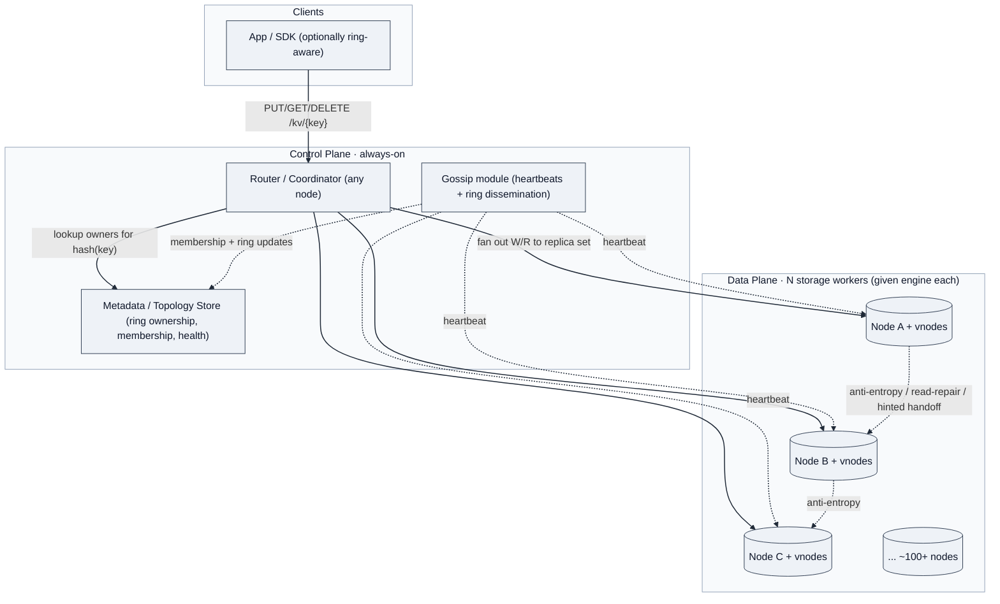
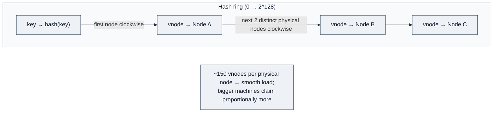
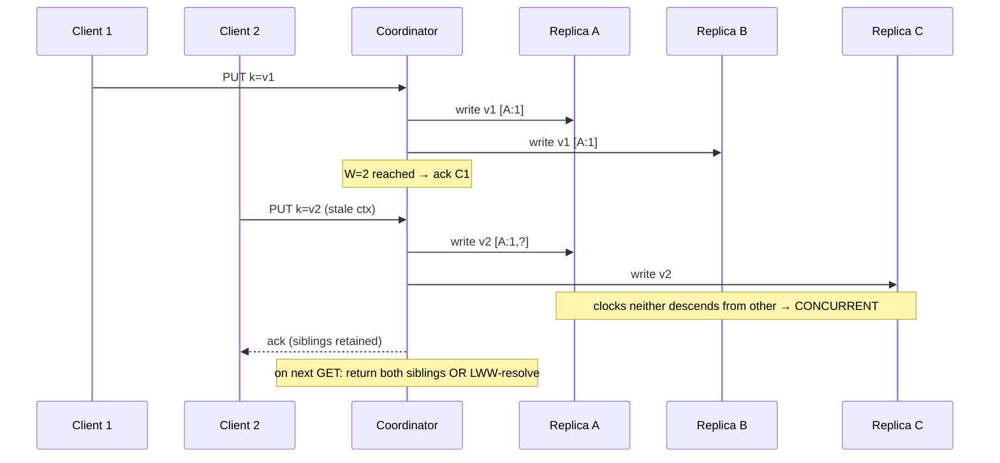
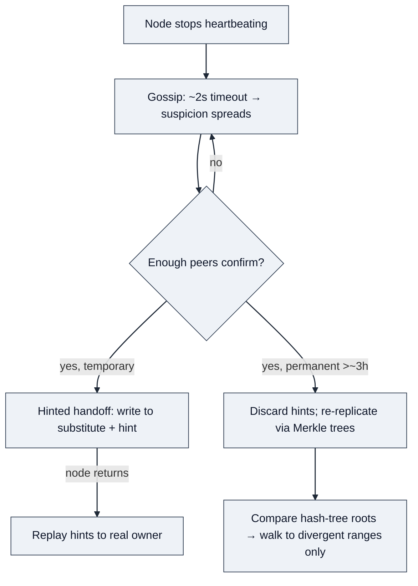

# Design a Distributed Key-Value Store

> A key-value store maps opaque keys to opaque values behind a two-method API — `put(key, value)` and `get(key)`. The difficulty is not the interface; it's everything the interface hides: partitioning data across nodes, replicating every key for durability, and exposing a tunable dial that trades consistency against latency. This is the canonical Dynamo/Cassandra design.

> **⚠️ SCOPE FRAMING (read this first — it is the single most important calibration for the LinkedIn round).**
> LinkedIn's interviewer notes state the task explicitly: *"the task here is **not** to design a key-value store from the ground up. Rather, it is to take an existing component which does not have multi-node scaling or high availability, and build a distributed system which **does** have those things, using the existing component as a building block. We are designing the **control plane** of a distributed key-value store, taking the **data plane** as a given. This is similar to asking the candidate to 'design Espresso using MySQL,' or 'design Rockset using RocksDB.'"*
>
> **Translation:** the single-node LSM engine (WAL, memtable, SSTable, compaction, Bloom filters) is a **given**, not a deliverable. At Staff level, spending the round re-deriving RocksDB is a *Requirement Collection* miss — you've mis-scoped the question. Know the LSM internals cold (they're a **Depth** deep-dive if the interviewer pulls you there), but **lead with the control plane**: sharding/routing (for scalability) and replication (for durability + availability). The two cruxes LinkedIn names are: **(1) replication for durability, (2) sharding/routing for scalability**, plus **a metadata layer that tracks where data lives and routes requests.**

---

## 0. LinkedIn Rubric Map (how this design earns each axis)

LinkedIn scores System Design on six axes. To pass the **Staff+ (IC4+)** bar you must meet *all* of them; AE ("Above Expectations") additionally requires exceeding in **≥2 areas, one of which must be Depth or Fault Tolerance.** This design is built to hit each:

| Axis | Staff+ bar (from rubric) | Where this design earns it |
|---|---|---|
| **Requirement Collection** | Scopes tightly, *anticipates future requirements*, hardly misses any | §1 — control-plane scope call up front; clarifies routing model, consistency dial, value-size ceiling, hot-key follow-ups before designing |
| **End-to-End System Design** | *Leads* the full E2E solution, foresees issues *preemptively*, minimal help | §4 — client → router → coordinator → replica set → storage, every path drawn; failure paths pre-empted before interviewer asks |
| **Tradeoff Analysis** | *Proactively* calls out every decision-with-a-tradeoff | Named forks throughout: client- vs server-side routing, on-ring vs independent replica placement, quorum vs single-leader, LWW vs siblings, sync vs async geo |
| **Fault Tolerance** | Core feature *not bolted on*; recognizes *which pattern* applies and why | §5 DD3 — failure detection, hinted handoff, Merkle repair, HA of the control plane itself (leader election / split-brain) treated as first-class |
| **Scalability** | Core feature; leverages known frameworks + *real-world intuition*; QPS intuition per component | §1 capacity + §4 sharding; per-component QPS ceilings (10K/machine given → 100+ nodes); hot-shard split/merge; rebalancing without full reshuffle |
| **Depth** | Expertise in *multiple* areas; can *educate the interviewer* | §5 deep dives — LSM compaction, quorum + vector clocks, anti-entropy, cross-region PACELC, protocol-per-boundary |

> **AE lever:** Depth or Fault Tolerance must be where you exceed. This design front-loads both — the quorum/vector-clock correctness argument (DD2) and the failure-detection/repair toolkit (DD3) are written to be the two areas where you *educate the interviewer*.

---

## 1. Requirements

### Clarifying questions (the dialogue that scopes the problem)

The **first** question is the scope-setting one — it demonstrates you've recognized this is a control-plane problem, which is itself a Staff-level Requirement Collection signal.

| You ask | Interviewer says | What it locks in |
|---|---|---|
| **Am I designing the single-node store itself, or building distribution *around* an existing one?** | Build around it. Assume a mature single-node store exists (call it the local persistence engine). | **Scope = control plane.** Don't design the LSM engine; design sharding, routing, replication, metadata. This is the scope-recognition signal. |
| What's the API surface — range scans, secondary indexes, multi-key transactions, or compare-and-swap? | **Single-key only.** `put`/`get`/`delete` with opaque values. No transactions, no CAS, no scans. | No distributed multi-key coordination; local engine optimizes for raw throughput. |
| During a partition, do we stay available and serve stale reads, or reject requests that can't reach a full quorum? | **Availability first** (four 9s). Stale reads during a partition are acceptable; strong consistency is a follow-up. | AP by default → tunable replication + conflict detection. Strong consistency reachable via quorum dial. |
| Can an acknowledged write be lost if the accepting node crashes immediately? | **No.** Durability should be as high as possible. | Ack tied to durable persistence (the engine's WAL / durable queue), not an in-memory buffer. |
| Read-to-write ratio and value size? | **≥90% reads.** Max value **1 MB** (optionally 1 GB). 90% of writes are overwrites, 10% new. | Read-dominant → serve reads from replicas widely; large values change transport + placement decisions. |
| Total data volume, key count, and QPS? | **1 PB logical, ~1 billion KV pairs, up to 1M total QPS.** Single node: 10K QPS, 10 TB, 1ms P99. | Data plane caps (10K QPS / 10TB per node) *derive* node count → **100+ nodes.** Horizontal sharding mandatory. |
| Client-side or server-side request routing? | Your call — justify it. | The routing-model fork (see DD0). Client-side = fewer hops/cheaper but harder consistency + version mgmt; server-side = simpler consistency, extra hop. |
| Two clients write the same key on different replicas, then those replicas sync — silently pick a winner, or detect? | LWW is an acceptable *default*, but the system must **detect** writes it can't causally order. | Track concurrency explicitly (vector clocks) even if resolved via LWW. |

### Functional requirements (top priority first)

1. **`put(key, value)`, `get(key)`, `delete(key)`** as the sole client-facing operations (single-key, opaque values).
2. **Shard** data across nodes so the cluster scales past a single machine's 10 TB / 10K-QPS ceiling.
3. **Replicate** each key to **N** nodes for durability and availability.
4. **Route** any request to the node(s) owning its key via a metadata/topology layer.
5. **Tunable consistency** via quorum parameters **(N, W, R)** per request.
6. **Self-healing:** detect node failures; rebalance on join/leave/hot-shard-split without a full cluster reshuffle.

### Non-functional requirements (quantified — LinkedIn's stated numbers)

- **Availability:** **≥ 99.99%** (four 9s); keep serving through node failures and network partitions (**AP default, tunable CP via quorum**).
- **Durability:** **as high as possible** — no acknowledged write is lost after a single-node crash.
- **Latency:** distributed read **10s of ms @ P90**, write **100s of ms @ P90** (the single-node engine is 1ms P99 — the budget difference is *network + quorum + coordination*, which is exactly what the control plane spends).
- **Scale:** **1 PB logical / ~1B keys / up to 1M QPS**, horizontal to hundreds of nodes, automatic rebalancing.
- **Consistency:** **eventual is acceptable**; strong consistency is an experienced-candidate follow-up (reachable by `W+R>N`).

### Capacity estimation (only what changes a decision)

The data-plane caps are *given*, so the estimation isn't back-of-envelope theater — it **derives the node count and surfaces the replication multiplier**, both of which drive the design.

| Parameter | Value | Why it drives a decision |
|---|---|---|
| Single-node ceiling | 10 TB, 10K QPS, 1ms P99 | The unit of capacity — everything is a multiple of this |
| Logical data | 1 PB → 1B keys | 1 PB / 10 TB = **≥100 nodes just for data** (before replication) |
| Replication factor (N) | 3 → **~3 PB stored** | 3× storage → **~300+ nodes** for data alone |
| Total QPS | up to 1M | 1M / 10K = **≥100 nodes just for throughput** — QPS and storage both force triple-digit node counts |
| Max value size | **1 MB** (opt. 1 GB) | 1 MB values change transport (chunking/streaming above a threshold) and make hot-key replication expensive — not a 10 KB toy |
| Quorum default | **N=3, W=2, R=2** | `W + R = 4 > 3 = N` → read/write sets always overlap |

> **The one inequality that matters:** with **N=3, W=2, R=2**, `W + R > N`, so every read set intersects every write set (strong reads on demand) *while still tolerating one unavailable replica on either path.* Everything downstream hangs off this.

---

## 2. Core Entities

- **Key** — opaque byte string (≤ 1 KB), hashed to a ring position.
- **Value** — opaque byte payload (≤ 1 MB, opt. 1 GB), carrying a **version (vector clock)**.
- **Node / Storage Worker** — a physical server running one instance of the *given* single-node engine; owns many **virtual nodes** on the ring.
- **Partition / Shard (Ring Range)** — a hash range on the consistent-hash ring, owned by the node clockwise-nearest to it.
- **Replica Set** — the N distinct physical nodes walking clockwise from a key's position.
- **Metadata / Topology** — the authoritative map of *ring → node ownership* (which node owns which range, membership, health). The control plane's brain; consulted by the router.
- **Router / Coordinator** — the component that hashes a key, consults topology, fans out to the replica set, and enforces the quorum. May be a library on the client or a server-side proxy (DD0).

### What the data actually looks like (byte-level shapes)

Being able to sketch the *stored* shape — not just name the entity — is a **Depth** signal. The critical one is the **value envelope**: the client's value is opaque, but the system wraps it so replication, conflict detection, and deletion work. The given single-node engine stores this whole envelope as its opaque value — **it needs zero schema awareness.**

```
# The value envelope — stored as the engine's opaque value
ValueEnvelope {
  value:        bytes                    # client's opaque payload, ≤ 1 MB
  vector_clock: map<node_id, counter>    # e.g. {A:3, C:1} — causality, conflict detection
  timestamp:    uint64                   # wall-clock ms — LWW tiebreaker ONLY
  tombstone:    bool                     # true = deleted; reclaimed after grace period
  ttl_expiry:   uint64 | null            # optional absolute expiry (ms); lazy-deleted on read
}

# On the wire (put) — key is opaque, value is the serialized envelope
key:   "user:1042:cart"                  # opaque bytes, ≤ 1 KB, hashed to ring position
value: <ValueEnvelope bytes>             # octet-stream at the edge; protobuf/binary internode
```

The `vector_clock` is what makes two writes *causally comparable*: `{A:3}` is an ancestor of `{A:4}` (ordered, newer wins), but `{A:3}` vs `{A:2,B:1}` descend from neither → **concurrent** → siblings surfaced (or LWW-resolved by `timestamp`). `tombstone` is why DELETE isn't special — it's an envelope with `tombstone=true` riding the same replication path.

The **routing/membership data lives in *separate* planes** from the value — which is the whole "which plane gets which consistency model" argument (data plane AP, metadata plane CP):

```
# Topology record — in the CP (Raft-backed) metadata store; small, rarely written
RingAssignment {
  vnode_token: uint128        # position on the 0…2^128 ring
  owner:       node_id        # physical node owning this vnode
  replicas:    [node_id]      # next N-1 distinct physical nodes clockwise
  epoch:       uint64         # bumped on every rebalance → stale-router guard
}

# Membership record — gossiped between data nodes, NOT on the hot path
NodeState {
  node_id, ip:port,
  status:            ALIVE | SUSPECT | DOWN,
  heartbeat_version: uint64,        # monotonic; higher = fresher gossip
  vnodes:            [uint128]      # tokens this node owns
}

# Hint — transient, on a substitute node during hinted handoff (DD3/DD4)
Hint { intended_owner: node_id, key, value_envelope, created_at }
```

Two things to say out loud: (1) the vector clock lives **inside** the envelope, co-located and replicated with the data, while topology/membership live in **separate** planes — that separation *is* the consistency-model boundary. (2) The `epoch` on `RingAssignment` is what lets a coordinator reject a stale client that routes to a former owner mid-rebalance (the DD0 failure mode).

> **Senior framing:** "The value the client sees is opaque, but internally every value is an **envelope** carrying a vector clock, a wall-clock timestamp for LWW tiebreaking, and a tombstone flag. The engine stores that envelope as-is — it stays schema-unaware. Routing and membership deliberately live in *different* stores with *different* consistency models: the value envelope is AP-replicated, the ring assignment is CP behind Raft."

---

## 3. API / System Interface

A deliberately minimal REST contract at the client edge (browser reach, HTTP auth/LB/TLS reuse); internal node-to-node hops use binary RPC (DD5). The interesting design is *behind* the interface.

**Store a value**
```
PUT /kv/{key}
  body: <value bytes>                        # application/octet-stream
  headers:
    X-Consistency-Level: ONE | QUORUM | ALL  # optional, default QUORUM
    X-Vector-Clock: <version>                # optional; enables idempotent retry + conflict detect
→ 200 OK  { "version": "<vector_clock>" }
```

**Retrieve a value**
```
GET /kv/{key}
→ 200 OK  { "value": "<bytes>", "version": "<vector_clock>" }
→ 404 Not Found
```

**Delete** is not special internally — the coordinator writes a **tombstone** that propagates down the same replication path; compaction (in the given engine) reclaims it after a grace period, so a slow replica can't "resurrect" the key during anti-entropy.

| Level | Write | Read | Trade-off |
|---|---|---|---|
| ONE | ack after 1 | 1 replica | Fastest, risks stale reads |
| **QUORUM** | ack after W | R replicas, pick latest | **Strong when W+R>N** — the default |
| ALL | ack after N | all N | Strongest; any dead replica blocks |

> **Senior framing:** "I'd default both reads and writes to QUORUM and explain the `W + R > N` invariant. It shows the consistency model is understood without over-engineering the API surface." Identity/version comes from the vector clock, which is why writes are idempotent under retry — important because a client that times out and retries must not create a sibling.

---

## 4. High-Level Design

### Start from the given data plane, then build outward (correct scope signal)

The building block is a **mature single-node store** — 10 TB, 10K QPS, 1ms P99, single-key `put`/`get`/`delete`, and (if we ask for it) a **change-data stream** we can tap for replication. It has **no** multi-node scaling and **no** HA — a crash loses that node's data and availability. Our job is the control plane that turns *N of these* into a system that is durable, available, and scalable.

Three control-plane concerns, in the order LinkedIn expects them for a senior candidate — **sharding/scaling first, then replication/durability** (their notes: "guide less-experienced candidates to focus on sharding/scaling first, then replication"):

**Concern 1 — Sharding (scalability).** 1 PB and 1M QPS both force ≥100 nodes. We map keys to nodes with **consistent hashing + virtual nodes** so adding/removing a node moves only an adjacent segment, not the whole cluster. (Rendezvous hashing is an acceptable alternative.) Static/fixed-shard-count with a bulk-rewrite rebalance is acceptable for less-experienced candidates but **not** for Staff — Staff is expected to support **dynamic rebalancing and hot-shard split/merge.**

**Concern 2 — Routing.** Something must turn a key into "which nodes own it." That's the **metadata/topology layer** + a **router**. The router can live **client-side** (a smart library) or **server-side** (a proxy/broker tier). This is a first-class Staff tradeoff — see **DD0** below.

**Concern 3 — Replication (durability + availability).** Each key is replicated to **N** nodes. On write, the coordinator fans out and returns after **W** acks; on read it queries **R** and returns the freshest. `W + R > N` gives read-your-writes on demand.

### The given single-node engine (data plane — know it, don't design it)



*This is RocksDB/LevelDB (DDIA Ch. 3, "SSTables and LSM-Trees"). In the LinkedIn round this box is a **given**. Mention it in one breath — "I assume a durable single-node engine like RocksDB with a WAL for crash-safety and optionally a change-data stream for replication" — then move to the control plane. It becomes a **Depth** deep-dive (DD1) only if the interviewer steers you there.*

### DD0 — The routing model: client-side vs server-side (LinkedIn's explicit fork)

LinkedIn's notes call this out directly: *"the candidate will need a component for routing requests... choose between client-side routing versus server-side routing via some proxy/broker layer. Ideally they mention both and discuss pros/cons."* Naming this fork **before** the interviewer asks is a Tradeoff-Analysis + Requirement-Collection signal.

| | **Client-side routing** | **Server-side routing (proxy/broker)** |
|---|---|---|
| How | Smart client caches the ring/topology, hashes the key, hits the owning node directly | Client hits any router node; router hashes, forwards to owners, collects quorum |
| Latency/cost | **Fewer hops, cheaper, scales freely** (no middle tier) | **Extra network hop**; router tier must itself scale |
| Consistency | **Harder** — clients can hold stale topology → route to a non-owner during rebalancing; version/topology management pushed to every client | **Simpler** — one place owns routing + version logic; consistent writes easier |
| Coupling | Fat client, versioned protocol, all languages must implement it | Thin client; logic centralized and independently deployable |
| Real systems | Cassandra/DynamoDB drivers (token-aware) | Twemproxy, Envoy, a Dynamo request-coordinator node |

> **My call:** default to **server-side coordinator** (any node can coordinate — "coordinator = any node the client hits"), because it centralizes version/topology management and makes consistent writes tractable, and I let **topology-aware clients cache the ring to skip the extra hop** as an optimization. That gets server-side's correctness with client-side's latency for the common case. **State the tradeoff explicitly** — this is exactly the "either is acceptable as long as you say why" the rubric rewards.

### Full control-plane architecture



**Four logical layers:** (1) **Router/Coordinator** — hashes the key, consults topology, enforces quorum. (2) **Storage workers** — the given per-node engine. (3) **Replication layer** — fan-out + W/R collection, riding the engine's change-data stream where available. (4) **Metadata + Gossip** — background membership/heartbeat/ring dissemination; drives self-healing, **never on the read/write hot path.**

Because every node learns the full ring via gossip, there is no routing bottleneck — clients can cache the ring and hit owners directly, saving a hop (the optimization from DD0).

### Consistent hashing with virtual nodes



Plain hashing skews load and, worse, moves a huge fraction of keys when the node count changes. **Virtual nodes** (~150 per physical node) smooth distribution, let heterogeneous machines take proportional load, and shrink the blast radius of a join/leave to adjacent segments.

### Two replica-placement strategies (LinkedIn's Appendix A fork)

LinkedIn's Appendix A names two ways to place the N replicas — worth stating as a tradeoff:

1. **On-ring / "replicate along the ring":** the replica set is simply the next N distinct physical nodes clockwise. **Simpler** — decouples replication from sharding; the ring alone defines both. (This is what the diagrams above show.)
2. **Independent placement:** choose replica locations by optimizing on storage, write-QPS, and read-QPS dimensions. **Higher utilization** but **higher overhead** (a separate placement map to maintain).

> **My call:** on-ring placement by default (simplicity, one source of truth), and I'd reach for independent placement only if hot shards or heterogeneous hardware made utilization skew a real problem — naming *when* I'd switch is the tradeoff signal.

---

## 5. Deep Dives

### DD1 — The given engine's internals: compaction & Bloom filters (Depth, only if pulled here)

You don't *design* this, but being able to explain it on demand is a **Depth** signal — "know the data plane you're building on."

Left alone, SSTables accumulate forever: read amplification climbs and tombstones never reclaim space. **Compaction** merges them in the background.

- **Size-tiered:** merge ~4 similarly-sized SSTables into a bigger one. Moderate write amp (`O(log N)`), temporary space amp when old + new coexist. Good for **write-heavy**.
- **Leveled:** levels L0…Ln, each 10× the last, non-overlapping ranges within a level. Bounds read amp to the level count (~5 for our data size) at higher write amp. **The right default for our ≥90%-read workload** (Cassandra/RocksDB read-heavy default).

> **Bloom-filter tuning:** 10 bits/key ≈ 1% false positive; 20 bits/key ≈ 0.01% but doubles the filter's memory footprint. Naming this trade-off shows you reason about memory budgets at scale.

### DD2 — Replication approaches: the ladder LinkedIn expects you to climb

LinkedIn's "Possible Solutions / Some approaches" section lists four replication designs in increasing sophistication. **Walking this ladder — and saying why you climb past each rung — is the core End-to-End + Tradeoff signal.** Don't jump straight to quorums; show the progression.

| Rung | How it works | Why climb past it |
|---|---|---|
| **1. Writes via a durable queue** | Writes → Kafka/SQS; storage nodes poll and apply. Reads hit any replica. | Simplest, meets requirements, but **write-apply latency is high** and it just *moves* the durability problem into the queue. Push: "what is the queue doing, and could the KV store do it itself?" |
| **2. Active/standby** | Each shard has one authoritative active serving all reads/writes; standbys exist for durability, fed by the change-data stream. | Trivially strong-consistent, but **hard-caps read QPS per shard** (one active) and needs active-election. Fails our read-heavy scaling need. |
| **3. Read-only replicas** | Active/standby, but standbys **also serve reads.** | Much higher read QPS (fits ≥90% reads), eventually consistent reads. Still single-writer per shard. |
| **4. Quorums (chosen)** | Writes succeed on **W** replicas; reads fetch from **R**. `W+R>N` = strong; relax for latency. Consensus (Paxos/Raft) is the CP cousin. | **"Best of both worlds"** — tune consistency vs latency *and* reads vs writes per request. This is the Dynamo answer; expected of senior candidates. |

> **How I'd narrate it:** "The durable-queue design meets the bar but hides the hard part in the queue. Active/standby gives strong consistency but caps read QPS — bad for a 90%-read workload. Read replicas fix read scaling but keep a single writer. **Quorums** let me trade consistency against latency per request and scale reads *and* writes — so I'll build on quorums, defaulting `N=3, W=2, R=2`." Climbing the ladder out loud is what separates ME from AE.

### DD3 — Quorum + vector clocks (the hardest correctness argument — an AE-Depth lever)

`N, W, R` are **not three independent knobs** — the single rule `W + R > N` guarantees write/read overlap. With **N=3, W=2, R=2**, a read hits ≥1 replica holding the latest write. If two read replicas disagree, the coordinator returns the newer version and pushes it to the stale one — **read repair**.

Relax to **W=1, R=1** and you gain availability/latency but lose the overlap guarantee — fine for session caches, not for freshness-critical data. When we relax, **vector clocks** detect the conflicts.



Each value carries a vector clock — `(node, counter)` pairs. If neither clock descends from the other, the writes are **concurrent** and the conflict is surfaced (resolved by LWW, or returned as siblings for application merge). A **sloppy quorum** keeps writes flowing during partitions: if a target replica is down, write to a healthy substitute with a **hint** for the intended owner, forwarded on recovery.

> **How I'd say it:** "`W + R > N` gives me consistency. Relax it for availability and I pick up vector clocks for conflict detection. Sloppy quorum is the escape hatch for writes during partition. Those three are one coherent toolkit." — *DDIA Ch. 5 ("Detecting Concurrent Writes," version vectors) and Ch. 9 (quorum consistency, `w + r > n`).*

### DD4 — Failure detection, hinted handoff, Merkle repair (Fault Tolerance — the other AE lever)

"What happens when a node goes down?" — the answer must separate **temporary** from **permanent** failure. LinkedIn's rubric wants fault tolerance as a *core feature with the right pattern named*, not bolted on.



- **Detection:** gossip heartbeats to random peers; a missed ~2 s timeout spreads suspicion, and once enough nodes confirm, the node is marked down. Converges in `O(log N)` rounds — **no central health-checker SPOF.**
- **Temporary failure → hinted handoff:** coordinator writes to a substitute + hint; on the node's return (re-announced via gossip), hints replay. Cheap fix for blips and rolling restarts.
- **Permanent failure (> ~3 h):** discard hints, re-replicate. **Merkle trees** compare hash-tree roots between replicas — matching roots = in sync; differing roots let them walk down to the **divergent ranges only**, cutting sync from `O(total keys)` to `O(divergent + log total)`.

### DD5 — HA of the control plane itself (the question LinkedIn *will* ask)

LinkedIn's follow-ups explicitly probe: *"how is the management layer implementing HA? Is it single-active? How is leader election handled? Is it multi-active? How are decisions made consistently? How is the routing/broker layer scaled in a way that ensures consistency?"* **This is where most candidates stop too early.** The data plane is AP via quorum, but the **metadata/topology layer wants to be CP** — you cannot have two nodes disagreeing on who owns a shard.

- **Metadata store = CP (Raft/ZooKeeper-style).** Ring ownership and membership are small, low-write, correctness-critical → a **consensus-backed** store (etcd/ZooKeeper, or a Raft group). Split-brain here would double-write a shard. **This is the one place I accept a leader + linearizability**, because the metadata is tiny and rarely written.
- **Router tier = stateless, horizontally scaled.** Routers cache topology from the CP store and are trivially replicated behind an LB. A stale router routes to a former owner during rebalancing → handled by **ownership hand-off protocol** (bootstrap-then-flip: new owner serves only after it has the data; old owner forwards until flip).
- **No ZooKeeper on the hot path.** Gossip disseminates membership between data nodes; the CP store is consulted on topology *change*, not per request. Static **seed list** bootstraps new nodes.

> **Senior framing:** "The data plane is intentionally AP — quorum, vector clocks, writable under partition. But the **topology metadata is CP** — I put it behind Raft because two nodes disagreeing on shard ownership is a correctness disaster, and it's small enough that consensus latency is free. Knowing *which plane gets which consistency model* is the whole game." — *DDIA Ch. 9 (linearizability, consensus).*

### DD6 — Hot shards & hot keys (LinkedIn's explicit follow-up, two distinct problems)

LinkedIn asks: *"how would you handle a hot shard with extremely high QPS? What if it's high on reads vs writes? And what if it's a single key with very high read volume?"* — **these are two different problems** and conflating them is a junior tell.

- **Hot shard (range of keys):** detect via per-shard QPS metrics → **split the shard** and redistribute vnodes. Consistent hashing + vnodes makes this a local move. Works for both read- and write-hot shards.
- **Hot *single* key:** splitting the shard **does not help** — the key is atomic, all traffic still lands on its replica set. Fixes depend on read vs write:
  - **Read-hot key:** add read replicas beyond N for that key / serve from a **cache tier** / **client-side caching** with TTL / request **coalescing** at the coordinator (dedupe concurrent identical reads). ≥90%-read workload makes this the common case.
  - **Write-hot key:** genuinely hard (single-key writes can't be parallelized without losing single-copy semantics). Options: accept the single-replica-set ceiling, or shard the *value* if the app can tolerate it (e.g. counter → per-node sub-counters summed on read, a CRDT). Name the ceiling honestly — that's the Staff move.

### DD7 — Rebalancing on join/leave (LinkedIn follow-up: "as tables grow or shrink")

On **join:** new node claims vnodes → **bootstrap-then-flip.** It streams the ranges it will own from current owners *while they still serve*, and only assumes ownership (via a CP metadata update) once caught up. This avoids violating the quorum guarantee mid-transfer. On **leave** (decommission): reverse — stream its ranges to successors before removing it from the ring. Only adjacent segments move; the cluster is never wholesale reshuffled. **Detect hot shards and auto-split** as part of the same machinery (the Staff bar; static shard count is only acceptable below Staff).

#### Who actually does the ring assignment? (three separate actors — keep them separate)

"The ring assigns itself" is a hand-wave. Assignment is **three distinct decisions**, and conflating them is where designs get race conditions:

1. **The hash function decides *positions* — no coordinator.** On join, a node's vnode tokens are *computed*, not handed out: `token = hash(node_id + vnode_index)` for each of its ~150 vnodes. Deterministic and local — the node itself computes where its vnodes land. Nobody negotiates for a spot; placement is a pure function. *(Refinement, only if pressed: pure-random tokens leave the ring unbalanced at low node counts. Cassandra 4.0+ added an **allocation algorithm** that picks new tokens to minimize existing-range imbalance rather than purely randomly — so "hash decides position" is the simple version; "hash proposes candidates, an allocation policy chooses to balance load" is the refined one.)*

2. **The CP metadata store (Raft group) decides *ownership* — the authority.** Computing where a token lands ≠ being allowed to own it. The join must be **committed** so the whole cluster agrees "node X owns these ranges at epoch N." That commit is a Raft proposal into the metadata store. The RaftStore doesn't *choose* positions (the hash did) — it **ratifies and orders** ownership changes: serializes concurrent joins/leaves, bumps the epoch, and is the single source of truth the routers read.

3. **The control-plane orchestrator decides *when and how* — the policy actor.** Something triggers and sequences the rebalance: detect the join, decide which ranges transfer, run bootstrap-then-flip, and only *then* propose the ownership commit to Raft. Who plays this role differs by system:
   - **Cassandra:** decentralized — a joining node picks its tokens, announces via **gossip**, and streams ranges peer-to-peer. No central orchestrator. Tradeoff: gossip membership is eventually consistent → historically token-collision and race edge cases.
   - **Dynamo / etcd-backed designs:** an explicit control-plane service (or the CP store's leader) drives the sequence.

> **The failure this separation prevents:** if a node serves a range *before* the ownership commit lands, you've **split-brained the shard** — two nodes each believe they own it. Stream first, commit ownership second (bootstrap-then-flip), and epoch-stamp requests (DD5) so a storage node rejects a write routed under stale ownership.

> **How I'd say it:** "Ring assignment is three decisions and I keep them separate. **Positions** are computed by the hash — deterministic, no negotiation. **Ownership** is ratified by the CP metadata store via a Raft commit, which serializes concurrent membership changes and bumps the epoch. **Sequencing** — when to rebalance, stream-before-flip — is the orchestrator's job, central or, in Cassandra's case, decentralized gossip. Conflating those is exactly where you split-brain a shard."

---

## Other Considerations (raise proactively — senior signal)

- **TTL / expiration:** lazy deletion on the read path (expired key → "not found"); space reclaimed during compaction (expired = implicit tombstone). A **grace period** (~10 days) ensures tombstones outlive propagation so slow replicas can't resurrect keys.
- **Large values (1 MB, opt. 1 GB):** above a threshold, **chunk/stream** the value and store a manifest; don't hold a 1 GB value in one RPC. This is why the value-size ceiling was a clarifying question — it changes the transport.
- **Quorum vs. Raft:** our data plane is **AP** (eventual, tunable, vector clocks, writable under partition — good for carts/sessions/config-blobs). **Raft (etcd, TiKV)** is **CP**: linearizable, no conflict resolution, but minority partitions go read-only and the leader is a latency bottleneck — which is exactly why we use it for the *metadata* plane but not the *data* plane.
- **Service discovery:** static **seed list** bootstraps clients/nodes; gossip handles node-to-node membership; the CP metadata store is authoritative for ownership.

### Going global — cross-region replication (PACELC, an AE-Depth topic)

The base design is implicitly **single-region, multi-AZ**: the latency budget and synchronous W=2 quorum only close if replicas are ~1–2 ms apart. AZs are separate buildings joined by low-latency fiber — the widest blast radius you can still span with a **synchronous** quorum. Crossing a region boundary (50–200 ms RTT) breaks that and forces four changes:

1. **Quorum stays local, replication goes async across regions.** You cannot put a synchronous quorum over the WAN without blowing the latency SLO. Each region runs its own N/W/R locally; a background stream ships committed writes to peers.
2. **Async replication makes conflicts a normal-path problem.** Two regions *will* accept concurrent writes and reconcile seconds later, so **vector clocks become load-bearing** (LWW-by-wall-clock is dangerous — cross-region clock skew silently drops writes).
3. **Ring/topology choice.** *Per-region ring + geo-replication* (each region fully owns a copy of the keyspace; WAN carries only the stream) is the common production choice — Cassandra's `NetworkTopologyStrategy`, where **replication factor is declared per datacenter.** A key lives on **N nodes per region** (N × #regions), still a small deterministic set.
4. **Geo-routing.** GeoDNS/anycast steers clients to their nearest region; you owe an explicit answer on **read-your-writes** across regions (a us-east write may not be visible in eu-west until the stream catches up).

**The design fork (PACELC):** **async multi-region** (AP — local quorum, conflicts via vector clocks/CRDTs; *Cassandra, Dynamo*) vs. **home-region-per-key** (one region is the sole writer for a key → single-leader-per-key → no conflicts by construction; WAN stream replays that region's ordered log; cost = non-home writers pay WAN latency + home-region **failover** becomes leader-election/split-brain) vs. **synchronous global consensus** (CP — linearizable, *Spanner* + TrueTime; *DDIA Ch. 9*).

### Protocol choices per boundary (REST vs gRPC vs binary; HTTP versions)

Protocol is chosen by **who's talking to whom and how often** — not one default everywhere. Everything runs over **TCP** except gossip.

- **Client edge → REST over HTTP.** The caller may be a **browser** (speaks HTTP natively, can't speak gRPC without grpc-web). REST/JSON maximizes reach and reuses HTTP auth/CDN/LB/TLS. HTTP/1.1 vs HTTP/2 is a transparent optimization — REST merely *benefits* from HTTP/2 multiplexing + HPACK.
- **Node-to-node → gRPC or custom binary over TCP.** Both ends are our own code at high ops/sec; browser reach is irrelevant and per-message JSON parsing wastes CPU. gRPC uses **protobuf** (binary, typed — *DDIA Ch. 4*) and **hard-requires HTTP/2** (its streaming maps onto HTTP/2 multiplexed streams). Binary alternatives when a system predates gRPC: **Kafka wire protocol**, Cassandra's **CQL native protocol**, **RESP** (Redis).
- **Gossip → UDP.** Membership/heartbeat/ring topology carry no client data and are loss-tolerant → periodic UDP; converges in `O(log N)` rounds.

**One-liner:** *REST/HTTP at the edge for reach; binary RPC internally for throughput and typed contracts; TCP underneath everywhere except loss-tolerant gossip on UDP.*

---

## Real-World Anchor

This is essentially **Amazon Dynamo** (2007 paper) and its descendants **Cassandra** and **Riak** — and LinkedIn's own interviewer notes point candidates at the Dynamo paper, calling it *"a control-plane design where they assume the data plane (local persistence engine, §5) exists — just like this question."* Dynamo introduced the exact toolkit: consistent hashing + virtual nodes, `(N, W, R)` quorums, vector clocks for concurrent-write detection, hinted handoff, Merkle-tree anti-entropy. **Cassandra** defaults to leveled compaction for read-heavy workloads and swaps vector clocks for LWW-by-timestamp to simplify ops; **DynamoDB** later moved conflict-prone paths toward stronger consistency. LinkedIn's own **Espresso** (built on MySQL) is the same shape — a control plane over a given single-node engine. Bytebytego's Dynamo/Cassandra cheat sheet maps one-to-one onto this design.

---

## 🔍 Senior-Signal Questions to Ask in Your Interview

- **"Is routing client-side or server-side, and if client-side, how do clients avoid routing to a former owner during rebalancing?"** → *Why it matters: LinkedIn explicitly grades whether you chose a routing model deliberately and understand the stale-topology failure mode — the seam where client-side routing breaks consistency.*
- **"Is the metadata/topology layer CP or AP, and how is its leader elected?"** → *Why it matters: the data plane is AP but the topology must be CP — two nodes disagreeing on shard ownership double-writes a shard. Knowing which plane gets which consistency model is the Staff differentiator.*
- **"Are we defaulting to LWW or exposing sibling values to the application for merge?"** → *Why it matters: LWW silently drops a concurrent write; surfacing siblings (Dynamo's cart) preserves them. Knowing when data loss is acceptable is a correctness judgment, not a config toggle.*
- **"For a hot *single* key, splitting the shard won't help — is it read-hot (cache/coalesce/replicate) or write-hot (accept the ceiling or CRDT-split the value)?"** → *Why it matters: LinkedIn asks this exact follow-up; conflating hot-shard with hot-key is a junior tell.*
- **"What's the tombstone grace period versus the max hinted-handoff / down-node window?"** → *Why it matters: if a tombstone compacts before a slow replica sees it, deleted keys resurrect during anti-entropy — where real clusters lose data.*
- **"During a node join, do we serve reads from the old or new owner mid-transfer?"** → *Why it matters: bootstrap-then-flip vs. serving during transfer determines whether we briefly violate the quorum guarantee — a subtle availability/consistency trade-off at the operational seam.*
- **"When a key's home region fails, who becomes the writer, and how do we avoid overwriting its un-replicated writes?"** → *Why it matters: home-region-per-key buys conflict-freedom by making replication single-leader-per-key — but re-imports leader-failover and split-brain. Shows you know conflict-freedom moved the cost, didn't remove it.*