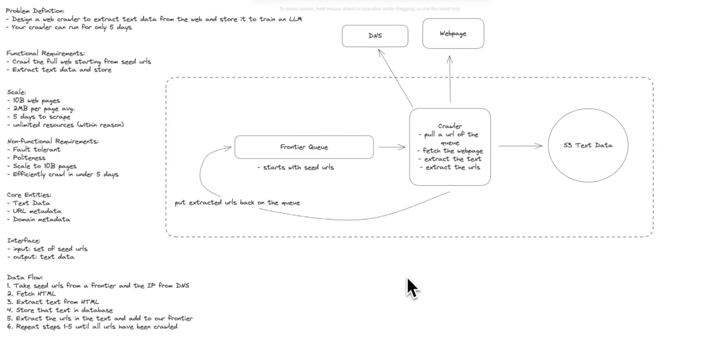
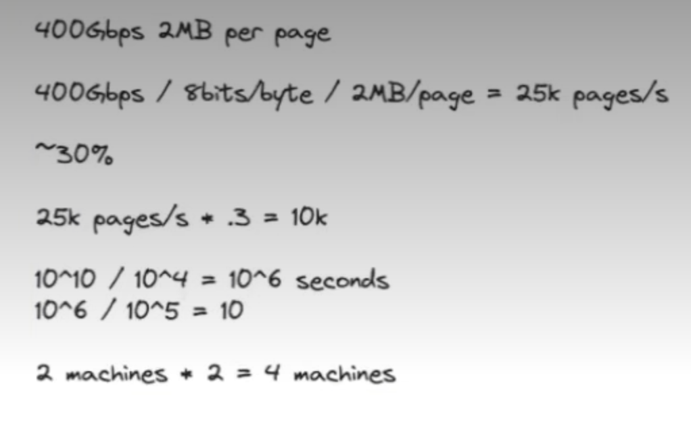
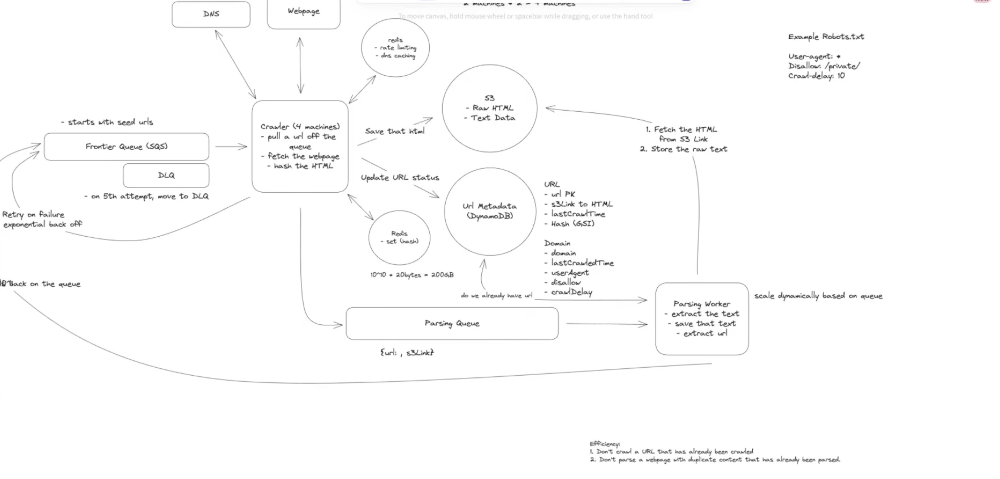
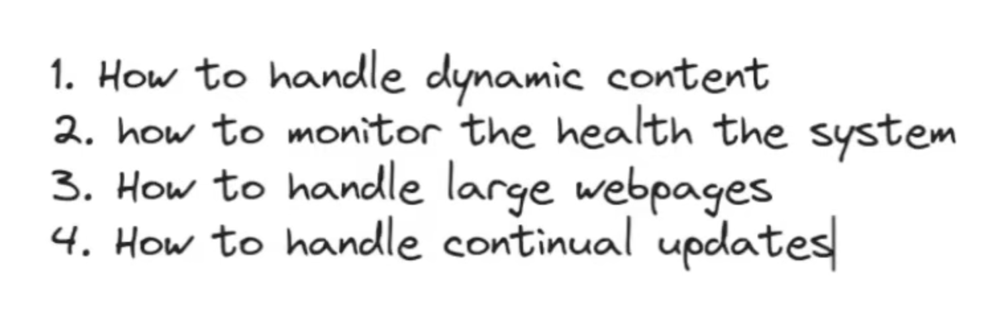

 # Design a Web Crawler
---

## Requirements (~5 min)

---

## Data Computation

---

## High-Level Design (~10–15 min)

We build the architecture endpoint-by-endpoint. This diagram is the centerpiece — everything after this hardens it.

---

## Deep Dives (~10 min)

### 1. DNS as a Hidden Bottleneck

DNS resolution is easy to overlook because tools like `curl` handle it transparently, but at thousands of RPS across millions of unique domains it becomes a first-order constraint. Each new domain requires multiple round-trips through the DNS hierarchy; the Mercator crawler paper found DNS accounted for up to **70% of a thread's elapsed time** before they built a custom resolver.

**Mitigations:**

| Approach | Mechanism | Trade-off |
|---|---|---|
| Raise provider limits | Pay 3rd-party DNS provider for higher rate limits | Fastest fix, ongoing cost |
| DNS caching | Cache resolutions in the crawler; all URLs for a domain reuse one lookup | Must handle TTL/staleness |
| Multiple providers | Round-robin across several DNS providers | Distributes load, avoids single rate limit |

---

### 2. Content-Level Deduplication via Bloom Filter

A **Bloom filter** is a probabilistic set-membership structure: definitive on *absence*, probabilistic on *presence*. That asymmetry fits dedup exactly.

**Flow:** hash fetched page content → check filter → if absent, page is definitively new (crawl and add); if present, page was probably seen (skip).

**Implementation:** Redis with the **RedisBloom** module (Redis Stack), using `BF.ADD` / `BF.EXISTS`. Without RedisBloom, fall back to Redis bit operations or an in-memory filter.

**Challenge — false positives:** the filter may report a page as crawled when it wasn't, causing us to silently skip real content. Acceptable trade-off for the memory savings; tune the false-positive rate by increasing filter size and hash-function count.

---

### 3. Dynamic (JavaScript-Rendered) Content

Sites built on React/Angular return a shell HTML document — the content is populated client-side. Server-returned HTML is therefore insufficient. Use a **headless browser (Puppeteer)** to execute the JavaScript, render the page, and extract the resulting DOM.

---

### 4. System Health Monitoring

Instrument crawlers and parser workers with a monitoring service (**Datadog**, **New Relic**) to track throughput and latency, and to alert on failures or degradation.

---

### 5. Large File Handling

Issue an **HTTP `HEAD` request first** and inspect the `Content-Length` header. Skip any resource exceeding a threshold (e.g. **10MB**) without ever downloading the body.

---

### 6. Continual Updates (Beyond a One-Time Crawl)

If the crawl must repeat — monthly model retraining, or a search index needing freshness — introduce a **URL Scheduler** component.

**Change in flow:**
- **Before:** parser workers push discovered URLs directly onto the queue
- **After:** parser workers write URLs to the **Metadata DB**; the URL Scheduler decides *when* to enqueue them, based on last-crawl time, domain popularity, and change frequency

This decouples URL *discovery* from crawl *scheduling*.

---

### 7. Priority Crawling

To crawl popular domains first:

- **SQS:** run multiple queues, one per priority tier; crawlers poll the high-priority queue first
- **Kafka:** no native priority consumption — approximate it with separate topics per priority level