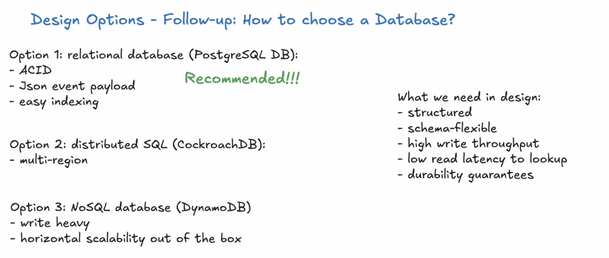
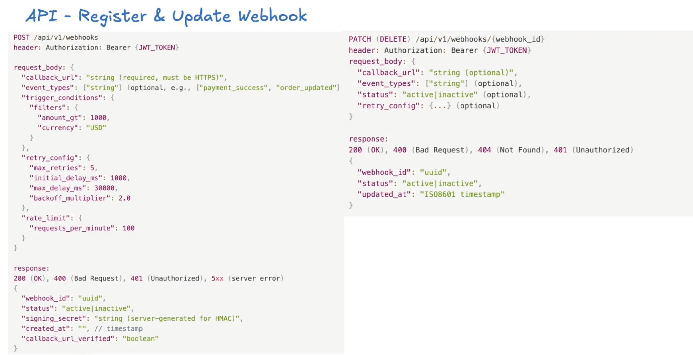
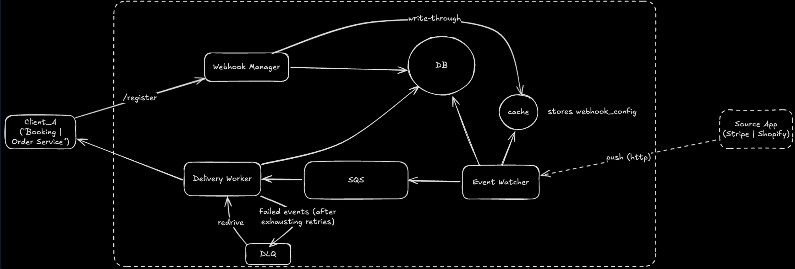
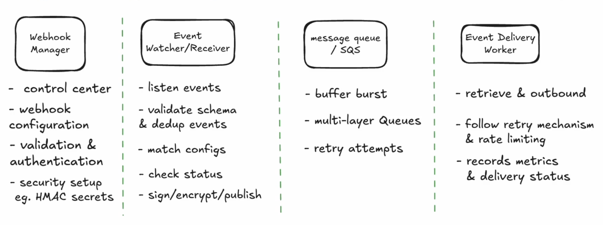

# Webhook Delivery System — Last-Minute Notes

> **One-line thesis:** *Ingestion is a write-durability problem; delivery is a fault-tolerant retry problem. Decouple them with a durable queue, and the invariant is "once ACK'd, delivered at-least-once or explicitly dead-lettered."*

---

## 1. Requirements (~5 min)


### Clarify

1. What types of events trigger webhooks? (user actions, system events, third-party integrations)
2. Expected volume of events? (millions vs billions per day)
3. Delivery guarantees needed? (at-least-once, exactly-once)
4. Event ordering requirements? (strict ordering within a client, or best-effort)
5. Latency requirements? (sub-second, minutes acceptable)
6. Security requirements? (encryption in transit, payload signing)

The answers shape fundamental design decisions:

1. High throughput + low latency → Consider streaming (Kafka) over queuing (SQS)
2. Strong security requirements → Plan for HMAC signing and payload encryption
3. Strict ordering → Partition by client to maintain order within each client's events

### Functional (top 3, prioritized) 

1. **Manage webhooks (CRUD)** — clients register a callback URL + event-type filter + retry policy; update or delete.
2. **Deliver events** — when a source emits an event, POST it to every registered endpoint subscribed to that event type.
3. **Filter by event type** — clients subscribe to a subset (e.g. `payment.succeeded`, not `payment.created`).

### Non-Functional (top 5, quantified)

| NFR | Target | Why it drives design |
|---|---|---|
| **Durability** | Zero loss once ACK'd | Ingestion must persist *before* returning 200 → outbox/queue, not fire-and-forget |
| **Delivery guarantee** | At-least-once | Exactly-once is impractical → push idempotency to the client via `event_id` |
| **Scalability** | 1B events/day ≈ 11.5K/s avg, ~35K/s peak (3×) | SQS suffices; Kafka is over-engineering here |
| **Fault tolerance** | Exponential backoff + DLQ | Client endpoints are untrusted/flaky — retries are the norm, not the exception |
| **Security** | HMAC-signed payloads, HTTPS, replay protection | Clients must *verify* authenticity without trusting the network |

**CAP stance:** This is **AP for delivery** (availability + retries win; we tolerate delivery lag) but **CP for the config/registry** (a stale subscription must not silently drop events). Split consistency by subsystem.

**Estimation note:** The only number that changes a decision is throughput. 35K/s peak is comfortably within a partitioned SQS + autoscaling worker fleet — *no Kafka needed*. I won't front-load storage math.

*DDIA Ch. 11 (Stream Processing): webhook delivery is fundamentally the "reliable message delivery to external consumers" problem — the queue is the log, the worker is the consumer, the callback is the sink.*

---

## 2. Core Entities (~2 min)

- **Webhook** — a client's registered subscription (callback URL, event-type filter, signing secret, retry config, status).
- **Event** — an immutable record emitted by a source (type, payload, timestamp). The source of truth for replay.
- **Delivery** — the *attempt* to send one Event to one Webhook. This is the many-to-many join and the unit of retry/observability.
- **Source** — the authenticated producer (e.g. the payments service) emitting events.

> **Key modeling insight:** `Delivery` is a first-class entity, not a field on Event. One event fans out to N webhooks; each has its own independent status, attempt count, and error. Collapsing these loses per-endpoint retry state.



```
-- Webhook registrations
CREATE TABLE webhooks (
    id UUID PRIMARY KEY,
    client_id UUID NOT NULL,
    callback_url TEXT NOT NULL,
    signing_secret TEXT NOT NULL,
    event_types TEXT[] NOT NULL,
    status VARCHAR(20) DEFAULT 'active',
    retry_config JSONB,
    created_at TIMESTAMP DEFAULT NOW(),
    updated_at TIMESTAMP DEFAULT NOW()
);

CREATE INDEX idx_webhooks_client_event ON webhooks(client_id, event_types);

-- Event log (for auditing and replay)
CREATE TABLE events (
    id UUID PRIMARY KEY,
    source_id UUID NOT NULL,
    event_type VARCHAR(100) NOT NULL,
    payload JSONB NOT NULL,
    created_at TIMESTAMP DEFAULT NOW()
) PARTITION BY RANGE (created_at);

-- Delivery tracking
CREATE TABLE deliveries (
    id UUID PRIMARY KEY,
    event_id UUID NOT NULL REFERENCES events(id),
    webhook_id UUID NOT NULL REFERENCES webhooks(id),
    status VARCHAR(20) NOT NULL,  -- pending, success, failed
    attempts INT DEFAULT 0,
    last_attempt_at TIMESTAMP,
    last_error TEXT,
    created_at TIMESTAMP DEFAULT NOW()
);

CREATE INDEX idx_deliveries_status ON deliveries(status, webhook_id);

```
---

## 3. API / Interface (~5 min)




REST over plural nouns. **Identity is derived from the auth token — never from the body.**

**Management plane** (client-facing, JWT auth):

```
POST   /api/v1/webhooks          → register (returns webhook_id + signing_secret)
PATCH  /api/v1/webhooks/{id}     → update url / filters / retry / status
DELETE /api/v1/webhooks/{id}     → 204
GET    /api/v1/webhooks/{id}/deliveries?status=failed → observability
```

Register response returns the **`signing_secret` exactly once** (`whsec_...`) — the client stores it to verify inbound HMACs.

**Ingestion plane** (source-facing, API-key + HMAC auth):

```
POST /api/v1/events
  Authorization: Bearer {source_api_key}
  X-Source-Signature: sha256=HMAC(source_secret, body)
  X-Source-Timestamp: {unix}
  { event_id, event_type, data, timestamp }
```

**Outbound to client** (what a worker sends):

```
POST {callback_url}
  X-Webhook-Signature: sha256={HMAC(signing_secret, timestamp + "." + body)}
  X-Webhook-Timestamp: {unix}
  X-Webhook-Id / X-Event-Id
```

---

## 4. Data Flow (~3 min)

The two-plane split is the whole design. **Ingestion path stays hot and simple; delivery path absorbs the flakiness.**

```
Source → Event Watcher → [persist Event + enqueue Delivery tasks] → 200 to source
                                    ↓
                          Queue (partitioned by client_id)
                                    ↓
                          Delivery Workers → POST callback → 2xx? done : retry/DLQ
```

The critical seam: **the source gets its 200 the moment the event is durably enqueued** — not when clients are reached. Delivery happens asynchronously behind the queue.

```
The webhook system is a standalone intermediary between source applications and clients:

Source Application (e.g., Stripe)

Generates events based on its domain logic
Sends events to webhook system via our ingestion API
Doesn't manage delivery - that's our job
Webhook System (what we're designing)

Receives events from sources
Manages webhook registrations (which clients want which events)
Handles reliable delivery with retries
Provides delivery tracking and observability
Client (e.g., Amazon's backend)

Registers webhooks with callback URLs
Receives HTTP POST requests when events occur
Verifies signatures and processes events
Returns 200 OK to acknowledge receipt
```
---

## 5. High-Level Design (~12 min)




### Core Components

#### Webhook Manager

The central registry for all webhook configurations:

- Exposes REST APIs for CRUD operations on webhooks
- Validates callback URLs (HTTPS required, DNS resolvable, reachable)
- Generates signing secrets for HMAC verification
- Stores configurations in database with Redis cache for fast lookups

#### Event Watcher (Ingestion Service)

Horizontally scalable service that receives events from source applications:

- Accepts events via HTTP POST with authentication
- Validates event schema and checks for duplicates
- Matches events to subscribed webhooks using cached subscription data
- Publishes delivery tasks to appropriate queues

#### Message Queue

Provides reliable, scalable event processing with multiple tiers:

- **High Priority Queue:** Critical events (payments, security alerts)
- **Standard Queue:** Regular business events
- **Dead Letter Queue (DLQ):** Events that exhausted all retries

AWS SQS is sufficient for most webhook systems. Kafka is overkill unless you need ultra-high throughput (millions of events per second) or complex stream processing.

##### Queue vs Stream: When to Use Which

| Dimension | Queue (SQS) | Stream (Kafka) |
|---|---|---|
| Consumption | Message deleted on ack | Retained log, replayable |
| Fan-out | One consumer per message | Many consumer groups |
| Ordering | Per-MessageGroupId (FIFO) | Per-partition |
| Best for | Task distribution, retries | Replay, multi-consumer, high-throughput streams |

#### Delivery Worker

Consumes from queues and delivers events to callback URLs:

- Retrieves event data and webhook configuration
- Generates HMAC signature for payload verification
- Sends HTTP POST with configurable timeout (e.g., 10 seconds)
- Handles responses: success (2xx), client error (4xx), server error (5xx)
- Implements retry logic with exponential backoff

#### Monitoring & Alerting

Essential for operational visibility:

- Health checks for all internal components
- Metrics: throughput, latency, queue depth, error rates
- Alerts on worker failures and DLQ growth




**Endpoint-by-endpoint build:**

- **`POST /events` (ingestion)** → Event Watcher authenticates the source (API key + HMAC + timestamp window), dedupes on `event_id`, matches subscriptions via a **Redis-cached** view of webhooks (never hit the DB per delivery), writes the event durably, and enqueues one delivery task per matching webhook. **Returns 200 the instant the event + tasks are durable.**
- **Queue** → partitioned by `client_id` so a hot client can't head-of-line block everyone else. Three logical tiers: high-priority (payments/security), standard, and the DLQ.
- **Delivery Workers** → stateless, autoscale on queue depth. Each pulls a task, fetches config from Redis, HMAC-signs the payload, POSTs with a ~10s timeout, and interprets the response code.
- **`POST /webhooks` (management)** → Webhook Manager validates the URL (HTTPS + DNS-resolvable + reachable), mints the `signing_secret`, writes config to Postgres, and warms the Redis cache.

**The durability seam (the key invariant):** the source's 200 means "durably accepted," *not* "delivered." This is the transactional-outbox idea — the event write and the enqueue must be atomic, or a crash between them silently drops deliveries.

*DDIA Ch. 11: this is the classic "dual write" hazard. Writing to the DB and the queue as two independent operations is not atomic — use an outbox table drained by CDC, or write the event and let a poller enqueue, so the queue never diverges from the log.*

---

## 6. Deep Dives (~12 min)

### 6.1 Durability — the outbox pattern

Naively, the Event Watcher does two writes: `INSERT event` then `SQS.send()`. If it crashes between them, the event is persisted but never delivered — a silent loss that violates NFR5.

**Fix:** write the event *and* its delivery rows in one DB transaction to an outbox, then a separate relay (CDC/Debezium or a polling sweep) publishes to SQS. Now the DB is the single source of truth; the queue is derived. At-least-once falls out naturally — a relay crash re-publishes, and workers/clients dedupe on `event_id`.

### 6.2 Fault tolerance — retries, backoff, DLQ

The response code drives the state machine:

| Response | Action |
|---|---|
| `2xx` | Mark delivered, done |
| `4xx` (except 429) | **Don't retry** — the integration is broken, client must fix |
| `429` | Retry with a *longer* delay (respect their rate limit) |
| `5xx` / timeout / network | Retry with exponential backoff |

Backoff schedule with **jitter** (`delay = base[attempt] × (0.5 + rand)`) to prevent a thundering herd when a client's endpoint recovers — every queued delivery must not stampede simultaneously. After ~5 attempts over ~24h, the delivery lands in the **DLQ**: marked `failed`, ops alerted, exposed to the client via the deliveries API for manual replay.

*DDIA Ch. 8 (Trouble with Distributed Systems): the network is unreliable and endpoints are untrusted. Timeouts are indistinguishable from slow success — which is exactly why at-least-once + client idempotency is the only honest guarantee.*

### 6.3 The sequence — full delivery lifecycle

The lifeline order above is the whole guarantee: the source is released at "200 (durable)" — everything to the right of that happens asynchronously and can fail, retry, and recover without the source ever knowing.

### 6.4 Security — HMAC in both directions

Symmetric problem, two secrets:

- **Inbound (source → us):** source signs with its `source_secret`; we verify the HMAC, check the timestamp is within a 5-min window (replay protection), and confirm the event type is allowed for that source.
- **Outbound (us → client):** we sign `timestamp + "." + body` with the webhook's `signing_secret`; the client recomputes and compares. This lets clients trust the payload **without trusting the network** — a MITM can't forge a valid signature.

Plus: HTTPS everywhere, periodic secret rotation (support two active secrets during the overlap), per-source rate limiting, optional IP allowlisting.

*DDIA Ch. 9 touches on why you can't trust wall-clock time across machines — hence the timestamp window is generous (5 min) and paired with the HMAC, not relied on alone.*

### 6.5 Scalability — hot clients and hot sources

**Hot client (drowning in deliveries):** per-`client_id` queue partitioning isolates blast radius; **adaptive rate limiting** cuts a client's delivery rate in half when their p95 latency > 5s or error rate > 5%; clients can also self-declare a max rate at registration.

**Hot source (Black Friday burst):** Event Watcher autoscales on ingestion rate; enforce a baseline source rate, alert at 3×, throttle at 10×; apply **backpressure** by returning 429 to the source when queues saturate; batch multiple events per queue message under extreme load.

**Storage:** `events` table is **range-partitioned by `created_at`** (old partitions archived to cold storage); read replicas absorb the deliveries-API query load; separate the config DB from the high-write event log.

### 6.6 Ordering (the trade-off to name out loud)

Default is **best-effort** ordering. Strict per-client ordering requires a **single queue per client processed sequentially** — which caps that client's throughput at one in-flight delivery. Offer it as opt-in, not default; most webhook consumers (Stripe, GitHub) explicitly *don't* guarantee order and tell clients to reconcile via timestamps/event IDs.

*DDIA Ch. 8 & 11: total order is expensive. Partitioned ordering (order within a client, not globally) is the pragmatic middle — the same trade-off Kafka makes with per-partition ordering.*

---

## Data Model (design-relevant fields only)

- **webhooks**: `id, client_id, callback_url, signing_secret, event_types[], status, retry_config(jsonb)` — index on `(client_id, event_types)` for match lookups (cached in Redis).
- **events**: `id, source_id, event_type, payload(jsonb), created_at` — **partitioned by range(created_at)**; immutable, enables replay.
- **deliveries**: `id, event_id→events, webhook_id→webhooks, status(pending/success/failed), attempts, last_attempt_at, last_error` — index on `(status, webhook_id)` for the deliveries API and DLQ sweeps.

**Why a separate `deliveries` table:** one event → N webhooks is a many-to-many with *independent* per-endpoint retry state. Folding delivery status into `events` would lose the ability to retry one endpoint while another already succeeded.

---

## 🌍 Real-World Anchor

**Stripe / GitHub / Twilio** all converge on the exact same contract: **at-least-once delivery + HMAC-signed payloads + client-side idempotency on `event_id`**. Stripe's `Stripe-Signature` header (timestamp + v1 HMAC) is the canonical outbound-signing design mirrored here. GitHub's webhook redelivery UI is the DLQ-replay API made visible. None of them promise exactly-once or strict ordering — they push both to the client, which is the senior-correct call: *the guarantee you can actually keep is the one you should advertise.*

Bytebytego's notification/webhook case studies reinforce the two-plane split — fast durable ingestion decoupled from flaky asynchronous fanout via a queue — as the reference architecture.

---

## 📚 DDIA Anchors

- **Ch. 11 (Stream Processing)** — queue-as-log, the dual-write hazard, transactional outbox, at-least-once semantics.
- **Ch. 8 (Distributed Systems)** — unreliable networks, timeouts indistinguishable from slow success → why retries + idempotency are mandatory.
- **Ch. 9 (Consistency & Consensus)** — clock untrustworthiness → timestamp windows for replay protection.
- **Ch. 5–6 (Replication & Partitioning)** — partition by `client_id` for isolation; range-partition events by time.

---

## 🔍 Senior-Signal Questions to Ask in Your Interview

- **"Is the event-write and the enqueue atomic, or is this a dual write?"** → *Why it matters: catching the outbox hazard unprompted is the single strongest durability signal — it separates people who've built delivery systems from people who've read about them.*
- **"What's our actual delivery guarantee, and where does idempotency live?"** → *Why it matters: naming at-least-once + client-side dedup (rather than hand-waving 'exactly-once') shows you understand what guarantees are physically keepable.*
- **"How do we isolate a hot client from starving everyone else?"** → *Why it matters: per-client partitioning + adaptive rate limiting demonstrates blast-radius thinking, not just happy-path throughput.*
- **"How do 4xx vs 5xx vs 429 differ in the retry state machine?"** → *Why it matters: retrying a 4xx is a classic junior mistake — the response-code taxonomy proves you understand that not all failures are transient.*
- **"Do we guarantee ordering, and what does it cost?"** → *Why it matters: articulating the per-client-sequential-queue throughput trade-off (and choosing best-effort by default) is exactly the kind of trade-off framing interviewers probe for.*
- **"How do we prevent a thundering herd when a downed endpoint recovers?"** → *Why it matters: jittered backoff is a small detail that signals you've operated systems under real failure, not just designed them on paper.*