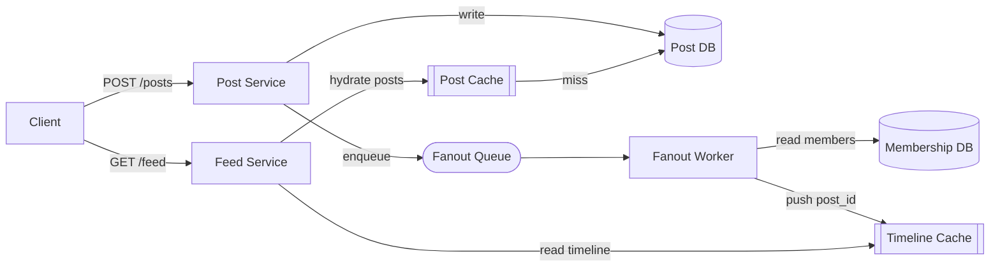
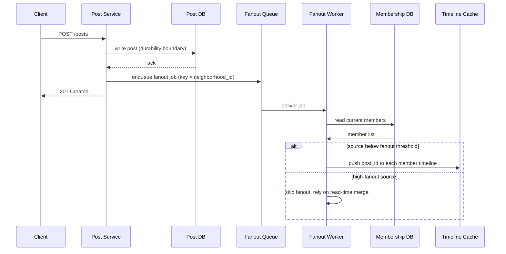
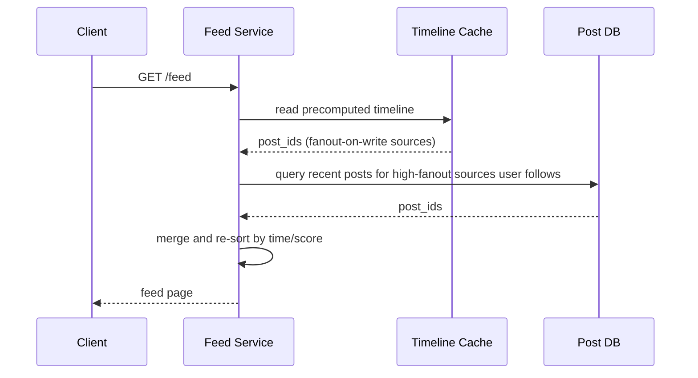

# Design a Nextdoor Feed (Timeline) System

**Organizing thesis:** this is a *hybrid neighborhood feed* — not a pure social graph (Twitter follow-graph) and not a pure recommendation surface. Nextdoor's feed is scoped by **geography first, social graph second** (follows/joins within a neighborhood), which changes the fanout math: fanout is bounded by neighborhood size, not global follower count, so "celebrity" problems show up as *high-activity neighborhoods*, not high-follower users. I'll design it as a hybrid fanout system and call out where geo-scoping changes the classic Twitter answer.

---

## 1. Requirements

### Functional Requirements
Prioritized top 3:
1. **Post content** (create/delete) to a neighborhood — text, photo, category (safety, for-sale, recommendation, event)
2. **Follow/join** a neighborhood or a specific neighbor; **fetch feed** — a ranked, paginated stream of nearby posts
3. **Feed composition signals**: pin (moderator/official alerts), dedup, and ad/recommendation insertion

Clarifying questions I'd ask the interviewer, then commit to assumptions:
- "Is the feed strictly reverse-chronological, or ranked?" → **Assume ranked** (recency + engagement + proximity), since Nextdoor visibly does this — but I'll design the reverse-chron *inbox* first and layer ranking on top, because ranking is a re-sort of a candidate set, not a different storage model.
- "Does a user belong to one neighborhood or many (overlapping, nearby)?" → **Assume a user can belong to 1 primary + a few adjacent neighborhoods** (bounded fan-in, not unbounded like Twitter follows).
- "Do posts need real-time delivery (push notification) or is polling on app-open acceptable?" → **Assume polling/pull is the primary read path**; push notifications are a separate concern (not in scope for the core feed).

### Non-functional Requirements
- **Latency**: `GET /feed` p99 < 200ms (this is the dominant UX metric — read-heavy).
- **Read/write ratio**: heavily read-skewed. Estimate ~100:1 to 1000:1 reads:writes (users check the feed far more than they post) — this single ratio is the reason fanout-on-write is the default, not an afterthought.
- **Availability over strict consistency** for the feed itself (CAP: AP). A stale feed for a few seconds is fine; a down feed is not. *Contrast*: follow/unfollow and post delete should converge quickly (bounded staleness, not strict consistency) — nobody should see a post from someone they just unfollowed reappear on refresh.
- **Scalability**: bursty by geography — a local emergency (fire, break-in alert) causes a spike of posts + reads *within one neighborhood* in minutes. The system must isolate hot neighborhoods so they don't degrade unrelated ones (partition-key choice matters here).
- **Fault tolerance**: feed-serving must degrade gracefully — if ranking/cache is down, fall back to reverse-chron from the DB rather than error.

*Capacity estimation deferred*: I'll do the one number that actually changes a decision — neighborhood fanout size — inline in the fanout deep dive, rather than front-loading QPS/storage math that doesn't change the design.

---

## 2. Core Entities

- **User** — belongs to one or more Neighborhoods
- **Neighborhood** — geographic/social scope (this is Nextdoor's key entity that Twitter doesn't have)
- **Post** — authored by a User, scoped to a Neighborhood, has category/pin flags
- **Follow / Membership** — User↔Neighborhood (join) and optionally User↔User (follow a specific neighbor)
- **Timeline/Inbox entry** — the per-user materialized feed row (if fanout-on-write)

---

## 3. API / System Interface

REST, plural resources, current user derived from auth token (never trust a body/path `user_id` for identity):

```
POST   /posts                     { neighborhood_id, body, media, category }
DELETE /posts/{post_id}
POST   /neighborhoods/{id}/join
DELETE /neighborhoods/{id}/join   (leave)
POST   /users/{id}/follow
DELETE /users/{id}/follow
GET    /feed?cursor=...&limit=20  (neighborhood scope resolved server-side from the auth'd user's memberships)
```

`GET /feed` takes an **opaque cursor**, not an offset — pagination detail covered in Deep Dives.

---

## 4. High-Level Design

I'll build this endpoint-by-endpoint, starting simple: **fanout-on-write** (push model) as the default, because the read/write ratio (~100–1000:1) makes precomputing the feed at write time far cheaper in aggregate than recomputing it on every read.

**Write path (`POST /posts`)**: write the post to the Post DB (source of truth), then enqueue a fanout job. A worker reads the author's neighborhood membership list and pushes the post ID into each member's Timeline (a sorted set / inbox) in a cache.

**Read path (`GET /feed`)**: read the user's precomputed Timeline (already sorted by time/score) from cache, hydrate post bodies from the Post DB (or a post cache), return.



**State changes per request:**
- `POST /posts` → row in **Post DB** (`post_id`, `author_id`, `neighborhood_id`, `body`, `created_at`, `pinned`), message in **Fanout Queue**, eventually N writes into **Timeline Cache** (one sorted-set entry per member).
- `GET /feed` → read-only against **Timeline Cache** + **Post Cache**; no writes.
- `POST /follow` / `join` → row in **Membership DB**; does *not* immediately touch existing timelines (handled in Deep Dives).

I'm keeping ranking out of the high-level design — the Timeline Cache here is reverse-chronological. Ranking is a re-scoring pass over this candidate set, layered on in Deep Dives so the core write/read loop stays simple first.

---

## 5. Data Flow

The write path is the one with a meaningful multi-step sequence worth walking end-to-end (the read path is a single hop: cache → hydrate). Ordered steps for `POST /posts`:

1. **Client submits post** → Post Service authenticates the request (user identity from the auth token, not the body).
2. **Persist to Post DB** — this is the durability boundary. Once this write is acknowledged, the post exists, independent of anything downstream.
3. **Enqueue a fanout job** onto the Fanout Queue, keyed by `neighborhood_id` (not `post_id` or `author_id` — see 6.6 for why).
4. **Fanout Worker consumes the job** → reads current membership for the neighborhood from the Membership DB (not a stale cache — see 6.5).
5. **Check high-fanout threshold** — if the source (author or neighborhood) exceeds the member-count threshold, skip step 6 for that source entirely (it'll be picked up on read instead — see 6.2).
6. **Push `post_id` into each member's Timeline Cache** (`ZADD user:{id}:timeline`), trimmed to a bounded window.
7. **Post Cache is write-through populated** at step 2 time (we already have the object in hand — cheaper than waiting for a read-miss).



Two things worth calling out explicitly: the client gets a **201 the moment the DB write is acknowledged** — fanout is fully asynchronous, so a slow or backlogged Fanout Queue never blocks the author's own request. And the durability boundary (step 2) is deliberately separate from the delivery boundary (steps 3–6): if the Fanout Worker crashes mid-job, the post isn't lost — it's just not yet visible to members, and the queue redelivers.

---

## 6. Deep Dives

### 6.1 Fanout-on-write vs. fanout-on-read, and why geo-scoping changes the classic answer

*DDIA framing*: this is the read-path vs. write-path materialization trade-off — do you pay the fanout cost once at write time (denormalize now, read cheap later) or every time at read time (normalize, recompute always)?

- **Fanout-on-write** (push): cheap reads, but write cost scales with follower/member count. Classic Twitter failure mode: a celebrity with 50M followers turns one tweet into 50M writes.
- **Fanout-on-read** (pull): cheap, bounded writes; reads must merge across all followed/joined sources at request time — expensive when a user follows many sources.

**Nextdoor's geo-scoping caps the blast radius on the write side.** A neighborhood typically has hundreds to low-thousands of active members, not millions — so fanout-on-write's worst case here is nowhere near Twitter's celebrity problem. I'd lead with: **"the neighborhood-membership cap is the reason I default to pure fanout-on-write rather than immediately reaching for hybrid."**

Where the hybrid *does* still apply: a **city-wide or regional "Nextdoor Official" / moderator account**, or a viral neighborhood post that crosses into adjacent-neighborhood recommendations — those are the actual high-fanout cases here, not individual users.

### 6.2 Hybrid handling for high-fanout sources (regional accounts, viral posts)

For any source whose membership/follower count exceeds a threshold (say >10K, tunable):
- **Skip fanout-on-write** for that source. Mark it in a small "high-fanout sources" set (cached, low cardinality — cheap to check on every post).
- On read, **merge** the user's fanout-on-write timeline (from cache) with a **fanout-on-read query** against the small set of high-fanout sources the user follows (query recent posts by `author_id IN (...)` with an index on `(author_id, created_at)`).



This bounds write amplification to the common case (small neighborhoods) while keeping the rare high-fanout case cheap on the read side, since there are few such sources per user.

### 6.3 Caching and invalidation

- **Timeline Cache** (Redis sorted set per user, `ZADD user:{id}:timeline created_at post_id`): populated by the fanout worker; trimmed to a bounded window (e.g. last 1000 entries) to cap memory — old entries fall back to DB on deep pagination.
- **Post Cache**: read-through cache keyed by `post_id`; write-through on create (populate on write, since we already have the object), invalidate on delete/edit.
- **Invalidation on delete**: deleting a post doesn't need to walk every timeline and remove the ID — cheaper to leave the ID in timelines and have the Feed Service **tombstone-check** on hydration (Post Cache/DB returns "deleted", Feed Service filters it out). This trades a tiny bit of read-time filtering for avoiding an expensive reverse-fanout delete.

### 6.4 Cursor pagination (time + ID, Snowflake)

Offset pagination (`?page=3`) breaks under concurrent inserts (items shift, causing skips/dupes) — classic trap. Use an **opaque cursor encoding `(timestamp, post_id)`**:
- If `post_id`s are **Snowflake IDs** (64-bit: timestamp + shard + sequence, monotonically increasing and roughly time-ordered), the cursor can be *just* the last-seen `post_id` — timestamp is implicit in the ID, and ties within the same millisecond are broken by ID order, giving a stable total order without a separate tiebreaker field.
- `GET /feed?cursor=<post_id>&limit=20` → `WHERE post_id < cursor ORDER BY post_id DESC LIMIT 20` (or the cache equivalent: `ZREVRANGEBYSCORE` with the cursor as the upper bound).
- This is what makes the ranked-feed merge in 5.2 safe too: even after merging fanout-on-write + fanout-on-read results and re-sorting, the cursor for the *next* page is just "the lowest score/id returned in this page" — no server-side session state needed.

### 6.5 Consistency with follow/unfollow and join/leave changes

Per the non-functional requirement above: this needs **bounded staleness, not strict consistency**, but "I unfollowed someone and their post is still in my feed 10 minutes later" is a bad UX bug, not an acceptable eventual-consistency artifact. Two levers:

1. **Backward (unfollow doesn't retroactively scrub old timeline entries)**: acceptable — matches DDIA's point that undoing a denormalized write is expensive and usually not worth it. The unfollowed user's *old* posts staying visible briefly is a soft failure.
2. **Forward (new posts from an unfollowed source must stop appearing immediately)**: the fanout worker must read **current** membership at fanout time, not a stale cached copy — so Membership DB reads on the write/fanout path should not go through a long-TTL cache, or should be invalidated synchronously on follow/unfollow (small write, can afford strong consistency there since membership changes are low-QPS relative to posts).

*DDIA Ch. 5*: this is the same shape as replication lag — decide **per data type** which staleness is tolerable (posts: seconds; membership-affecting-future-writes: as close to immediate as possible) rather than one global consistency policy.

### 6.6 Rate limiting, degradation, disaster recovery

- **Rate limiting**: per-user token bucket on `POST /posts` (prevents spam floods that would each trigger a fanout job); per-neighborhood rate awareness so one hot neighborhood's burst doesn't starve the shared Fanout Queue — partition the queue by `neighborhood_id` (not `post_id`, to keep a neighborhood's posts ordered, and not `author_id`, which doesn't bound the hot-neighborhood case) so one hot partition degrades only that neighborhood's fanout latency, not the whole queue.
- **Graceful degradation**: if Timeline Cache is unavailable, `GET /feed` falls back to a direct DB query (`posts WHERE neighborhood_id IN (user's memberships) ORDER BY post_id DESC LIMIT 20`) — slower, but the feed still loads instead of erroring. This is the reverse-chron fallback baked into the design from the start, not bolted on.
- **Disaster recovery**: Timeline Cache is a derived/rebuildable structure (source of truth is Post DB + Membership DB) — losing it entirely means degraded (slow) reads via the DB fallback while a backfill job rebuilds it, not data loss. Post DB itself needs standard durability: replication with `min.insync.replicas` (or equivalent) tuned so a single node loss doesn't lose acknowledged posts.

---

## Real-World Anchor

Bytebytego's feed/timeline case studies (Twitter, Instagram/Meta) converge on exactly this fanout-on-write-with-hybrid-fallback pattern for celebrity accounts — the novelty in Nextdoor isn't the mechanism, it's that **geography does the fanout-capping work that a follower-count threshold does for Twitter**, so the "celebrity" trigger becomes "regional/official account" rather than "high-follower user." Discord's per-guild (vs. global) message fanout is the closer analog: scoping to a bounded group is what keeps fanout-on-write cheap by default.

---

## 🔍 Senior-Signal Questions to Ask in Your Interview

- **"What's the actual distribution of neighborhood sizes?"** → *Why it matters: the whole design's simplicity rests on fanout being bounded by neighborhood size; if a meaningful fraction of neighborhoods are huge (dense urban), the hybrid path stops being an edge case and becomes the common path — worth confirming before committing to "pure fanout-on-write by default."*
- **"Should moderator/pinned posts bypass the ranking merge entirely, or just get a score boost?"** → *Why it matters: pinned content is a placement/consistency guarantee (must appear), not a ranking signal — conflating the two risks a pinned safety alert getting ranked below it during a busy period.*
- **"What happens to a user's feed when they move neighborhoods (change address)?"** → *Why it matters: this is a full timeline invalidation + rebuild, a case fanout-on-write handles poorly — signals whether the interviewer wants a discussion of lazy rebuild vs. eager backfill.*
- **"Is 'bounded staleness' on unfollow good enough for safety-critical categories (crime/safety posts), or does that category need stronger consistency?"** → *Why it matters: shows the candidate doesn't apply one consistency policy uniformly — safety content may warrant a different SLA than "recommendations" or "for sale" posts.*
- **"How do we prevent the Fanout Queue becoming a single point of ordering contention during a neighborhood emergency (everyone posting about the same event)?"** → *Why it matters: probes back-pressure and hot-partition handling under the exact burst scenario the non-functional requirements called out.*