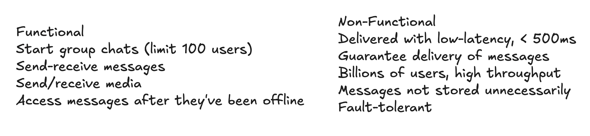
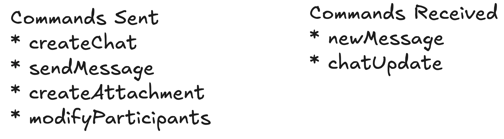
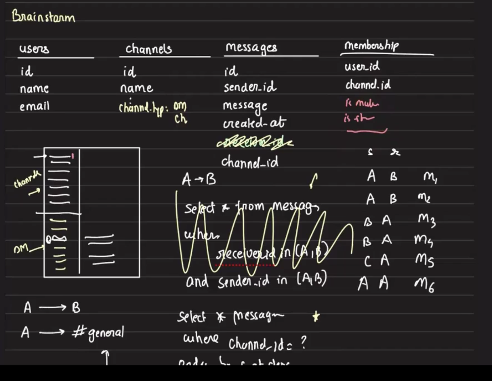
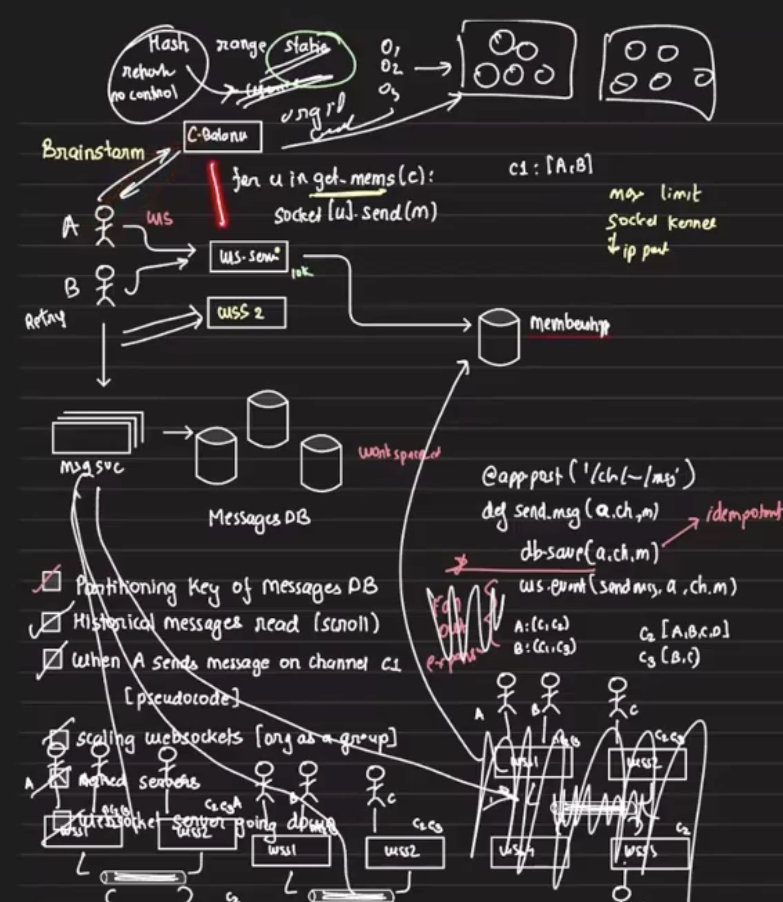
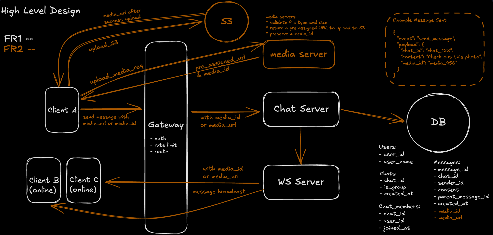
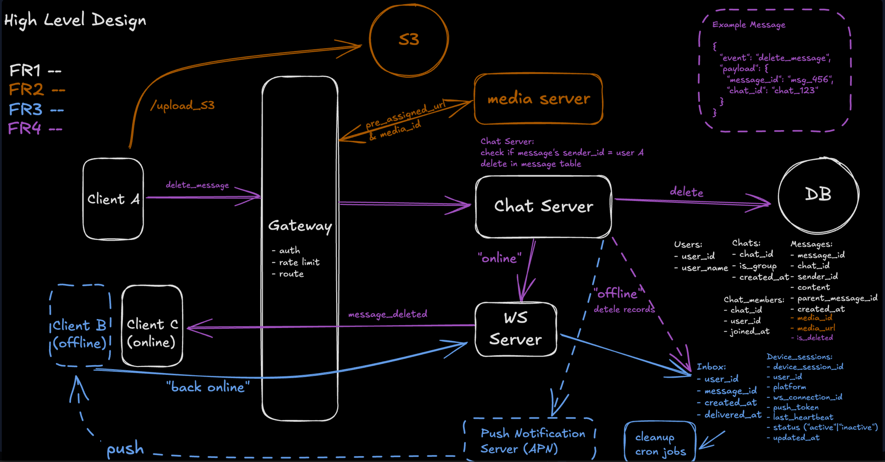
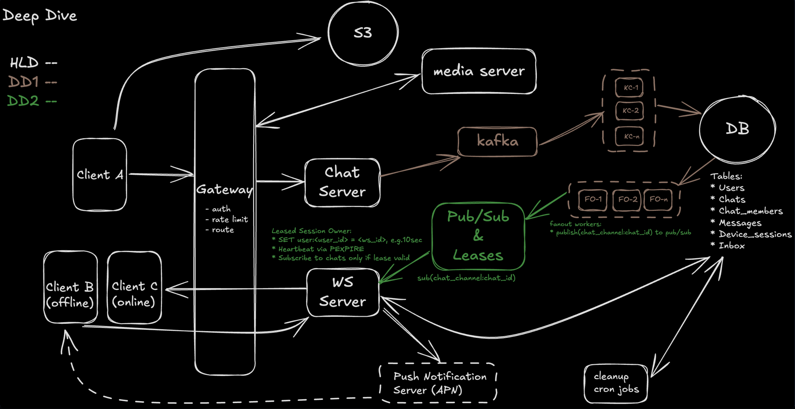
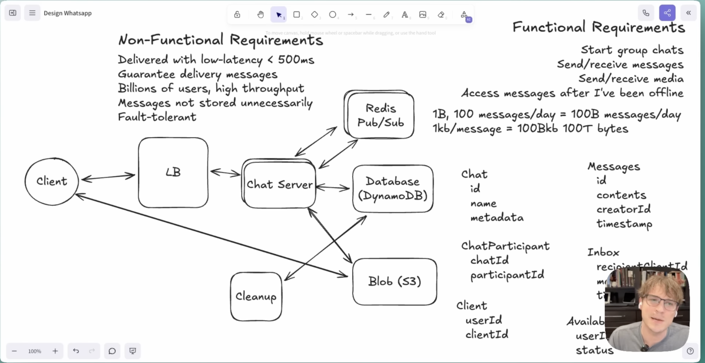

# Design Whatsapp

## 1. Requirements (~5 min)

---

## 3. Core Entities

1. Users: UserId, Metadata
2. Chats (2-100 users): ChatId, Name, Metadata
3. ChatParticipient : ChatId (PK), ParticipientId (GSI)
4. Messages: MessageId, chatId, Contents, UserId, Timestamp
5. Clients (a user might have multiple devices): DeviceID, USerId, IP etc
6. Inbox (Undelivered Messages): UserId, MessageId

## 2. API Design

## High-Level Design (~10–15 min)

### Arpit 

### ShowOffer

---

## Deep Dives (~10 min)

## Best Design