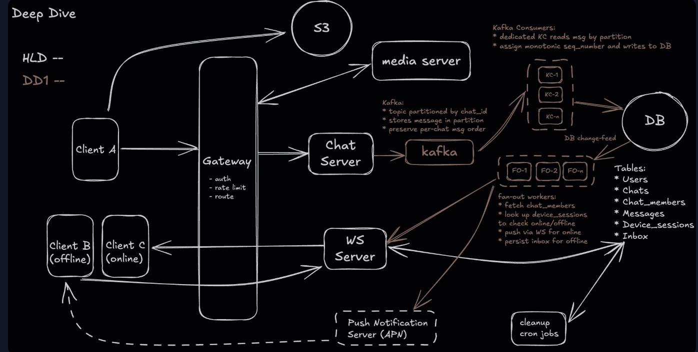

# Design Whatsapp

## 1. Requirements (~5 min)

---

## 3. Core Entities

1. Users: UserId, Metadata
2. Chats (2-100 users): ChatId, Name, Metadata
3. ChatParticipient : ChatId (PK), ParticipientId (GSI)
4. Messages: MessageId, chatId, Contents, UserId, Timestamp
5. Clients (a user might have multiple devices): DeviceID, USerId, IP etc
6. Inbox (Undelivered Messages): UserId, MessageId

## 2. API Design

## High-Level Design (~10–15 min)

### Arpit 

### ShowOffer

---

## Deep Dives (~10 min)

### DD1 — Message Ordering Consistency

**Problem:** `Client → Gateway → Chat Server → WS Server → Devices`. Concurrent sends from different devices/regions interleave by network timing, not intent → out-of-order views in group chats. Amplified at scale.

**Options:**

| Option | Mechanism | Verdict |
|---|---|---|
| 1. Client timestamps | Client stamps time, server trusts it | ❌ Unsynced clocks, spoofable — too fragile |
| 2. Server seq # per chat | Atomic per-chat counter (`chat_456 → seq=502`) at ingestion | ✅ Correct even with concurrent sends; bottleneck unless chat pinned to one shard. Good for medium scale |
| 3. **Kafka ordered ingestion (pick)** | Hash `chat_id` → partition; Kafka enforces per-partition order; consumer assigns `sequence_number`, writes in order | ✅ Horizontal scale (add partitions), decouples ingest from persist, enables async moderation/analytics. Cost: Kafka ops, offsets, retries |

**Key line:** Kafka gives strict order *per partition* — `chat_id` as partition key scopes ordering (Kafka partition key ≈ SQS MessageGroupId analog).

**⚠️ Hot Shard — Celebrity Chat Problem:** `#all-hands` / town-hall / celebrity threads overwhelm one partition + consumer while others idle → back-pressure, tail latency on that chat, stuck fanout. **Mitigate:** dedicated topics for hot chats · hybrid fanout (Redis for high-fanout rooms) · dedicated fanout workers to isolate hot chats. *Always flag hot shards in interview — signals operational maturity.*

*DDIA anchor: Ch. 5 (ordering/replication logs), Ch. 8 (ordering guarantees, total order broadcast via a log).*

---

### DD2 — WebSocket Infra Scalability & Active Session Lookup

**Problem at 100M+ concurrent sessions:** (1) session-populate lookups too expensive per-message, (2) connect/disconnect churn breaks fanout correctness, (3) DB write/read pressure.

#### Bottleneck 1 — Active Session Populate → Pub/Sub Fanout
Don't DB-query per message to find online devices. Instead:
- **Publish once** to `chat_channel:<chat_id>` (Redis Streams / Kafka / NATS)
- **Selective subscription** — each WS server subscribes *only* to channels for its connected users (no global broadcast)
- **Local filtering** — on message arrival, WS server uses local session map to forward; no Redis/DB lookup
- **Offline** — not connected → falls back to inbox update / push notification

#### Bottleneck 2 — WS Server Churn (users moving between nodes)
Risk: stale subscriptions on old server, wasted fanout, subscribe races on rapid reconnect. **Goal: exactly one WS server owns a user's channels.**

| Option | Mechanism | Verdict |
|---|---|---|
| 1. Subscribe-all on connect | On connect, sub to all user's chats via `chat_members` | ❌ Reconnect → two servers subscribed, duplicate fanout, memory pressure |
| 2. **Leased ownership + Redis TTL (pick)** | `SET user:<id> = <ws_id> NX EX 10`, heartbeat `PEXPIRE`; only lease-holder subscribes | ✅ One owner per user, no dupes. Cost: lease-expiry / reconnect-race edge cases |

**Lease flow:** ws-1 sets lease (EX 10) + heartbeats → drop stops heartbeats → lease expires after TTL → reconnect to ws-2, `SET NX` succeeds → ws-2 becomes owner, subscribes → Redis delivers only to ws-2, no wasted fanout to ws-1.

#### Bottleneck 3 — Backend Storage Pressure
Every message = N inbox writes (N recipients) + fanout events → millions writes/sec; reconnect storms hammer `chat_members` / `device_sessions` / recent messages. **Two strategies (enough for interview):**
1. **Horizontal partitioning** — shard `messages` by `chat_id`, `inbox` by `recipient_user_id` (NoSQL / DynamoDB composite keys). Trade-off: cross-shard queries (user's recent chats) via query fanout / index denormalization.
2. **Read-optimized caching** — Redis/Memcached for `user:<id>:chats`, `user:<id>:devices`, `chat:<id>:recent_messages`; update async via CDC. Trade-off: invalidation on membership change, race consistency → tune TTLs.

*DDIA anchor: Ch. 6 (partitioning by key, hot spots), Ch. 11 (stream processing / CDC), Ch. 1 (caching read amplification).*

---

### DD3 — Multi-Device Management

**Problem:** user on phone + laptop + tablet. Must: real-time to all active devices · stay in sync (dedupe, order) · reliable replay on reconnect · no dup/missing fanout.

**Solution: Per-Device Session Registry + Inbox Replay**
1. **Connect** → register `device_sessions:{user_id}:{device_id} → ws_connection` (Redis/in-memory)
2. **Fanout** → WS server looks up *all* active sessions for recipient, sends to each device
3. **Offline fallback** → store in `inbox`, keyed by `(user_id, device_id)` → queued for reconnect
4. **Reconnect** → check inbox for `(user_id, device_id)`, deliver missed, mark delivered

**Dedupe (critical):** same message can arrive twice — WS on one device + inbox replay after reconnect on another. Fix:
- Global unique `message_id` assigned at ingestion
- Client keeps local cache of recent `message_id`s (~1000)
- On receive: new → render + store; seen → silently drop

Consistent UX across reconnects/devices/paths **without** perfect backend dedupe.

*DDIA anchor: Ch. 9 (idempotency / exactly-once via dedupe keys), Ch. 11 (delivery semantics).*

---

## 🔍 Senior-Signal Questions
- **Per-chat ordering vs. global ordering — do we actually need total order across chats?** → *Why: shows you scope ordering to the partition and don't over-pay for global consensus.*
- **What happens during the lease-expiry gap (TTL window) — can messages be missed between ws-1 dropping and ws-2 owning?** → *Why: probes the failure mode of the ownership handoff; inbox replay is the safety net.*
- **How do you detect and rebalance a hot Kafka partition (celebrity chat) in production?** → *Why: hot-spot handling + operational maturity.*
- **Is delivery at-least-once or exactly-once end-to-end, and where does the idempotency boundary live?** → *Why: forces the honest answer — at-least-once backend + client dedupe = effectively-once UX.*
- **On cache/DB divergence (membership change mid-fanout), does a removed member still receive the message?** → *Why: consistency-under-race + invalidation strategy.*

**Real-World Anchor:** Discord uses per-guild routing + Elixir/Erlang sessions for exactly this WS-fanout + presence problem; Slack fronts ingestion with a message log (Kafka-style) to decouple ordering from persistence — the DD1/DD2 split mirrors their production architecture.