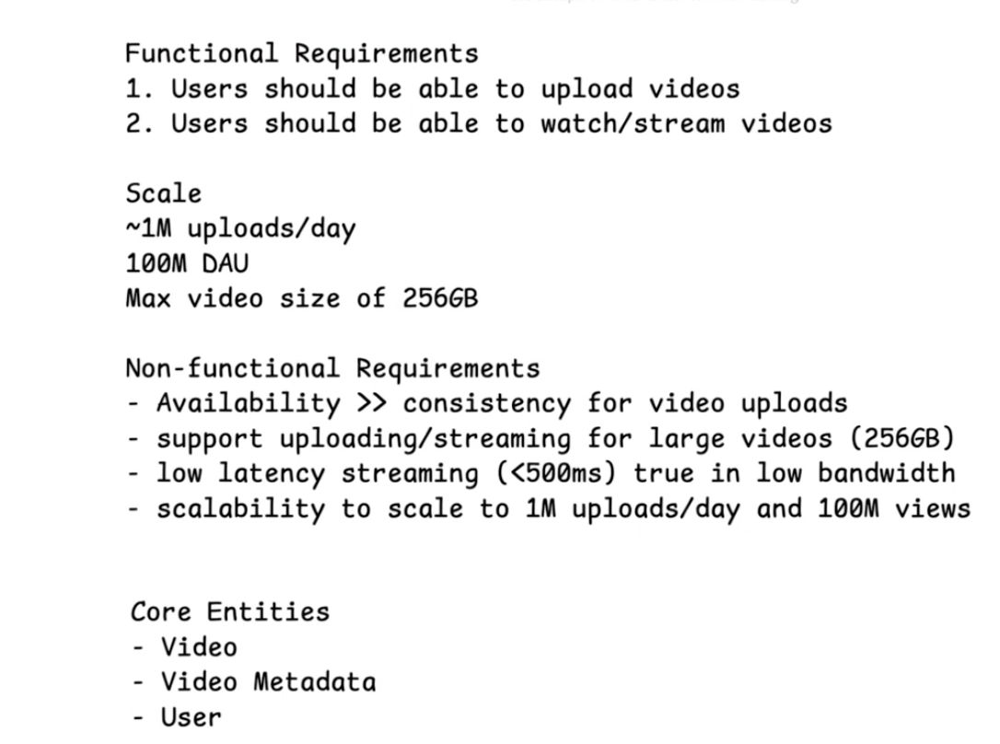
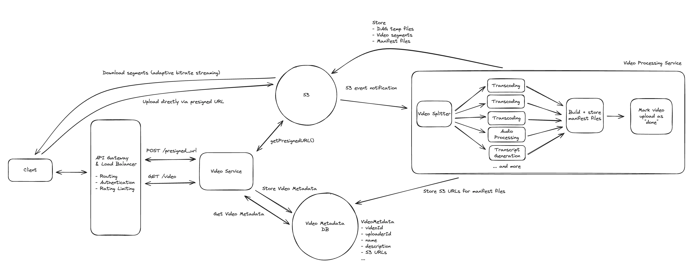

# Design Youtube

## 1. Requirements (~5 min)



## 2. Core Entities (~5 min)

For the video metadata, we are assuming an upload rate of ~1M videos/day. This means, over the course of the year, we'll have ~365M records in the database representing videos. As a result, we should consider storing video metadata in a database that can be horizontally partitioned, such as Cassandra. **Cassandra** offers high availability and enables us to choose a partition key for our data. 

We can partition on the videoId, since we aren't really worried about bulk-accessing videos in this design, just querying individual videos.


## 3. API / Interface (~5 min)

The API is the primary interface that users will interact with. It's important to define the API early on, as it will guide your high-level design. We just need to define an endpoint for each of our functional requirements.

Let's start with an endpoint to upload a video. We might have an endpoint like this:

```
POST /upload
Request:
{
  Video,
  VideoMetadata
}
```

To stream a video, our endpoint might retrieve the video data to play it on device:
```
GET /videos/{videoId} -> Video & VideoMetadata
```


```
{
  "videoId": "vid_123",
  "uploaderId": "user_42",
  "title": "My hiking video",
  "uploadId": "s3-multipart-upload-id",
  "uploadStatus": "UPLOADING",
  "thumbnailUrl": "https://cdn.example.com/videos/vid_123/thumb.jpg",
  "manifestUrl": "https://cdn.example.com/videos/vid_123/master.m3u8",
  "transcriptUrl": "https://cdn.example.com/videos/vid_123/transcript.vtt",
  "createdAt": "2026-07-20T10:00:00Z"
  "chunks": [
    {
      "partNumber": 1,
      "fingerprint": "sha256:ab12cd34...",
      "status": "Uploaded",
      "etag": "\"9b2cf...\""
    },
    {
      "partNumber": 2,
      "fingerprint": "sha256:ef56gh78...",
      "status": "NotUploaded"
    }
  ]
}
```

---

## 4. High-Level Design (~10–15 min)

### Content of Manifest file

```
#EXTM3U
#EXT-X-STREAM-INF:BANDWIDTH=800000,RESOLUTION=640x360
360p/playlist.m3u8
#EXT-X-STREAM-INF:BANDWIDTH=2500000,RESOLUTION=1280x720
720p/playlist.m3u8
#EXT-X-STREAM-INF:BANDWIDTH=5000000,RESOLUTION=1920x1080
1080p/playlist.m3u8
```

And the 720p example file

```
#EXTM3U
#EXT-X-VERSION:3
#EXT-X-TARGETDURATION:4
#EXT-X-MEDIA-SEQUENCE:0

#EXTINF:4.0,
segments/720p/segment-0001.ts
#EXTINF:4.0,
segments/720p/segment-0002.ts
#EXTINF:4.0,
segments/720p/segment-0003.ts
#EXTINF:4.0,
segments/720p/segment-0004.ts
#EXT-X-ENDLIST
```



## 5. Deep Dives

### 1. Background: Manifest Files

Manifest files are text-based documents describing video streams. Two types exist:

- **Primary manifest**: The "root" file listing all available versions (formats) of a video. Points to media manifest files.
- **Media manifest**: Lists links to the small segment files (a few seconds each) for one specific version. Acts as an "index" the player uses to stream segments.

### 2. Handling Large Blobs

Multi-gigabyte video uploads **bypass application servers entirely**:

- Direct-to-S3 uploads via **presigned URLs**
- **Resumable chunked** transfers
- **CDN** distribution for delivery

The same pattern generalizes to any large-file system (photo storage, document sharing, backups).

### 3. Adaptive Bitrate Streaming

Depends on storing video segments in **multiple formats** plus a **manifest file** (built at upload time) that indexes all segment/format combinations. Client streaming logic:

1. Fetch `VideoMetadata`, which contains the manifest's S3 URL.
2. Download the manifest file.
3. Choose a format based on network conditions / user settings, retrieve that segment's URL from the manifest, and download the first segment.
4. Play the segment while downloading subsequent ones.
5. **Adapt** the format as network conditions change — dropping to more compressed, lower-resolution segments when bandwidth falls to avoid playback interruption.

### 4. Upload Chunks vs. Playback Segments

These solve **different problems**:

| | Upload Chunk | Video Segment |
|---|---|---|
| **Purpose** | Transport / resumability | Playback |
| **Sizing** | Fixed-size bytes (e.g. 10 MB) | Time-aligned clips (e.g. 4s) |
| **Created by** | Client | Video Splitter |
| **Used for** | Resuming interrupted uploads | Transcoding (360p/720p), manifest requests |

The backend still splits/repackages the completed video because **upload chunk boundaries aren't guaranteed to be playable video boundaries**.

### 5. Resumable Uploads

1. Client divides the file into **~5–10 MB chunks**, each with a **fingerprint hash**.
2. `VideoMetadata` holds a `chunks` list — each entry a JSON with `fingerprint` and `status`.
3. Client POSTs to the backend to initialize all chunks with status `NotUploaded`.
4. Client uploads each chunk to S3.
5. On part upload, S3 returns a **part number + ETag**; client relays this (e.g. `PATCH /videos/{id}/chunks`) so the server verifies fingerprint/ETag via S3 APIs and marks the chunk `Uploaded`.
6. On `CompleteMultipartUpload`, S3 emits an **exactly-once** object notification (`ObjectCreated:CompleteMultipartUpload`) that kicks off downstream processing; chunk-level progress stays client-driven.
7. **Resume**: client refetches `VideoMetadata` to see uploaded chunks and skip them.

### 6. Hot Videos / Scaling Reads

The read-to-write ratio is **extreme** — a viral video is uploaded once but watched millions of times, creating read hotspots. Mitigations:

- **Cassandra tuning**: replicate metadata across several nodes so multiple nodes can service queries.
- **Distributed cache**: LRU eviction, partitioned on `videoId`, storing popular video metadata to insulate the DB.
- **CDN** distribution for the video content itself.
- **Read replicas** for database read scaling.