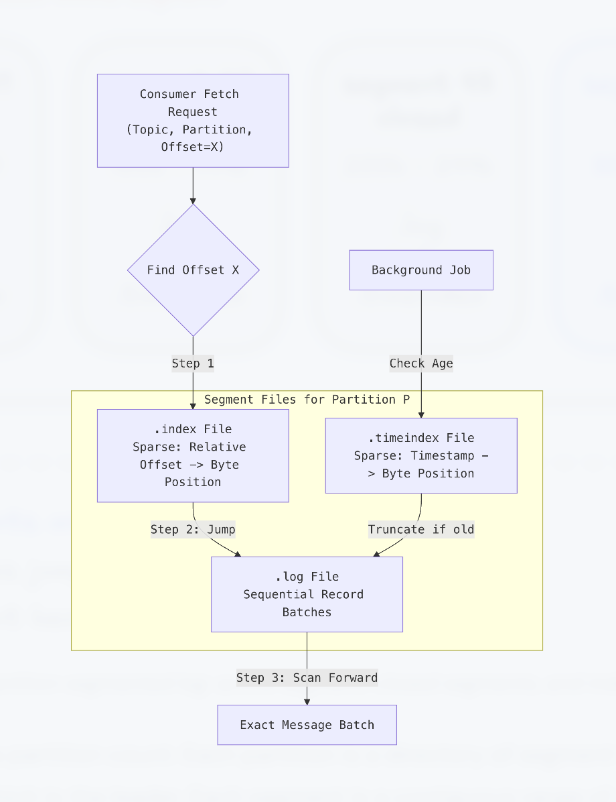
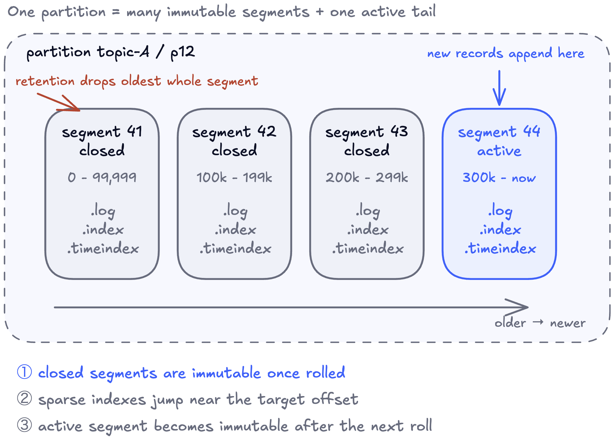
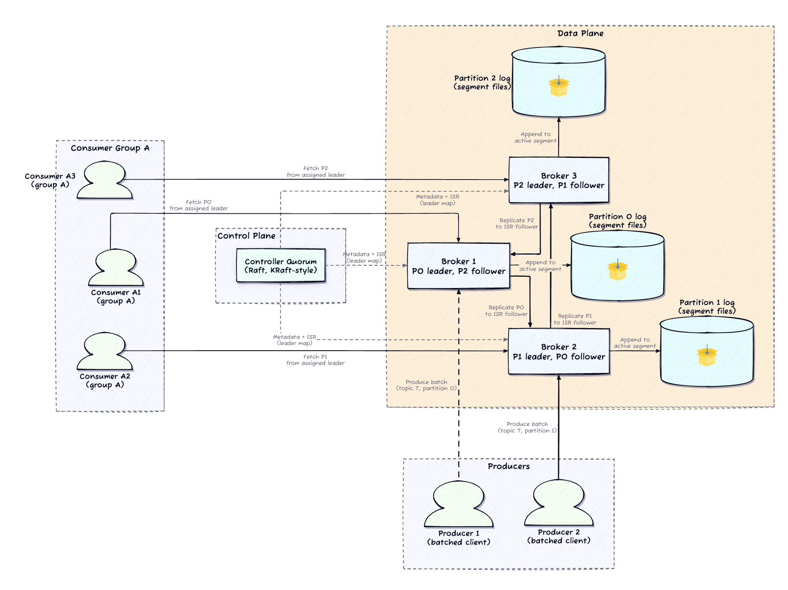
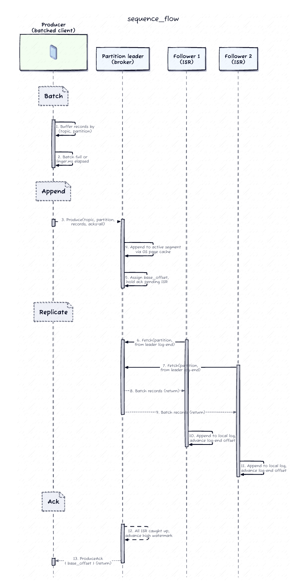
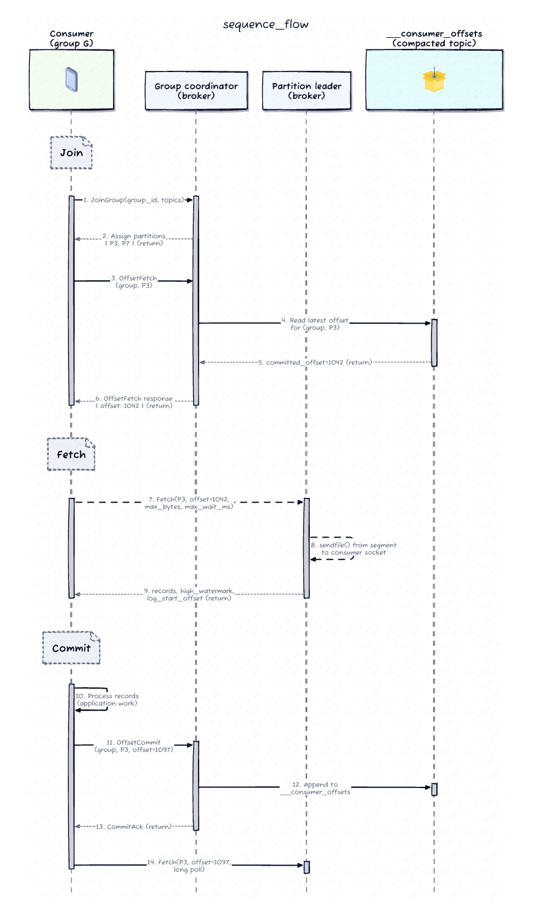
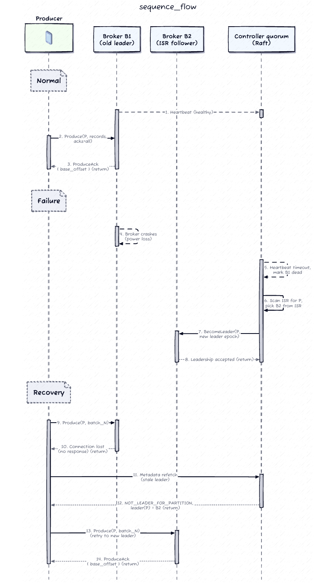
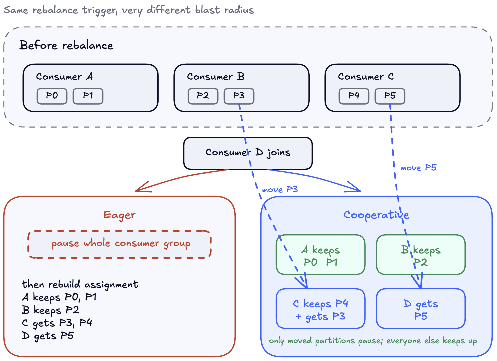
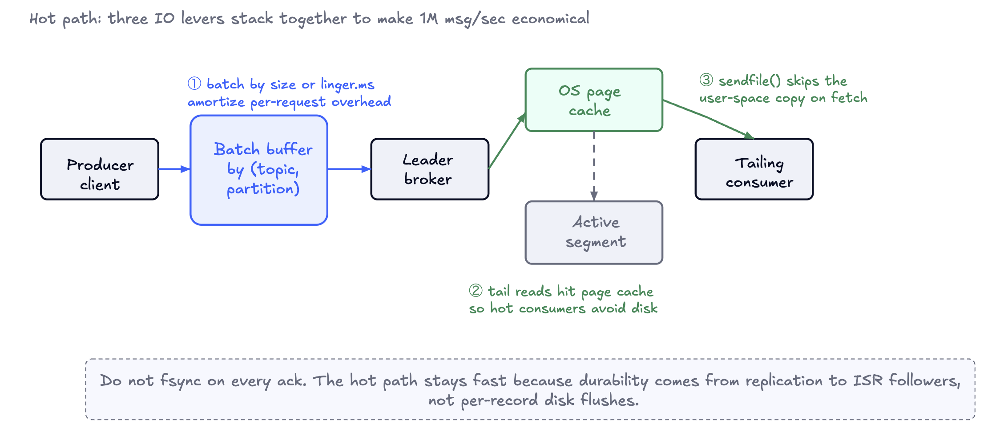

# Design a Kafka-like Distributed Message Queue

> **The one-liner:** A Kafka-like message queue is not a queue — it's a **durable, partitioned, replicated append-only log**. Once you see it as one data structure, delivery semantics, consumer groups, and recovery all fall out of it rather than feeling like separate problems.

---

## 1. Requirements (~5 min)

Before enumerating, I'd lock down the delivery model with a few clarifying questions — the answers rule entire architectures in or out.

| I'd ask | Interviewer says | Why it changes the design |
|---|---|---|
| Is this a **log** (replay from any point) or a **task queue** (delete-on-ack)? | Log-based; messages leave only when retention expires. | Kills per-message delete-on-ack. Retention becomes a background truncation job independent of any consumer's progress. |
| **Exactly-once** or is **at-least-once** acceptable? | At-least-once is the default; exactly-once is a discussed extension. | No transaction coordinator in the core replication path. Broker stays focused on durability + throughput. |
| **Total ordering** per topic, or **per-partition** enough? | Per-partition is sufficient. | Enables multiple partitions per topic → the mechanism for both write throughput and consumer parallelism. |
| What does an **acknowledged write** guarantee under broker failure? | Once acked, the message survives any single broker failure. Extra replication latency is acceptable. | An ack must mean more than "the leader accepted it." Forces replication-before-ack. |
| **Push or pull** delivery? | Pull. Consumers control their own pace. | Broker never tracks per-consumer delivery state; consumer lag becomes a visible metric, not a hidden queue. |

### Functional Requirements (top 3, prioritized)

1. **Publish/subscribe over partitioned topics** — producers publish to a topic, routed to a partition by key-hash or round-robin; each partition is a strictly-ordered append-only log.
2. **Consumer groups read by offset with replay** — each partition is owned by exactly one consumer in a group; consumers read by offset, can replay from earlier, and commit the last-processed offset.
3. **Durable, replicated retention** — partitions replicated across 3 brokers (no acked write lost on single-broker failure); log retained for a configurable time/size window, truncated independently of consumer commit state.

### Non-functional Requirements (quantified)

- **Throughput:** sustain **~1M msg/sec** cluster-wide ingest.
- **Latency:** producer→consumer **p99 < 200 ms** for hot consumers tailing the log.
- **Durability:** **no acked write lost** on any single broker failure.
- **Availability:** **99.95%** for ingest and fetch, with automatic partition leader failover.
- **Ordering:** strict **within a partition**; no global ordering across a topic.
- **Delivery:** **at-least-once** by default; exactly-once as an extension.
- **Scale ceiling:** ~10K topics, ~100K partitions, ~1 PB retained.

### Capacity Estimation — only the numbers that shape the design

I won't front-load QPS math just to conclude "it's a lot." Two numbers actually drive decisions: **1M msg/sec** and **3× replication**.

| Metric | Value | Drives |
|---|---|---|
| Peak ingest | 1M msg/sec | Cluster throughput target |
| Avg message size | 1 KB | Disk + network sizing |
| Raw ingest | ~1 GB/sec | Before replication |
| Replicated write | ~3 GB/sec | After `acks=all` ISR replication |
| Per-broker sustained | ~150 MB/sec sequential | Bounds cluster at ~20–30 brokers |
| Per-partition target | ~10 MB/sec | 1M msg / 100K partitions @ 1 KB |
| Target E2E p99 | 200 ms | Constrains `linger` + `acks` tuning |

**The load-bearing consequence:** 1M msg across 100K partitions = ~10 MB/sec per partition. That per-partition budget is what forces **sequential disk IO + producer batching + zero-copy fetch** rather than per-message syscalls. **Partitioning is the load-bearing concept for everything below.**

*DDIA Ch. 11 (Stream Processing) frames exactly this: the log as the unifying abstraction between messaging and storage.*

---

## 2. Core Entities (~2 min)



- **Topic** — a name + a partition count. Purely logical.
- **Partition** — the unit of **ordering, parallelism, and replication all at once**. A directory of segment files, replicated across 3 brokers.
- **Broker** — a stateful process with local disks, holding a subset of partition replicas (leader for some, follower for others).
- **Segment** — a contiguous offset range on disk: a fixed-size `.log` + sparse `.index` + `.timeindex`. Only the *active* segment is appended to.
- **Consumer Group** — the unit of horizontal scaling and independent replay; each partition assigned to exactly one member.
- **Offset** — a monotonic, never-reused sequential ID; a consumer's durable bookmark into history.
- **Controller quorum** — Raft-based; authoritative for metadata (topic config, partition→leader map, ISR set).

The authoritative state is the **per-partition segmented log on disk**, plus a little metadata:

- **Segment files:** immutable once closed → retention is a whole-segment drop, never a rewrite of terabytes.
- **Sparse `.index`:** offset→byte-position, precise enough to land within one page; the OS page cache does the rest → O(log N) seek + short scan.
- **`__consumer_offsets`:** internal **compacted** topic keyed on `(group_id, topic, partition)` → one latest committed offset per key survives compaction. The system stores its own progress markers using its own primitive, not an external database.

**Why alternatives lose:** a row-per-message RDBMS collapses under 1M writes/sec and can't replay cheaply; one giant file per partition forces retention rewrites; an LSM tree adds write amplification for no benefit on an append-only/tail-read pattern; object storage as the *hot* tier pushes tail reads over the network and blows the 200 ms budget (it fits only as a *cold* tier — see Deep Dives).

> **A common trap:** spending the first ten minutes on producer retry semantics before ever saying "partition." Partitions are load-bearing. If you only have time for two deep dives, make them **ISR + leader failover** and **consumer-group rebalancing**.




---

## 3. Broker Protocol / Interface (~5 min)

This is **not a REST inventory** — the hot path is a **binary, length-prefixed TCP protocol**. At 1M msg/sec, per-request JSON/HTTP-header parsing would eat meaningful CPU, and the protocol is only spoken by our own client libraries. REST survives only as an off-hot-path admin surface (`CreateTopic`, `DescribeTopic`).

**The load-bearing choice is pull, not push.** A slow consumer just fetches less often — flow control is trivial and the broker never tracks per-consumer state. Replay is free because the consumer already chooses the offset. Push would turn a thin data plane into a stateful delivery system and make rebalancing far harder.

```
Produce  { topic, partition, acks, records[], producer_id? }
  -> ProduceAck { base_offset, error_code? }
      // error_code = NOT_LEADER_FOR_PARTITION  => cached metadata stale,
      //              refetch metadata + retry against new leader

Fetch    { topic, partition, offset, max_bytes, max_wait_ms }
  -> FetchResponse { records[], high_watermark, log_start_offset }
      // max_wait_ms = long-poll knob (amortizes empty fetches)
      // log_start_offset < requested offset => retention truncated under you

OffsetCommit { group, topic, partition, offset }   // AFTER processing
OffsetFetch  { group, topic, partition } -> committed_offset  // on restart/rebalance

Metadata { } -> { topology, leaders, assignments }  // cached; refetch on leader-change error
JoinGroup / SyncGroup / Heartbeat                   // consumer-group membership
```

**Two contract details carry senior signal:**
- **Commit is deliberately *after* processing.** Crash between the two → re-read the same records → **at-least-once**. Committing *before* processing would give the weaker at-most-once.
- **Leader-change errors are the failover mechanism.** `NOT_LEADER_FOR_PARTITION` tells the client its metadata is stale; refetch + retry makes leader failover invisible to application code.

> **How I'd say it in the room:** "Pull wins because the consumer owns pacing, retry, and replay. The broker stays thin — that's what lets it serve hundreds of MB/sec from segment files with zero-copy. Push forces per-consumer delivery state and makes 1M msg/sec much harder."

---

## 4. High-Level Design (~10–15 min)

### Why the naive version fails (and what each failure forces)

The tempting first move: one broker, one file per topic, `POST` to append, `GET` from an offset. Three pains surface immediately, and each one *forces* a specific piece of the real architecture:

1. **One broker caps throughput and is a SPOF** → 1M msg/sec + 99.95% is unreachable → **partitioning across brokers**.
2. **An ack that lives only in the leader's memory vanishes on restart** → **ISR replication** (a follower must confirm to disk before ack).
3. **No durable place to store how far each consumer read** → **a durable consumer-offset store** surviving restarts and rebalances.
4. **A second writer for the same partition races on offset assignment** (a TOCTOU on the log tail) → **a controller enforcing exactly one leader per partition**.

### Architecture

The cluster has two planes. The **data plane** is brokers with local disks, each holding a subset of partition replicas. The **control plane** is a small Raft controller quorum owning metadata. **Clients cache metadata so the controller stays off the hot path** and talk directly to the partition leader.



*Solid arrows = correctness-critical data-plane paths. Dashed = control-plane metadata, cached by clients so it never touches the produce/fetch hot path.*

### The three data-plane flows



**Flow 1 — Produce with `acks=all`.** Producer batches records per `(topic, partition)`; on a byte/time threshold it hashes the key to pick the partition, looks up the leader from cached metadata, and sends one `Produce`. The leader appends to the active segment via the page cache, followers pull-replicate, and the leader **holds the ack until every ISR member has the batch on disk**, then advances the high watermark so consumers can see it.

**Flow 2 — Consumer fetch + commit.** Consumer sends `JoinGroup`; the coordinator assigns partitions; from then on each consumer is the *sole owner* of its partitions in that group. It starts at its last committed offset and long-polls `Fetch`; the broker streams from the segment file — almost always page cache for a tailing consumer — via `sendfile()`. **Process first, commit second** → at-least-once.



**Flow 3 — Leader failover.** Broker dies → controller detects via missed heartbeats → **picks a new leader from the surviving ISR** for each affected partition → publishes the updated leader map. Clients see `NOT_LEADER_FOR_PARTITION`, refetch, resume. Sub-second in practice; correctness hinges on the new leader having every acked write, which is exactly what ISR membership guarantees.


## 5. Deep Dives (~10 min)

Three probes, chosen to hit **correctness**, the **domain-hard part**, and **scale**: *(A)* prove no acked write is lost when a broker dies, *(B)* keep a consumer group available under churn, *(C)* land 1M msg/sec on commodity disks. Exactly-once lives in Other Considerations.


### A. Replication correctness — ISR, `acks=all`, leader failover



The correctness spine: **no acknowledged write is lost even if 2 of 3 replicas fail.** Two extremes bracket the design — fsync-every-replica gives perfect durability and tanks throughput; race-ahead-and-ack loses data when the leader dies. The **ISR set + `min.insync.replicas`** picks the point on that curve.

A follower is **in the ISR** if its log-end offset is within a small staleness threshold of the leader. With **replication factor 3 + `min.insync.replicas=2`**, a write succeeds only when the leader *plus at least one follower* have it on disk — so any single broker loss is survivable, and the new leader (always drawn from the ISR) is *guaranteed* to hold everything the old leader acked. Followers that return behind the high watermark truncate before rejoining.


**The hard corner — empty ISR at failover.** If the ISR is empty when the leader dies, you choose: wait for an ISR member to return (**preserves durability, partition unavailable**) or **unclean leader election** — promote an out-of-ISR replica to restore availability *at the cost of losing acked writes*. **Default: disable it and accept the outage.** Flip it only in deliberate disaster recovery when no ISR replica is coming back and the product prefers bounded data loss to being down.

> **How I'd say it:** "`acks=all` + `min.insync.replicas=2` on a 3-replica partition is the durability floor. The controller elects the new leader *only* from the ISR, and I'd disable unclean leader election — I'd rather take a write outage than lose acked data."

*DDIA Ch. 5 (Replication) — leaders, followers, and sync vs. async; Ch. 9 (Consistency & Consensus) — why leader election needs a consensus-backed controller, not gossip.*

### B. Consumer-group rebalancing — the domain-hard part

The invariant: **every assigned partition has exactly one owning consumer.** A coordinator (chosen by hashing the group id) reassigns partitions when consumers join, leave, or miss heartbeats — without violating per-partition ordering or losing commit state.

The naive protocol (**eager range**) revokes *every* partition on *every* rebalance and stops the whole world — even partitions that end up with the same owner. Under a rolling deploy of 50 pods, the group enters a **rebalance storm**, spending more time rebalancing than processing. The progression fixes this:




Against the 200 ms budget, **cooperative keeps most consumers processing through a rolling deploy** while eager stops the whole group every pod cycle. The extra protocol complexity is worth it — and the key reframe for the interviewer is that **rebalance storms are a *latency* problem, not just an availability problem.**

**One subtle correctness rule:** consumers must **commit offsets before their partitions are revoked** (the revoke callback is the hook). Miss it, and the next owner resumes from an older committed offset — the at-least-once contract leaks into duplicate-processing storms under churn.

### C. End-to-end throughput — batching, page cache, zero-copy

1M msg/sec on commodity disks is an **IO problem with three stacked levers**; drop any one and the math breaks.



- **Batching (biggest lever):** buffer per `(topic, partition)` until a byte or `linger.ms` threshold; 1000 records ship as one request and one append. **5–10 ms of linger is nearly free against a 200 ms budget** and multiplies throughput by an order of magnitude.
- **Page cache:** sequential appends flushed by the kernel in the background. **We do *not* fsync per ack** — that caps throughput at disk IOPS. **Durability comes from ISR replication, not fsync.**
- **Zero-copy (`sendfile()`):** streams bytes file-descriptor → socket without entering user space; for a tailing consumer the pages are still in cache from the recent write, so no disk touch at all.

> **How I'd say it:** "Throughput is mostly IO. Batching makes per-record overhead disappear, page cache is a free read cache, zero-copy skips the user-space copy. Lose any one and 1M msg/sec stops being economical — and note the durability decoupling: fsync is *not* how we're durable, replication is."


---

## 6. Other Considerations

**Effectively-once — be precise about the boundary.** At-least-once is the default, so duplicates are expected; most workloads key downstream writes idempotently. Two opt-ins go further: **idempotent producers** (producer id + per-partition sequence number → broker rejects duplicate batches from retries → per-partition exactly-once on the *write path*), and **transactions** (atomic writes across multiple partitions *including* `__consumer_offsets`, so a consume-transform-produce pipeline commits or aborts as a unit). The trap: exactly-once ends at the log boundary. **Once records leave the log for an external system, the application still owns idempotency or transactionality there.** *(Note: this is Kafka's internal mechanism — not the transactional-outbox pattern, which is what you'd use when* building on top of *Kafka, not when building Kafka.)*

**Multi-region — async mirroring, not synchronous replication.** Cross-region RTT is tens-to-hundreds of ms and would destroy the 200 ms budget. Run a per-region cluster and mirror asynchronously (MirrorMaker-style); the destination lags by seconds. Trade-off: **async keeps performance and risks a small recovery-window data loss; synchronous keeps data and costs performance.** Backup-region consumers resume from their *own* offsets in the mirrored topic (which differ from the source) — that detail bites during failover.

**Tiered storage for the ~1 PB.** Keep active/recent segments on local disk for latency; move closed segments to object storage. Cold fetches read transparently from the object store — slower but fine for replay/backfill — and hot consumers are never affected. Storage cost per GB drops sharply.

**Observability — three log-specific signals generic dashboards miss:**
- **Under-replicated partitions** (ISR size < replication factor): the durability guarantee is quietly weaker than claimed → **this should page.**
- **Consumer lag** (log-end offset − committed offset): if lag exceeds the retention window, records vanish silently under the consumer.
- **ISR churn rate:** near-zero when healthy; high churn signals network flapping or disk saturation — an early warning for full broker failure.

> **Subtle failure mode:** a consumer falls so far behind that retention truncates segments out from under it → next `Fetch` returns `OFFSET_OUT_OF_RANGE`. Catch it early by alerting on **consumer lag > 50% of retention window**.

---

## 🌍 Real-World Anchor

This is the architecture of **Apache Kafka**; **Pulsar** and **Kinesis** occupy the same design space with different trade-offs. Pulsar **separates compute from storage** (BookKeeper), which wins for tiered storage and multi-tenancy but adds moving parts; **Kinesis** is fully managed with fixed per-shard throughput and shorter retention. We keep the Kafka-style **local-disk + segment-file** architecture because the scope is single-cluster / single-datacenter, and local disks plus zero-copy are what actually hit 1M msg/sec on commodity hardware. *(Bytebytego's log/streaming case studies — LinkedIn's original Kafka motivation and Uber's trillions-of-messages/day pipeline — are the canonical real-world anchors here.)*

---

## 🔍 Senior-Signal Questions to Ask in Your Interview

- **"Is `acks=all` with `min.insync.replicas=2` the durability contract, and should unclean leader election stay disabled?"** → *Signals you understand the durability dial is `min.insync.replicas`, not replication factor alone — and that availability-vs-durability is a deliberate switch, not a default.*
- **"Are we on cooperative-incremental rebalancing, and is rebalance latency in our SLO?"** → *Shows you treat rebalance storms as a latency problem under churn, not just an availability event.*
- **"Where exactly does exactly-once end — at the log, or through to the sink?"** → *Distinguishes idempotent producers from transactions and pins the application's remaining responsibility; the #1 place candidates over-claim.*
- **"What's our fsync policy, and are we relying on replication rather than disk flush for durability?"** → *Reveals whether you understand throughput comes from* not *fsyncing per ack, with durability delegated to ISR.*
- **"Which three signals page us — under-replicated partitions, consumer lag vs. retention, ISR churn?"** → *Operational maturity: you know the log-specific health metrics that generic infra dashboards never surface.*