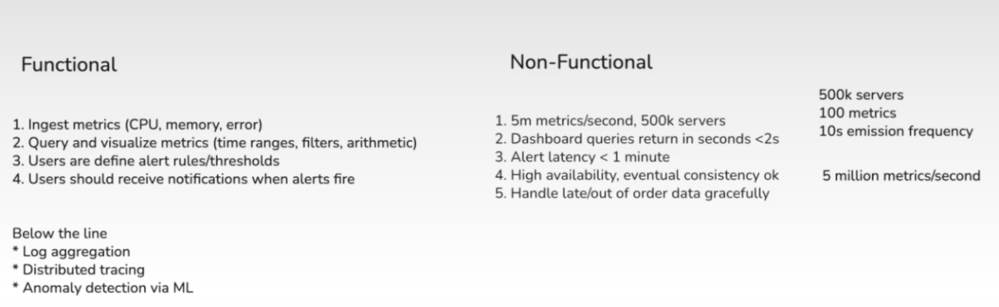
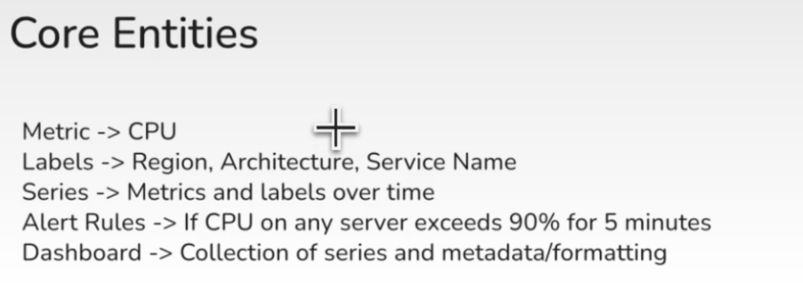
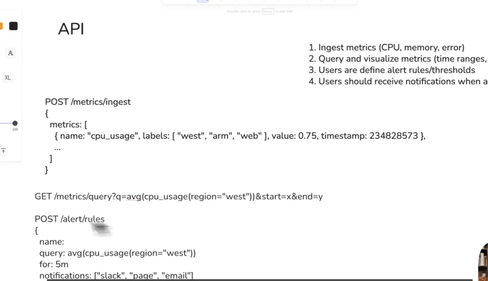
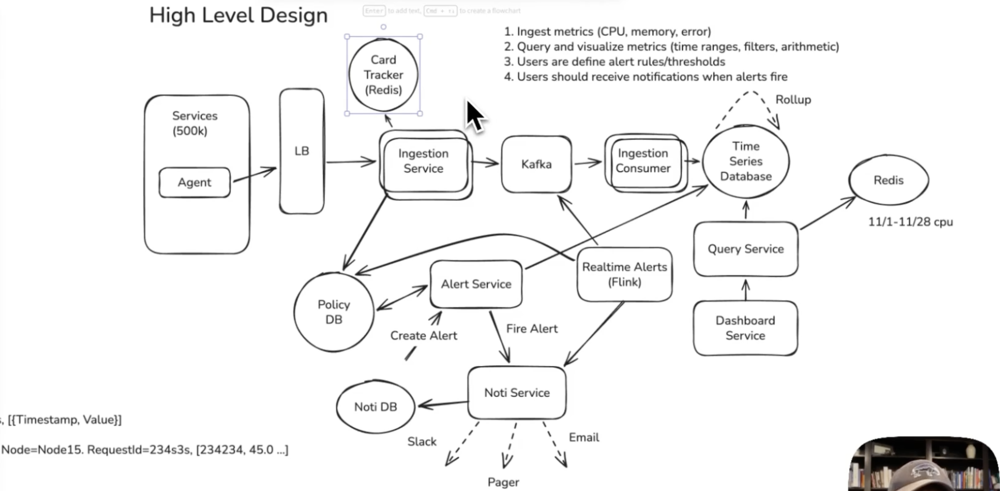

## 1. Funcitnoal Requirements

## 2. Core Entities

The two keys that matter: `alert_key` identifies a single host-level alert, `group_key` identifies one grouped page.

**`alert_rules`** — what to evaluate

| Column | Purpose |
|---|---|
| `rule_id` | Unique rule ID |
| `name` | Human-readable rule name |
| `query` | Metric query and threshold condition |
| `for_duration_seconds` | How long the condition must hold before firing |
| `group_by_labels` | Labels used to form notification groups |
| `notification_targets` | Slack, PagerDuty, or email targets |
| `enabled` | Whether evaluation is active |
| `created_at` | When the rule was created |

**`alert_instances`** — one row per rule × label set

| Column | Purpose |
|---|---|
| `alert_key` (PK) | Unique key for one rule plus full label set |
| `rule_id` | The rule that created this alert |
| `group_key` | The notification group this instance belongs to |
| `labels` | Full labels such as host, service, cluster |
| `state` | `firing` or `resolved` |
| `first_fired_at` | When it first fired |
| `last_evaluated_at` | Most recent evaluation time |
| `resolved_at` | When it recovered |

**`notification_groups`** — one row per paged incident

| Column | Purpose |
|---|---|
| `group_key` (PK) | Unique grouped-incident key |
| `rule_id` | The originating rule |
| `shared_labels` | Labels shared by grouped alerts |
| `state` | `firing` or `resolved` |
| `alert_count` | Current number of firing members |
| `first_fired_at` | When the group first fired |
| `last_notified_at` | When a notification was last sent |
| `resolved_at` | When the last member resolved |

**`group_members`** — membership over time

| Column | Purpose |
|---|---|
| `group_key` | The notification group |
| `alert_key` | One member alert instance |
| `added_at` | When this instance joined the group |
| `removed_at` | When it resolved or left the group |

**`outbox_events`** — transactional outbox for notification delivery

| Column | Purpose |
|---|---|
| `event_id` (PK) | Unique event ID |
| `event_type` | `ALERT_FIRING`, `ALERT_RESOLVED`, etc. |
| `alert_key` | The affected alert instance |
| `group_key` | The affected notification group |
| `payload` | Event details to publish |
| `created_at` | When the event was stored |
| `published_at` | When the worker published it |

**`processed_events`** — consumer-side idempotency ledger

| Column | Purpose |
|---|---|
| `event_id` | Consumed event ID |
| `consumer_name` | Which service processed it |
| `processed_at` | When processing completed |

# 3. API / System Interface 

## 4. High-Level Design 

# Step 5 - Design Deep Dive
Let's deep dive into several of the more interesting parts of the system.
# Design Deep Dives — Monitoring & Alerting System

## 1. Metrics Collection: Edge Agents over Direct Push

Run a lightweight **collector/agent** on each server (à la Datadog Agent, OTEL collectors) rather than pushing directly to a central ingestion service.

- **Collect** metrics locally at high frequency
- **Buffer & batch** locally
- **Flush** batches periodically to ingestion via Kafka

**Why it works:**
- Shifts work to the edge → central load drops from **~5M req/s to ~50k req/s**
- Agents can do **local aggregation** (e.g., compute percentiles before shipping)
- Kafka **buffers against downstream spikes/outages** — if the ingestion consumer falls behind, it catches up via Kafka retention

---

## 2. Storage: Purpose-Built Time-Series Database

Use a TSDB (**InfluxDB, TimescaleDB, VictoriaMetrics**) built for the workload:

- **Append-only writes** — time-ordered, rarely updated → LSM-tree / append-only engines for high write throughput
- **Time-based partitioning** — chunked by time; "last 6h" only touches recent chunks; old chunks droppable
- **Columnar compression** — timestamps + values compress well (e.g., 100KB → 5KB per host/day)
- **Built-in rollups** — auto-compute 1m / 1h / 1d aggregates stored separately for fast long-range queries

**Partitioning:** by time **and** metric series (hash of metric name + labels).
**Retention:** raw 10s → 15 days; 1m rollups → 90 days; 1h rollups → 1 year.

**Challenge:** TSDBs struggle with **high cardinality** — millions of unique label combos = millions of series, each with overhead. Need **cardinality controls** to prevent runaway growth.

---

## 3. Separate Alert Evaluation from Notification

Split **"evaluating alert conditions"** (Prometheus/Flink) from **"managing notifications"** (Alertmanager). This is Prometheus's exact model — a well-established pattern, because these are fundamentally different problems with different **scaling and reliability** characteristics.

---

## 4. Query Performance: Caching Layer (Redis)

Exploit the fact that most queries cover **overlapping data** — like a **sliding window**, queries 10s apart differ only in the last 10s.

- **Query splitting** — recent data (last 2h) hits the DB directly for freshness; historical data hits cache first
- **Precomputation** — popular dashboard queries precomputed on a schedule, cached with freshness-aligned TTLs
- **Result caching** — keyed on query + time range; identical queries hit cache

Non-real-time dashboards (most of them) serve **entirely from cache at sub-100ms latency**.

---

## 5. Alert Evaluation: Polling vs. Stream Processing

### Option A — Poll more frequently
Run the Alert Evaluator every 15–30s instead of every minute. For 10k rules at 15s → **~670 queries/s**.

- **Challenge:** heavy load on the TSDB; alert queries compete with dashboard queries and ingestion writes. Still bounded by the interval — 15s polling = up to **14s latency**.

### Option B — Stream processing with Flink (preferred)
Add Flink as a **second Kafka consumer** on the same metrics topic:

1. Flink reads metrics from Kafka
2. Maintains **windowed state** per series (e.g., rolling 5-min buffer)
3. Alert rules compiled into **Flink operators** that continuously evaluate conditions
4. Emits an alert event when a threshold is violated for the configured duration

---

## 6. End-to-End High Availability (Data + Alerts)

Make each stage redundant and durable:

| Stage | HA Mechanism |
|---|---|
| **Ingestion** | Multiple instances behind a load balancer |
| **Kafka** | Replicated partitions, leader election, ISR |
| **Storage** | TSDB with replication + multi-node writes |
| **Alerting** | Multiple Flink consumers in one consumer group |
| **Notification** | Alert Service retries + queues failed deliveries |

**Key idea — buffering:** slow DB → Kafka absorbs the spike; consumer fails → another in the group takes its partitions; notification provider down → Alert Service keeps retrying.

**Make every step resumable:**

*Ingestion path*
- Agents buffer locally and retry on network/ingestion failure
- Kafka replicated across zones so broker loss doesn't drop data
- **Idempotent writes** so retries don't duplicate points

*Alerting + notification path*
- Alert evaluation state is **checkpointed** so a crashed processor resumes
- Alert events written to Kafka **before** any external notification
- Alert Service retries delivery, fails over to a secondary channel

> **Essence:** never let in-flight data disappear. When things break, **degrade freshness, not correctness** — metrics and alerts may arrive late, but they still arrive.

**Challenges:**
- Many moving parts → need clear **SLOs per path** and **meta-monitoring** (monitor the monitoring system)
- Consider a **watchdog service** that proactively alerts clients in case an alert is missed due to a long-running query or delayed data
- Retention expiry (Kafka falling behind too long) can still lose data; delayed alerting can mean late detection