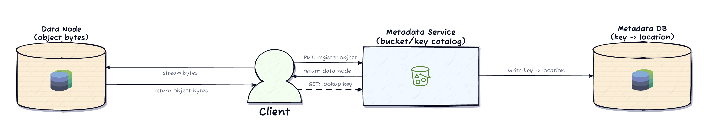
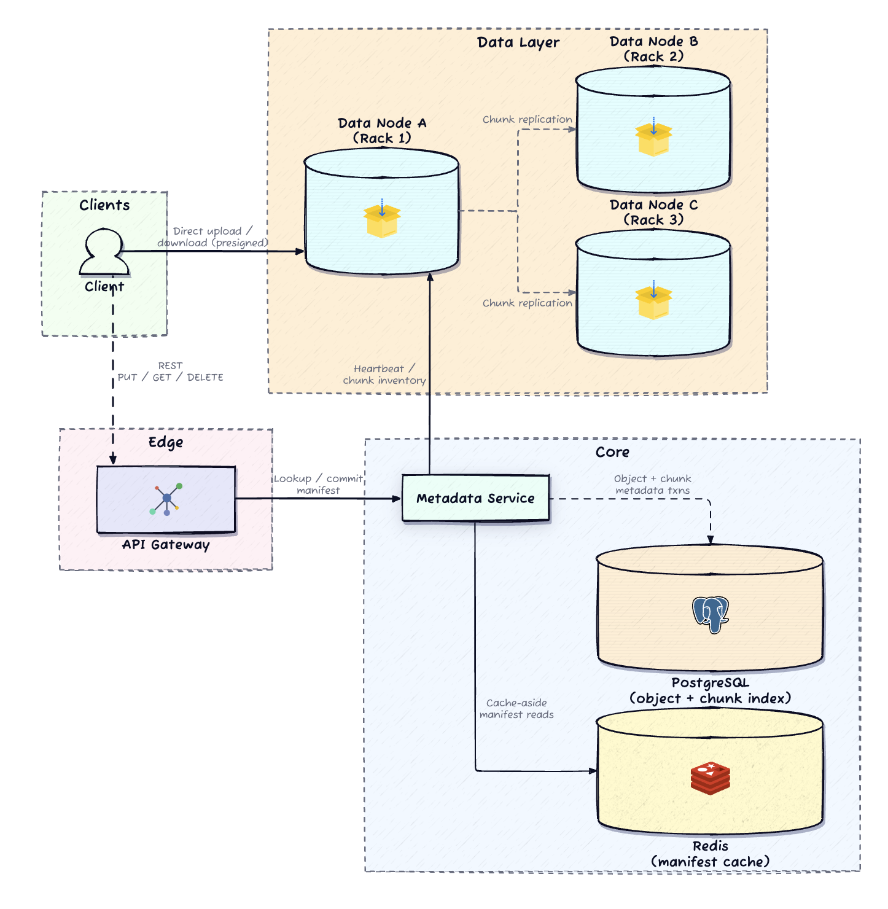

# Design an S3-like Object Storage System

> **The one-liner:** *You don't store objects — you store content-addressed chunks. Dedup and replication both fall out for free once the chunk hash is the universal address. The whole design lives or dies on the delete path.*

---

## 1. Requirements

### Clarifying questions (the dialogue I'd drive)

| I ask | Interviewer says | What it locks in |
|---|---|---|
| Storage engine, or access-control/user-mgmt too? | Storage engine + data path only | Focus on chunk placement, dedup, durability — not IAM |
| Durability target? Survive a whole rack, or just nodes? | 11 nines; survive full rack loss | Placement must span independent failure domains |
| Is dedup a hard requirement or a future optimization? | **Hard requirement** — identical content shares storage | Delete becomes a *shared-reference accounting* problem |
| Object size range? One upload path for all? | KB → multi-GB, single client experience | Unified pipeline; small-payload lookups + large chunk streams |
| Do bulk bytes traverse the control plane? | No — control plane orchestrates, bytes go direct | Presigned URLs; gateway never proxies blobs |
| Can delete reclaim disk immediately? | No — must be safe vs. in-flight uploads | **Deferred GC with a safety window** |

### Functional requirements (prioritized)

1. **PUT** an object into a bucket under a unique key.
2. **GET** an object by bucket + key.
3. **DELETE** an object by bucket + key.
4. **Deduplicate** identical content — same bytes stored once on disk.
5. **LIST** objects in a bucket with prefix filter + cursor pagination.

### Non-functional requirements (quantified)

- **Durability: 11 nines (99.999999999%)** via 3× replication across independent failure domains (racks).
- **Read availability: 99.99%** — route to surviving replicas through single-node/single-rack failure.
- **Scale:** petabyte-scale, hundreds of commodity nodes, **10B+ objects**.
- **Dedup is the primary cost lever** — repeated content approaches zero marginal storage.
- **Latency:** first-byte < 200 ms for objects ≤ 1 MB; throughput-bound delivery for >100 MB.
- **One upload path** from a few KB to multiple GB — no separate client flow per size.

### Capacity estimation (only the numbers that change a decision)

| Parameter | Estimate | Why it matters |
|---|---|---|
| Total objects | 10 B | Forces metadata sharding by `bucket_id` |
| Avg object size | 1 MB | Most objects are single-chunk → chunking overhead trivial |
| Raw storage | ~10 PB | — |
| Replication | 3× → ~30 PB | Each avoided unique chunk saves **3** physical copies |
| Dedup savings | ~30% | Avoids ~9 PB of *replicated* data — cost lever is amplified by RF |
| Chunk size | 64 MB | 10 TB disk ≈ 160k chunk files — file count stays manageable |
| Ingest | ~100 TB/day (~1.2 GB/s) | Justifies bypassing the gateway for bytes |
| Peak read | 50k QPS | Redis in front of metadata for hot manifests |

The dedup ratio is the headline cost number: at 30% across 10 PB raw, RF amplifies the saving 3× because one fewer unique chunk removes three copies.

---

## 2. Core Entities

- **Bucket** — namespace owner; enforces global bucket-name uniqueness.
- **Object** — the lifecycle anchor. *An object exists iff it has a row.* Maps `(bucket, key)` → metadata.
- **Chunk** — a unique content hash (SHA-256), its `reference_count`, byte size, and replica locations. **The reference count is the correctness linchpin.**
- **Object→Chunk manifest** — the ordered list (`chunk_index`) of chunk hashes that reconstructs the byte stream.
- **Data Node** — commodity server; stores chunk files on a local FS (ext4/XFS), named by content hash.

**The durable boundary is deliberately split:** metadata (bucket/key → manifest + reference counts) is *strongly consistent* and lives in a relational store. Chunk bytes live on data-node local FS. Heartbeats and chunk-location reports are *ephemeral and rebuildable* from disk scans. After any crash, **the metadata store is the authoritative truth** — it knows what should exist and drives re-replication and GC.

---

## 3. Data Model

```
buckets        (bucket_id PK, name UNIQUE, created_at, ...)
objects        (object_id PK, bucket_id, key, size, deleted, created_at,
                UNIQUE(bucket_id, key))
object_chunks  (object_id, chunk_index, chunk_hash,
                PK(object_id, chunk_index))          -- the manifest
chunks         (chunk_hash PK, reference_count, size, replica_nodes[])
```

**Access patterns**
- **GET:** point lookup on `(bucket_id, key)` → join `object_chunks` for the ordered manifest + replica locations.
- **PUT:** insert `objects` row + `object_chunks` rows + increment `reference_count` on each chunk — **one transaction**.
- **DELETE:** mark object deleted + decrement each chunk's ref count + enqueue zero-ref chunks for GC — **one transaction**.
- **LIST:** range scan on `(bucket_id, key)`, cursor = last-seen key.

**Two invariants the schema protects**
1. **Reference counts equal the true number of live manifests pointing at a chunk.** Drift *below* → premature delete → data loss. Drift *above* → storage leak. This is why PUT and DELETE wrap the count mutation in the *same* transaction as the object-row mutation.
2. **An object is visible only after its manifest fully commits.** Partial uploads (chunks on disk, manifest uncommitted) never appear in LIST/GET.

**Storage choice:** PostgreSQL — access is relational (object↔chunk joins) and ref-count updates need transactions. Partitions to billions of rows by `bucket_id`. Redis fronts hot-manifest reads. At extreme scale a KV store (DynamoDB) with atomic increment is the escape hatch, trading transactional cross-entity safety for partition-level atomics.

---

## 4. API / System Interface

**The single most important contract: the gateway handles metadata and coordination only — it never proxies blob bytes.** Bulk transfer goes client ↔ data node directly via time-limited presigned URLs. Objects are immutable; overwrite = delete + create.

```
PUT    /{bucket}/{key}                          → upload (chunk + dedup handshake)
GET    /{bucket}/{key}                           → resolve manifest → presigned download URLs
DELETE /{bucket}/{key}                           → mark deleted, decrement refs, enqueue GC
GET    /{bucket}?prefix=&marker=&maxKeys=1000    → prefix range scan, cursor pagination
```

**Upload handshake (PUT):**
1. Gateway/chunking service splits the stream into 64 MB chunks, computes SHA-256 per chunk.
2. For each hash, check metadata: exists with positive ref count → already stored, skip the byte transfer.
3. For new chunks, gateway picks rack-aware placement and returns presigned upload URLs; client streams bytes directly to the assigned data nodes.
4. After all chunks reach RF=3, gateway commits the manifest in **one transaction** (object row + ordered `object_chunks` + ref-count increments). Object becomes visible only now. Interrupted upload → nothing visible, client retries the full PUT; orphaned chunks are swept by GC.

**Download (GET):** resolve manifest (Redis on hot path) → single-chunk objects redirect to the data node; multi-chunk objects get parallel presigned URLs reassembled by `chunk_index`. A dead replica falls back to another of the three. Byte-range headers allow resume.

> **How I'd say it in the room:** *"The API is deliberately thin. Its only job is the metadata handshake — hash, dedup-check, placement, presigned URLs. The moment blobs touch the gateway, gateway capacity and data throughput are coupled, and a few multi-GB uploads starve every metadata lookup."*

---

## 5. High-Level Design

### The simplest thing that could work



Two moving parts: a **Metadata Service** owning `bucket/key → location`, and **Data Nodes** holding raw bytes. Write: client registers object with metadata, gets a node, streams bytes to it directly. Read: ask metadata for the location, fetch bytes directly. The metadata service never sees bytes; the data node never knows bucket/key names.

Three pressures break this minimal shape and force the real design:
1. **Single-blob storage wastes space** when uploads share content → need a **content-addressed chunk store** so cost tracks *unique* content, not total uploads.
2. **One data node is an SPOF** — 11 nines demands replicas across independent failure domains → **rack-topology awareness** the minimal design can't express.
3. **Streaming a multi-GB blob to one node saturates it** → fixed-size **chunking + parallel upload** makes large ingest tractable.

### Architecture



**Reading the diagram:** solid arrows are correctness-critical control paths; the **dashed** arrows are performance/optimization paths — the Redis read-through, and the **direct client↔data-node byte transfer** that bypasses the gateway entirely. The metadata service is the authoritative brain; data nodes are dumb storage reporting chunk inventories via heartbeats.

**Why the split scales:** metadata is tiny (~KB/object) but must be strongly consistent for ref-count correctness; data is massive but needs only eventual consistency for replica-location tracking, since heartbeats let metadata re-verify placement anytime. So the metadata layer is a sharded Postgres cluster and the data layer grows by bolting on commodity disk servers — independently.

*Real-world anchor: this is the GFS/HDFS lineage — a single logical "master" for metadata + commodity chunkservers — updated with S3's content-addressing and presigned-URL data path. Bytebytego's object-storage breakdown draws the same metadata/data plane split.*

---

## 6. Deep Dives

The two hardest parts are the **dedup/GC lifecycle** and the **replication layer** — the interviewer's explicit focus, and where the 11-nines promise actually lives. Correctness bugs hide here.

### Deep Dive 1 — Content-addressable dedup + garbage collection

The **write** path is the easy half: hash each chunk with SHA-256, use the hash as the storage address. Existing hash → skip the byte upload, just increment the ref count. Two users uploading the same 10 GB backup produce identical hashes, so one physical copy. Dedup falls out for free.

The **delete** path is where it's genuinely hard. Deleting an object drops one reference from each chunk in its manifest. A chunk hitting **zero references** *looks* reclaimable — but there's a race:

> A concurrent uploader may have just dedup-checked this same hash (found it present, decided to skip the byte upload) and **not yet committed its manifest**. If GC deletes the chunk in that window, the new object's manifest points at bytes that no longer exist. **That is silent data loss.**

**The fix: deferred GC with a safety window.** When a ref count reaches zero, the metadata service does *not* delete — it records the zero-timestamp and enqueues the chunk as a GC *candidate*. A background collector only physically deletes if the count is *still* zero after a grace period. Any upload that re-references the chunk during the window bumps the count and removes it from the queue.

**The grace period must exceed the maximum possible upload duration.** If a huge object over a slow link can take 6 h, the window must be ≥ 6 h — set it to **24 h** for margin against retries and clock skew.

Physical deletion is **two-phase**: (1) reconfirm ref count is still zero and mark the chunk `pending_deletion`; (2) send delete commands to every replica; only after all replicas confirm, remove the `chunks` row.


> **How I'd say it in the room:** *"The aha moment is that you don't store objects, you store content-addressed chunks — so delete is never a byte operation, it's a reference-accounting operation with a safety window sized to the longest possible upload. Eager delete loses data; timid delete leaks storage. The window is how you buy correctness against the check-then-commit race."*

*DDIA Ch. 7 (Read Committed / the lost-write & write-skew family) — the dedup-check-then-commit race is a textbook time-of-check-to-time-of-use hazard; the safety window is the pragmatic alternative to serializing every uploader against GC.*

### Deep Dive 2 — Replication + failure recovery

Each chunk → **3 replicas in 3 different racks**. Rack-aware placement means one rack losing power/switch/cooling can't destroy all copies. The metadata service records `replica_nodes` and picks placement at upload time.

**Why 3× replication, not erasure coding, as the baseline?** A common mistake is jumping straight to Reed-Solomon. RS 6+3 cuts overhead 3× → ~1.5×, but adds encode/decode compute, multi-node reconstruction on recovery, and messy partial-failure handling. And **dedup has already removed much of the redundancy**, so EC's storage win is smaller here than it looks. 3× is simple, recovers by a single copy from a survivor, and is easy to reason about — the right starting point; mention EC as the cold-tier optimization.

**Failure recovery flow:** metadata detects a dead node via **missed heartbeats (~30 s silence)** → finds all chunks that lived there → any chunk now below RF=3 is flagged under-replicated and enqueued for re-replication. The pipeline copies from a surviving replica to a fresh node in a different rack, **throttled** (cap concurrent copies per source) and **prioritized** (a chunk with 1 surviving copy outranks one with 2). If the dead node returns post-recovery, its stale inventory is reconciled against the authoritative map and its extra copies marked surplus for cleanup.


*DDIA Ch. 5 (Replication) for leaderless/quorum durability reasoning; Ch. 6 (Partitioning) for rack-aware placement as a partitioning-with-anti-affinity constraint.*

---

## 7. Other Considerations (breadth to sprinkle if time allows)

- **Metadata sharding:** hash-partition `objects`/`object_chunks` by `bucket_id` (nearly all access is bucket-scoped, keeps ops local to one shard). The `chunks` table is the awkward one — hashes span buckets. Shard by `chunk_hash` (even, but cross-shard PUTs need distributed txn / 2PC for ref counts) *or* keep it on a dedicated high-write cluster (hottest table) *or* swap for a KV store with atomic increment at extreme scale.
- **Variable-length chunking:** fixed 64 MB breaks on a 1-byte prepend (every boundary shifts, all hashes change). Content-defined chunking (Rabin fingerprint / rolling hash) places boundaries by content, so only chunks around an edit change — big dedup win for revisions, incremental backups, patched binaries. Cost: more complex, variable sizes need min/max bounds.
- **Storage tiering:** track last-access per chunk; migrate cold chunks (unread 90 d) from SSD data nodes to dense HDD / cold pools. Mirrors S3 Standard → IA → Glacier. Cold reads pay latency; PB-scale cold storage pays off hugely.
- **Bit-rot / integrity:** per-node background **scrubber** re-reads each chunk, recomputes SHA-256, compares to the filename (its expected hash). Mismatch → notify metadata → replace from a healthy replica. Full-disk cycle every ~2 weeks. Content addressing makes the checksum free — the name *is* the checksum.

---

## 🔍 Senior-Signal Questions to Ask in Your Interview

- **"Is the GC grace window a global constant, or per-bucket based on observed max upload duration?"** → *Signals you've internalized that the window must dominate the longest check-then-commit gap, and that a single global value trades safety margin against reclaim latency.*
- **"When we shard `chunks` by `chunk_hash`, do we accept 2PC on multi-shard PUTs, or relax ref-count atomicity to per-shard atomic increment?"** → *Shows you see the exact spot where the relational transaction guarantee breaks under partitioning — the CAP/consistency inflection point of the whole design.*
- **"Do heartbeats also carry a generation/epoch so a flapping node's stale inventory can't overwrite the authoritative map?"** → *Signals fencing-token thinking — reconciliation after a node returns is a stale-writer hazard, not just a bookkeeping merge.*
- **"At 50k read QPS, what's the Redis manifest hit rate we need before Postgres read replicas become the real bottleneck?"** → *Frames caching as a quantified back-pressure question rather than a reflexive 'add a cache' box.*
- **"If we later add erasure coding for the cold tier, do we EC at the chunk level or re-stripe across chunks — and how does that interact with dedup's shared references?"** → *Demonstrates you understand EC and dedup compete for the same redundancy, and that mixing them changes the reference-accounting model.*