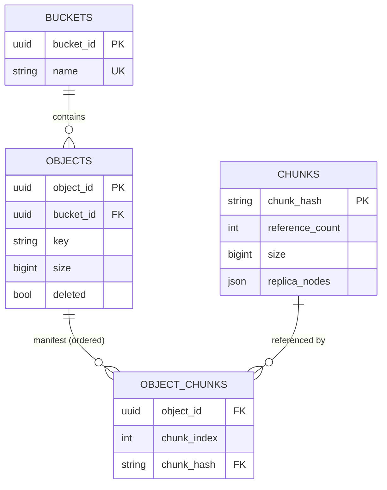
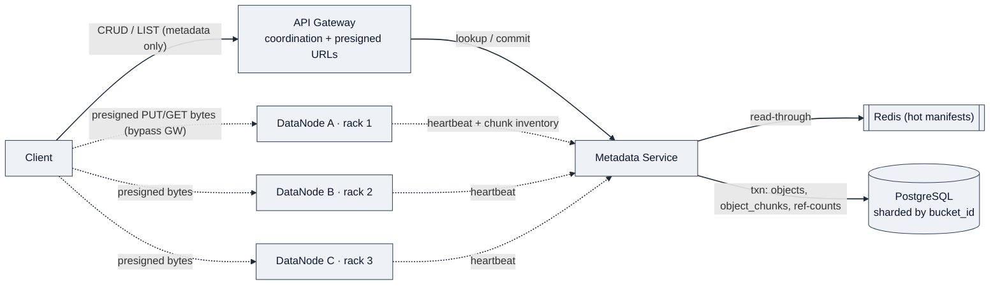
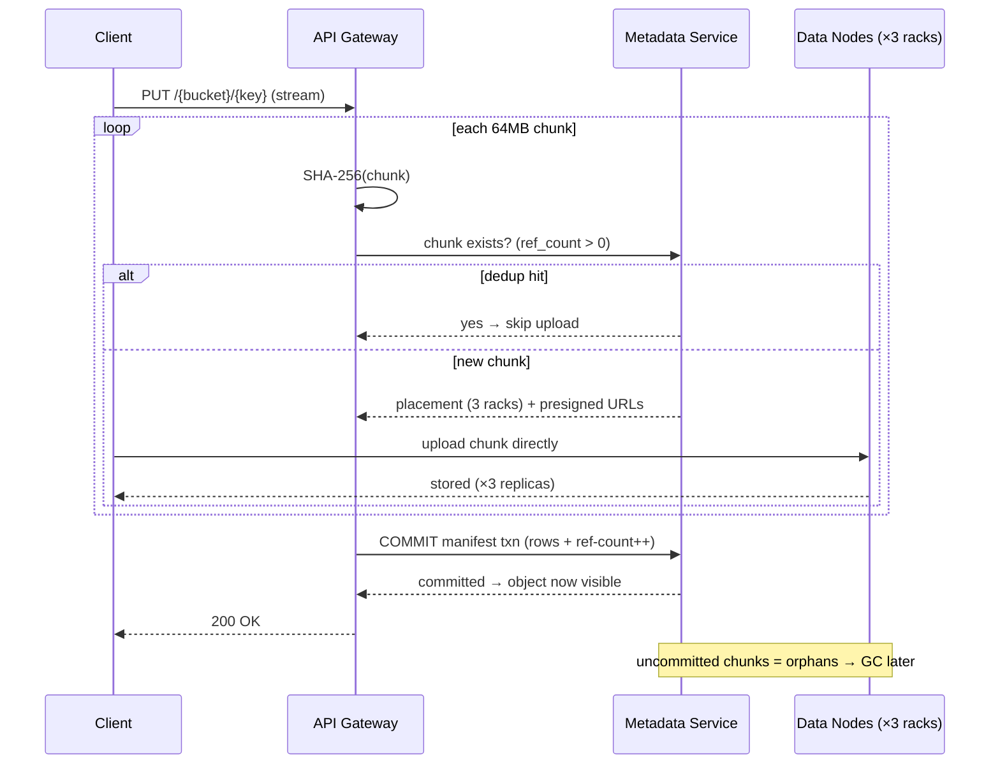
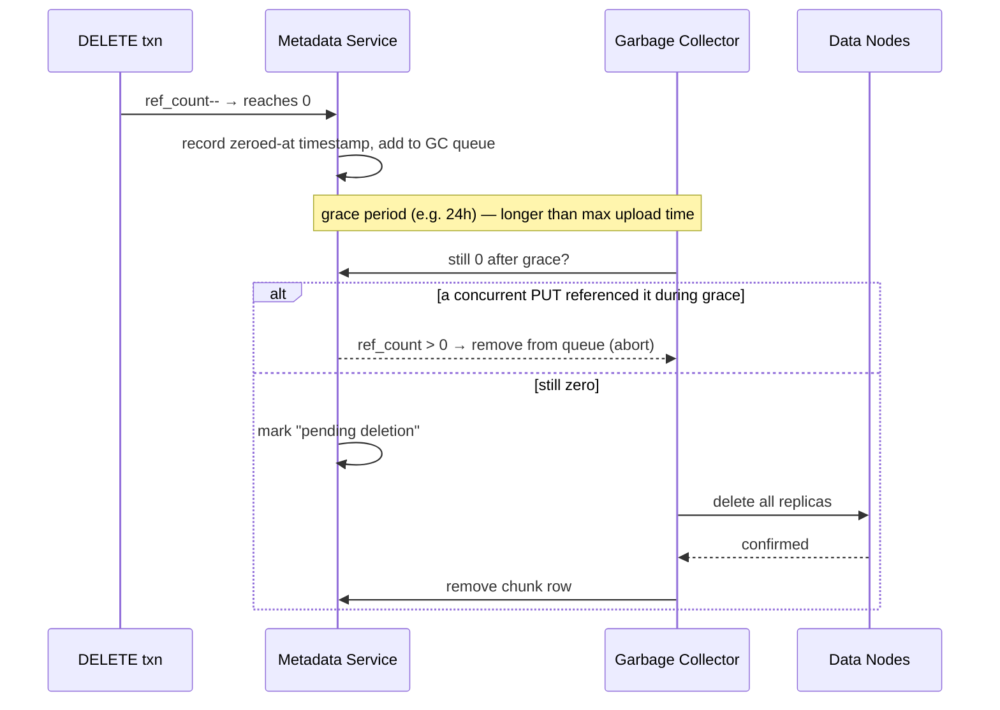
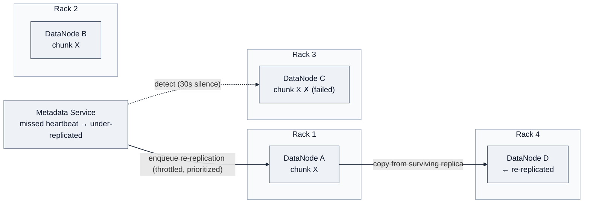

# Design an S3-like Object Storage System

> **Difficulty:** Medium · **Stage:** Onsite · **Asked by:** Google, Amazon, Microsoft, +4
> A flat-namespace store addressed by `bucket/key`. Clients `PUT`/`GET`/`DELETE` immutable objects; the service owns durability, replication, dedup, and scale. The design splits a tiny consistent **metadata index** from a massive distributed **data layer**, with content-addressable dedup so identical bytes are stored once.

---

## 1. Requirements

### Clarifying Questions

| You ask | Interviewer says | Takeaway |
|---|---|---|
| Storage engine only, or access control + user management too? | **Storage engine and data path.** ACL/users out of scope. | Focus on storage correctness and data-path performance, not policy. |
| Durability target? Must we survive a full-rack loss, not just a node? | **Eleven nines. Survive a whole rack.** | Replicas span racks; recovery accounts for rack-wide power/network failure. |
| Is dedup a hard requirement or a future optimization? | **Hard requirement.** Identical content from different users shares physical storage — primary cost lever at PB scale. | Deletes become a **shared-reference accounting** problem, not a synchronous byte removal. |
| Object size range? Small objects too, from the same path? | **A few KB to multiple GB.** One upload experience regardless of size. | Same flow handles small objects efficiently and streams large ones in chunks. |
| For large uploads, must raw bytes flow through the metadata control path? | **No.** Control path = orchestration only; bulk bytes go **directly** to storage. | Metadata path handles coordination; object bytes bypass it. Large uploads can't starve metadata lookups. |
| On delete, can space be reclaimed immediately? | **No.** Delete must be safe against in-flight uploads that may commit the same content. | Delete ≠ disk reclamation. **Deferred cleanup** protects concurrent uploads sharing a hash. |

### Functional Requirements (top priority in bold)

1. **`PUT` an object** to a named bucket with a unique key.
2. **`GET` an object** by bucket and key.
3. **`DELETE` an object** by bucket and key.
4. **Dedup identical content** — same bytes stored once on disk.
5. `LIST` objects in a bucket with prefix filter + cursor pagination.

### Non-Functional Requirements (quantified)

- **Durability: 11 nines (99.999999999%)** via replication across independent failure domains (racks).
- **Read availability: 99.99%** — route to surviving replicas through single-node / single-rack failure.
- **Scale:** PB-scale, hundreds of commodity nodes, **10B+ objects**.
- **Dedup** is the primary cost lever — repeated content → near-zero marginal storage.
- **Latency:** first byte < **200 ms** for objects ≤ 1 MB; throughput-bound delivery for > 100 MB.
- One upload path from KB to GB — no separate client flow by size.

### Capacity Estimation (only where it changes a decision)

| Parameter | Estimate |
|---|---|
| Total objects | 10 B |
| Avg object size | 1 MB |
| Raw storage | ~10 PB |
| Replication factor | 3× |
| Replicated storage | ~30 PB |
| Daily uploads | 100 M |
| Daily ingest | ~100 TB/day (~1.2 GB/s sustained) |
| Peak read QPS | 50,000 |
| Chunk size | 64 MB |
| Avg dedup savings | ~30% (workload-dependent) |

Two numbers drive design decisions. **Dedup ×3 replication:** one avoided unique chunk saves *three* physical copies, so 30% dedup on 10 PB avoids ~9 PB of replicated writes — this is why dedup, not compression, is the cost lever. **64 MB chunk size:** a 10 TB disk holds ~160K chunk files, keeping per-disk file counts (and inode/heartbeat overhead) manageable while staying coarse enough that small objects are a single chunk.

---

## 2. Core Entities

- **Bucket** — top-level container, globally unique name.
- **Object** — the lifecycle anchor: a `(bucket, key)` exists iff its manifest row exists.
- **Chunk** — a unique content-hash-addressed blob; the unit of storage, dedup, and replication.
- **Manifest** — ordered list of chunk hashes reconstructing an object's byte stream.
- **DataNode** — commodity server holding chunk files on a local FS (ext4/XFS).

---

## 3. Data Model

The **durable boundary is intentionally split**. Object metadata + chunk reference counts must survive any crash → relational metadata store (the authoritative truth after failure). Chunk *bytes* live on data-node local filesystems, named by content hash. Heartbeats and chunk-location reports are ephemeral and rebuildable from disk scans.

*DDIA Ch. 7 (Transactions):* the reference count is the correctness linchpin — it must be mutated **in the same transaction** as the object row, or a drift below reality causes **data loss** and above reality causes a **storage leak**.



**Access patterns → schema**

- **GET:** point lookup `(bucket_id, key)` → join `object_chunks` → ordered manifest + replica locations.
- **PUT (single txn):** insert `objects`, insert ordered `object_chunks`, `reference_count += 1` on each chunk.
- **DELETE (single txn):** mark object deleted, `reference_count -= 1` per chunk, enqueue zero-ref chunks for GC.
- **LIST:** range scan on `(bucket_id, key)`, cursor = last-seen key.

**Invariants.** (1) `reference_count` always equals live manifests pointing at a chunk — enforced by wrapping ref-count updates in the object-row transaction. (2) An object is visible **only after** its manifest commits; partial uploads (chunks on disk, manifest uncommitted) never appear in `LIST`/`GET`.

**Store choice.** **PostgreSQL** for metadata — access is relational (object↔chunk joins) and ref-counts need transactions. Partitions to billions of rows. At extreme scale a distributed KV (DynamoDB w/ atomic increment) can replace it, trading cross-object/chunk transactional safety for partition-level atomics. **Redis** caches hot manifests. Chunk bytes: local FS keyed by **SHA-256** filename.

Core read-path query:

```sql
SELECT c.chunk_hash, oc.chunk_index, c.size, c.replica_nodes
FROM object_chunks oc
JOIN chunks c ON oc.chunk_hash = c.chunk_hash
WHERE oc.object_id = $1
ORDER BY oc.chunk_index;
```

**Indexing / partitioning.** `objects` PK `object_id`, unique `(bucket_id, key)` (serves point lookup + LIST prefix scan), hash-partition by `bucket_id`. `chunks` PK `chunk_hash`. `object_chunks` PK `(object_id, chunk_index)`.

---

## 4. API / Interface

REST for CRUD + LIST. **The gateway handles only metadata and coordination — it never proxies blob bytes.** Large transfers go client↔data-node directly via **presigned URLs**. Objects are immutable: overwriting a key = delete old + create new.

> **How I'd say it:** *"First I'd clarify — storage engine or just the API layer? That decides whether I go deep on chunk placement and dedup internals or on request routing. Here it's the engine, so the API is deliberately thin."*

**`PUT /{bucket}/{key}`** — client sends body; gateway coordinates:
1. Split stream into 64 MB chunks, SHA-256 each.
2. Per hash, check metadata store — exists w/ positive ref-count ⇒ skip upload (dedup hit).
3. New chunks: metadata service picks placement across distinct racks; gateway returns presigned upload URLs (client → data nodes directly).
4. After all chunks replicated ×3, **commit manifest in one txn** (object row + ordered `object_chunks` + ref-count increments). Object becomes visible only now. Interrupted upload ⇒ nothing visible; client retries.

**`GET /{bucket}/{key}`** — resolve manifest (Redis on hot path) → return presigned download URLs / redirect. Multi-chunk: client fetches in parallel, reassembles by `chunk_index`. Recovery: retry from last chunk via `Range` header.

**`DELETE /{bucket}/{key}`** — mark deleted, decrement ref-counts, enqueue zero-ref chunks for GC; returns success on metadata commit. Bytes reclaimed **asynchronously**.

**`GET /{bucket}?prefix=&marker=&maxKeys=`** — range scan on `(bucket_id, key)`, `marker` = last key of previous page, `maxKeys` default 1000.

**Why bytes bypass the gateway.** Proxying a 5 GB upload ties up a gateway connection for minutes and makes it a *throughput* bottleneck + SPOF for in-flight transfers. Streaming without buffering fixes memory but not throughput — every byte still burns gateway CPU/network. Presigned URLs decouple **coordination capacity** (scales with metadata QPS, lightweight RPCs) from **data throughput** (scales with disk/NIC), and naturally spread load across the data-node fleet. Cost: clients do multi-step uploads — standard in production object stores.

---

## 5. High-Level Design

**Start with the simplest thing that works.** Two parts: a **Metadata Service** owning `bucket/key → location`, and **Data Nodes** holding raw bytes. Write: client registers object → service assigns a node → client streams bytes to it. Read: ask service for location → fetch from node. The service never sees bytes; the node never knows bucket/key.

Three pressures force the richer design:
1. **Dedup** — objects share common blocks; a content-addressed chunk store makes cost a function of *unique content*, not total uploads.
2. **Durability** — one node is a SPOF; 11 nines needs rack-aware replica placement, which the minimal design can't express.
3. **Large objects** — streaming multi-GB to one node saturates NIC/RAM; fixed-size chunks uploaded in parallel make ingestion tractable.

### Architecture



Three layers: **API Gateway** (edge — auth, coordinates lookups, issues presigned URLs, never proxies bytes); **Metadata Service** (PostgreSQL: bucket/object/chunk relations, ref-counts, chunk-location map; Redis in front); **Data Nodes** (commodity disks storing hash-named chunk files, reporting inventory via heartbeats). The metadata service is the authoritative brain; data nodes are dumb storage.

### Flow 1 — Upload (with dedup check)



### Flow 2 — Download

Gateway resolves the manifest (Redis on hot path) → ordered chunk hashes + data-node locations. Single-chunk: redirect to the holding node. Multi-chunk: presigned URLs, client fetches in parallel, reassembles by `chunk_index`. **Each chunk lives on 3 independent nodes; the client needs only one healthy copy** — a dead node just fails over to another replica. This is where read availability lives.

### Flow 3 — Deletion

Gateway → metadata service removes the object row and decrements every chunk's ref-count in one txn. Any chunk hitting **zero refs is enqueued for GC, not deleted**. This is where content-addressed dedup makes deletion *dangerous*: the same hash may be referenced by millions of objects, or by an in-flight upload that hasn't committed its manifest. Delete too eagerly → data loss; too conservatively → storage leak. The GC safety window resolves this (Deep Dive 1).

> **⚠️ The delete path is where correctness is hardest.** A transactional ref-count decrement is the *minimum* bar; the GC must additionally guard against the race with concurrent uploads.

**Why it holds together.** Metadata is small (~KB/object) but must be strongly consistent for ref-count correctness; data is massive but needs only eventual consistency on replica-location (the service re-verifies via heartbeats). That split lets metadata be a sharded Postgres cluster while the data layer grows by bolting on disk servers — *DDIA Ch. 5–6 (replication, partitioning).*

---

## 6. Deep Dives

The two hardest parts: the **dedup lifecycle** (interviewer's explicit focus) and **replication** (where the 11-nines promise actually lives).

### Deep Dive 1 — Content-addressable dedup + garbage collection

The **write** path is easy: hash each chunk, hash *is* the address; existing hash ⇒ skip + increment. Two users uploading the same 10 GB backup produce identical hashes → one physical copy. Dedup falls out for free.

The **hard part is deletion.** When an object is deleted, each manifest chunk loses a reference. Zero refs *seems* reclaimable — but there's a race: another client may be uploading a new object referencing that same hash. If GC deletes the chunk between the uploader's existence-check and its manifest commit, the new manifest points at bytes that no longer exist → **data loss**.

**Solution: deferred GC with a safety window.**



When ref-count hits zero the service **records the zeroing time and queues the chunk** rather than deleting. A background GC scans the queue and only physically deletes if the count is *still* zero after a configurable grace period. A new upload during the grace lifts the count and evicts the chunk from the queue. **The grace period must exceed the maximum possible upload duration** — if a huge object over a slow link can take 6h, grace ≥ 6h; 24h gives margin for retries and clock skew. Physical deletion is **two-phase**: confirm zero → mark *pending deletion* → delete replicas on data nodes → only then drop the chunk row.

> **How I'd say it:** *"Tight on time, I'd spend it here — this is where correctness bugs hide. The aha is: you don't store objects, you store content-addressed chunks. Dedup and replication both simplify once the hash is the universal address."*

*Real-world anchor:* this is the classic content-defined store behind Dropbox/Git and dedup backup systems — hash-as-address plus reference counting.

### Deep Dive 2 — Replication + failure recovery

Each chunk → **3 replicas in 3 different racks** (rack-aware placement) so a single rack's power/switch/cooling failure can't destroy every copy. *DDIA Ch. 5.*



**3× replication is the right baseline** — simple, fast recovery (copy from a surviving replica), easy to reason about. Erasure coding (e.g. Reed-Solomon 6+3) cuts overhead 3× → ~1.5× but adds encode/decode compute, multi-node reconstruction on recovery, and messy partial-failure handling. And **dedup has already removed most redundancy**, so EC's savings are smaller here. Jumping straight to EC without the 3× baseline is a classic anti-signal.

**Recovery.** Missed heartbeats (~30s silence) → service finds all chunks on the dead node, checks remaining replica counts, flags any below 3 as **under-replicated**. Re-replication reads from a surviving replica and copies to a new node in a different rack — **throttled** (cap concurrent copies per source node) and **prioritized** (a chunk down to one copy is more urgent than one with two). If the dead node returns post-recovery, its reported inventory is reconciled against the authoritative map and extra copies are marked **surplus** for later cleanup.

---

## 7. Other Considerations

- **Metadata sharding.** Shard `objects`/`object_chunks` by **`bucket_id`** (nearly all access is bucket-scoped → per-bucket ops stay local). The `chunks` table is trickier — hashes are cross-bucket. Shard by `chunk_hash` (even, but a multi-chunk PUT spanning shards needs a distributed txn / 2PC for ref-counts) *or* keep it on a dedicated high-write-throughput cluster (hottest table). At the extreme, replace it with a KV store offering atomic increment, trading joins for partition-level atomics.
- **Variable-length chunking.** Fixed 64 MB has the boundary-shift problem: inserting one byte at the front re-hashes every chunk. Content-defined chunking (Rabin fingerprint / rolling hash) puts boundaries at content-determined positions, so a small edit changes only nearby chunks — big dedup wins for revisions / incremental backups / patched binaries. Cost: implementation complexity + variable chunk sizes (needs min/max bounds).
- **Storage tiering.** Few objects get most reads. Track last-access per chunk; a background job migrates cold chunks (unread 90d) from SSD-backed hot nodes to dense-HDD cold pools (or tape/Glacier-like). Cold reads pay latency; PB-scale cold cost drops sharply — analogous to S3 Standard / IA / Glacier.
- **Bit-rot detection.** Commodity disks silently corrupt. Each node runs a **scrubber** re-reading chunks and recomputing SHA-256; mismatch vs. the hash-filename ⇒ corrupt → replace from a healthy replica. Target a full-disk scrub interval (e.g. 2 weeks) to catch rot before it spreads to all replicas. Content addressing makes this free — the expected checksum *is* the filename.

---

## 🔍 Senior-Signal Questions to Ask in Your Interview

- **"Should the manifest commit and the physical chunk uploads be one atomic unit, or is 'upload-then-commit with orphan GC' acceptable?"** → *Why it matters: shows you see the dual-write hazard and chose the transactional-outbox-style boundary (bytes durable first, manifest is the publish point) over a distributed transaction.*
- **"What's the exact ordering guarantee between a DELETE's ref-count decrement and a concurrent PUT's existence-check-then-commit?"** → *Why it matters: forces the interviewer to see you understand the GC race isn't solved by ref-counting alone — the grace window bounds it, and you can name the concrete failure (dangling manifest → data loss).*
- **"How do we bound re-replication traffic so recovery doesn't cascade into a second failure?"** → *Why it matters: back-pressure/throttling and replica-count prioritization are the difference between graceful recovery and a thundering-herd meltdown of surviving nodes.*
- **"Is the `chunks` table's global ref-count our true scaling ceiling, and at what write QPS do we abandon relational atomicity for a KV atomic-increment?"** → *Why it matters: names the real inflection point and the CAP/consistency trade you'd make (cross-object txn safety vs. partition-level atomics).*
- **"Given dedup already collapses redundancy, does erasure coding still pay for itself, or only for the cold, unique tail?"** → *Why it matters: demonstrates you reason about interactions between features (dedup × EC) rather than reaching for EC reflexively.*