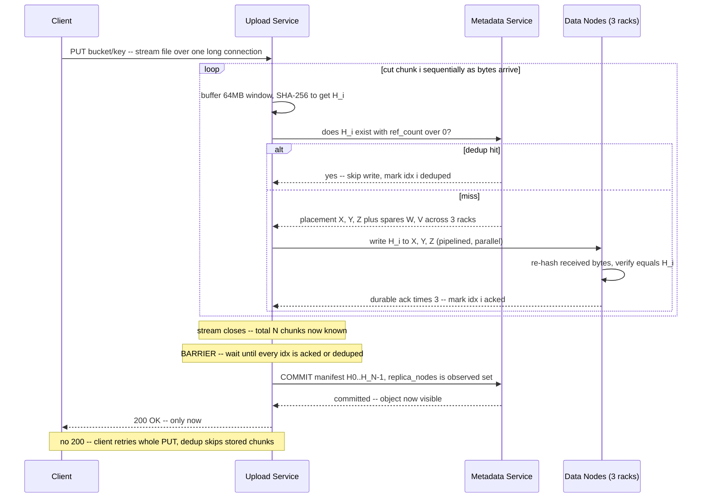

# Ingest Design: Streaming Upload Service for S3-like Object Storage

> **Scope:** the *write path* of a content-addressed, deduplicated object store, using the **streaming upload-service** ingest model (as opposed to client-side chunking / S3 multipart).
> **Core claim:** the client streams a whole file over one long connection to a dedicated **upload service**; the upload service chunks it server-side, coordinates durable replicated writes to data nodes, and commits the manifest — returning `200` to the client **only after** the manifest is committed.

---

## 1. Why a separate upload service (not "the gateway")

The metadata/control plane must never see object bytes — routing GB through it makes it a throughput bottleneck and a SPOF for in-flight transfers. But *someone* server-side has to terminate the byte stream if we want a **dumb client**. Split the roles into two distinct data-plane vs. control-plane components:

| Component | Plane | Sees bytes? | Scales with |
|---|---|---|---|
| **Metadata service** | Control | **No** — only hashes, placement requests, manifest commits | Metadata QPS (lightweight RPCs) |
| **Upload service** | Data | **Yes** — terminates the stream, chunks, hashes, writes to data nodes | Ingest bandwidth |
| **Data nodes** | Data | **Yes** — store hash-named chunk files, re-verify hash on write | Disk + NIC capacity |

The earlier mistake was folding the upload service into "the gateway." They are separate fleets: the metadata brain stays strongly consistent and byte-free; the upload service is horizontally-scaled muscle that holds only *ephemeral* per-upload coordination state.

---

## 2. Streaming vs. chunking — two orthogonal concerns

A single long-lived HTTP connection can carry a 5 GB file already — that's just streaming (HTTP/1.1 **chunked transfer-encoding**, or a known `Content-Length`, over TCP, which is a byte stream by nature). The server reads a small window at a time and never buffers the whole file, so RAM stays flat regardless of object size. **Transport was never the reason to chunk.**

We chunk for what happens to the bytes *after* they arrive:

1. **Deduplication** — the dedup key is a per-chunk hash. One monolithic blob = one hash; two near-identical 5 GB files share nothing. 64 MB chunks let only the changed chunk differ. Dedup is the primary cost lever, so this alone justifies chunking.
2. **Replication & placement granularity** — replicas are placed and re-replicated per chunk across racks; small units balance disk and recover in bounded pieces.
3. **Parallel + resumable transfer** — parallel chunk fetch on read; resume from last completed chunk on failure instead of restarting.
4. **Bounded failure blast radius** — bit-rot repairs one 64 MB chunk from a replica, not a 5 GB re-copy; the scrubber verifies per chunk.

**So:** the client streams the whole file (transport); the upload service chops that stream into chunks on the fly (storage strategy). One connection in, chunks out.

---

## 3. The write path, end to end



**Ordering is the correctness core:**
`all chunks durable (barrier)` → `commit manifest txn` → `txn returns` → **only then** `200` to client.

---

## 4. Sequential chunking, pipelined-parallel writes

Chunking is **sequential** — you can't cut chunk 2 before chunk 1 arrives, and the service holds only a small window, not the whole file. It assigns `chunk_index` 0,1,2… in stream order.

Writes to data nodes are **pipelined-parallel**: as soon as chunk `i` is cut, hand it to a writer worker and go back to cutting `i+1`. Chunk `i` replicates *while* `i+1` is still being cut.

```
stream → [cut c0][cut c1][cut c2]...      sequential, one buffer
              ↓      ↓      ↓
           write   write   write           parallel, bounded window (N in flight)
           c0→DNs  c1→DNs  c2→DNs
```

**Back-pressure:** cap in-flight writes (e.g. 4–8). If a fast stream outruns the writers, stop reading the socket → TCP flow-control slows the client. This prevents the pipeline from OOMing on a fast uploader. (Purely sequential writes would work but leave disk/NIC idle while cutting the next chunk.)

---

## 5. Placement is a hint, not a durable commitment

The metadata service's placement response is **advisory** — "try these 3 nodes across 3 racks, plus spares." It writes **nothing durable** at assignment time. All durable metadata is deferred to the end-of-upload manifest commit. Consequences of a data-node crash between assignment and commit:

| Timing | What happens | Cleanup needed |
|---|---|---|
| Target node crashes **before** write | Connect fails → upload service writes chunk to a **spare** node instead | None — nothing committed |
| Target node crashes **mid-write** (partial bytes) | Partial file is an **orphan** (unreferenced); write retried to a spare | Orphan GC'd later |
| **< 3 durable acks** achievable | Upload service does **not** commit — retries shortfall or fails the PUT | None — no visible object |

**Why this is safe by construction:** because placement carries no durable state and the manifest commit is the single publish point, every failure between assignment and commit costs at most a **re-upload of one chunk to a different node** — never a reconciliation of a broken pointer. Contrast the naive design that durably records "chunk H lives on X" at assignment time: a crash then leaves a committed lie requiring a repair protocol.

**Committed `replica_nodes` = the observed set that actually acked**, not the assigned set. If X was assigned but W took the replica, the manifest records `{Y, Z, W}`. The location map is only ever written with observed truth — which keeps the heartbeat / re-replication machinery honest afterward.

---

## 5a. Who owns placement — and why it stays in the metadata service

Placement returns **3 node IDs across 3 racks**, plus optional spares. A natural question: why not move placement out of the metadata service into a "data-node service" that already knows live node state?

**Decision: keep placement in the metadata service** (for this design's scale). The reasoning:

- **The failure you'd fear from splitting doesn't exist.** "If an assigned node crashes, how does the metadata service know where the *next* chunk goes?" — it never needs to. Placement is a **per-chunk, just-in-time** decision. Assigning node X to chunk 5 implies nothing about chunk 6; chunk 6 asks again and gets a fresh set of live nodes. Placement is a momentary suggestion, not a lease or a schedule.
- **Moving placement fixes no real correctness problem.** The dual-write hazard (bytes land on data nodes, then metadata is recorded separately) exists regardless of who computes placement. It's tolerated the same way either way (see §5b).
- **Splitting adds a cost:** a *decider* (data-node service) separate from the *recorder* (metadata service) is two brains that can drift. Keeping placement and the location index in one component means they can't disagree.

**Nuance to state out loud:** HDFS and Ceph *do* push placement toward the storage layer, and that's valid at very large scale because placement wants live signals — free space, disk health, load — that the data layer already has. If the metadata service ever strains to track per-disk state, revisit this (→ §9b). At this scale, one brain is simpler and removes decider-vs-recorder drift.

**Hard line that never moves:** the **manifest + reference counts** stay in the relational metadata store no matter what — they need cross-object transactional atomicity (refcount-must-be-correct-or-you-lose-data). Placement is soft and delegable; refcounts are hard, durable truth.

---

## 5b. What the metadata service stores per chunk — the full replica set

**The metadata service stores all 3 replica node IDs (`replica_nodes = {X, Y, Z}`), never a single one.** Storing one would collapse both availability and recovery:

- **On read:** if only one node were recorded and it's down, the reader is stuck — the other two healthy replicas are *invisible to the index*. You'd throw away fault tolerance at the lookup layer even though the storage layer is fine. Storing all 3 means the reader tries X, falls to Y, then Z — **read succeeds as long as any one replica is alive.** The availability guarantee lives in the *index remembering all 3*, not just where the bytes physically are.
- **On recovery:** when a node dies, re-replication must (a) find every chunk that lived on it and (b) find a *surviving* replica to copy from. A single-location index can answer neither. The full set answers both.

**Write fan-out:** for each chunk the upload service writes to **all 3** assigned nodes and waits for **3 durable acks** (swapping in a spare if one fails — the goal is 3 *successful* replicas, not 3 attempts). Data nodes stay dumb: no primary→secondary forwarding, the upload service does the fan-out. (Chain/primary-driven replication is the alternative — trades upload-service bandwidth for smarter data nodes; not used here.)

**Node death self-heals the index:** X dies → heartbeats stop → metadata finds every chunk whose `replica_nodes` included X → each is now under-replicated (`{Y, Z}` < 3) → copy from a survivor to a fresh node W in a third rack → **update** `replica_nodes` from `{X, Y, Z}` to `{Y, Z, W}`. The index tracks physical reality.

---

## 6. Completion tracking: a barrier, not "last ack wins"

Writes finish **out of order** (chunk 7 can ack before chunk 3). So completion cannot mean "the last chunk acked." It means **every chunk is accounted for.** The upload service holds one ephemeral table per upload:

```
upload_id: abc
total_chunks: N          # known only AFTER the stream closes
  idx 0 : acked {Y,Z,W}
  idx 1 : deduped        # counts as done, no write
  idx 2 : pending        # ← blocks the barrier
  ...
  idx N-1: acked {A,B,C}

commit iff:  stream_closed  AND  every idx in {acked, deduped}
```

Two facts must both hold before commit:

1. **Stream ended → N is known.** Until the client's stream terminates (zero-length transfer-encoding frame / connection close), the service doesn't know whether another chunk is coming. "Am I done?" is unanswerable before this.
2. **Every one of the N chunks has full replica acks** (or was a dedup hit). Order-independent set-membership check.

**Stuck chunk is caught, not silently dropped.** If chunk 2 never reaches 3 acks, the barrier never clears; a per-upload **timeout** trips and the whole PUT fails (client retries, dedup salvages acked chunks). Without the explicit table you'd wrongly commit a manifest pointing at a non-durable chunk — the exact bug this design prevents.

**Manifest is assembled in `chunk_index` order** from the completed table: parallel completion, sequential manifest. The reader reassembles by `chunk_index`, so stream order is preserved regardless of write-completion order.

---

## 7. Two retry layers

Two independent retry scopes; the client-level one almost never fires.

**Inner loop — upload service retries a single chunk (invisible to client).** A dead target node among the 3 → write the chunk to a **spare** from the placement response. The client keeps streaming, oblivious. One chunk, one replacement node, no bytes replayed by the client.

**Outer loop — client retries the whole PUT (last resort).** Fires only when the upload service *itself* fails: process crash, dropped connection, or it gives up (e.g. a whole rack down, can't satisfy 3-rack diversity, or timeout). The client re-issues `PUT` from the top. Safe because **nothing was committed** — a failed upload leaves only orphan chunks, and the retry re-runs the dedup check, so any chunks that already landed are found by hash and **skipped**. Dedup makes the retry cheap.

> **Rule of thumb:** the upload service handles **node** crashes; the client handles **upload-service** crashes.

---

## 8. The ack is the durability promise

The upload service holds the connection open until **both** the barrier clears **and** the manifest transaction commits, then sends `200`. It never acks early.

```
barrier clears (all chunks durable)
   → commit manifest txn to metadata service
        → txn returns committed
             → 200 to client   ← the durability promise
```

**Why not respond earlier?** The client treats `200` as "durable — I can delete my local copy." If the service acked *before* the manifest commit and then crashed, the client would believe the object exists while the metadata store has no manifest: the chunks are orphans, `GET` returns 404, and the client has discarded the only copy → **silent data loss.** The manifest commit is the publish boundary; the ack must sit strictly *after* it.

**Failure symmetry (no state the client can misread):**
- Got `200` ⇒ object committed and durable. Guaranteed.
- No `200` (error / timeout / dropped) ⇒ may or may not have committed; contract is **retry**, and dedup + the uncommitted-manifest invariant make the retry clean.

**Caveat / real-world contrast:** because the client holds one connection open for the *entire* duration (including tail replication + commit), very large uploads tie up that connection for a long time. This is precisely the pressure that pushes S3 toward **client-driven multipart** — each part confirmed durable independently, then a final "complete multipart" call. Same invariant (nothing visible until the final commit), but the wait is broken into per-part acks instead of one long held connection. The streaming-upload-service model trades that for a **dumb client** and server-side trust.

---

## 9. Invariants this design guarantees

1. **Bytes durable before manifest commit** — all chunks reach full replica count *before* the manifest transaction, so a mid-upload crash leaves orphan chunks (GC'd), never a manifest pointing at missing bytes.
2. **Manifest commit is the sole visibility boundary** — the single metadata transaction is the atomic publish moment; before it, nothing appears in `GET`/`LIST`.
3. **`filename == SHA-256(contents)` enforced at the data node** — each node re-hashes received bytes and rejects mismatches, so a content-addressed chunk can't be forged or silently corrupted (the trust boundary is server-side in this model).
4. **Ack ⟹ durable** — `200` is returned strictly after the commit, so the client's success signal is a true durability guarantee.

---

## 9a. Heartbeats: the metadata service is a NameNode, not a ZooKeeper

The metadata service ingests heartbeats from every data node — tracking liveness, cluster membership, and the chunk-location map, and triggering re-replication when a node goes silent. That *sounds* like ZooKeeper, but the analogy is wrong in the way that matters.

| | ZooKeeper / etcd | This metadata service |
|---|---|---|
| Identity | A **consensus** system (ZAB/Raft) over a small odd ensemble | A **database** (sharded Postgres) that also ingests heartbeats |
| Location/liveness state | *Is* the linearizable source of truth | **Soft, rebuildable index** over the data nodes' physical truth |
| How truth survives failure | Consensus replication of a tiny state machine | Data-node heartbeats + disk scans rebuild the map |
| Durable must-be-correct state | The coordination facts themselves | Manifest + refcounts, protected by **relational transactions** |

So the metadata service plays the **HDFS NameNode role** — authoritative *index*, liveness, placement, re-replication driver — which is a *superset* of "track heartbeats." It is **not** a ZooKeeper: ZooKeeper's identity is consensus-backed linearizable coordination state; the metadata service's liveness map is soft state layered on a transactional DB.

**The actual relationship between the two:** if the metadata service is itself an HA cluster (sharded, replicated), *it* may use ZooKeeper/etcd underneath — for leader election per shard, cluster config, failover coordination. ZooKeeper coordinates the **metadata service's own members**; the metadata service coordinates the **data nodes**. Different layers, not the same thing.

**Source of truth:** the **data nodes** own where bytes physically are; the metadata service's `replica_nodes` is a fast, queryable *index* over that truth, kept current by heartbeats and re-replication. Lose the index and it rebuilds from heartbeats ("I hold H1, H4, H9…").

**Scaling caveat:** heartbeat + block-report load from hundreds-to-thousands of data nodes, plus the memory to hold the location map, is the classic **NameNode bottleneck** — a legitimate deep-dive, and a *different* strain from ZooKeeper's (membership-write throughput through consensus).

---

## 9b. Placement evolution: physical node IDs vs. a logical placement handle

The design above stores **physical** replica sets and heals them on failure (the HDFS NameNode model — call it **Design A**). There is a cleaner large-scale alternative that fully resolves the "placement and heartbeats are one concern, so they shouldn't be split across components" critique — **Design B**, the Ceph/CRUSH model.

The axis: **does the location index get *updated* on every failure, or does a *resolver* absorb the failure?**

| | **Design A** — physical node IDs (HDFS NameNode) | **Design B** — logical handle (Ceph / CRUSH) |
|---|---|---|
| What metadata stores per chunk | Physical replica set `{X, Y, Z}` | A **logical handle** (placement group id) — no node IDs |
| Placement + heartbeats owned by | Metadata service | A **storage-cluster manager** (owns heartbeats, cluster map, placement, resolution) |
| Node dies → | Re-replicate, then **update** metadata `{X,Y,Z}`→`{Y,Z,W}` | Cluster map changes; handle **resolves** to new nodes; **object metadata untouched** |
| Read path | One lookup returns manifest **+ node IDs** directly | Lookup returns manifest of **handles**; each resolves to nodes **on access** |
| Coordination burden | Location table churned on every failure; heartbeats coupled into metadata service | Small, slowly-changing **cluster map under consensus** (Ceph monitors = Paxos) |
| Separation of concerns | Placement + heartbeats + manifest all in one component (a coupling smell) | Physical placement fully encapsulated in storage manager; metadata does only logical naming |

**Design B is arguably cleaner on separation-of-concerns grounds** — placement (a storage-cluster problem needing live signals) stops leaking into the metadata service, and the "stable identifier that survives node death" means node failures never touch object metadata. But it costs three things: (1) **resolution is now on the read path** (a resolver, or client-side CRUSH with fresh cluster maps, gates every read); (2) the handle→node resolver must itself be **strongly consistent + HA**, which **reintroduces a consensus component** — just smaller and more sharply scoped (the cluster map, not the whole index); (3) you lose the simple "one lookup returns everything" read.

**Recommendation:** **start with Design A** for its read-path directness and easy reasoning (no on-read resolver, no separate consensus cluster-map). Name **Design B explicitly as the scaling evolution**: *"as placement state and heartbeat load strain the metadata service, split placement into a storage-cluster manager and switch object metadata from physical node IDs to logical placement handles resolved on access — the Ceph model — decoupling placement churn from the metadata index entirely."*

---

## 10. Streaming upload-service vs. client-side chunking

| | Client chunks (S3 multipart / Dropbox) | Upload-service chunks (this design) |
|---|---|---|
| Client complexity | High — SDK splits, hashes, retries per part | Trivial — one stream |
| Upload-bandwidth dedup | Best — duplicate chunks never leave the client | Weaker — full file crosses the wire; dedup saves *storage + replication*, not upload bandwidth |
| Trust boundary | Must re-verify hashes server-side anyway | Server hashes from the bytes it read → inherently trusted |
| Server ingest fleet | Minimal | Must scale with ingest throughput |
| Connection hold time | Short per-part; final complete call | One long connection for the whole object |
| Best when | You control the client & bandwidth is the cost lever | Thin/untrusted clients (browser, mobile); no smart SDK |

**Neither is "more correct"** — the invariant (nothing visible until the final commit) is identical. The choice is which pressure dominates: **client simplicity + trust** (upload service) vs. **upload-bandwidth savings + client-side dedup** (multipart).

---

## 🔍 Senior-Signal Questions

- **"Is the upload service's completion table the only per-upload durable-looking state, and what happens to it on upload-service crash?"** → *Why it matters: shows the table is ephemeral coordination state, not a second source of truth — crash just fails the PUT and orphans get GC'd, keeping the metadata service the only durable brain.*
- **"What bounds the in-flight-write window, and how does back-pressure propagate to the client?"** → *Why it matters: names the OOM failure mode of an unbounded parallel pipeline and the TCP flow-control lever that prevents it.*
- **"Does the manifest record the *assigned* replica set or the *observed* one?"** → *Why it matters: observed-set commit is what keeps the heartbeat/re-replication location map from diverging from reality after node-swap-on-failure.*
- **"When does a stuck chunk fail the whole upload rather than hang forever?"** → *Why it matters: the per-upload timeout on the barrier is the difference between a caught failure and a silently committed manifest pointing at a non-durable chunk.*
- **"At what object size / connection-hold cost do we abandon the single-stream model for client multipart?"** → *Why it matters: identifies the scaling inflection between the dumb-client model and per-part-ack multipart, and the trust re-verification that comes with it.*
- **"Why does the metadata service store the full replica set per chunk rather than a single location?"** → *Why it matters: single-location indexing silently discards read fault-tolerance and makes re-replication impossible — storing all 3 is what makes reads survive a node loss and gives recovery a source to copy from.*
- **"Is the metadata service a NameNode or a ZooKeeper — and if it needs HA, what coordinates its own members?"** → *Why it matters: distinguishes a soft, rebuildable location index on a transactional DB from a consensus-backed coordination primitive, and shows the two live at different layers (ZooKeeper may sit under the metadata service, not replace it).*
- **"At what point do we move from physical node IDs to a logical placement handle resolved on access?"** → *Why it matters: names the HDFS→Ceph/CRUSH inflection — trading a churned location table + coupled heartbeats for an on-read resolver backed by a small consensus cluster map.*