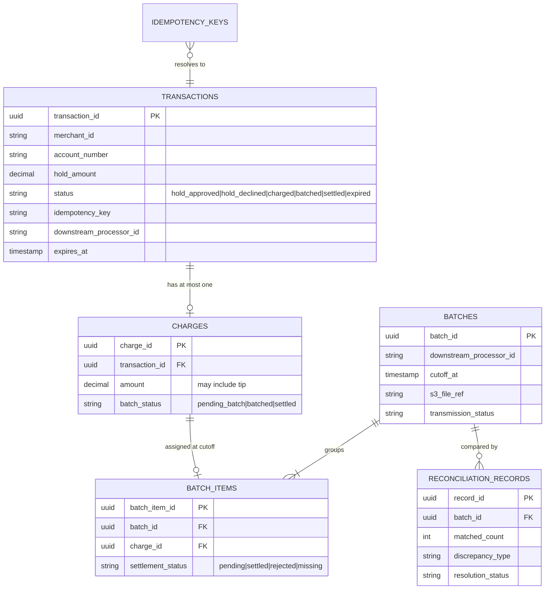
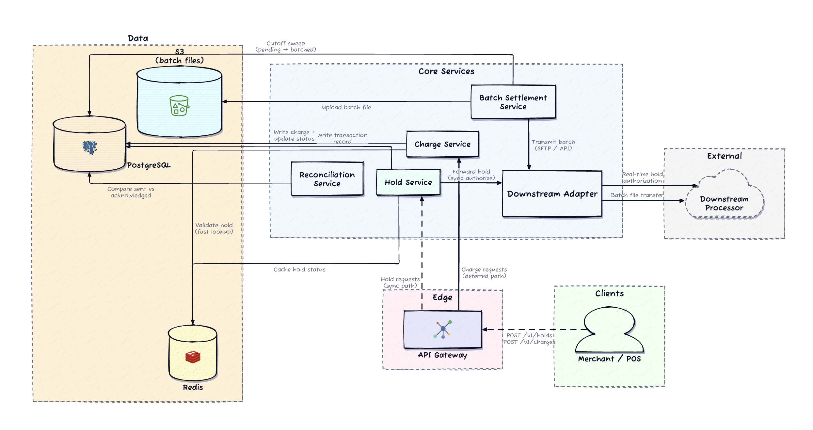
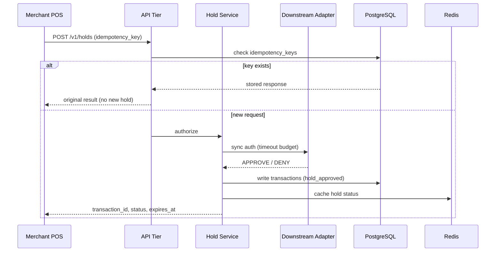
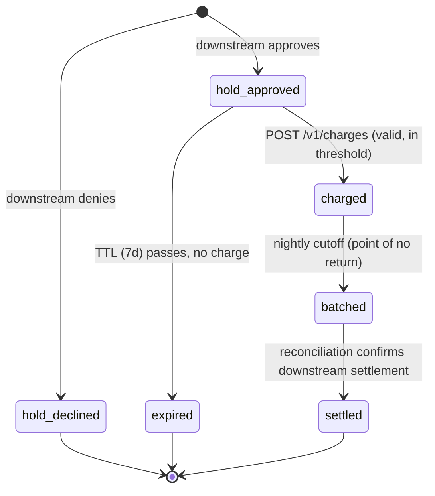
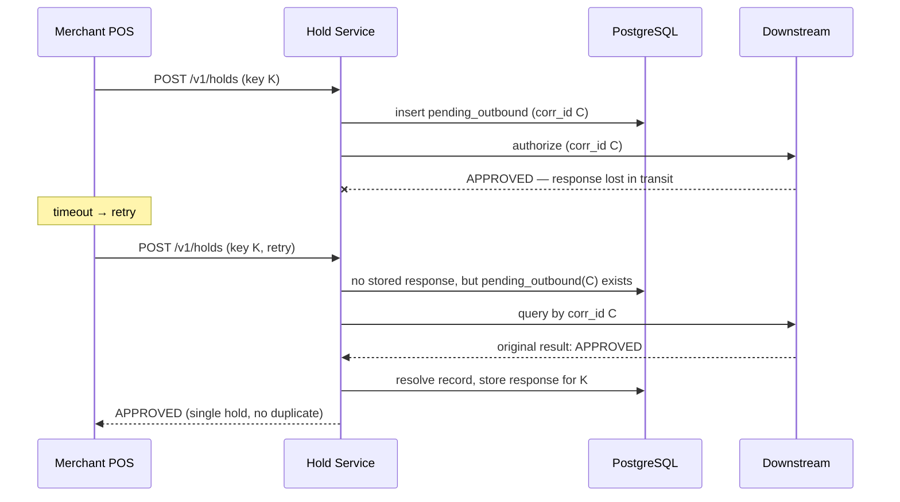

# Design a Payment Processor (Card-Present Acquiring)

> **System Design in a Hurry walkthrough** — Requirements → Core Entities → API/Interface → Data Flow → High-Level Design → Deep Dives.
> A payment processor sits between **merchants** and **downstream card networks** (Visa, Mastercard, Amex). It receives swipe/tap transactions, forwards them for real-time authorization, and settles actual funds in a **nightly batch**. The hard part: bridging fast synchronous authorization with slow deferred settlement **without losing track of which charges actually settled**.

---

## 1. Requirements (~5 min)

### Clarifying questions I'd ask first

| Question | Answer | Takeaway |
|---|---|---|
| Are both the real-time hold path **and** the deferred batch settlement path in scope? | Both. Holds are synchronous & merchant-blocking; settlement is a nightly batch. | Two distinct modes with different expectations. |
| What latency does the merchant expect on a hold? Must we wait for the downstream response? | Sub-second p95, fully synchronous through to the downstream processor. | Authorization is on the critical merchant path — latency is a first-class requirement. |
| If a merchant retries after a timeout, does each retry create a new authorization? | No — a retried hold must not create two holds; a retried charge must not batch twice. | Retries are normal traffic; repeated requests must land on the same business outcome. |
| If downstream acknowledges only **part** of a batch, is batch-level ack enough? | No — per-charge settlement tracking is required. Partial success is normal. | Settlement truth is per-charge, not per-file. |
| How long is a hold valid? What about a charge against an expired hold? | 7 days TTL. Charge against expired hold → reject. Expired holds auto-release funds. | Hold expiry is core lifecycle, not cleanup detail. |

### Functional requirements (top priorities)

1. **Accept hold requests** (account number, amount, merchant ID) → forward **synchronously** to the downstream processor → return approve/deny.
2. **Accept charge requests** referencing an approved hold → **store durably before acknowledging** → queue for batch settlement.
3. **Nightly batch settlement**: at cutoff, gather pending charges, group by downstream processor, build batch files, transmit.
4. **Auto-release** held funds when no charge arrives within the hold TTL.

### Non-functional requirements (quantified)

- **Latency**: hold authorization **p95 < 500 ms end-to-end**, including the synchronous downstream round trip.
- **Durability**: **no charge lost** between merchant submission and settlement — durable write *before* acknowledgment.
- **Bounded batch window**: nightly pipeline completes in **< 2 hours** across all downstream processors.
- **Scale**: **10M hold/charge requests/day** from tens of thousands of merchants.
- **Idempotency**: merchant retries and network failures never create duplicate authorizations or double settlements.
- **Reconciliation**: detect and surface mismatches between authorized, charged, and downstream-settled amounts.

> **Consistency model**: payments → **strong consistency** (ACID lifecycle, conditional state transitions). *DDIA Ch. 7 (Transactions).*

### Back-of-the-envelope (only where it changes a decision)

| Quantity | Value | Drives |
|---|---|---|
| Daily holds | ~10M | API throughput, downstream adapter capacity |
| Daily charges | ~8M (not every hold converts) | Batch file size, nightly pipeline scale |
| Peak hold rate | ~300/s | Hold service sizing, downstream timeout budgets |
| Hold TTL | 7 days | Expiration cleanup, late-charge edge cases |
| Batch window | ~2 h | Pipeline parallelism, retry budget |
| Downstream processors | 5–10 networks | Batch grouping, per-processor files |
| Avg charge | ~$25 | Reconciliation thresholds, drift sensitivity |

These numbers justify: keeping the hold path synchronous and fast, per-processor parallelism in the batch pipeline, and **per-batch** (not global) reconciliation.

---

## 2. Core Entities (~2 min)

- **Transaction** — lifecycle anchor for a hold; owns the state machine (`hold_approved` → … → `settled`).
- **Charge** — the merchant's capture instruction against an approved hold (amount may include tip).
- **Batch** — one nightly settlement file per downstream processor.
- **BatchItem** — a single charge's membership in a batch, carrying its **own** settlement status.
- **ReconciliationRecord** — per-batch comparison of what we sent vs. what downstream acknowledged.
- **IdempotencyKey** — merchant-supplied key → stored response mapping.

**Relationship summary**: one `transactions` row ↔ at most one `charges` row → one `batch_items` row at cutoff → one `batches` row per downstream processor → compared by `reconciliation_records`.



### Core invariants

- A transaction **only moves forward** through the state machine; `settled`/`expired` are terminal.
- A charge is only valid against a `hold_approved`, unexpired transaction **with no existing charge**.
- Once `batch_status = batched`, a charge is **immutable and unreassignable** — the cutoff is a point of no return.
- Each `(idempotency_key, merchant_id)` pair resolves to **exactly one** transaction or charge.
- A batch contains charges for a **single** downstream processor.

### Storage choices

- **PostgreSQL** — ACID lifecycle correctness, cross-table joins, conditional state-machine updates. *DDIA Ch. 7.*
- **S3** — **immutable, versioned batch files** for audit and safe retransmission.
- **Redis** — rebuildable **cache** of hold status on the charge hot path (sub-ms lookups); PostgreSQL is the fallback authority. **Never source of truth.**

### Key access patterns & indexes

| Access pattern | Index |
|---|---|
| Lookup by `transaction_id` (merchant timeout recovery) | PK |
| Nightly sweep: `batch_status = 'pending_batch'` grouped by processor | `charges(batch_status, created_at)` |
| Idempotency resolution on hold hot path | `transactions(idempotency_key, merchant_id)` |
| Reconciliation: unresolved items per batch | `batch_items(batch_id, settlement_status)` |
| Retention/archive | Partition `reconciliation_records` by month |

**Cutoff sweep query:**

```sql
SELECT c.charge_id, c.amount, t.downstream_processor_id, t.account_number
FROM charges c
JOIN transactions t ON t.transaction_id = c.transaction_id
WHERE c.batch_status = 'pending_batch'
ORDER BY t.downstream_processor_id, c.created_at;
```

---

## 3. API / System Interface (~5 min)

**The core asymmetry**: a hold gets an **immediate synchronous** approve/deny (customer is at the register); a charge gets a **durable acknowledgment with eventual batch settlement**. Merchants recover truth from the canonical status endpoint — not settlement callbacks or batch file parsing.

### Communication modes (three trust boundaries)

- **REST** — merchant-facing holds/charges/status. External trust boundary.
- **Synchronous HTTP/RPC** — hold service → downstream processor adapters. We control both sides; tight latency budgets, bounded retries.
- **Batch file transfer (SFTP/API upload)** — nightly settlement. Scheduled bulk transfer with **asynchronous acknowledgment**, not request-response.

### `POST /v1/holds`

Body: `merchant_id`, `account_number`, `amount`, `idempotency_key`.
Handler: check `idempotency_keys` → forward synchronously to downstream adapter → record in `transactions` → populate Redis → return.
Response: `transaction_id`, `status` (`hold_approved`/`hold_declined`), `hold_amount`, `expires_at`.

> POS terminals retry on timeout — a duplicate **must return the original result**, not double-lock the customer's funds.

### `POST /v1/charges`

Body: `transaction_id`, `amount` (may include tip), `idempotency_key`.
Handler: validate hold is `hold_approved`, unexpired, uncharged; verify amount within tip threshold; write `charges` durably; set `transactions.status = charged`; ack.
Response: `charge_id`, `transaction_id`, `status = charged`.

> **How I'd say it**: "The charge acknowledgment is a **durable acceptance, not a settlement confirmation**. The merchant gets certainty we won't lose the charge; settlement certainty comes after the batch and reconciliation."

### `GET /v1/transactions/{transaction_id}`

The **recovery API** — canonical lifecycle status: hold status, charge status, settlement status, amounts, timestamps. If a charge call timed out, the merchant polls here.

### Supporting surfaces

- `GET /v1/merchants/{merchant_id}/transactions` — cursor-paginated, filterable merchant dashboard/recon view.
- `POST /internal/batches/{batch_id}/retry` — operator endpoint; **retransmits the existing immutable S3 file**, never rebuilds (avoids sweeping in post-cutoff charges).

**Why batch settlement, not synchronous charge forwarding?** It matches how card-network settlement actually works. The cutoff gives reconciliation a clean snapshot; per-item tracking handles partial failure without resettling successes. Tradeoff: settlement delayed by hours — **inherent to the domain, not a design weakness**.

---

## 4. Data Flow (~5 min) — nightly settlement pipeline

1. **Cutoff sweep** — serializable transaction marks all `pending_batch` charges as `batched`, grouped per downstream processor, creating `batches` + `batch_items` rows.
2. **File construction** — build one batch file per processor; upload to **S3 as an immutable artifact** *before* transmission.
3. **Transmission** — send each file via SFTP/API adapter; record transmission status on `batches`.
4. **Acknowledgment ingestion** — as downstream acks arrive (minutes–hours later), update each `batch_items.settlement_status` individually.
5. **Reconciliation** — compare sent vs. acknowledged per item; write `reconciliation_records`; promote matched items to `settled`; surface discrepancies.

---

## 5. High-Level Design (~10–15 min)

From the merchant's view it's one pipeline; architecturally it's **two stories sharing one authoritative PostgreSQL store**:

- **Story 1 — real-time hold authorization**: synchronous, latency-sensitive, must not be entangled with batch state.
- **Story 2 — deferred batch settlement**: durable state, reliable bulk delivery over hours.

> **Why not the naive single-service design?** A single Payment Service writing `payment(status=INITIATED)` and deducting balance synchronously has three fatal gaps: (1) **no hold mechanism** → two concurrent payments see the same balance → double-spend; (2) **no external rail integration** → money never actually settles; (3) **no reconciliation** → our records silently drift from rail truth when a network failure splits the commit. The stronger design answers each: atomic hold reservation, a deferred batch pipeline, and a reconciliation job.

### Architecture



### Flow 1 — Real-time hold authorization

`POST /v1/holds` → API validates + checks `idempotency_keys` (duplicates return stored response) → hold service routes by **account number prefix** to the right downstream adapter → synchronous forward within a tight timeout budget → on approval: write `transactions(status=hold_approved)`, populate Redis, return; on decline: record `hold_declined`, return. **Strictly synchronous end-to-end** to meet the 500 ms p95.



### Flow 2 — Charge submission (durable acceptance)

`POST /v1/charges` → idempotency check → validate hold (**Redis fast path, PostgreSQL fallback**): `hold_approved`, unexpired, uncharged → amount within tip threshold → write `charges(batch_status=pending_batch)` + `transactions.status=charged` durably → ack. *Ack = durably stored + will enter next batch. Not settled.*

### Flow 3 — Nightly batch settlement

Four stages (see Data Flow): atomic cutoff sweep → immutable S3 file per processor → transmission → per-item ack ingestion.

### Flow 4 — Reconciliation

Compare sent vs. reported per `batch_items` entry → classify `matched` / `missing` / `amount-mismatch` / `unexpected extra` → write `reconciliation_records` → settled items close the lifecycle (`transactions.status = settled`) → unresolved discrepancies to operator dashboards/alerts.

### Transaction lifecycle state machine



**The critical transition is `charged → batched`**: once batched, a charge cannot be modified or reassigned — this is what makes the batch file a clean, immutable artifact.

> **How I'd say it**: "I'd clarify up front whether partial captures and refunds are in scope, because they change the state machine significantly (adds `partially_captured`). This variant scopes to one hold → at most one charge."

---

## 6. Deep Dives (~10 min)

Focused on the three places the design either survives production pressure or **silently corrupts financial data**. (Skipping generic adapter patterns / caching — no core teaching tension there.)

### Deep Dive 1 — Idempotency across the hold–charge–settlement lifecycle

The processor sits between **two unreliable networks**: POS terminals retry on timeout; downstream partitions can lose an authorization response *after* the downstream approved it. Three layers protect three different boundaries:

**Hold layer.** Check `idempotency_keys` first; duplicates return the stored response. **The hard case**: downstream approved, but the response was lost — retry sees no stored key and would re-forward, creating a duplicate downstream hold. **Mitigation**: insert a `pending_outbound` record with a **correlation ID before forwarding**. The retry path detects the existing `pending_outbound` row, **queries downstream by correlation ID** to retrieve the original result, and resolves it instead of re-authorizing.



**Charge layer.** Simpler — charges don't leave the system immediately. Idempotency check + charge insert are **atomic in one PostgreSQL transaction**. The one-hold-one-charge constraint is a second natural dedup: if `status = charged`, any further charge is rejected regardless of key. *DDIA Ch. 7 — atomicity as the dedup primitive.*

**Batch layer.** Danger shifts to pipeline retries: on transmission failure, **retransmit the same immutable S3 artifact**, never rebuild. Per-item `batch_items` tracking ensures re-batching only picks up items never settled.

> Idempotency is not a convenience header — it's **the correctness mechanism** across all three boundaries. *DDIA Ch. 12 — end-to-end argument: dedup must live at the business-operation layer, not just TCP retransmission.*

### Deep Dive 2 — Batch settlement: cutoff boundary, partial failure, completion

The naive version is "query pending, write file, send." The hard parts:

**Cutoff boundary.** The job opens a **serializable transaction** (*DDIA Ch. 7 — serializability*): join `charges` × `transactions` for `pending_batch`, group by processor, create `batches`, flip each charge to `batched`, insert `batch_items`. Serializable isolation guarantees a concurrent charge insert either lands **before** the sweep (included) or **after** (next night) — a charge can never be in two batches or fall through the gap. If the cutoff transaction fails, nothing was marked; retry is clean.

**Crash-safe ordering.** Build file → **upload to S3 (immutable) → then transmit**. Crash between construction and transmission? Resume by transmitting the existing file — never rebuild with a potentially different charge set.

**Partial failure.** Downstream may accept some items, reject others, or send an incomplete ack. Per-item `settlement_status` (`settled` / `rejected` / `missing` / `pending`) is updated individually; non-terminal items get re-batched or escalated.

**Completion definition.** A batch is complete **not** when transmitted, but when **every `batch_items` row is terminal and reconciliation has run**. Missing acks past the expected window → page operators, don't silently wait.

### Deep Dive 3 — Reconciliation: closing the trust gap


Without reconciliation we hold two record sets — ours and downstream's — with no systematic proof they agree. The service loads all `batch_items`, compares against the downstream response, and classifies:

| Classification | Meaning | Action |
|---|---|---|
| `matched` | amount + status agree | promote to `settled` |
| `missing` | sent, not acknowledged | time-windowed retry check → escalate |
| `amount mismatch` | downstream settled a different amount | immediate operator review (tip adjustment? downstream error?) |
| `unexpected extra` | downstream reported something we never sent | flag separately |

Concretely: a 500-item batch → 497 matched, 2 missing, 1 amount-mismatch. Critical patterns (high missing-rate in one batch) trigger **immediate alerts**, not daily review.

> **The aha moment of the whole system**: the hold is the real-time *promise*; the charge is a *deferred accounting instruction*; the batch file is **not a second transaction** but settlement of an already-authorized obligation; and reconciliation is where you discover whether your promises matched downstream truth. Every earlier decision — the state machine, the clean cutoff, immutable files, per-item tracking — exists **to make reconciliation tractable**. Sloppy upstream guarantees degrade reconciliation from systematic verification into manual forensics.

> **How I'd say it**: "Reconciliation closes the trust gap between what we promised the merchant and what downstream actually settled. Without it, we're just forwarding and hoping."

---

## 7. Other Considerations

**Hold expiration & cleanup.** Scheduled job: `hold_approved` + `expires_at` passed → `expired`, notify downstream to release funds. **Edge case — late-arriving charge**: check `expires_at` at charge-validation time, don't rely on the background job having already flipped status.

**Tip threshold & partial-capture extension.** Card-present charges often exceed the hold (a $20 hold → $25 charge with tip). Enforce a configurable threshold (~20% for restaurant MCCs); violating network thresholds risks chargebacks/fines. Partial captures would add a `partially_captured` state — out of scope here.

**Downstream health & circuit breaking.** The hold path is synchronous, so a slow processor can burn the 500 ms budget with timeouts. **Circuit breaker per processor**: when error rate/latency exceeds thresholds, open the circuit and return a fast decline / temporarily-unavailable. **Failure domain stays processor-local** — one sick network must not pause holds routed to healthy ones. On the batch side, slow acks extend completion windows; tie batch-ack-latency alerts to downstream health so on-call can distinguish "our pipeline is slow" from "their network is down."

**Settlement observability — failure-signal mapping.**

| Signal | Likely cause |
|---|---|
| Rising missing-item rate, **one** processor | Their protocol/format changed |
| Rising missing-item rate, **all** processors | Our batch construction is producing malformed files |
| Settlement lag rising, **all** processors | Our pipeline is slow |
| Settlement lag, **one** processor | Their acknowledgment path |
| Recon match rate < 99.9%, one processor | Page operators |
| Same drop system-wide | Our schema/serialization regression |

**Top-level health metric**: **settlement lag** — time from cutoff to full reconciliation completion.

---

## Real-World Anchor

- **Stripe-style gateways** follow this exact authorize-then-capture split: the auth is synchronous against the issuer, capture is queued, and settlement runs in network batch windows — the acknowledgment-vs-settlement asymmetry in this design mirrors Stripe's `payment_intent` status progression.
- **Bytebytego's payment-system breakdown** emphasizes the same triad: idempotency keys at the API edge, a **reconciliation job as the safety net** (their "what happens when the PSP and ledger disagree" framing), and retries with exponential backoff bounded by idempotency — matching Deep Dive 1's three-layer structure.
- **UPI-style cross-org chaining** (from prior study): avoid distributed ACID across org boundaries; chain local transactions via end-to-end idempotency keys with reconciliation as the safety net — this design is the single-org instantiation of the same *DDIA Ch. 12* end-to-end argument.

## 🔍 Senior-Signal Questions to Ask in Your Interview

- **"Is the charge acknowledgment a durable acceptance or a settlement confirmation, and does the merchant contract distinguish them?"** → *Why it matters: shows you understand the promise/settlement asymmetry that defines the entire domain.*
- **"How do we handle a downstream authorization that succeeded but whose response was lost — does the retry re-authorize or query by correlation ID?"** → *Why it matters: the pending_outbound/correlation-ID pattern is the difference between idempotency-as-header and idempotency-as-correctness.*
- **"What isolation level does the cutoff sweep run at, and what happens to a charge inserted concurrently with the sweep?"** → *Why it matters: signals you know serializability is what makes the cutoff a clean snapshot, not just a timestamp.*
- **"When is a batch 'complete' — at transmission, at acknowledgment, or at reconciliation?"** → *Why it matters: per-item terminal status as the completion definition separates a real processor from a file-dump toy.*
- **"If reconciliation match rate drops, how do we distinguish our regression from a downstream format change?"** → *Why it matters: failure-signal mapping (one-processor vs. all-processor deviation) is operational senior thinking.*