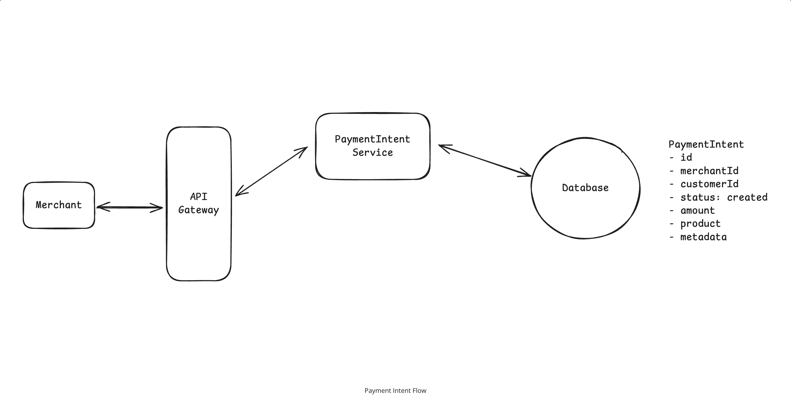
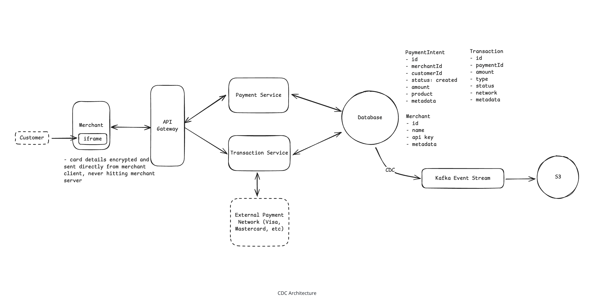
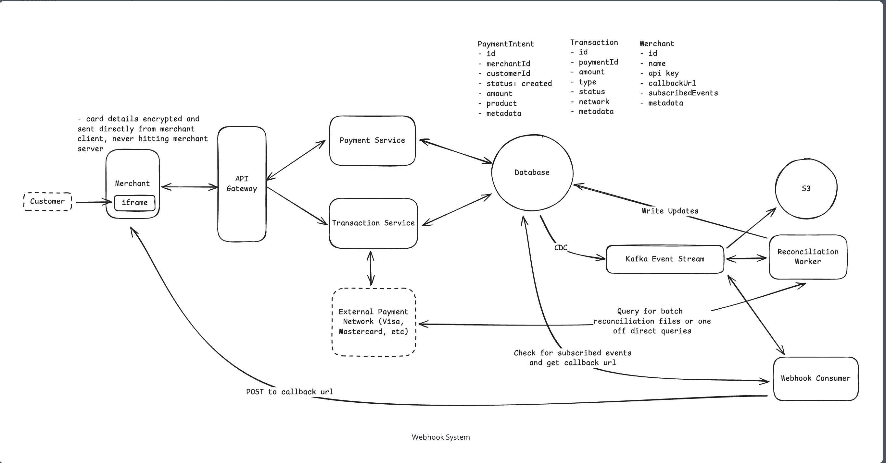
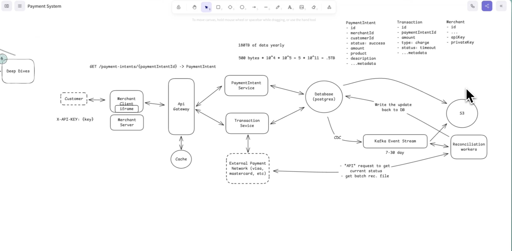

# Design a Payment System (Stripe)

---

## Understanding the Problem

**What is Stripe?** A payment processor lets a *merchant* accept money from customers without building their own payment infrastructure. The customer enters card details, the merchant hands them to Stripe, Stripe drives the charge through the card networks, and returns the result. The hard parts are not the happy path — they are **security**, **durability/auditability**, and **transaction safety across an asynchronous external network we do not control**.

---

## 1. Requirements (~5 min)

### Functional (top 3, prioritized)

1. **Merchants can initiate payment requests** — charge a customer a specific amount.
2. **Customers can pay with credit/debit cards.**
3. **Merchants can view payment status** — `pending`, `succeeded`, `failed`.

**Out of scope (call out, then defer):** saved payment methods, refunds/disputes, transaction reports, alternative rails (bank transfer, wallets), subscriptions, merchant payouts.

### Non-Functional (quantified, top 4)

1. **Security** — card data must never touch merchant servers (PCI-DSS); merchant identity must be verifiable and replay-proof.
2. **Durability & auditability** — *zero* transaction-data loss, immutable audit trail, reconstructable history for disputes/audits years later.
3. **Transaction safety / financial integrity** — no double-charges, no "charged-but-reported-failed," despite an inherently async external network.
4. **Scale** — ~**10,000 TPS** at peak, bursty (Black Friday), read-heavy on status.

**Out of scope:** multi-region regulatory compliance, pluggable payment-method extensibility.

> **Estimation note:** don't front-load BOTE math. We'll compute inline in the Scale deep dive only where a number changes a decision (Kafka partition count, DB shard/archival strategy).

---

## 2. Core Entities (~2 min)

- **Merchant** — identity, bank account, API keys / secret keys, webhook config.
- **PaymentIntent** — the merchant's *intention* to collect an amount. **Owns the state machine** (`created → authorized → captured / canceled / refunded`) and **enforces idempotency** on retries.
- **Transaction** — a polymorphic money-movement record linked to one PaymentIntent (Charge, Refund, Dispute, Payout). We focus on **Charge**.

**Key relationship — one PaymentIntent → many Transactions.** A failed attempt retried under the same intent spawns a *new* transaction; partial payments create multiple; a refund is a new negative-amount transaction. The merchant only sees the PaymentIntent; we absorb the transaction complexity internally.

> *DDIA Ch. 12 (The Future of Data Systems):* modeling money movement as an **append-only sequence of events** rather than mutable balances is what makes auditability and end-to-end correctness achievable. The `Transaction` rows are those events; the `PaymentIntent` is the derived state.

---

## 3. API / Interface (~5 min)

REST over plural-noun resources. **Merchant identity is derived from the auth token / signed request — never trusted from the body.**

**Create a PaymentIntent** (customer hits checkout):
```
POST /payment-intents  ->  { paymentIntentId }
{ "amountInCents": 2499, "currency": "usd", "description": "Order #1234" }
```

**Attach a charge** (card details collected securely — see Security deep dive; never raw to our backend in production):
```
POST /payment-intents/{id}/transactions
{ "type": "charge", "card": { "number": "...", "exp_month": 12, "exp_year": 2025, "cvc": "..." } }
```

**Check status** (polling):
```
GET /payment-intents/{id}  ->  PaymentIntent   // status: created | processing | succeeded | failed
```

**Webhook (push, industry standard)** — merchant registers a callback URL; we `POST` on status change:
```
POST {merchant_webhook_url}
{ "type": "payment.succeeded", "data": { "paymentId": "pay_123", "amountInCents": 2499, "status": "succeeded" } }
```
> Webhooks are a whole interview on their own — scope this with your interviewer up front. Covered at a high level in the bonus section.

---

## 4. High-Level Design (~10–15 min)

We build the architecture endpoint-by-endpoint. This diagram is the centerpiece — everything after this hardens it.



**Components**
- **API Gateway** — entry point; authentication, rate limiting, routing.
- **PaymentIntent Service** — creates/manages intents; serves status reads.
- **Transaction Service** — receives card data, creates transaction records, and **directly** owns the external-network conversation (authorize → listen for settlement/chargeback callbacks). Keeping network I/O and record-keeping in one service removes a hop and keeps PCI scope tight.
- **Operational DB** — current-state store (intents, transactions, merchants).
- **External Payment Network** *(dotted = outside our trust boundary)* — private, PCI-DSS networks, binary protocols (ISO 8583), leased lines / mTLS VPN.

**Flow per functional requirement**

1. **Initiate** — `POST /payment-intents` → gateway authenticates → PaymentIntent Service writes a `created` record → returns `paymentIntentId`. No money has moved; we've recorded intent and minted a tracking handle.
2. **Pay** — customer's card data goes to the **Transaction Service** (in production, straight from the browser via our iframe — see Security). Transaction Service writes a `pending` transaction, sends the authorize request to the network, records the initial approve/decline, keeps listening for later settlement/chargeback callbacks, and updates the PaymentIntent as the lifecycle advances.
3. **Status** — `GET /payment-intents/{id}` → gateway validates → PaymentIntent Service reads current state from the DB. Simple polling; webhooks later remove the poll.

---

## 5. Deep Dives (~10 min)

### 5.1 Security

Two questions to answer: **(a)** is the merchant who they claim to be? **(b)** are we keeping customer card data from being stolen?

**(a) Merchant authenticity — evolve past static API keys.**

- **Good — static API key** (`Authorization: Bearer pk_live_...`): gateway looks it up → merchant. Simple, but a static credential in every request is **replayable** if intercepted and tends to leak into client code / repos. Unacceptable for money movement.
- **Great — request signing (HMAC-SHA256).** Issue a *public API key* (identity) **and** a *private secret* (server-side only). Per request the merchant signs `method + path + body + timestamp + nonce` with the secret:
  ```
  Authorization: Bearer pk_live_...        // routing: which merchant / which secret
  X-Request-Timestamp: 2023-10-15T14:22:31Z
  X-Request-Nonce: a1b2c3d4-...
  X-Signature: sha256=7f83b16...           // HMAC over the request
  ```
  Gateway recomputes the HMAC, compares, checks the timestamp is within a 5–15 min window, and checks the nonce hasn't been seen. This gives **authenticity + integrity + replay protection**.

> **Senior nuance (your recurring point):** the API key is still needed *even with signing* — it is the **routing index** that tells the gateway *which* secret to recompute against. It is not redundant security; it's the lookup key. (Same principle as `kid` in asymmetric JWT verification.)

**(b) Protecting card data — defense in depth, three tiers.**

- **Bad — merchant collects card data on their server.** Every merchant becomes a PCI target and a liability sink. Card data must **never** touch merchant servers.
- **Better — our iframe.** We serve a JS SDK that mounts an iframe from *our* domain on the merchant page. Same-origin policy walls the merchant's JS off from the card fields; data goes straight to us over HTTPS. Limitation: security rests on browser policy and TLS-in-transit only.
- **Best — iframe + client-side encryption.** The SDK encrypts card data with **our public key inside the browser** before it leaves the device; we decrypt with the private key inside an **HSM**. Even a compromised merchant page or iframe yields only ciphertext. HTTPS then protects already-encrypted data — layered so one failure doesn't expose PANs.

> *DDIA Ch. 9* framing: this is defense-in-depth against a partially-trusted boundary — assume any single layer (TLS, same-origin, iframe integrity) can fail, and ensure correctness/secrecy survives that failure.

---

### 5.2 Durability & Auditability — no transaction data ever lost

Losing payment history is a legal and financial disaster. We must reconstruct the *full sequence* — initiated → authorized → captured → refunded — years later for disputes, chargebacks, and audits.

- **Bad — mutable `UPDATE` in place.** `UPDATE payment_intents SET status='captured' ...` **throws away history**. A bad deploy silently corrupts state; auditors need the trail, not just the current balance.
- **Better — app-level audit table.** Wrap the main `UPDATE` and an append-only `INSERT` into `payment_audit_log` in one transaction. Preserves history, but **depends on developers remembering the audit insert** (miss it → silent gap), and it couples years of audit rows onto the 10k-TPS operational DB.
- **Best — CDC → immutable event stream** (Stripe's approach). Keep a lean operational DB with **no audit tables**; capture *every committed change* from the DB's **WAL** via **Change Data Capture** and publish to Kafka. Because CDC reads the log, **if it committed, it's in the stream** — no reliance on app code.



Kafka gives **replication (3×)** across brokers/AZs and 7–30 day hot retention; everything flushes to **S3** for permanent audit. Merchants still get sub-10ms reads from the operational DB; audit/analytics/reconciliation scale **independently** off the stream without competing for operational capacity.

> **Interviewer trap — "Isn't CDC a single point of failure?"** Yes. Mitigate with **multiple independent CDC instances** to separate Kafka clusters, **lag alerting in seconds**, replay from DB logs to backfill missed events, and an **application-level fallback** that writes directly to Kafka if CDC hasn't confirmed within a deadline.

> *DDIA Ch. 11 (Stream Processing):* this is the log-as-source-of-truth pattern — CDC turns the DB's replication log into an event stream, and consumers materialize independent views. *Ch. 5* for the WAL/log-shipping mechanics underneath.

---

### 5.3 Transaction Safety — surviving an async network

We cross into systems we don't control. A "timeout" tells us **nothing** about what actually happened. The two failure modes:
- **Double-charge:** bank approves, response packet is lost, we time out → merchant retries → customer charged twice.
- **Silent success:** bank charges, we report `failed` → merchant never ships → customer paid for nothing.

- **Bad — timeout means failure.** Clean state, but wrong: it manufactures double-charges daily.
- **Better — timeout means *uncertainty*.** Add a `pending_verification` state; log every network attempt (what we sent, when, the network's reference ID). A background verifier polls the network by reference ID to resolve. **Idempotency** is the real fix: a **unique constraint on `(merchant_id, idempotency_key)`** — a retry with the same key returns the *existing* record instead of creating a second charge.
- **Production — two-phase event model.** Emit a **Transaction-Created** event *before* the DB write and a **Transaction-Completed** event *after*. On retry, compare the created-event against actual DB state: if the write already happened, just **re-emit completion** rather than re-run the charge. Most missing "completed" events are external timeouts *before* the write, not emission failures after.

The retry hits the `(merchant_id, idempotency_key)` constraint and returns the *same* transaction — the second `$50` never happens. Meanwhile the async verifier resolves the `pending_verification` row against the network's own record. **We don't fight the network's asynchrony — we design for eventual consistency around it.**

> *DDIA Ch. 12:* this is the **end-to-end argument** — a per-request idempotency key threaded through local ACID writes, reconciled against the external system, is exactly the cross-boundary pattern (UPI, SWIFT, Stripe). Reject 2PC across the org boundary; chain local ACID with idempotency + reconciliation as the safety net.

---

### 5.4 Scale (10,000+ TPS)

- **Services** — all stateless; horizontal behind load balancers. Worth stating, not worth drawing.
- **Kafka** — a partition sustains ~5–10k msg/s, so **3–5 partitions** cover 10k TPS with headroom. **Partition by `payment_intent_id`** to guarantee **per-intent ordering** (`created → authorized → captured` stay sequential) while parallelizing across intents. Replication factor **3**; consumer groups per service.
- **Database** — ~10k writes/s is the edge of a tuned Postgres primary. **Shard by `merchant_id`**; add **read replicas** for the read-heavy status/report traffic; **Redis cache** for recent statuses.
- **Storage growth (BOTE that changes a decision):** ~500 B/row × 10k/s ≈ **5 MB/s** → ~**500 GB/day** → ~**180 TB/year**. That volume forces a **tiered retention** policy — archive rows older than 3–6 months to **S3/GCS** (still audit-queryable) via a scheduled export-and-purge job, keeping the operational DB lean.

> **BOTE figures are capacity ceilings, not steady-state.** The 180 TB/yr number is what justifies archival — it's an input to a design decision, not a headline.

---

## Bonus — Webhooks (high level)

Polling is fine for basics; merchants want **push** to trigger fulfillment. Webhooks are **server-to-server** (not WebSocket/SSE, which are server-to-*client*). Merchants register a **callback URL** + **subscribed events**.



The **Webhook Service** consumes the *same* CDC stream. On a relevant event it checks the merchant's subscription, builds a payload, **signs it with a shared secret**, and delivers. Failures retry with **exponential backoff**; each attempt's status is recorded. Merchants verify the signature and return `2xx` to stop retries. A full build adds idempotency keys, delivery logs/dashboards, replay, and adaptive rate-limiting — its own interview.

---

## What's Expected at Each Level

- **Mid-level:** land the core flow (create intent → charge card → return status); recognize card data shouldn't hit merchant servers; a "timeout = failure" answer is acceptable if reasoned clearly. Guidance on deep topics is fine.
- **Senior:** move fast through basics, *proactively* drive to security + consistency. Propose iframe isolation and explain why it beats merchant-side collection; propose idempotent transactions with pending-resolution; name the double-charge race and how the design prevents it. Confident on horizontal scaling; may need a nudge toward Kafka partitioning / event sourcing.
- **Staff+:** evaluate whether complexity is *warranted* before reaching for it; argue event-sourcing + reconciliation because it matches how financial systems actually work (embracing async networks). Explain layered security (tokenization + client-side encryption, defense-in-depth) and the nastiest edge cases (network outages → fallback paths; reconciliation guaranteeing eventual consistency with the networks).

---

## 🔍 Senior-Signal Questions to Ask in Your Interview

- **"Do we treat the operational DB or the event stream as the system of record for money movement?"** → *Why it matters:* forces the source-of-truth decision (mutable state vs. append-only log) that underpins auditability and reconciliation (*DDIA Ch. 11–12*).
- **"What's our idempotency key scope and TTL — per merchant, per intent, how long retained?"** → *Why it matters:* signals you know the exact-once boundary is a **storage constraint** (`unique(merchant_id, key)`), not a hopeful retry policy.
- **"How do we bound and detect CDC lag, and what's the fallback if CDC stalls?"** → *Why it matters:* names the SPOF in the durability path and shows operational maturity (lag alerting, replay, app-level direct-to-Kafka fallback).
- **"How do we reconcile our ledger against the network's daily settlement files, and what's the SLA to resolve a `pending_verification`?"** → *Why it matters:* demonstrates you treat reconciliation as a *core* behavior, not an exception bolt-on.
- **"Partitioning Kafka by `payment_intent_id` guarantees per-intent ordering — do we ever have a hot intent, and does merchant-level sharding create hot-shard skew for a whale merchant?"** → *Why it matters:* surfaces hot-spot handling and the ordering-vs-throughput trade-off at the partition/shard boundary.

---

### Real-World Anchor
Stripe's production model is exactly this split: a **lean operational DB** for sub-10ms merchant APIs, **CDC → Kafka** as the immutable spine, and **independent consumers** for audit, analytics, reconciliation, and webhooks — with a **two-phase created/completed event model** to keep the transaction service and downstream views consistent under external-network uncertainty.


### Doubts
* Q: Why is Postgres used here as DB why not Cassandra or NoSql db? 
* A:  
    - Atomic multi-row writes in Postgres (vs per pertition atomicity in Cassandra) because of single transacation lock manager
    - A Global UNIQUE constraint on UNIQUE(merchant_id, idempotency_key) whereas the closest in Casasndra is lightweight transaction (INSERT ... IF NOT EXISTS), which is a per-partition Paxos round — slower and narrower.
    - The usual reason to reach for Cassandra is write scale (millions/sec) and multi-region availability. We're at ~10k TPS, which a sharded Postgres (shard by merchant_id) plus read replicas handles comfortably. So we'd be paying in correctness for a scalability ceiling we never hit
* Q: How is Reconciliation happening better with Event driven approach?
* A: 
    - Reconciliation is fundamentally a diff of two logs: our record of what happened vs. the network's daily settlement file. The event stream makes our side already be a log — ordered, timestamped, keyed by payment_intent_id, replayable. So reconciliation becomes a natural join/diff against the settlement file instead of a scan-and-reconstruct against mutable rows.
    - Four properties
      - Decoupling
      - Replayability
      - Temporal Alignment
      - It's the resolver for `pending_verification`
* Q: Is CDC some background process, how does a pseudo code of it looks like? capturing the events
* A: 
    - CDC in one paragraph: Change Data Capture is a separate long-running background process (Debezium is the standard implementation) that turns every committed database change into an event stream — without polling your tables. Instead it tails the write-ahead log: in Postgres you create a logical replication slot with a decoding plugin (pgoutput/wal2json) that converts raw WAL records into logical row-change events, and the connector streams them out. Because it reads the same WAL Postgres already produces to feed its replicas, the guarantee holds that if it committed, it's in the WAL, so CDC sees it — no reliance on app code remembering to emit events.
    - The loop, minimally: 
      - open replication slot → block on WAL stream (no polling)
        - → decode record into {op, table, before, after, lsn, commit_ts}
        - → produce to Kafka, keyed by payment_intent_id   (preserves per-intent order)
        - → wait for Kafka ack (acks=all)
        - → send_feedback(flush_lsn)   ← only now; lets Postgres recycle that WAL
Three things that make it senior-signal: the LSN is the cursor, and you ack after Kafka confirms — ack too early and a crash loses the event; never ack and WAL piles up until the disk fills (the replication-slot lag you alert on). Delivery is at-least-once, so consumers dedupe on payment_intent_id + lsn. Ordering comes from the WAL being totally ordered plus keying Kafka by payment_intent_id.
* Q: Does Kafka support sending the data to S3, Kafka isn't it pull based?
* A: Both are true and they don't conflict — you just have to name the actor doing the writing.
"Kafka flushes to S3" is shorthand for a Kafka Connect S3 Sink Connector, which is itself a consumer. It polls the topic (pull), batches records, and writes Parquet/JSON files to S3 on a size/time flush policy. (Newer Kafka also has tiered storage / KIP-405 that offloads cold log segments to S3 natively, but the classic archival path is the sink connector.)
So your instinct is correct and important: Kafka the broker never initiates a push. Every "output" is a pull-based consumer that then does whatever it wants with the data — write to S3, call a webhook, update a view. Pull is a deliberate design choice: consumers control their own rate (natural backpressure), a consumer can be down and catch up from its committed offset, and the broker holds no per-consumer delivery state.
* Q: What is Kafka broker? When we partition in Kafka, does that mean the entire range get distributed across brokers?
* A: A broker is one Kafka server process (one node). A cluster is many brokers. A topic is split into partitions, and a partition is the unit of both ordering and parallelism — an append-only ordered log. Each partition has a leader broker (serves reads/writes) plus follower replicas on other brokers (the ISR — in-sync replica set — for fault tolerance).
Now the correction, because there's a hidden misconception in "range":
Kafka partitioning is not range-based like a range-sharded database. The default is hash(key) % num_partitions. So key = payment_intent_id → hash → a specific partition number. Consequences:
  - A given key deterministically lands in one partition → per-key ordering preserved.
  - Different partitions are assigned across brokers → horizontal scale.
  - With, say, 5 partitions on 3 brokers, you might get broker-1 leading P0/P3, broker-2 leading P1/P4, broker-3 leading P2, with followers spread around for replication. It's partition-to-broker assignment, not "a key range spread across brokers." You could write a custom range partitioner, but you almost never would here — you want even spread + per-key order, not range scans. So: partitioning distributes partitions (buckets of hashed keys) across brokers, not a contiguous key range.
* Q: Does the Webhook service checks each and every message in kafka partition otherwise how does it know what event it needs to send notification for?
* A: 
  - Yes — a Kafka consumer reads every message in its assigned partitions, sequentially by offset. Kafka is a "dumb pipe, smart consumer" system: there is no server-side content filtering. So the Webhook Service consumes the whole CDC stream and applies its own cheap in-memory filter per event:
  - Consumer group — run N Webhook Service instances as one consumer group; partitions are divided among them (one partition → exactly one instance), giving parallelism while preserving per-partition order. Committed offsets mean a restart resumes rather than rescanning; combined with at-least-once delivery you dedupe on event id.
* Q: Since the 3rd party payment processor in this design is async, how does the live user payment expereince look like in real world scenarios, does the payment is shown as complete, and in case of any failure if later comes the client is asked to complete the payment again?

