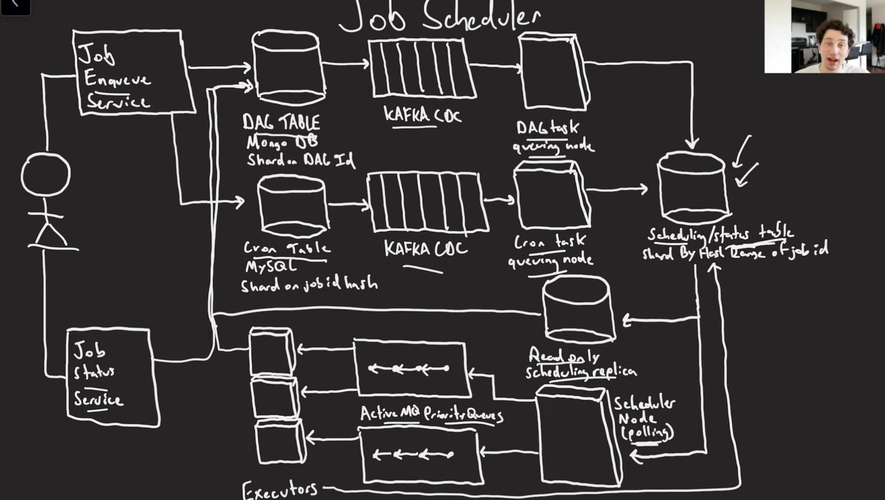

# Cron Job

# Step 1 - Understand the Problem and Establish Design scope
 * Allow running uploaded binary files upon user request
 * Each job must be run at least once
 * Users should be able to see the status of their jobs
 * Jobs can be scheduled as one-off, on a cron schedule or via a DAG (irected acyclic graph)

## Algorithm for the DAG scheduling
 * Outline DAG in DAG table
 * Schedule roots of DAG with epoch 1 (may need topo sort to determine)
 * As we complete tasks, mark that epoch completed in all the children rows
 * When all dependency tasks have an equal epoch for a give row, schedule that task
 * Completion of all leaf node tasks re-triggers the root tasks scheduling again.
 * In case of any middle task error out, mark all the child task as FAIL as well, so as to re-schedule root again.

## Database choice
 * We can use MySQL
 * We have a lot of updates (need atomicity)
 * Often multiple rows at the same time!
 * We want to do all the updates on a single node to avoid doing distributed 2PC
 * But for data flexibility we can go with MongoDB (support transactional support as well).

### Database Schema

#### Scheduler Table schema
Job_id   S3_URL   Run_timestamp     Status
  12      ...      2:01 (+5min)         
  6       ...      2:05 (+10min)

 * Index by run_timestamp, on an internal run jobs where current_time > run_timestamps
 * At each step of running the job, update the run_timestamp to reflect how much time we should wait before rescheduling the job

#### DAG Table schema

Job_id    Children     Dependencies
  12        3,4          1:0, 2:0
  3         7            12:0

The scale mentioned by the interviewer hints that we are to design a small to medium scale exchange.
We need to also ensure flexibility to support more symbols and users in the future.

### Performance of scheduling

* Keep data in memory (replicate for fault tolenance)
* Many partition of the scheduler table (as there is a lot of load)
* Write to leader, read from replica (because we are going to read and write a lot at the same time)
 
## Scaling

### Load Balancing

Need to ensure that all the executors are working and not sitting ideal. 

#### Option 1: Consistent Hashing Partition, Polling on Executor Health
Solution: Consistent Hasing - We can parition by hash range of job. One node could get a super long job and then we need to wait. So LB should have a sense of which Executor is available to pick the next job. 

We can regularly do health check of the executor, but that is going to add a lot of N/W calls.

#### Option 2: Message Broker
 * Kafka -> One consumer per partition, tasks can get stuck behind long running ones
 * In-Memory message Broker -> Faster, and We can use RabbitMQ which usese Queue mechanism where each message is consumed by any one of the consumer who is ready at that moment and queue will be attached to multipe workers though.

Other non-functional requirements:
 * Availability - At least 99.99%. Downtime can harm reputation
 * Fault tolerance - fault tolerance and a fast recovery mechanism are needed to limit the impact of a production incident
 * Latency - Round-trip latency should be in the ms level with focus on 99th percentile. Persistently high 99p latency causes bad experience for a handful or users.
 * Security - We should have an account management system. For legal compliance, we need to support KYC to verify user identity. We should also protect against DDoS for public resources.

### Job Priority

Each executor is not equal, some executors may have more hardware capabilities than the other. Solution is to use multiple level of queues, kust like an operating system
 * Level 1: 10 second timeout
 * Level 2: 1 minute timeout (better hardware than Level)
 * Level 3: 1 hour timeout (better hardware than Level 2)

 ### Job Compeltion Update Status

 * Add a status column to scheduling table
   - Index by status and then time (keep scheduling query short)
   - Only schedule jobs with status != completed/Failed (should be in Null/In_progress)
 * Users can query this table to see job status
   - Should probably read from replicas only, leader responsible for fast scheduling
   - Can parition on some combination to time range or some random number

## How to Run Jobs

### Handling Faults

Possible faults for running job more than once:
 * Executor didn't send the response to the scheduler queue, so the same job got picked by multipe Executors
 * Scheduling node job is taking too long
 * RabbitMQ goes down

Solution:
 We need to avoid running same job multiple palces at the same time, it will corrupt the status of the job, so we need to have a distributed lock using Zookeeper to achieve consenus. We need to grab the lock on the Job_id and that too will be with TTL

 * A job always runs on the same executor -> Is a dumb solution
 * All nodes must always check the scheduling table to see if a job has already run -> it could have run and executor dies before udpating
 * Make your jobs idempotent  or deal with consequences

## Final Design
Functional determinism is guaranteed via the sequencer technique we used.

The actual time when the event happens doesn't matter:
