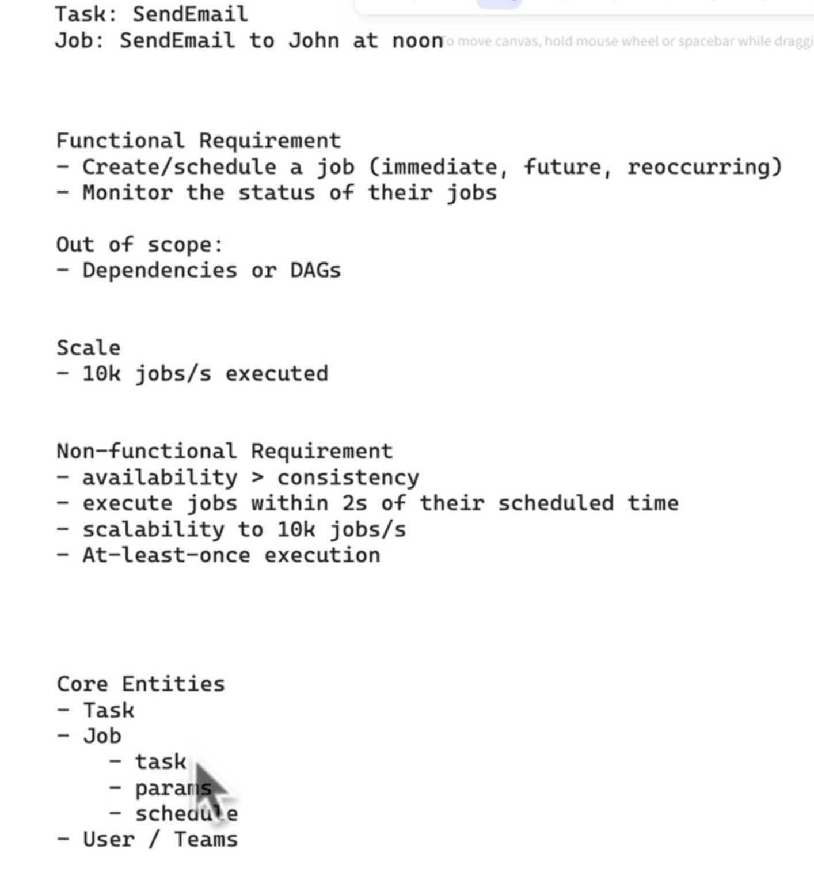
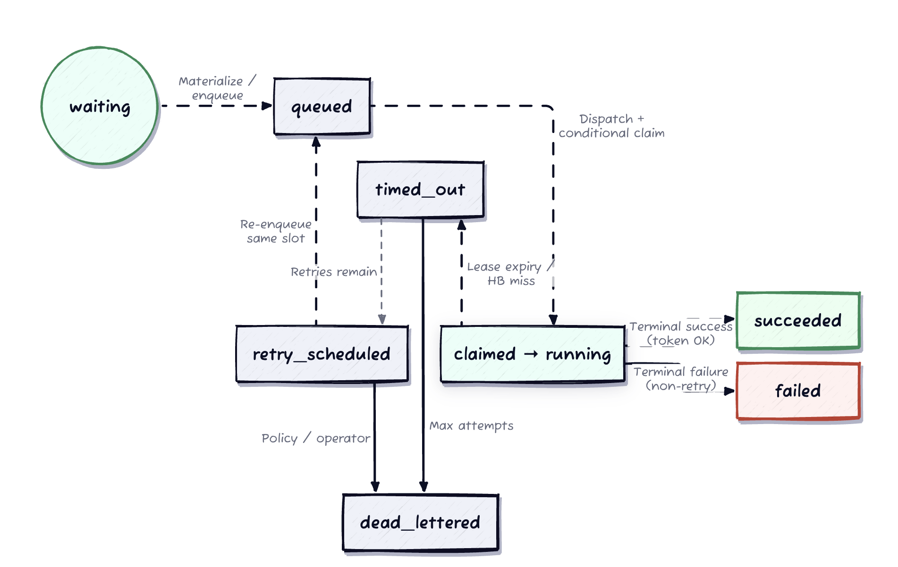
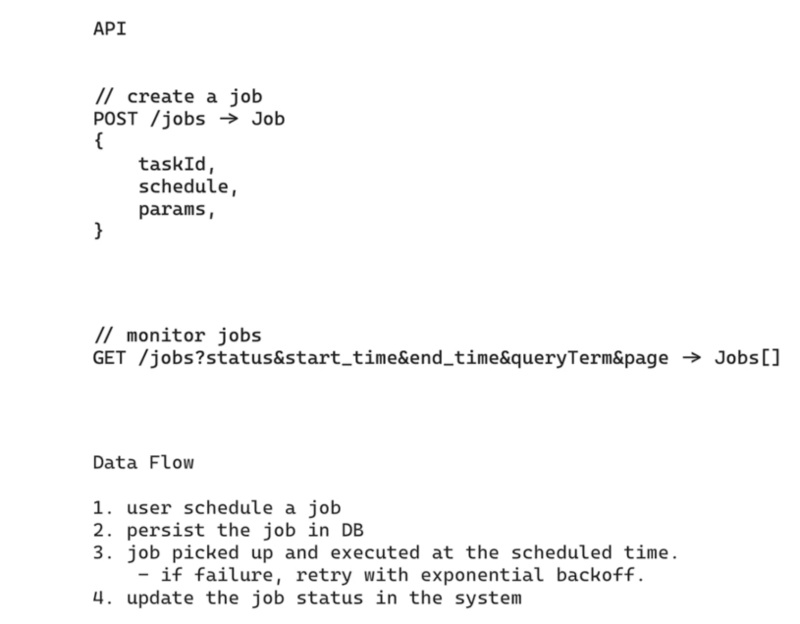
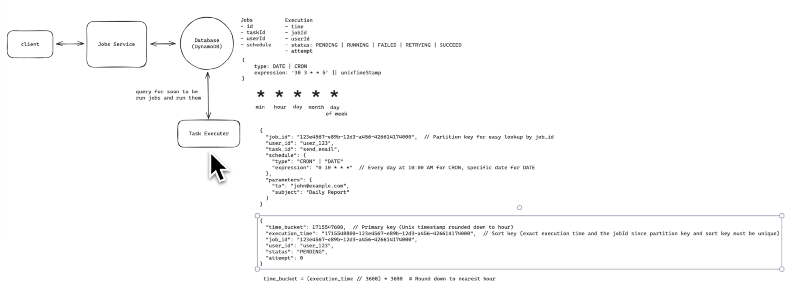
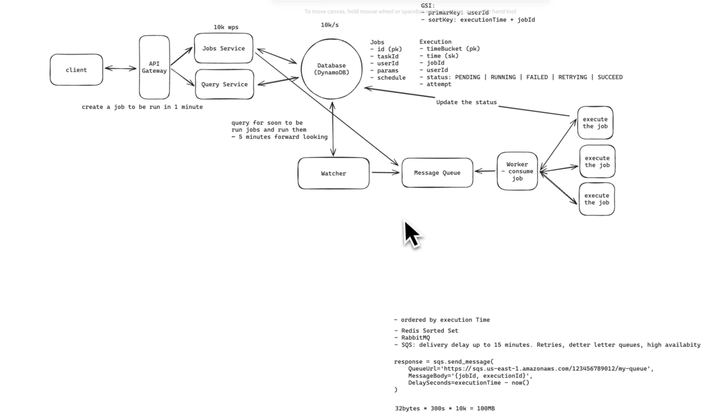
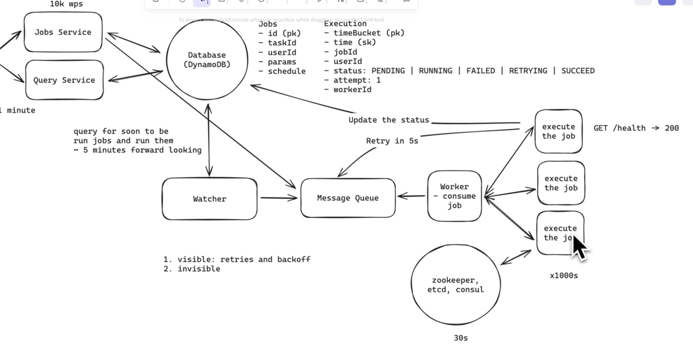

# Design a Job Scheduler

## 1. Requirements (~5 min)


---

## 2.Datastore Partitioning (DynamoDB / Cassandra)

Chosen for scale: DynamoDB supports up to **1,000 WCU per partition**, and good key design spreads writes.

| Table | Partition Key | Notes |
|---|---|---|
| **Jobs** | `job_id` | Unique IDs → writes spread evenly. |
| **Executions** | `time_bucket` (hourly) | **Hot-partition risk** — all writes for the current hour hit one partition. |

```
{
  "time_bucket": 1715547600,  // Partition key (Unix timestamp rounded down to hour)
  "execution_time": "1715548800-123e4567-e89b-12d3-a456-426614174000",  // Sort key (exact execution time + jobId to ensure the composite primary key is unique)
  "job_id": "123e4567-e89b-12d3-a456-426614174000",
  "user_id": "user_123", 
  "status": "PENDING",
  "attempt": 0
}
```

- **Hot-partition fix:** **Write sharding** — append a random suffix (`time_bucket#shard_3`) to spread writes across partitions. Workers query **all shards for a bucket in parallel**.
- **Capacity:** With provisioning + sharding, handles **10k ops/sec** and scales with job count.
- **Lifecycle:** Keep executed jobs queryable, then after ~1 year **tier off to cheaper storage (S3)**.

### SQL vs NoSQL
Choose Partitioned SQL. It aligns with the post’s emphasis on durability, strict uniqueness, and operational clarity. Use a coordination service (etcd/ZooKeeper) for shard ownership and a message queue (SQS/RabbitMQ) for dispatch acceleration, but keep the execution ledger in SQL.

### Execution Slot Lifecycle




---
## API / Interface (~5 min)



---

## High-Level Design (~10–15 min)


---

## Deep Dives (~10 min)


### Access Patterns via GSI, Not Denormalization

- **Problem:** The Executions table has its own PK (`execution_timestamp`), but we also need to query executions by `user_id`.
- **Choice:** Add a **Global Secondary Index on `user_id`** rather than duplicating `user_id` into the base table.
- **Why:** Denormalizing (copying `user_id` into the base table's key structure) complicates the data model and makes it harder to maintain. A GSI is the idiomatic DynamoDB pattern for serving a second access pattern cleanly.
- **Trade-off:** GSIs cost extra write capacity and are eventually consistent, but that's acceptable for a "list my executions" read path.


### Ensure System is Scalable and scheduling is undet SLA



---


#### Two-Layer Scheduler: Database + Message Queue

A single tight-polling loop on the DB is wasteful *and* imprecise. Instead, split responsibilities:

- **Phase 1 — Query the DB:** Every **~5 minutes**, query the Executions table for jobs due in the next ~5 minutes (buffer accounts for network latency).
- **Phase 2 — Message queue:** Push that batch to a queue **ordered by `execution_time`**. Workers pull in order and execute.

**Why it works — low latency + low load:**
- DB is queried only once per 5-min window → **reduced database load**.
- The queue's high throughput removes the upper bound on execution frequency → **precision without hammering the DB**.


#### The "sooner-than-5-minutes" gap

- A job created to run in **< 5 min** is written to the DB but the cron won't see it until the next sweep → missed or delayed by up to 5 min.
- **Naive fix rejected:** Pushing directly into a **log-based queue (Kafka)** fails — Kafka is ordered *within a partition*, so the new job lands at the tail and waits behind everything already queued, breaking the **2-second precision** requirement.
- **Requirement it forces:** A queue with **delayed delivery** — messages stay invisible until (near) their scheduled time.


### Handling retry and at-least once scheduling




#### Delayed Delivery via Amazon SQS

- **Choice:** Amazon SQS, a fully managed queue with **native delayed delivery** (`DelaySeconds`).
- **How:** To run a job in 10s, enqueue with a 10s delay; SQS delivers to the worker after the delay.
- **Constraint:** `DelaySeconds` is **capped at 15 minutes** — fine, since it operates inside our 5-minute window.
- **Bundled benefits (no infra to manage):**
  - **Visibility timeouts** handle worker failure after a message is consumed.
  - **Dead-letter queues** capture failed jobs for investigation.
  - **High availability** across multiple AZs.
  - **Auto-scaling** to load.


#### Failure Modes: Visible vs. Invisible

Two ways a job fails inside a worker:

- **Visible failure:** Job fails observably — usually a code bug or bad input.
- **Invisible failure:** The worker itself went down (no signal from the job).

##### Handling visible failures — retry with backoff

- Wrap task code in **try/catch**; log the error, mark the job.
- Retry with **exponential backoff**, updating Executions status to `RETRYING` with the attempt count.
- Re-enqueue to SQS with an increasing delay per attempt (e.g. **5s → 25s → 125s**) via `DelaySeconds`, computed from the attempt count.
- After **3 failed retries**, mark `FAILED` — no further retries.
- **SQS primitives used:** visibility timeouts (messages reappear), `ApproximateReceiveCount` (tracks attempts), DLQ (catches over-limit messages). Only the **backoff timing logic** lives in worker code.

#### Detecting Invisible Failures — SQS Visibility Timeout + Heartbeat

- **Mechanism:** On receive, SQS makes a message **invisible** to other workers for a configurable period. Worker deletes it on success; if the worker crashes or overruns the timeout, SQS **makes the message visible again** for another worker.
- **Tuning for fast recovery + long jobs:** Set a **short visibility timeout (e.g. 30s)** and have workers **heartbeat** by calling **`ChangeMessageVisibility`** to extend it (e.g. a 5-min job extends every 15s).
- **Result:** If a worker dies, another picks up the job within ~30s instead of waiting out a long timeout.
- **Benefits:** No extra infra or coordination; short timeout + heartbeat = fast detection *and* long-job support; DLQ catches repeat failures; precise ownership control without added complexity.


### Multiple Queues — For Separation, Not Scale

- Multiple queues may still be justified for **functional separation** (job priorities or types).
- **Not** for scaling purposes — a single SQS queue already scales.


### Worker Compute: Containers vs. Lambda

| Option | Pros | Cons |
|---|---|---|
| **Containers (ECS / K8s)** | Cost-effective for steady load; suited to long-running jobs (retain state between executions). | More ops overhead; less elastic scaling. |
| **Lambda** | Truly serverless, minimal ops; instant auto-scale; great for short (<15 min) jobs. | **Cold starts** threaten 2-sec precision; pricier for steady high-volume load. |

- **Decision (no wrong answer):** **Containers on ECS with auto-scaling groups** — best balance of cost + operational simplicity for a **steady, predictable 10k jobs/sec at 2-sec precision** workload.
- **Optimizations:** spot instances for cost, auto-scale on **queue depth**, **pre-warm** the pool for baseline load, and scaling policies for spikes.

---

## 🔍 Senior-Signal Questions to Ask in Your Interview

- **Is the 5-min sweep + SQS delay path exactly-once or at-least-once?** → *Why it matters: visibility-timeout redelivery means at-least-once; surfaces whether job execution is idempotent or needs a dedup/attempt-id guard.*
- **What happens when the DB write succeeds but the SQS enqueue fails (or vice versa)?** → *Why it matters: probes the dual-write problem between datastore and queue — a place where transactional outbox / CDC belongs.*
- **How do you keep the hourly `time_bucket` from becoming a hot partition as jobs grow?** → *Why it matters: write-sharding + parallel shard reads is the DynamoDB idiom; shows you anticipate skew, not just steady-state throughput.*
- **Does the heartbeat/`ChangeMessageVisibility` scheme risk double-execution if a heartbeat is late but the worker is alive?** → *Why it matters: SQS visibility timeout is an **efficiency lock**, not a correctness lock — double-grant means duplicated work, tolerable only if execution is idempotent.*
- **When does Kafka become the right choice over SQS here?** → *Why it matters: forces the delayed-delivery vs. ordered-log trade-off — SQS wins on per-message scheduling; Kafka wins on ordered, replayable, high-fanout streams.*