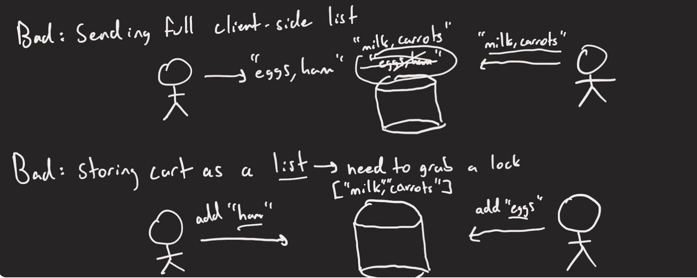
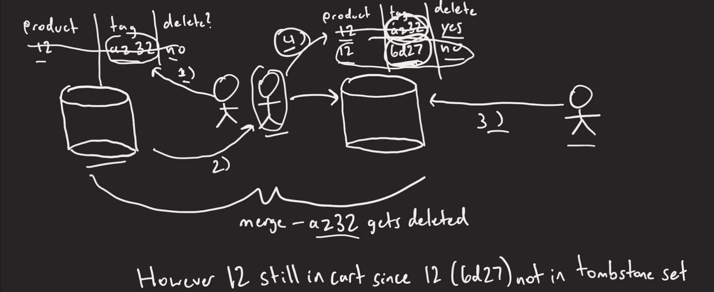
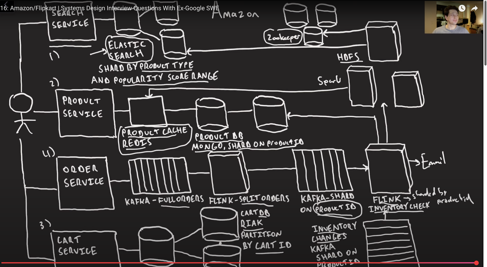

# Cron Job

# Step 1 - Understand the Problem and Establish Design scope
 * Basic implementation of Amazon retail site
 * Conccurent edits to user Cart
 * Deal with inventory management when items go out of stock 

### Out of scope
 * Payments
 * Reviews
 * anything in AWS
 
## Capacity Estimates
 * 350 M unique products round upto 1 BLN
 * 10 M orders per day -> ~100 orders per second
 * Approx 1MB of data per product, 1 BLN * 1MB = 1 PB, need to partition our products table
 * Recall that end product has images as well
 * We will try to build for more scale than this.

## High Level Overview

A 100ms of delay in load times can hurt conversion rates by 7%

 * Make reads fast 
 * Writes too fast where we are able to

### Products DB

 * Only one person writing to a product ID at a time
 * Single leader replication should be fine here

 Also
 * NoSQL is nice here for flexible data model
 * B-Tree is (in theory) faster for reads

 Lets use MongoDB with an entry per product.

### Cart Service
 
 Ideally if we have multiple people at the same time editing a cart, we can do this in a performant manner! And as number of people increases there is going to be more contention in the cart database.

 

 By representing our car as a set of items we can avoid grabbing locks, unless
  * Is there really ever going to be a lot of adds and removes of the same item within a second? Probably not
  * But lets imagine there is such scenario
 
    | cartId | productId |
    |--------|----------|
    | 10     | 28       |
    | 10     | 30       |
    
#### Avoiding Contention
 * Option 1: Deal with it later, Process them one at a time by using Kafka and process asynchornously in the background, Not good here, if I add an 
   item to my cart and then checkout right after I wouldn't buy that item
 * Option 2: Multiple database leaders for the cart DB
    - How can we snsure that all dbs will eventually agree with one another? Use a set CRDT!
    - How can we handle multiple additions and deletions of items in our St CRDT? Use an Observe Remove Set.

    Note: Users in this case should read and write from the same db otherwise user journey is going to break.

#### Observe Remove Set
 Add unique tag to product when adding and removing from cart

 
   
### Placing Orders
When creating orders, we need to check whether there is stock for it
 * We need to check some counter to see if there is enough quantity, and decrement it if there is
 * Whenever we have a counter we need to lock on it, or else we will lose udpates
 * In reality the probability isn't high because since we have only 100 orders per second across all the products.

#### Avoiding Contention
 * Option 1: Multiple leaders/Counter CRDT
    - Allow us to see the remaining quantity of orders eventually convergent on each leader
    - However, we only actually find out if we are out of stock once they perform entropy, so problem of over-sold still exist

 * Option 2: Kafka + Streaming processing
    - Orders go into Kafka queue partitioned by productID
    - We email users once we know if we can fulfill the order

### Optimizing Reads
 
While we want to eep all reads fast, for popular products if is even more important that we keep them fast!

How do we know which items are popular?
 - Keep track of number of clicks per item
 - Stream processing, aggregate in Spark streaming
 - Once per day exposrt to HDFS
 - Run a spark job to calculate the top x% of items (can weight exponentially)

 Once we know our popular items, we can populate our caches with their.

 MongoDb data and their S3 images in a CDN.

#### Search Indexes

One of most important feature
 - Inverted index allows us to see products with given term
 - Some data denormalization to allow getting all data from index

How do we partition our index?
- Global term based paritioning likely not possible, but too much data, would have to keep copy of description 
  for each term on each node which is not ideal

  As long as every single documentID on search page is on the same partition then we are good.

##### Search Index Local Indexing

Idea: Assign a set of products to each partition and index them

## Final Design

## Artifacts
   * Jordan has no life: https://www.youtube.com/watch?v=F9lcK1jnAcs&ab_channel=Jordanhasnolife
   