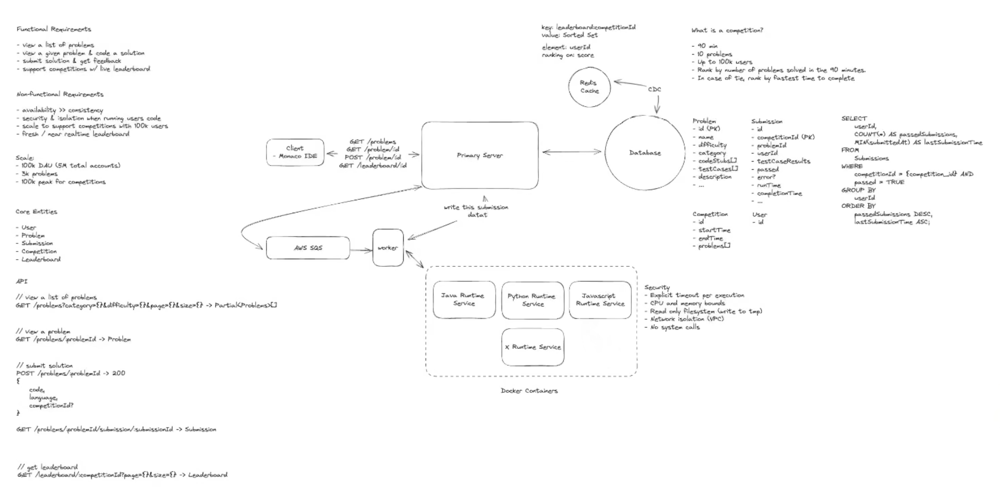
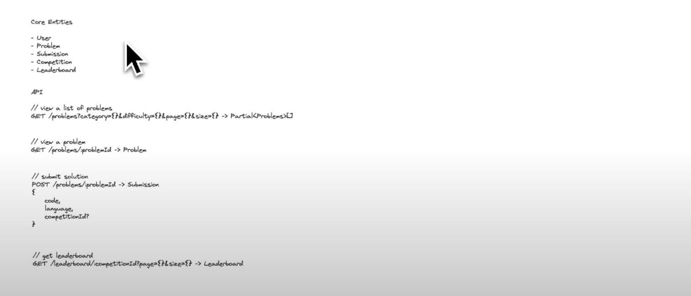
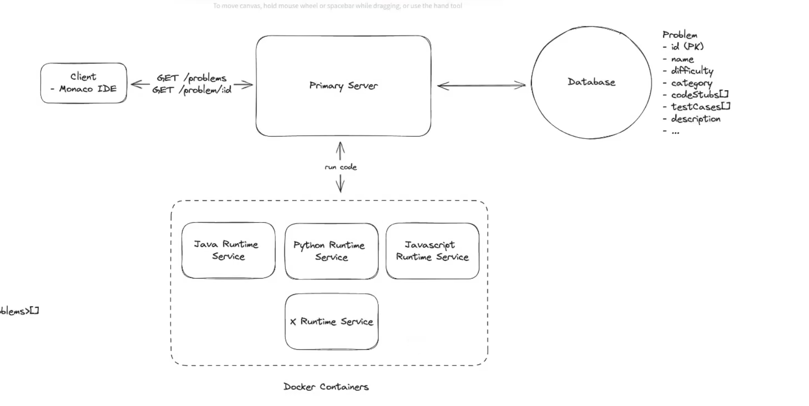
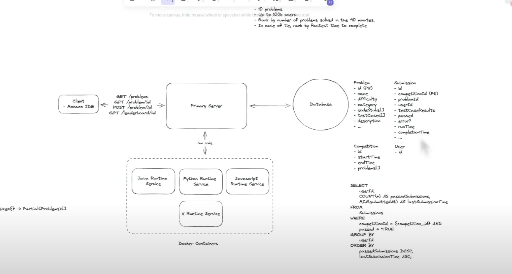
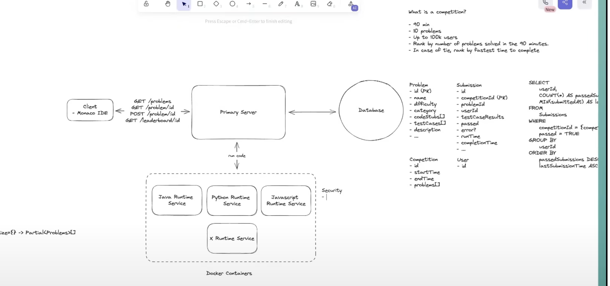
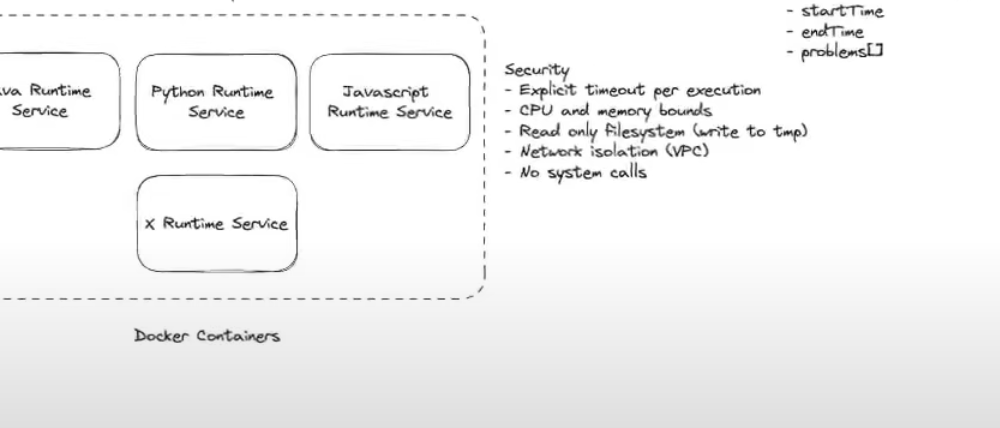
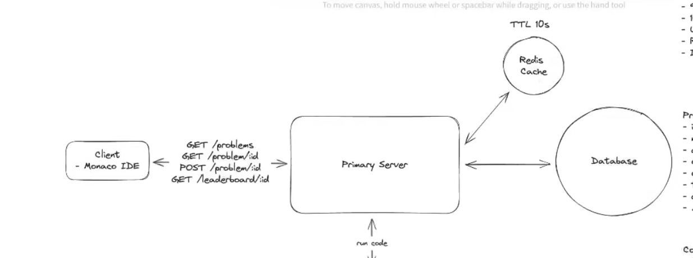

# Design LeetCode — Online Coding Judge & Competition Platform

> **The whole problem in one line:** run *arbitrary, untrusted user code* safely, fast (< 5s), and at burst scale — everything else (problem CRUD, leaderboard) is comparatively easy. Spend your interview time on **isolation** and **the code-execution data path**, not box-drawing.

---

## 1. Requirements



### Functional Requirements

1. **View a list of problems** (paginated).
2. **View a single problem and write a solution** in multiple languages (in-browser editor).
3. **Submit a solution and get instant feedback** — run code against test cases, return pass/fail + runtime/errors.
4. **View a live leaderboard** during competitions.

**Out of scope (call these out, then drop them):** auth, user profiles, payments, analytics, social features. Assume the user is authenticated and `userId` comes from the session/JWT.

### Non-Functional Requirements

1. **Availability > Consistency.** A stale leaderboard for a few seconds is fine; a down submit path is not. (AP for reads; the submission *record* itself we want durable.)
2. **Isolation & security running untrusted code** — this is the crux. Malicious code must not touch the host, other users, the network, or persist anything.
3. **Low latency — submission result in < 5s.** This directly constrains our per-execution timeout.
4. **Burst scalability — 100k users in a competition.** The load is *spiky*, concentrated at competition start and end.

**Out of scope:** fault-tolerance-to-the-nines, CI/CD, backups, secure purchases.

> **⚖️ The scale reality check (say this out loud):** LeetCode is a *few hundred thousand* users and ~4,000 problems. This is a **small-scale system**. The senior move is to build something simple that meets requirements with a clear path to scale — *not* to over-engineer. The one place scale genuinely bites is the CPU cost of code execution during a contest spike, so we do the math there (Deep Dive 3) and nowhere else.

---

## 2. Core Entities

- **Problem** — statement, difficulty, tags, per-language code stubs, test cases (nested).
- **Submission** — user's code, language, per-test-case results, runtime, error, status, `competitionId?`.
- **Competition** — window (90 min), problem set (10 problems), participants.
- **Leaderboard** — derived/materialized ranking for a competition (lives in Redis, not a table of record).

*(User is implied — no need to enumerate it.)*

### Submission — schema & keys (worth committing to explicitly)

The `Submission` is the entity with real design tension, so pin it down:

```
Submission {
  id              : string        // UUID / snowflake — unique per submission
  userId          : string        // from the auth token, never the body
  problemId       : string
  competitionId   : string | null // set only for contest submissions
  language        : string
  code            : string        // raw source, or a pointer to blob storage to keep the row lean
  status          : PENDING | RUNNING | SUCCESS | FAILED   // drives the client poll
  passed          : boolean       // passed all judged test cases
  testCaseResults : [ { caseId, passed, expected?, actual? } ]
  runtimeMs       : number
  memoryKb        : number
  error           : string | null // compile / runtime / TLE message
  submittedAt     : timestamp     // SERVER-generated (leaderboard tie-break depends on it)
}
```

**Primary key — derive it from the access patterns, not by default:**

The dominant request is the poll, `GET /submissions/:id` — a point lookup. That alone wants **`id` as the partition key** (O(1) in DynamoDB). But the leaderboard needs *all submissions for one competition*, and if `id` is the PK those rows are scattered across every partition — unqueryable from the base table. Hence a secondary index keyed on `competitionId`.

- **DynamoDB (chosen):**
  - **PK (partition key): `id`** — serves the poll, the hot path.
  - **GSI: PK `competitionId`, SK `submittedAt`** — serves the leaderboard scan for one competition, pre-sorted for the tie-break.
  - *(optional)* **GSI: PK `userId`, SK `submittedAt`** — a user's submission history.
- **Relational (Postgres) equivalent:** PK `id`; secondary indexes on `(competitionId, submittedAt)` and `(userId, problemId)`.

**Why a single-attribute `id` PK is semantically correct, not just convenient:** a user legitimately submits the same problem many times (retries, improved solutions), so the table is an **append-only log** — you deliberately do *not* enforce "one row per (user, problem)". This is exactly why the leaderboard uses `COUNT(DISTINCT problemId)`: it's de-duplicating multiple accepted submissions of the same problem. The key design and the leaderboard query are two ends of the same decision.

---

## 3. API / Interface

REST, plural nouns, **identity from the auth token — never from the body or query.**

```
GET  /problems?page=1&limit=100            -> Partial<Problem>[]
GET  /problems/:id?language=python         -> Problem          # includes code stub for language
POST /problems/:id/submit                  -> { submissionId, status: "PENDING" }
     body: { code: string, language: string }
GET  /submissions/:id                       -> Submission       # polled for result (async model)
GET  /competitions/:id/leaderboard?top=100 -> LeaderboardEntry[]
```

Two security notes worth saying aloud:
- **No `userId` in the body/params.** Passing it client-side is a red flag — it's spoofable. Derive it from the session.
- **Server generates timestamps**, not the client (matters for leaderboard tie-breaking, and clients lie).

> **Why `POST /submit` returns a job ID, not a result:** running ~100 test cases can take seconds. Holding an HTTP connection open risks timeouts and pins server resources. This is the **long-running-task pattern**: return a handle immediately, do the work in the background, let the client poll `GET /submissions/:id`. *(This is literally what LeetCode does — open your network tab on submit and watch it poll.)*

---

## 4. High-Level Design

Build endpoint-by-endpoint. First three endpoints are trivial CRUD; the fourth (submit) is the whole ballgame.

### 4.1 — 4.2  View problems / view a problem

A stateless **API server** reads from a **primary datastore**. Pagination via index/`limit`+`offset` (or a `page` GSI on NoSQL).

**Datastore choice:** either SQL or NoSQL works. I'll pick a document store (**DynamoDB**) because we have no complex relational queries here and I want to **nest test cases as a subdocument** inside the problem — one read returns everything the judge needs. If we later need rich analytical queries over submissions, a relational store is easy to add on that path.

```
Problem {
  id, title, question, level, tags[],
  codeStubs: { python, javascript, java, ... },
  testCases: [ { type, input: JSON, output: JSON } ]   // nested
}
```

> The per-language `codeStubs` are authored once (by an admin) or, these days, generated from a single reference stub via an LLM. Not a design concern — mention and move on.

<svg viewBox="0 0 760 300" xmlns="http://www.w3.org/2000/svg" font-family="'Comic Sans MS','Segoe Print',cursive" font-size="13">
  <rect x="0" y="0" width="760" height="300" fill="#fdfdfb"/>
  <!-- client -->
  <rect x="30" y="110" width="120" height="70" rx="10" fill="#eef6ff" stroke="#3b6ea5" stroke-width="2"/>
  <text x="90" y="140" text-anchor="middle" fill="#1f3d5c">Client</text>
  <text x="90" y="160" text-anchor="middle" fill="#1f3d5c" font-size="11">Monaco editor</text>
  <!-- api server -->
  <rect x="300" y="100" width="150" height="90" rx="10" fill="#fff7e6" stroke="#c9902a" stroke-width="2"/>
  <text x="375" y="135" text-anchor="middle" fill="#7a5310">API Server</text>
  <text x="375" y="158" text-anchor="middle" fill="#7a5310" font-size="11">stateless,</text>
  <text x="375" y="173" text-anchor="middle" fill="#7a5310" font-size="11">horizontally scaled</text>
  <!-- db cylinder -->
  <ellipse cx="640" cy="105" rx="55" ry="16" fill="#eafaf0" stroke="#2f8f5b" stroke-width="2"/>
  <rect x="585" y="105" width="110" height="90" fill="#eafaf0" stroke="#2f8f5b" stroke-width="2"/>
  <line x1="585" y1="105" x2="585" y2="195" stroke="#2f8f5b" stroke-width="2"/>
  <line x1="695" y1="105" x2="695" y2="195" stroke="#2f8f5b" stroke-width="2"/>
  <ellipse cx="640" cy="195" rx="55" ry="16" fill="#eafaf0" stroke="#2f8f5b" stroke-width="2"/>
  <text x="640" y="150" text-anchor="middle" fill="#1c5e3a">DynamoDB</text>
  <text x="640" y="168" text-anchor="middle" fill="#1c5e3a" font-size="11">Problems</text>
  <!-- arrows -->
  <line x1="150" y1="145" x2="298" y2="145" stroke="#555" stroke-width="2" marker-end="url(#ah)"/>
  <text x="224" y="137" text-anchor="middle" fill="#333" font-size="11">GET /problems</text>
  <text x="224" y="163" text-anchor="middle" fill="#333" font-size="11">GET /problems/:id</text>
  <line x1="450" y1="145" x2="583" y2="150" stroke="#555" stroke-width="2" marker-end="url(#ah)"/>
  <text x="515" y="140" text-anchor="middle" fill="#333" font-size="11">read</text>
  <defs>
    <marker id="ah" markerWidth="10" markerHeight="10" refX="8" refY="3" orient="auto"><path d="M0,0 L8,3 L0,6 Z" fill="#555"/></marker>
  </defs>
</svg>

*Caption: the trivial read path. Client → stateless API server → problem store. Test cases nest inside the problem document.*

### 4.3  Submit a solution — the core

The naive instinct is to run the code on the API server. **Never do this.** Untrusted code on your host can delete data, exfiltrate it, mine crypto, launch DDoS, or simply infinite-loop and take the process down. We need an **isolated execution sandbox**. Three options:

| Option | Isolation | Startup | Verdict |
|---|---|---|---|
| **VM per submission** | Strong (full OS + hypervisor) | Slow, heavy | Safe but resource-hungry & slow to spin up |
| **Container per runtime** | Good (shared kernel, namespaces) | Fast, lightweight, reusable | **Chosen** — best isolation/speed balance |
| **Serverless function** | Good | Cold-start latency | Great for unpredictable load; cold starts hurt our 5s budget |

**Decision: containers.** We keep a warm pool of language-specific containers (Python, JS, Java, …), each pre-loaded with that runtime, dependencies, and the **test harness** for that language. A worker hands a submission to the right container, the container runs the code against the test cases in a sandbox, and the worker reads the result from stdout / a mounted volume. Containers are *reused* across submissions — no per-submission VM boot.

> Serverless is a legitimate alternative and worth naming — I'm avoiding it here specifically to dodge cold-start latency against a 5s SLA, and because our submission volume is predictable enough (competitions are scheduled) that a warm container pool is cheaper and more consistent.

**The execution flow (synchronous-worker model):** the API server enqueues/dispatches the job; the worker invokes the container synchronously (e.g. Docker `exec`), waits, captures output, writes the `Submission` record + results to the DB, and marks it `SUCCESS`/`FAILED`. The client polls `GET /submissions/:id` until it flips from `PENDING`.

### 4.4  Leaderboard (naive version first)

**Competition definition:** 90 minutes, 10 problems, up to 100k users. Score = number of *distinct* problems solved; ties broken by earliest total completion time (server timestamps).

The dead-simple first pass: on each leaderboard request, query submissions for that competition and aggregate.

```sql
SELECT   userId,
         COUNT(DISTINCT problemId) AS solved,
         MIN(submittedAt)          AS firstSolve   -- tie-break
FROM     submissions
WHERE    competitionId = :cid AND passed = true
GROUP BY userId
ORDER BY solved DESC, firstSolve ASC
```

(In DynamoDB: a **GSI** partitioned on `competitionId` so you can pull all a competition's submissions without making `competitionId` the table PK — it's optional and non-unique — then group/sort in memory.)

Client re-requests every ~5s to stay fresh.

**This does not scale** — every poll from every user re-runs a heavy aggregation. We fix it in Deep Dive 2. Naming the weakness yourself is the senior signal; leaving it for the interviewer to catch is not.

<svg viewBox="0 0 820 380" xmlns="http://www.w3.org/2000/svg" font-family="'Comic Sans MS','Segoe Print',cursive" font-size="12">
  <rect x="0" y="0" width="820" height="380" fill="#fdfdfb"/>
  <!-- client -->
  <rect x="20" y="150" width="120" height="80" rx="10" fill="#eef6ff" stroke="#3b6ea5" stroke-width="2"/>
  <text x="80" y="185" text-anchor="middle" fill="#1f3d5c">Client</text>
  <text x="80" y="205" text-anchor="middle" fill="#1f3d5c" font-size="10">Monaco IDE</text>
  <!-- api server -->
  <rect x="220" y="140" width="140" height="100" rx="10" fill="#fff7e6" stroke="#c9902a" stroke-width="2"/>
  <text x="290" y="180" text-anchor="middle" fill="#7a5310">API Server</text>
  <text x="290" y="200" text-anchor="middle" fill="#7a5310" font-size="10">dispatch + read</text>
  <!-- containers box -->
  <rect x="470" y="40" width="200" height="150" rx="8" fill="#f4eefc" stroke="#7a4fb0" stroke-width="2"/>
  <text x="570" y="60" text-anchor="middle" fill="#4a2d75" font-size="11">Runtime Containers</text>
  <rect x="485" y="72" width="80" height="34" rx="5" fill="#fff" stroke="#7a4fb0"/><text x="525" y="93" text-anchor="middle" font-size="10">Python</text>
  <rect x="575" y="72" width="80" height="34" rx="5" fill="#fff" stroke="#7a4fb0"/><text x="615" y="93" text-anchor="middle" font-size="10">Java</text>
  <rect x="485" y="116" width="80" height="34" rx="5" fill="#fff" stroke="#7a4fb0"/><text x="525" y="137" text-anchor="middle" font-size="10">JS</text>
  <rect x="575" y="116" width="80" height="34" rx="5" fill="#fff" stroke="#7a4fb0"/><text x="615" y="137" text-anchor="middle" font-size="10">X…</text>
  <text x="570" y="175" text-anchor="middle" fill="#4a2d75" font-size="10">sandboxed, reused</text>
  <!-- db -->
  <ellipse cx="740" cy="255" rx="52" ry="15" fill="#eafaf0" stroke="#2f8f5b" stroke-width="2"/>
  <rect x="688" y="255" width="104" height="80" fill="#eafaf0" stroke="#2f8f5b" stroke-width="2"/>
  <line x1="688" y1="255" x2="688" y2="335" stroke="#2f8f5b" stroke-width="2"/>
  <line x1="792" y1="255" x2="792" y2="335" stroke="#2f8f5b" stroke-width="2"/>
  <ellipse cx="740" cy="335" rx="52" ry="15" fill="#eafaf0" stroke="#2f8f5b" stroke-width="2"/>
  <text x="740" y="295" text-anchor="middle" fill="#1c5e3a" font-size="11">DynamoDB</text>
  <text x="740" y="312" text-anchor="middle" fill="#1c5e3a" font-size="10">Problems +</text>
  <text x="740" y="325" text-anchor="middle" fill="#1c5e3a" font-size="10">Submissions</text>
  <!-- arrows -->
  <line x1="140" y1="190" x2="218" y2="190" stroke="#555" stroke-width="2" marker-end="url(#a2)"/>
  <text x="179" y="182" text-anchor="middle" font-size="10">POST /submit</text>
  <line x1="360" y1="165" x2="468" y2="130" stroke="#555" stroke-width="2" marker-end="url(#a2)"/>
  <text x="410" y="140" text-anchor="middle" font-size="10">run code</text>
  <line x1="640" y1="190" x2="700" y2="250" stroke="#555" stroke-width="2" marker-end="url(#a2)"/>
  <text x="695" y="220" text-anchor="middle" font-size="10">results</text>
  <line x1="360" y1="215" x2="686" y2="290" stroke="#555" stroke-width="2" marker-end="url(#a2)"/>
  <text x="500" y="270" text-anchor="middle" font-size="10">write submission + poll status</text>
  <defs><marker id="a2" markerWidth="10" markerHeight="10" refX="8" refY="3" orient="auto"><path d="M0,0 L8,3 L0,6 Z" fill="#555"/></marker></defs>
</svg>

*Caption: high-level design. Submit dispatches to a warm, language-specific container pool; results land in the submissions store; client polls for status.*

---

## 5. Deep Dives

### DD1 — Isolation & security running untrusted code *(the one that matters most)*

Containerizing is step one; a bare container is **not** a security boundary by default. Layer defenses:

- **Read-only filesystem.** Mount the code dir read-only; allow writes only to a scratch `tmp` dir that's wiped after the run. No persistence, no tampering.
- **CPU & memory limits** (cgroups). Exceed → container killed. Stops resource exhaustion and fork bombs.
- **Explicit execution timeout** (e.g. 5s). Kills infinite loops *and* enforces our latency SLA in one stroke.
- **No network access.** Disable egress so code can't exfiltrate data or call out. In AWS: VPC security groups + NACLs allowing only essential traffic.
- **Seccomp / syscall filtering.** Whitelist syscalls so code can't make dangerous kernel calls to break out.
- **(Staff-level extras):** drop Linux capabilities, non-root user, gVisor/Firecracker microVMs for a stronger kernel boundary if the threat model demands it.

> In the interview you don't need to implement each — naming them and *why* each closes a specific hole is enough: *"Docker with a read-only FS, CPU/mem bounds, a hard timeout, no network, and seccomp."* If they want depth on one, they'll ask.

### DD2 — Making the leaderboard efficient

Progression of three approaches — walk the interviewer up the ladder:

1. **Query-on-every-poll** (what we have): every user polling every 5s re-runs an aggregation over a million rows. Melts the DB. ❌
2. **Periodic cache**: recompute the leaderboard every ~30s into Redis, serve from cache. Big improvement, but still coarse and has an update-race window. ⚠️
3. **Redis Sorted Set (chosen)**: maintain a live ranking in a **sorted set** keyed `competition:leaderboard:{cid}`, score = solve count (encode tie-break into the score, e.g. `solved * 1e13 - completionTimeMs`). On each accepted submission: `ZADD`. To read top-N: `ZRANGE ... REV WITHSCORES` — O(log N + M), in-memory, no DB scan. Client polls every 5s. ✅

**Why not WebSockets / true push?** Overkill here. A 5s poll interval against a sorted-set read is cheap and simple, and leaderboard updates are infrequent relative to reads. The staff move is to *name* the fancier option and explain why it's unnecessary. (Nice refinement: **progressive polling** — poll every 2s in the final minutes of a contest, every 10s otherwise.)

<svg viewBox="0 0 780 300" xmlns="http://www.w3.org/2000/svg" font-family="'Comic Sans MS','Segoe Print',cursive" font-size="12">
  <rect x="0" y="0" width="780" height="300" fill="#fdfdfb"/>
  <rect x="20" y="120" width="110" height="70" rx="10" fill="#eef6ff" stroke="#3b6ea5" stroke-width="2"/>
  <text x="75" y="160" text-anchor="middle" fill="#1f3d5c">Client</text>
  <rect x="190" y="115" width="130" height="80" rx="10" fill="#fff7e6" stroke="#c9902a" stroke-width="2"/>
  <text x="255" y="150" text-anchor="middle" fill="#7a5310">API Server</text>
  <text x="255" y="170" text-anchor="middle" fill="#7a5310" font-size="10">reads top-N</text>
  <!-- redis -->
  <rect x="400" y="40" width="150" height="90" rx="10" fill="#fdeaea" stroke="#c0392b" stroke-width="2"/>
  <text x="475" y="72" text-anchor="middle" fill="#8a2620">Redis</text>
  <text x="475" y="92" text-anchor="middle" fill="#8a2620" font-size="10">Sorted Set</text>
  <text x="475" y="108" text-anchor="middle" fill="#8a2620" font-size="10">leaderboard:{cid}</text>
  <!-- worker -->
  <rect x="400" y="180" width="150" height="80" rx="10" fill="#eef4ee" stroke="#2f8f5b" stroke-width="2"/>
  <text x="475" y="215" text-anchor="middle" fill="#1c5e3a">Worker</text>
  <text x="475" y="235" text-anchor="middle" fill="#1c5e3a" font-size="10">on accepted → ZADD</text>
  <!-- db -->
  <ellipse cx="700" cy="200" rx="45" ry="13" fill="#eafaf0" stroke="#2f8f5b" stroke-width="2"/>
  <rect x="655" y="200" width="90" height="60" fill="#eafaf0" stroke="#2f8f5b" stroke-width="2"/>
  <line x1="655" y1="200" x2="655" y2="260" stroke="#2f8f5b" stroke-width="2"/><line x1="745" y1="200" x2="745" y2="260" stroke="#2f8f5b" stroke-width="2"/>
  <ellipse cx="700" cy="260" rx="45" ry="13" fill="#eafaf0" stroke="#2f8f5b" stroke-width="2"/>
  <text x="700" y="235" text-anchor="middle" fill="#1c5e3a" font-size="10">Submissions</text>
  <line x1="130" y1="155" x2="188" y2="155" stroke="#555" stroke-width="2" marker-end="url(#a3)"/>
  <text x="159" y="147" text-anchor="middle" font-size="10">poll 5s</text>
  <line x1="320" y1="140" x2="398" y2="100" stroke="#555" stroke-width="2" marker-end="url(#a3)"/>
  <text x="360" y="112" text-anchor="middle" font-size="10">ZRANGE</text>
  <line x1="475" y1="180" x2="475" y2="132" stroke="#555" stroke-width="2" marker-end="url(#a3)"/>
  <line x1="550" y1="220" x2="653" y2="220" stroke="#555" stroke-width="2" marker-end="url(#a3)"/>
  <text x="600" y="212" text-anchor="middle" font-size="10">write (source of truth)</text>
  <defs><marker id="a3" markerWidth="10" markerHeight="10" refX="8" refY="3" orient="auto"><path d="M0,0 L8,3 L0,6 Z" fill="#555"/></marker></defs>
</svg>

*Caption: leaderboard reads served from a Redis sorted set (materialized view); the submissions table remains the source of truth.*

> **⚠️ Consistency callout raised in the comments — worth pre-empting.** *"Is the leaderboard only in Redis? Isn't that unreliable, and doesn't the Redis↔DB update risk inconsistency (a distributed transaction)?"* The answer is a **deliberate consistency trade-off, and it's the right one here**: the submissions table is the system of record; Redis is a **rebuildable materialized view**. Update Redis **best-effort after** the DB write — no 2PC, no CDC needed. If the Redis key is lost, worst case users see no leaderboard for a few seconds, or you rebuild it from the DB. Because it's recomputed constantly and no money changes hands, temporary inconsistency is harmless. *(Contrast: an auction or payment system, where the same "best-effort cache" pattern would be unacceptable because inconsistency means over-selling or lost money. Match the consistency model to the domain — DDIA Ch. 7/9.)* For **final official standings**, run an authoritative aggregation query when the contest ends and persist a `competition_results` row — 100% correct, easily queried later.

### DD3 — Scaling to 100k competition users

The API server scales horizontally trivially. The pressure is **CPU for code execution**, and it's **bursty** — submissions cluster at contest start and end.

**Do the math (this is the one place estimation earns its keep):** peak ~10k concurrent submissions × ~100 test cases = **1M test-case executions**. At a conservative 100ms each, that's 100,000 CPU-seconds — ~27 hours on one core, or **~1,667 cores to clear in a minute.**

- **Vertical scaling? No.** The largest instances top out at a few hundred vCPUs — nowhere near 1,667 — and you'd pay for a huge idle box between contests.
- **Horizontal auto-scaling of containers? Yes.** Run many replicas per language behind auto-scaling (e.g. AWS ECS/Fargate + ECS Auto Scaling on CPU / queue depth). Risk is over-provisioning cost; modern autoscalers manage that.
- **Add a queue (SQS) between API server and workers — chosen.** Buffers the burst so we never overwhelm or drop submissions, and — the real justification at this scale — **enables retries** on container crash: requeue and re-run. This makes the submit path fully **async**: API returns `{ submissionId, PENDING }`, workers pull from the queue, run, write results; client polls `GET /submissions/:id`.

> **⚠️ Autoscaling can't keep up with the spike — the biggest genuine gap in the base design (raised in the comments, and it's a real one).** Auto-scaling reacts on a lag of minutes; a contest's submission peak hits in the **first and last ~10 minutes**. Reactive scaling will be cold exactly when you need it. Two mitigations, and a senior candidate should volunteer both:
> 1. **Pre-scale / pre-warm** the container fleet ahead of scheduled contests. Contests are registered in advance, so you know the start time and rough participant count — provision capacity *before* the gun, don't chase it. This is the single most important operational point for the competition path.
> 2. **Partial judging during the contest** (product-level load shedding, à la Codeforces). Run each submission against a **subset** of test cases (say ~10%) for live/provisional standings, then re-run the **full** suite after the deadline for official results. Slashes peak CPU by an order of magnitude and doubles as an anti-cheat measure. Trade-off: provisional results can flip after final judging — acceptable for a contest, and worth stating explicitly.

<svg viewBox="0 0 860 360" xmlns="http://www.w3.org/2000/svg" font-family="'Comic Sans MS','Segoe Print',cursive" font-size="12">
  <rect x="0" y="0" width="860" height="360" fill="#fdfdfb"/>
  <rect x="15" y="150" width="105" height="70" rx="10" fill="#eef6ff" stroke="#3b6ea5" stroke-width="2"/>
  <text x="67" y="185" text-anchor="middle" fill="#1f3d5c">Client</text>
  <text x="67" y="203" text-anchor="middle" fill="#1f3d5c" font-size="9">poll /submissions/:id</text>
  <rect x="165" y="145" width="120" height="80" rx="10" fill="#fff7e6" stroke="#c9902a" stroke-width="2"/>
  <text x="225" y="180" text-anchor="middle" fill="#7a5310">API Server</text>
  <text x="225" y="198" text-anchor="middle" fill="#7a5310" font-size="9">enqueue</text>
  <!-- queue -->
  <rect x="330" y="150" width="120" height="70" rx="6" fill="#fef7ec" stroke="#d98a2b" stroke-width="2" stroke-dasharray="5,3"/>
  <text x="390" y="180" text-anchor="middle" fill="#8a5310">SQS Queue</text>
  <text x="390" y="198" text-anchor="middle" fill="#8a5310" font-size="9">buffer + retries</text>
  <text x="390" y="130" text-anchor="middle" fill="#8a5310" font-size="9">per-language queue/topic</text>
  <!-- workers + containers -->
  <rect x="500" y="60" width="180" height="120" rx="8" fill="#f4eefc" stroke="#7a4fb0" stroke-width="2"/>
  <text x="590" y="82" text-anchor="middle" fill="#4a2d75" font-size="11">Workers → Fargate</text>
  <text x="590" y="100" text-anchor="middle" fill="#4a2d75" font-size="9">(pre-warmed for contests)</text>
  <rect x="515" y="112" width="72" height="28" rx="4" fill="#fff" stroke="#7a4fb0"/><text x="551" y="130" text-anchor="middle" font-size="9">Python×N</text>
  <rect x="595" y="112" width="72" height="28" rx="4" fill="#fff" stroke="#7a4fb0"/><text x="631" y="130" text-anchor="middle" font-size="9">Java×N</text>
  <rect x="515" y="146" width="72" height="26" rx="4" fill="#fff" stroke="#7a4fb0"/><text x="551" y="163" text-anchor="middle" font-size="9">JS×N</text>
  <rect x="595" y="146" width="72" height="26" rx="4" fill="#fff" stroke="#7a4fb0"/><text x="631" y="163" text-anchor="middle" font-size="9">X×N</text>
  <!-- redis + db -->
  <rect x="510" y="210" width="120" height="55" rx="8" fill="#fdeaea" stroke="#c0392b" stroke-width="2"/>
  <text x="570" y="233" text-anchor="middle" fill="#8a2620" font-size="11">Redis</text>
  <text x="570" y="250" text-anchor="middle" fill="#8a2620" font-size="9">leaderboard ZSET</text>
  <ellipse cx="760" cy="215" rx="48" ry="14" fill="#eafaf0" stroke="#2f8f5b" stroke-width="2"/>
  <rect x="712" y="215" width="96" height="75" fill="#eafaf0" stroke="#2f8f5b" stroke-width="2"/>
  <line x1="712" y1="215" x2="712" y2="290" stroke="#2f8f5b" stroke-width="2"/><line x1="808" y1="215" x2="808" y2="290" stroke="#2f8f5b" stroke-width="2"/>
  <ellipse cx="760" cy="290" rx="48" ry="14" fill="#eafaf0" stroke="#2f8f5b" stroke-width="2"/>
  <text x="760" y="255" text-anchor="middle" fill="#1c5e3a" font-size="10">Submissions</text>
  <text x="760" y="270" text-anchor="middle" fill="#1c5e3a" font-size="9">(source of truth)</text>
  <!-- arrows -->
  <line x1="120" y1="185" x2="163" y2="185" stroke="#555" stroke-width="2" marker-end="url(#a4)"/>
  <line x1="285" y1="185" x2="328" y2="185" stroke="#555" stroke-width="2" marker-end="url(#a4)"/>
  <line x1="450" y1="175" x2="498" y2="140" stroke="#555" stroke-width="2" marker-end="url(#a4)"/>
  <text x="470" y="150" text-anchor="middle" font-size="9">pull by lang</text>
  <line x1="590" y1="180" x2="580" y2="208" stroke="#555" stroke-width="2" marker-end="url(#a4)"/>
  <text x="620" y="198" text-anchor="middle" font-size="9">ZADD</text>
  <line x1="660" y1="150" x2="740" y2="205" stroke="#555" stroke-width="2" marker-end="url(#a4)"/>
  <text x="720" y="175" text-anchor="middle" font-size="9">write result</text>
  <line x1="225" y1="225" x2="712" y2="255" stroke="#999" stroke-width="1.5" stroke-dasharray="4,3" marker-end="url(#a4)"/>
  <text x="400" y="250" text-anchor="middle" font-size="9" fill="#777">API reads status ← DB (polled)</text>
  <defs><marker id="a4" markerWidth="10" markerHeight="10" refX="8" refY="3" orient="auto"><path d="M0,0 L8,3 L0,6 Z" fill="#555"/></marker></defs>
</svg>

*Caption: hardened design. SQS decouples submit from execution (buffer + retries); worker fleet is pre-warmed before scheduled contests; results write to the DB (truth) and the worker updates the Redis leaderboard.*

**Async submit — sequence diagram:**

<svg viewBox="0 0 820 380" xmlns="http://www.w3.org/2000/svg" font-family="'Comic Sans MS','Segoe Print',cursive" font-size="12">
  <rect x="0" y="0" width="820" height="380" fill="#fdfdfb"/>
  <!-- lifelines -->
  <text x="70" y="30" text-anchor="middle" font-size="11" fill="#1f3d5c">Client</text>
  <text x="230" y="30" text-anchor="middle" font-size="11" fill="#7a5310">API Server</text>
  <text x="390" y="30" text-anchor="middle" font-size="11" fill="#8a5310">SQS</text>
  <text x="540" y="30" text-anchor="middle" font-size="11" fill="#4a2d75">Worker+Container</text>
  <text x="720" y="30" text-anchor="middle" font-size="11" fill="#1c5e3a">DB / Redis</text>
  <line x1="70" y1="40" x2="70" y2="360" stroke="#bbb" stroke-dasharray="4,4"/>
  <line x1="230" y1="40" x2="230" y2="360" stroke="#bbb" stroke-dasharray="4,4"/>
  <line x1="390" y1="40" x2="390" y2="360" stroke="#bbb" stroke-dasharray="4,4"/>
  <line x1="540" y1="40" x2="540" y2="360" stroke="#bbb" stroke-dasharray="4,4"/>
  <line x1="720" y1="40" x2="720" y2="360" stroke="#bbb" stroke-dasharray="4,4"/>
  <!-- messages -->
  <line x1="70" y1="65" x2="228" y2="65" stroke="#333" stroke-width="1.8" marker-end="url(#s1)"/>
  <text x="149" y="58" text-anchor="middle" font-size="10">POST /submit</text>
  <line x1="230" y1="90" x2="388" y2="90" stroke="#333" stroke-width="1.8" marker-end="url(#s1)"/>
  <text x="309" y="83" text-anchor="middle" font-size="10">enqueue (lang queue)</text>
  <line x1="230" y1="118" x2="72" y2="118" stroke="#333" stroke-width="1.8" marker-end="url(#s1)"/>
  <text x="151" y="111" text-anchor="middle" font-size="10">{ id, PENDING }</text>
  <line x1="390" y1="150" x2="538" y2="150" stroke="#333" stroke-width="1.8" marker-end="url(#s1)"/>
  <text x="464" y="143" text-anchor="middle" font-size="10">pull job</text>
  <rect x="527" y="160" width="26" height="70" fill="#f4eefc" stroke="#7a4fb0"/>
  <text x="540" y="200" text-anchor="middle" font-size="9" fill="#4a2d75">run</text>
  <text x="540" y="212" text-anchor="middle" font-size="9" fill="#4a2d75">sandbox</text>
  <line x1="540" y1="245" x2="718" y2="245" stroke="#333" stroke-width="1.8" marker-end="url(#s1)"/>
  <text x="629" y="238" text-anchor="middle" font-size="10">write result + ZADD</text>
  <line x1="70" y1="285" x2="228" y2="285" stroke="#888" stroke-width="1.5" stroke-dasharray="3,3" marker-end="url(#s1)"/>
  <text x="149" y="278" text-anchor="middle" font-size="10" fill="#777">GET /submissions/:id (poll 1s)</text>
  <line x1="230" y1="310" x2="718" y2="310" stroke="#888" stroke-width="1.5" stroke-dasharray="3,3" marker-end="url(#s1)"/>
  <text x="474" y="303" text-anchor="middle" font-size="10" fill="#777">read status</text>
  <line x1="228" y1="338" x2="72" y2="338" stroke="#333" stroke-width="1.8" marker-end="url(#s1)"/>
  <text x="150" y="331" text-anchor="middle" font-size="10">SUCCESS + results</text>
  <defs><marker id="s1" markerWidth="10" markerHeight="10" refX="8" refY="3" orient="auto"><path d="M0,0 L8,3 L0,6 Z" fill="#333"/></marker></defs>
</svg>

*Caption: submit is async. API returns a PENDING handle immediately; worker runs the code in isolation and writes results; client polls until the record flips to SUCCESS/FAILED.*

> **Is the queue over-engineering?** Honest answer: for pure *volume* at LeetCode's scale, arguably yes — you could pre-scale and handle it synchronously. I keep it anyway for **retries and durability of the submission buffer**, which are worth more than the added complexity. Naming that it *might* be overkill, and justifying it on reliability rather than throughput, is itself the senior signal.

### DD4 — How do you actually run one test suite against *any* language?

This is the "break out of box-drawing mode" question. You do **not** write test cases per-language — that's unmaintainable. Instead:

- **One serialized test-case format per problem**, language-agnostic (JSON in/out).
- **A per-language test harness** in each container that *deserializes* the input into that language's native type, calls the user's function, *serializes* the output, and compares to the expected output.
- **A serialization convention per data structure.** E.g. a binary tree serialized as a level-order (BFS) array with `null`s: `[3,9,20,null,null,15,7]`. Each language ships a `TreeNode` class that reconstructs the tree from that array, and the harness passes it to `Solution.maxDepth(root)`.

```json
{ "id": 1, "title": "Max Depth of Binary Tree",
  "testCases": [
    { "type": "tree", "input": [3,9,20,null,null,15,7], "output": 3 },
    { "type": "tree", "input": [1,null,2],                "output": 2 }
  ] }
```

So the container image bakes in: the runtime, the harness, the standard data-structure classes (`TreeNode`, `ListNode`, `Graph`, …) and their (de)serializers. Author a problem's tests once; every language's harness knows how to hydrate them.

> **⚠️ Comment-raised gap — routing correctness:** *"What if a Java container pulls a C++ submission?"* Don't let workers pull arbitrary jobs. **Route per language** — a queue/topic (or partition) per language, and each worker pool subscribes only to its language's queue. For ~10 languages this is clean. If you had hundreds of languages, per-language queues get unwieldy and you'd instead use generic workers that launch the correct container per job — but at LeetCode's ~10-language scale, per-language routing is the simpler, safer default.

> **⚠️ Comment-raised gap — worker → API notification:** *"How does the worker actually tell the API server the result is ready?"* It **doesn't push to the API server at all.** The worker writes the result + status straight to the DB (and `ZADD`s Redis). The client is polling `GET /submissions/:id`, which the API server serves by reading the DB. Decoupling this way means no worker→server callback, no held connections, and the worker can crash-and-retry without the API server needing to know. (If you *did* want push instead of poll, an SSE/WebSocket channel keyed on `submissionId` works — but poll-every-1s is simpler and plenty for a ~5s job.)

---

## Final Design (all together)

The DD3 hardened diagram above is the final architecture: **Client ↔ API Server ↔ SQS (per-language) ↔ pre-warmed Worker/Fargate container fleet ↔ Submissions DB (truth) + Redis sorted-set leaderboard.** Each container is locked down (read-only FS, CPU/mem caps, hard timeout, no network, seccomp) and ships its language's harness + data-structure library.

---

## 🔍 Senior-Signal Questions to Raise in Your Interview

- **"Should we pre-scale the judge fleet for scheduled contests instead of reactive autoscaling?"** → *Why it matters: shows you know autoscaling lags minutes while contest load spikes in seconds at start/end — the single biggest operational gap in the naive design.*
- **"Do we judge against all test cases live, or a subset during the contest with full re-judging after?"** → *Why it matters: signals product-level load-shedding and anti-cheat awareness (the Codeforces pattern), and a willingness to trade provisional accuracy for 10× peak-CPU reduction.*
- **"What's our consistency contract between Redis and the submissions DB, and where does it break?"** → *Why it matters: demonstrates you treat Redis as a rebuildable materialized view, not a source of truth, and can articulate why best-effort (not 2PC/CDC) is correct here but wrong for payments — matching consistency to domain (DDIA Ch. 7/9).*
- **"How do workers avoid pulling a submission for the wrong runtime?"** → *Why it matters: exposes the per-language queue/partition routing decision and its scaling limit (~10 langs fine; hundreds → generic workers).*
- **"Push or poll for submission results, and why is there no worker→API callback?"** → *Why it matters: shows you understand the async long-running-task pattern — worker writes to DB, client polls, no held connections, crash-and-retry safe.*

---

## Real-World Anchor & DDIA references

- **Codeforces** runs exactly the *partial-judging-then-final-rejudge* strategy under contest load — provisional standings on a subset, official results after the deadline. This is the canonical answer to the contest-spike problem.
- **LeetCode itself** uses the async poll pattern you can observe in the network tab: submit returns a token, the client polls status.
- **AWS Fargate + SQS + ECS Auto Scaling** is the standard managed realization of the buffered, horizontally-scaled worker fleet.
- **DDIA Ch. 7 (Transactions) & Ch. 9 (Consistency/Consensus):** why best-effort cache updates are acceptable for a leaderboard but a strong-consistency contract is mandatory for money-moving paths — the essence of the Redis/DB trade-off here.

---

## What's Expected at Each Level (calibration)

- **Mid (IC4):** clean API + data model, a functional high-level design, and recognition that user code needs isolation (container/VM/serverless). Breadth over depth.
- **Senior (IC5):** speed through HLD, then go *deep* on secure isolated execution — argue container vs VM vs serverless, and break out of box-drawing to explain the per-language harness + serialization. Justify trade-offs (queue-or-not, poll-or-push).
- **Staff+:** drive the whole thing; proactively surface the contest-spike pre-scaling problem and partial-judging mitigation; deliver a deliberately simple, non-over-engineered system with a clear path to scale.









