# Design Ticketmaster — Senior System Design Walkthrough

> Online platform to **view**, **search**, and **book tickets** for live events (concerts, sports, theater). The defining challenge is *contention under extreme burst load*: 10M users converging on one on-sale, with a hard "no double booking" correctness bar sitting inside an otherwise read-heavy, availability-first system.

---

## 1. Requirements

### Functional (top 3, above the line)

1. Users can **view** an event (details + live seat map).
2. Users can **search** for events (keyword, artist/team, location, date, type).
3. Users can **book** tickets to an event.

**Below the line (out of scope, called out for product signal):** view my booked tickets · admin/coordinator event CRUD · dynamic pricing for hot events.

### Non-functional (top 4, quantified)

1. **Split consistency model** — *availability* for view/search; *strong consistency* for booking (**no double booking** is the correctness invariant).
2. **Burst scalability** — survive the "Taylor Swift" spike: ~10M users, one event, near-simultaneous.
3. **Low-latency search** — < 500ms p99.
4. **Read-heavy** — ~100:1 read:write; the system must scale reads independently of writes.

**Below the line:** GDPR · fault tolerance · PCI-compliant transactions · CI/CD · backups.

> **CAP framing (*DDIA Ch. 9*).** This system is deliberately *not* uniform. The view/search plane is an **AP** system — stale seat data for a few seconds is acceptable. The booking plane is a **CP** system — on a partition we'd rather reject a booking than risk selling one seat twice. Naming this split up front is a senior signal; junior candidates pick one global consistency model and get cornered later.

**Estimation:** skipped by default. The one number that *changes a decision*: a sold-out arena is ~50k seats, but 10M users may hit a single event page. That read amplification (200:1+ on a hot event) is what forces caching + a waiting room — I'll surface it inline in the deep dives rather than front-loading QPS math.

---

## 2. Core Entities

- **Event** — the central record (date, description, type) linking a venue + performer.
- **User** — the actor.
- **Performer** — artist/team/collective (kept general).
- **Venue** — physical location; owns the **seat map** (layout the client renders).
- **Ticket** — one per seat, generated at event creation from the seat map; carries `status` (available / reserved / sold), seat coords, price.
- **Booking** — groups the tickets in one purchase under a shared payment status + total (useful when buying multiple seats atomically).

> **Why Booking is separate from Ticket.** You *could* fold booking state onto the ticket, but a distinct Booking entity groups a multi-seat order under one payment lifecycle. This matters for the forward-only state machine later.

---

## 3. API / Interface

REST, plural nouns, identity from the auth token (never trust a `userId` in the body).

```
GET  /events/:eventId
       -> { Event, Venue, Performer, Ticket[] }   # Ticket[] renders the seat map

GET  /events/search?keyword=&start=&end=&location=&type=&page=&pageSize=
       -> Event[]

# v1 (naive) — evolves into a two-step reserve/confirm in the deep dive:
POST /bookings/:eventId   { ticketIds: string[], paymentDetails }
       -> bookingId
```

> The booking endpoint is *intentionally* naive to start. I'll flag it: "Here's a simple booking API; as we get into contention we'll split it into **reserve** (hold the seat) and **confirm** (charge + finalize)." Evolving an API on-screen is expected — don't try to land the final contract on the first pass.

---

## 4. High-Level Design

Build endpoint-by-endpoint. Booking, view, and search each get a service; the booking/ticket/event data is tightly coupled and needs ACID, so it shares one **PostgreSQL** store to start.

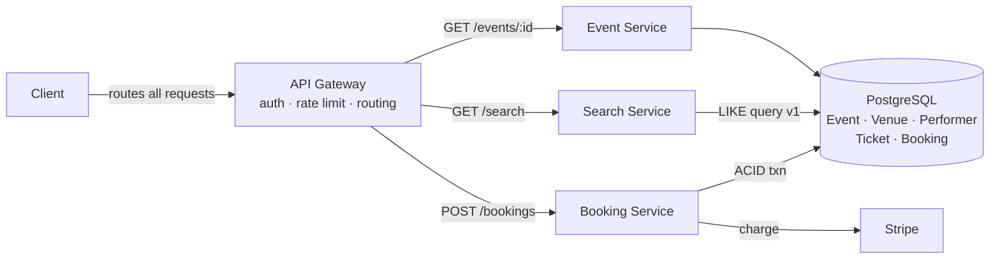

**View flow.** `GET /events/:id` → gateway → Event Service → single read of event + venue + performer + tickets → return. The `Ticket[]` statuses drive the client-rendered seat map.

**Search flow (v1).** `GET /search` → Search Service → filters the Event table directly. Works, but `LIKE '%Taylor%'` forces a full table scan — flagged for the deep dive.

**Booking flow (v1).** `POST /bookings` opens a Postgres transaction: check the selected tickets are `available` → flip them to `booked` → insert a Booking row → commit. If a concurrent txn grabbed the seat first, the transaction fails and the client gets a clean rejection.

> **Shared DB — a deliberate choice, not dogma.** "Database per service" is a guideline, not a law. Here booking needs tickets needs events, all inside one ACID transaction; splitting them would force distributed transactions or CDC-based sync for no benefit. *In the interview, say exactly this:* "For our scale I'll share one DB and revisit if seating and metadata develop different access patterns." (A commenter noted real Ticketmaster appears to split **event metadata** from **per-seat status** — different read/write profiles, so different scaling. That's the right *reason* to split, if you split.)

**The obvious v1 flaw:** a user reaches the payment page, types their card for 3 minutes, then discovers the seat is gone. No hold. That's the first deep dive.

---

## 5. Deep Dives

### 5.1 — No double booking: reserving the seat (Bad / Good / Great)

We need three properties: (a) the seat is **locked to one user** during checkout, (b) an abandoned checkout **auto-releases** the seat, (c) a completed checkout **finalizes** the sale. Three approaches, escalating:

**🔴 Bad — flip status to `reserved`, rely on a cron to reap stale holds.**
Add a `reserved` status + `reserved_until` timestamp. On reserve, set `status=reserved, reserved_until=now()+10m`. A background **cron job** sweeps expired holds back to `available`.
*Why it's weak:* the cron is a coarse, laggy reaper. Between expiry and the next sweep, the seat is neither reservable nor released — a dead zone. Sweep too often and you hammer the DB; too rarely and holds leak. Correct-ish, but operationally clumsy. *(This is the E4/mid-level bar — acceptable to pass, not to impress.)*

**🟢 Good — status + timestamp, but check expiry at read time.**
Same schema, but instead of trusting a cron, every reserve attempt treats a hold as expired if `reserved_until < now()`. A conditional update grabs any seat that's `available` **or** whose hold has lapsed:

```sql
UPDATE tickets
SET status='reserved', held_by=:user, reserved_until=now()+interval '10 min'
WHERE ticket_id=:id
  AND (status='available' OR (status='reserved' AND reserved_until < now()));
-- 1 row updated => you hold it; 0 rows => someone else does
```

No dead zone, no cron on the critical path (a lazy sweep can still tidy rows). The DB row is the single source of truth. Solid senior answer.

**🟢🟢 Great — distributed lock in Redis with a TTL, DB as the durable backstop.**
Put the hold in **Redis**: `SET lock:ticket:{id} {userId} NX EX 600`. The `NX` gives you atomic first-writer-wins; the `EX 600` auto-expires the hold in 10 min with zero reaper. Write an `in-progress` Booking row in Postgres so the intent is durable, then route the client to payment. This keeps the hot contention path (thousands hammering the same seat) *off* the transactional DB — Redis absorbs it at in-memory speed.

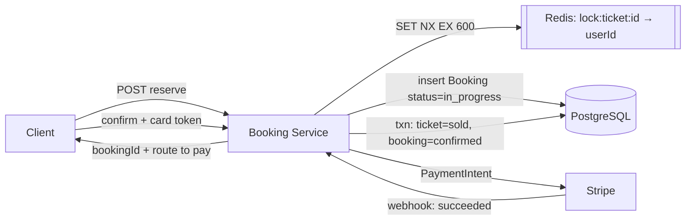

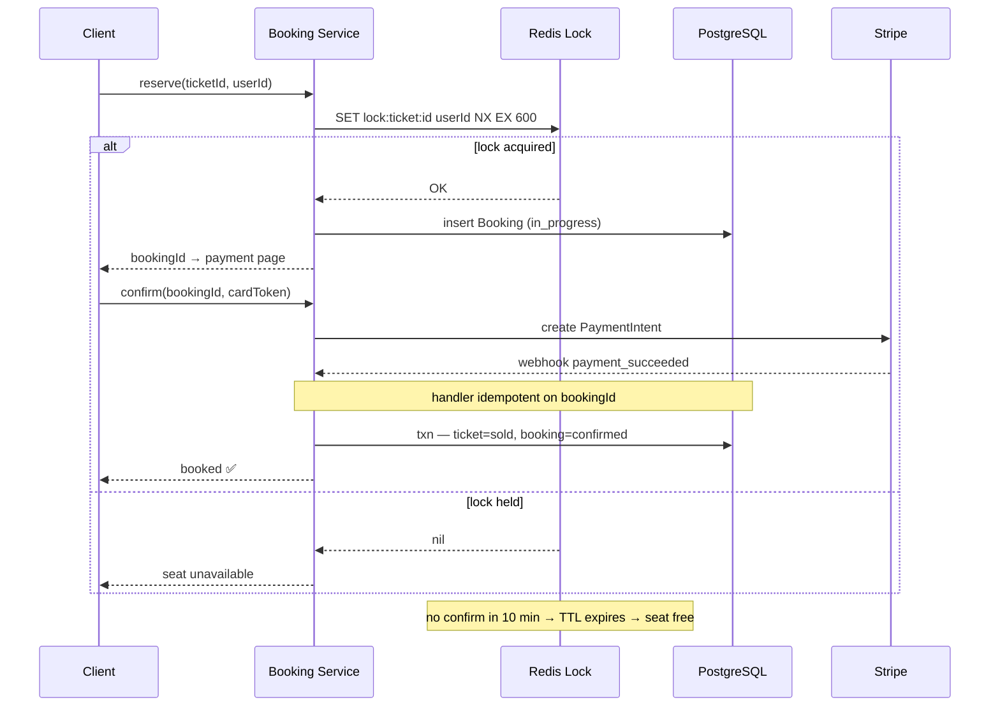

**Payment correctness details worth stating:**
- The client tokenizes the card with **Stripe.js** — our servers never see raw PANs (PCI scope stays minimal).
- Stripe confirms via **webhook**, which carries the `bookingId` in metadata. The handler runs the `ticket=sold` + `booking=confirmed` update in one transaction.
- **The webhook must be idempotent.** Stripe retries on failure; use `bookingId` as the idempotency key and check current status before mutating, or you'll double-apply. This is exactly the *outbox/idempotent-consumer* discipline that separates senior from mid.
- **Forward-only state machine:** `in_progress → confirmed` (or `→ expired/cancelled`). Terminal states are absorbing; no backward transitions. This is the same correctness primitive as payments/trading/booking systems generally.

**"But what if the lock (Redis) goes down?"** *(the top comment-thread question — worth pre-empting.)*
This is the key trade-off to name aloud. Because the DB write is still atomic, **you never actually break the consistency guarantee** — the worst case is a *degraded experience*, not a double sale:
- Bring up a fresh Redis instance immediately. For a ~10-min window, multiple users might reach the payment page for the same seat.
- But the final `UPDATE ... WHERE status='available'` transaction is the real gate. Only one wins; the losers get an error at confirm time. Slightly worse UX for a few unlucky users — a *far* better trade than trying to make the lock itself perfectly consistent.

**Redlock vs. consensus-backed locks (the depth the thread argued over).**
- **Redlock** (multi-node Redis) is *not* a consensus protocol. It's a client-side quorum algorithm — acquire on a majority of N independent nodes (tolerate ⌊N/2⌋ failures). Martin Kleppmann's critique ("How to do distributed locking") is the canonical caveat: async replication + clock assumptions mean Redlock is an **efficiency** lock, not a **correctness** lock.
- For a *correctness*-grade lock you want a consensus-backed store — **etcd / Consul / ZooKeeper** (Raft/ZAB) — where a lock survives node failure because the majority still knows it's held.
- **The senior resolution:** we don't *need* the lock to be correctness-grade here, *because Postgres is our correctness tier.* This is the **two-tier locking pattern**: Redis = cheap efficiency lease (keeps 10M users off the DB); Postgres transaction + the conditional `UPDATE` = the authoritative correctness gate. Redlock's weaknesses are irrelevant when the lock is only an optimization and the DB is the source of truth. *(Add a **fencing token** — a monotonic counter on each hold — only if you ever let the lock alone gate a write; here the DB already fences via the row's status.)*

**OCC / versioning as an alternative** *(raised in the thread — worth a sentence).* You *can* drop Redis entirely and use **optimistic concurrency control**: a `version` column on the ticket, update only if the version is unchanged, retry on conflict. It's lighter than a distributed lock and genuinely double-book-safe. The reason we still add Redis: OCC gives you *correctness* but not the *hold semantics* — the 10-minute "this seat is yours while you pay" lease. Redis gives us the lease cheaply; the DB (via OCC or `SELECT ... FOR UPDATE`) gives us correctness. Different jobs.

> **DDIA Ch. 7–9.** The conditional `UPDATE` leans on Postgres isolation to make the read-check-write atomic; `SELECT FOR UPDATE` (pessimistic) or a version column (optimistic) are the two ways to guarantee it. Consensus for the *lock layer* (Ch. 9) is deliberately avoided — we push correctness down to the single-node transaction manager instead.

---

### 5.2 — Scaling the view path to 10M concurrent readers

The view path is read-heavy and burst-heavy: thousands refresh one event page waiting for on-sale. Three levers:

- **Cache aggressively.** Event details, performer bios, static venue/seat-map layout barely change — cache them hard in **Redis** as `event:{id} → eventObject`, read-through, with **long TTLs for static data** (venue, layout) and **short TTLs for volatile data** (availability). Invalidate on write via DB triggers / CDC. This is where the 200:1 read amplification gets absorbed.
- **Horizontal scale.** The Event Service is stateless → add instances behind a load balancer (Least-Connections / Round-Robin). No need to draw the LB explicitly, but mention it.
- **Separate the volatile bit.** Seat *availability* changes every second during on-sale; don't cache it on the same TTL as the static layout. The client composes the static seat map (long TTL) with live status (streamed — see 5.3).

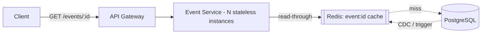

> **Real-world anchor.** This is the standard read-scaling shape Bytebytego shows for hot-content systems (Netflix title pages, etc.): cache the immutable 99%, stream the volatile 1%.

---

### 5.3 — Live seat map + the virtual waiting room (Good / Great)

During a hot on-sale the cached seat map goes stale in milliseconds — users click a seat that's already gone. Two escalating fixes:

**🟢 Good — Server-Sent Events push seat-status deltas.**
**SSE** is a one-way server→client stream; perfect here since we only push updates down. As seats get reserved/sold, push deltas so the map stays live without refresh. Works well for *moderately* popular events.

**🟢🟢 Great — an admin-enabled virtual waiting room in front of the booking plane.**
For the Taylor-Swift case, SSE alone is a firehose — the map empties instantly and 10M people stampede the Booking Service. Put a **virtual queue** in front:
- On requesting the booking page, the user gets a persistent connection (SSE) and a slot in a **Redis sorted set** (score = timestamp → FIFO ordering).
- Dequeue from the front on a controlled cadence (e.g., as tickets clear). Mark admitted users in an `admitted:{eventId}` set with a TTL; the Booking Service **rejects any reserve from a non-admitted session.**
- Push live position + ETA down the SSE connection so waiting feels honest.

This converts an uncontrolled stampede into a metered flow — protecting the DB, the lock, and Stripe from thundering-herd collapse.

> **Placement correction (a sharp thread catch, acknowledged by the author).** The queue should gate **entry to the event/booking *view*** — i.e., before `GET /event/:id` renders the live seat map — **not** just the reserve call. If you only queue the reserve step, 10M people still load and stream the seat map simultaneously, melting the view plane. Gate at the door, not at the till.

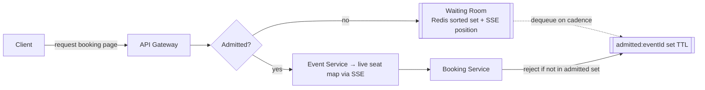

> **Staff-level note.** The best move here is partly *non-technical*: the waiting room is a product decision that reshapes the load curve, not a cleverer algorithm. Recognizing that "the cheapest way to scale the stampede is to not have a stampede" is the senior→staff delta the HelloInterview writeup calls out.

---

### 5.4 — Low-latency search (< 500ms): Bad / Good / Great

v1's `LIKE '%Taylor%'` full-scans the Events table — dead on arrival at scale.

**🔴 Bad — leave it as `LIKE`.** Wildcard-prefix `LIKE` can't use a B-tree index; every search scans every row. Fails the 500ms bar as events grow.

**🟢 Good — Postgres full-text search (`tsvector` + GIN index).** Built into Postgres, no new infra. `to_tsvector` + a **GIN** index makes token lookups ("Taylor", "Swift") fast without a full scan. Note this is *not* Lucene — no fuzzy/typo tolerance, and index maintenance adds write cost. Good enough for many cases and zero added services.

**🟢🟢 Great — Elasticsearch, synced via CDC.** ES's **inverted index** is purpose-built for this, and it gives **fuzzy search** (tolerates "Tayler Swift" typos) that SQL can't easily do. Keep it in sync with Postgres via **Change Data Capture** (capture inserts/updates/deletes, replicate to the ES index) so search never diverges from truth. Cost: an extra cluster + a sync pipeline to operate.

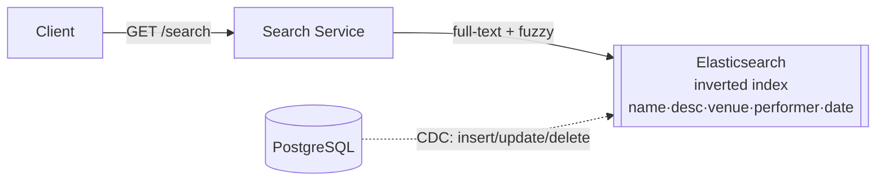

**Then cache the hot queries.** Popular searches repeat; cache results in Redis keyed on the normalized query (`search:keyword=taylor+swift&start=...`) with a short TTL, plus ES's own shard-level **request/query cache**. If results aren't personalized, a **CDN** (CloudFront) can cache them at the edge. Invalidate on new-event announcements — the tricky part, since query→result mappings aren't 1:1 with rows (use cache tags + TTL).

> **DDIA Ch. 3 & 11.** Inverted indexes are the search-optimized structure; CDC (Ch. 11, derived data / stream processing) is the correct way to keep a secondary index eventually consistent with the system of record without dual-write bugs.

---

## Final Architecture

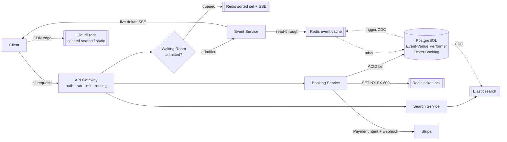

---

## What each level is expected to deliver

| Level | Bar for Ticketmaster |
|---|---|
| **Mid (E4)** | Clean API + data model; functional view + book; solves no-double-booking with the **Good** (status + timestamp) solution. Depth is bonus. |
| **Senior (E5)** | Breeze the HLD; go *deep* on search (Elasticsearch + CDC), no-double-booking (distributed lock or OCC), and popular-event handling. Articulate trade-offs. |
| **Staff+** | 40% breadth / 60% depth. Drive 2–3 deep dives independently; recognize the waiting-room as a load-shaping product move; leave the interviewer with a new perspective. |

---

## 🔍 Senior-Signal Questions to Ask in Your Interview

- **"Is the lock an efficiency lease or a correctness gate?"** → *Signals you know Redlock ≠ consensus, and that pushing correctness to the single-node Postgres transaction is why the lock's weaknesses don't matter (two-tier locking).*
- **"Do we gate the waiting room at page-view or at reserve?"** → *Shows you see that streaming a live seat map to 10M users melts the view plane — you queue at the door, not the till.*
- **"How do we keep Elasticsearch consistent with Postgres — dual-write or CDC?"** → *Surfaces the dual-write hazard and that CDC/outbox is the correct derived-index sync (DDIA Ch. 11).*
- **"What's our behavior when Redis dies mid-on-sale?"** → *Tests whether you can reason that the DB txn still guarantees no double sale — degraded UX, not broken correctness.*
- **"Do we split event metadata from per-seat status into separate stores?"** → *Probes whether you'll shard by access pattern (immutable metadata vs. hot mutable seat state) the way real Ticketmaster appears to — the legitimate reason to break the shared DB.*
- **"Is our webhook idempotent, and is the booking state machine forward-only?"** → *Confirms you handle Stripe retries and absorbing terminal states — the payment-correctness primitives.*

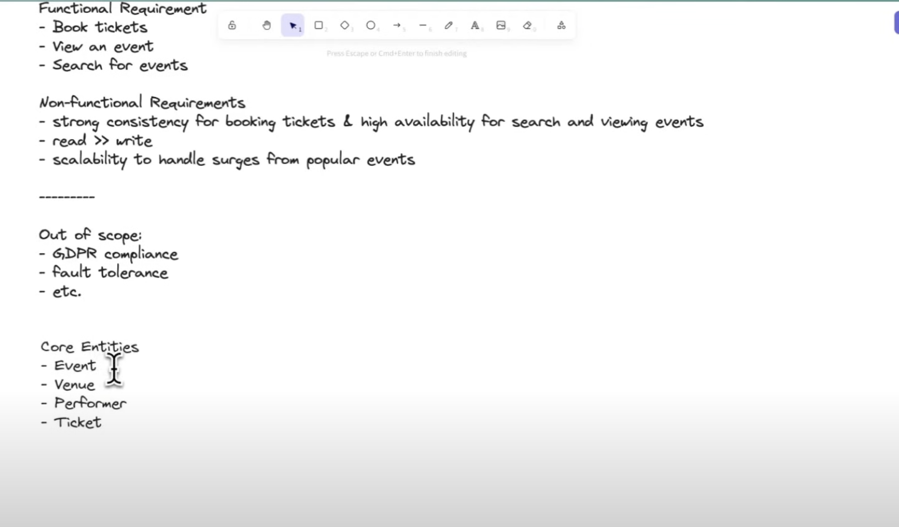
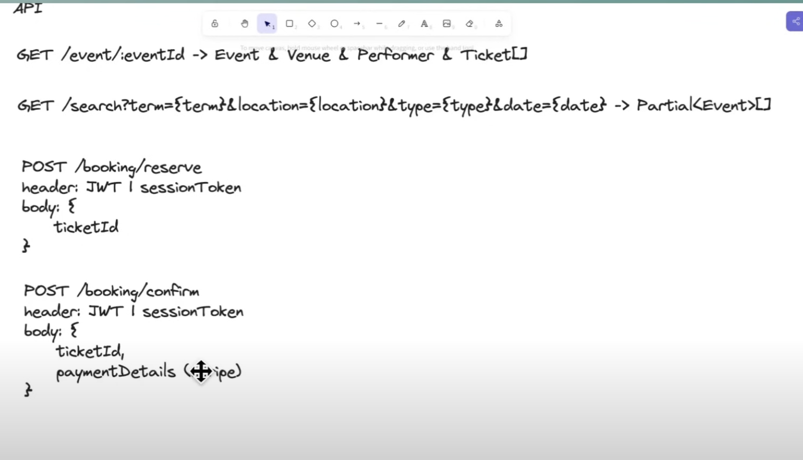
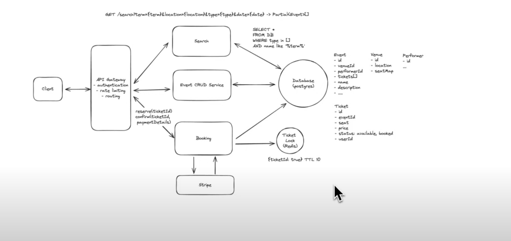
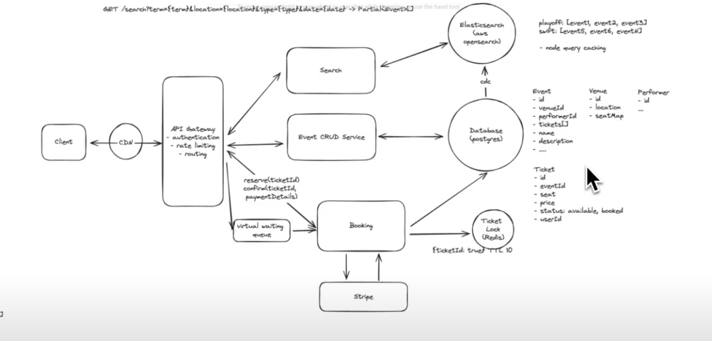


## Artifacts

HelloInterview link: https://www.youtube.com/watch?v=fhdPyoO6aXI&t=1s&ab_channel=HelloInterview-SWEInterviewPreparation