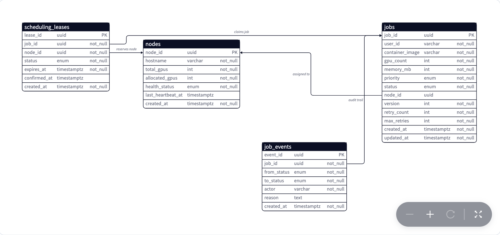

# GPU Scheduling Platform
We'll design the scheduling and execution layer for a shared GPU cluster.

Some facts about GPU scheduling platforms:
 * Manages a shared pool of GPU nodes for multiple users/teams
 * Runs containerized batch jobs - ML training, fine-tuning, batch inference
 * Queues jobs by priority, assigns to nodes with capacity, runs in containers, handles failures automatically
 * Think of it as the internal compute fabric behind any ML platform team

# Step 1 - Understand the Problem and Establish Design Scope
Sample Q&A between candidate and interviewer:
 * C: Do any jobs require GPUs across multiple nodes simultaneously (all nodes start at once, failing one releases all)?
 * I: No, assume each job fits on a single node. Gang scheduling is a follow-up. Core is single-job, single-node placement.
 * C: If the platform picks a node but it becomes unreachable before the job starts, should GPU resources be released automatically after a short time?
 * I: Yes, release automatically after a short timeout. GPU slots must never stay locked by a ghost claim.
 * C: When a high-priority job arrives and all GPUs are busy, should we preempt any lower-priority job, or only jobs at least one full band lower?
 * I: Only preempt jobs of strictly lower priority. Never preempt equal priority - that causes endless evictions.
 * C: When a long-running job is preempted, is the platform responsible for preserving its progress?
 * I: No. We send a graceful stop signal, then re-queue. The job saves its own internal state during preemption.
 * C: If the scheduler crashes mid-decision, should the system recover automatically from persistent state?
 * I: A crash or restart should not lose state or require manual recovery. All placements recoverable from the durable DB.
    - Possibe Scenarios
        - Job compelte = App saves the output in S3.
        - Node Failure = Platform re-queues the job, detected via heartbeat miss
        - Pre-emption = Plaftorm sends a signal for graceful exit. App saves the state
        - OOM/Crash = Job dies abruptly. On restart App checls the most recent checkpoint and works from there.
 * C: Should a single missed heartbeat declare a node dead, or only multiple consecutive misses?
 * I: Require 2-3 consecutive misses. A single miss could be a transient delay. Wait a few extra seconds over preempting a healthy job.
 

We'll focus on the core placement problem - one job, one node - built on an atomic lease protocol, then layer in preemption and heartbeat-based failure detection.

## Functional requirements
 * **Submit** Users submit a GPU job specifying container image, GPU count, memory requirement, and priority level
 * **Schedule** The scheduler assigns pending jobs to available nodes based on priority, resource fit, and fairness
 * **Run** Jobs run inside containers pulled from a registry, with GPU and memory isolation on the target node
 * **Query** Users can query job status and retrieve logs/output artifacts after completion
 * **Preempt logic** The platform preempts lower-priority running jobs when a higher-priority job arrives and no resources are free

Out of scope: multi-cluster federation, long-running inference serving, K8s API internals, training framework specifics, billing/cost allocation, auto-scaling the physical fleet, network topology-aware placement (NVLink, InfiniBand).

## Non-functional requirements
 * **Strong consistency** for scheduling decisions - a GPU slot is never double-assigned. Job-status reads can be eventually consistent.
 * **Latency** - high-priority jobs start within 5s of submission when resources are available; normal-priority within 2min
 * **Scale** - up to 1,000 GPU nodes, 10,000 concurrent queued jobs, 100 concurrent running jobs
 * **Fault detection** - detect node failures within 30s via heartbeats, auto-retry failed jobs up to a configurable limit
 * **Utilization** - target >80% GPU utilization cluster-wide while respecting priority and per-team fairness
 * **Isolation** - jobs from different users are resource-isolated (GPU, memory, network) to prevent noisy-neighbor effects

## Back-of-the-envelope estimation

| Metric | Value | Drives |
|---|---|---|
| GPU nodes in cluster | 1,000 | Node registry, capacity cache |
| GPUs per node (avg) | 8 | Total capacity ~8,000 GPUs |
| Concurrent queued jobs | ~10,000 | Redis priority queue size |
| Concurrent running jobs | ~100 | Heartbeat & lease tracking load |
| Job submissions/min (peak) | ~50 | Job API ingestion path |
| Heartbeat interval | 10s | Failure detection latency |
| Scheduling loop frequency | 1s | Decision cadence |

The cluster is moderate in raw node count, but the scheduling loop must be fast. Evaluating priority, capacity, and preemption across 10,000 queued jobs on a 1-second cadence rules out polling PostgreSQL on every tick. This is why the hot-path scheduling state lives in a Redis sorted set and capacity cache, with PostgreSQL as the authoritative job store.

# Step 2 - Data Model Design

Every functional requirement maps to a durable boundary or an ephemeral helper. Job definition and lifecycle state must survive a scheduler crash, so they live in **PostgreSQL** as authoritative truth. Node capacity and real-time GPU allocation are ephemeral hot state, rebuildable from heartbeats, so they live in a **Redis capacity cache**. Scheduling leases are short-lived claims that time out if not confirmed - stored in PostgreSQL for crash safety but with an expiry timestamp acting as a distributed timeout. Job logs and output artifacts are large blobs in **object storage (S3)**, referenced by job ID.

The authoritative boundary is intentionally small. After any crash, the `jobs` row and its `status` column are the legal truth. Redis state is rebuildable from heartbeats. Leases that outlive their expiry are garbage-collected and their jobs return to pending. Recovery never depends on ephemeral state being correct - only on PostgreSQL being available.




## Core tables
 * **`jobs`** - the lifecycle anchor. Stores resource requirements (`gpu_count`, `memory_mb`), a `status` enum enforcing legal transitions (pending → leased → running → succeeded / failed / preempting → cancelled), and a `version` column for optimistic concurrency. Both scheduler and node agent write here, so the version counter prevents stale updates overwriting fresher state.
 * **`job_events`** - an append-only audit trail. Every transition writes one row with timestamp, actor (scheduler, node agent, user), and reason. Write-once, never updated - cheap for debugging/replay without contending on the hot `jobs` row.
 * **`nodes`** - registered GPU nodes: total GPU count, allocated GPUs, health status, `last_heartbeat_at`. A fallback consistency check; the scheduler normally reads the faster Redis capacity cache.
 * **`scheduling_leases`** - binds a job to a node for a short window. Records `job_id`, `node_id`, creation time, `expires_at`. Confirmed if the node agent reports the container started; else a background sweeper returns the job to pending and releases the reservation.

## Access patterns
 * **Scheduler hot path** - dequeue highest-priority pending job from Redis sorted set, check node capacity in Redis hash, then atomically create a lease row and update job status in PostgreSQL within one transaction.
 * **Status read** - look up jobs by `job_id` (primary-key index). User-facing.
 * **Fault recovery** - find all running jobs on a failed node: query by `node_id` and `status='running'`. Requires an index on `(node_id, status)`.
 * **Lease cleanup** - find leases where `expires_at < now()` and `status='pending_confirmation'`. A periodic sweeper reclaims ghost reservations.

## Core invariants
 * A job can only be in one state at a time, enforced by the status enum and version-gated updates.
 * A GPU slot cannot be double-assigned. The lease creation transaction decrements the node's available GPU count atomically.
 * No lease outlives its expiry without either confirmation or cleanup.
 * Job events are append-only. No event row is ever updated or deleted.

## Storage tradeoff
PostgreSQL handles the moderate write volume (tens of transitions/sec) easily and gives full transactional atomicity (ACID) for lease creation and state-machine transitions. Completed jobs are archivable to cold storage.

Redis serves two hot-path roles. A sorted set keyed by priority score gives O(log N) insert and O(1) pop-min for scheduling. A per-node hash caches available GPU counts so the scheduler avoids querying PostgreSQL on every tick. Both are rebuildable: the sorted set from `jobs WHERE status='pending'`, the capacity hash from node heartbeats.

```sql
SELECT j.job_id, j.priority, j.gpu_count
FROM jobs j
JOIN scheduling_leases sl ON sl.job_id = j.job_id
WHERE sl.expires_at < NOW()
  AND sl.status = 'pending_confirmation'
ORDER BY sl.expires_at
LIMIT 50
FOR UPDATE SKIP LOCKED;
```
This query powers the lease sweeper. `FOR UPDATE SKIP LOCKED` lets multiple sweeper instances run concurrently without contending on the same expired lease rows.

# Step 3 - API Design

The client contract has one critical rule: job submission returns a durable job ID **immediately**, but actual scheduling is asynchronous. The caller never waits for a GPU slot - it gets a job ID and polls (or subscribes) for state transitions. This separation lets the scheduler batch decisions, evaluate priorities, and handle preemption without blocking submission.

Three communication modes:
 * **REST** - job submission, status queries, cancellation. Durable mutations with immediate acknowledgement.
 * **gRPC** - internal scheduler-to-node-agent: job assignment, lease confirmation, heartbeat streaming. Tight schema + bidirectional streaming fits this internal boundary.
 * **Polling / SSE** - clients poll `GET /v1/jobs/{job_id}` or subscribe to an SSE stream for near-real-time transitions. Polling is the recovery truth; SSE is convenience.

## Submit a job
```
POST /v1/jobs
```
User submits container image, GPU count, memory requirement, priority level, and an optional idempotency key. The server validates, writes a pending job row to PostgreSQL, enqueues it in the Redis priority queue, and returns the `job_id` immediately.

The idempotency key prevents duplicate jobs on client retry - a retry with the same key returns the existing job. `user_id` is extracted from the authenticated session, never the request body.

Fields: `image`, `gpu_count`, `memory_mb`, `priority` (critical/high/normal/low), `idempotency_key` (optional).

Response: `201 Created` with `{ job_id, status: "pending", created_at }`.

## Query job status
```
GET /v1/jobs/{job_id}
```
Returns canonical job state, assigned node, start/end time, output artifact location, and retry count. This is the **recovery read** - after any disconnect or uncertainty, the client re-reads this to recover truth.

Response: `200 OK` with the full record (`status`, `node_id`, `started_at`, `finished_at`, `output_url`, `retry_count`).

## Cancel a job
```
DELETE /v1/jobs/{job_id}
```
Cancels a pending or running job. If pending, it transitions directly to cancelled and is removed from the queue. If running, the scheduler sends a graceful termination signal, and the job moves through preempting to cancelled.

Response: `202 Accepted` (cancellation is asynchronous for running jobs).

## Supporting surfaces
 * `GET /v1/jobs?user_id={user_id}&status={status}` - lists a user's jobs with status filter and cursor pagination.
 * `GET /v1/jobs/{job_id}/logs` - streams log output from the container or returns finalized logs from object storage.

## Internal protocol: scheduler to node agent
Over gRPC with bidirectional streaming:
 * **AssignJob** - scheduler sends a lease assignment (`job_id`, container image, resource limits, `lease_id`). The node agent pulls the image, starts the container, and responds with confirmation or rejection.
 * **ReportHeartbeat** - node agent streams periodic heartbeats reporting each running container's status and resource utilization. If heartbeats stop, the scheduler treats the node as potentially failed.

> **How I'd say it in the interview:** "Submission is fire-and-forget from the client's perspective. You get a job ID back, and from that point the scheduler owns the placement decision. Polling is always the source of truth. SSE is optional convenience."

# Step 4 - Propose High-Level Design and Get Buy-In

The core tension: every scheduling decision is a **distributed commitment** across the scheduler, a database, and remote node agents.

The naive move: a single scheduler polls the queue, finds a node with free GPUs, and sends a gRPC "run" command directly. This works in a prototype but breaks the moment a node crashes mid-launch. The scheduler decrements capacity and considers the job running, but the node never started the container - a **ghost reservation**, a GPU slot taken by a non-existent job. To prevent this state drift, we move to a **lease-confirmed model**: the scheduler proposes a placement, and the node agent must actively confirm before the assignment becomes real.

## Core architecture
The baseline: a **Scheduler**, a single **PostgreSQL** database, and remote **GPU Node Agents**. To execute a job, the scheduler reads pending tasks and node capacities, selects a node, writes an ephemeral lease record binding the job to that node, then sends an `AssignJob` gRPC request. Once the node agent pulls the image and boots it with GPU isolation, it confirms the lease and the job goes to running. On completion, the agent reports back and the scheduler deletes the lease to release capacity.

That single path works in a quiet cluster, but three gaps appear:
 * **No priority-aware preemption** - a low-priority job holding GPUs blocks high-priority work indefinitely; the scheduler has no mechanism to reclaim resources.
 * **No heartbeat-based lease recovery** - a node crashing mid-job leaves a live lease and a ghost reservation. The scheduler can't distinguish a slow job from a dead node until the lease expires, which may be far too long.
 * **No topology-aware placement** - assigning purely by free GPU count ignores memory and inter-GPU topology, causing fragmentation where nodes show free GPUs but none can satisfy the next job.

These map to three properties the full architecture must provide: a **preemption protocol** that interrupts running work on a priority boundary, a **heartbeat stream** from every node agent for second-scale failure detection, and a **capacity model** that tracks memory and topology alongside raw GPU count.

## Architecture overview
The **Job API** accepts submissions over REST, validates, writes the job row to PostgreSQL, and enqueues it in the **Redis priority queue** (sorted set scored by priority). The **Scheduler** runs a tight loop: every second it dequeues the highest-priority job, checks the capacity cache for a node with enough free GPUs, and creates a **scheduling lease** in PostgreSQL binding the job to that node. The lease has a short expiry (60s).

The **Node Agent** receives the lease over gRPC, pulls the container image, starts it with GPU isolation, and confirms the lease. Once confirmed, the job goes to running. The agent streams heartbeats every 10s. Output artifacts are written directly to **S3** by the container.

PostgreSQL is authoritative (`jobs`, `job_events`, `nodes`, `scheduling_leases`). Redis is the scheduling hot-path cache (priority sorted set + per-node capacity hash), both rebuildable. Scheduling is really **bin-packing under churn** - multi-GPU jobs fragment capacity, and the Redis view can hide fragmentation. The scheduler uses a **leader-elected single instance** (PostgreSQL advisory lock) so exactly one process owns the loop, with a standby that takes over on failure.

## Job lifecycle state machine
A job starts **pending** on submission. The scheduler moves it to **leased** when it creates a lease. The node agent moves it to **running** after confirming. From running it ends as **succeeded** or **failed**, or the scheduler moves it to **preempting** when a higher-priority job needs the resources. From preempting it returns to **pending** after graceful shutdown is confirmed. A user can **cancel** from pending, leased, or running. Every transition is gated by a version check on the job row, so two racing actors cannot both succeed.

## Flow 1: Submit, schedule, and execute
The user calls `POST /v1/jobs`. The Job API writes a pending row and enqueues the job in Redis with priority as the score.

On the next tick, the scheduler pops the highest-priority job, checks the capacity cache for a fitting node, and opens a PostgreSQL transaction: insert a `scheduling_leases` row, update the job to leased (version increment), decrement the node's available GPUs. This atomic transaction is the **propose** step.

The scheduler then sends `AssignJob`. The node agent pulls the image, starts the container with GPU passthrough, and confirms - the job moves to running. If the agent rejects (resource mismatch, image pull failure), the scheduler rolls back: lease cancelled, job back to pending, capacity released. If the lease expires with no response, the background sweeper performs the same rollback.

## Flow 2: Preempt, checkpoint, and re-queue
When a critical job arrives and no node has free GPUs, the scheduler scans running jobs for a victim: a strictly-lower-priority job on a node with enough GPUs. It prefers the lowest-priority job that frees the required resources.

The scheduler transitions the victim to preempting and sends a graceful termination signal; the agent gives the container a grace period (30s) to save a checkpoint to S3 before stopping. On confirmation, the scheduler releases the allocation, returns the victim to pending (with a `preempted` event), and re-enqueues it. The freed resources go to the high-priority job via the normal lease flow.

**Critical ordering:** the victim must fully release resources before the new job claims them. The scheduler waits for preemption confirmation before creating the new lease.

# Step 5 - Design Deep Dive

The high-level design glossed over the hardest parts: what happens when lease confirmation never arrives, how to detect a dead node without killing healthy jobs, and how priority scheduling avoids starving normal work. These are the three probes an interviewer will push on.

## Scheduling atomicity and the lease protocol
The naive approach - "find a node, send a gRPC run command, update the DB" - is not atomic. If the scheduler updates the DB and the gRPC call fails, we have a ghost reservation. If the gRPC succeeds but the DB write fails, we have an orphan container. At scale, both will happen.

The lease protocol splits scheduling into **propose** and **confirm**. Propose is a single PostgreSQL transaction: insert a lease row, update the job to leased, decrement capacity - all or nothing. The lease includes an `expires_at` (~60s).

After proposing, the scheduler sends `AssignJob`. Three outcomes:
 * **Agent confirms** - lease marked confirmed, job moves to running.
 * **Agent rejects** (image pull failure, insufficient memory) - lease cancelled, job returns to pending.
 * **Nothing happens** (node unreachable) - the interesting case.

For the third case, the scheduler does not decide immediately whether the node is dead. A background sweeper runs every 15s, finds expired leases still in `pending_confirmation`, and rolls them back. The job returns to pending and the scheduler tries a different node.

**This is the aha moment:** you don't schedule a job by assigning it to a node - you schedule it by creating a lease the node agent must confirm. The scheduler proposes, the node disposes. If the node never confirms, the lease expires and the system self-heals with no manual intervention.

The version column prevents races. If the agent is slow, the lease expires, the sweeper rolls the job back to pending, and a late confirmation arrives - the compare-and-swap on version fails. The agent detects the stale lease, stops the container, and no inconsistency leaks through.

## Fault detection and job recovery
GPU training jobs run for hours. Losing a job to a node crash is expensive; killing a healthy job over a transient blip is just as bad. Fault detection balances speed against false positives.

Agents send heartbeats every 10s over the gRPC stream, each including container inventory and resource usage. The scheduler keeps `last_heartbeat_at` per node in Redis and the `nodes` table.

When heartbeats stop, the scheduler does **not** immediately declare death. It waits for 3 missed heartbeats (30s), marks the node **suspect**, and stops assigning new jobs. It does not yet kill running jobs - it sends a **probe** (a lightweight gRPC health check). If the probe succeeds, the suspect flag clears. If it fails, the node is marked **offline** and all its running jobs enter recovery: jobs with retries remaining return to pending (incremented retry count + `node_failure` event); jobs with exhausted retries transition to failed.

**Checkpoint-based resume** is the difference between a 30-second retry and restarting a 4-hour run. Jobs write periodic checkpoints to `s3://jobs/{job_id}/checkpoints/`. When a retried job starts on a new node, the container entrypoint checks for an existing checkpoint and resumes. The platform manages only the storage path and the guarantee that the retried job keeps the same `job_id`.

The tradeoff is honest: fast detection risks false positives, slow detection wastes resources, and lease expiry is the final safety net regardless.

## Priority preemption and starvation prevention
Priority without preemption is just a suggestion. If a critical job arrives and all GPUs are busy with normal jobs, it waits until something finishes - possibly hours. Preemption makes priority real.

The decision runs inside the scheduling loop. When no node has sufficient free capacity, the scheduler scans running jobs for a victim whose priority is **strictly lower** and whose released footprint satisfies the request, picking the one that minimizes wasted resources. It transitions the victim to preempting, signals the agent with a grace period, waits for checkpoint save + shutdown, then re-queues the victim at its original priority. The new job gets the slot via the normal lease protocol. Strict ordering: the new lease is not created until the victim's resources are confirmed released.

The harder problem is **starvation**. If critical jobs arrive faster than they complete, a normal job could cycle forever between pending → leased → running → preempting → pending, never finishing. Two guards:
 * **Priority aging** - a job's effective priority increases one tier for every N minutes waiting (e.g. every 30min). Even low-priority jobs eventually reach high effective priority and stop being victims.
 * **Preemption protection** - once a job runs longer than a threshold (e.g. 15min), it becomes ineligible for preemption. The scheduler must find a different victim or queue the incoming job.

This trades some scheduling optimality for fairness. A critical job might wait a few minutes longer if all viable victims are protected, but it prevents the pathological loop and gives a predictable contract: survive the first 15 minutes and you won't be killed for priority reasons.

> **How I'd say it in the interview:** "Priority without preemption is just suggestion. But preemption without fairness is starvation. I'd implement priority aging and a preemption-protection window so normal work eventually completes, even under sustained critical load. The tradeoff is a critical job might wait a bit longer if all victims are protected - a better contract than 'normal jobs never finish.'"

# Step 6 - Other Considerations

## Container image caching and cold-start optimization
Image pull is the largest contributor to start latency after scheduling. ML images are 5-15 GB; pulling from a remote registry every launch adds minutes, violating the "high-priority within seconds" requirement.

Two-layer mitigation. Each node agent maintains a local image cache with **LRU eviction** - popular images stay warm. The scheduler uses **image locality as a soft preference**: given two nodes with enough GPUs, prefer the one that already has the image cached (a hint, never a hard constraint - the scheduler never delays scheduling to find a warm node). For known-frequent images, a **background pre-pull daemon** proactively fetches to all nodes during off-peak hours, turning cold starts into warm starts without touching the hot path.

## Kubernetes as the production implementation path
The architecture maps directly onto K8s primitives: the Scheduler → kube-scheduler (or a custom plugin); Node Agents → kubelets; Jobs → `batch/v1` Job resources; container isolation → device plugins for GPU passthrough; preemption → `PriorityClass`. The Redis queue becomes the K8s scheduling queue; the lease protocol maps to pod binding and kubelet confirmation.

Designing from scheduling principles first shows you understand *why* these components exist, not just how to configure them. In production you'd use K8s for free container lifecycle management, device plugin support, and GPU operators. **Key difference:** K8s does not natively support priority aging or two-tier heartbeat-then-probe fault detection - those are custom scheduler extensions or controllers.

## Cluster observability and GPU utilization SLOs
Meeting >80% utilization requires instrumentation. Three metrics matter most:
 * **Scheduling latency** - p50/p99 time from pending to running per priority tier. High-priority p99 over 10s means the loop is too slow or preemption isn't freeing resources fast enough.
 * **GPU utilization** - aggregated from heartbeats. A sustained drop below 80% with a non-empty queue signals fragmentation (bin-packing problem).
 * **Queue depth by priority** - a growing backlog of normal jobs during critical work is expected; a growing backlog of *critical* jobs is an alert.

Node agents already stream utilization in heartbeats. The scheduler publishes to a time-series store (Prometheus + Grafana). Alert when high-priority scheduling latency exceeds 5s at p95, utilization drops below 70% for 10+ min, or critical-priority queue depth stays above 0 for 60+ s.

## Admission control and per-team quotas
Without admission control, one team could submit 10,000 low-priority jobs and slow scheduling for everyone. A gate before the queue:
 * **Per-team quota** on concurrent queued jobs - if Team A's quota is 500 pending and they're at 500, additional submissions get `429 Too Many Requests`. Checked at submission time in the Job API, not the scheduler, preventing flooding before it hits the hot path.
 * **GPU-hour budgets** per team per billing period - each team gets an allocation (e.g. 10,000 GPU-hours/month); the Job API checks cumulative usage before accepting. Combined with per-user rate limiting (10 submissions/sec/user), this prevents flooding and cost overruns without hot-path complexity.

# Step 7 - Interviewer Expectations

**Junior** - describe the basic shape: submit to an API, jobs into a queue, scheduler picks the next and sends to a node, node runs a container. Draw Job API + queue + scheduler + GPU nodes with the happy path. Get the basic states right (pending, running, succeeded, failed). Acknowledge nodes can fail and retries are needed, without deep failure/preemption handling.

**Intermediate** - identify that scheduling is the hard part, not just queue-pop-and-assign. Explain why a priority queue beats FIFO, describe basic preemption, recognize the node failure problem. Explain the PostgreSQL (durable state) vs Redis (hot path) split and why polling the DB every tick is too slow. Discuss heartbeat fault detection and checkpoint retries conceptually.

**Senior** - drive toward the **lease protocol** and the distributed commitment problem. Explain why assign-then-notify is insufficient; articulate propose-confirm with lease expiry as the safety net; describe the version-gated state machine that prevents races between scheduler, agent, and sweeper. Cover starvation prevention (priority aging, preemption protection) and checkpoint resume. Defend tech choices (PostgreSQL for transactional truth vs Redis for sub-second scheduling), explain heartbeat escalation (suspect → probe → dead), and discuss utilization SLOs, admission control, and the K8s mapping. The strongest candidates address what happens when the **scheduler itself crashes** and how leader election preserves continuity.

# Knowledge Base

* Q: What is Checkpoint?
* A: Snapshot of entire training state: Model Weights, Optimizer State, Training Step Counter, Random Seeds. Save the full weights periodically only.
* Q: How is the training resumed?
* A: New Node will check for the job_id if any checkpoint is available in S3, Pytorch framework will load those weights into memory and continue learning from step 5000 not step 0.
    - Platform Responsibility: The scheduler does not save data. It only sends a preemption signal (e.g., SIGTERM) and waits for the container to exit gracefully.
    - Checkpoint Strategy: You do not checkpoint every step. Use periodic checkpointing (e.g., every hour) to protect against crashes, combined with on-demand checkpointing triggered by the preemption signal to minimize lost progress.
    - Checkpoint Strategy: You do not checkpoint every step. Use periodic checkpointing (e.g., every hour) to protect against crashes, combined with on-demand checkpointing triggered by the preemption signal to minimize lost progress.
    - Resume Mechanism: When a job restarts, it loads the last saved checkpoint (weights + optimizer state) from object storage (S3) and continues training from that point, avoiding re-computation from scratch.
    - Implementation Ownership: As an MLE, you must write the code to handle signals, manage I/O asynchronously, and ensure resume logic exists. Frameworks provide the tools (torch.save), but you define the strategy.