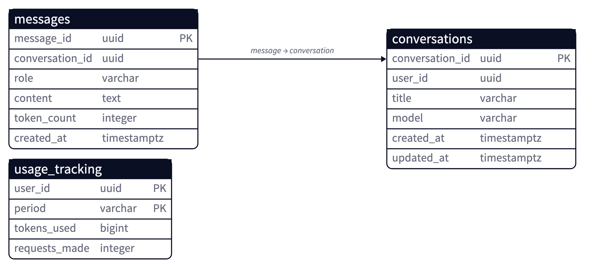
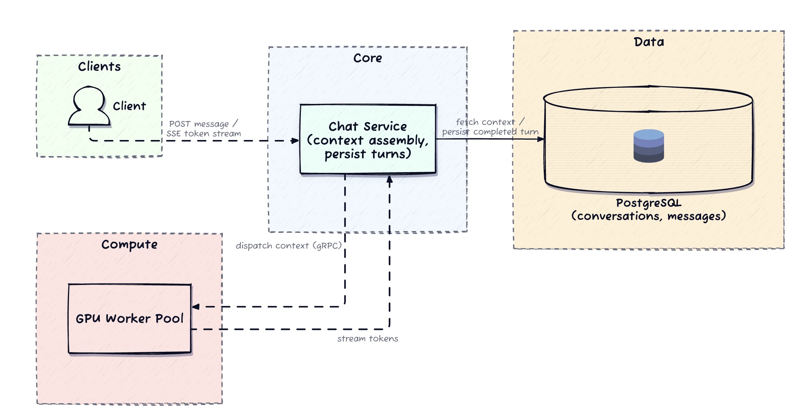
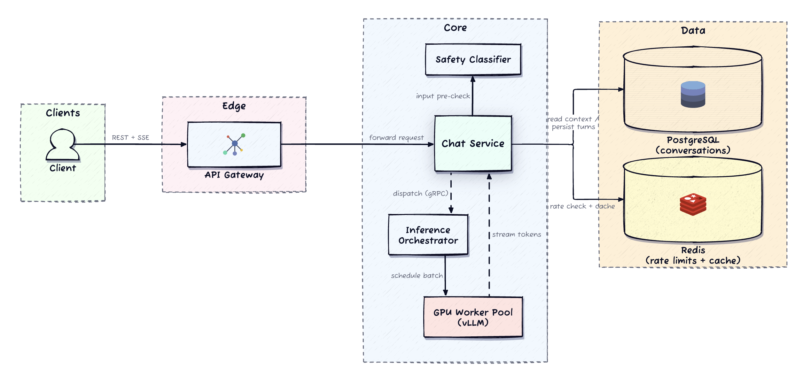
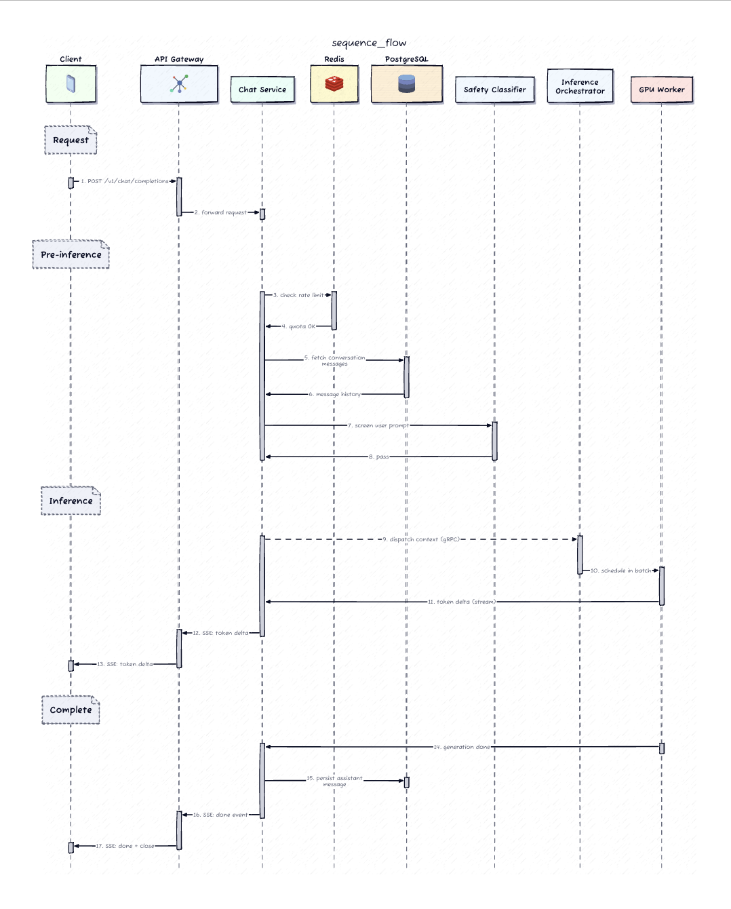
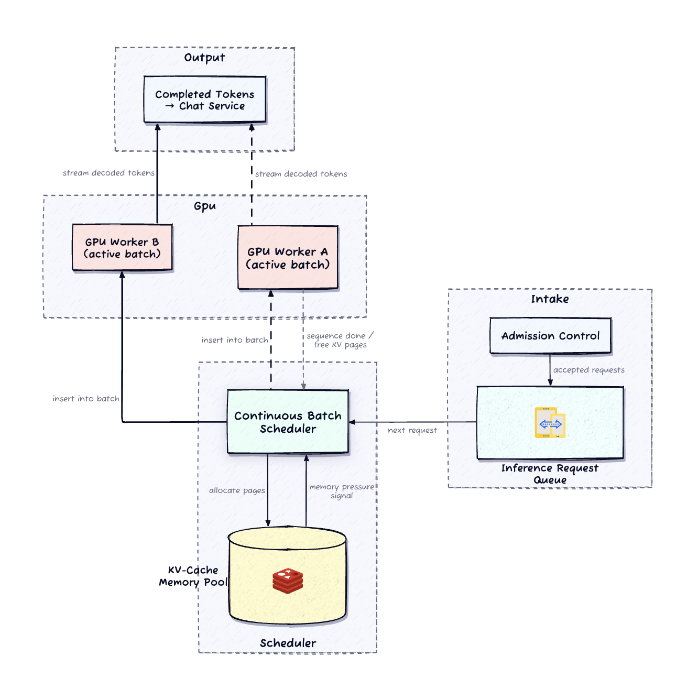
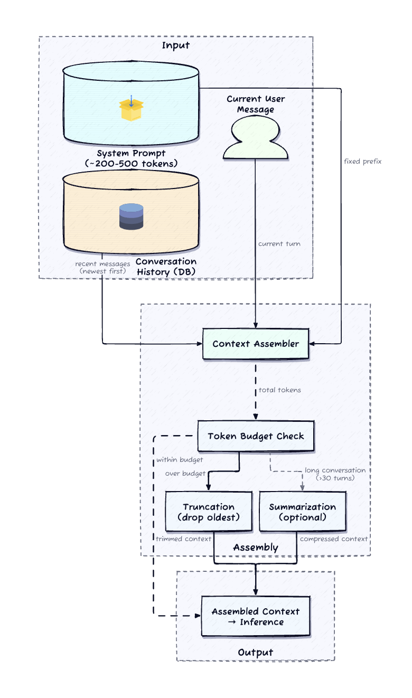
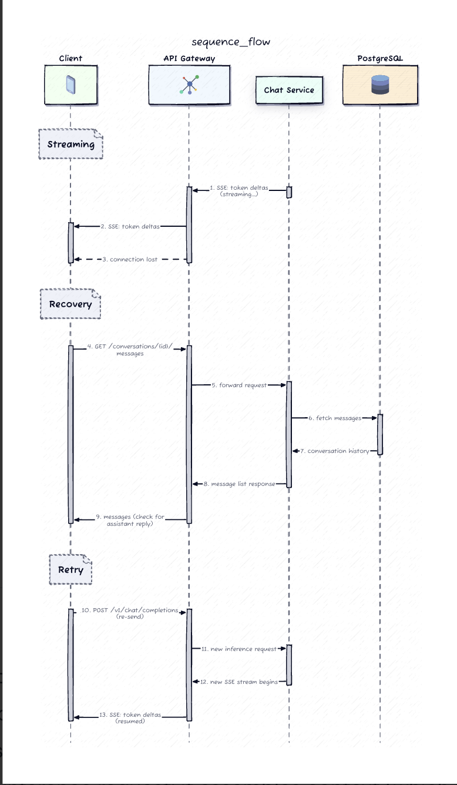

# Design a ChatGPT-like Conversational AI Backend


## 1. Requirements (~5 min)

### Functional Requirements (top 3 prioritized)

1. **Send a message, stream the response** — user sends text within a multi-turn conversation; system streams the AI response token-by-token.
2. **Create / list / resume conversations** — full history context on resume.
3. **Context assembly under a token budget** — assemble recent history into an inference payload respecting the model's context window.

Supporting: safety guardrails on input (prompt filtering) and output (response filtering); per-user rate limits and token-budget caps by tier.

### Clarifying Questions (asked → committed assumption)

| Question | Answer | Design consequence |
|---|---|---|
| Durable conversation history? | Yes — resume days later | Clean boundary between **persisted state** and the **live streaming path** |
| TTFT / throughput targets? | TTFT ≤ 500 ms p50, ≤ 2 s p95; 30–60 tok/s/stream | Pre-inference path has a tight budget; heavy work goes async |
| History exceeds token limit? | **Truncate oldest turns**, no summarization required | Predictable newest-first context assembly |
| Peak concurrency? | ~50K concurrent inference requests | Need an explicit **GPU admission policy** — who gets scarce capacity first |
| SSE drops mid-generation? | Partial response must be **recoverable** on reconnect | Persistence contract must expose already-generated text |
| Overload priority? | **Paid served within SLO; free queued or rejected** | Service tier becomes part of the **scheduling contract** |

### Non-functional Requirements (quantified)

- **Latency**: TTFT ≤ 500 ms p50, ≤ 2 s p95; sustained 30–60 tokens/s/stream.
- **Availability**: 99.9% for the chat-completion API.
- **Scale**: 100M registered, 10M DAU, peak 50K concurrent inference.
- **Durability**: completed turns survive restarts; **in-flight partials may be regenerated** (not durable).
- **Cost / CAP**: GPU compute dominates cost → utilization efficiency + tier-based throttling. Favor **availability** on the streaming path (stream is best-effort), **strong consistency** on the persistence boundary (a turn is fully written or absent).

### Capacity Estimation (inline, only where it changes a decision)

The one number that shapes the architecture is **50K concurrent inference requests** against a *finite* GPU cluster. Naive queueing is impossible — this forces **admission control + continuous batching + tier priority**. Everything downstream follows from this constraint. The **500 ms p50 TTFT** budget is the second lever: it must cover rate check + context assembly + safety pre-screen + first-token decode, forcing the pre-inference path to stay lean (< 100 ms of non-GPU work).

---

## 2. Core Entities (~2 min)

- **User** — identity, subscription tier (free / paid).
- **Conversation** — metadata: title, model version, timestamps (`updated_at` bumped per message).
- **Message** — one turn; `role` ∈ {user, assistant, system}, content, `token_count`.
- **UsageRecord** — per-user token consumption per period (rate-limit fallback + billing audit).

Ephemeral (not entities, but core state): rate-limit counters, per-user token budgets, cached assembled context — all in Redis, rebuildable from Postgres.

---

## 3. API / System Interface (~5 min)

Three communication modes, each chosen deliberately: **REST** for messages, **SSE** for token streaming, **gRPC** for internal inference dispatch.

### Core: send a message and stream

```
POST /v1/chat/completions
  body: { conversation_id, content }
  → 200 OK, Content-Type: text/event-stream (SSE)
```

Server acknowledges, assembles context, runs safety pre-check, dispatches to inference, and streams tokens back. Client never sends raw token arrays or model params in this scoped design.

**SSE event contract** — four event types:

| Event | Meaning |
|---|---|
| `delta` | next content chunk (arrives at decode rate, 30–60/s) |
| `usage` | token counts for the completed turn |
| `done` | generation finished **and persisted to Postgres** — the durability signal |
| `error` | model timeout, output safety violation, or infra error |

Client accumulates deltas locally and renders progressively. **A `done` event is the only guarantee the turn was saved.** No `done` → assume incomplete, recover via history. Cancel = client closes the connection; server detects the drop and signals the worker to stop decoding, freeing GPU.

### Recovery: fetch conversation history (authoritative truth)

```
GET /v1/conversations/{conversation_id}/messages?cursor={message_id}&limit=50
```

Cursor-paginated. Serves both scrollback and **post-drop recovery**: client fetches to learn what was actually persisted, then re-sends if the assistant turn is missing.

### Supporting (one line each)

- `POST /v1/conversations` — create, returns `conversation_id`.
- `GET /v1/conversations` — list by last activity, paginated.
- `DELETE /v1/conversations/{conversation_id}` — remove conversation + messages.

**Why SSE over WebSocket:** token flow is *unidirectional* (server → client). The client's only outbound action — a new message — travels on a separate REST POST. SSE is purpose-built for server-to-client streaming: native over HTTP/2 with multiplexing, browser-handled `EventSource` reconnects, and easier to proxy through CDNs/LBs than WebSocket's bidirectional framing. This matches the real ChatGPT API.

---

## 4. Data Model




Durable boundary is intentionally **small**. Postgres owns durable truth; Redis owns the ephemeral hot path.

```
conversations
  id (PK), user_id (FK), title, model, created_at, updated_at
  -- updated_at bumped on every new message (drives list ordering)

messages
  id (PK), conversation_id (FK), role {user|assistant|system},
  content, token_count, created_at
  -- token_count avoids re-tokenizing stored text during context assembly

usage_tracking
  user_id, period, tokens_used
  -- durable fallback + audit trail for rate limiting
```

**Access patterns → indexes:**

- **Context assembly** (hot read): fetch by `conversation_id` ordered by `created_at`, sum `token_count` until budget hit → composite index `(conversation_id, created_at)`. Redis caches assembled context keyed by `conversation_id` + hash of last included `message_id`.
- **List conversations**: by `user_id` ordered by `updated_at` desc → B-tree `(user_id, updated_at)`.
- **Append turn**: insert user row at request time; insert assistant row after generation; bump `updated_at`.
- **Rate-limit check**: read current-period usage from Redis; fall back to `usage_tracking` on miss.

**Storage tradeoff:** the write volume is *moderate* (one user row + one assistant row per request), not billions/day. Relational indexes map cleanly to conversation-scoped access, and Postgres transactions make turn persistence trivially correct — the assistant response is **fully written or absent**. A wide-column store (DynamoDB) would scale writes harder but isn't justified here; Postgres is the simpler, interview-defensible default.

*DDIA Ch. 7 (Transactions):* the "fully written or absent" turn boundary is exactly the atomicity guarantee that lets the server crash mid-generation without corrupting conversation state.

---

## 5. High-Level Design (~10–15 min)

### Start minimal, then expose the gaps



A single **Chat Service** accepts the POST, fetches recent messages from Postgres to assemble a token-counted context, dispatches to a **GPU worker pool** over gRPC, forwards decoded tokens as SSE deltas, and writes the completed turn to Postgres. One service, one DB, one GPU pool — no orchestrator, no safety pre-check, no batching.

**Three gaps break this under load:**

1. **No continuous batching** → a worker finishing one full sequence before the next holds unused capacity between decode steps; utilization collapses as concurrency grows.
2. **No pre-inference safety gate** → every policy-violating prompt reaches the GPU and burns compute before rejection.
3. **No scheduling layer** → routing, tier priority, and canary isolation all leak into the Chat Service.

These three (batching efficiency, pre-inference gating, scheduling isolation) are exactly what the **inference orchestrator** layer solves.

### Hardened architecture (the centerpiece)



**Five layers, in request order:**

- **API Gateway** — auth, TLS termination, routing.
- **Chat Service** — business logic on the *fast* path: rate limiting, context assembly, input safety, conversation persistence. Stateless → scales independently of the GPU fleet.
- **Inference Orchestrator** — internal scheduling layer; accepts context payloads over gRPC, queues, applies tier priority, and dispatches to workers. **This is the admission-control boundary.**
- **GPU Worker Pool** — vLLM with continuous batching; decodes and streams tokens back.
- **Postgres + Redis** — durable truth and ephemeral hot-path state.

### The chat completion flow

Three synchronous pre-inference checks, budgeted to stay **< 100 ms combined**:

1. **Rate-limit check** (Redis, 1–2 ms) — remaining quota?
2. **Context assembly** (10–50 ms) — fetch recent messages, sum tokens, truncate to window.
3. **Input safety pre-check** (20–50 ms) — lightweight classifier catches obvious violations.



Pass → dispatch to orchestrator → queue → assigned to a worker when capacity frees → vLLM decodes → tokens stream back through orchestrator → Chat Service forwards as SSE deltas → on completion, `done` event + persist assistant turn + close stream. The **user message was already persisted at the start**.


### TTFT budget breakdown

| Stage | Budget |
|---|---|
| Rate-limit check (Redis) | 1–2 ms |
| Context assembly (cache-dependent) | 10–50 ms |
| Safety pre-check (lightweight classifier) | 20–50 ms |
| gRPC dispatch + queue wait | variable |
| **First-token decode (warm GPU)** | **200–400 ms** |

Non-GPU overhead stays **< 100 ms** so GPU decode dominates the budget. Every wasted pre-inference millisecond eats GPU scheduling time.

### Admission control & caching

- **Rate limiting happens before any GPU work** — deliberately. GPU is the most expensive resource; reject over-quota requests before they consume inference capacity.
- Redis: atomic `INCR` + TTL sliding windows for counters; cached per-message token counts and conversation model version to avoid Postgres round-trips on assembly. **Rebuildable** — flush Redis and the service falls back to Postgres and repopulates.
- Pass rate limit but queue full → **503 + retry-after**. The orchestrator is the backpressure origin: when the pool saturates it stops accepting and signals the Chat Service, which translates to 503. **Free-tier hits this boundary first** because the orchestrator prioritizes paid requests.

**Clean boundary:** cheap/fast pre-inference work in the Chat Service; expensive/slow GPU scheduling in the orchestrator. This is what lets the API layer scale independently from the GPU fleet.

> **Not an API proxy.** The real design *is* the orchestration layer between API and GPU cluster, where scheduling, batching, streaming, and safety intersect.

---

## 6. Deep Dives (~10 min)

### 6.1 GPU inference scheduling & continuous batching

A naive scheduler runs one request per GPU to completion, then the next — wasting most of the compute because the model spends heavy cycles on **memory-bound attention** where arithmetic units sit idle between decodes.

**Continuous batching (vLLM):** new requests join an in-progress batch at *every decode step*; as sequences complete and leave, new ones take their place. The GPU stays busy instead of alternating between full utilization and idle wait.

> **How to say it in the room:** "Continuous batching turns a per-request GPU monopoly into a shared resource. Without it, one long sequence blocks every other request on that GPU. With it, short completions leave and new ones enter at every decode step."

**KV-cache memory is the binding constraint.** Each active sequence consumes GPU memory proportional to context length. vLLM's **PagedAttention** allocates KV-cache in fixed-size pages instead of a contiguous per-sequence block, avoiding fragmentation that would otherwise waste 60–80% of memory. Under memory pressure, the scheduler **preempts** low-priority sequences by evicting their KV pages to CPU memory and resuming later.

**Backpressure + tiering:** when GPU memory is fully committed, the orchestrator returns a queue-full signal → Chat Service emits 503 + retry-after. Paid-tier gets priority placement; free-tier is queued or rejected first.



### 6.2 Context window management & token budget assembly

Every request must fit the model's window (~8K tokens). The budget has **four partitions**:

1. **System prompt** — fixed instruction block, 200–500 tokens.
2. **Current user message.**
3. **Reserved generation room** — 1K–2K tokens for the output.
4. **Conversation history** — fills the remainder.

The assembler works **backward**: subtract system prompt + user message + generation reserve, then fill remaining tokens with history **newest-first** until exhausted. Older messages beyond the budget are dropped.



**Truncation vs. summarization tradeoff:** newest-first truncation is simplest and works for most conversations (recent exchanges carry the most relevant context). But in long sessions where early turns set critical facts (user's name, project constraints), it *silently drops needed information*. Summarization compresses old turns but needs a **separate inference call** → added latency + GPU cost, rarely justified. Practical middle ground: summarize only past a threshold (~20–30 turns), cache the summary alongside the conversation, refresh periodically rather than per request. (Per requirements, truncation is the required default; summarization is an extension.)

**Caching:** assembler output is cached in Redis keyed by `conversation_id` + hash of last included `message_id`. A quick follow-up **extends** the cached context with the new exchange instead of re-fetching/re-tokenizing full history — important because cold assembly over dozens of messages costs 30–50 ms against the TTFT budget.

### 6.3 Streaming delivery contract & failure recovery

Streaming isn't just UX — it reshapes the **API contract**, **failure model**, and **persistence boundary**. A synchronous API returns a complete response or an error; a streaming server commits to a long-lived connection and delivers partials *before it knows the full outcome*.

**The event schema defines trust:** `delta` = content fragment; `done` = generation complete **and persisted**; `error` = model timeout / output safety violation / infra error. Receive `done` → response is durable. Stream drops without `done` → assume incomplete, possibly unsaved.

**Recovery contract** (no server-side partial buffering):



**The persistence boundary is the completed turn, not the individual token.** This is what lets the server crash or restart mid-generation without corrupting conversation state — the only cost of failure is wasted GPU work on the interrupted response. The client retries, gets a fresh answer, and the conversation stays consistent.

> **Say it as a deliberate choice:** streaming reshapes the API contract (partials before the full outcome is known), the recovery model (stream best-effort, stored history is truth), and load-balancing (long-lived connection with uncertain GPU cost) — not "we stream because it looks nice."

---

## 7. Other Considerations

**Safety guardrails pipeline.** Input classifier runs **synchronously** pre-inference (< 20 ms) — reject violations with zero GPU cost. Output filter can't run per-token (intolerable latency) nor only post-generation (user already saw the violation). Middle ground: **chunked output filtering** — batch the last 50–100 tokens and filter periodically; on a mid-stream violation, emit `error`, truncate, and **don't persist** the violating content.

**Multi-model routing & gradual rollout.** The orchestrator supports **percentage-based routing**; a canary starts at 1–5% of requests. Routing is decided **per-request at dispatch**, so traffic can shift back fast if latency/safety metrics degrade. **Active conversations are pinned** to the model version that started them (`conversation.model`) — switching mid-conversation would change behavior and confuse context handling.

**Cost management & tier-based throttling.** GPU dominates cost. Two throttling layers, both checked from Redis **before any GPU work**: request-rate limits (e.g., 10/min free, 60/min paid) and daily token-budget caps (e.g., 50K tok/day free). At capacity, priority scheduling serves paid first; free-tier is queued and, past a queue-depth threshold, rejected with **429 + retry-after** — graceful degradation, not system-wide failure. Free-tier may have summarization disabled entirely to save GPU cost.

---

## 🌐 Real-World Anchor

- **vLLM / PagedAttention** — the continuous-batching + paged KV-cache design is the production standard for LLM serving; the "sequences join and leave the batch every decode step" model is drawn directly from it.
- **The real ChatGPT API** streams via **SSE**, not WebSocket — validating the unidirectional-transport choice.
- **Bytebytego** framing: this is a *scheduling-under-scarce-resource* problem (like GPU/job schedulers and Uber's dispatch), where admission control and tier priority — not raw throughput — define correctness under load. The API-layer/GPU-fleet split mirrors the classic **stateless-edge + stateful-expensive-core** separation Netflix and others use to scale tiers independently.

---

## 🔍 Senior-Signal Questions to Ask in Your Interview

- **"Is the persistence boundary the completed turn or the individual token, and what does that buy us on crash recovery?"** → *Why it matters: signals you understand that a small durable boundary lets the server crash mid-generation without corrupting state — the whole recovery contract hinges on it.*
- **"Where does the output safety filter sit — per-token, per-chunk, or post-generation — and what's the latency/leakage tradeoff?"** → *Why it matters: shows you see moderation as a pipeline-placement decision with real latency cost, not a checkbox.*
- **"Under GPU saturation, is the backpressure signal an explicit 503 at admission, or unbounded queueing?"** → *Why it matters: unbounded queues convert overload into silent latency failure; explicit admission control is the senior instinct (DDIA Ch. 8/11).*
- **"How do we prevent a model rollout from breaking in-flight conversations?"** → *Why it matters: per-request canary routing + per-conversation model pinning is a subtle correctness point most candidates miss.*
- **"What's the KV-cache eviction policy under memory pressure, and does preemption respect tier priority?"** → *Why it matters: demonstrates you know KV-cache memory — not FLOPs — is the binding constraint, and that scheduling and cost policy must agree.*

---