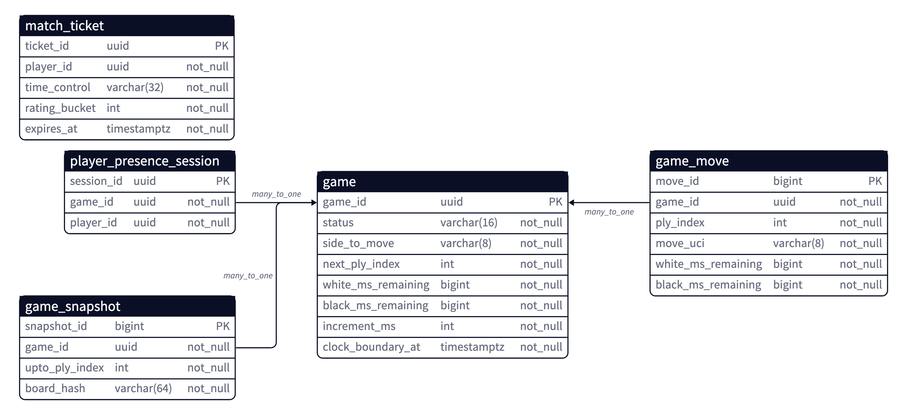
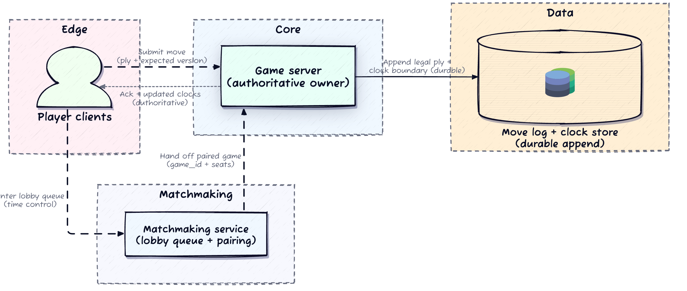
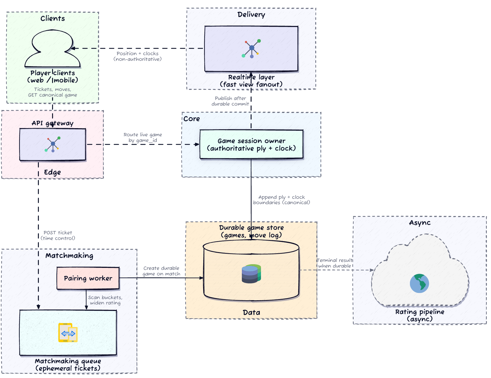
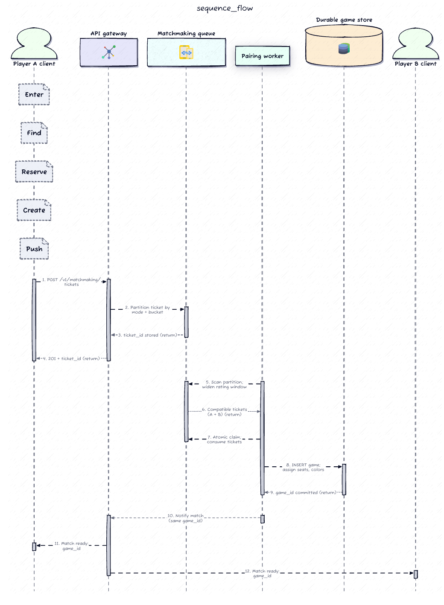
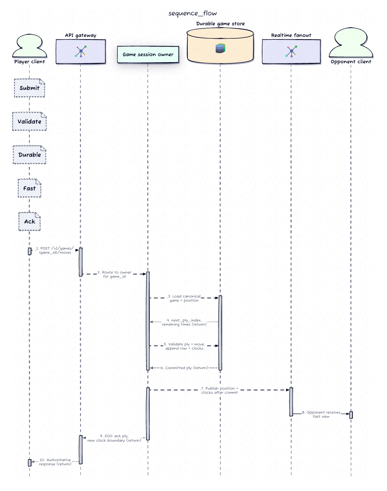
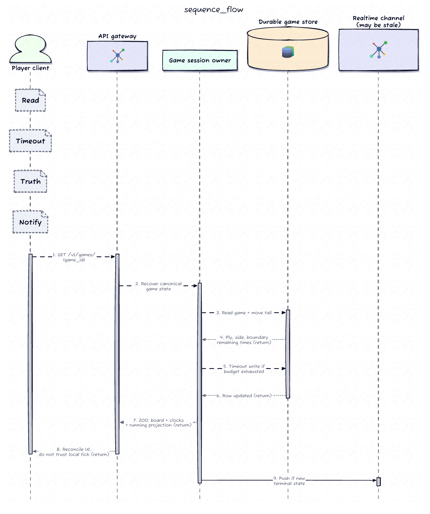
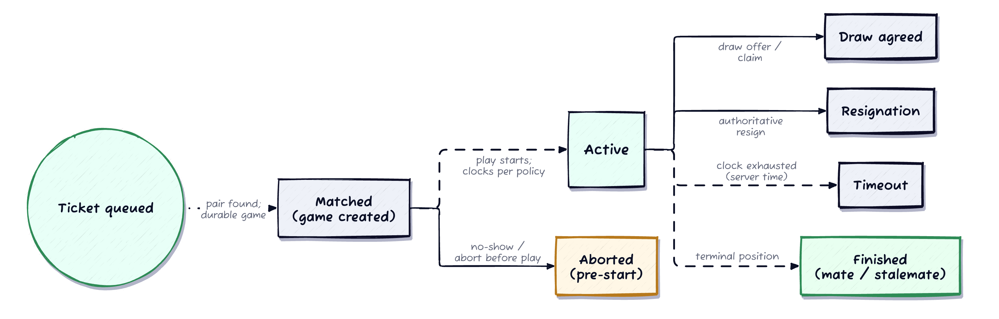

# Design an Online Chess Game (chess.com-style)

## 1. Requirements

### Clarifying questions (and the assumptions they lock in)

| Question | Answer | Assumption locked in |
|---|---|---|
| Single time control, or bullet/blitz/classical? Increment? | Multiple (3+2, 5+0, 10+0). Increment required. | **Matchmaking queues partitioned by time-control label.** Clock model applies a configurable bonus per committed ply, not just a decrement. |
| Rated + casual? Spectators/tournaments/puzzles? | Rated + casual head-to-head in scope. Rest out of scope. | Rating update runs **after** the result is durable, **off** the live move path. |
| Can a retried move commit the same ply twice? | **At most one commit per ply, always.** | Every move carries a **ply/version identifier**; server rejects anything that isn't the expected next ply. |
| Do clients report their own remaining time? | **Server owns remaining time entirely.** Client clocks ignored for legal purposes. | Remaining time stored durably at each boundary, derived from **server timestamps**. Reconnect can't inflate a clock. |
| Widen rating range over time? Max wait? | Yes, widen gradually. A few minutes max in normal conditions. | Queue entries carry a **timestamp**; each partition runs its own widening policy. |
| Disconnect near flag-fall — adjudicate or wait? | **Adjudicate a timeout loss on server time.** Don't wait indefinitely. | Timeout = last committed boundary + server-wall-clock elapsed, **independent of any live socket**. Server schedules the expiry check itself. |

### Functional Requirements (top priorities in bold)

- **Players choose a supported time control and enter/leave a matchmaking queue for that mode.**
- **The system pairs two compatible players, creates a game, assigns colors, and drops both into the same live session.**
- **Players submit moves; the server validates turn order and legality before accepting the next ply.**
- Each game tracks authoritative per-player remaining time, applies increment when configured, and ends on timeout.
- Players can reconnect to an active game, recover canonical board + clock state, and finish with a durable result that feeds downstream rating.

### Non-functional Requirements (quantified)

- **Consistency over availability for the game record** — the server is authoritative for outcome, move order, board state, and clock. *(CAP: this is the strong-consistency half. Matchmaking is the AP-leaning half.)*
- **Exactly-one next ply** — no game commits two different moves for the same ply index.
- **Availability** — 99.95% for matchmaking, move submission, canonical reads within a healthy region.
- **Latency** — p95 < 250 ms matchmaking (healthy pool); p95 < 150 ms move ack (in-region); p95 < 1 s opponent-visible update after commit.
- **Durability** — once a move or terminal result is acknowledged, move order, boundary clocks, and final result survive crash/failover.
- **Clock integrity** — server-owned remaining time is monotonic non-increasing across boundaries (except rules-based increment); never grows from retries or reconnects. Client countdown is cosmetic only.

### Capacity anchors (order-of-magnitude, used only where they change a decision)

| Quantity | Value | What it justifies |
|---|---|---|
| Daily active players | ~3M | Fleet sizing |
| Concurrent live games | ~150k peak | Game-room sharding + websocket fanout |
| Queue entries | ~5k/s peak | Ephemeral ticket store + pairing workers |
| Move submissions | ~20k/s peak | Authoritative game-worker throughput + durable move-log writes |
| Avg game length | 60–100 plies | Move-log growth + snapshot cadence |

> **The one number that shapes the design:** 20k/s moves across ~150k games is **~0.13 moves/sec per game**. Chess is *low throughput per game*. That's exactly why **one writer per game** is affordable — serialization is the point, and per-game contention is trivial. It also justifies splitting ephemeral matchmaking tickets from the durable game store: they have opposite access patterns.

---

## 2. Core Entities



- **MatchTicket** — a short-lived *intent to play*, keyed by (time control, rating bucket). Can expire, be replaced, or be discarded on pairing failure. **Not** post-match truth.
- **Game** — the durable anchor: participants, seats/colors, active turn, committed remaining times at the last boundary, increment config, lifecycle status.
- **GameMove** — append-only per game, ordered by ply. The spine of canonical state.
- **GameSnapshot** *(optional)* — a derived cache every N plies so reconnect doesn't replay from ply 1. If it disagrees with the log, **the log wins**.
- **PresenceSession** — maps a participant to a delivery channel. Ephemeral. Never the sole owner of clock or legality.

> **Storage mapping.** Tickets → an ephemeral store with range/bucket scans + TTL (Redis, or a partitioned in-memory queue). Games + moves → relational or log-backed storage with **strong ordering on append**. *Don't* force pairing traffic through the same OLTP tables that serialize live plies unless you've measured that one DB is worth it for operational simplicity. And never let authoritative clock truth live only in websocket memory.

---

## 3. API / System Interface

REST over HTTPS for commit/recovery; WebSocket for realtime *feel*. The guiding split: **realtime is the fast view; `GET /v1/games/{id}` is the truth when the story breaks.**

**Contract principles**
- **Auth** — every action scoped to an authenticated identity; game actions check membership in *that* game. Identity comes from the token, never the body.
- **Idempotency** — move submission carries an expected ply/version so duplicate POSTs can't commit two different next moves.
- **Authoritative clocks** — server computes elapsed/remaining at boundaries. Clients never send remaining time as truth.
- **Recovery** — `GET /v1/games/{id}` is the canonical read after reconnect. Streams are acceleration, not legal proof.

**Matchmaking**
```
POST   /v1/matchmaking/tickets            → { ticket_id }   body: { time_control, rated, seed? }
DELETE /v1/matchmaking/tickets/{ticket_id}                 (safe to retry)
```

**Gameplay**
```
GET  /v1/games/{game_id}                  → canonical snapshot: participants+seats, side_to_move,
                                            committed remaining times, increment rules, terminal status,
                                            compact position (or pointers to recent plies)   ← recovery truth boundary

POST /v1/games/{game_id}/moves            body: { move, expected_ply_index }
                                          → { acked_ply, new_remaining_times, next_side_to_move }
                                            server validates legality + turn order in the session owner
```

**Terminal + catch-up**
```
POST /v1/games/{game_id}/resign           → durable loss for caller
POST /v1/games/{game_id}/draw-offers      → records draw intent (authoritative, not cosmetic)
GET  /v1/games/{game_id}/events?since=    → bounded backlog for resync (still repairable via GET)
```

---

## 5. High-Level Design

**The tempting wrong first pass:** both players in a websocket room, local timers ticking for drama, first-move-to-arrive wins the ply. It demos beautifully. Then reconnects, duplicate POSTs, and lag produce two different boards and two different clocks. Keep that failure mode in view.

**The trust model:** the game should *feel* as instant as two humans at one board, but only the server is trusted for who got matched, which move legally happened, and whose clock actually ran.

### Minimum architecture

A **matchmaking service** accepts queue entries keyed by (time control, rating), finds a compatible pair, and hands a freshly created game record to a **game server**. From that moment the game server is the single authority: it validates every move for legality + turn order, appends each legal ply to a durable move log, and at each boundary deducts elapsed *server* time from the active player's budget, then writes the result back durably.




*The teaching point is authority:* the client can't be trusted to report remaining time, decide legality, or enforce turn order. The server owns all three, and backs every decision with a durable record so any future reader can replay to the same state.

**Three gaps appear under stress:**
1. **Crash mid-game** → the move log must be replayable so a replacement server reconstructs canonical board + clock without trusting disconnected clients.
2. **Reconnect** → the server must buffer/reconcile pending moves, not silently drop them (the client may be retrying something already accepted).
3. **Spectator fanout** → routing observers through the move-processing loop lets observer traffic delay the authoritative commit path.

### Production architecture

Two linked halves: **matchmaking stays cheap and ephemeral** (tickets scan inside time-control + rating buckets until a pair can *reserve* a new game), and **live play routes each active game through one authoritative session owner** that serializes validation, clock boundaries, and durable append order. **Realtime fanout sits *after* the commit boundary as a fast mirror — not the legal record.**




### Flow 1 — Enter queue, widen search, create a durable game



Player posts a ticket → matchmaking stores it under the right (mode, rating) partition, starts a wait timer, widens the band as time passes → a pairing worker finds a compatible ticket in the **same** partition → it creates **exactly one** durable game row, assigns seats/colors, attaches both players to `game_id` → tickets flip to consumed/cancelled so the same player can't spawn a second game without a fresh ticket. *Queue stays ephemeral; the game becomes the source of truth.*

### Flow 2 — Join the live session and start clock ownership
Both clients get a match notification with `game_id` and open a realtime channel scoped to it. Presence attaches to ephemeral session rows for delivery; canonical membership/seats come from the durable game row. The session owner loads the committed boundary and decides when the clock runs. **Clock start is a server decision tied to committed state, not to whichever client animated first** — keep the game `matched-but-not-active` until both join (or a grace window), then flip to `active` and start the first running clock. If only one connects before the grace window ends, write an **abort / no-show** outcome rather than pretending a timed game ran.

### Flow 3 — Submit a move, validate, commit the boundary



Client sends the move with an expected ply/version → session owner **rejects stale work**, validates legality against the canonical position, computes elapsed server time since the last boundary, subtracts it, **applies increment if configured**, appends one `game_move`, updates the game row (new side to move, new committed clocks). **Only after the durable step succeeds** does it broadcast the new position + clock snapshot. Duplicate requests at the same ply replay the same outcome or fail closed — they never invent a second next move.

---

## 6. Deep Dives

Depth goes to **matchmaking reservation, move-commit races, and clock truth** — the three places where chess stops being "a chat room with pictures." Generic websocket tuning and a laundry list of caches are deliberately skipped.

### 6.1 Matchmaking: widening buckets + safe game reservation

Tickets are ephemeral queue entries keyed by (time control, rating-bucket slice). The system needs fast compatible-opponent lookups without scanning the world each tick. **Widen the rating window as wait grows** so patient players expand their pool while impatient players still match instantly under high density. **Expiry** removes stale tickets so a worker never pairs someone who left.

**Duplicate presence** is a real hazard: a player taps queue on mobile + desktop, or retries after a timeout while the first ticket lives. Two identities in one pool = one human occupying multiple candidate slots = double-matching under load. **Enforce one live ticket per player per queue mode** via idempotent create or replace-on-write keyed by (player, time control).

**The risky moment is reservation.** Two workers might touch the same candidate simultaneously. You need an **atomic claim on the pair of tickets**, or a **single-threaded partition owner per bucket slice**, so you cannot create two games for the same waiting identity. Game creation must be **idempotent relative to ticket identity**. If creation fails after pairing, either roll back ticket consumption or recover under a clear policy — never strand a player with no game *and* no queue slot.

> *The queue is allowed to be clever and loss-tolerant. The game row is not.* This is the AP/CP split from the requirements made concrete.

### 6.2 Authoritative move commit: exactly one next ply

Chess is low throughput but ruthless about ordering. **The session owner is the single writer for a live game.** Clients optimistically render; the server decides the next committed ply.

Each move carries an expected `ply_index`/version. The owner loads authoritative state, rejects work that doesn't match the expected next ply, validates legality against the canonical position, then commits **one** append. Duplicate submissions for the same intent return the **same** acknowledged outcome; conflicting attempts lose cleanly without corrupting the log.

**The durable write order is the real serialization point.** If you ack before durability, you can still recover — but you must reconcile carefully on failover. The conservative answer ties acknowledgement to the durable append (or a replicated log offset you treat as committed).

A compact conditional-append shape — the idea is *conditional write on the next ply*:

```sql
INSERT INTO game_move (game_id, ply_index, move, white_ms_remaining, black_ms_remaining)
SELECT $1, $2, $3, $4, $5
WHERE EXISTS (
  SELECT 1 FROM games g
  WHERE g.game_id = $1
    AND g.next_ply_index = $2      -- reject stale / wrong ply
    AND g.status = 'active'
    AND g.side_to_move = $6         -- reject wrong side
)
RETURNING move_id;
```

If nothing inserts, the API returns **409 Conflict** so the client refetches canonical state instead of guessing.

> **How to say it in the interview:** *"One writer per game, a versioned next ply, and a durable append before I treat a move as real. Retries then replay safely instead of forking the game."*

**Sequence — move commit under a duplicate retry:**

```
Client            Session Owner            Move Log / game row        Fanout
  │  POST move           │                        │                     │
  │  (expected_ply=7) ──▶│                        │                     │
  │                      │ load state, ply==7 ✓   │                     │
  │                      │ legal ✓, elapsed calc  │                     │
  │                      │ conditional append ───▶│ insert ply 7 ✓      │
  │                      │                        │ next_ply_index→8    │
  │                      │◀── committed ──────────│                     │
  │◀── 200 {ply 7} ──────│                        │  broadcast ply 7 ──▶│
  │                      │                        │                     │
  │  (retry, network) ──▶│ load state, ply==7?    │                     │
  │  (expected_ply=7)    │ but next is 8 → stale  │                     │
  │◀── 409 Conflict ─────│ (no second append)     │                     │
  │  GET /games/{id} ───▶│ canonical repair       │                     │
```

### 6.3 Clock truth: increment, timeout, reconnect, failover

The board is cheap to mirror; **the clock is the distributed-systems problem in disguise.** The server stores committed remaining time at boundaries and derives the running clock between boundaries from **server time + the active turn owner**. Client animation is a *projection*, not a second source of truth.

At each committed move: subtract elapsed time for the mover since the previous boundary, then add increment after the move if configured. Delay-style controls add time only at certain boundaries — a product rule encoded in the same boundary machinery. **Remaining time is monotonic non-increasing across boundaries except where rules explicitly add time.** Reconnect never "refunds" seconds because the UI missed frames.

**Time source, in one precise sentence:** the session owner uses a **monotonic server clock** to measure elapsed time while it owns the game, then persists the boundary state durably. On failover the new owner reconstructs from the **last committed boundary + current server time** rather than trusting an old in-memory ticker. That keeps the clock monotonic across restarts and prevents two owners from extending the same budget during a split-brain moment.

**Timeout** compares authoritative remaining time for the player on the clock against elapsed server time since their clock started running. Because it's derived from durable state + server wall clock, the owner can **schedule the expiry check itself** and fire a terminal result with **no live socket** from either side. If recovery happens near zero, the server picks a single winner without letting late arrivals extend the budget.

> **The aha, in one line:** *store remaining time at authoritative move boundaries and derive the running clock from server time instead of trusting ticking clients.*

**Sequence — reconnect / owner failover restores board + clock honestly:**



**Lifecycle state machine** (answers "which states exist before the clock starts, and which terminal outcomes are legal once active"):



That split is the whole design: **the UI can feel realtime because authoritative clock truth only changes at server-owned boundaries.**

---

## 7. Other Considerations

- **Abort / no-show before the game truly starts.** Distinguish *matched-but-not-active* from *active-with-clock-running* durably. Pre-start timeouts return players to queue or mark a controlled forfeit without pretending full clock rules ran. Keep tickets and game rows aligned — cancelling a game releases any reservation blocking rematchmaking.
- **Rating / rematch / tournament handoff.** Rating runs async once the result is durable; the live path finishes with a clear terminal outcome, then enqueues downstream work. Rematch = a new ticket. Tournament pairing is a *different scheduler* with stronger invariants — an explicit scope expansion, not a footnote.
- **Spectator fanout vs. player-critical delivery.** Answer with *policy + SLA*, not a second realtime system. Player moves/clocks need low latency + correctness; public observation can lag, shed load, or read cached projections — as long as it never starves the authoritative commit path.
- **Fair-play / anti-cheat.** Not on the hot path. Capture signals (move-timing distributions, device telemetry) asynchronously; keep adjudication out of the ply commit unless scope is explicitly expanded.

---

## Real-World Anchor

- **Lichess / chess.com** run exactly this split: an authoritative game actor per live game (Lichess famously models each game as a single Akka actor — one writer, serialized moves) with clocks computed server-side from monotonic time, while the browser's countdown is cosmetic. Reconnection re-reads canonical state rather than trusting the client.
- **Discord's** gateway (Bytebytego case study) shows the same shape at fanout scale: a stateful session owns the source of truth and pushes updates *after* commit, while the realtime layer is a fast mirror — never the ledger. The chess "fanout after the boundary" rule is the same principle.
- **Bytebytego realtime patterns** consistently separate the *commit path* (correctness, durable, serialized) from the *delivery path* (best-effort, low-latency) — the through-line of this entire design.

## DDIA anchors

- **Ch. 5 (Replication)** — single-leader-per-game is the cleanest model for the "exactly one next ply" invariant; failover reconstructs from the replicated log, not client memory.
- **Ch. 7 (Transactions)** — the conditional append is a compare-and-set on `next_ply_index`; acknowledging only after the durable append is the isolation/atomicity guarantee that prevents forked games.
- **Ch. 8 (Trouble with Distributed Systems)** — *why we never trust client clocks*: unreliable clocks and network delay are precisely why the server uses a **monotonic** clock and derives time from committed boundaries. Split-brain during failover is the "two owners extend the same budget" hazard.
- **Ch. 11 (Stream Processing)** — the move log is an append-only event log; rating updates are a downstream consumer of durable terminal events (decoupled, async).
- **Ch. 12 (End-to-End Argument)** — correctness lives at the authoritative session owner + durable log; realtime fanout is an optimization layered on top, and `GET /games/{id}` is the end-to-end repair path.

---

## 🔍 Senior-Signal Questions to Ask in Your Interview

- **"Do we acknowledge a move on local durable append, or only after the replicated log offset is committed?"** → *Why it matters: exposes whether you understand the reconciliation cost on failover — acking pre-replication trades latency for a harder recovery story.*
- **"How do we prevent split-brain from extending a player's clock — is session ownership fenced?"** → *Why it matters: signals you know a lease/fencing-token mechanism is needed so a zombie old owner can't keep committing boundaries after a new owner takes over.*
- **"What's the reservation primitive for pairing — an atomic two-ticket claim, or a single-threaded partition owner per bucket?"** → *Why it matters: shows you see that "one match → exactly one game" is a concurrency-control problem, not a happy-path detail.*
- **"How does the widening policy interact with hot vs. cold rating buckets — do we risk starving mid-rating players when the tails are dense?"** → *Why it matters: surfaces hot-spot / fairness reasoning in matchmaking, a classic senior probe.*
- **"For timeout with no connected client, who schedules the expiry check and what happens if that scheduler itself fails over near flag-fall?"** → *Why it matters: tests whether your "server adjudicates on server time" claim survives the failure of the very component that fires it.*
