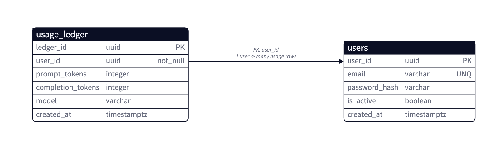
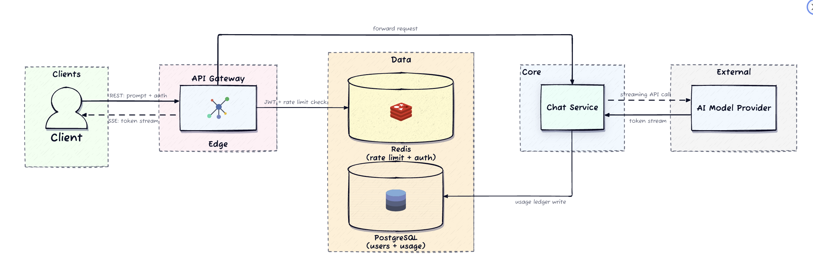
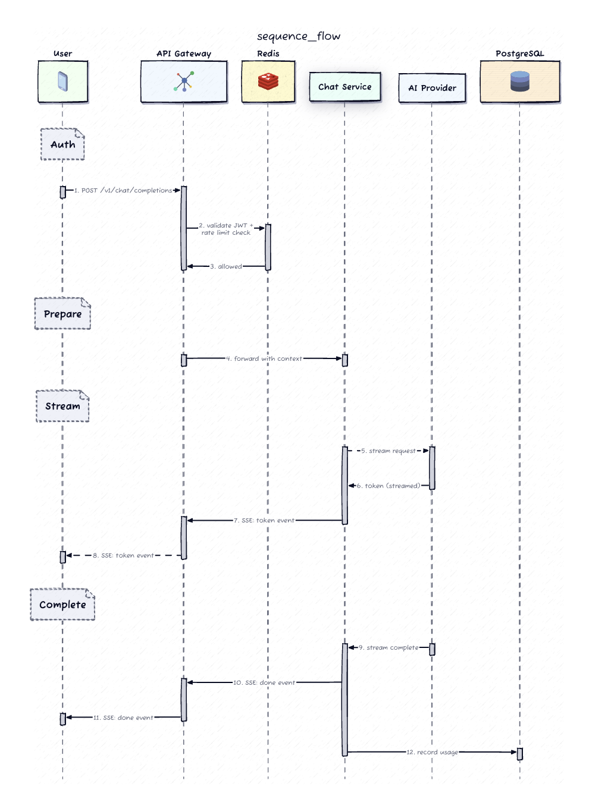
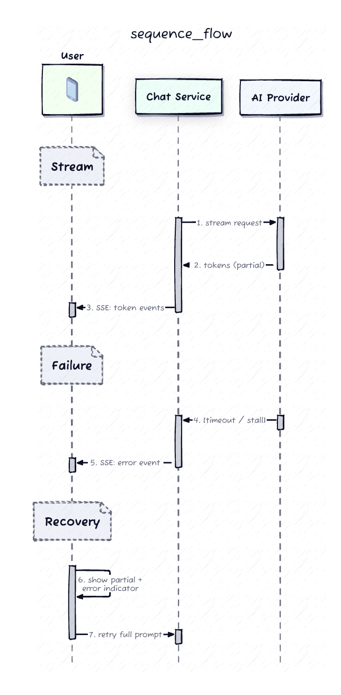
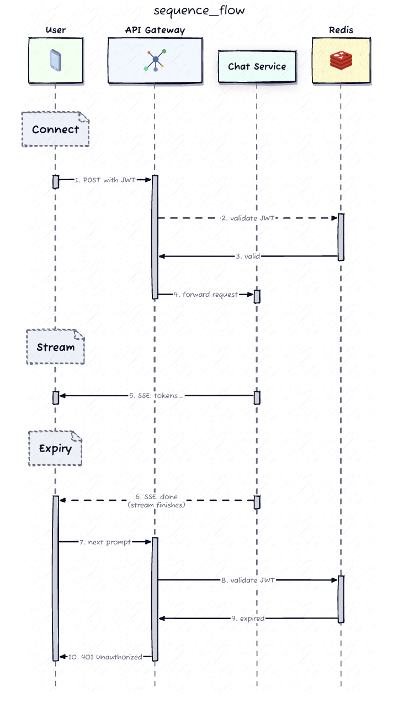
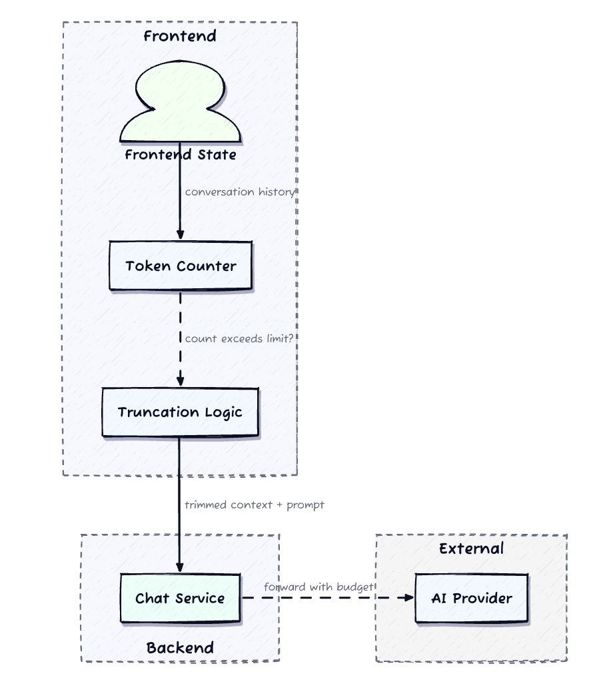

# Design an AI Chatbot App (ChatGPT / Claude-style Streaming Backend)

---

## 1. Requirements (~5 min)

### Clarifying Questions (the scoping move)

| Question I ask | Answer | What it removes from scope |
|---|---|---|
| Are conversations persisted server-side, or client-owned? | Entirely client-owned; refresh resets everything | Kills the entire message/conversation data model |
| What's acceptable TTFT? | **< 500 ms p95**, continuous thereafter | Forbids any heavy synchronous work pre-stream |
| Does the client send full history each turn? | Yes — backend keeps no session context | Context assembly + truncation move to the client |
| Peak concurrent streams? | **~50K concurrent SSE connections**, bursty | Forces a horizontally scaled long-lived-connection fleet |
| Upstream model stalls mid-stream? | Surface partial text + explicit error, manual retry | Requires a structured error event, not a silent hang |
| JWT expires mid-stream? | Let the stream finish; fresh auth for the *next* prompt | Auth is a **connection-time** concern, not per-token |

**The single highest-leverage question is the first one.** Persistence vs. ephemerality changes the data model, the recovery story, and whether this is a chat *platform* or a streaming *proxy*. Answer it in the first 60 seconds.

### Functional Requirements (top 3, prioritized)

1. **Authenticated users submit a text prompt and receive the model response streamed token-by-token in real time.**
2. **The backend relays prompt → upstream LLM → SSE token events**, with a typing indicator and a well-defined terminal event.
3. **Multi-turn context is carried by the client** — prior turns are attached to each new prompt.

*Below the line:* login/refresh/logout (standard REST), usage accounting.

**Out of scope:** message persistence, server-side resume, multi-model routing, images/audio, sharing/export.

### Non-Functional Requirements (quantified)

| Requirement | Target | Why it drives design |
|---|---|---|
| **Latency (TTFT)** | < 500 ms p95 | Nothing heavy on the pre-stream critical path — this is why there's no queue |
| **Concurrency** | 50K concurrent SSE streams, bursty | Connection fleet sizing, LB idle-timeout config, heartbeats |
| **Availability** | 99.9% on the streaming path, graceful degradation | Circuit breaker on the upstream provider |
| **Cost control** | Per-user prompt rate limit + cumulative token budget | Every request has a real dollar cost — this is a *business* NFR |
| **Security** | JWT on every endpoint including long-lived SSE | Grace-period policy for mid-stream expiry |

**Consistency posture:** this is an **AP system with a small CP island.** Streaming is availability-first — a dropped token stream is recoverable by retry. Identity and the billing ledger are the CP island, in Postgres.

### Capacity Estimation — only where it changes a decision

Two numbers matter, and both change a design decision:

- **50K concurrent × 15–30s average hold time.** No single node holds 50K long-lived connections comfortably at typical per-connection memory + file-descriptor budgets, so a **horizontally scaled fleet behind a connection-aware LB** is forced, not chosen. The 15–30s duration is also *long enough to straddle JWT expiry* — which is precisely why the grace-period deep dive exists.
- **~1.5M tokens/min at peak** (50K streams × ~500 tokens / ~30s). At external-provider pricing this is the dominant cost line in the entire system, which is why rate limiting is a *functional* concern and not an afterthought.

Everything else (QPS, storage) I'd skip — computing it just to conclude "it's a lot" burns interview time.

---

## 2. Core Entities (~2 min)



The striking thing about this list is what's absent — there is **no `Message` and no `Conversation` entity server-side.**

- **User** — identity + credentials. Durable (Postgres).
- **UsageLedgerEntry** — `(user_id, prompt_tokens, completion_tokens, model, created_at)`. Durable, append-only. Billing truth.
- **RateLimitCounter** — per-user sliding window. Ephemeral (Redis, TTL).
- **RevokedToken** — JWT `jti` blacklist. Ephemeral (Redis, TTL = remaining token lifetime).
- **Stream** — an in-flight, in-memory relay between one client and one upstream call. **Never persisted.** Its lifetime *is* the request.


`usage_ledger` is **append-only** — no updates, no deletes. *DDIA Ch. 11* on event streams: an append-only log of facts is both the cheapest write pattern and the most auditable. Billing disputes are resolved by replaying the log, not by trusting a mutable counter.

The `(user_id, created_at DESC)` index serves both access patterns: the period aggregate for budget enforcement, and the reverse-chronological usage history query.


---

## 3. API / System Interface (~5 min)

Two protocols: **REST for mutations, SSE for the response stream.**

### The core endpoint

```http
POST /v1/chat/completions
Authorization: Bearer <jwt>
Content-Type: application/json
Accept: text/event-stream

{
  "messages": [
    { "role": "system",    "content": "You are a helpful assistant." },
    { "role": "user",      "content": "Explain backpressure in streaming systems." },
    { "role": "assistant", "content": "Backpressure is..." },
    { "role": "user",      "content": "How does that apply to SSE?" }
  ],
  "max_tokens": 1024
}
```

**Note what's missing: no `user_id`.** Identity is derived from the JWT, never from the body. `messages` carries the entire client-owned history — the request payload grows linearly with conversation length, which is what makes context budgeting a first-class deep dive rather than a footnote.

The response is `Content-Type: text/event-stream` on the **same connection**. Note the deliberate asymmetry: the client opens with POST via `fetch()` streaming rather than `EventSource`, because `EventSource` only issues GET requests and can't carry a body or custom `Authorization` header. This is a real, commonly-missed implementation detail.

### SSE event contract

| Event | Payload | Client behavior |
|---|---|---|
| `token` | `{"content": "..."}` | Append to the in-progress message |
| `done` | `{"finish_reason":"stop","usage":{...}}` | Finalize message, re-enable input |
| `error` | `{"code":"upstream_timeout","message":"..."}` | Keep partial text, show retry affordance |
| `heartbeat` | *(empty)* | No-op — exists only to defeat proxy idle timeouts |

```
event: token
data: {"content": "SSE applies"}

event: token
data: {"content": " backpressure at the"}

event: done
data: {"finish_reason": "stop", "usage": {"prompt_tokens": 84, "completion_tokens": 127}}
```

**Why SSE over WebSocket:** the data flow during generation is strictly **server → client, unidirectional**. WebSocket buys full duplex we don't need, at the cost of a protocol upgrade that many corporate proxies, CDNs, and L7 load balancers handle poorly. SSE is plain HTTP — it inherits the entire existing HTTP infrastructure, including compression, HTTP/2 multiplexing, and standard observability. *This is the correctness-of-fit argument: choose the protocol that matches the data flow shape, not the most capable one.*

### Auth endpoints (kept deliberately brief)

- `POST /v1/auth/login` → `{ access_token (short-lived JWT), refresh_token }`
- `POST /v1/auth/refresh` → new access token
- `POST /v1/auth/logout` → writes `jti` to the Redis blacklist

### Recovery contract

**There is no server-side resume.** A stateless backend holds no stream offset to resume from. The client displays whatever partial text arrived, and retry re-sends the full context as a fresh POST. The client decides whether to include the partial assistant turn (continue from where it stopped) or drop it (fresh attempt) — **the recovery decision belongs to whoever owns the state, and that's the client.**

---

## 4. High-Level Design (~10–15 min)

### The naive version, and why it breaks


The obvious starting point: a thin proxy that pipes the provider's SSE straight through to a React `useState`. For a demo it works. It breaks in production three ways:

1. **No auth on the stream** — anyone with the URL burns your token budget.
2. **No stall detection** — when the upstream hangs, the user gets a frozen cursor forever, and the connection leaks.
3. **Unbounded context growth** — by turn 40, the request exceeds the model's context window and produces truncated or incoherent output.

The production design is that pipe **plus four layers of protection**.

### Architecture




### Walking the request path

1. **Browser** assembles context from local state, token-counts it against the window budget, POSTs to the gateway.
2. **API Gateway** verifies the JWT signature, checks `blacklist:{jti}` in Redis, and `INCR`s the sliding-window rate-limit key. Any failure returns immediately — **rejected traffic never reaches the expensive path.** This is the whole point of putting these checks at the edge.
3. **Chat Service** checks cumulative usage against budget (Redis-cached, Postgres-authoritative), applies the system prompt, opens the upstream stream.
4. **Relay loop:** each upstream chunk becomes an SSE `token` event. A per-token inactivity timer runs alongside.
5. **Termination:** `done` + usage metadata, then an **async** append to `usage_ledger`. Async matters — a ledger write must never sit on the critical path of closing the user's stream.




### Why there is no message queue

The instinct to drop Kafka between gateway and chat service is wrong here, and articulating *why* is a senior signal:

- **The work cannot be deferred.** A queue is valuable when a producer can hand off and walk away. Here the producer *is* the user, holding an open connection, waiting. Queueing adds latency to the exact metric we're optimizing (TTFT p95 < 500 ms) with zero decoupling benefit.
- **Backpressure has a better answer.** If the fleet is saturated, the correct response is **shed load with a 503**, not accumulate a queue of requests whose clients will have timed out by the time they're serviced. A queue here converts a fast failure into a slow one.
- **When a queue *would* earn its place:** async post-processing — audit logging, analytics pipelines, offline moderation review. Those go on a queue *downstream of the completed stream*, off the hot path entirely.

---

## 5. Deep Dives (~10 min)

### Deep Dive 1 — Mid-stream failure and the recovery contract

The stream sits on **two independently unreliable layers**: the upstream model (stall, timeout, error mid-generation) and the client network (mobile handoff, sleep, tab close).

Upstream, the service must distinguish three states, and conflating them is the classic mistake:

| State | Signal | Response |
|---|---|---|
| Healthy | Tokens arriving | Relay |
| Slow but alive | No token for > 30s | Emit `heartbeat` — keep the connection warm |
| Dead | No token for > 60s | Emit `error`, close, log, release the slot |



**The key insight:** because the backend holds no stream offset, **there is nothing to resume from — and that's fine.** Resume would require checkpointing generated tokens server-side, which reintroduces exactly the state we deliberately eliminated. The client already has the partial text in memory; it is the only component positioned to make the resume-vs-restart decision. *Ownership of state and ownership of recovery must sit in the same place.*

**Abandonment matters for cost.** If the client disconnects, the chat service must detect the closed socket and **abort the upstream call immediately**. Otherwise you keep paying for tokens no one will ever read. This is a live cost leak in naive implementations.

### Deep Dive 2 — Auth across a long-lived stream



A 15-minute JWT and a 30-second stream that starts at minute 14:50 is a guaranteed collision at scale.

**Policy: validate once at connection time; grant a grace period for the life of the stream.**

The reasoning is that the security benefit of mid-stream termination is essentially zero — the user *was* authenticated at initiation, and **the model call has already been paid for**. Killing the stream mid-sentence destroys UX and wastes money that's already spent. Expiry becomes the *next* prompt's problem, where the client refreshes before submitting.

**Logout is the deliberate exception in the other direction.** It writes `jti` to the Redis blacklist with TTL = remaining token lifetime, so every *new* request is rejected at the gateway immediately. The in-flight stream still completes.

Worth naming the trade-off explicitly: **this is a revocation window.** A compromised token can, at worst, finish one already-initiated stream. Bounded by `max_tokens` and the inactivity timeout — a few seconds of exposure, capped in dollars. If the threat model demanded zero-window revocation, you'd re-check the blacklist on a periodic timer inside the relay loop and accept the mid-sentence kill. **The right answer depends on the threat model, and saying so is the senior move** — asserting one policy as universally correct is the junior move.

*DDIA Ch. 8* on unreliable clocks is directly relevant: JWT expiry is a wall-clock assertion evaluated on a machine whose clock may skew from the issuer's. Tight expiry windows amplify skew sensitivity — another argument for validating at a single point rather than continuously.

### Deep Dive 3 — Context window budgeting and truncation



Every prompt ships the full history. By turn 20 that's thousands of tokens; eventually it exceeds the model's window.

The budget partitions into four regions that must sum under the window:

```
[ system prompt ~200–500 ]  [ history (grows) ]  [ new prompt ]  [ reserved response = max_tokens ]
└─────────────────────── must be ≤ context window (e.g. 128K) ───────────────────────┘
```

**Truncation strategies:**

| Strategy | Mechanism | Trade-off |
|---|---|---|
| **Sliding window** | Drop oldest turns, pin the system prompt | Cheap, zero added latency; silently loses early facts |
| **Summarize-and-compact** | Collapse old turns into a condensed block | Preserves facts; costs an extra model call + latency |
| **Hybrid** | Recent turns verbatim + summary of the rest | Best quality; most complexity |

Counting happens **client-side**, using a tokenizer matching the model's. This is what keeps the backend stateless — the client has the history, so the client does the arithmetic.

**The honest weakness in this design, which I'd volunteer:** the client tokenizer must track the provider's tokenizer, and providers change tokenizers on model updates. A stale client then miscounts and sends over-budget requests. **The mitigation is a cheap backend validation step** that rejects over-budget requests with a structured error before the expensive upstream call. Note the shape of this: the backend stays stateless (it validates the *request payload*, not stored history) while still guarding the cost boundary. Statelessness didn't have to be sacrificed to fix it.

Cost reinforces the same decision from another direction: 10K tokens of context per prompt costs 10× what 1K does. The ledger caps *cumulative* spend; truncation strategy determines *per-request* spend. Aggressive truncation trades conversation quality for dollars — a **product** decision surfaced by an architectural constraint.

### Deep Dive 4 — Streaming moderation, the hardest structural problem here

Non-streaming APIs can review the full response before delivery. **Streaming systems have already shipped tokens by the time a violation is detectable.** You cannot un-send them.

The mitigation is a small buffer — hold 5–10 tokens before forwarding — which creates a direct, tunable dial:

- **Deeper buffer** → more context for the classifier, better detection, but **every token is delayed by the buffer depth**, degrading the perceived-typing experience.
- **Shallower buffer** → snappier, but higher chance of partial delivery before a catch.

On a flag: stop forwarding, emit `error` with a `content_filtered` code, close. The client shows the truncated text with a policy notice.

Production shape is two-tier: a **fast inline classifier** (low latency, lower accuracy) catching obvious violations in real time, plus an **async audit log** reviewing completed responses offline for the subtler cases that inform policy updates. *This is a classic Lambda-architecture split — DDIA Ch. 11 — fast-inaccurate online path plus slow-accurate batch path.*

### Deep Dive 5 — Scaling to 50K connections and degrading gracefully

| Pressure | Failure mode | Mitigation |
|---|---|---|
| LB idle timeouts (often 60s) | Connection killed mid-response | `heartbeat` every 15s |
| Fleet saturation | All streams degrade together | Bounded streams per instance; **reject new with 503** rather than degrading existing |
| Upstream provider down | Every request burns a full timeout, threads pile up | **Circuit breaker** — trip after N consecutive failures, fail fast, single probe on cooldown |
| Multi-tab abuse | One user monopolizes capacity | Redis concurrent-connection counter, INCR on open / DECR on close, **TTL as the crash safety net** |

That TTL is worth calling out: a crashed chat-service instance never runs its DECR, so without expiry the counter leaks upward and eventually locks the user out permanently. **The TTL turns a correctness-critical decrement into a self-healing one** — the same reasoning as SQS visibility timeouts.

**Streaming-specific observability**, since request/response percentiles miss the interesting failures entirely:

- **TTFT** (p50/p95/p99) — the perceived-latency metric.
- **Stream completion rate** — % reaching `done` vs. error/disconnect. A drop here is the earliest signal of upstream degradation.
- **Tokens per stream** distribution — shifts indicate model behavior changes or truncation bugs.
- **Error categorization** — `upstream_timeout` / `rate_limited` / `auth_failed` / `content_filtered` / `client_disconnect`. Without this breakdown you cannot distinguish *our* problem from *their* problem. Alert on TTFT p95 > 500 ms or completion rate < 95%; triage upstream provider latency first, then gateway queue depth and rate-limit rejection rate.

---

## Real-World Anchor

**Discord** (Bytebytego) faces the structurally identical problem at larger scale: millions of persistent connections whose *transport* must be highly available while *durable* state stays in a much smaller authoritative store. Their gateway fleet holds connections and relays events; Cassandra/ScyllaDB holds the messages. Same split as here — **connection-holding is a scaling problem, durability is a storage problem, and conflating them produces a system that scales badly at both.** The difference is that Discord must persist messages, which is exactly the requirement we clarified away in the first 60 seconds; that single answer is what lets our entire durable footprint collapse to two Postgres tables.

**Netflix's Hystrix-era circuit breaker** work is the direct ancestor of the upstream breaker here — the insight that a slow dependency is more dangerous than a dead one, because slow dependencies exhaust connection pools and cascade, while fast failures shed load cleanly.

---

## DDIA Anchors

| Chapter | Applied to |
|---|---|
| **Ch. 1** — Reliable, Scalable, Maintainable | Splitting data-intensive (identity, billing) from compute-intensive (relay) concerns |
| **Ch. 5** — Replication | Postgres read replicas for budget-check reads; why replica lag is tolerable here (budget is approximate, ledger append is authoritative) |
| **Ch. 8** — Trouble with Distributed Systems | Unreliable clocks and JWT expiry; distinguishing "slow" from "dead" — the exact stall-vs-timeout problem |
| **Ch. 9** — Consistency and Consensus | Why no consensus is needed: no shared mutable state across chat-service instances |
| **Ch. 11** — Stream Processing | Append-only `usage_ledger` as an event log; inline-vs-batch moderation as a Lambda split |

---

## 🔍 Senior-Signal Questions to Ask in Your Interview

- **"Is the token budget an efficiency limit or a correctness limit? Can a user go over budget if two streams start concurrently?"** → *Why it matters: Exposes a genuine read-modify-write race — a check-then-act on a Redis-cached aggregate is not atomic. Forces the interviewer to decide whether overshoot by one stream's worth of tokens is acceptable (efficiency lock, use Redis INCR) or whether it requires a serializable transaction against the ledger (correctness lock). Recognizing which tier a constraint belongs to is the single clearest senior signal in cost-control design.*

- **"When the client disconnects mid-stream, do we abort the upstream call — and how do we detect the disconnect?"** → *Why it matters: A live money leak most candidates miss entirely. Also probes whether they understand that TCP half-close detection on a write-only stream is genuinely non-trivial and often requires the heartbeat write to surface the broken pipe.*

- **"Should the usage ledger write be transactional with stream completion, or is at-least-once fine?"** → *Why it matters: Surfaces the classic dual-write problem. If the stream closes and the instance dies before the ledger append, the user got free tokens. Naming the transactional outbox pattern as the fix — and then arguing it's over-engineering for a bounded, small dollar amount — shows both knowledge and judgment about when not to apply it.*

- **"What's our revocation window for a compromised token, and is that acceptable to security?"** → *Why it matters: Turns the grace-period policy from an assertion into a quantified trade-off. The answer ("one in-flight stream, bounded by max_tokens and the inactivity timeout") demonstrates threat-model reasoning rather than reciting a best practice.*

- **"Does the moderation buffer apply uniformly, or do we tune depth by user trust tier?"** → *Why it matters: Reframes a fixed latency cost as a policy dimension. Shows awareness that safety controls have measurable UX cost and that uniform application is a choice, not a default.*

- **"At 50K connections, do we shard the chat-service fleet by user, or is it fully stateless round-robin?"** → *Why it matters: The correct answer is round-robin — nothing is sticky because nothing is stored. Getting this right proves the statelessness claim was understood structurally, not just recited. It's a trap question: reaching for sharding here reveals the candidate didn't internalize why the design is stateless.*