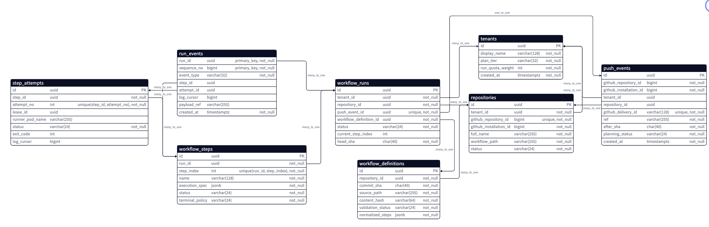
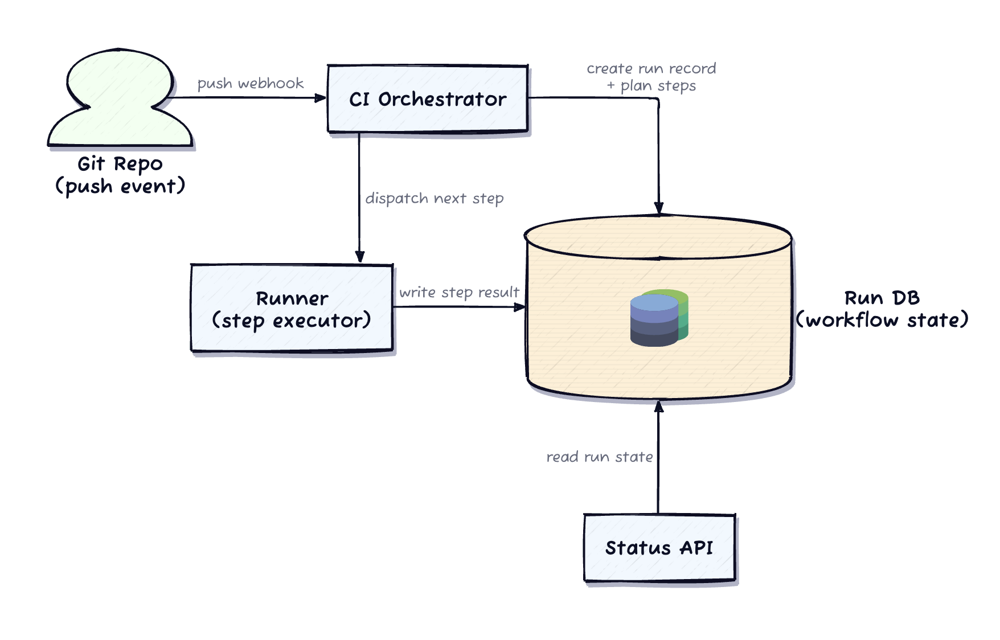
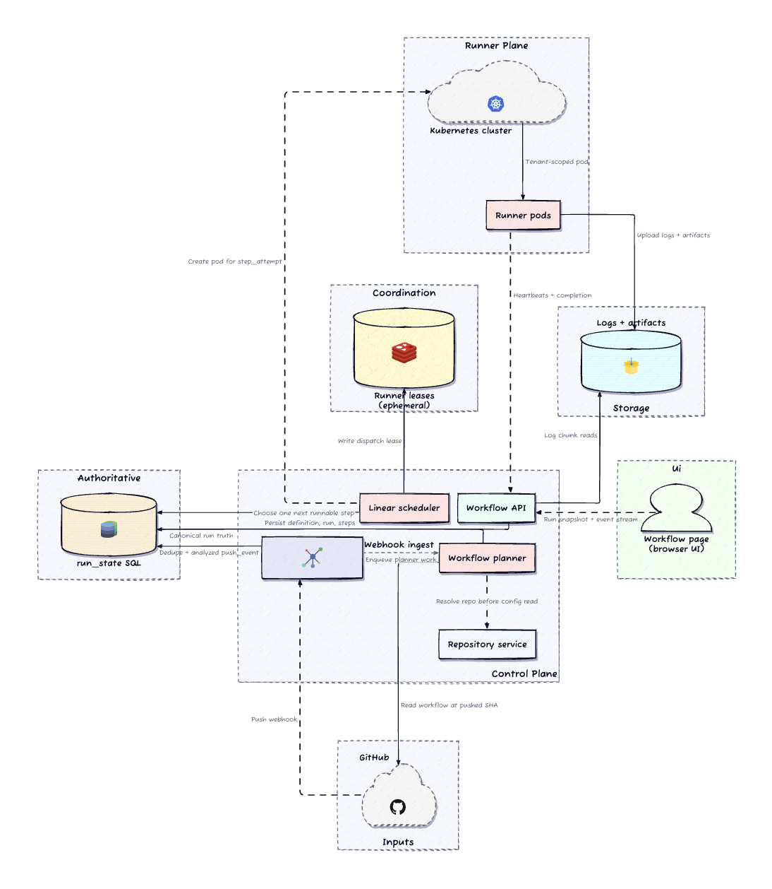
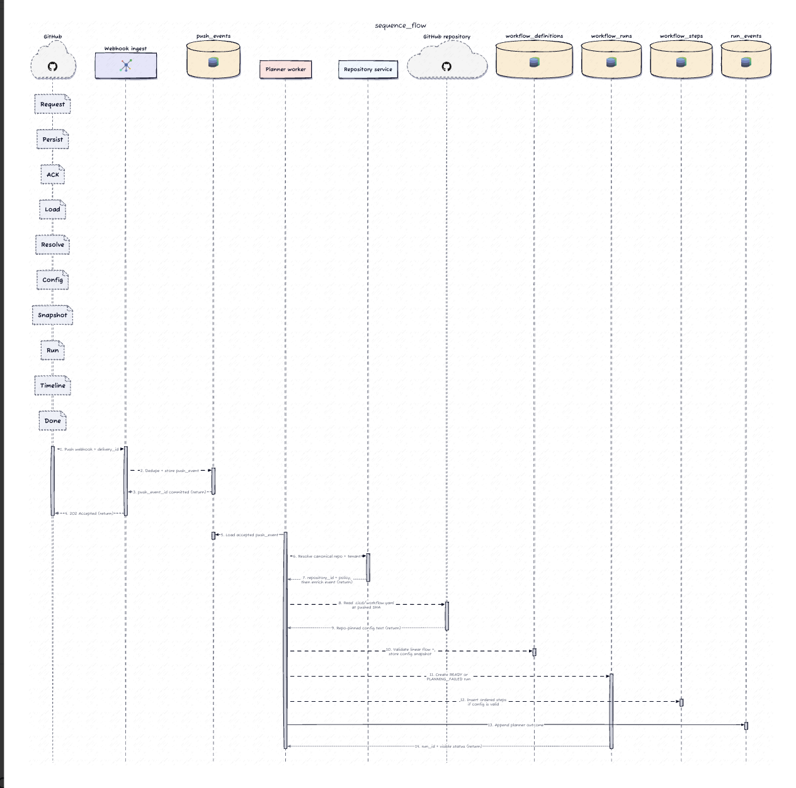
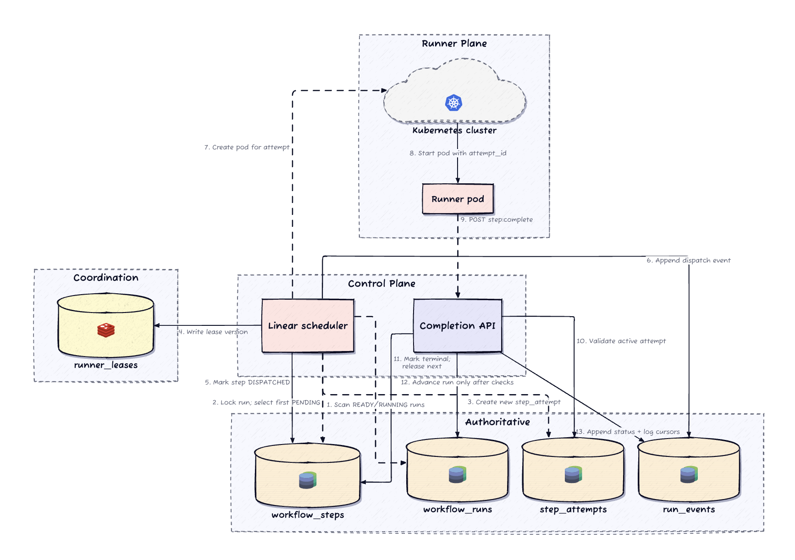
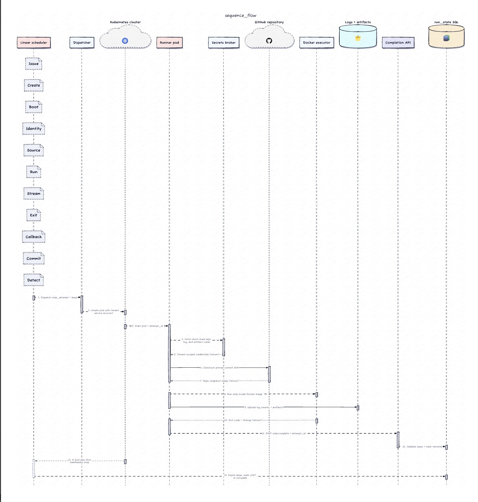
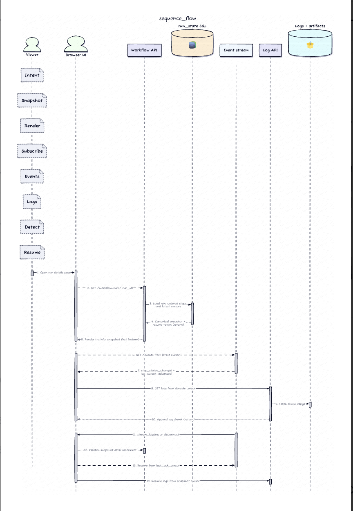

# Design a Multi-Tenant CI/CD System

## 1. Requirements

### Clarifying Questions (the dialogue that shapes the design)

| Question | Answer | Design consequence |
|---|---|---|
| Linear sequential steps, or parallel/matrix/conditional? | **Linear only** — flat ordered list, one step at a time | Scheduler reduces to a single invariant: *at most one step DISPATCHED/RUNNING per run*. Advance = "find first non-terminal step," no dependency graph. |
| One workflow run per push, or multi-workflow routing? | **One run per push** | The commit push is the definitive, unambiguous trigger. No event-based workflow selection. |
| Dedicated infra per tenant, or shared compute? | **Shared compute**, strict per-tenant isolation of execution/secrets/logs/identity | Isolation enforced at the *execution boundary*, not by hardware separation. |
| Peak push rate / max concurrent steps? | **2,000 pushes/min**, **10,000 concurrent steps**; most steps < 5 min, long builds ~30 min | Cluster sized for *sustained holding*, not arrival rate. Per-tenant fairness + step timeouts become **structural**, not optional. |
| On reconnect: replay every missed transition, or reload current state? | **Reload current state** + continue log from cursor | Current run state is source of truth; the live stream only keeps the page fresh. UI must become *correct again*, not perfectly replayed. |

### Functional Requirements (prioritized)

1. **Ingest & decide** — accept a GitHub push webhook, analyze branch/ref/SHA/delivery metadata, decide whether a workflow should start.
2. **Resolve identity before config** — resolve canonical GitHub repo → tenant-scoped internal repo record *before* reading any workflow config.
3. **Pin config to commit** — read `.cicd/workflow.yaml` at the pushed SHA, validate it's a linear step sequence, snapshot it.
4. **Durable run first** — create one `workflow_run` + ordered `workflow_steps` in the control plane *before* any runner starts.
5. **Sequential isolated execution** — run steps one at a time on Kubernetes in isolated Docker environments, advancing only after a terminal state.
6. **Truthful, recoverable UI** — show ordered steps / current step / failures / near-real-time progress, and recover to a correct snapshot after reconnect (resume log from a cursor).
7. **Explainability** — retain run history, pinned config metadata, and audit detail to explain *why* a run ran or *why planning failed*.

### Non-Functional Requirements (quantified)

- **Webhook ack** ≤ ~2 s after durable dedupe + enqueue.
- **UI freshness** ≤ ~2 s for status changes under normal load.
- **Step handoff** ≤ ~10 s to start the next step when capacity exists.
- **Availability** 99.9% for ingest / run-reads / progress; individual runner failure **must not lose workflow truth**.
- **One authoritative timeline** survives failure of webhook handlers, schedulers, runner pods, or browser connections.
- **Tenant isolation** for repo bindings, secrets, logs, artifacts, execution identities.
- **Scale**: ~50k repos, 2k pushes/min peak, 200k runs/day.
- **Retention**: state + pinned config + audit ≥ 90 days.
- **Cost control**: ephemeral runners, bounded retention, fairness limits for noisy tenants.

### Capacity Estimation (only the numbers that shape a decision)

| Quantity | Assumption | Why it changes the design |
|---|---|---|
| Repositories | 50,000 | Repo resolution + history need indexed `(tenant, repo)` lookups. |
| Peak pushes | 2,000 / min | Ingest must dedupe fast + enqueue planning — **never read config inline**. |
| Runs/day | 200,000 | `workflow_runs` / `workflow_steps` / `run_events` need retention-aware storage. |
| Avg steps/run | 5 | ~1M step records/day — still comfortable for well-indexed SQL. |
| Avg step duration | 5 min | ~3,500 avg concurrent steps → burst capacity beyond arrival rate. |
| Peak concurrent steps | 8k–10k | **Quotas + image-pull pressure** matter more than webhook volume. |
| Log volume | 10–50 MB/run (large outliers) | Logs → object storage; SQL keeps cursors + timeline metadata only. |
| UI viewers | 1–3 per active run | Snapshot + control-plane streaming is enough for the common read path. |

> **Takeaway:** the hot *write* path is push-dedupe → planning → step transitions → timeline events. The hot *read* path is one canonical snapshot + fresh progress updates.

---

## 2. Core Entities



- **Tenant** — isolation root for quota, retention, fairness policy.
- **Repository** — binds canonical GitHub identity (repo ID, installation ID) → stable internal `repository_id` + owning `tenant_id`. *Names are metadata, not identity — they change.*
- **PushEvent** — durable dedupe record + enough context to explain a run/no-run decision.
- **WorkflowDefinition** — commit-pinned, normalized, content-hashed config snapshot.
- **WorkflowRun** — top-level record the browser reads; carries status + current-step pointer.
- **WorkflowStep** — ordered (`step_index`) durable step; only the first non-terminal step is runnable.
- **StepAttempt** — retry history without mutating away earlier evidence.
- **RunEvent** — append-only UI timeline (status changes, attempt lifecycle, planning errors, log cursors).


### Invariants worth protecting

1. Resolve repository identity **before** config read, secrets lookup, or policy checks.
2. Deduplicate by GitHub `delivery_id` **before** creating planner work.
3. Within one run, **at most one step** may be `DISPATCHED` or `RUNNING`.
4. The workflow page must **rebuild from durable tables** even if live updates were missed.

### Keys, indexes, partitioning

| Table | Index | Serves |
|---|---|---|
| `repositories` | unique `github_repo_id`; `(tenant_id, created_at)` | resolution + tenant history |
| `push_events` | unique `delivery_id`; `(github_repo_id, created_at)` | dedupe + audit |
| `workflow_runs` | `(tenant_id, repository_id, created_at desc)`; `(status, created_at)` | history + scheduler scans |
| `workflow_steps` | `(run_id, step_index)`; `(run_id, status, step_index)` | ordering + cheap next-step release |
| `run_events` | `(run_id, sequence_no)` + time partition | sequential replay |

The one query shape worth making concrete — release the next step safely:

```sql
SELECT step_id, step_index
FROM workflow_steps
WHERE run_id = $1
  AND status = 'PENDING'
ORDER BY step_index
LIMIT 1
FOR UPDATE SKIP LOCKED;
```

> This is only safe **inside a transaction that also locks the parent `workflow_runs` row** and verifies the prior step is terminal. Partition `push_events`, `workflow_runs`, `step_attempts`, `run_events` by time (audit ages out). **Don't shard on day one** — this scale fits a well-indexed relational control plane.

---

## 4. API Design

Three things the contract must make obvious: **webhooks create durable planning work**, **repo resolution happens before config read**, and **`GET /v1/workflow-runs/{run_id}` is recovery truth** when live updates lag.

The multiple communication modes are deliberate:
- **Webhook** — the producer (GitHub) lives outside our trust boundary and needs a push-style trigger.
- **GET snapshot** — workflow truth must survive disconnects and tab reloads.
- **SSE** — the UI mostly needs server→browser freshness with simple resume cursors, not a bidirectional socket.
- **Separate log-pull** — logs are bulkier, resume-heavy, and cache/paginate independently from run-state events.

| Endpoint | Mode | Purpose |
|---|---|---|
| `POST /internal/github/webhooks/push` | Webhook | Validate signature → dedupe by `delivery_id` → persist pre-resolution `push_event` → enqueue planner → **202 Accepted**. Repeated `delivery_id` returns the same accepted outcome. |
| `POST /internal/repositories:resolve-github` | Internal RPC | Planner calls *before any config read*. Returns `tenant_id`, `repository_id`, canonical identity, policy flags, config path. Unknown/transferred/disabled repos → **recorded planning failure**, not silent drop. |
| `GET /v1/workflow-runs/{run_id}` | REST | **Browser source of truth.** Fully renderable page: run identity, status, ordered step summaries, current-step pointer, planning errors, latest event/log cursors. |
| `GET /v1/workflow-runs/{run_id}/events` | SSE | Live progress. Events ordered by durable `sequence_no`. Reconnect = snapshot refetch → resume from last cursor. Typical events: `step_status_changed`, `attempt_finished`, `log_cursor_advanced`. |
| `GET /v1/repositories/{repo_id}/workflow-runs` | REST | Tenant-scoped history, cursor pagination, branch filters. |
| `GET /v1/workflow-runs/{run_id}/steps/{step_id}/logs` | REST (pull) | Log chunks or signed URLs by durable cursor range — separate from the event stream. |
| `POST /internal/workflow-runs/{run_id}/steps/{step_id}:complete` | Internal | Runner reports exit code, timing, artifacts, heartbeat. Duplicate/late completions are **audited but must not advance state**. |

> **The semantic contract > the transport:** *the snapshot is truth, the stream is only freshness.* Once the socket drops, the browser can't tell whether it missed a real state change or just a log line — so it refetches the snapshot and resumes from a durable cursor. This is less flashy than "direct live logs from the pod," but far more honest, and it avoids giving every runner browser-facing auth.

---

## 5. High-Level Design

There are two stories: the **control plane** decides what a workflow *means*; the **runner plane** is disposable capacity that executes the current lease. That split matters more than enumerating services.



**Why not let the webhook handler read YAML and launch pods immediately?** Because then GitHub, Kubernetes, and the browser each own a different slice of truth. The control plane instead resolves the repo, pins the definition, creates the run, releases one step at a time, and publishes the *same timeline the UI reads*.

**Three gaps the minimal design exposes at scale** (and the hardening each demands):
1. A single FIFO orchestrator lets one busy tenant starve others → **per-tenant queue isolation / fair scheduling**.
2. A runner crash leaves a step permanently in-progress → **heartbeat-based lease + expiry path**.
3. A single runner is a SPOF and can't handle concurrent tenants → **managed runner pool, health checks, bounded per-tenant concurrency**.




### Flow 1 — Git push → workflow run




### Flow 2 — Release exactly one next step



> **Interview line:** *"I keep the state machine in the control plane, not in Kubernetes. Kubernetes tells me whether a pod lived or died — it does not get to decide whether step 3 is now allowed to start."*

### Flow 3 — Execute on Kubernetes & report

One pod per `step_attempt`. The pod receives `run_id`, `step_id`, `attempt_id`, the pinned SHA, the normalized spec, and **short-lived credentials** for code fetch / secret access / log + artifact upload — **not** broad control-plane DB access. It checks out the pinned source, executes, streams logs through the control-plane path, and heartbeats its lease. On exit it calls `:complete`. **The control plane only mutates durable state if that callback still matches the active attempt + lease.**

### Flow 4 — Live progress in the browser

Two data sources, two jobs: the **snapshot is authoritative + complete**; the **stream is incremental + fresh**. The page renders header + ordered step timeline + active-step panel + latest error from the snapshot *alone*. The stream then applies `step_status_changed` / `attempt_finished` / `log_cursor_advanced`. On disconnect the page **doesn't guess** — it marks freshness degraded, refetches the snapshot, resumes from the last cursor.

---

## 6. Deep Dives

### 6.1 Push → creation: dedupe, resolution, pinning

The webhook path crosses **one durable boundary before replying**: verify signature → dedupe by `delivery_id` → normalize → enqueue. Once the `push_event` exists, GitHub retries stop being dangerous (the second delivery hits the same durable record). The planner then **resolves identity before any config read** — that's the policy boundary for secrets, quota, audit. Reading config first would let untrusted webhook data shape *privileged* work before the system even knows which tenant owns the repo. Bad config still yields a **visible `PLANNING_FAILED` run**, never a silent drop.

### 6.2 Linear scheduler semantics

The scheduler asks **"which run is legally allowed to advance?"** *before* "which pods look free?" — that's the difference between capacity-first orchestration and a believable state machine. Lock the run row → verify latest durable step outcome → select first `PENDING` by `step_index` → create attempt → write lease → `DISPATCHED` → *then* hand to K8s. Stale callbacks compared against `attempt_id` + lease state become **harmless audit facts**, not double-advance bugs.

### 6.3 Tenant-safe execution on Kubernetes

Multi-tenancy becomes concrete here: **namespaces, service accounts, secret scope, network policy, artifact paths, log prefixes — all tenant-scoped.** If heartbeats stop, the lease expires and the attempt becomes `LOST` / `TIMED_OUT` after a grace window. A late callback from that dead pod may be *recorded* but must not **resurrect the old attempt as truth** — the fencing discipline that keeps a zombie runner from double-advancing the timeline.



> *DDIA Ch. 8/9: leases + fencing tokens against the "process paused / partitioned then returns" failure mode. The lease TTL is the efficiency tier (mutual exclusion); the attempt-id/epoch check is the correctness tier (arbitration against a resource — the run row — with native compare-and-set).*

### 6.4 Front-end freshness model

Keep an explicit freshness state in page chrome: **`LIVE` / `RECONNECTING` / `STALE`**. Not cosmetic — it tells the user when to trust the live feed vs. the last durable snapshot. Under backpressure, the **worst acceptable outcome is a stale-but-clearly-labeled page**; the unacceptable outcome is a page that *looks* live while telling a story the control plane can't verify.



## 7. Other Considerations

- **Config safety** — reject non-linear/matrix features explicitly; normalize risky defaults (missing limits, unbounded timeouts); keep prior snapshots for comparison but **never silently run an older config for a new push**. No "auto-fallback to last good workflow" — the user pushed commit X, so run X's config or explain why not.
- **Fairness across noisy tenants** — tenant-aware admission *ahead of* K8s dispatch; track per-tenant concurrent-step limits + queue depth; surface **"waiting for capacity"** as a real workflow event (not a fake spinner).
- **Stuck runners / retention cost** — every attempt heartbeats a short lease the scheduler can expire; a cleanup controller deletes orphaned pods whose attempt is already terminal. Metadata stays hot longer than logs; large artifacts age out fastest.
- **Regional ingress / failover** — accept webhooks in multiple regions but anchor **delivery dedupe + planning to one authoritative write path per repo shard**. During failover the page may go briefly stale but rebuilds from SQL + object storage rather than faking live progress.

---

## 🔍 Senior-Signal Questions to Ask in Your Interview

- **"Is the run row's conditional update our arbitration primitive, or do we need fencing tokens against an external resource?"** → *Why it matters: shows you know that in a single-DB design, `FOR UPDATE` + attempt-id check IS the fencing mechanism — separate fencing tokens are only needed for resources lacking native compare-and-set (blob store, queue, external gateway).*
- **"What's the consistency boundary between the SQL timeline and the SSE stream?"** → *Why it matters: signals you understand snapshot-is-truth / stream-is-freshness, and that the durable `sequence_no` — not TCP ordering — is what makes reconnect correct across connection loss.*
- **"How do we prevent a 30-min build tenant from monopolizing the 10k concurrent-step budget?"** → *Why it matters: surfaces sustained-holding vs. arrival-rate reasoning and per-tenant weighted admission as a structural requirement.*
- **"When a lease expires but the pod is actually alive and partitioned, how do we avoid double-advancing the run?"** → *Why it matters: the classic paused-process failure mode — the epoch/attempt-id check is what makes a late callback a harmless audit fact.*
- **"Do we shard the control plane on day one?"** → *Why it matters: calibrated restraint — 200k runs/day fits a well-indexed partitioned relational store; premature sharding is a senior anti-signal.*
