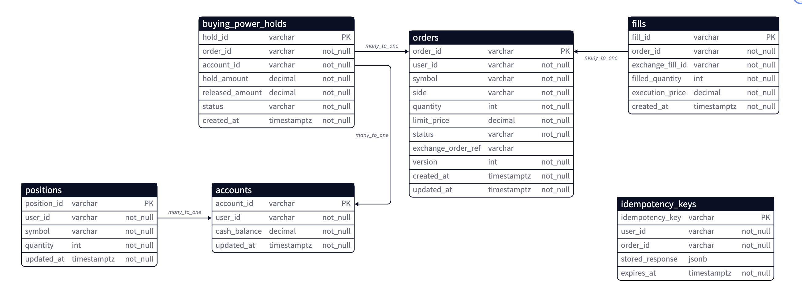
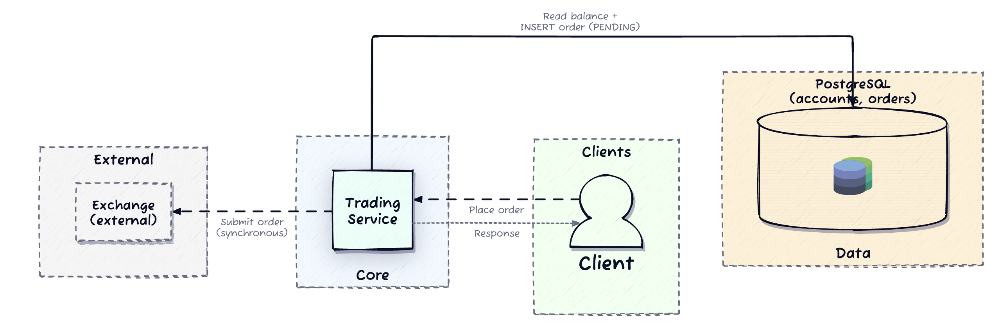
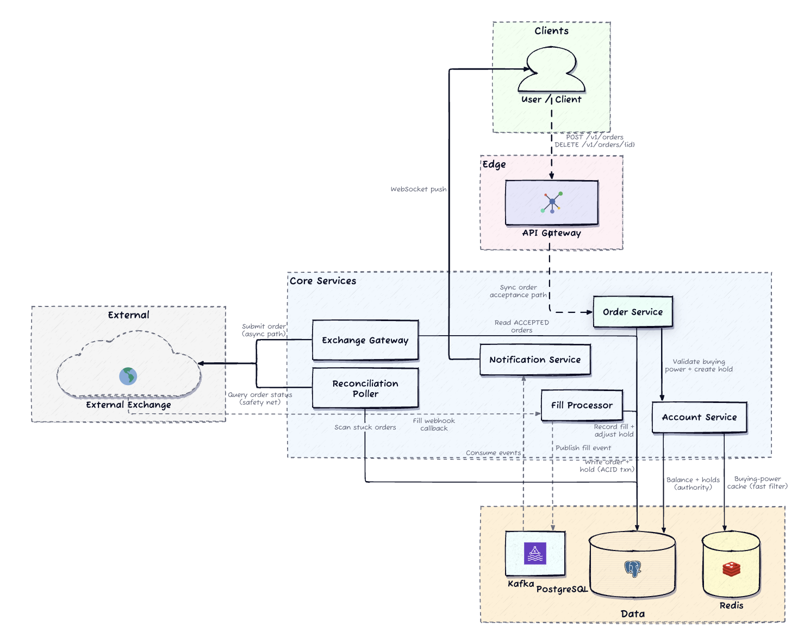
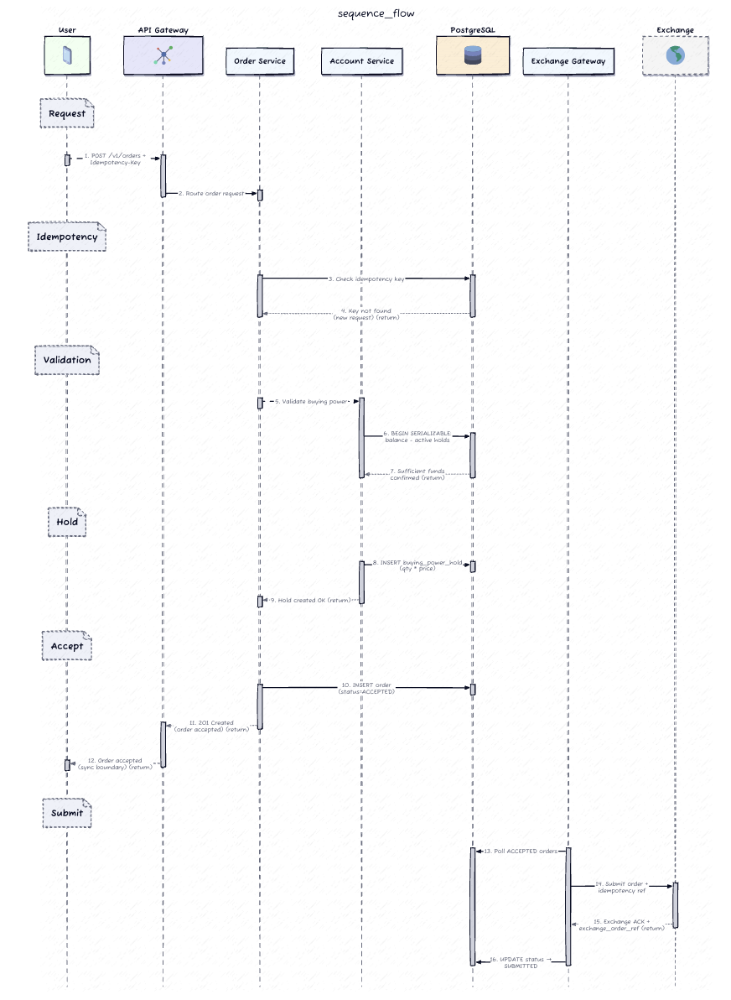
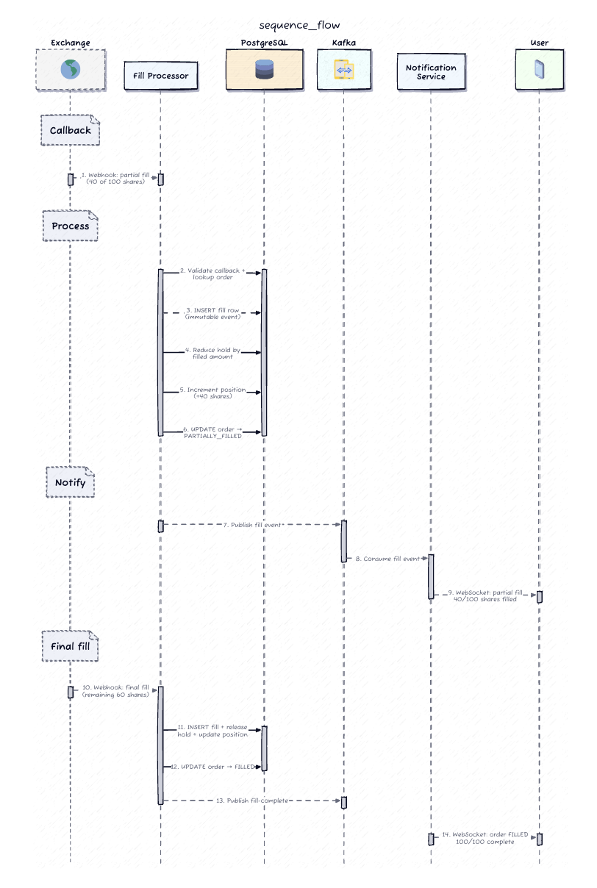
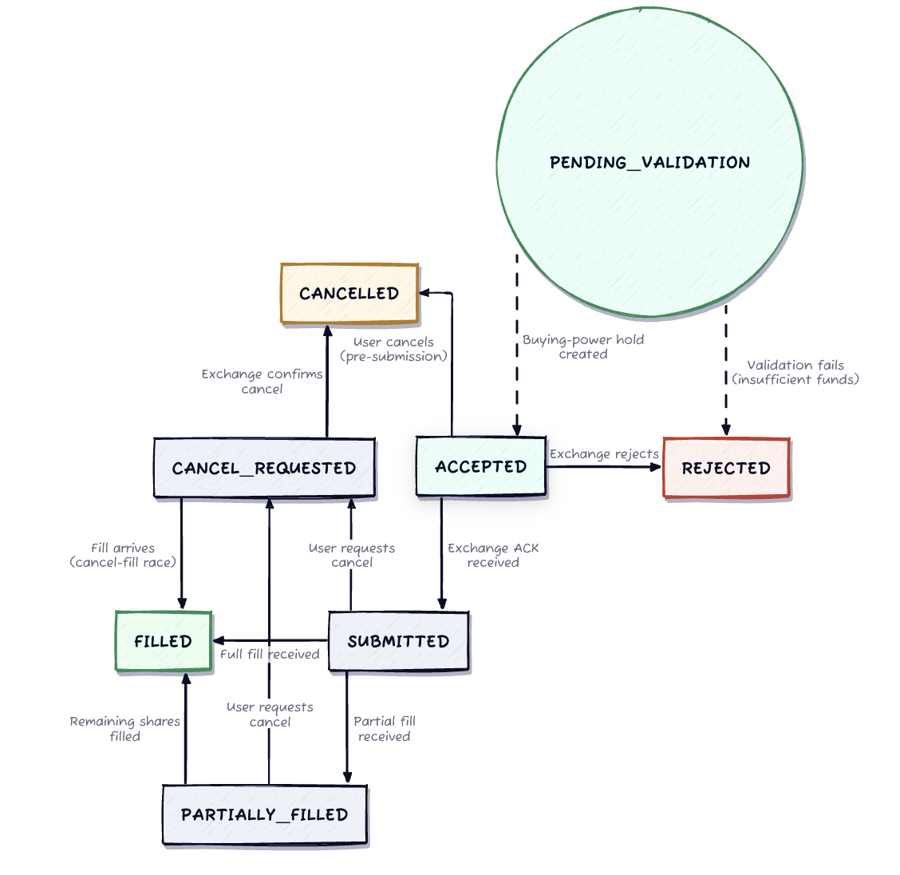
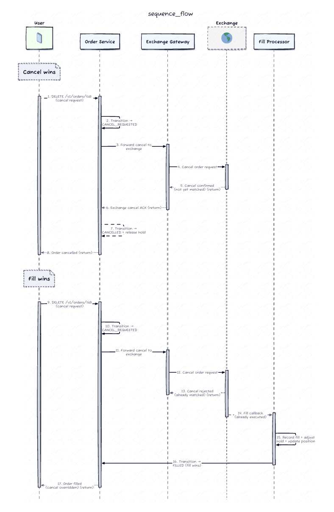

# Design a Stock Trading Platform (Robinhood-style)
---

## 0. The One-Line Thesis

> **The broker is a reliable state machine that bridges a synchronous user promise to an asynchronous exchange truth.**
>
> The **hold** is the user-facing promise. The **fill** is the exchange-facing truth. Every design decision below derives from keeping those two reconciled — under concurrency, under timeouts, and under races.

Everything that follows is a derivation from that invariant, not a feature catalog.

---

## 1. Requirements (~5 min)

### Clarifying Questions

I'd open by scoping aggressively — this problem has enormous surface area (order types, market data, margin, options) and the interesting part is only one slice of it.

| # | Question I'd ask | Answer | What it buys me |
|---|---|---|---|
| 1 | "Order types — limit only, or market/stop-loss/options too?" | **Limit only.** No market orders, stop-loss, options, or margin. | Removes reservation ambiguity. A limit order has a **known worst-case cost** (`qty × limit_price`), so the hold is computable up front. A market order can't be reserved exactly — that's a different problem. |
| 2 | "Two concurrent buys on one account — is a brief overdraft + correction acceptable?" | **No overdraft, ever. Correctness is top priority.** | This is the thesis. It forces a **correctness-tier** mechanism (serializable transaction), not an efficiency-tier one (Redis lock). |
| 3 | "If no fill callback arrives, do we fail the order, or leave it pending?" | **Neither. Bounded wait → explicit uncertain state → resolve authoritatively from the exchange.** | Buys me an explicit `SUBMITTED` state and forces a **reconciliation poller** into the core design, not the appendix. |
| 4 | "Fill notifications — guaranteed ordered delivery, or best-effort push + authoritative GET?" | **Best-effort push. GET is always authoritative.** | Splits the delivery contract into a **fast lossy channel** and a **canonical recovery read**. Classic end-to-end argument. |
| 5 | "Hold — full reservation until terminal, or reduced incrementally on partial fills?" | **Reduced incrementally.** | Hold release cannot wait for a terminal state. Partial fills mutate buying power *live*. |
| 6 | "Cancel vs. fill race — who wins?" | **The exchange is the authority.** A reported fill stands. Cancel is best-effort. | Names the trust boundary explicitly. The broker *records*, it does not *decide*. |

**Scoping callout:** I'm explicitly excluding the matching engine. We are the **broker**, not the exchange. No order book, no price-time priority matching. If the interviewer wanted a matching engine, that's a fundamentally different design (in-memory order book, single-writer per symbol, deterministic sequencing) and I'd want to know now.

---

### Functional Requirements

**Top 3 (the ones I'll design for):**

1. **Place a limit order** (buy/sell, symbol, qty, limit price) with buying-power / holdings validation and a **synchronous acceptance**.
2. **Track the full order lifecycle** across the exchange boundary — submission, partial fills, full fill, rejection — with an accurate account balance throughout.
3. **Cancel a pending order**, correctly resolving the cancel-vs-fill race.

**Also in scope (lower priority):**

4. Query open/completed orders + real-time status push.
5. Accurate buying power reflecting holds, partial fills, and completed orders.

---

### Non-Functional Requirements

Quantified, top 5:

| # | Requirement | Number | Why this one |
|---|---|---|---|
| **NFR1** | **No overdraft under concurrent submissions** | Zero tolerance | The correctness invariant. Non-negotiable. |
| **NFR2** | **Durability of orders and fills** | Zero silent loss | A lost fill = an untracked position = a regulatory incident. |
| **NFR3** | **Exactly-once effect at the exchange boundary** | No duplicate exchange orders under retry | Timeouts are guaranteed. A duplicate order is real money. |
| **NFR4** | **Latency** | Order acceptance **p95 < 500 ms**; fill push **p95 < 2 s** | Acceptance must not wait on the exchange. This *forces* the two-phase split. |
| **NFR5** | **Availability** | 99.95% on place/cancel; **5–10× burst at 9:30 ET open** | Burst is where correctness usually gets sacrificed. It must not be. |

**CAP position:** This is a **CP** system on the account/order path. On a partition we **reject orders** rather than risk overdraft. The read path (order status, positions) can be AP-ish — a stale read is recoverable; an overdraft is not. *DDIA Ch. 9* — linearizability is required exactly where a constraint must hold (uniqueness, non-negative balance), and nowhere else.

**Compliance:** FINRA Rule 4511 — 6-year immutable order record. This forces an append-only audit log, not just a mutable `orders` table.

---

### Capacity Estimation — only where it changes a decision

I'm not going to compute storage just to conclude "it's a lot." Two numbers actually steer this design:

| Metric | Value | The decision it changes |
|---|---|---|
| Active users | ~1M | — |
| Orders / trading day | ~5M | ~58/s average — **trivially small.** |
| **Peak order rate (9:30 ET)** | **~2,000/s** | Still small in absolute terms. **The critical insight: contention is per-account, so effective concurrency on any single row is ~1.** 2,000/s spread over 1M accounts ≈ 0.002 orders/account/s. |
| **Fill callback latency** | 50–500 ms | Sets the reconciliation threshold. 500ms p99 → a 5-min stale threshold is ~600× the expected latency. Safe. |
| Avg fills / order | 1–3 | Fill pipeline: ~2,000 × 3 = **6,000 fill events/s peak.** |
| Peak WebSocket conns | ~200k | ~200k / 50k-per-node = **4+ notification nodes.** Sizing only. |

**The number that matters most:** 2,000 orders/s across 1M accounts means **cross-account contention is zero**. This is why we can afford `SERIALIZABLE` isolation — the expensive-looking choice is actually cheap here, because the conflict domain is a single account. A designer who says "serializable won't scale to 2,000/s" hasn't asked *what's contending*.

*Little's Law sanity check:* if 6,000 fills/s arrive and each fill transaction takes ~5ms, we need `L = λW = 6,000 × 0.005 = 30` concurrent fill workers. Trivially provisioned.

---

## 2. Core Entities (~2 min)



First draft — nouns the API exchanges and the system persists.

- **Account** — the user's cash. Owns the balance.
- **Order** — the lifecycle anchor. Owns the state machine.
- **Fill** — an immutable, exchange-reported execution fact.
- **Hold** — a reservation of buying power against an Order.
- **Position** — per-user, per-symbol share count.
- **IdempotencyKey** — client-retry dedupe record.

**Ownership boundaries (this matters more than the list):**

- **Order Service** is the *single writer* for order lifecycle transitions.
- **Account Service** owns the balance + hold ledger.
- **Fills** are append-only facts *from* the exchange — nobody "decides" a fill, we only record it.
- Redis (buying-power cache, WS session state, rate-limit counters) is a **performance helper**. It may lag, drop, or be rebuilt. **It never decides whether an order was accepted.**


**Three modeling decisions worth defending:**

1. **`available_bp` is computed, not stored.** If it were a writable column, it could drift from `cash_balance − Σ(holds)`. A derived value cannot drift from its own components. This is the same instinct as event sourcing: **store the facts, derive the view.** *DDIA Ch. 11.*

2. **`fills` is append-only.** A fill is a *fact reported by the authority*, not an estimate to be revised. If the exchange busts a trade, that's a **new compensating event**, not an UPDATE. Forward-only state, never destructive correction — the same discipline that makes reconciliation a diff rather than an investigation.

3. **`UNIQUE(exchange_fill_id)`** is the webhook idempotency boundary. Exchanges retry webhooks. Without this, a retried callback double-decrements the hold and double-increments the position. **The unique constraint, enforced by the database, is the dedupe** — not application-level "have I seen this?" logic, which is racy.

**Why Postgres and not Cassandra:** the buying-power reservation needs *check-then-write* atomicity across two tables (`accounts`, `buying_power_holds`) plus a conditional insert into a third (`orders`). Postgres **decouples atomicity (transaction manager) from placement (shard key)** — I can shard by `account_id` and still transact freely across tables *within* an account. Cassandra **fuses** them into the partition key; multi-table atomicity within a partition isn't available in the same way. The distinction isn't key choice — it's the **atomicity boundary model**. Since our entire correctness domain is scoped to one account, Postgres sharded by `account_id` gives us ACID exactly where we need it and linear scaling everywhere else.

---

## 3. API / System Interface (~5 min)

REST for mutation and recovery. WebSocket for push. Webhook for exchange ingress.

Four channels, each with one job:

| Channel | Role | Authoritative? |
|---|---|---|
| **REST** | place / cancel / query | ✅ (GET is truth) |
| **WebSocket** | real-time fill push | ❌ fast but lossy |
| **Webhook** | exchange → broker fill/status | ✅ (input fact) |
| **Canonical GET** | recovery read from Postgres | ✅ **the** truth |

### Place an order

```http
POST /v1/orders
Authorization: Bearer <jwt>
Idempotency-Key: client-uuid-abc123
```

```json
{
  "symbol": "AAPL",
  "side": "buy",
  "quantity": 100,
  "limit_price": "150.25"
}
```

```json
201 Created
{
  "order_id": "ord_7f3a...",
  "status": "ACCEPTED",
  "held_amount": "15025.00",
  "created_at": "2026-04-10T14:30:00Z"
}
```

| Code | Meaning |
|---|---|
| `201` | first success |
| `200` | idempotent replay — **same body**, no new order |
| `400` | insufficient buying power / invalid symbol / non-positive qty |
| `429` | rate limited |

**`ACCEPTED` means: funds are reserved. It does NOT mean the exchange has the order.** That distinction is the entire two-phase design, surfaced in the API contract itself.

**The idempotency key is mandatory.** Note there are *two* idempotency boundaries and they're different:

- **Client → broker:** `Idempotency-Key` header → prevents duplicate *order rows*.
- **Broker → exchange:** deterministic ref derived from `order_id` → prevents duplicate *exchange orders*.

Conflating these is a common miss. They protect different resources against different retriers.

### Cancel an order

```http
DELETE /v1/orders/{order_id}
```

```json
200 OK
{ "order_id": "ord_7f3a...", "status": "CANCEL_REQUESTED" }
```

`409` if already terminal (FILLED / CANCELLED / REJECTED). `404` if not owned by the caller.

**The response acknowledges the *request*, not the *outcome*.** The exchange may have already filled. The API must not lie about this.

### Get order status — the recovery endpoint

```http
GET /v1/orders/{order_id}
```

```json
200 OK
{
  "order_id": "ord_7f3a...",
  "symbol": "AAPL", "side": "buy",
  "quantity": 100, "limit_price": "150.25",
  "status": "PARTIALLY_FILLED",
  "filled_quantity": 40,
  "avg_fill_price": "150.10",
  "held_amount": "9015.00",
  "version": 7,
  "updated_at": "2026-04-10T14:30:02Z"
}
```

### Supporting

```http
GET  /v1/orders?status=open&cursor=<c>   # cursor-paginated on (created_at, order_id)
GET  /v1/accounts/me/balance             # cash + available buying power
WS   /v1/orders/stream                   # push; on reconnect → GET first, then resubscribe
```

**Identity comes from the auth token.** Never from a body field or path param. `order_id` is checked for ownership on every read.

### The Recovery Contract (state this explicitly — it's a senior signal)

> Clients treat **WebSocket events as hints** and the **GET endpoint as truth.**
> After any disconnect: `GET` each open order → reconcile local state → resubscribe.

This is the **end-to-end argument** (*DDIA Ch. 12*) applied to delivery. You cannot make the push channel reliable enough to be authoritative — reconnects, LB failovers, and mobile network drops guarantee loss. So don't try. Make it fast, and put the reliability at the endpoint that can actually provide it: a read against the durable store.

---

## 4. High-Level Design (~15 min)

### Start naive, then break it

The simplest thing: one Trading Service, one DB, one synchronous exchange call.



Three specific failures push us to the real architecture:

1. **No hold → overdraft.** Two concurrent buys both read `balance = $20k`, both see `$15k` as affordable, both pass. Account is $10k underwater. This is a **write skew** — a decision made on a stale read of a predicate. *DDIA Ch. 7.*
2. **Synchronous exchange call → NFR4 dies.** The exchange takes 50–500ms and can hang. Our p95 < 500ms acceptance budget is consumed entirely by someone else's system. Worse: an exchange outage takes down order acceptance.
3. **No position ledger.** Sell validation would require a live exchange query on the hot path. Same problem, worse.

Each fix maps to one component: **a hold ledger**, **an async exchange boundary**, **an authoritative position table**.

---

### Architecture

<br><br><br><br><br><br><br><br><br><br><br><br>


**Reading the diagram:** the red path (Order → Account → Postgres) is the **correctness path** — one serializable transaction, synchronous, under the 500ms budget. The blue/green paths are the **truth path** — asynchronous, driven by the exchange, reconciled by the poller. The dashed purple poller is not error handling; it runs continuously as a **safety net**.

---

### Flow 1 — Order placement (the correctness path)

<br><br><br><br><br><br><br><br><br><br><br><br>


The whole point of this diagram is the horizontal line at y=362: **the user's response returns before the exchange is ever contacted.** Everything below that line is the broker's problem, not the user's wait.

---

### Flow 2 — Exchange submission (the idempotency boundary)

The Exchange Gateway picks up `ACCEPTED` orders and submits. On ack: record `exchange_order_ref`, transition → `SUBMITTED`.

**On timeout, do NOT blindly retry.** A timeout is the most dangerous outcome in the whole system, because it is *indistinguishable* from success at the network layer. The order may or may not exist at the exchange.

The fix: **derive a deterministic idempotency reference from our `order_id`** and pass it as the exchange-side key. Now retry is safe:
- Exchange never saw it → creates it.
- Exchange already has it → returns the existing ack.

Either way we converge, and we never double-submit real money. If the exchange doesn't support an idempotency key, the fallback is a **query-before-retry**: `GET /exchange/orders?client_ref=X` first. Slower and racier, but it's the best available.

On exchange rejection (bad symbol, market closed) → `REJECTED`, **release the hold**.

---

### Flow 3 — Fill processing (the truth path)

Exchange webhook → Fill Processor. **One transaction:**

```sql
BEGIN;
  INSERT INTO fills (...) VALUES (...);        -- UNIQUE(exchange_fill_id) → dupe = no-op
  UPDATE buying_power_holds
     SET released_amount = released_amount + (filled_qty * execution_price)
   WHERE order_id = ?;
  INSERT INTO positions (...) VALUES (...)     -- upsert
    ON CONFLICT (account_id, symbol)
    DO UPDATE SET quantity = positions.quantity + EXCLUDED.quantity;
  UPDATE orders SET status = ?, filled_qty = ?, version = version + 1
   WHERE order_id = ? AND version = ?;         -- optimistic guard
COMMIT;
```

Then publish to Kafka (partitioned by `user_id`) → fans out to Notification Service (WS push) and Audit Sink.

**Partial fill worked example.** Buy 100 AAPL @ limit $150.25. Hold = **$15,025**.

| Event | Fill | Hold released | Hold remaining | Position | Status |
|---|---|---|---|---|---|
| accept | — | $0 | $15,025 | 0 | `ACCEPTED` |
| fill 1 | 40 @ $150.10 | $6,004.00 | $9,021.00 | 40 | `PARTIALLY_FILLED` |
| fill 2 | 60 @ $150.00 | $9,000.00 | $21.00 | 100 | `FILLED` |
| terminal | — | **+$21.00 residual** | **$0** | 100 | `FILLED` |

Two things to name here:

- **The hold releases at the *execution* price, not the limit price.** The user paid $150.10, not $150.25.
- **The $21 residual** is price improvement — the difference between the worst case we reserved and what actually happened. It's released **only at terminal state**, because until the order is done, the unfilled quantity still needs its reservation. Releasing residual early would let the user spend money that a subsequent fill still needs.



---

### Order lifecycle state machine

Terminal states are **absorbing**. Every transition is guarded in SQL by both the legal predecessor set *and* the version. A late-arriving duplicate transition becomes a **0-row UPDATE** — a silent, safe no-op. The FSM isn't documentation; it's a `WHERE` clause.

---

## 5. Deep Dives (~15 min)

Three tensions define the hard parts.

---

### Deep Dive 1 — Buying-power reservation under concurrency

**The failure.** The gap between *read balance* and *write hold*. Two transactions read `available = $20k`, both approve a $15k order, both commit. Account is $10k underwater and the user got two orders they can't pay for.

This is **write skew** (*DDIA Ch. 7.2.3*), and specifically the **phantom** variety: the decision depends on a *predicate* (`SUM of active holds`) whose result set the other transaction is concurrently modifying. There's no single row to lock — the row that would break the invariant **doesn't exist yet**. That's what makes it nastier than a lost update.

#### Option comparison

| Approach | Mechanism | Correct? | Cost | Verdict |
|---|---|---|---|---|
| **Read-committed + app check** | naive | ❌ | — | **Broken.** The default isolation level does not prevent this. |
| **Pessimistic row lock** | `SELECT ... FROM accounts WHERE id=? FOR UPDATE` | ✅ | Serializes per account; lock held for txn duration; deadlock risk if lock ordering is inconsistent across services | **Viable.** Materializes the conflict onto the account row, giving the phantom something to collide with. |
| **Optimistic (version CAS)** | `UPDATE accounts SET version=version+1 WHERE version=?` | ✅ | Wasted work on conflict; needs app retry loop | Viable, but I'd need a version column on `accounts` purely as a conflict proxy — semantically noisy. |
| **✅ SERIALIZABLE (SSI)** | Postgres predicate locks detect the RW-conflict, aborts one with `40001` | ✅ | False-positive aborts; retry loop needed | **Chosen.** |

#### Why SERIALIZABLE

**Fewest application-level correctness assumptions.** With `FOR UPDATE`, correctness depends on *every future engineer* remembering to take the lock, on the same row, in the same order. That assumption decays. With SSI, the database detects the conflict regardless of how the query is written — **the invariant is enforced by the system, not by discipline.**

The usual objection is "serializable won't scale." Check the numbers: **2,000 orders/s ÷ 1M accounts ≈ 0.002 orders/account/s.** SSI's cost is proportional to *conflicting* transactions, and cross-account conflict is **zero** — different accounts touch disjoint rows and disjoint predicates. The expensive-looking choice is nearly free here *because of the shape of the contention*, and I'd say exactly that to the interviewer.

Keep the txn scope **narrow** — balance read + hold insert + order insert only. No exchange calls, no Kafka publishes, no HTTP inside the transaction. Narrow scope minimizes both false-positive aborts and lock duration. Retry `40001` with jittered exponential backoff; the abort rate is low because contention is per-account and a single user rarely fires concurrent orders.

#### Redis is a filter, not a decider

A Redis buying-power cache sits in front as a **fast reject filter**. If the cached estimate says "clearly insufficient," reject without touching Postgres — this sheds load during the open burst, where a chunk of rejects are users with obviously empty accounts.

**But the cache can only say NO, never YES.** A stale cache saying "insufficient" is a false reject — annoying, recoverable, and the user retries. A stale cache saying "sufficient" that we *trusted* would be an overdraft — unrecoverable. **Asymmetric trust in an asymmetric-cost world.** The cache accelerates the negative path only; every approval still goes through the serializable transaction.

> **The aha.** The buying-power hold is not the trade. The exchange fill is the trade. The hold's job is to make a *promise* that concurrency cannot break. The fill's job is to make the *books* match reality afterward. Confuse the two and you either lie to users or overdraw them.

---

### Deep Dive 2 — Exchange reliability & the reconciliation poller

**The problem.** Three possible outcomes from a submit, and only two are informative:

1. Clean ack → easy.
2. Explicit reject → easy.
3. **Timeout / no response → we do not know.** ← everything hard lives here.

And separately: ack received, then **no fill callback ever arrives**. Order rots in `SUBMITTED` forever, hold locked, user's buying power hostage.

**Fix 1 — deterministic idempotency ref.** Covered above. Makes retry-after-timeout safe.

**Fix 2 — the reconciliation poller.**

```sql
SELECT order_id, exchange_order_ref FROM orders
 WHERE status IN ('SUBMITTED','PARTIALLY_FILLED','CANCEL_REQUESTED')
   AND updated_at < now() - interval '5 minutes'
 ORDER BY updated_at
 LIMIT 500;                        -- served by INDEX (status, updated_at)
```

For each: query the exchange for authoritative status. Apply missed fills as **late fills** through the *exact same* Fill Processor code path — `UNIQUE(exchange_fill_id)` makes re-applying an already-processed fill a no-op. **There is no separate "recovery" logic to get wrong**, which is precisely why the dedupe constraint pays for itself twice.




**Frame it as a safety net, not error handling.** Even when callbacks work perfectly, the poller **continuously verifies that the broker's view matches the exchange's view**. Drift between the two is exactly how accounts go quietly wrong — quietly being the operative word, because nothing pages you for a balance that's merely *incorrect*.

This is the **end-to-end argument** again (*DDIA Ch. 12.3*): no amount of retry/ack machinery at the transport layer gives you end-to-end correctness. Only a check at the endpoints — comparing our durable state against theirs — does.

> **Interview tip:** introduce the reconciliation poller **early**, in the high-level design, not as an afterthought in deep dives. Its placement in your narrative is itself the signal. Late = you patched a bug. Early = you understand that external integration is unreliable by nature.

---

### Deep Dive 3 — The cancel-fill race

<br><br><br><br><br><br><br><br><br><br><br><br>
The signature edge case. User taps cancel. At that same instant the exchange matches the order. Both events are valid. Both arrive concurrently. **Only one terminal state can win.**

**The principle: the exchange is the authority on execution.** The broker *requests* a cancel; the exchange *decides*. The broker's job is to faithfully record whichever outcome the exchange reports — not to adjudicate.



#### The asymmetry that resolves the race

Even in Scenario B where the cancel "loses," **the fill row is still inserted.** That's not incidental — it's the resolution principle:

| | Ignore a fill | Ignore a cancel request |
|---|---|---|
| Result | User owns 100 shares the broker doesn't know about | User's order filled when they wanted out |
| Recoverable? | ❌ Books are wrong. Cash is wrong. Regulatory exposure. | ✅ User owns exactly what the exchange says. They can sell. |
| Cost | **Unbounded** | **Bounded and correct** |

**The costs are asymmetric, so the tiebreak is not.** Fills always win — not because fills are "more important" in the abstract, but because a fill is a *fact that already happened in the world* and a cancel is a *request that might not have*. You cannot un-execute a trade by not writing it down.

**The FSM encodes this directly:** `CANCEL_REQUESTED` has two legal exits, `→ CANCELLED` and `→ FILLED`. That fork *is* the race, made explicit. Guard every transition:

```sql
UPDATE orders SET status='CANCELLED', version=version+1
 WHERE order_id=? AND version=? AND status='CANCEL_REQUESTED';
-- 0 rows affected → a fill beat us. Discard the cancel. Not an error.
```

> **What a wrong answer sounds like:** "cancel always wins" or "fill always wins," stated flatly without naming *why*. The correct answer is that **the exchange decides**, and the broker's state machine faithfully records whichever outcome it reports. The mechanism (serialization + version guard) is how; the trust boundary (exchange = authority) is why.

---

## 6. Other Considerations

### Market-open burst — where contention actually concentrates

9:30 ET brings a 5–10× spike. Where does it hurt?

- **Cross-account contention: zero.** Buying power is per-account. Shard the account/order tables by `account_id` → linear horizontal scaling. Contention exists only *within* a single account, and a single user firing concurrent orders is rare.
- **Exchange Gateway** is the real chokepoint — exchanges impose rate limits. **Queue and apply backpressure; never drop.** A dropped order with a live hold is the worst of both worlds: the user's money is reserved and nothing is happening. Token-bucket the outbound rate to the exchange's published limit.
- **Kafka** absorbs the fill burst. Partition by `user_id` → ordered per account, parallel across accounts.

> **The trap:** "let's relax to READ COMMITTED just during peak." **No.** That trades a correctness invariant for a throughput problem you don't actually have (see the estimation section — per-account contention is ~0.002/s). **Scale the infrastructure, not the isolation level.** An interviewer who offers you this trade is testing whether you'll take it.

### Exchange failover & circuit breaking

- **Degraded** (p95 > 2s): trip the breaker on the Exchange Gateway. **Queue** new submissions rather than firing into a slow exchange. Users see `ACCEPTED` for longer than usual — which is *honest*, because that's exactly what's true.
- **Fully unreachable:** stop accepting new orders, return `503`. Submitted orders stay `SUBMITTED`; the poller resolves them on recovery.
- **Critically: hold the holds.** Do **not** release buying-power holds during an exchange outage. Those orders may still be live at the exchange and may fill the moment it recovers. Releasing early → user spends the money → exchange fills → overdraft. **An outage is not evidence that an order didn't happen.**
- Breaker should be **per-exchange** if routing to multiple venues.

### Audit trail — FINRA 4511

Every state transition and fill event → Kafka → Audit Sink (append-only Postgres partition + S3 cold archive). Events carry `timestamp`, `actor`, `prev_state`, `new_state`, `trigger`, `causation_id`.

**The audit log is not the orders table.** The `orders` table is a **mutable projection of current state**. The audit log is the **immutable event history**, replayable to reconstruct state at any point in time. *DDIA Ch. 11* — this is the command/event distinction: the orders table is the read model; the log is the source of record. Six-year retention (FINRA Rule 4511) makes S3 the right tier for anything past the hot window.

---

## 🌍 Real-World Anchor

| System | What they do | Mapping |
|---|---|---|
| **Stripe** | `Idempotency-Key` header, 24h replay window, returns the original response verbatim | Our `POST /v1/orders` contract, exactly. The two-boundary split (client→broker, broker→exchange) mirrors Stripe's own PSP-facing idempotency. |
| **Coinbase** | Hold-then-settle: reserve on order placement, settle on execution, reconcile continuously against exchange state | Our hold ledger + reconciliation poller. The "hold is not the trade" framing is literally how crypto brokers describe it. |
| **Robinhood** | Broker-side position/balance ledger independent of clearing firm; nightly recon | Our `positions` table as authoritative broker-side truth, not a passthrough query. |
| **Kafka + Debezium** | CDC from the transactional store → event log, giving exactly-once effect with a transactional outbox | The Fill Processor → Kafka path. **Note the gap:** a naive "commit txn, then publish" has a dual-write hole. A **transactional outbox** (insert the event row *inside* the fill transaction, relay it out via CDC) closes it. Worth raising unprompted. |
| **Bytebytego "Payment System"** | Ledger + double-entry + reconciliation as a first-class component, not an afterthought | Our whole Deep Dive 2 thesis. |

---

## 📚 DDIA Anchors

| Concept | Chapter | Where it lands |
|---|---|---|
| **Write skew & phantoms** | *Ch. 7.2.3* | Exactly the overdraft bug. The row that breaks the invariant doesn't exist yet — that's why row locks alone are subtle and SSI is clean. |
| **Serializable Snapshot Isolation** | *Ch. 7.3.3* | Postgres SSI, and why its cost tracks *conflicting* transactions — which here is ~zero across accounts. |
| **Linearizability & when you need it** | *Ch. 9.2* | Required for the uniqueness/non-negative-balance constraint; **not** required for order status reads. Pay for it only where a constraint lives. |
| **Idempotence & exactly-once** | *Ch. 11.4* | The exchange boundary. "Exactly-once *delivery*" is impossible; **exactly-once *effect*** via idempotent operations is achievable — and is what we actually built. |
| **The end-to-end argument** | *Ch. 12.3* | The recovery contract (WS = hint, GET = truth) *and* the reconciliation poller. Both are the same idea applied at two layers. |
| **Event sourcing / derived state** | *Ch. 11.2* | Append-only `fills` + computed `available_bp` + audit log as source of record. |
| **Deriving current state from a log** | *Ch. 11.2.3* | Why the audit log, not the `orders` table, is the regulatory record. |

---

## 🔍 Senior-Signal Questions to Ask in Your Interview

1. **"Is the exchange's fill webhook ordered per order, or can I receive fill #3 before fill #2? If ordering isn't guaranteed, is there a monotonic sequence number I can use to detect the gap?"**
   → *Why it matters:* Tests whether you know **transport reliability is per-connection, not across connections**. Application-level sequence numbers are the only defense against reordering across reconnects and failovers. Without a seq, out-of-order fills silently corrupt hold arithmetic.

2. **"When the exchange busts a trade after we've already applied the fill and released the hold, do we compensate forward with a reversal event, or is there a correction protocol we're expected to honor?"**
   → *Why it matters:* Probes **immutability discipline under real-world messiness**. The right answer is a compensating event, never an UPDATE — otherwise the audit log lies and reconciliation becomes forensic instead of mechanical.

3. **"Am I permitted to accept orders while the exchange is unreachable, or is the required behavior to fail closed at 503?"**
   → *Why it matters:* Forces an explicit **CAP position** on the write path. Accepting orders into a queue during an outage is a *product* decision with a correctness cost (holds accumulate against an unknown exchange state), and it needs to be made deliberately, not by default.

4. **"What's the acceptable false-reject rate from the Redis buying-power filter? If it's near-zero, the cache can't shed load and I'd rather drop it than pretend it helps."**
   → *Why it matters:* Shows you understand **caches on a correctness path are asymmetric** — safe for NO, never for YES — and that a cache with no permitted error budget is dead weight. Kills a component instead of adding one.

5. **"Does the exchange support a client-supplied idempotency key on submission, or only query-before-retry? That single answer changes the entire timeout-handling design."**
   → *Why it matters:* Demonstrates that **you've located the hardest failure mode** (indistinguishable timeout) and know that the fix depends entirely on a capability you don't control. Query-before-retry is strictly racier; naming that gap is the signal.

6. **"Is `positions` the broker's authoritative record, or a cache of the clearing firm's book? If it's a cache, the sell-validation path has a consistency problem I need to design around."**
   → *Why it matters:* Distinguishes **owning state from mirroring state**. Sell validation against a mirrored position with replication lag is an oversell waiting to happen — a mirror-image of the overdraft bug on the other side of the ledger.

---
**If you only land one line, land this:** *"The hold is not the trade. The fill is the trade. This system is a reliable state machine bridging what the user requested and what the exchange actually did — and the exchange always wins that argument."*
