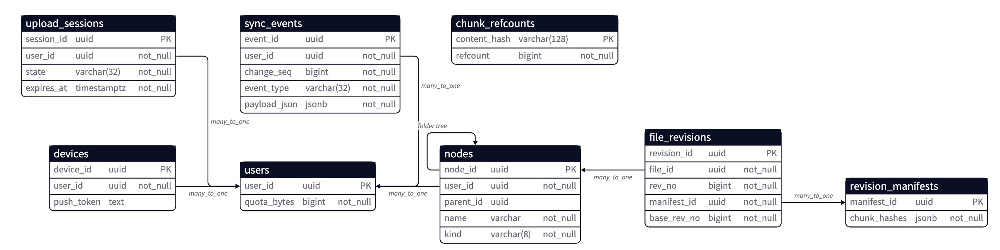
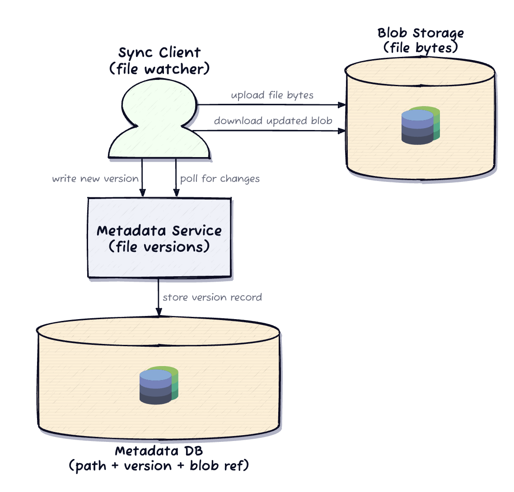
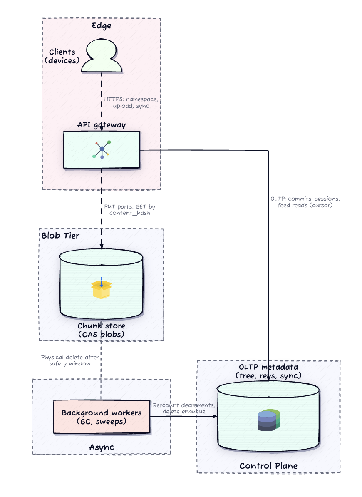
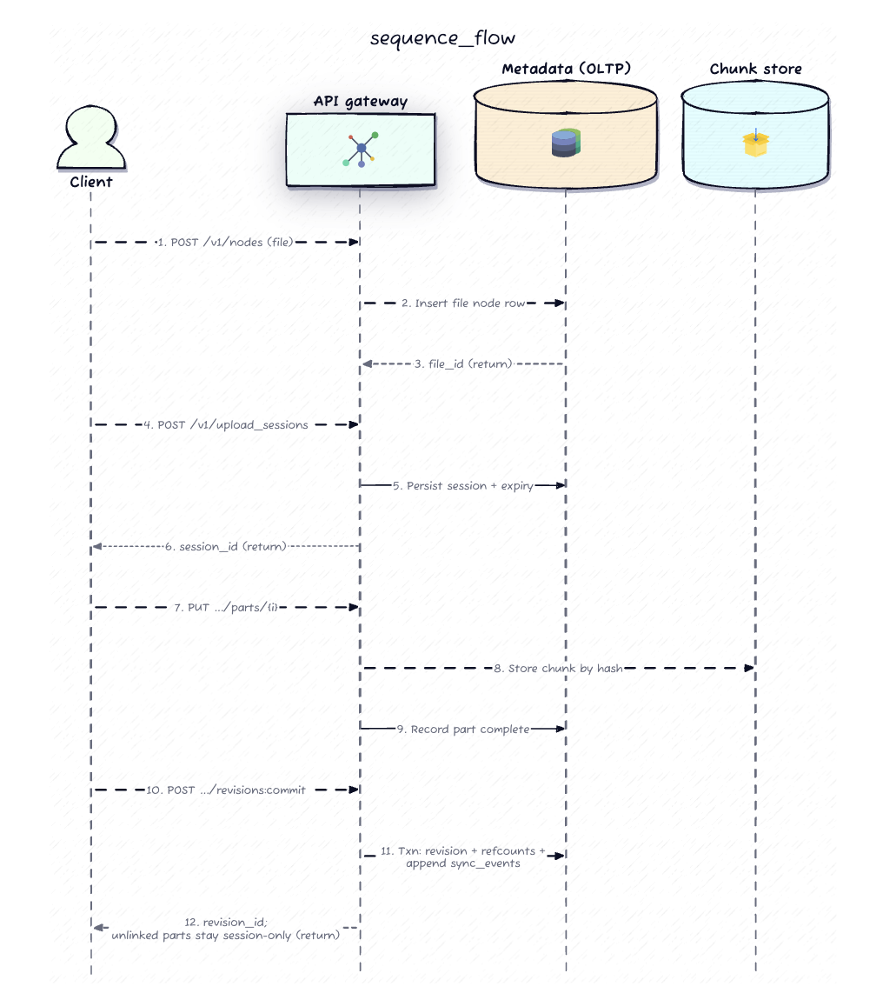
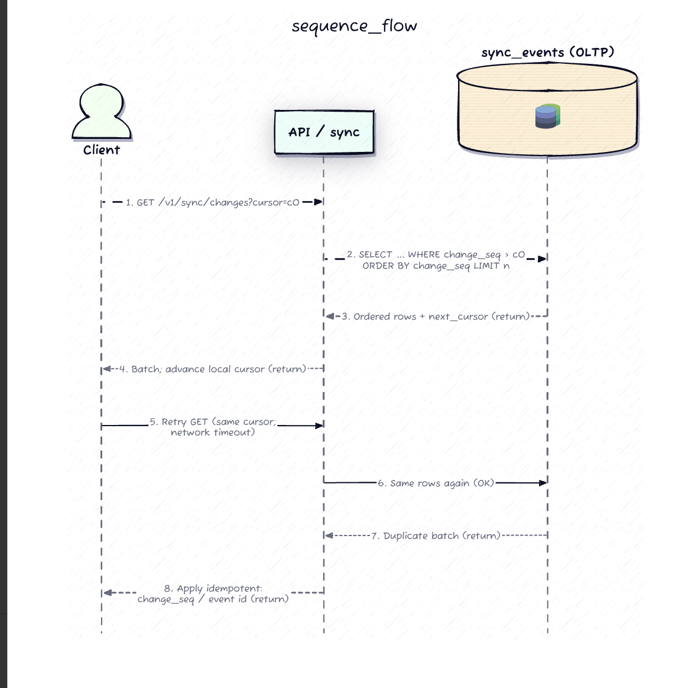
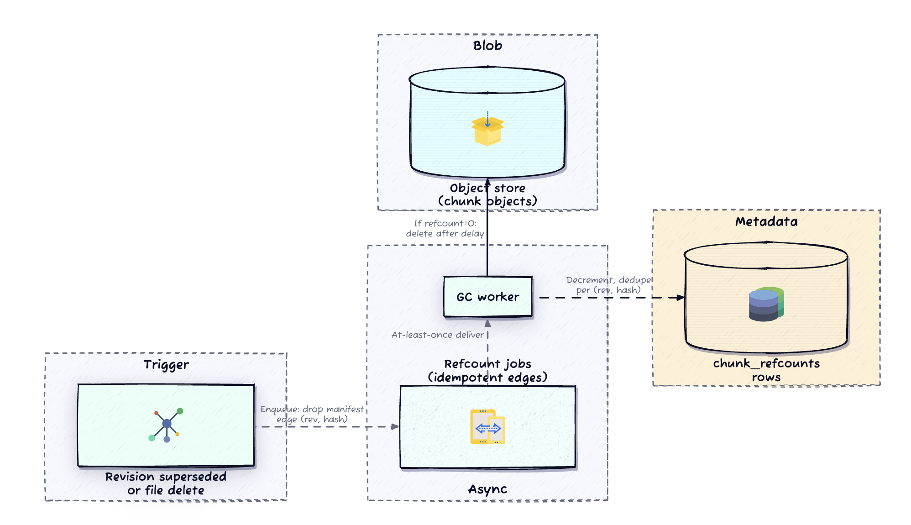
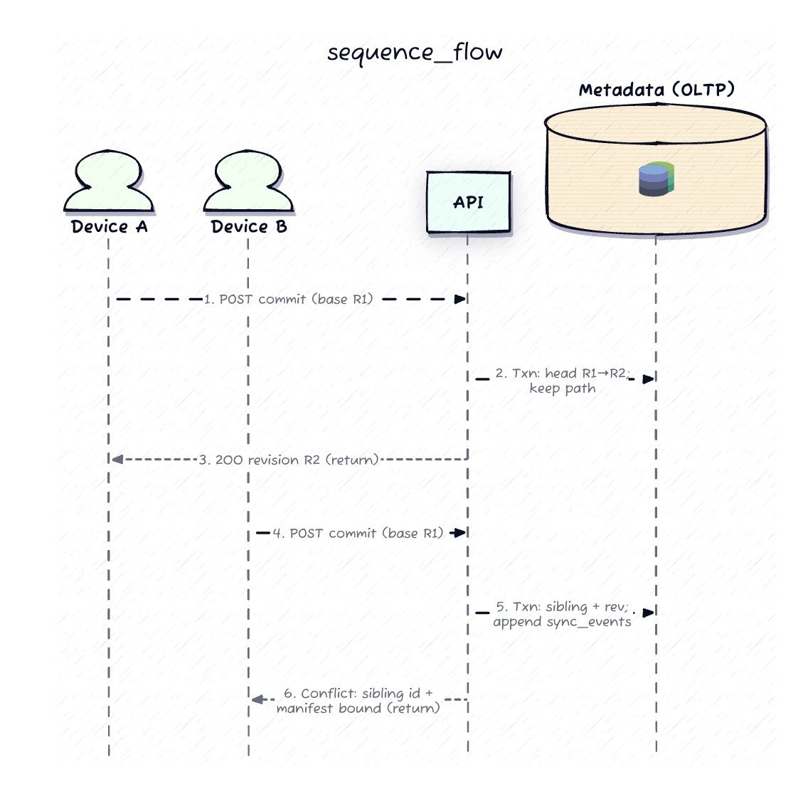
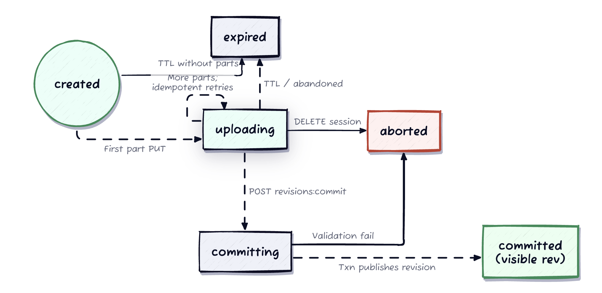

# Design Dropbox — Personal Cloud Drive with Sync

> **Delivery thesis:** *Metadata commit is the publish boundary.* Bytes may exist in object storage long before anyone can see them; nothing enters the user-visible drive until a metadata transaction says so. Every other decision — resumable upload, dedup, GC, conflict siblings, cursor sync — falls out of that one invariant.

---

## 1. Requirements (~5 min)

### Clarifying questions I'd actually ask

**Q: "Is this live co-editing (multiple people typing into one file), or single-writer with offline conflict handling?"**
→ *Single-writer. Conflicts only when one user's own devices edit offline.*
**Takeaway:** This kills OT/CRDT entirely. Conflict resolution reduces to *stale-base detection + deterministic sibling materialization*. I am not merging byte streams.

**Q: "On concurrent offline edits, can one version silently win?"**
→ *No. Both intents must be preserved as a visible conflict copy.*
**Takeaway:** Last-write-wins is off the table. This is *DDIA Ch. 5* territory — LWW is the classic lossy convergence strategy; the requirement forces me to preserve both siblings instead.

**Q: "How does a reconnecting device learn what it missed — push, or cursor poll?"**
→ *Push is a hint. Correctness must come from a replayable cursor poll.*
**Takeaway:** Push is an optimization on latency, never a correctness path. Classic *end-to-end argument* (*DDIA Ch. 12*).

**Q: "Must a dropped 500MB upload restart from byte zero?"**
→ *No. Resumable multipart is required.*
**Takeaway:** Uploads are a stateful session, not one request. That implies session bookkeeping and an orphan-cleanup story.

**Q: "Does every device need identical state simultaneously?"**
→ *Namespace, revisions, and conflict outcomes: strongly consistent in primary region. Bytes: eventual, but read-your-writes for the uploader.*
**Takeaway:** Two different consistency models on two planes — the whole architecture is this sentence.

**Q: "Is dedup a launch requirement or later polish?"**
→ *Hard requirement. 200 PB logical → 60 PB physical.*
**Takeaway:** Dedup means chunks are *shared*. Shared ownership means deletion can't be "delete my bytes" — it must be refcounted.

### Functional Requirements (top 3 prioritized)

1. **Upload/download file content** via resumable multipart sessions + range reads.
2. **Ordered sync** — devices fetch changes since a cursor and apply idempotently after offline.
3. **Conflict preservation** — concurrent writes materialize a deterministic sibling, never overwrite.

*(Below the line: create/rename/move/delete nodes in a personal namespace.)*

### Non-Functional Requirements (quantified)

| # | Requirement | Target |
|---|---|---|
| 1 | **Consistency (split-plane)** | Namespace + revision order + conflict outcomes: **strongly consistent** (single-region primary). Blobs: **eventual**, with read-your-writes for uploader. |
| 2 | **Latency** | p99 < 200 ms for list/resolve/commit; p99 < 300 ms for session control calls. Bulk transfer is throughput-bound, not latency-bound. |
| 3 | **Durability** | Metadata durable on ack. Committed chunks at ~11 nines. **Zero silent data loss on conflict.** |
| 4 | **Scale** | 10M DAU, ~20k peak metadata writes/s, ~100k peak metadata reads/s. |
| 5 | **Cost** | 200 PB logical → 60 PB physical (~2.5× dedup). Dedup is a cost requirement, not polish. |

### On estimation

I won't front-load BOTE math. Two numbers actually change decisions, so I'll use them inline:

- **~2.5× dedup ratio** → forces chunk-level content addressing and refcounts. If this were 1.05×, I'd store whole files and skip the entire GC deep dive.
- **p99 file size ~500 MB vs. avg ~4 MB** → the p99 forces multipart + range reads. The average tells me chunk size lands in the low-MB range (small chunks blow up manifest row count; large chunks kill dedup hit rate).

---

## 2. Core Entities (~2 min)



- **User** — isolation boundary, quota anchor.
- **Device** — physical client; holds a sync cursor, optional push token.
- **Node** — an entry in the folder tree (file or folder). Stable ID, parent pointer, live name.
- **FileRevision** — one published version of a file. Monotonic per-file revision number + manifest pointer.
- **Manifest** — immutable ordered list of chunk hashes + lengths. *The map from file offset → bytes.*
- **Chunk** — immutable, content-addressed blob (keyed by hash). Shared across revisions and users.
- **UploadSession** — multipart bookkeeping; lives outside the namespace until commit.
- **SyncEvent** — append-only, monotonically sequenced published change.

The key structural claim: **a Node is not bytes.** Node → FileRevision → Manifest → Chunks. That indirection is what makes resumability, dedup, conflicts, and safe GC all fit in one design.

---

## 3. API / System Interface (~5 min)

REST. User identity derived from the bearer token — never from the body or path.

### Upload session lifecycle
```
POST   /v1/upload_sessions
       { file_id, expected_bytes }
    -> { session_id, part_size, expiry }

PUT    /v1/upload_sessions/{session_id}/parts/{part_index}
       body: bytes    (idempotent on (session_id, part_index, hash))
    -> { content_hash, received }

DELETE /v1/upload_sessions/{session_id}       // abandon -> orphan cleanup eligible
```

### The publish boundary
```
POST   /v1/files/{file_id}/revisions:commit
       { session_id | manifest, base_revision, Idempotency-Key }
    -> 200 { revision_id, change_seq }
    -> 409 { conflict: { sibling_node_id, sibling_name } }
```
This single endpoint is where the design lives. `base_revision` is the optimistic concurrency precondition (*DDIA Ch. 7* — compare-and-set as the alternative to a transaction that spans the upload).

### Download
```
GET    /v1/files/{file_id}/revisions/{revision_id}/content
       Range: bytes=0-1048575
    -> 302 signed URL(s) | 206 partial content
```
Note it's `revision_id`, not "latest." Range reads resolve against a **frozen manifest**, so a resuming mobile client never re-races the current head.

### Sync
```
GET    /v1/sync/changes?cursor={change_seq}&limit={n}
    -> { events: [...ordered...], next_cursor }
```

### Namespace + devices (compact — supports the contract, doesn't replace it)
```
GET/POST/PATCH/DELETE  /v1/nodes[/{node_id}]
POST                   /v1/devices        // register push token (hint only)
```

---

## 4. High-Level Design (~10–15 min)

### The naive version, and why it breaks



Simplest thing that closes the loop: client watches the filesystem, PUTs the whole file to blob storage, writes a version row to a metadata service; other clients poll for newer versions and download. That works — and then dies three ways:

1. **Full-file re-upload.** Sync cost ∝ file size, not edit size. A one-byte change to a 500 MB file moves 500 MB.
2. **Single PUT has no resumption point.** Drop at 95% = restart at zero.
3. **No conflict semantics.** Two offline devices both write a version row; one silently wins. Requirement violated.

The real design fixes each: **chunked content addressing** (cost ∝ change), **multipart sessions** (resumable), **optimistic base_revision + deterministic siblings** (no silent loss).

### Architecture



**Reading the diagram:** two planes, one narrow handshake. The metadata plane owns *truth* — tree structure, revision order, conflict outcomes, dedup refcounts, sync order. The blob plane owns *bytes* — immutable, content-addressed, dumb. The blob tier never decides folder placement or who won a conflict. Bulk part uploads bypass the gateway to the Upload Service directly (they're throughput-bound; there's no reason to burn gateway CPU proxying 500 MB).

### Flow 1 — Upload + commit



Client creates node → opens session → PUTs parts (parallel, each identified by `part_index`, each returning a `content_hash`) → calls `:commit` with `base_revision`. Server validates part completeness, binds the manifest, inserts `file_revisions`, bumps refcounts for *newly referenced* hashes, appends `sync_events` — **all in one transaction** (*DDIA Ch. 7*). Parts that never reach commit are session-scoped garbage.

The dedup win happens *before* the bytes move: the client hashes locally and asks "do you already have this hash?" A chunk already in the store needs zero transfer — only a refcount bump. That's how a one-byte edit to a 500 MB file uploads one chunk.

### Flow 2 — Download by revision, range reads
Client requests a concrete `revision_id`. Metadata resolves manifest → computes which chunks overlap the requested byte range → translates the outer range into chunk-local offsets → returns signed URLs. Blob tier stays cheap and dumb. Integrity: compare manifest's expected hashes against bytes read. Corruption becomes *diagnosable* rather than mysterious.

### Flow 3 — Sync catch-up



Client sends last persisted cursor → server returns ordered event batch + `next_cursor` → client applies idempotently → advances cursor → repeat until empty batch. Push may prefetch; correctness still comes from the cursor.

### Flow 4 — Conflict
Two devices commit with the same `base_revision`. One wins the path. The loser's manifest gets bound to a **new node under the same parent with a deterministic name**. Both devices converge on the same sibling because the *server* chose the name, not the client.

**Callouts I'd flag and defer:** namespace read cache for listings; sharding `sync_events` by `user_id`; adaptive batch sizing. → Deep Dives.

---

## 5. Deep Dives (~10 min)

### 5.1 Refcounts and safe chunk GC — *the interview killer*



Dedup means a chunk hash is reachable from many manifests across many users. So "delete file" cannot mean "delete bytes."

**The invariant: reference reachability from committed metadata, not "exists in blob store."**

When a revision is superseded or a node is tombstoned, decrement refcounts for hashes no longer reachable from *any* committed manifest. At zero, enqueue physical delete — **after a safety window**.

Three things make this correct:
1. **At-least-once queues** are a given, so decrements must be **idempotent at the edge level** — dedupe on `(revision_id, content_hash)`, not on the hash. Decrementing on hash alone under redelivery drives refcounts negative and deletes live bytes.
2. **The safety window + re-check at zero** protects against a race where a concurrent commit re-references a hash that just hit zero. Cheap insurance; the alternative is a corrupted old revision.
3. **Refcounts never go negative** is a hard invariant, and a negative refcount should page someone — it means the idempotency key is wrong.

> **Aggressive cleanup saves money. Premature cleanup corrupts history.** At 60 PB physical, the money is real — but the asymmetry isn't. Deleted-too-early bytes are unrecoverable; deleted-too-late bytes cost storage rent.

### 5.2 Concurrent commits → deterministic siblings



Two subtleties worth stating out loud:

- **The server names the sibling, not the client.** If clients picked names, two devices observing the same conflict would invent different names and you'd get *divergent siblings* — a convergence bug that's brutal to debug. Determinism here is a *convergence* property, not cosmetics.
- **This is LWW's failure mode, dodged.** *DDIA Ch. 5* frames LWW as achieving convergence by discarding writes. The requirement forbids discarding, so I convert the concurrency into *two visible heads with clear lineage* — sibling materialization instead of merge.

### 5.3 Sync ordering, cursors, and the gap problem

The feed is a **total order per user**, not a bag of events. `change_seq` is monotonic; the cursor is a position in it.

- **Duplicates are allowed. Gaps are not.** Retries can redeliver the last batch; client apply must be idempotent on stable event IDs. "Revision X published on file A" applied twice = same end state.
- **Backpressure shrinks batches; it never drops ranges.** Silently skipping a range is how sync drifts into user-visible lies.
- **Expired/unknown cursor** needs an *explicit* recovery path: serve a fresh snapshot boundary, then restart ordered deltas from there. Never "best effort" a gap.

**Assigning `change_seq` is the sharp edge.** A naive Postgres sequence lets a transaction that grabs seq=100 commit *after* one that grabbed seq=101 — a reader polling in between sees 101, advances its cursor past 100, and **permanently misses that event**. This is the classic non-atomic-visibility trap. Fixes: assign `change_seq` inside the commit txn under a per-user lock (fine — the ordering only needs to be total *per user*, and one user's write rate is tiny), or read the feed via CDC from the WAL (*DDIA Ch. 11* — the log's commit order is the total order, by construction). I'd take the per-user lock and mention Debezium/CDC as the scale-out path.

**Push is a hint, never a source of truth.** Mobile suspends. Desktop sleeps. APNs drops. One correctness path (cursor pull), one latency optimization (push).

### 5.4 Multipart lifecycle and orphan cleanup



Orphan parts are chunks referenced *only* from a session row. **They must never receive refcount bumps until commit** — that's what makes upload staging invisible.

This is why there are **two GC stories, not one**, and conflating them is a common failure:

| | Chunk GC | Session GC |
|---|---|---|
| **Trigger** | refcount → 0 | session past expiry |
| **Driven by** | committed metadata reachability | session state machine |
| **Danger** | deleting bytes a live revision needs | deleting bytes a slow client still intends to commit |
| **Mitigation** | safety window + re-check | expiry policy + session heartbeats |

The bytes are pre-publish in one case and post-publish in the other. Different visibility → different safety story.

### 5.5 Scaling the metadata tier

At 20k writes/s and 100k reads/s, single-primary Postgres is past comfortable. Where I'd go:

- **Shard by `user_id`.** The namespace is per-user; there are no cross-user transactions in scope. This is the rare clean shard key — every invariant (tree acyclicity, revision monotonicity, sync order) is *per-user*, so it lives inside one shard. Cross-shard transactions never arise.
- **Read replicas for listings only.** Browse tolerates lag. Commit's CAS and the sync feed must read the primary — a stale `base_revision` read would let a lost update slip through.
- **Chunk refcount table is the one non-per-user structure** (chunks are shared globally). Shard it by `content_hash` — it's a hash-keyed KV workload with no range scans, so it partitions cleanly (*DDIA Ch. 6*).

---

## Real-World Anchor

**Dropbox's actual evolution** matches this design's spine: content-addressed 4 MB blocks + a separate metadata plane, which is exactly why their **Magic Pocket** migration off S3 was survivable — the blob tier was already dumb and immutable, so swapping it out never touched namespace semantics. That's the payoff for the two-plane split.

**Git** is the same idea with different words: content-addressed blobs, immutable tree objects (manifests), refs as mutable pointers to immutable snapshots, and GC by reachability from refs — not "delete my objects." If you understand `git gc`, you understand §5.1.

**Bytebytego's S3/object-storage breakdown** makes the same point from the other side: object stores are deliberately dumb — immutable, hash-addressable, no transactional semantics. Every system built on one has to put its truth *somewhere else*. That "somewhere else" is this design's metadata plane.

**Kafka/CDC (Debezium)** is the scale-out answer for §5.3: rather than fighting sequence-assignment races in application code, let the WAL's commit order *be* the total order (*DDIA Ch. 11*).

---

## 🔍 Senior-Signal Questions to Ask in Your Interview

- **"Is the sync `change_seq` assigned inside the commit transaction, or by a separate sequence?"** → *Why it matters: surfaces the non-atomic-visibility gap where a reader polls between a lower seq being reserved and committed, permanently skipping an event. It's the single subtlest correctness bug in the design and most candidates never see it.*

- **"Is the refcount decrement idempotency key the hash, or the (revision, hash) edge?"** → *Why it matters: shows you know at-least-once delivery is the default, and that keying on the hash alone drives refcounts negative and deletes live user data under redelivery.*

- **"What's the retention relationship between tombstone lifetime and refcount decrement timing?"** → *Why it matters: probes whether "trash/undo" is a real product promise or an accident. If refcounts drop before the restore window closes, restore silently fails on chunks already GC'd.*

- **"What's the chunk-size policy, and did you pick it for dedup ratio or manifest cost?"** → *Why it matters: dedup shifts cost from bytes to metadata. Small chunks improve the hit rate but explode manifest rows and hash-index memory. Naming the tension shows you're costing the whole system, not just S3.*

- **"When a client's cursor is expired or unknown, what's the documented recovery operation?"** → *Why it matters: distinguishes designs with an explicit snapshot-boundary reset from designs that quietly best-effort a gap — which is how sync tells the user a lie.*

- **"Does the commit path read `base_revision` from a replica?"** → *Why it matters: a one-line question that catches lost updates. Optimistic concurrency read off a lagging replica isn't concurrency control at all.*
