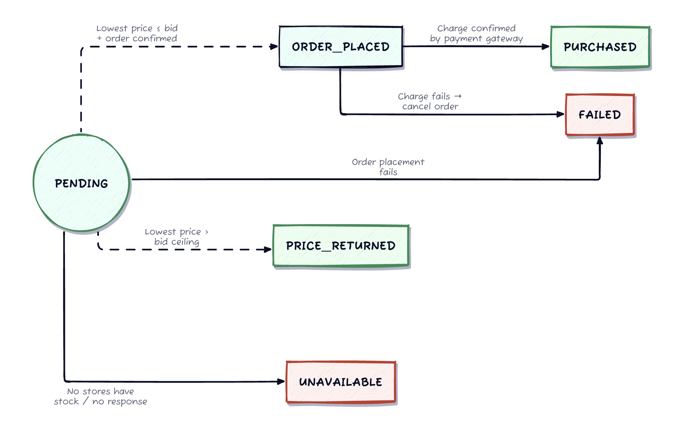
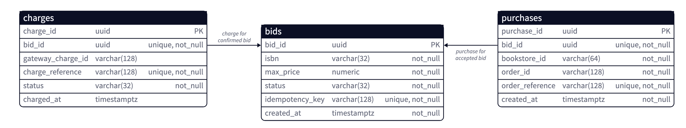
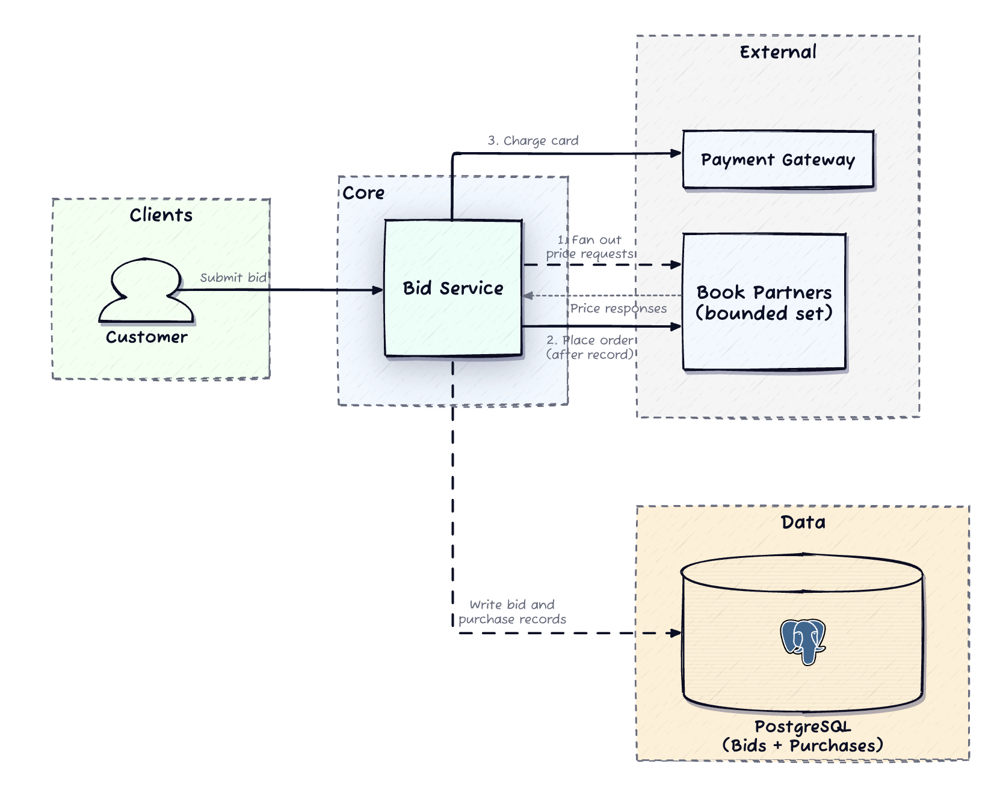
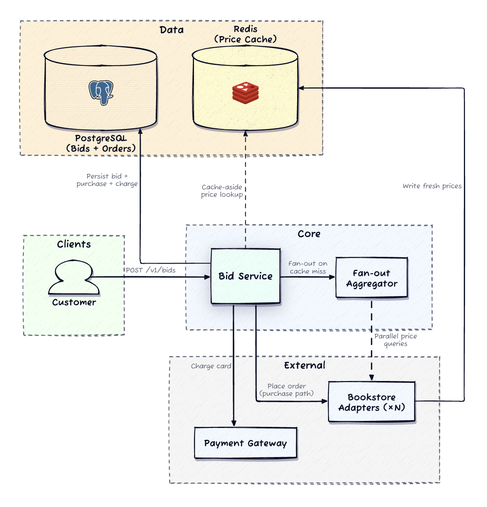
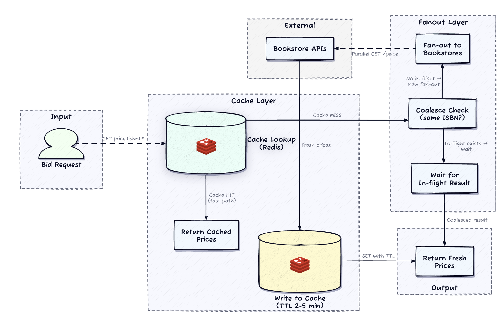
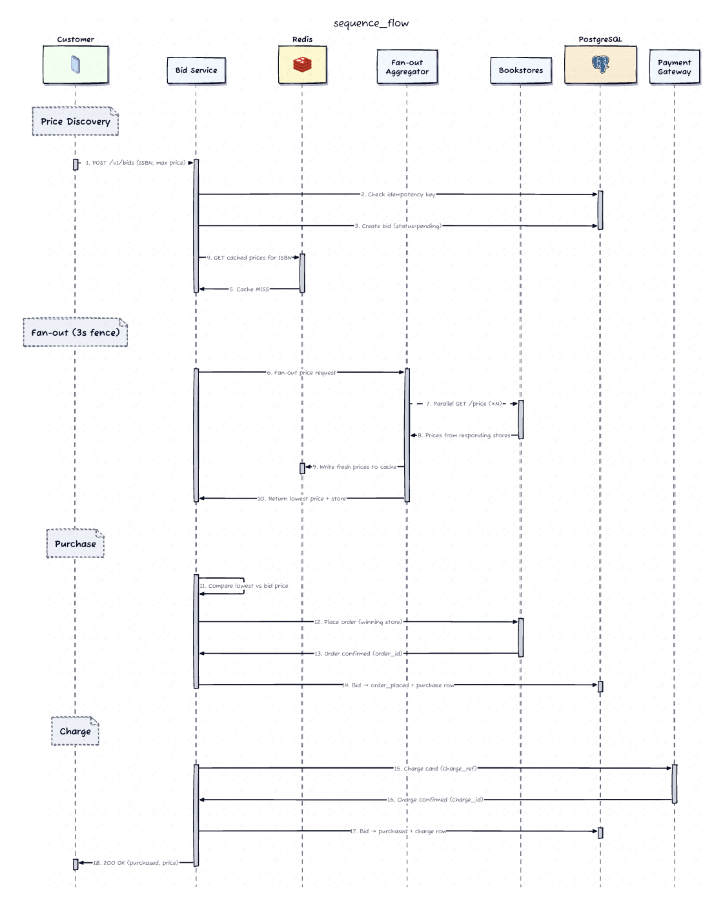
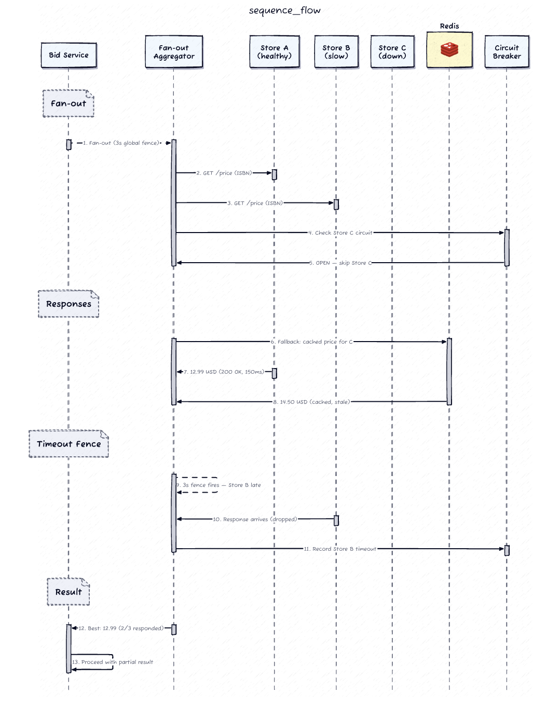
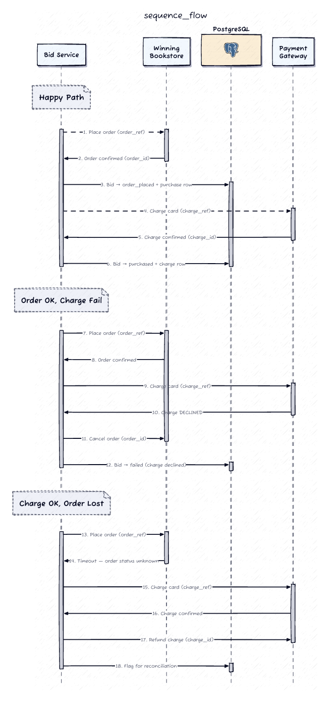

# Design a Book Price Aggregator

> A bid-and-buy service: the customer submits an ISBN, a maximum price (bid), and a payment token. The service fans out to hundreds of partner bookstores, finds the lowest live price, and either **completes the purchase** (if price ≤ bid) or **reports the best price**. The hard part is returning a fast, definitive answer while the real work touches hundreds of unreliable external APIs *and* commits a two-phase order-then-charge transaction that can never double-charge or charge-without-order.

---

## 1. Requirements

### Clarifying questions (the dialogue I'd drive)

| I ask | Interviewer | What it pins down |
|---|---|---|
| Full browse/account experience, or just the bid + aggregation flow? Do we own identity and payment-credential storage? | Just aggregation + purchase-commitment. Caller passes a valid payment **token**. | We don't own users, browsing, or partner onboarding. Scope = bid handling + purchase execution. |
| If some stores time out, return best-so-far or block until every store answers? | Return best available from whoever responds within the time budget. Don't block on the slowest. | Response is bounded by a **global time budget**, not the slowest store. |
| End-to-end latency target? | < 5s at p95. Not instant, but shouldn't feel like it's hanging. | Tight fan-out budget → must aggressively avoid wasted downstream calls. |
| If the order placement succeeds but the charge fails immediately after — cancel, or hold and retry charge? | Cancel the order and report failure. No order without a charge; no charge without a confirmed order. | Rollback is part of the **purchase contract**. |

### Functional requirements (prioritized top 3)

1. **Fan out to 200–500 partner bookstores in parallel** for an ISBN and select the lowest available price.
2. **Conditional purchase**: if lowest price ≤ bid, place an order with the cheapest store *then* charge the card; else return the price. If no store has stock → `unavailable`.
3. **Idempotent, exactly-once purchase** across the order + charge external calls (no double-charge, no charge without a confirmed order).

### Non-functional requirements (quantified)

- **Availability for price queries** — return **partial results** if some stores are slow/down (AP for the read path).
- **Consistency for purchases** — strong; no double-charge, no charge without order (CP for the write path). *This split-personality CAP stance is the spine of the design.*
- **Latency** — bid→response **p95 < 5s** despite fanning out to hundreds of external APIs.
- **Durability** — every completed purchase and charge must survive a crash and be recoverable.
- **Fault isolation** — one degraded bookstore must not block the bid or starve healthy stores.

### Capacity estimation — one number that changes the design

I won't front-load storage/QSS math, but **one** figure is load-bearing:

```
Peak 50 QPS × 500 stores per cache-miss bid = 25,000 downstream HTTP calls/sec
```

That number is why **caching is mandatory, not optional**, and why reducing downstream call volume (cache, coalescing, circuit breakers) is a first-class design concern rather than a footnote. ~50K bids/day, ~5 QPS average, 50 QPS peak — the aggregate is small; the *fan-out multiplier* is the problem.

---

## 2. Core Entities



- **Bid** — the lifecycle anchor. Created `pending`; transitions to `order_placed → purchased`, or `price_returned` / `unavailable` / `failed`. Carries the client `idempotency_key`.
- **Purchase** — written iff an order is confirmed with a store. Links `bid_id → (store_id, order_id, order_reference)`.
- **Charge** — written iff the card charge succeeds. Links `bid_id → (charge_id, charge_reference)`.
- **Bookstore / Adapter** — a partner; the adapter normalizes each partner's external API into one internal contract.
- **PriceCacheEntry** — ephemeral Redis entry `price:{isbn}:{store_id}`, TTL 2–5 min, rebuildable from a fresh fan-out.

**Invariants:** a `charges` row **never** exists without a `purchases` row for the same bid (order-before-charge); bids only move **forward** through the state machine; `idempotency_key` is unique.

PostgreSQL owns the transactional lifecycle (the bid–purchase–charge flow is relational and needs ACID). Redis owns the ephemeral price cache. **If Redis dies, we refetch from stores; if Postgres dies, we cannot accept bids or complete purchases.**


**The recovery query** the reconciliation worker runs on a timer — find bids that ordered but never charged:
```sql
SELECT b.bid_id, b.status, p.order_id, c.charge_id
FROM bids b
LEFT JOIN purchases p ON b.bid_id = p.bid_id
LEFT JOIN charges   c ON b.bid_id = c.bid_id
WHERE b.status = 'order_placed'
  AND b.updated_at < NOW() - INTERVAL '5 minutes';
```

*Postgres over MySQL here is the cleaner interview default — richer concurrency primitives and transactional authority (DDIA Ch. 7, Transactions). Redis over Memcached for per-key TTL + atomic ops that support cache-aside with compare-and-set.*


---

## 3. API / System Interface

Default **REST**, and — importantly — the primary contract is **synchronous**: one request, one definitive answer within the timeout. No polling loop, no webhook, no callback infra. A single recovery-read endpoint covers the "client disconnected after commit" edge case.

**Submit a bid (the core contract)**
```
POST /v1/bids
{
  "isbn":            "978-0134494166",
  "max_price":       29.99,
  "payment_token":   "tok_...",        // never raw card data
  "idempotency_key": "client-uuid"
}

→ 200 { "status": "purchased",       "store_id", "price_paid", "charge_id" }
→ 200 { "status": "price_returned",  "lowest_price", "store_id" }
→ 200 { "status": "unavailable" }
→ 503 { "error":  "service_degraded" }   // zero stores reachable — distinct from unavailable
```

**Recovery read (safety net, not the primary path)**
```
GET /v1/bids/{bid_id}   → current authoritative bid state + outcome
```
Used only when a client times out/disconnects after the server committed but before the response landed. The `idempotency_key` makes a full retry of `POST /v1/bids` safe too — same key → stored result, no new fan-out.

**Internal bookstore adapter (not customer-facing)**
```
GET /bookstores/{store_id}/books/{isbn}/price
→ { price, availability, quote_id }   // quote_id feeds the order step
```
Each adapter is a **thin translation layer** — the aggregator assumes nothing about partner API shapes, so adding a store never touches core fan-out logic (Adapter pattern).

## 4. High-Level Design

The core insight — and the thing that makes this design correct — is that the two responsibilities have **opposite CAP postures** and must be kept separate:

- **Hot path (price lookup):** cached, coalesced, best-effort, AP. Serves most reads without touching a store.
- **Cold path (purchase commitment):** authoritative, exactly-once, CP. Touches only the *single winning* store + the payment gateway, and **re-validates the price** at the source before committing.

You do **not** call all 500 stores on every request. Cached prices serve most reads; only misses trigger real fan-out, and even those are fenced by a timeout.

### Architecture



<br><br><br><br><br><br><br><br><br><br><br><br><br><br><br>


### Flow 1 — cache hit (the fast path, ~100s of ms)

<br><br><br><br><br><br><br><br><br><br><br><br>


Bid service checks Redis for fresh entries for the ISBN. If enough stores are represented, **skip the fan-out entirely**, pick the lowest cached price, compare to bid. For a price-only answer, moderate staleness is fine. *For a purchase, the winning price is re-validated at the store before committing — a stale cache never causes a wrong purchase.*

### Flow 2 — cache miss (fan-out)

<br><br><br><br><br><br><br><br><br><br><br><br>


Bid service triggers the aggregator, which launches parallel HTTP calls via a **bounded in-process thread pool** and sets a **global timeout fence** (e.g. 3s inside the 5s budget). It collects whatever arrives before the fence closes, writes fresh prices back to Redis, then applies the same lowest-price logic.

> **Why an in-process thread pool, not a queue?** A queue adds latency and indirection with no replay benefit — aggregation must finish inside the same synchronous request lifecycle. There's nothing to durably enqueue; the work must complete now or not at all.

### Flow 3 — conditional purchase

If lowest ≤ bid: re-validate at the winning store → place order → **only then** charge. Bid moves `pending → order_placed → purchased`. Full failure matrix in the deep dive. If lowest > bid → `price_returned`; no stock → `unavailable`.

**Callouts deferred to deep dives:** per-store circuit breakers, stale-cache fallback, request coalescing for hot ISBNs, and the exactly-once charge machinery. I flag them here and move on rather than layering them in prematurely.

---

## 6. Deep Dives



I'm driving two, because they're where the system loses money or trust: **downstream failure tolerance** (hundreds of unreliable APIs under a latency budget) and **purchase transaction atomicity** (two external calls that must both succeed or leave a safely recoverable state).

### Deep Dive 1 — Downstream failure tolerance & partial-result aggregation

**The tension:** waiting for all stores gives the best price; returning early gives the best latency. Some stores simply never respond.

**The timeout fence is the whole strategy.** Set a hard global deadline; when it fires, work with whatever arrived. 400 of 500 responded? The best of those 400 is the answer — the customer neither knows nor cares that 100 were slow.

Two additional layers:

- **Per-store timeouts** — even inside the global fence, chronically slow stores get shorter individual deadlines.
- **Per-store circuit breaker** — track failure rate over a rolling window (e.g. >50% failures over 5 min → **open**). While open, stop calling that store entirely for a cooldown, so one degraded partner can't consume thread-pool capacity that healthy stores need. On open, **fall back to that store's last cached price** if present, marked internally *"cached, not live"* so the purchase path knows not to trust it for a real order.

**Degraded-mode policy (explicit):** return a result if **≥1** store responded. If **zero** respond → `503 service_degraded`, which is *deliberately distinct* from `unavailable`. "Unavailable" = no store has the book; "degraded" = we couldn't reach anyone to ask. Conflating them would lie to the customer.

```
   Bid (cache miss)
        │
        ▼
   ┌─────────────────── FAN-OUT AGGREGATOR ───────────────────┐
   │  start global fence (3s)                                  │
   │                                                            │
   │   store A ──200ms──► ✔ price          ┐                    │
   │   store B ──180ms──► ✔ price          │ collected          │
   │   store C ──timeout─► ✗ (per-store)   │ before             │
   │   store D ──[BREAKER OPEN]─► cached★   │ fence closes       │
   │   store E ──1.2s───► ✔ price          ┘                    │
   │   store F ──────────► (still going... fence fires) ✗       │
   │                                                            │
   │   fence CLOSES ──► pick lowest of {A,B,E, D★}              │
   └────────────────────────────┬──────────────────────────────┘
                                 ▼
              ≥1 responded? ──yes──► return best price
                    │
                    no
                    ▼
              503 service_degraded   (≠ unavailable)
```
★ = stale fallback from an open breaker, not usable for a live purchase without re-validation.

*DDIA Ch. 8 (Unreliable Networks): a timeout is fundamentally ambiguous — "no response" can't distinguish a slow store from a dead one, which is exactly why the fence takes a decision instead of waiting for certainty.*

### Deep Dive 2 — Purchase transaction atomicity (order-then-charge saga)



Two external calls, two external systems, each can fail independently. **Four cells, every one needs a defined outcome:**

| Order | Charge | Outcome |
|---|---|---|
| ✔ | ✔ | **Happy path.** Write `charges`, bid → `purchased`. |
| ✗ | — | **Clean.** No money moved. Bid → `failed`, tell the customer. |
| ✔ | ✗ | **Compensate:** cancel the order via `order_id`. If cancel also fails → `failed`, flag for reconciliation. |
| ✔ | timeout/ambiguous | **Refund** via gateway + flag for reconciliation (order maybe placed, ack lost). |

**Why order *before* charge?** A failed charge leaves an order I can cancel for free — a plain API call, no money at risk. A failed order *after* money moved means refunding the customer and explaining a phantom charge on their statement (gateway delays, customer-visible activity). Ordering first minimizes the cases where money has already moved.

**Idempotency is the safety net at every layer:**
- Bid-level `idempotency_key` → retrying the whole `POST /v1/bids` returns the stored result, no new fan-out.
- A unique `order_reference` generated **before** the store call, and a `charge_reference` **before** the gateway call. On a timeout-forced retry, the *same* reference is reused; the external system dedupes it.

**Recoverability comes from the intermediate `order_placed` state.** Postgres is updated after each external call — after order OK, the `purchases` row + `order_placed` are written in one DB transaction; after charge OK, `charges` + `purchased`. If the process crashes *between* order and charge, the reconciliation worker (running that recovery query from §4) finds the stuck `order_placed` bid and retries the charge using the stored `order_reference`.

```
 Bid Service        Winning Store            Payment Gateway         Postgres
     │                    │                        │                    │
     │ re-validate price  │                        │                    │
     ├───────────────────►│                        │                    │
     │  price OK          │                        │                    │
     │◄───────────────────┤                        │                    │
     │ place order        │                        │                    │
     │  (order_reference) │                        │                    │
     ├───────────────────►│                        │                    │
     │  order_id          │                        │                    │
     │◄───────────────────┤                        │                    │
     │        write purchases + status=order_placed (one txn)           │
     ├─────────────────────────────────────────────────────────────────►│
     │                    │      charge card       │                    │
     │                    │      (charge_reference)│                    │
     ├────────────────────────────────────────────►│                    │
     │                    │        charge_id       │                    │
     │◄────────────────────────────────────────────┤                    │
     │        write charges + status=purchased (one txn)                 │
     ├─────────────────────────────────────────────────────────────────►│
     │                    │                        │                    │
     ▼   ─────────────────── failure branches ───────────────────
     charge FAILS   ─► cancel order(order_id); if cancel fails → failed + flag
     charge TIMES OUT ─► refund(charge_reference) + flag for reconciliation
     crash mid-flight ─► worker finds status=order_placed, retries charge w/ order_reference
```

*This is a **saga with compensating transactions**, not a distributed 2PC — DDIA Ch. 9 notes 2PC needs a coordinator with authority over all participants, which we don't have over external stores and gateways. Compensation (cancel/refund) is the only viable atomicity primitive across systems we don't control.*

---

## Other Considerations

- **Cache staleness / invalidation.** TTL is a direct freshness↔load knob. Invalidation is **passive** (TTL expiry → next request refetches) — stores don't push updates and most partners couldn't support a push feed, so we don't build one. Purchases always re-validate at the source; the cache only ever serves the hot read path.
- **Request coalescing (thundering herd on a bestseller).** Per-ISBN **single-flight**: the first cache-miss request triggers the fan-out; concurrent requests for the same ISBN wait on it rather than each firing 500 calls. Collapses `N × 500` → `1 × 500`. Implemented with a short-lived Redis coalescing lock.
- **Adaptive routing & health.** Per-store metrics (latency, error/timeout rates over rolling windows) feed both breaker decisions *and* adaptive timeout allocation — a store that reliably answers in 200ms doesn't need the full 3s per-store budget, freeing time for slower-but-reliable stores.
- **Reconciliation for ambiguous timeouts.** The worst mode: called an external system, got no answer, don't know if it succeeded. The worker scans intermediate-state bids past a threshold, queries the store + gateway for the true outcome, and drives the right compensation. The Postgres audit trail (`order_reference`, `charge_reference`, timestamps) is the authoritative evidence for disputes.

---

## Real-World Anchor

The **hot-read / cold-write split** here mirrors travel-fare and hotel aggregators (Kayak/Google Flights): live-fare fan-out to many unreliable suppliers under a hard latency budget, cached quotes for browse, and a **re-price at booking** step because a cached fare is never trustworthy enough to charge against. The saga-with-compensation for order-then-charge is the same shape Uber and Airbnb use for booking + payment across services they partly don't control — compensate (cancel/refund) rather than attempt distributed 2PC. Bytebytego's payment-system case study makes the same *"reconciliation worker + durable audit trail for ambiguous timeouts"* point: the ledger, not the in-flight call, is the source of truth.

---

## 🔍 Senior-Signal Questions to Ask in Your Interview

- **"Is the timeout fence fixed, or adaptive to observed store latency distributions?"** → *Signals you see the fence as a tunable availability/completeness tradeoff, not a magic constant — and that p95 store latency should drive it.*
- **"For the ambiguous charge-timeout, do we refund-and-flag immediately or hold a grace period to let the gateway ack land?"** → *Shows you understand that eager refunds on a slow-but-successful charge create their own reconciliation churn and customer confusion.*
- **"Does the single-flight coalescing lock need a fencing token, or is a double-fan-out merely wasteful rather than incorrect?"** → *Distinguishes correctness-tier from efficiency-tier locking — a double fan-out just duplicates work, so a plain Redis lock is fine here (unlike the purchase path).*
- **"What isolation level guards the bid state transitions under concurrent reconciliation + client retry?"** → *Surfaces the race between the worker retrying a charge and a client retry hitting the same bid; conditional writes / `ON CONFLICT` on state make transitions safe.*
- **"At what store count or QPS does the in-process thread-pool fan-out stop scaling, and what replaces it?"** → *Names the scaling inflection point — thread-per-call caps out; async I/O / event loop per bid service is the next step before you'd ever reach for a queue.*