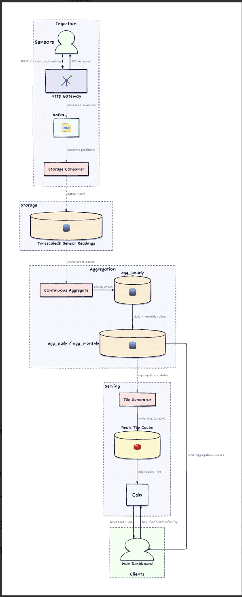
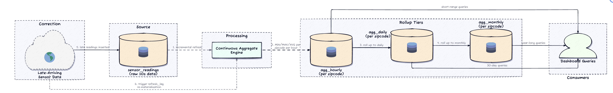
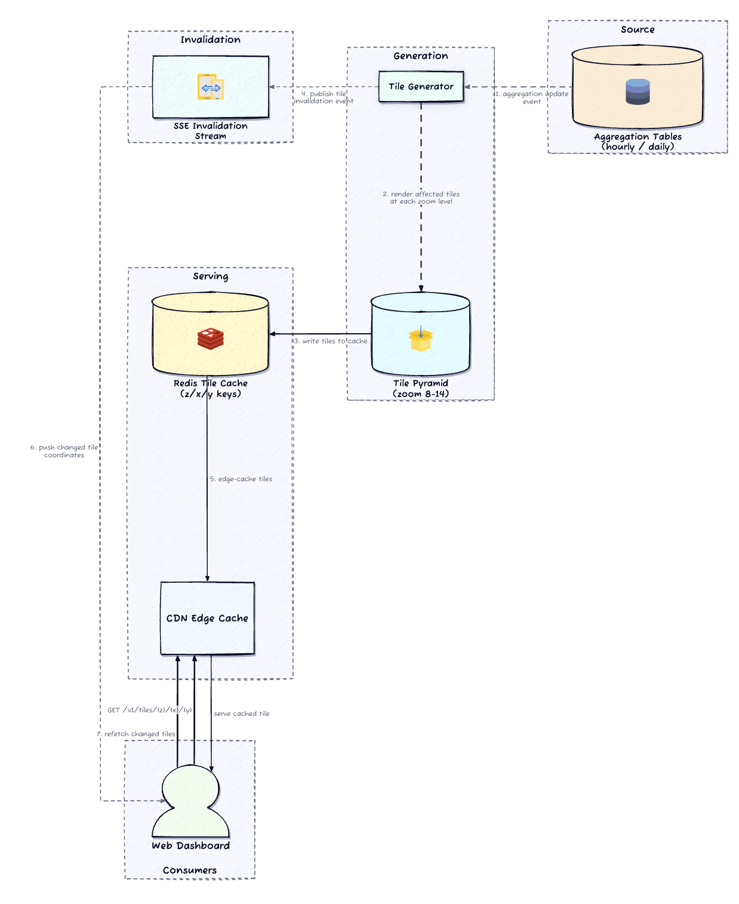

# Design a Real-Time Temperature Monitoring System

> **The one-line thesis:** *Nobody queries the raw readings on the hot path.* Every dashboard request — tile or range query — hits a pre-computed rollup or a cached tile. The system is really **three independent pipelines** (ingest, aggregate, serve) glued by a durable buffer, and the raw time-series row is the only thing the system trusts as legal truth.

---

## 1. Requirements

### Clarifying questions (the dialogue that shapes the design)

| I ask | Interviewer says | Why it matters |
|---|---|---|
| Do dashboards ever need *per-sensor* history, or is **zipcode-level aggregation** the finest exposed unit? | Zipcode aggregates are the finest unit. No raw per-sensor timelines on the public path. | Kills high-concurrency raw scans on the hot path. We optimize reads entirely around **geographic cell aggregates**. |
| Is the **30-second heatmap freshness** firm, or can it lag under ingest pressure? | 30s is the target under normal load. | Sets a streaming/aggregation freshness budget → **no heavy batched DB queries** on the refresh cycle. |
| When thousands of sensors recover from an outage and dump buffered readings at once, is **data loss** acceptable? | No. All valid events must be buffered and ingested. | Forces **ingest decoupled from processing** — an async queue absorbs spikes. This is the load-bearing decision. |
| If a reading arrives **after** its hourly rollup was computed, must aggregates update? | Yes — eventual accuracy required. | Rollups are **eventually consistent**; buckets must be *correctable*, not immutable. |
| If a tile can't be regenerated within the freshness window, serve **stale-with-indicator** or **block**? | Serve stale + freshness indicator. Blocking makes the map unusable during the events that matter most. | **Availability > freshness** on the read path. Reads never block on regeneration. |

### Functional requirements (prioritized)

1. **Ingest** sensor temperature readings at 10-second intervals via HTTP.
2. **Heatmap**: near-real-time temperature heatmap on a web dashboard.
3. **Range queries**: min/max (and avg) per **zipcode** over day/month/year; plus **statewide** min/max.

### Non-functional requirements (quantified)

- **Ingest scale**: 100K writes/sec @ 1M sensors → 1M writes/sec @ 10M sensors, **no architectural change**.
- **Durability**: *zero data loss* on the ingest path through transient backend failures (this is a hard constraint, not a nicety).
- **Read latency**: tiles **p99 < 200 ms**; aggregation queries **p99 < 500 ms**.
- **Freshness**: new readings visible on the heatmap **within 30 s**.
- **Retention**: raw 10-s data **≥ 30 days**; rollups for **years**.
- **Availability > freshness** on reads (serve stale tiles with an indicator).

### Estimation — only the numbers that change a decision

I won't front-load QPS math just to conclude "it's a lot." The one number that *forces architecture*:

> **8.6B rows/day** (1M sensors × 8,640 readings/day). At ~40 B/row that's **~250 GB/day raw → ~7.5 TB over 30 days.** A single zipcode accumulates **~260M rows/month**.

That single figure is why **pre-computed multi-resolution rollups are mandatory, not optional** — a 30-day zipcode query scanning ~260M rows cannot hit a 500 ms p99. The rollup pyramid turns that into a **30-row** read.

---

## 2. Core Entities

- **Sensor** — provisioned once; fixed `(location, zipcode)`. The static registry.
- **Reading** — `(sensor_id, timestamp, temperature)`. The authoritative truth; ~40 bytes.
- **Rollup** — derived min/max/avg per `(zipcode, time_bucket)` at hourly / daily / monthly resolution. Rebuildable from raw.
- **Tile** — pre-rendered heatmap image/vector keyed by `(z, x, y)`. Ephemeral; lives in cache.

**The authoritative boundary is intentionally narrow.** After a crash, the raw reading is the *only* row trusted as legal truth. Aggregates, tiles, and dashboard state are all reconstructable from raw within the 30-day window. *(DDIA Ch. 11 — derived data: rollups and tiles are materialized views over the raw log; the log is the source of truth.)*

---

## 3. Data Model

```sql
-- Static registry (infrequent writes): maps device → geography
sensors(sensor_id PK, zipcode, lat, lng, status, last_seen)

-- Write-hot hypertable, time-partitioned in ~1-day chunks
sensor_readings(sensor_id, timestamp, temperature, received_at,
                UNIQUE(sensor_id, timestamp))   -- dedup primitive

-- Continuous aggregates (materialized, incrementally refreshed)
agg_hourly (zipcode, bucket, min_temp, max_temp, avg_temp)
agg_daily  (zipcode, bucket, min_temp, max_temp, avg_temp)
agg_monthly(zipcode, bucket, min_temp, max_temp, avg_temp)
```

**Two invariants the schema protects:**

1. **No duplicate readings.** `UNIQUE(sensor_id, timestamp)` makes retried POSTs and consumer replays idempotent — they can't double-count in aggregations. This is the reliable idempotency primitive; the write path leans on the constraint, not on client-generated keys. *(DDIA Ch. 12 — idempotence as the foundation of exactly-once effects over an at-least-once transport.)*
2. **Rollup correctness.** Continuous aggregates must reflect *all* raw readings in their materialization window — including a late arrival that lands after the hourly boundary passed. The refresh pass must sweep back far enough to catch it.

**Indexing/partitioning.** Raw hypertable partitioned by time (1-day chunks) → dropping expired data is a **metadata operation**, not a 8.6B-row delete. Composite `(sensor_id, timestamp)` index inside each chunk serves dedup on ingest. Aggregation tables indexed by `(zipcode, bucket)` for the dashboard path.

---

## 4. API / System Interface

The contract splits cleanly: **sensor side is write-only fire-and-forget; dashboard side is read-only served entirely from derived data.**

```
POST /v1/sensors/readings          → 202 Accepted (buffered, NOT yet stored)
  body: { sensor_id, readings: [ {timestamp, temperature}, ... ] }

GET  /v1/tiles/{z}/{x}/{y}         → pre-rendered tile from cache (ETag, CDN-fronted)
GET  /v1/aggregations/{zipcode}?start&end&resolution=daily|hourly|monthly
GET  /v1/aggregations/statewide?start&end
SSE  /v1/tiles/updates             → tile-invalidation stream (server → browser only)
```

**Design-relevant contract notes:**

- **`202`, not `201`.** The 202 means *durably buffered in Kafka*, not *written to the store*. This decoupling is what absorbs burst traffic without dropping data or stalling the fleet.
- **Idempotency via natural key.** Dedup is `(sensor_id, timestamp)` — the sensor need not mint an idempotency key. Retried POSTs and consumer replays collapse at the storage uniqueness constraint.
- **Don't trust client clocks.** Gateway records a server-side `received_at` alongside sensor `timestamp`, and rejects readings > 10 min in the future or > 24 h in the past. This lets late-arrival analysis separate clock drift from genuine network delay.
- **SSE over WebSocket** — traffic is strictly one-directional (server pushes invalidations; browser never replies on this channel). WebSocket adds bidirectional connection complexity for a capability we don't need.
- **Push, not pull.** Polling 1M low-cost endpoints means tracking readiness and holding connections these devices can't support. Push is stateless and the sensor knows when it has data.

---

## 5. High-Level Design

### Start with the naive version (and watch it break)

The minimal system: one Monitoring Service + PostgreSQL. Sensors `POST` raw readings; the service **synchronously** inserts into a flat table; the dashboard `GROUP BY zipcode` on the fly.

This is correct for a small fleet and **hits a physical ceiling immediately at scale**: 100K synchronous inserts/sec saturates disk I/O, while concurrent dashboards trigger blocking scans over billions of rows to compute averages. Two forces collide on one datastore: a write storm and heavy aggregate reads.

**The fix is to separate ingest rate from storage rate, pre-compute rollups, and serve the map as cheap cached tiles** — three pipelines that scale and fail independently.

### The architecture



Reading left→right traces the data lifecycle. Three flows:

**Flow 1 — Ingestion.** Sensors `POST` batches → Gateway validates → **produces to Kafka (partitioned by zip prefix)** → returns `202` immediately. A pool of **storage consumers** reads partitions and **batch-inserts** into the TimescaleDB raw hypertable. *Why Kafka:* it decouples ingest rate from storage rate and provides durability through transient DB failures — a fallen-behind consumer resumes from its committed offset and replays the gap, losing nothing. *(DDIA Ch. 11 — the log as a durable, replayable buffer; Ch. 5 — partitioned consumer groups.)*

**Flow 2 — Aggregation.** **TimescaleDB continuous aggregates** incrementally materialize hourly rollups from raw, daily from hourly, monthly from daily — no separate Flink/Spark cluster, because the logic is just MIN/MAX/AVG grouped by `(zipcode, bucket)`. A "max temp in 98101 over 30 days" query reads **30 daily rows** instead of scanning ~260M raw rows.

**Flow 3 — Serving.** The **tile generator** consumes aggregation change events, re-renders only affected `(z,x,y)` tiles into **Redis** (CDN-fronted), and publishes an **SSE invalidation**. Clients refetch only changed tiles. Total path — sensor interval + aggregate + tile render — lands the heatmap within ~30 s **without polling**.

**Why it holds together:** each path solves a different problem and scales independently — ingest absorbs bursts without touching reads; aggregation compresses 8.6B rows → a few thousand; serving turns "query 1M points" into "fetch one cached tile." A slowdown in one path does not cascade.

**Storage choice — TimescaleDB over InfluxDB.** The queries are naturally SQL: `GROUP BY zipcode, time_bucket(...)`. Hypertables give automatic time-partitioning (chunk management) so 100K inserts/sec needs no manual sharding, and **continuous aggregates put incremental rollups inside the DB**. InfluxDB wins only if queries were pure time-series without geographic grouping — but zipcode aggregation needs joins/GROUP-BY semantics that are cleaner in SQL than InfluxQL. **Kafka over Kinesis** unless the shop is AWS-deep — the partition/consumer-group model is the cleaner default for this pipeline shape.

---

## 6. Deep Dives

Three places this system actually gets hard. Generic caching/sharding are already woven into the pipeline story and don't need standalone treatment.

### 6.1 Multi-resolution rollups — the topic's unique hard part

The pyramid progressively compresses: **360 raw readings/sensor/hour → 1 row/zipcode/hour → daily → monthly.** A 30-day query hits 30 daily rows; a year hits 12 monthly rows. Continuous aggregates refresh each bucket within *minutes* of its close, so the pyramid stays near-real-time without an orchestration framework. Cost: extra write work on the aggregate path + a configurable refresh lag (5–10 min is fine here since the heatmap freshness budget is 30 s and these are separate concerns).

**The genuinely hard part: late-arriving data.** A sensor reconnecting after an hour offline dumps readings into *already-materialized* buckets.



**Mechanism:** the `refresh_lag` parameter controls how far back materialization re-checks for new data. Set it to the max expected late-arrival window (**4–6 h**) and the system self-corrects with no manual step; the correction cascades hourly→daily→monthly. A wider window costs more refresh work, but the scan is cheap because *most buckets haven't changed*. For data older than the lag window (>6–12 h), a **manual targeted refresh** re-materializes the range — SLA target: 1 h for a single day, 4 h for a full month. An **audit log** records which buckets changed and the Δ from the original; a swing beyond a threshold (e.g. >2°C in a daily min/max) flags for human review.

### 6.2 Heatmap tile serving — a spatial serving problem, not a DB query



The browser can't render 1M points and the backend can't query 1M latest readings per page load. A **tile pyramid** converts this into a caching problem: divide the region into a grid at zoom levels 8–14. Zoom 8 = whole state in a handful of tiles; zoom 14 = a few city blocks at near-sensor resolution. WA across z8–14 is **~20K–30K tiles**, ~50–100 KB each → a few GB of Redis with TTLs.

**The key decision is *when* tiles regenerate.** Event-driven, not timer-driven: the tile generator consumes aggregation change events, computes which tiles the changed geographic extent touches, and re-renders **only those**. Compute scales with *data change rate*, not total tile count; latency depends on event propagation, not a fixed clock. Cost: the aggregation layer must emit change events with geographic scope. On the read side, tiles carry **ETags** so browsers skip unchanged transfers, and **availability wins** — if a tile is stale, serve it with a freshness indicator rather than block.

### 6.3 Ingestion resilience — burst recovery is the real test

Steady state (100K/s) is easy. The hard scenario: a regional outage resolves and **10K sensors each dump ~360 buffered readings → 3.6M messages in seconds (~36× normal)**.

Kafka absorbs it: producers write to partition leaders with minimal latency, the broker durably stores before consumers process, and the **consumer group drains the backlog at its max sustainable rate rather than matching the burst** — back-pressure by design. **Partitioning by geographic region** ensures a burst in one area doesn't starve consumers for other regions. If the cluster itself saturates, the gateway returns **503** and sensors retry with exponential backoff; because sensors buffer locally, a brief 503 causes sensor-side buffering, not loss. The `(sensor_id, timestamp)` constraint mops up duplicate retries.

**Kafka durability config for the zero-loss requirement:** `acks=all` + `min.insync.replicas=2` + `replication.factor=3` + `unclean.leader.election.enable=false`. *(DDIA Ch. 8–9 — this combination is what makes the "202 = durable" promise real; without `acks=all` a leader crash silently drops the acknowledged-but-unreplicated tail.)*

---

## 7. Other Considerations

- **Fleet health.** With 1M sensors, some fraction is always dead/drifting. Dead-sensor sweep marks `stale` when a sensor misses 3× its interval; drift detection flags physically impossible readings or persistent divergence from the zipcode mean and **excludes them from aggregation** until reviewed. If a whole zipcode goes dark, the tile shows *missing data* rather than interpolating from distant neighbors.
- **Retention economics.** Raw = 250 GB/day → 7.5 TB/30d. Rollups are trivially small (~14.4K hourly + 600 daily + 600 monthly rows/day → **<1 GB/year**). Expired chunks drop as metadata; cold chunks compress 10–20× to object storage. **Size the cluster for write I/O, not storage volume** — that's the real cost driver.
- **Silent degradation is the #1 operational risk** — not a crash. A stale heatmap looks normal until someone notices it's 20 minutes old. First alert to wire up: **aggregation freshness** (`now − latest materialized bucket`). Then **Kafka consumer lag** (leading indicator of ingest trouble) and **tile-generation latency**.

---

## Real-World Anchor

This is the same spine as **Uber's marketplace heatmaps** and weather-tile services: a **tile pyramid over slippy-map coordinates** served from cache/CDN, fed by a pre-aggregated store rather than live point queries — exactly the pattern Bytebytego describes for geo-visualization at scale. The ingest half mirrors **Discord's message-fanout durability model** (per the Bytebytego case study): a durable partitioned log absorbs bursts and lets consumers replay from offset, so an acknowledged event is never lost even when the storage tier stalls. The rollup pyramid is the **materialized-view / Lambda-lite** pattern — raw log as truth, derived layers rebuilt on demand.

## DDIA Chapter References

- **Ch. 5 (Replication)** — Kafka replication + `min.insync.replicas`; partitioned consumer groups.
- **Ch. 6 (Partitioning)** — geographic (zip-prefix) partitioning of the ingest topic and its hot-spot implications.
- **Ch. 8–9 (Trouble / Consistency)** — `acks=all` + no-unclean-leader-election as the real basis of the "202 = durable" promise.
- **Ch. 11 (Stream Processing)** — the log as durable replayable buffer; continuous aggregates as incrementally maintained materialized views.
- **Ch. 12 (Future of Data Systems)** — idempotence via natural key; raw log as source of truth with rebuildable derived state.

---

## 🔍 Senior-Signal Questions to Ask in Your Interview

- **"Is zipcode the finest exposed granularity, or will product later want per-sensor drill-down?"** → *Why it matters: it decides whether 8.6B daily rows can be rolled up aggressively or must stay queryable at sensor granularity — the single question that shapes the whole read path.*
- **"What's our late-arrival window, and how far back should `refresh_lag` sweep?"** → *Why it matters: signals you understand rollups are eventually consistent and that the refresh-window-width vs. recomputation-cost trade-off is a tunable, not a default.*
- **"Do we partition Kafka by zip prefix or by sensor_id?"** → *Why it matters: zip-prefix isolates regional bursts but can create hot partitions for dense metros; sensor_id spreads load but scatters a region's readings — a real hot-spot vs. locality trade-off.*
- **"What exactly does the 202 promise — buffered, or replicated?"** → *Why it matters: separates transport ack from durability; the honest answer is "durable only with `acks=all` + `isr≥2`," which is the difference between zero-loss and silent tail-loss on leader failure.*
- **"What's our leading indicator that freshness is about to break?"** → *Why it matters: naming consumer-lag / aggregation-freshness as the alert (before users see stale tiles) shows you optimize for silent degradation, the actual failure mode here.*