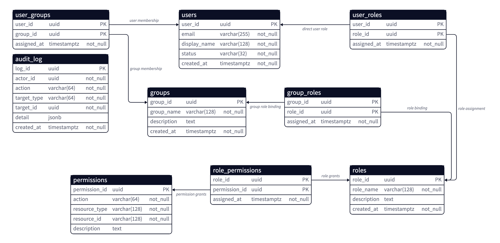
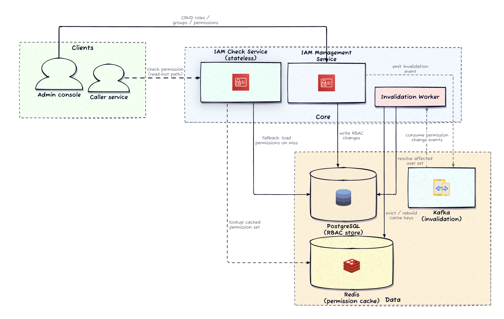

# Design an Access Management System (IAM / RBAC)

> **The thesis:** *You never walk the permission graph on the hot path. You materialize each user's effective permission set, cache it, and treat every management write as a cache-invalidation event.* The check path is a lookup, not a computation.

An **Identity & Access Management (IAM)** system answers one question on the critical path of every authenticated request: *"Can user A perform action S on resource X?"* — allow or deny, in single-digit milliseconds. Behind that gate sits an admin surface for managing users, groups, roles, and permission bindings without touching application code.

The system has **two surfaces with fundamentally different profiles**, and the entire design falls out of keeping them separate:

| | Check path | Management path |
|---|---|---|
| **Callers** | every downstream service, every request | admins, low volume |
| **Optimize for** | latency + availability | consistency + auditability |
| **Consistency** | bounded staleness (seconds) | strongly consistent |
| **Failure stance** | serve last-known state | fail the write, don't corrupt |

---

## 1. Requirements

### Clarifying questions (the dialogue that scopes the problem)

| You ask | Interviewer says | Takeaway |
|---|---|---|
| RBAC only, or attribute-based conditions (time of day, request context, ownership) evaluated at check time? | **RBAC only.** Users → groups → roles → permissions. No request-time conditions. | It's a **static graph resolution** problem, not a request-time policy engine. The read path can be fully precomputed. |
| Latency budget on the check? Single-digit ms, or is tens of ms fine? | **< 10 ms p99.** Callers treat it as a local function call. | The hot path cannot afford request-time graph traversal. Materialization is mandatory. |
| When an admin revokes a role, how fast must that be visible on the check path? Seconds or minutes? | **Seconds.** A revoked permission must not stay silently active. | Passive TTL expiry alone is insufficient — need **active invalidation** with fast propagation, especially for large groups. |
| If the check service can't reach its store, block all decisions or fall back? | **Don't block** — blocking takes the whole platform down. Prefer bounded staleness over denying everything. | Availability on the check path beats strict freshness. Need a **bounded-staleness fallback**, not a fail-closed dependency on the primary store. |

### Functional requirements (top priorities)

1. **Check:** given `(user, action, resource)`, return **allow / deny**.
2. **Manage:** CRUD on roles (permission bundles), groups, memberships, and bindings — forming the RBAC inheritance chain `user → group → role → permission`, plus a **direct `user → role`** shortcut.
3. **Introspect:** resolve a user's full **effective permission set** (through all chains) for debugging and audit.

*Out of scope (stated explicitly):* attribute-based / policy conditions, request-context evaluation.

### Non-functional requirements (quantified)

- **Latency:** check completes in **< 10 ms p99** — it's on every request.
- **Availability:** **≥ 99.99%** on the check path. A down permission service blocks every downstream service.
- **Consistency:** management writes **strongly consistent**; check reads tolerate **seconds** of staleness, never minutes.
- **Propagation:** permission changes reach the check path **within seconds** — revoked access must not silently persist.
- **Auditability:** every mutation logged for compliance.

### Scale (and why each number matters)

| Metric | Value | Drives |
|---|---|---|
| Check QPS (peak) | **100K** | A per-request 6-table join is not viable → cache layer required |
| Users | 100K | Sizes the per-user permission cache in Redis |
| Groups | 10K | **Blast radius** when a group-role binding changes |
| Roles / rules | 1K / 10K | RBAC graph fits comfortably in a **single Postgres instance** |
| Latency target | < 10 ms p99 | Forces the materialized-cache design |
| Propagation | seconds | Sets the staleness bound for invalidation |

> **The key tension the numbers expose:** the authoritative graph is *small* (fits one Postgres box), but the read volume is *enormous* (100K QPS). That gap — small truth, huge read fan-out — is exactly what a materialized cache closes. And with variable group sizes, a single group-role change can invalidate thousands of cached entries, so **invalidation blast radius is the hard problem**, not storage.

---

## 2. Core Entities




- **User** — the identity anchor. Holds no permissions directly; access is always *resolved*.
- **Group** — organizational unit (team / dept / project). Aggregates users; holds roles.
- **Role** — a named permission bundle (`editor`, `billing-admin`). The **assignable currency** of RBAC.
- **Permission** — the atomic unit: `(action, resource_type, resource_id)`. `resource_id = *` is a wildcard across all instances of the type.
- **Effective Permission Set** — the *derived* set of triples a user holds after resolving all chains. This is what gets materialized.

Four junction tables encode the many-to-many edges: `user_groups`, `group_roles`, `role_permissions`, and `user_roles` (the direct shortcut).

---

## 3. Data Model

**The authority boundary is the most important line in the design:** *only committed rows in Postgres are authoritative.* The materialized sets in Redis are **derived data, rebuildable from Postgres at any time.** If Redis is lost, the correct state is whatever Postgres says.

```
┌─────────────┐        ┌──────────────┐        ┌─────────────┐
│   users     │        │    groups    │        │    roles    │
│  id (PK)    │        │   id (PK)    │        │   id (PK)   │
└──────┬──────┘        └──────┬───────┘        └──────┬──────┘
       │                      │                       │
       │  user_groups         │  group_roles          │
       ├──────────────────────┤───────────────────────┤
       │  (user_id,           │  (group_id,           │
       │   group_id)          │   role_id)            │
       │                      │                       │
       │  user_roles  ────────┼───────────────────────┤  (direct shortcut)
       │  (user_id, role_id)  │                       │
       │                      │                 role_permissions
       │                      │                 (role_id, permission_id)
       │                      │                       │
       │                      │              ┌────────┴────────┐
       │                      │              │   permissions   │
       │                      │              │  id (PK)        │
       │                      │              │  action         │
       │                      │              │  resource_type  │
       │                      │              │  resource_id    │  ('*' = wildcard)
       │                      │              └─────────────────┘
```

### The effective-permission query (the "truth" the cache projects)

```sql
-- Chain 1: through groups
SELECT DISTINCT p.action, p.resource_type, p.resource_id
FROM permissions p
JOIN role_permissions rp ON rp.permission_id = p.id
JOIN group_roles gr      ON gr.role_id       = rp.role_id
JOIN user_groups ug      ON ug.group_id      = gr.group_id
WHERE ug.user_id = :user_id
UNION
-- Chain 2: direct user → role
SELECT DISTINCT p.action, p.resource_type, p.resource_id
FROM permissions p
JOIN role_permissions rp ON rp.permission_id = p.id
JOIN user_roles ur       ON ur.role_id       = rp.role_id
WHERE ur.user_id = :user_id;
```

Correct — but **six-table join per check × 100K QPS saturates Postgres**. So this query is a **rebuild mechanism, not a hot-path operation.** Everything downstream is a projection of this join.

*DDIA Ch. 3 (storage & retrieval) and Ch. 2 (relational graph modeling): the junction-table graph is the normalized source of truth; the cached set is a denormalized derived view optimized for reads.*

---

## 4.  API / System Interface

Two surfaces, two contracts.

### Check (hot path)

```
POST /v1/authorize
{ "user_id": "u_abc", "resource_id": "doc_123", "action": "read" }
→ { "decision": "allow", "granted_by": "role:editor" }   // metadata optional
```

**Why POST, not GET?** The body grows (resource type, environment tags) without hitting URL-length limits. The operation is still **idempotent and side-effect-free** — a POST-shaped read. Derive `user_id` context from the request, but the *identity being checked* is an explicit argument here because a service is asking on behalf of a user (this is a service-to-service authz query, not the caller authenticating itself).

### Management (cold path — all durable-before-ack, all emit invalidation)

```
POST   /v1/roles/{roleId}/permissions      // the core write: bind permission → role
POST   /v1/roles                           // create role
POST   /v1/groups                          // create group
POST   /v1/groups/{groupId}/members        // add user → group
POST   /v1/groups/{groupId}/roles          // assign role → group
GET    /v1/users/{userId}/effective-permissions   // admin introspection (may hit PG directly)
```

**Recovery contract (make this explicit — it's a senior signal):** on a cache miss or Redis outage, the check service falls back to the direct Postgres query — correct but slower. The system **never serves a stale cached `allow` after a known miss**: it either resolves from the DB or errors. Clients retry with backoff.

> **Interview tip:** spend your time on the `/authorize` contract and the two-surface split. Interviewers rarely drill group CRUD — name those endpoints and move on.

---


## 5. High-Level Design

### The naive baseline (state it, then beat it)

The minimum workable system: a stateless check service that runs the UNION query directly against Postgres on every request. Correct, and fine at low traffic. Three gaps appear the instant you scale:

1. **100K QPS × 6-table join** → connection-pool saturation, blows the 10 ms p99. → need a **materialized cache**.
2. Any role/binding update **invalidates the cached view** → need **invalidation propagation** to all serving nodes.
3. Hierarchical resources (folder grants all files) make the join tree **unbounded** → need an explicit bounding strategy.

### The architecture

```
                          POST /v1/authorize
   ┌──────────┐                  │
   │Downstream│──────────────────┤
   │ services │                  ▼
   └──────────┘          ┌───────────────┐   SISMEMBER (hit)    ╔═══════════╗
                         │  IAM CHECK    │═════════════════════▶║   REDIS   ║
                         │  service      │◀════════════════════ ║  perm:{u} ║
                         │  (stateless)  │   set (miss→backfill) ║  as SET   ║
                         └───────┬───────┘                       ╚═══════════╝
                                 │ cache miss / Redis down            ▲
                                 │  fallback: UNION query             │ DELETE perm:{u}
                                 ▼                                    │  (evict)
                         ╔═══════════════╗                    ┌───────┴────────┐
                         ║  POSTGRESQL   ║                    │  INVALIDATION  │
                         ║  (authority:  ║◀───resolve         │    WORKER      │
   ┌──────────┐          ║  RBAC graph + ║    affected users  └───────┬────────┘
   │  Admins  │          ║  audit_log)   ║                            │ consume
   └────┬─────┘          ╚═══════▲═══════╝                    ┌───────┴────────┐
        │ POST /v1/roles/../perms │  write in txn             │  KAFKA / CDC   │
        ▼                 ┌───────┴───────┐   emit change     │ (change events)│
   ┌───────────────┐      │  IAM MGMT     │──────────────────▶└────────────────┘
   │  mgmt CRUD    │─────▶│  service      │
   └───────────────┘      └───────────────┘

   ═══ correctness-critical (solid)     ─── async / performance (helper)
```



**Five components:**

- **Check service** — stateless, reads Redis with Postgres fallback. Scales horizontally (all shared state in Redis/PG).
- **Management service** — CRUD; writes Postgres in a transaction, emits change events.
- **Postgres** — authoritative RBAC graph + append-only `audit_log`. Source of truth after any failure.
- **Redis** — materialized effective-permission **sets** per user. `SISMEMBER` = O(1). Rebuildable, TTL-protected.
- **Invalidation worker** — consumes change events, resolves affected users, evicts their Redis sets.

**The boundary that matters:** the check path *never writes* Postgres; the management path *always* triggers invalidation.

### Flow 1 — Authorization check

Downstream service → `POST /v1/authorize` → check service looks up `perm:{user_id}` in Redis.
- **Hit:** `SISMEMBER` for the requested triple → allow/deny. Low single-digit ms. ✅
- **Miss:** run UNION query on Postgres → write result to Redis as a set with TTL → evaluate. First request pays the cost; the rest hit the warm cache.

### Flow 2 — Permission management

Admin → `POST /v1/roles/{roleId}/permissions` → management service **writes binding to Postgres in a transaction, commits, then emits a change event** (via Kafka, or captured from the WAL by CDC). The invalidation worker consumes it, resolves affected users (walk `group_roles → user_groups`, plus `user_roles`), and **deletes each affected `perm:{user}` set** in Redis. Next check for those users → miss → rebuild.

The management write path doesn't need to be fast — it needs to be **correct and durable**. Invalidation is async but bounded by the seconds-level propagation target.

---

## 6. Deep Dives

### Deep Dive 1 — Effective-permission materialization & the check hot path

**Materialize, don't traverse.** On first need (or post-eviction), the check service runs the UNION query, collects every `(action, resource_type, resource_id)` triple, and writes it to Redis as a set keyed by user. Every subsequent check is a `SISMEMBER` — sub-millisecond. Six-table join → single Redis command.

**Wildcards.** `(read, document, *)` won't match a literal `SISMEMBER (read, document, doc_123)`. The check does **two O(1) lookups**: the specific triple *and* the wildcard form `(action, resource_type, *)`. Either match → allow. Still well under budget.
*Alternative rejected:* expanding wildcards into concrete entries at materialization time avoids the double lookup but inflates set size unpredictably and complicates invalidation when resources are added/removed.

**TTL as a safety net.** Even if an invalidation event is lost, the entry expires and rebuilds. Long enough for a high hit rate (**5–10 min**), short enough to bound worst-case staleness. TTL converts a potential *correctness* failure into a bounded *staleness* window.

**Cold start & degradation (the availability story):**

| Failure | Behavior | Property |
|---|---|---|
| Redis restart / new node | every request misses → PG fallback → repopulate on the fly. **Active users warm first** (idle users don't need entries) | graceful, self-healing |
| Redis entirely down | check runs direct PG query on every request — slower, heavier DB load, but **correct**. Ops watches DB latency/connections as the restore signal | availability preserved |

> **The aha, restated:** you do not walk the graph on every request. You materialize the set, cache it, and treat writes as invalidation events. The check path is a *lookup*, not a *computation*.

### Deep Dive 2 — Cache invalidation propagation (the actually-hard problem)

Materialization made reads fast — and created staleness. **Blast radius:** revoke a role from a 5,000-member group and 5,000 cached sets are now wrong. Invalidation must find and evict them within the seconds-level target.

**Sequence — from management write to eviction:**

```
Admin        Mgmt Svc        Postgres        Kafka/CDC       Inval Worker      Redis
  │              │               │                │                │             │
  │ POST bind    │               │                │                │             │
  │─────────────▶│               │                │                │             │
  │              │ BEGIN; write  │                │                │             │
  │              │──────────────▶│                │                │             │
  │              │   COMMIT ✔     │                │                │             │
  │              │◀──────────────│                │                │             │
  │   200 OK     │               │                │                │             │
  │◀─────────────│  emit change  │                │                │             │
  │              │──────────────────────────────▶ │                │             │
  │              │               │                │  consume event │             │
  │              │               │                │───────────────▶│             │
  │              │               │ resolve users  │                │             │
  │              │               │◀───────────────────────────────│             │
  │              │               │  (group_roles→user_groups,      │             │
  │              │               │   + user_roles)                 │             │
  │              │               │────────────────────────────────▶│             │
  │              │               │                │                │  DEL perm:{u}│
  │              │               │                │                │  × N users   │
  │              │               │                │                │────────────▶│
  │              │               │                │                │             │
  │           next check for user u  →  miss  →  rebuild from Postgres           │
```

**Granularity trade-off — the core decision:**

| Strategy | Cost | Precision | When |
|---|---|---|---|
| **Per-user** | resolve every affected user per change | exact | default for targeted changes (add user to group) |
| **Per-group** | cheap to compute | over-evicts (flushes unchanged users too) | broad changes (revoke role from large group) |
| **Global flush** | trivial | destroys hit rate | **emergency only** (suspected breach) |

**Two independent safety mechanisms working together:** active eviction for *speed*, TTL expiry for *safety*. If the pipeline drops an event or a worker crashes mid-batch, TTL still rebuilds every entry from Postgres. Belt and suspenders.

*DDIA Ch. 11 (stream processing) & Ch. 5 (leaders and followers): the change-event pipeline is a derived-data stream — CDC from the WAL is exactly Kleppmann's "database as a stream of changes." The materialized cache is a downstream consumer of that log, and TTL is the reconciliation backstop for a lossy stream.*

---

## 7. Other Considerations

### Audit logging — transactional, not async

Every mutation records **who / what / delta (old→new) / when / correlation-id**, plus reason if provided. The log is **append-only** (never edited or deleted). Simplest correct implementation: an `audit_log` table written **in the same transaction as the mutation**. If the txn rolls back, the audit entry vanishes with it — no change without a record, no record without a change. Export to S3 / data lake for long-term retention.
> **Interview point:** the audit trail is a *side effect of the write transaction*, not a separate async process that might drop events. Transactional = trustworthy.

### Fail-open vs. fail-closed — the most consequential operational call

When cache is down *and* DB is overloaded, do you **allow all** (fail-open) or **deny all** (fail-closed)?

- **Fail-closed** — safer for security; can't verify → deny. But a cache blip **cascades into a platform-wide outage** because everything depends on authz.
- **Fail-open** — preserves availability; a brief window of over-permissioning. Often acceptable for consumer products; unacceptable for sensitive resources.
- **Production middle ground:** **fail-closed by default + a circuit breaker** that flips to fail-open after sustained failures cross a threshold, with immediate paging. Decide and *document this explicitly in advance* — discovering the wrong default mid-incident is far worse than a deliberate trade-off.

### Where this evolves — RBAC → Zanzibar (ReBAC)

RBAC's structural limit: permissions flow through **fixed group-role hierarchies**. It can't naturally express *"user A can edit doc X because user B shared it."* Google's **Zanzibar** models every permission as a **relationship tuple** `(object, relation, user)` — e.g. `(doc_123, editor, user_abc)` — and the check becomes a **graph-reachability query**. Zanzibar *subsumes* RBAC (groups/roles/permissions are all tuples) but adds sharing, delegation, and hierarchical resources natively. Open-source implementations: **AuthZed SpiceDB**, **Ory Keto**.

For this prompt, RBAC is right — it maps to the requirements and carries the caching/invalidation discussion. But **naming Zanzibar signals awareness of where the design would evolve** if requirements grew past org-role assignments.

---

## Real-World Anchor

- **Google Zanzibar** — the industry benchmark for planet-scale authorization; the `(object, relation, user)` tuple model and its Zookie-based consistency ("new enemy" prevention) are the reference architecture for ReBAC.
- **AWS IAM** — the canonical RBAC-plus-policy production system; separates the low-latency evaluation path from the management/console write path exactly as here.
- **Bytebytego / Discord-style permission systems** — materialized per-user permission sets with event-driven invalidation are the same pattern used for computed views (e.g. computed channel permissions) where read volume dwarfs write volume.

---

## 🔍 Senior-Signal Questions to Ask in Your Interview

- **"What's our fail-open vs. fail-closed policy, and is it a static default or a circuit breaker?"** → *Why it matters: this is THE consequential operational decision in an IAM system; asking it shows you think about failure modes before the incident, not during.*
- **"What's the invalidation granularity, and how do we bound the blast radius of a large-group role revocation?"** → *Why it matters: signals you've identified that invalidation propagation — not storage or the join — is the actual hard problem.*
- **"Is the change-event pipeline at-least-once, and does TTL make lost events a staleness bug rather than a correctness bug?"** → *Why it matters: shows you reason about derived-data streams and reconciliation backstops (DDIA Ch. 11), not just happy-path caching.*
- **"How do we handle hierarchical resources (folder → all files) without an unbounded join tree?"** → *Why it matters: surfaces the third gap the naive design hides, and is the natural bridge to a ReBAC/Zanzibar discussion.*
- **"How stale can an `allow` be after a revoke, and can we ever serve a stale `allow` after a known cache miss?"** → *Why it matters: probes the security-critical staleness bound and the "never stale-allow after a known miss" recovery contract — the difference between a convenient cache and a correct one.*