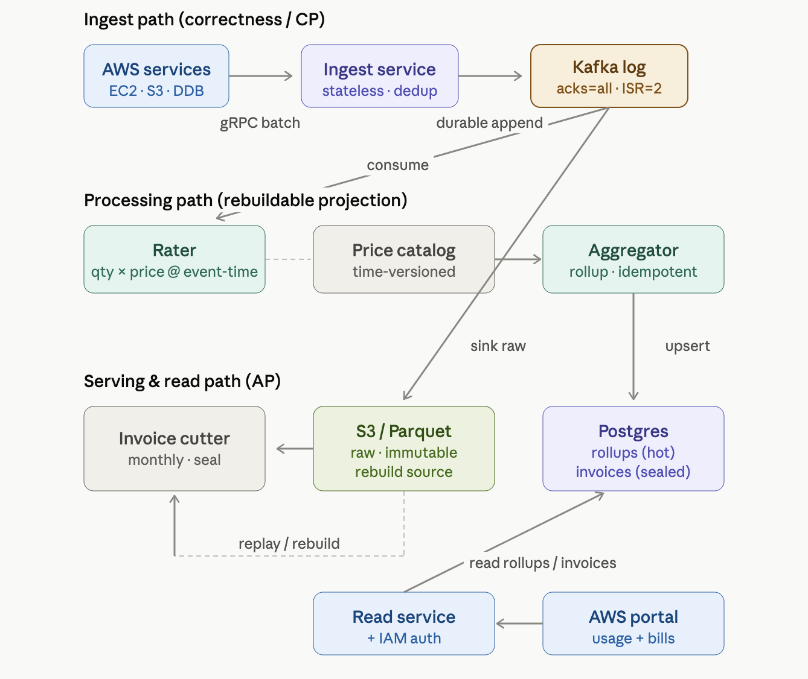
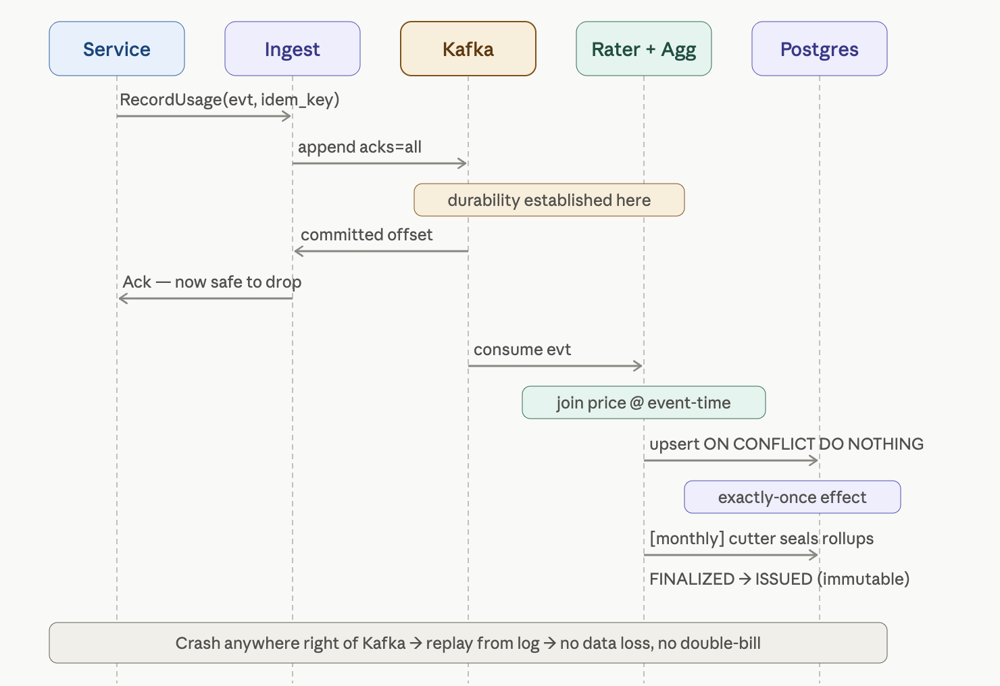

# Design AWS Billing Infrastructure

> **The one-line thesis:** *The meter is the truth; the bill is a derived view.* Every hard problem in this system collapses to keeping the raw usage ledger correct (append-only, idempotent, never lost), because everything downstream — rating, aggregation, invoicing, the portal — is a recomputable projection of that ledger. This is a **metering + aggregation pipeline**, not a transactional system. It is structurally the same problem as your time-series rollup design (multi-resolution aggregation over a high-cardinality event stream), fused with the *event-sourcing* discipline from your payment/Stripe work.

---

## 1. Requirements (~5 min)

### Clarifying questions I'd open with

- *"Do services send usage as discrete events (one row per S3 PUT) or as pre-aggregated deltas (one row per 5-min window per resource)?"* → This is **the** decisive question. It sets the ingest volume by 3–4 orders of magnitude and decides whether the meter aggregates or just records. **Assumption: both.** S3 emits fine-grained events; EC2 emits coarse "instance ran for N seconds" heartbeats. The billing system must not care — it ingests a normalized `UsageEvent` either way.
- *"Is the bill legally final once issued, or can it be corrected?"* → Cloud billing allows **late-arriving usage** and **retroactive credits**. Assumption: invoices are immutable once issued, but corrections happen via new adjustment line items on the next invoice — never by mutating a sealed one.
- *"Real-time spend visibility, or is end-of-day freshness fine for the portal?"* → AWS Cost Explorer is ~24h stale; the *console usage widgets* are near-real-time. **Assumption: portal shows near-real-time (minutes-fresh) usage, but the invoice is a monthly batch cut.** Two read paths, two freshness tiers.

### Functional Requirements (top 3, prioritized)

1. **Ingest usage** from any AWS service at any granularity, exactly-once semantically, and durably record it.
2. **Rate + aggregate** raw usage into charges (apply price × quantity, roll up to hourly/daily/monthly per account per service).
3. **Generate immutable monthly invoices** per account and expose usage/cost to the portal.

Out of scope (stated, then dropped): payment collection/dunning, tax engines, the pricing catalog UI. We *consume* a price catalog; we don't build it.

### Non-Functional Requirements (quantified, top 5)

- **Correctness over availability on the meter (CP write path).** A dropped or double-counted usage event is a direct revenue error. The ledger must be exactly-once and never lose data. *This is the entire game.*
- **Availability over consistency on the read path (AP).** The portal being minutes-stale is fine; it must never go down or block ingestion.
- **Scale:** assume ~10M active accounts, ~1M events/sec peak aggregate ingest (S3 alone at hyperscale). This number forces async, partitioned ingest — a synchronous "write to Postgres per event" is dead on arrival.
- **Durability:** zero tolerance for raw-event loss. This mandates a durable log (Kafka `acks=all`, `min.insync.replicas=2`) as the front door, *before* any processing.
- **Auditability/Idempotency:** every event carries a producer-assigned idempotency key; the same event replayed 100× bills once. Regulatory + financial-audit requirement.

### Capacity note (one number that forces a decision)

1M events/sec × ~200 bytes = **~200 MB/sec** of raw ingest, ~17 TB/day. That single number kills three naive designs: (a) synchronous DB writes, (b) storing raw events forever in Postgres, (c) computing invoices by scanning raw events at bill time. It forces: **durable log → stream aggregation → tiered storage (hot rollups in Postgres, raw events in S3/columnar)**. Everything else follows from this.

---

## 2. Core Entities (~2 min)

The critical modeling insight: **separate the immutable record of *what happened* from the mutable interpretation of *what it costs*.** Price changes; usage doesn't.

- **UsageEvent** — the atom. `(idempotency_key, account_id, service, resource_id, meter_type, quantity, timestamp, region)`. Append-only, immutable. *The source of truth.* Lives in the durable log, then cold storage.
- **PriceCatalog** — `(service, meter_type, region, unit_price, effective_from, effective_to)`. Time-versioned. Rating joins usage against the price that was effective *at the usage timestamp*, not at bill time.
- **UsageRollup** — derived. `(account_id, service, meter_type, period_bucket, summed_quantity, computed_cost)`. Multi-resolution (hourly → daily → monthly), à la your TimescaleDB continuous-aggregates design. *Rebuildable from UsageEvents.*
- **Invoice** — `(invoice_id, account_id, billing_period, status, line_items[], total)`. Immutable once `ISSUED`. A forward-only state machine: `DRAFT → FINALIZED → ISSUED`.
- **Account** — identity + billing metadata. Durable.

Note the event-sourcing shape (*DDIA Ch. 11*): `UsageEvent` is the event log; `UsageRollup` and `Invoice` are **materialized views** over it. If a rollup is corrupted, you replay the log and rebuild it. This is the single most important architectural property of the design.

---

## 3. API / System Interface (~5 min)

Two surfaces: an **internal ingest API** (service → billing) and an **external read API** (portal → billing). Different protocols, different guarantees.

### Ingest — internal, gRPC, fire-and-forget-durable

```
POST (gRPC) BillingIngest.RecordUsage
  UsageBatch {
    events: [
      { idempotency_key, account_id, service, resource_id,
        meter_type, quantity, timestamp, region }
    ]
  }
  → Ack { accepted_count, rejected: [{idempotency_key, reason}] }
```

Why gRPC, not REST: this is high-volume internal service-to-service traffic where per-call overhead matters (HTTP/2 multiplexing, binary Protobuf, streaming). Why **batched**: a service buffers events locally and flushes N at a time — amortizes network cost and is the natural unit for the producer's own idempotent retry.

**The ack semantics are the whole design.** The ingest endpoint returns `Ack` only after the batch is durably persisted to the log (Kafka `acks=all`). It does **not** wait for rating or aggregation. The producer's contract: *retry until you get an ack; the idempotency key makes retries safe.* This is at-least-once delivery from the producer + exactly-once effect via the key — the same pattern as your webhook and payment-outbox designs.

### Read — external, REST, portal-facing

```
GET /v1/accounts/{account_id}/usage?service=s3&granularity=daily&from=&to=
    → UsageRollup[]                      (serves the near-real-time portal widget)

GET /v1/accounts/{account_id}/invoices           → Invoice[] (list)
GET /v1/accounts/{account_id}/invoices/{invoice_id} → Invoice (immutable, sealed)
```

`account_id` in the path is for **resource scoping**, but the *authenticated* principal comes from the auth token — a user can only read invoices for accounts they're authorized on (IAM check, reusing your RBAC materialized-permission pattern). Never trust the path for identity.

---

## 4. Data Flow (~5 min)

This *is* a pipeline, so the ordered flow is the spine of the design:

1. **Service emits** a `UsageEvent` batch with idempotency keys → gRPC to Ingest.
2. **Ingest validates + dedups (cheap, best-effort) + appends** to the durable log (Kafka), partitioned by `account_id`. Ack after `acks=all`.
3. **Rater** (stream consumer) reads events, joins against the time-versioned `PriceCatalog` (price effective at event timestamp), emits a *rated event* (`quantity × unit_price = cost`).
4. **Aggregator** (stream processor) rolls rated events into multi-resolution `UsageRollup` buckets (hourly → daily → monthly), upserting into the serving store. Idempotent on `idempotency_key` to survive replay.
5. **Raw events** also sink to **cold columnar storage** (S3/Parquet) for audit, dispute resolution, and full rebuilds.
6. **Invoice cutter** (monthly batch) freezes the monthly rollups for each account into an immutable `Invoice`.
7. **Portal** reads rollups (near-real-time) and invoices (sealed) via the REST API.

The key property: **steps 2 and 3–7 are decoupled by the log.** Ingest can never be blocked by slow rating. Rating/aggregation can fall behind and catch up. This is DDIA's *"log as the interface between producers and consumers"* (Ch. 11).

---

## 5. High-Level Design (~12 min)

Endpoint-by-endpoint, the architecture that satisfies the two API surfaces.

**Ingest path** (`RecordUsage`): Services → gRPC → **Ingest Service** (stateless, autoscaled) → **Kafka** (partitioned by `account_id`, `acks=all`, `min.insync.replicas=2`). Ingest does a *cheap* dedup against a Redis set of recently-seen idempotency keys (best-effort — the authoritative dedup happens downstream at the idempotent upsert). The Ingest service's only job is: validate shape, assign nothing, append durably, ack. It holds no billing state.

**Processing path**: Kafka → **Rater** (Flink/Kafka Streams job) joins each event against **PriceCatalog** (cached, time-versioned) → **Aggregator** upserts **UsageRollup** into the **serving store (Postgres)**, keyed idempotently. Raw events branch off to **S3/Parquet** (cold, immutable, the rebuild source).

**Read path** (`GET /usage`, `GET /invoices`): Portal → API Gateway (auth + IAM) → **Read Service** → Postgres rollups (hot) / Invoice table (sealed). A **monthly Invoice Cutter** batch job seals rollups into invoices.

Below is the whiteboard architecture — the centerpiece.



The load-bearing structural claim of this diagram: **the durability boundary is Kafka, not Postgres.** Once an event is in the log with `acks=all`, it is billed exactly once *eventually* — even if the Rater, Aggregator, and Postgres all burn down. Contrast this with your Stripe design, where Postgres was the durability boundary and CDC carried events *out*; here the log is the front door and the DB is a downstream materialized view. That inversion is the senior signal.

---

## 6. Deep Dives (~12 min)

### 6.1 Exactly-once billing: the idempotency key is load-bearing, the outbox is not

At-least-once is unavoidable — the producer retries on any ack timeout, the Kafka consumer re-reads on rebalance, Flink replays from checkpoint. So the *effect* must be idempotent even though *delivery* is not. Two independent guards:

1. **Producer-assigned idempotency key** on every `UsageEvent`. Deterministic: e.g. `hash(resource_id, meter_type, usage_window_start)`. A retried S3 PUT-count for the same 5-min window carries the same key.
2. **Idempotent aggregation upsert.** The Aggregator doesn't do `rollup += quantity` blindly — that double-counts on replay. It records *which event keys* have been folded into each bucket, or upserts on `(account_id, meter_type, period, idempotency_key)` and sums via `ON CONFLICT DO NOTHING`. This is exactly your time-series-rollup problem: *aggregation must be idempotent under retry and late-arriving data.*

**Why not the transactional outbox here?** In your payment designs the outbox solved the dual-write between Postgres and Kafka *because Postgres was the source of truth*. Here Kafka *is* the source of truth — there's no upstream DB write to dual-write against. The outbox would be the right tool for the **Invoice Cutter** publishing an `InvoiceIssued` event to a downstream payments system (that *is* a Postgres→Kafka dual write) — but not on the ingest hot path. Naming *where* the outbox applies and where it doesn't is the senior distinction.

### 6.2 Late-arriving usage and watermarks — the sharpest correctness bug

An EC2 instance in a partitioned region buffers usage locally for 3 hours, then flushes. The event's `timestamp` is 3 hours old; the daily rollup for that day may already be "closed." This is DDIA Ch. 11's *event-time vs. processing-time* skew, and it's the single most under-appreciated bug in metering systems.

Handling, in tiers:
- **Within the billing period:** rollups are *mutable up until invoice cut*. A late event for day D just upserts into day D's still-open bucket. No problem — the invoice hasn't sealed.
- **After the period closes / invoice issued:** the invoice is immutable. Late usage becomes an **adjustment line item on the next invoice**, tagged with the original usage period. Never mutate a sealed invoice. This mirrors real AWS behavior and your payments-reconciliation instinct.
- **Watermark policy:** the Aggregator holds a per-partition watermark ("I've seen all events up to time T"). Rollup buckets older than `watermark − grace_period` are eligible to seal. The grace period is a business decision (AWS uses days). Flink's watermark + allowed-lateness API is the exact mechanism.

### 6.3 Rating at event-time price, not bill-time price

If AWS changes S3 pricing on the 15th, usage on the 10th must rate at the *old* price. The Rater joins each event against `PriceCatalog` on `price.effective_from ≤ event.timestamp < price.effective_to`. This is why `PriceCatalog` is **time-versioned** and why rating happens *at ingest-stream time* (freezing the price into the rated event) rather than at bill time. Deferring rating to invoice generation would force a point-in-time price reconstruction over a month of usage — expensive and error-prone. **Rate early, aggregate rated cost.**

### 6.4 Partitioning and the hot-account problem

Kafka is partitioned by `account_id` — this co-locates one account's events for ordered, single-consumer aggregation (no cross-partition merge needed for a rollup). But a whale account (Netflix-on-AWS) can hot-spot one partition. Mitigation, tiered:
- **Normal accounts:** partition by `account_id`. Clean.
- **Whale accounts:** sub-partition by `(account_id, service)` or `(account_id, resource_id_hash)`, then merge the sub-rollups at the daily level. The merge is safe because summation is associative/commutative — order doesn't matter for a `SUM`, only exactly-once does.

This is the same hot-partition reasoning as your ad-budget and Kafka designs: the partition key that's correct for *co-location* is wrong for *load*, and the fix is a two-level rollup.

### 6.5 Storage tiering — why raw events never live in Postgres

17 TB/day of raw events cannot sit in the serving DB. The split:
- **Hot (Postgres):** `UsageRollup` at hourly/daily/monthly grain + sealed `Invoice`s. Small, indexed by `(account_id, period)`, serves the portal. This is your TimescaleDB continuous-aggregate shape — even implementable *in* TimescaleDB with `drop_chunks` retention on the fine grain.
- **Cold (S3/Parquet, columnar):** every raw `UsageEvent`, immutable, partitioned by date/account. Queried only for disputes, audits, and full rebuilds. Columnar because audit queries scan few columns over huge row counts (DDIA Ch. 3, column-oriented storage).

The property this buys: **the entire hot store is disposable.** Corrupt a rollup? Replay from S3/Kafka and rebuild. The invoice is reproducible from first principles. *That* is what makes this a correct system rather than a fast one.

### 6.6 Sequence diagram — one usage event, ingest to sealed invoice

The flow below shows the exactly-once handoff and where durability is established. Note the ack fires at the log, long before the cost is computed.



---

## Real-World Anchor

**Bytebytego's event-sourcing case studies** map directly: the pattern where "the event store is the source of truth and downstream services (billing, fraud, email) each build their own materialized view by consuming Kafka" is *exactly* this design — the `UsageEvent` log is the event store, and `UsageRollup`/`Invoice` are independent projections. AWS's real billing pipeline follows this shape: fine-grained metering events land in a durable pipeline, get rated and rolled up asynchronously, and the Cost Explorer/console reads are served from pre-aggregated stores minutes-to-hours behind the raw meter — never by scanning raw events at query time. **Uber's** and **Netflix's** internal chargeback/cost-attribution systems use the same metering-log → stream-aggregation → tiered-storage skeleton.

## DDIA anchors used

- **Ch. 11 (Stream Processing)** — the log as the producer/consumer interface; event-time vs. processing-time skew; watermarks and allowed lateness; materialized views maintained by stream processors.
- **Ch. 3 (Storage & Retrieval)** — column-oriented storage for the cold audit tier (scan-few-columns-over-many-rows).
- **Ch. 1 & 12 (Reliability / Deriving data)** — the derived-data discipline: keep the source-of-truth event log correct; everything downstream is a recomputable projection.
- **Ch. 5 (Replication)** — Kafka ISR / `min.insync.replicas` as the durability guarantee on the ingest boundary.

---

## 🔍 Senior-Signal Questions to Ask in Your Interview

- **"Where is the durability boundary — the log or the database?"** → *Why it matters: signals you understand that in a metering system the log is the source of truth and the DB is a projection, the inverse of a transactional system. Getting this backwards (ack only after the DB write) reintroduces the dual-write problem and caps ingest throughput at DB write speed.*
- **"How do we handle usage that arrives after its billing period has closed?"** → *Why it matters: event-time skew is the defining correctness bug of metering. The mature answer (mutable-until-seal + adjustment line items after) shows you've thought about watermarks and immutability, not just the happy path.*
- **"At what price do we rate — usage-time or bill-time?"** → *Why it matters: reveals whether you understand time-versioned reference data and why rating must happen at stream time. Bill-time rating forces an expensive point-in-time price reconstruction.*
- **"What's our exactly-once story, and does the transactional outbox apply here?"** → *Why it matters: the senior move is knowing the outbox is the wrong tool on the ingest path (Kafka is the SoT, no upstream DB write) but the right tool for publishing InvoiceIssued downstream. Precision about where a pattern applies beats reflexively invoking it.*
- **"How does a whale account not hot-spot one Kafka partition?"** → *Why it matters: the partition key that's correct for co-locating a rollup is wrong for load balancing. Two-level sub-partition-then-merge (safe because SUM is associative) is the senior answer, and it recurs across ad-budget, Kafka, and this design.*
- **"How do we recover from a corrupted rollup or a rating bug shipped last week?"** → *Why it matters: 'replay from the immutable raw-event store and rebuild the projection' is only possible if you kept raw events in cold storage and made aggregation idempotent. This question tests whether your design is reproducible or merely fast.*