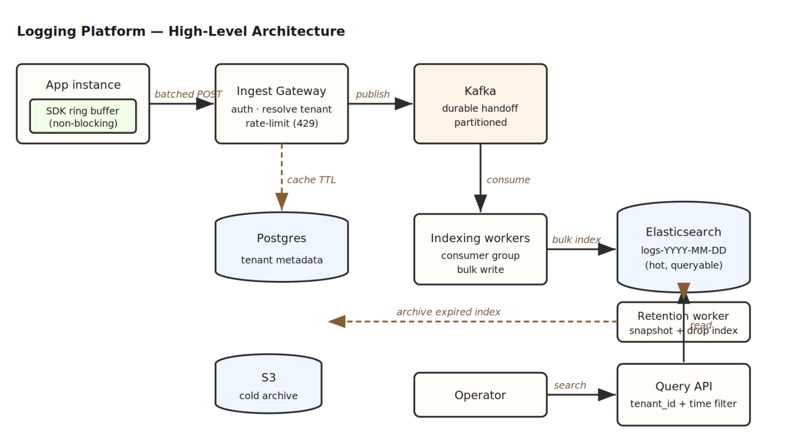
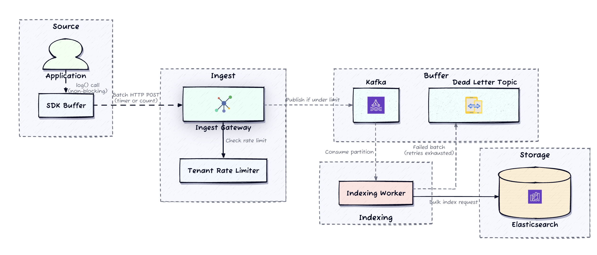
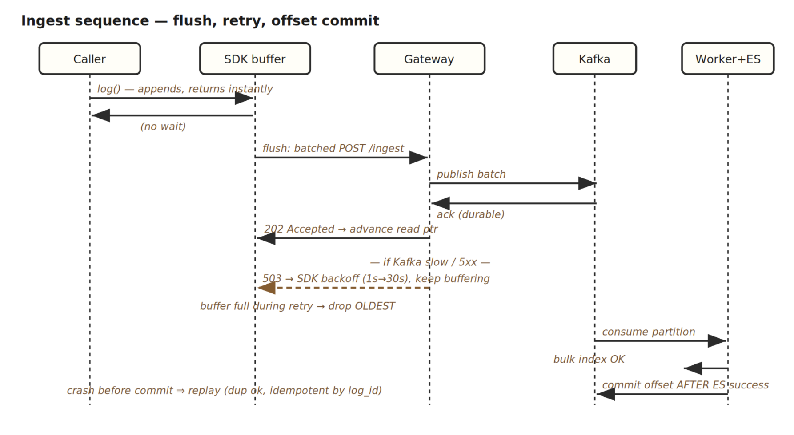
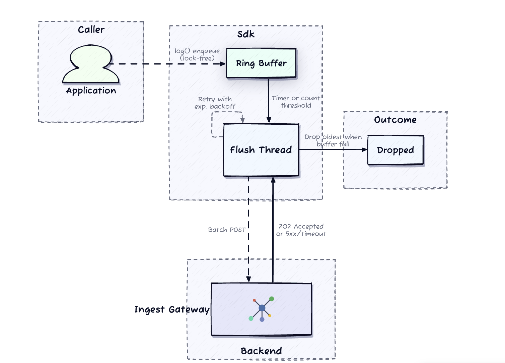
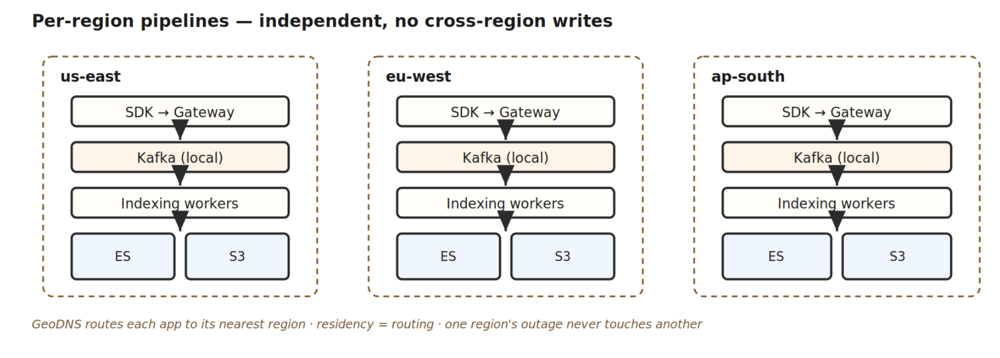
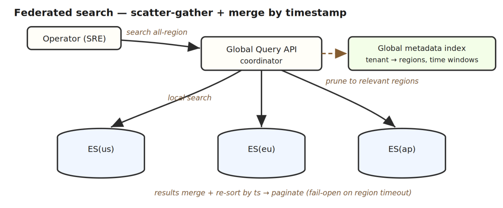

# Design a Logging Service

> **Prompt:** Design a centralized, multi-tenant logging platform (think Datadog Logs / CloudWatch Logs). Applications embed a lightweight SDK that emits structured log entries; operators search those logs by time, severity, service, user, and keyword within seconds of emit.

---

## 1. Requirements

The whole design turns on one asymmetry: **the write path must never block production code, but the write path is also where 500K events/s of pressure lives.** Everything downstream (Kafka, indexing, Elasticsearch) is a consequence of refusing to let ingest pressure propagate back to the caller.

### Clarifying questions I'd ask

- *"If the backend is down, must every log line survive, or is controlled loss acceptable as long as the caller's hot path never stalls?"* → **Non-blocking is the hard constraint.** SDK retries with backoff, then drops oldest buffered entries. Loss is part of the contract, not just a failure mode.
- *"If one tenant sends a 10× burst, can it slow search for other tenants, or must isolation hold on the ingest path?"* → **Per-tenant rate limits required.** Isolation must hold at ingest, not just query time.
- *"How fresh must search be — seconds, or is a minute OK?"* → **< 30s end-to-end** from SDK emit to queryable. This is a freshness target, not just throughput.
- *"If indexing falls behind, does search error out or return partial results?"* → **Partial results with a freshness caveat.** The platform fails *open* — an error makes it useless exactly during an incident.

### Functional requirements (prioritized)

1. **Emit** — SDK lets apps emit structured logs without blocking their hot path.
2. **Ingest** — centralized backend accepts logs from many instances at high throughput.
3. **Search** — query stored logs by time range + severity, service, user, keyword.

Supporting: durable storage with per-tenant retention; multi-tenant isolation (each tenant sees only its logs, rate-limited independently).

### Non-functional requirements

- **Availability > Consistency on ingest.** This is an **AP write path** — logs are append-only, independent events; there's no cross-record invariant to protect. Losing a few logs beats stalling a caller. *(DDIA Ch. 9 — we deliberately choose availability under partition.)*
- **Throughput:** 500K events/s sustained at peak.
- **Ingest freshness:** p99 emit-to-queryable < 30s.
- **Query latency:** p95 < 2s for time-bounded searches on indexed fields.
- **SDK overhead:** < 5ms p99 on the caller's hot path (async buffering).
- **Tenant isolation:** a noisy neighbor cannot degrade others' ingest or search.

### The one number that forces a decision

I won't front-load BOTE math, but **one estimate drives the storage architecture**:

> 500K events/s × ~500 bytes × 86,400s ≈ **~20 TB raw/day**. Over a 30-day hot window that's ~600 TB uncompressed in the search tier.

That number rules out "just keep everything hot forever" and forces **time-based index rotation + hot/cold tiering**: one index per day so retention is an index *drop* (one API call), not a per-document delete scan. Everything else in the design is throughput and isolation plumbing.

---

## 2. Core Entities

- **LogEntry** — `{ log_id, tenant_id, timestamp (ingest), client_ts, severity, service, user_id, operation, resource, message, fields }`. The unit of ingest and search. `log_id` is server-generated → naturally idempotent for replay.
- **Tenant** — `{ tenant_id, api_key_hash, hot_retention, cold_retention, rate_limit_eps }`. Small, high-integrity, transactional. Lives in Postgres.
- **Batch** — the SDK's flush unit (~100 entries / ~50 KB). Never persisted as an entity; it's the transport granularity that amortizes network cost.

### Access patterns

These four boundaries have **different durability and access profiles**, which is why no single store fits — the entity map above is really a *placement* decision:

- **Ingest hot path** — authenticate API key, resolve `tenant_id`, publish batch to Kafka. **No Elasticsearch write on this path** — the whole point of the durable log is that ingest doesn't wait on indexing.
- **Search** — query Elasticsearch filtered by `tenant_id` + time range + optional severity, service, user, keyword.
- **Single log lookup** — fetch one document by `_id` from Elasticsearch (the detail view behind a clicked search result).
- **Retention cleanup** — list Elasticsearch indexes older than the tenant's hot window, snapshot to S3, then delete the index.
- **Tenant management** — CRUD on the `tenants` table in PostgreSQL for admin operations.

So each entity lands where its access pattern demands: **Kafka** is the ingest boundary (once acked, indexing is guaranteed); **Elasticsearch** is the queryable truth for the hot window; **S3** is the cold truth after hot retention expires; **Postgres** holds the small, high-integrity tenant config that needs transactional CRUD and strong consistency. SDK-side buffered logs are ephemeral and lossy by design — they live in host memory and are *not* part of the durable boundary.

### Storage tradeoffs — Elasticsearch vs. ClickHouse

**Elasticsearch is the right hot-search store** because it combines **inverted indexes** for keyword search with **time-based index rotation** that naturally matches log retention (retention becomes an index drop, not a scan). The alternative is **ClickHouse**, which offers better compression and aggregate-query performance but weaker ad-hoc full-text search. For a **Datadog-like debugging experience** — operators searching by arbitrary fields and keywords — Elasticsearch fits better. **ClickHouse would win if** the workload were primarily dashboard analytics over log counts and latency percentiles rather than interactive debugging. *(This is the same fork drawn out in Deep Dive 2's ES-vs-ClickHouse reasoning.)*

---

## 3. API / System Interface

Two contracts that share **nothing but tenant identity** resolved from the API key. Every request carries `Authorization: Bearer <api_key>`; the gateway resolves it to `tenant_id` and stamps it server-side. **Clients never supply their own `tenant_id`** — identity comes from the token, never the body.

### Ingest — fire-and-forget

```
POST /v1/logs/ingest
Authorization: Bearer <api_key>
Body: [ { timestamp, severity, service, message, fields? }, ... ]

→ 202 Accepted { batch_id }     // durably buffered in Kafka, NOT yet indexed
→ 429 Too Many Requests + Retry-After   // tenant over rate_limit_eps
→ 503 Service Unavailable        // Kafka slow → SDK backs off & retries
```

The **202 is the key semantic**: it means "durably handed off to Kafka," not "indexed." The SDK treats 429 exactly like a transient failure — back off, retry, then drop oldest.

### Search — request/response

```
POST /v1/logs/search          // POST, not GET: complex filters exceed URL limits
Body: { time_range (required, ≤24h default), severity?, service?,
        user_id?, operation?, query?, cursor? }

→ 200 { results: [...], next_cursor, freshness: { indexing_lag_s } }
```

Sorted `timestamp DESC`, cursor-paginated. **Mandatory time range (max 24h)** prevents accidental full-index scans — the single most important guardrail on query cost.

### Supporting

```
GET  /v1/logs/{log_id}                      // canonical detail view
GET  /v1/tenants/{tenant_id}/retention      // admin
PUT  /v1/tenants/{tenant_id}/retention      // takes effect next lifecycle run
```

---

## 4. High-Level Design

### Start naive, then break it

The simplest thing that works: app calls `log()` **synchronously** → app server writes raw text to a flat Postgres table → operators search with `SELECT ... WHERE message LIKE '%term%'`. Correct, explainable — and it dies two ways under load:

1. **Synchronous writes block the caller.** A DB slowdown during a burst propagates latency straight into production request paths. This violates the hard constraint.
2. **`LIKE '%term%'` scans billions of rows.** No inverted index → every keyword search is a full table scan → dashboard queries time out.

Those two failures *are* the design spec: (1) demands a **client-side async buffer** so logging never waits on the network; (2) demands a **durable queue** so a burst doesn't become instant indexing pressure, plus a **specialized search index** so keyword queries don't scan history.

### Architecture

Follow one entry from caller to search: `log()` → SDK ring buffer (returns instantly) → background thread batches into one HTTP POST → **ingest gateway** (auth, resolve tenant, rate-limit) → **Kafka** (durable handoff, partitioned) → **indexing workers** (Kafka consumer group) → bulk-write to **Elasticsearch** daily indexes → operators hit a **separate query API**. A **retention worker** later snapshots expired hot indexes to **S3** and drops them.

<br><br><br><br><br><br><br><br><br><br><br><br><br><br><br>



### Walking the ingest pipeline — four backpressure boundaries

The pipeline has **four boundaries where backpressure is absorbed rather than propagated upstream.** That framing is the whole design: pressure stops at each boundary instead of flowing back toward the caller.

1. **SDK buffer.** `log()` is a non-blocking enqueue into a ring buffer. If the buffer is full, the **oldest entry is dropped** — the caller never waits.
2. **Ingest gateway.** Accepts batched HTTP POSTs from many SDK instances, validates the payload, and publishes to Kafka. If Kafka is temporarily slow, the gateway returns **503** and the SDK retries with backoff. It also enforces per-tenant rate limits by checking the tenant's `rate_limit_eps` from **cached** tenant metadata; requests over the limit get **429**.
3. **Kafka.** The durable event log that decouples ingest from indexing. I'd choose Kafka here because the system needs **partitioned, replayable consumption and consumer-group semantics** for parallel indexing workers. If the stack were deeply AWS-native, **Kinesis** would also be reasonable, but Kafka is the cleaner interview default for this problem shape. Once Kafka acks a batch, the platform **guarantees those entries will eventually be indexed**; partitioning lets multiple workers consume in parallel.
4. **Workers → Elasticsearch.** Workers consume from Kafka partitions, assemble bulk indexing requests, and write to ES. A failed bulk request is retried; if retries are exhausted, the batch goes to a **dead-letter topic** for later reprocessing. Workers commit their Kafka offset **only after a successful ES write**, so a worker crash **replays from the last committed offset without data loss.**

<br><br><br><br><br><br><br><br><br><br><br><br><br><br><br>

<br><br><br><br><br><br><br><br><br><br><br><br><br><br><br>


### Query path

The query path is **separate from ingest**. The query API receives operator searches, translates them into ES queries filtered by `tenant_id` + time range, and returns paginated results. Because the query API *reads* ES while indexing workers *write* it, **the two paths scale independently**: a search-traffic spike doesn't slow ingest, and a log burst doesn't block searches beyond the natural indexing lag. *(DDIA Ch. 11 — Kafka as replayable log; Ch. 12 — ES as a derived search index built from that log.)*

### Cold tiering

A **retention lifecycle worker** runs periodically and checks each ES index against the owning tenants' hot-retention policies. When an index exceeds the hot window, the worker **snapshots it to S3 as a compressed archive, then deletes the index from ES**. Cold logs in S3 are **not directly queryable** through the search API — retrieving them requires an explicit **restore** that re-indexes the archived segment into a temporary ES index.

### Tenant metadata

PostgreSQL stores tenant configuration — API keys, retention policies, rate limits. The ingest gateway **caches this locally with a short TTL** so it doesn't hit Postgres on every request (the dashed `cache TTL` arrow in the diagram). This keeps Postgres off the ingest hot path entirely while still letting rate-limit and retention changes propagate within the TTL window.

**Why Elasticsearch over ClickHouse:** inverted indexes give ad-hoc full-text + arbitrary-field search (the Datadog debugging experience), and time-based index rotation matches retention cleanly. ClickHouse wins on compression and aggregate/dashboard queries but loses on interactive keyword search — the wrong trade for a debugging tool.

---

## 5. Deep Dives

The two probes that earn senior signal: **the SDK buffer contract** (the domain-unique hard part) and **Kafka partition strategy** (whether you scale linearly or hit tenant-shaped hot partitions). ES cluster ops matter operationally but don't change the architecture.

### Deep Dive 1 — The SDK is a lossy buffer *by design*

`log()` sits on the application's hot path. If it blocks for even a few ms during a backend slowdown, it's already failed. So the SDK maintains a **bounded ring buffer**; `log()` is a lock-free append (microseconds) that returns immediately. A background flush thread wakes on **whichever comes first** — count threshold (~100) or time interval (~5s) — drains a batch, POSTs once.

The load-bearing decision is **what happens when the buffer fills during retries**:

- **Drop oldest** → most recent logs survive. ✅ Correct for debugging — you want current context during an active incident.
- Block `log()` → violates the primary contract. ❌
- Drop newest → preserves ancient history at the cost of the logs you actually need right now. ❌

> **The aha:** the SDK guarantees a *non-blocking call*, not *lossless delivery*. The app's job is to stay fast; the observability pipeline's job is best-effort. Confusing those priorities is how a logging SDK causes the outage it was meant to diagnose.

**How I'd say it in the interview:** *"The SDK is a lossy buffer by design. It guarantees `log()` won't block, not that every log survives. If the backend is down five minutes, we lose some logs — fine. What's not fine is adding latency to production requests because logging is waiting on a network call."*




### Deep Dive 2 — Kafka partition strategy

The partition key decides whether 500K/s scales or whether a big tenant creates a hot partition that bottlenecks *everyone* behind it.

| Strategy | Ordering | Hot-partition risk | Verdict |
|---|---|---|---|
| **By `tenant_id`** | per-tenant total order | ❌ 50K/s tenant → one partition, one consumer, one bottleneck | too coarse |
| **By `hash(tenant_id + service)`** | per tenant-service | ✅ spreads a big tenant across its services | **default choice** |
| **Round-robin** | none | ✅ perfectly even | for the *largest* tenants only |

**Default: `hash(tenant_id + service)`.** Most large tenants run many services, so this spreads their load while preserving ordering *within* a tenant-service pair — which is all debugging needs. Cross-partition global order is reconstructed for free because **ES re-sorts by timestamp at query time**. Round-robin is the escape hatch for a single tenant so large it saturates even that: you sacrifice all partition ordering, but since ES re-sorts anyway, it's usually fine.

**Recovery mechanics (the senior tell):** workers are a consumer group — adding workers auto-rebalances; a crash reassigns partitions and resumes **from the last committed offset**. Offsets commit *only after* a successful ES bulk write → a crash **replays** rather than loses. Replay duplicates are harmless because entries are **idempotent by `log_id`**. A batch that fails retries → **dead-letter topic**, so one poison batch can't block its partition forever.

### Deep Dive 3 — Noisy-neighbor containment (defense in depth)

Rate limiting at the gateway is necessary but not sufficient — a big tenant still shares Kafka and ES capacity downstream:

1. **Gateway** — token bucket per tenant (`rate_limit_eps` from Postgres, cached with short TTL). Over limit → 429.
2. **Indexing workers** — **weighted fair queuing**: track per-tenant counts in the window, throttle tenants over their fair share.
3. **Query side** — per-tenant concurrency limits so an expensive search can't starve neighbors; heavy tenants → dedicated read replicas.
4. **Largest tenants** — hard isolation: dedicated Kafka topic + dedicated ES index. Operationally expensive, so reserved for the top few.

### Deep Dive 4 — Retention & the shared-index TTL conflict

Daily indexes are **shared across tenants with different retention windows** — that's the wrinkle. An hourly retention worker keeps an index alive **as long as any tenant with data in it still needs hot access**; per-tenant retention *within* a live index is enforced at **query time** (search filters out results older than that tenant's hot window). Once every tenant's window has passed, the whole index is snapshotted to S3 (compressed ~5:1, time-partitioned) and dropped. Cold logs aren't directly queryable — restore = re-index a segment into a temporary ES index.

### Deep Dive 5 — Degraded reads & adaptive sampling

- **Fail open:** when indexing lags, search returns **partial results + a freshness caveat** (`indexing_lag_s`) rather than erroring — the platform must work hardest exactly when engineers are debugging.
- **Clock skew:** index by **server-side ingest timestamp** for stable ordering; keep the client timestamp as a separate field. Source clocks drift; results shouldn't.
- **Adaptive sampling under sustained overload** — applied at the **gateway** (global visibility), not the SDK: keep all ERROR/FATAL, sample WARN 50%, INFO/DEBUG 10%, tag kept entries with the sample rate. Tail-based sampling (keep everything from any errored request) is the fancier version; head-by-severity is usually enough.

### Deep Dive 6 — Why the search store is Elasticsearch (ES vs. ClickHouse vs. Cassandra/Dynamo)

The workload defines the store: **log debugging is unpredictable reads + full-text.** During an incident, operators filter by *arbitrary* field combinations (`service AND user_id AND severity`) and search *inside* the message body (`message CONTAINS "connection refused"`) — none of it known at write time. That single property eliminates two whole families of store.

**Cassandra / DynamoDB — eliminated.** These are *query-first, key-driven* stores: a partition key serves exactly one lookup shape, so you'd model **one denormalized table per query** and write every log N times (500K/s × N). Worse, you can't cover unforeseen field combinations, and there's **no full-text at all**. Secondary indexes don't rescue it: Cassandra's 2i is **node-local**, so a high-cardinality lookup like `user_id` becomes a cluster-wide **scatter-gather** that worsens as you scale; Dynamo's GSI is global but **caps at 20**, is one-shape-per-index, and multiplies write cost. Neither does tokenized `CONTAINS`. Cassandra/Dynamo are right for *known-key, write-heavy* workloads (KV store, ad-budget leasing) — the opposite of logging.

> ⚠️ **Interview trap:** Cassandra is *"wide-column"* in its **data model**, but **row-oriented on disk** — it is **not** columnar. Don't reach for it thinking it gets the columnar aggregation win; it doesn't.

**ClickHouse — the real runner-up, and why it's fast.** ClickHouse doesn't build a per-field index. It's **columnar**, so a filter reads only the query's columns; and it prunes aggressively via **partition-prune → block-prune → column-prune**:

- **Partition:** `PARTITION BY toYYYYMMDD(timestamp)` writes each day to its own on-disk folder → a time-bounded query opens only that day (same retention-as-folder-drop win as ES daily indexes).
- **Sparse primary index:** rows are sorted by `ORDER BY (tenant_id, timestamp)` and grouped into ~8192-row **granules**; the index stores **one marker per granule, not per row**, so it's KB-sized and memory-resident. A query narrows to a few granules, then reads only those.
- **Physical layout (the subtle bit):** storage is **column-wise** — one file per column (`severity.bin`, `service.bin`, …). A **granule is a logical row-range, not a row-chunk**: the same range `[16384–24575]` is sliced into *every* column file at aligned boundaries. "Read granule 2" = seek to granule 2's offset in only the column files the query needs (`severity.bin`, `service.bin`) and **skip `message.bin` entirely**. Aligned cuts are what let a column store still reconstruct a full row (row N sits at the same position inside granule K of every column).
- **Skip indexes** (min/max, bloom filter) extend block-pruning to non-sort-key columns — the escape hatch when a filter isn't on the `ORDER BY`.

This is why ClickHouse beats Cassandra 2i / Dynamo GSI on **structured** filters and aggregations: no per-field index to declare, filters compose across columns, and it costs **one** write. **But** — it's scan-based, so it has **no inverted index → no efficient full-text** (`message CONTAINS` becomes a full column scan), and it **falls off the fast path** when the filter isn't on the sort key.

**Elasticsearch — the pick.** ES *is* an inverted index: every field searchable by default, the `message` body **tokenized** for true keyword search, and arbitrary filter combinations native (posting-list intersection). One copy of the data serves *any* ad-hoc query, foreseen or not — exactly what unpredictable + full-text debugging needs.

| Store | Physical layout | "Index" | Full-text? | Best fit |
|---|---|---|---|---|
| **Cassandra / Dynamo** | **row**, partitioned by key | per-field 2i (node-local) / GSI (cap 20) | ❌ | known-key, write-heavy point lookups |
| **ClickHouse** | **columnar** (file per column, granules) | sparse block index + skip indexes | ❌ | predictable aggregations / dashboards |
| **Elasticsearch** ✅ | inverted index + doc-values | inverted index (all fields) | ✅ tokenized | **unpredictable ad-hoc + keyword search** |

**One-liner:** *"Logging is unpredictable reads plus full-text. Cassandra/Dynamo are key-first — one table or index per query shape, no full-text — so they're out. ClickHouse is genuinely fast via columnar scan and granule-level block-pruning, and wins the analytics fork, but has no inverted index for keyword search. ES indexes every field once and tokenizes the message body, so a single copy serves any ad-hoc query — that's why it's the store for a debugging tool."*

### Deep Dive 7 — Global / multi-region topology

The senior escalation. The key realization: **logs are region-local by nature, so you don't build one global logging system — you run N independent regional pipelines and federate only the reads.** Almost nothing crosses regions.

**Write path stays 100% in-region.** A cross-region hop would blow the SLAs (a trans-Atlantic round trip alone is ~80ms vs. the <5ms SDK budget), so the *entire* ingest-through-index pipeline is replicated per region. Each region has its own gateway, Kafka, workers, ES, and S3 cold tier. Apps ship to their **nearest** region via GeoDNS / latency routing. This lands **data residency for free** (EU logs stay in EU → GDPR) — often a hard compliance requirement, not a nicety.



This shards cleanly *because logs are append-only, independent events with no cross-region invariant* — nothing to reconcile, no consensus, no cross-region transaction. This is the payoff of the AP posture declared up top. Contrast the ad-budget / payment designs, where a global invariant *forced* a single-homed reconciler; logging has none. *(DDIA Ch. 5 — each region is its own leader for its own writes; multi-leader with no write coordination.)*

**The one hard problem is global search — the operator, not the log.** An SRE debugging a request that hopped `us → eu → ap` needs all three regions in one view. The write path is local; the read path must **federate**.



Three federation levers, in order of reach for:

1. **Scatter-gather (default).** Global query API fans out to each region's ES; each searches locally; coordinator merges and re-sorts by timestamp. No data moves → respects residency, always current. **Cost:** query is as slow as the slowest region. **Tail fixes:** (a) a **global metadata index** — "which regions has tenant T logged to, in which windows" — so you scatter only to *relevant* regions (a tenant in 2 of 5 regions → skip 3); (b) **fail open** — return partial results with a "region X timed out" caveat rather than blocking, same principle as indexing lag.
2. **Global metadata index.** The routing hint above — cheap, high-leverage, turns an all-region fan-out into a 2-region one.
3. **Central analytics tier (analytics only, not debug).** For dashboards needing all regions together, **async-replicate a downsampled / cold copy** (usually regional S3 → a central ClickHouse/warehouse) as a **separate, eventually-consistent** path — explicitly *not* the interactive debug path, and residency-filtered (data that legally can't leave is excluded or aggregated-only).

**The senior nuance — where residency and federation collide:** if EU logs legally *cannot leave* the EU, a scatter-gather that *reads* them from a US-hosted coordinator may itself be a violation depending on interpretation → the query coordinator often must run **per-jurisdiction**, and truly-global views are limited to residency-safe metadata or aggregates. Naming that ("federated read is easy until residency law says even the read federates per-jurisdiction") is the tell.

**One-liner:** *"Logs are region-local, so I run an independent ingest-and-index pipeline per region and route each app to its nearest — hot path stays in-region for latency, and residency comes for free. Only search federates: a global coordinator scatter-gathers across regional ES and merges by timestamp, using a metadata index to hit only the regions a tenant uses and failing open with a per-region caveat. Cross-region dashboards go through a separate async analytics path off the cold tier, never the interactive one. It shards this cleanly because logs are append-only events with no cross-region invariant — no consensus, no reconciler, unlike a global budget."*

---

## Discussion Notes

Follow-up probes worked through after the deep dives — the mechanistic "how does this actually work" questions an interviewer drills into.

### Storage-engine internals

**Where the SDK buffer lives.** Client-side — in the emitting app's own process memory (the SDK is a linked library). That's *why* it's non-durable and lossy: a process crash loses it, there's no disk/replication. The system's **durability boundary is the Kafka ack**; everything left of Kafka (SDK ring buffer, gateway's in-flight batch) is best-effort. Don't confuse it with the worker-side **bulk-request assembler**, which is also a "buffer" but sits on your servers, is fed from durable Kafka, and replays from the committed offset on crash.

**ES schema = the index mapping, not data.** `"type": "keyword"` is a field-*type declaration* (like `VARCHAR` in a `CREATE TABLE`), not a stored value. `PUT logs-2026-08-06 { mappings }` creates the empty index once; documents flow in after. The mapping's real job is deciding **what to *not* index**: `dynamic: false` + `fields: { enabled: false }` are the load-bearing choices — they stop a tenant's arbitrary keys from causing a **mapping explosion** that destabilizes the cluster (and it's a write-throughput win: one analyzed `text` field, not dozens).

**ES's three per-field structures.** For one log:
- **`_source`** — verbatim JSON copy → used to *show the full log*. (≈ the raw row.)
- **inverted index** — word → doc list → used to *search* (`message CONTAINS "timeout"`). `text` fields are tokenized (split into words); `keyword` fields stored whole.
- **doc-values** — columnar per-field column → used to *sort / count / aggregate*.

Rule: **filter/aggregate on it → `keyword`; search inside it → `text`.** `user_id` as `keyword` (terms-dict lookup), `message` as `text` (tokenized). ES indexes *every* mapped field by default — the mapping switches indexing **off** where wasteful/dangerous.

**doc-values ≈ columnar storage** (the ES piece that enables aggregation), but ES *has* a columnar structure alongside row-ish `_source` + inverted index — it isn't columnar-native like ClickHouse. That's why ES is columnar-*enough* for filters but weaker than ClickHouse for heavy analytics.

### Why not Cassandra / ClickHouse (the store fork, drilled)

**Cassandra is NOT columnar** — "wide-column" is the *data model*; on disk it's **row-oriented**, grouped by partition key. It serves one lookup shape (the partition key); other filters → full-table scan. You'd model **one denormalized table per query** (write every log N times) and *still* get no full-text. Secondary indexes don't save it: Cassandra 2i is **node-local → scatter-gather** across all nodes for high-cardinality lookups like `user_id` (worsens as you scale); DynamoDB GSI is global but **caps at 20**, one-shape-per-index, multiplies write cost. None do tokenized full-text.

**ClickHouse — genuinely fast, but scan-based.** Physical layout: **one file per column**, sorted by `ORDER BY`, split into **partition folders by day**. Its "index" is a **sparse primary index** — one marker per ~8192-row **granule**, not per row → tiny, memory-resident. Query path = **partition-prune → block(granule)-prune → column-prune**; skip indexes (bloom/min-max) extend pruning to non-sort-key columns. Beats 2i/GSI because it indexes *no* field per se — any column filter is cheap, filters compose, one write.
- **Granule = logical row-range, NOT a row-chunk.** The same range `[16384–24575]` is sliced into *every* column file at aligned boundaries. "Read granule 2" = seek to granule 2's offset in only the needed column files (`severity.bin`, `service.bin`), skip `message.bin`. Aligned cuts let a column store still reconstruct a full row.
- **Loses because:** no inverted index → `message CONTAINS` is a full column scan; and it **falls off the fast path** when the filter isn't on the sort key.

**ES wins the log fork** because logging = *unpredictable reads + full-text*: inverted index makes every field searchable and the message tokenized, so **one copy serves any ad-hoc query**. ClickHouse wins the *predictable-analytics/dashboard* fork.

### Sorting, ordering & indexing (the read-time subtleties)

**Sorting happens at read time, not insert time**, because: (1) shifting stored data into sorted position at 500K/s is catastrophic; (2) ES doesn't know at insert which sort you'll ask for (time? severity? user?) — it can store only one physical order, so it stores *none* and sorts per query; (3) global order only exists once all shards' results are gathered — which only happens at query time. Docs are stored append-fast (unsorted); the **timestamp doc-values column** is the sorted-on-demand structure.

**Indexing ≠ sorting.** Indexing = *write-time* build of the structures (inverted index + doc-values). Sorting = *read-time* consumption of what indexing built. Sequential: setup → payoff. Sorting is cheap at read *because* indexing did the prep at write. "Indexed order" ≠ "sorted order" — docs on disk are never physically sorted.

**Kafka ordering vs. ES ordering — the corrected claim.** `hash(tenant+service)` **preserves** order *within* a tenant-service pair → a **single-service query is one partition, already ordered, no reconstruction needed** (my earlier "always reconstructed" was too broad). Reconstruction only matters for **cross-partition** queries — "all of a tenant's services" or a global view — where logs scatter across partitions with no Kafka-level order between them, and **ES's timestamp sort merges them at query time**. Because ES re-sorts anyway, cross-*partition* order is disposable — which is *also* why **round-robin** stays safe for a giant tenant (perfectly even load, sacrifices Kafka ordering you weren't relying on). Only safe because logs are **independent events** with no causal dependency.

### Read/write contention & replicas

**"Scales independently" is two-level.** *Compute tier* — genuinely independent (query API fleet vs. worker fleet autoscale separately). *Storage tier* — **shared ES cluster → reads and writes DO contend** for the same nodes' CPU/IO/page-cache/heap. Earlier "a log burst doesn't block searches" oversold it: no *logical* block, but real *physical* contention.

**Replicas make it scalable, not zero.** Writes → **primary** shard; searches → **replica** shards → different physical copies on different nodes. Add replicas → **read throughput scales without touching write capacity**. Honest caveat: in ES the replica **re-indexes** (pays real indexing CPU) — replicas aren't write-free. What they buy: read load is *independently scalable* (add replicas) and *time-isolated* — with **daily rotation**, only *today's* index is dual-loaded; a replica of yesterday's write-closed index serves reads with **zero** write contention. So: bounded, separately-scalable contention. Next lever if severe: dedicated read-replica nodes or a cross-cluster replica.

### Cold tier & restore (how S3 actually works here)

**Who snapshots.** A dedicated **retention lifecycle worker** (hourly cron), separate from ingest/query. Per run: check each index's age vs. tenant `hot_retention` (from Postgres) → call **ES snapshot API** (streams compressed archive to S3) → **delete the index** (cheap index-drop, the payoff of daily rotation). Shared-index wrinkle: keep an index alive while *any* tenant still needs it hot; per-tenant expiry enforced at **query time**; drop only once *all* windows pass.

**S3 is NOT queryable — it's a dumb key→value store.** Key = a **path string** like `archive/tenant-X/2026-07-06/segment-1.dat`; value = that one chunk's **compressed bytes**. The timestamp is just **text in the key**, not a queryable field — you can only **prefix-LIST** (gather a day's chunks *because you deliberately put the date in the key*) and **GET by exact key**. No range query, no stitching by S3.

**Restore is a two-step, ES does all stitching.** (1) ES reads the day's chunks back from S3 and **rebuilds the index on local disk** (chunk-stitching); (2) normal query-time segment-merge + timestamp sort runs **in ES**. Search *never* happens in S3 — it happens in ES after restore. Deliberately slow/manual because cold tier optimizes **cost over queryability**; archive is keyed by day/tenant so you restore only the relevant slice.

**Completeness is verified via a manifest, not a directory listing.** The snapshot writes a **manifest** listing every file + checksum/size. Restore reads it → GETs exactly those keys → verifies checksum per file. Missing file = 404 vs. manifest entry → **abort**; corrupt/truncated = checksum/size mismatch → **abort**. **All-or-nothing** — never a silent partial index. A snapshot is marked `SUCCESS` only once every file is confirmed uploaded (else `PARTIAL`, never restored from). S3's 11-nines durability means the real risks are a failed write or an accidental delete — both caught by the manifest check.

---

## Real-World Anchor

**Datadog / CloudWatch Logs** are exactly this shape: a thin SDK with a bounded async buffer, an ingest tier that fronts a durable log (Kafka/Kinesis), an indexing fleet that materializes a search index, and hot/cold tiering to object storage. **Uber's logging pipeline** (per ByteByteGo) makes the same move — Kafka as the ingest shock absorber decoupling emit rate from indexing rate — and reaches for ClickHouse where the workload tilts toward metrics/aggregates rather than ad-hoc full-text, which is precisely the ES-vs-ClickHouse fork we drew above. The through-line: **treat the durable log as the source of truth and the search store as a rebuildable derived view** — replay from Kafka reconstructs ES after any indexing-tier loss. *(DDIA Ch. 11–12: this is stream processing building a derived, disposable index off an ordered log.)*

---

## 🔍 Senior-Signal Questions to Ask in Your Interview

- **"Is the search index authoritative, or is Kafka the source of truth and ES a rebuildable derived view?"** → *Why it matters: signals you understand the log-as-source-of-truth pattern — you can wipe and rebuild ES from Kafka, which reframes ES failures from data loss to recovery latency (DDIA Ch. 12).*
- **"What's our exactly-vs-at-least-once posture on indexing, and why is at-least-once acceptable here?"** → *Why it matters: shows you connect offset-commit-after-write to replay, and know that `log_id` idempotency makes duplicates harmless — a domain-specific reason at-least-once is the right, cheaper choice.*
- **"At what tenant size does `hash(tenant+service)` stop containing hot partitions, and what's the next lever?"** → *Why it matters: naming the exact inflection point (single tenant saturating even multi-service spread → round-robin or dedicated topic) is the senior tell, not reflexively dismissing the simple key.*
- **"Do we fail open or closed when the indexing pipeline is behind?"** → *Why it matters: forces the availability-during-incident trade — partial-results-with-caveat vs. erroring — which is the whole point of an observability tool.*
- **"How do we enforce per-tenant retention when tenants share a daily index?"** → *Why it matters: surfaces the query-time-filter vs. index-drop tension and shows you thought past the happy-path 'one delete call' retention story.*
- **"Where does sampling live — SDK or gateway — and why?"** → *Why it matters: the gateway has global per-tenant + pipeline-health visibility the SDK lacks; putting adaptive control where the information is is a systems-thinking signal.*
- **"Why Elasticsearch and not ClickHouse or a wide-column store for the search tier?"** → *Why it matters: shows you match store to read pattern — unpredictable ad-hoc + full-text needs an inverted index; ClickHouse's columnar scan wins predictable analytics but has no full-text; Cassandra is row-oriented (not columnar) and key-first, so it's out. Naming the trap ("wide-column ≠ columnar") is the tell.*
- **"Multi-region: do we federate reads or replicate data centrally, and where does residency force the topology?"** → *Why it matters: signals you know the write path is region-local (logs have no cross-region invariant), only search federates via scatter-gather, and residency law can push even the query coordinator per-jurisdiction — the difference between a naive "global cluster" answer and a real one.*
