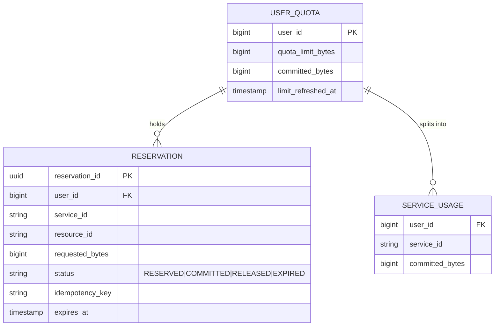
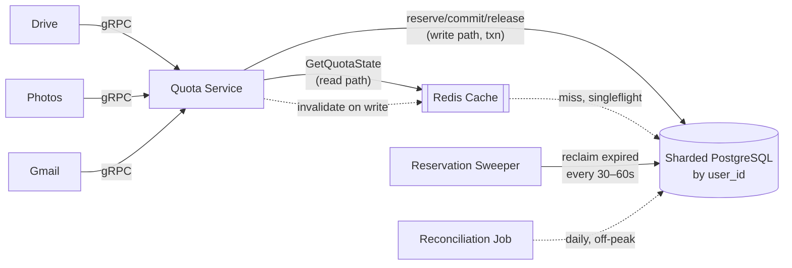
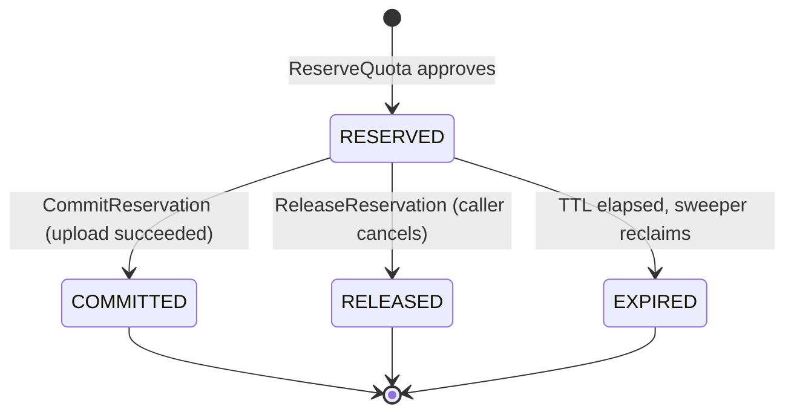
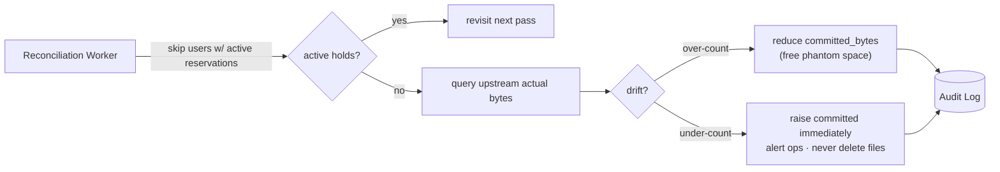

# Design a Quota Service

> **Thesis:** A quota service is not a counter — it's an *admission gate* that must atomically check-and-hold against a hard invariant. The entire design derives from one line: `committed_bytes + SUM(active_reserved) <= limit`, enforced inside a single serialized transaction. Everything else (cache, sweeper, reconciliation) exists to serve reads or repair drift *around* that boundary, never to weaken it.

---

## 1. Requirements

### Functional Requirements

Prioritized top 3:

1. **Reserve** — an upstream service (Drive, Photos, Gmail) reserves N bytes for a user and gets a synchronous **approve/deny**.
2. **Commit / Release** — after the upstream op finishes, the caller commits the hold (bytes become permanently consumed) or releases it (bytes return to the pool).
3. **TTL reclamation** — uncommitted reservations expire after a configurable TTL and are auto-reclaimed, so a crashed caller never locks quota forever.

Supporting: release consumed quota on file delete; query a user's breakdown (limit / committed / reserved / available).

### Clarifying Questions → Assumptions

| Question | Answer | Design consequence |
|---|---|---|
| Shared pool or per-service buckets? | **One shared pool** per user (100GB across Drive/Photos/Gmail) | Concurrent reserves from different services race on the *same* aggregate → must serialize at the user boundary. |
| Strict denial, or is brief over-commit OK? | **Strict.** Over-commit is a billing/trust violation even if self-correcting. | Rules out optimistic counters; reserve must be a serializable check-and-insert. |
| Crashed caller — hold locked forever? | **Must time out** (few-minute TTL). | Reservations are durable rows with `expires_at`; a background sweeper reclaims them. |
| Read vs write ratio? | Reads **~4–5×** writes (~2M reads/s vs ~500K writes/s). | Separate read cache; cache is *never* the admission gate. |
| Behavior when quota service is degraded? | **Fail closed** — reject the upload. | Availability is subordinate to the no-overshoot invariant. |

### Non-Functional Requirements

- **Hard invariant (strong consistency on the write path):** `committed + reserved <= limit` at all times — not an eventually-consistent soft cap.
- **Latency:** reserve p99 **~5–10 ms** (it blocks uploads).
- **Throughput:** ~**500K** reserve/commit/release ops/s; **~2M** reads/s.
- **Availability:** 99.9% (critical path for all uploads), but **fail-closed** under partition — this is a deliberate **CP** choice *(DDIA Ch. 9 — linearizability vs availability under CAP)*.
- **Durability:** committed state survives crashes; reservations recoverable from durable rows or reclaimable by timeout.

> **On estimation:** the aggregate throughput isn't the hard part. The quota table is ~50M users × ~100B ≈ **5GB** — it fits in memory. The real constraint is **per-user contention**: two ops on the *same* user must serialize; ops on *different* users are fully parallel. That single fact drives sharding by `user_id`.

---

## 2. Core Entities

- **UserQuota** — the authoritative aggregate per user: `limit`, `committed_bytes`. The serialization point.
- **Reservation** — one row per active hold: `status`, `requested_bytes`, `expires_at`, `idempotency_key`.
- **ServiceUsage** — per-service committed consumption, for breakdown queries (how much Drive vs Photos vs Gmail).

**Derived, never stored:** `available = limit − committed − SUM(active reserved)`. Storing it would invite drift between the derived value and its components.

---

## 3. API / Interface

Internal service-to-service → **gRPC** (Protobuf schema enforcement, low serialization overhead, native deadlines/retries). Identity comes from **service-to-service auth**; the service never trusts user-supplied sizes.

```
ReserveQuota(user_id, service_id, resource_id, requested_bytes, idempotency_key)
  → {approved, reservation_id, expires_at, remaining_available}

CommitReservation(reservation_id, actual_bytes)   // actual_bytes may adjust DOWN only
  → {committed, new_remaining}

ReleaseReservation(reservation_id)                 // cancel an active hold (idempotent)
ReleaseConsumedQuota(user_id, service_id, resource_id, release_bytes)  // on file delete

GetQuotaState(user_id) → {total_limit, committed, reserved, available}  // cache-served, 2M/s
GetServiceBreakdown(user_id) → [{service_id, committed, reserved}]
```

- **Idempotency:** `idempotency_key` scoped to user; resubmit returns the existing reservation (protects against retry double-reserve). Enforced by a unique index.
- **Denial:** if `committed + active_reserved + requested > limit` → `approved: false`, no side effects.
- **Commit adjusts down only:** if `actual > reserved`, commit fails — caller must re-reserve the delta first.
- **Late commit:** if the TTL already reclaimed the hold, commit fails → "re-reserve and retry."

> *How I'd say it in the room:* "The mistake is treating this like a counter decrement. Two-phase reserve-then-commit exists because uploads take **minutes, not milliseconds**. If we consumed quota at reserve time, a failed upload would lock the user's space until someone cleaned it up manually. The TTL-backed reservation is what makes the system self-healing."

---

## 4. Data Model



**Store choice — PostgreSQL (sharded by `user_id`).** The no-overshoot invariant demands atomic *check-and-reserve* across two entities (lock the aggregate row, insert a reservation row) in one transaction. Row-level locking serializes same-user reserves while different users proceed in parallel.

**Rejected: DynamoDB w/ conditional writes.** DynamoDB nails single-partition-key access, but the reserve path touches **two logical entities atomically** — DynamoDB transactions add latency and complexity vs. a single Postgres transaction that locks one row and inserts another. When the transaction boundary *is* the correctness mechanism, Postgres is the cleaner default. *(DDIA Ch. 7 — serializable isolation; Ch. 6 — partitioning by key.)*

**Indexes / partitioning:**
- PK `user_quota(user_id)` — supports `FOR UPDATE`.
- `reservation(user_id, status)` — sum active reserved for the invariant check.
- `reservation(status, expires_at)` — sweeper finds expired rows without a full scan.
- Unique `reservation(user_id, idempotency_key)` — DB-level idempotency.
- **Shard key = `user_id`** — all of a user's ops hit one shard; contention is local.

---

## 5. High-Level Design

### Why naive breaks

One row per user with a `used_bytes` column and `SELECT ... FOR UPDATE` to decrement works at small scale — and fails two ways: (1) a 5-minute upload that dies **permanently locks** that space; (2) every concurrent op on a user **serializes**, with no way to release a stuck hold. The fix is the **reserve-commit-release lifecycle** with TTL reclamation.

### Architecture



**The critical separation is write path vs read path.** Writes always go through Postgres with transactional guarantees. Reads hit Redis, falling through to Postgres on a miss, with cache invalidation after every write. Bounded staleness on a "12 of 100 GB used" display is acceptable; the **reserve decision never reads from cache**.

### Flow 1 — Reserve (hot path)

Route to the shard by `user_id`. In one transaction: `SELECT ... FOR UPDATE` the `user_quota` row → read limit + committed → sum active reserved → check `committed + reserved + requested <= limit`. If it passes, insert a `RESERVED` row with `expires_at`. Commit txn, invalidate cache, return `approved: true`. If it fails: `approved: false`, no side effects.

### Flow 2 — Commit or release

After Photos finishes uploading, it calls `CommitReservation` with the `reservation_id` and the **actual** byte count. In one transaction, the quota service verifies the reservation is still `RESERVED` (not yet expired), transitions it to `COMMITTED`, adds the actual bytes to `user_quota.committed_bytes`, and updates the `service_usage` row for Photos. If the actual size is smaller than the reserved amount, the difference is **effectively released** (only the real bytes land in `committed`). Cache is invalidated after commit.

If the upload fails, Photos calls `ReleaseReservation` instead. The reservation transitions to `RELEASED` and the held quota returns to the available pool **immediately**, rather than waiting for the TTL to expire.

### Flow 3 — Reservation lifecycle (state machine)

Every reservation moves through a four-state machine with three terminal outcomes.



A reservation starts in `RESERVED` when the service approves a hold. From there, **exactly one** of three things happens: the caller commits it (`COMMITTED`), the caller releases it (`RELEASED`), or the TTL elapses and the sweeper reclaims it (`EXPIRED`). All three terminal states are **final** — no reservation moves backward or transitions between terminal states.

This separates **intent** (`RESERVED`) from **confirmed consumption** (`COMMITTED`) and gives a clean reclamation path. At any moment, a user's effective usage is `committed_bytes + SUM(RESERVED amounts)`, which may exceed actual stored bytes because some reservations never become real files.

### Read path at scale

The 2M/s `GetQuotaState` queries check Redis first, falling through to PostgreSQL on a miss. Every write invalidates that user's cache entry, so staleness is bounded by the window between a write and the next read — a "12 of 100 GB used" display that's a few hundred ms stale is acceptable. **The reserve decision always goes through PostgreSQL, never the cache.**

The risk at this scale is a **thundering herd** after invalidation: a popular user commits a large upload, the entry is evicted, and hundreds of concurrent UI reads all miss Redis and hit PostgreSQL simultaneously. A **singleflight / request-coalescing** layer in the cache client collapses those concurrent misses into a single database read, keeping the read path from creating write-path-like contention on the shard.

---

## 6. Deep Dives

I'll go deep on three places where this stops being a counter and becomes a coordination problem: **concurrency at the quota boundary**, **timeout reclamation**, and **reconciliation drift**. I'm explicitly cutting multi-region, billing integration, and per-service sub-limits.

### 6.1 Preventing over-commitment under concurrent reserves

The tension: per-user serialization (correctness) vs throughput. Drive wants 3GB and Photos wants 2GB; the user has 4GB free. **Exactly one must be denied.**

**Mechanism — pessimistic row lock.** Reserve opens a txn, `SELECT ... FOR UPDATE` on `user_quota`, checks the invariant, inserts. The lock blocks any *same-user* txn until commit/rollback; *different-user* reserves run in parallel.

```mermaid
sequenceDiagram
    participant D as Drive (3GB)
    participant P as Photos (2GB)
    participant PG as Postgres shard
    Note over D,P: user has 4GB free
    D->>PG: BEGIN; SELECT user_quota FOR UPDATE
    P->>PG: BEGIN; SELECT user_quota FOR UPDATE
    Note over P,PG: Photos blocks on Drive's lock
    PG-->>D: limit=100, committed=96 → 3GB fits
    D->>PG: INSERT reservation(RESERVED); COMMIT
    PG-->>P: lock acquired; committed=96, reserved=3 → 2GB does NOT fit
    P->>PG: ROLLBACK (approved:false)
```

**Alternatives rejected:**
- **Lock-free independent decrement** — two reads see the same available amount, both approve → over-commit that can't be undone without deleting user data. Fundamentally broken for a hard boundary.
- **Optimistic CAS** (`UPDATE ... WHERE committed_bytes = old_value`, retry on fail) — no lock held, but **retry storms** on hot users; retry cost grows with contention.

**Why pessimistic wins here:** the lock window is only the read-check-insert-commit cycle (**<5ms**), contention is **per-user not global**, and sharding by `user_id` **bounds the blast radius to one shard**. *(DDIA Ch. 7 — 2PL vs SSI; the contention shape here is low-conflict-per-key with a tiny critical section, which favors pessimistic locking over optimistic retry.)*

> *How I'd say it:* "The contention boundary is the per-user row, not a global counter. The interesting question isn't 'how do we avoid locks' — it's 'how small can we keep the lock window.'"

### 6.2 Reclaiming expired reservations without losing committed work

Without reclamation, a crashed Photos upload leaves 2GB reserved forever; phantom holds accumulate and the user's available space shrinks for no visible reason.

**Mechanism — background sweeper**, every 30–60s: query `status='RESERVED' AND expires_at < NOW()` via the `(status, expires_at)` index. Per row, in its own txn: `FOR UPDATE` lock → re-verify status is still `RESERVED` → transition to `EXPIRED` → invalidate cache.

**The dangerous race — late commit vs sweeper.** TTL expires at T=300s; both the sweeper and a late commit fire at T=301s. **Both paths lock the reservation row before checking status**, so exactly one wins:

```mermaid
sequenceDiagram
    participant Sw as Sweeper
    participant C as Commit (late)
    participant PG as Postgres
    Note over Sw,C: reservation TTL expired at T=300s
    Sw->>PG: BEGIN; SELECT reservation FOR UPDATE
    C->>PG: BEGIN; SELECT reservation FOR UPDATE (blocks)
    PG-->>Sw: status = RESERVED
    Sw->>PG: UPDATE → EXPIRED; COMMIT
    PG-->>C: status = EXPIRED
    C->>PG: reject → "re-reserve and retry"; ROLLBACK
```

Symmetrically, if the commit wins first it moves the row to `COMMITTED` and the sweeper skips it. The sweeper is **crash-safe by construction** (each reclaim is its own txn; a mid-batch crash just means the next run re-scans) and **idempotent** (expiring an already-expired row is a no-op). *(DDIA Ch. 8 — bounding the phantom-consumption window under process crashes.)*

### 6.3 Reconciling tracked quota with actual storage

Tracked usage inevitably drifts from real bytes stored: a lost delete event, a commit that succeeded while the storage write failed, an internal re-encoding that changes byte counts. These are normal operational reality, not exotic failures.

**Mechanism — periodic batch job** (daily, off-peak). For each user (or a sample): query each upstream service for its authoritative byte count, sum, compare to `committed_bytes`. On drift, **write an audit-log entry before applying the correction** — the trail lets ops find root causes instead of silently papering over drift.



**Drift is directional:**
- **Over-count** (tracked > stored): user loses space they should have → safe to reduce `committed_bytes`.
- **Under-count** (stored > tracked): user already blew past the limit → apply the upward correction **immediately but never retroactively delete files**, and alert ops when drift exceeds a threshold.

**Don't fight live operations:** if a user has active reservations, adjusting committed could momentarily violate the invariant → **skip and revisit next pass**. Reconciliation is a **safety net**, not the primary correctness mechanism — the reserve-commit-release lifecycle and the sweeper handle steady state; reconciliation catches long-tail drift no real-time system can fully prevent.

---

## Other Considerations (brief callouts)

- **Limit propagation from billing** — **pull-based** refresh with a few-minute TTL on the cached limit, refreshed on reserve when near expiry (avoids lost push notifications). Upgrades take effect next refresh (no risk); downgrades below current usage **block new reserves** rather than deleting files.
- **Graceful degradation** — default **fail-closed**; optional **bounded fail-open** during maintenance (e.g. files < 10MB skip the check, accumulating an *explicit, bounded* over-commit budget that reconciliation repairs). Upstream services run a **circuit breaker** to apply local policy without waiting on timeouts.
- **Multi-service fairness** — one service can drain the shared pool. Hard sub-limits are out of scope; a **soft advisory cap** (warn when one service exceeds ~80% of the pool) lets the caller self-throttle without adding partition-within-partition complexity.
- **Multi-region** — single-region CP is the right start. For multi-region: region-local reservation with **async global reconciliation** (each region holds a conservative local limit; a background process rebalances), avoiding cross-region strong consistency on every reserve.

---

## Real-World Anchor

This is the same shape as **Stripe's idempotency + reservation model** for payments (a two-phase hold that becomes a charge or times out) and **hotel/airline seat holds** — the "hold is not the trade; the commit is the trade." The pattern generalizes: `SELECT ... FOR UPDATE SKIP LOCKED`-style claim queues and TTL-backed holds appear anywhere a long-running operation needs to reserve a scarce resource under a hard cap. *(DDIA Ch. 7 & 9 for the isolation and consistency backbone.)*

---

## 🔍 Senior-Signal Questions to Ask in Your Interview

- **"Is the invariant a hard boundary or an eventually-consistent soft cap?"** → *Why it matters: it's the single decision that forces serializable check-and-reserve over optimistic counters — get this wrong and the whole store choice is wrong.*
- **"What's the per-user contention shape vs. aggregate throughput?"** → *Why it matters: signals you understand the bottleneck is per-key serialization, not QPS — which is what justifies sharding by `user_id` and a tiny lock window.*
- **"How do we resolve the late-commit vs. expiry-sweeper race?"** → *Why it matters: the status-guard-under-lock answer shows you can reason about concurrent state transitions, not just draw boxes.*
- **"Fail-open or fail-closed when the quota service is degraded?"** → *Why it matters: forces an explicit CAP trade-off and shows you'll defend correctness over availability with a bounded, auditable exception.*
- **"Why is reconciliation a safety net rather than the correctness mechanism?"** → *Why it matters: demonstrates you know real-time correctness (lifecycle + sweeper) must stand alone, with batch drift-repair as backup — not the reverse.*