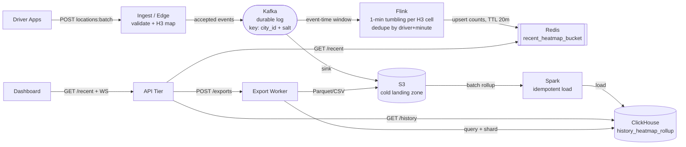
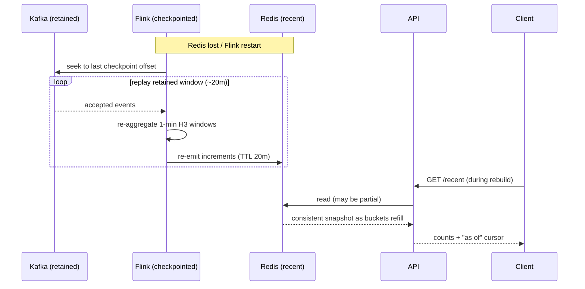
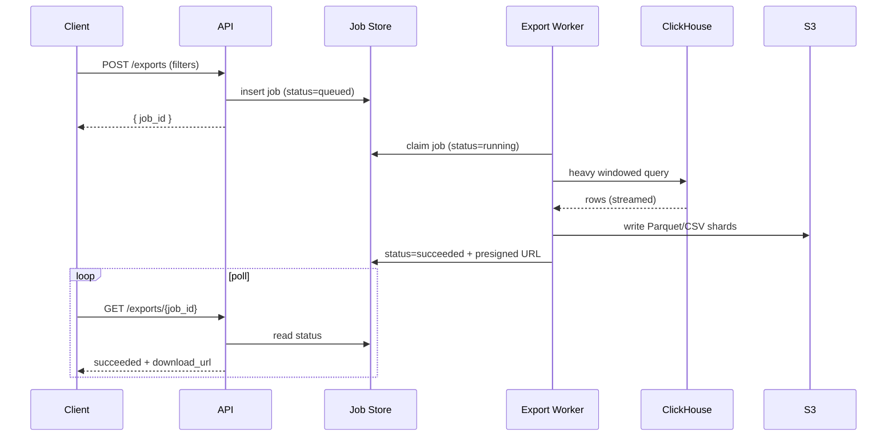

# Design a Driver Location Heatmap

> A rider-facing / internal map view showing driver **supply density** across a city — not per-driver dispatch. The hard part isn't storing GPS forever; it's turning a noisy ~100K/s location stream into density views that feel **live** for the last 20 minutes while keeping older analytics **cheap, complete, and replayable**.

---

## 1. Requirements

### Clarifying questions (and the answers that shaped scope)

| Question asked | Answer | Consequence for design |
|---|---|---|
| Matching drivers to riders, or just density? | **Density only.** Dispatch is a separate system. | This is a **visualization** problem — aggregate counts, not per-driver matching. |
| How fresh must live be? How far back must history reach? | Live ≈ **3 s p95**; history windows ≥ **1 hour** old. | Two incompatible quality bars → recent and historical need **separate serving paths**. |
| Dynamic zoom / ad-hoc grid, or fixed cells? | **Fixed** predefined grid cells. | Discretize GPS → fixed spatial buckets **at ingest** → bounded key space, no runtime geometry. |
| Are hot cells (airport, downtown) real? | **Yes.** Dense areas do far more updates/sec. | Write volume is **skewed** — one partition/shard can't be assumed cheap. |
| One store for live + history? | **No.** Live: 500 ms p95, may approximate at the edge. History: complete over days/weeks. | **Incompatible** — one store can't do sub-second reads, cheap wide scans, and durable replay well. |
| If the live server crashes, empty map OK? | **No** — looks like an outage. Must auto-recover the 20-min picture. | Recent view is **derived state** backed by a durable event log → replay to rebuild. |

### Functional Requirements (top priorities in **bold**)

1. **Drivers publish location updates while online and eligible for the supply map.**
2. **Aggregate accepted updates into small geo buckets at 1-minute granularity for the last 20 minutes.**
3. **Clients read the recent heatmap for a city/viewport and subscribe to low-latency refresh.**
4. Query older aggregated windows (window ends ≥ 1 hour in the past).
5. Request **asynchronous downloads** of historical aggregates over large ranges.

### Non-Functional Requirements (quantified)

- **Freshness (recent):** p95 < 3 s from accepted update → visible on live map.
- **Recent read latency:** p95 < 500 ms for a city/viewport slice.
- **Historical interactive latency:** p95 < 5 s for typical shapes.
- **Exports:** complete **asynchronously**, never block the hot path.
- **Availability/consistency split:** recent path is **highly available, may be slightly approximate at the freshest edge**; historical results favor **completeness + replayability** over pixel-matching the live path.
- **Durability:** raw accepted events and historical rollups are durable and replayable; the hot serving layer is **rebuildable**, not authoritative.
- **Skew tolerance:** survive duplicates, late events, invalid GPS, and hot-cell skew without collapsing a partition or a city shard.

*This is a CAP split by workload — **AP for the recent map, CP-flavored completeness for history** — which DDIA Ch. 9 frames as choosing consistency per use case rather than globally.*

### Estimation (only the numbers that drive decisions)

| Anchor | Order of magnitude | Drives |
|---|---|---|
| Peak accepted updates | **~100K/s** | Kafka partition count, Flink parallelism |
| Concurrent online drivers | ~500K | dedupe working set |
| Live window | 20 min @ 1-min buckets | Redis footprint / rolling cardinality |
| Fresh-edge target | 1–3 s p95 | Flink watermark slack vs. operator lag |
| Recent read | 500 ms p95 | Redis query pattern, API timeouts |
| Historical interactive | 5 s p95 | ClickHouse scan width, rollup grain |
| "Historical" threshold | ≥ 1 hour behind now | routing away from the hot path |

**These anchors are the justification for two paths.** No single store serves sub-second heatmap reads, cheap large-window scans, and durable replay equally well.

---

## 2. Core Entities

- **Driver Location Event** — normalized accepted telemetry; append-only fact keyed by geo + time. Carries `driver_id` (for dedupe), `event_time`, `ingest_time`, `city_id`, `h3_cell`, `h3_resolution`.
- **Recent Heatmap Bucket** — rolling `(city_id, h3_cell, minute_bucket) → count` for the last 20 minutes. Rebuildable cache. **Counts only — no per-driver identity.**
- **Historical Heatmap Rollup** — older aggregates at a chosen resolution, columnar, scan-friendly.
- **Export Job** — control-plane row: `job_id`, requester, window, resolution, `status`, `output_uri`. Must outlive a single HTTP request.

### The spatial bucket: **H3**

Everything downstream depends on the bucketing choice. Map each GPS point to a **stable H3 cell ID at ingest**, then aggregate by `(cell, minute)` — never scan raw lat/lng on read.

- **H3 over raw lat/lng:** stable bucket IDs; no recomputing density from coordinates on every read.
- **H3 over a custom square grid:** get hierarchy + neighborhood math for free (parent/child rollups on zoom) without inventing your own system.
- **H3 over Geohash:** hexagon-like cells behave more uniformly for adjacency and visual density.

```json
{
  "driver_id": "d_123",
  "city_id": "sf",
  "event_time": "2026-04-05T10:03:12Z",
  "lat": 37.775, "lng": -122.418,
  "h3_cell": "89283082803ffff",
  "h3_resolution": 9
}
```

**Invariants**
- Each counted update → exactly one `(h3_cell, minute_bucket)` increment for normal on-time events, with explicit policy for duplicates and late arrivals.
- Recent aggregates store **counts, not traces** — density is a count.
- Historical `(city, resolution, time_bucket)` rows are **idempotent under re-run** — same logical row twice must not double-count.
- Export job rows **survive worker restarts** (object storage holds bytes; a small metadata store holds job state).

---

## 3. API / Interface

**Communication modes:** batched HTTPS/gRPC ingest • REST for canonical reads + export control • WebSocket/SSE for live push (with REST as the recovery path).

### Driver ingest
```
POST /v1/drivers/locations:batch
  body: [{ lat, lng, accuracy, client_ts }], idempotency_key
```
Edge validates sanity, converts to H3, publishes accepted events to Kafka. **Retries reuse the same idempotency key** so dedupe stays stable when mobile networks flap.

### Recent reads (Redis-backed, not ClickHouse)
```
GET /v1/heatmap/recent?city_id=&bbox=&h3_resolution=&minute_cursor=
  → [{ h3_cell, minute_bucket, count }]
```

### Historical (ClickHouse; window ends ≥ 1 hour ago)
```
GET /v1/heatmap/history?city_id=&h3_resolution=&start_minute=&end_minute=
```
Enforces row/byte limits for interactive use — huge pulls go to exports.

### Exports (async)
```
POST /v1/heatmap/exports   → { job_id }        (returns immediately)
GET  /v1/heatmap/exports/{job_id}
  → { status: queued|running|succeeded|failed, download_url? }
```

### Live stream + recovery
```
STREAM heatmap-updates  (WebSocket/SSE): compact changed (h3_cell, minute_bucket, count) tuples
```
On disconnect / gap / detected inconsistency → client re-calls `GET /v1/heatmap/recent` and reconciles. **Push minimizes median latency; the GET is the complete recovery snapshot.**

> **How I'd say it in the interview:** *"Push improves update latency. The REST read gives me the complete recent snapshot I use to recover from a gap or debug a stale tile. Polling-only burns API capacity, obscures freshness, and still stutters on pan/zoom."*

---

## 4. High-Level Design

### Why a single database fails first

The tempting move — write every GPS point to one store, run a lat/lng range query for the last 20 min, point the same store at exports — **collapses** the moment downtown cells go hot, minute boundaries roll, and export scans steal IOPS from the live map. The system serves `(h3_cell, minute_bucket)` counts, **materialized twice**: a low-latency rolling window for 20 min, and cheaper/fuller aggregates for older windows + downloads.

### Two parallel write paths behind one ingest endpoint



**Why each component (and what it beats):**
- **Kafka** — durable ingest log; replay + fanout are not optional (restart → catch up from retained offsets). *Kinesis/Pulsar viable with different ops tradeoffs; name the durable log explicitly.*
- **Flink** — owns stateful recent-window aggregation with **event-time windows, watermarks, checkpointed state**. *Kafka Streams is fine when the topology stays narrow; here correction semantics win.*
- **Redis** — rebuildable serving layer for the last 20 min. **Not the system of record** — if it vanishes, replay rebuilds it.
- **Spark over landed S3** — older windows tolerate minutes of latency; recomputation beats holding everything in a streaming operator forever.
- **ClickHouse** — aggregate-heavy geo+time scans without making the warehouse the live dashboard store.

### Flow 1 — Ingest → recent rollup
Apps `POST …:batch` → edge validates, drops garbage, converts to H3 → publishes to Kafka with **locality-aware partitioning**. Flink consumes with event-time semantics, maintains rolling **1-min tumbling windows per H3 cell**, dedupes by `(driver, minute)`, and emits atomic increments to Redis keyed `city_id:h3_cell:minute_bucket` with **TTL aligned to the 20-min horizon**. The dashboard renders from counts, never from lat/lng tables.

### Flow 2 — Recent read + push + recovery
`GET /recent` hits the API → reads Redis → returns cells + minute buckets + counts. Client opens `heatmap-updates` for incremental refresh; on glitch it re-issues `GET /recent`. **Push = low latency; GET = recovery snapshot.**

### Flow 3 — Historical materialization + query
Kafka Connect / streaming sink writes normalized events to **S3 (cold landing)**. Spark aggregates to minute (or coarser) facts at defined H3 resolutions, **idempotent-loads** into ClickHouse. `GET /history` routes to ClickHouse for windows ≥ 1 hour old — seconds-slower is fine because it isn't fighting the live map for Redis CPU.

### Flow 4 — Export
`POST /exports` enqueues → worker plans a ClickHouse query (or Spark job for very large windows) → writes Parquet/CSV shards to S3 → flips status to `succeeded` with a presigned URL. **Routing rule is fixed: exports read the historical path, never Redis.**

**Failure in one sentence:** if Flink lags, the live map stutters within bounded watermark slack but Kafka retention allows replay; if Spark is behind, history is stale yet internally consistent once batches land — the separate paths keep these failures from combining into one misleading dashboard.

---

## 5. Deep Dives

### 5.1 From GPS points to H3 minute buckets

Lat/lng is the wrong **public** shape — noisy, overlapping, expensive under zoom. The serving contract is **H3 index @ chosen resolution + 1-min bucket**; resolution maps to zoom, parent/child cells give rollups without client-side geometry.

Flink computes **tumbling 1-min windows in event time**, so a delayed ping lands in the minute it *claims*, within allowed lateness. **Watermarks** bound the wait and trade the p95 < 3 s freshness target against late-event completeness. A little edge approximation is acceptable *if documented*; history corrects stragglers on the next Spark pass. *This is exactly the event-time-vs-processing-time and watermark discussion in DDIA Ch. 11 (Stream Processing).*

> This is why Flink beats Kafka Streams **here** — event-time + watermarks are central, so richer state/correction semantics matter more than a lighter topology. Spark Structured Streaming is defensible only if the live window tolerates looser freshness and you're already Spark-heavy.

### 5.2 Duplicates, late, and invalid updates

Mobile networks retry; GPS glitches spike; idle drivers re-send inside the same minute.

- **Validation at the edge:** drop impossible jumps, absurd accuracy, timestamps wildly off server clock.
- **Recent-path dedupe:** idempotent increments per `(driver_id, minute_bucket)` in **Flink keyed state** so retries don't multiply counts.
- **Late within allowed lateness:** update the right minute. **Beyond lateness:** drop, or route to a correction channel the historical job reconciles.

Recent path may be slightly approximate under stress; historical path is complete for landed facts. **That split preserves both availability and trust — neither workload sabotages the other.**

### 5.3 Hot-cell skew, partitioning, and cache rebuild

Supply isn't smooth — airports and downtown cores create hot cells and hot partitions if you partition naively.

- **Kafka:** partition on **`city_id` + salt buckets** so one dense neighborhood doesn't pin a single partition. *DDIA Ch. 6 — the classic hot-key remedy: add a random/salted prefix to spread a skewed key across partitions.*
- **Flink parallelism** scales with partitions.
- **Redis:** shard by city or by hash of `h3_cell` so MGET fanout for a viewport stays bounded.

**Recovery** on Flink/Redis failure = **Kafka replay from the latest checkpoint**, rebuilding the last 20 min from retained history. The map may jump briefly during rebuild, but `GET /recent` returns a consistent snapshot once the operator catches up.



### 5.4 Historical rollups, ClickHouse reads, exports

Older windows live on the historical path so Spark spends **minutes not milliseconds** and ClickHouse scans wide without starving Redis.

**Physical shape (ClickHouse `history_heatmap_rollup`):**
- **Partition:** by month on `minute_bucket` (daily if volume forces it) → cold months drop cheaply via TTL, queries prune partitions.
- **Merge-tree order / PK prefix:** `(city_id, h3_resolution, h3_cell, minute_bucket)` → typical filters cluster on disk, time+cell range scans stay sequential.
- **Dedupe / late correction:** idempotent Spark loads with stable row identity `(city_id, h3_resolution, h3_cell, minute_bucket)` + **ReplacingMergeTree** versioned on `batch_run_id` or `max(event_time)`, so a later batch replaces an earlier partial load. *(AggregatingMergeTree is defensible if you store states; finalized-minute rows are easier to explain.)* Re-running the pipeline **must not double-count**.
- Materialized views can pre-roll parent H3 resolutions for common dashboards, but the **base minute-level table stays canonical** so exports and ad-hoc queries share one source.

```sql
SELECT city_id, h3_resolution, h3_cell, minute_bucket, driver_count
FROM history_heatmap_rollup
WHERE city_id = :city
  AND minute_bucket >= :start
  AND minute_bucket <  :end
ORDER BY minute_bucket, h3_cell;
```
The load-bearing parts: the `minute_bucket` predicate (**partition pruning**) and an `ORDER BY` that follows the **physical sort key**.

**Exports never block the API thread:** `POST /exports` writes a durable job → worker runs the heavy ClickHouse/Spark query → writes shards to S3 → flips `succeeded` with a presigned URL. For multi-TB pulls, **prefer many small files over one giant stream**.



> **How I'd say it:** *"If you remember three things — **H3 minute buckets**, **Kafka replay for rebuild**, and **history on ClickHouse not Redis**."*

---

## 6. Other Considerations

- **Showing freshness when the live path lags:** don't claim sub-second when watermark delay grows or Redis is rebuilding. Show a small **"as of" timestamp** tied to the materialization cursor and degrade tiles predictably rather than silently freezing counts. Push alone doesn't prove complete state — the `GET /recent` recovery contract is how clients/operators reconcile with the durable stream position.
- **Replay / backfill playbooks:** name *who* triggers replay, how far offsets go, and how you validate Redis vs. recomputed counts for a sample city post-recovery. Spark backfills can re-land a corrected day without touching the Flink hot loop, given batch idempotency.
- **Retention & "what you store twice":** short Kafka retention for replay; long S3 retention for audit/recompute; TTL/drop on cold ClickHouse partitions. **Storing data in multiple systems is a deliberate tradeoff** for different access + recovery needs.
- **The 20–60 minute gap:** the awkward band between the live window and "historical." A **warm tier is optional complexity** — micro-batch Flink into the same aggregate tables, or a shorter Spark cadence, *before* adding a third serving system. Add it only when measurements prove the existing paths can't meet the requirement.

---

## Real-World Anchor

**Uber's own stack** motivates this design directly — **H3** is Uber's open-source hexagonal geospatial index, built precisely to bucket the earth into stable cell IDs with clean hierarchy/adjacency for exactly this class of supply-density and dispatch surface. The two-path split (streaming hot store + columnar batch warehouse) mirrors the **Lambda-style** ingestion patterns Bytebytego catalogs for Uber/Lyft telemetry: a Kafka → Flink → serving-cache "speed layer" for freshness, alongside a Kafka → S3 → Spark → columnar "batch layer" for complete history. DDIA Ch. 11 frames this as deriving multiple views from one immutable event log — the recent cache and the historical rollup are both **materialized derivations of the Kafka source of truth**.

---

## 🔍 Senior-Signal Questions to Ask in Your Interview

- **"What's the allowed-lateness setting on the Flink watermark, and where does that number come from?"** → *Why it matters: shows you know freshness (3 s p95) and late-event completeness are in direct tension, and that watermark slack is the tuning dial between them.*
- **"When Redis is mid-rebuild after replay, what does the dashboard show — stale counts, partial counts, or an explicit 'as of' cursor?"** → *Why it matters: surfaces derived-state semantics and the difference between availability and *correct* availability during recovery.*
- **"How do we keep a single hot H3 cell (airport surge) from pinning one Kafka partition and one Flink subtask?"** → *Why it matters: hot-key skew is the classic partitioning failure (DDIA Ch. 6); salted keys + parallelism scaling is the expected answer.*
- **"Is recent-path dedupe idempotent-increment or last-write-wins, and what happens to a retry that arrives after the minute window closes?"** → *Why it matters: tests exactly-once-ish reasoning on the hot path vs. reconciliation on the batch path.*
- **"What's the retention math — how short can Kafka retention be while still guaranteeing we can rebuild the full 20-minute window after the worst realistic outage?"** → *Why it matters: ties an operational cost lever directly to a correctness/recovery guarantee, a staff-level framing.*