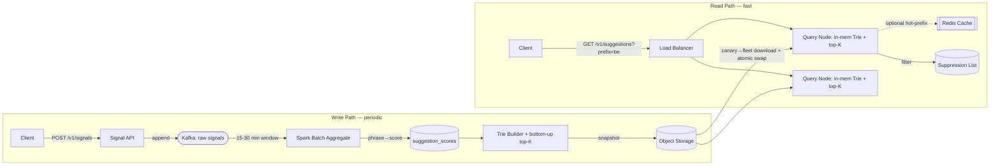
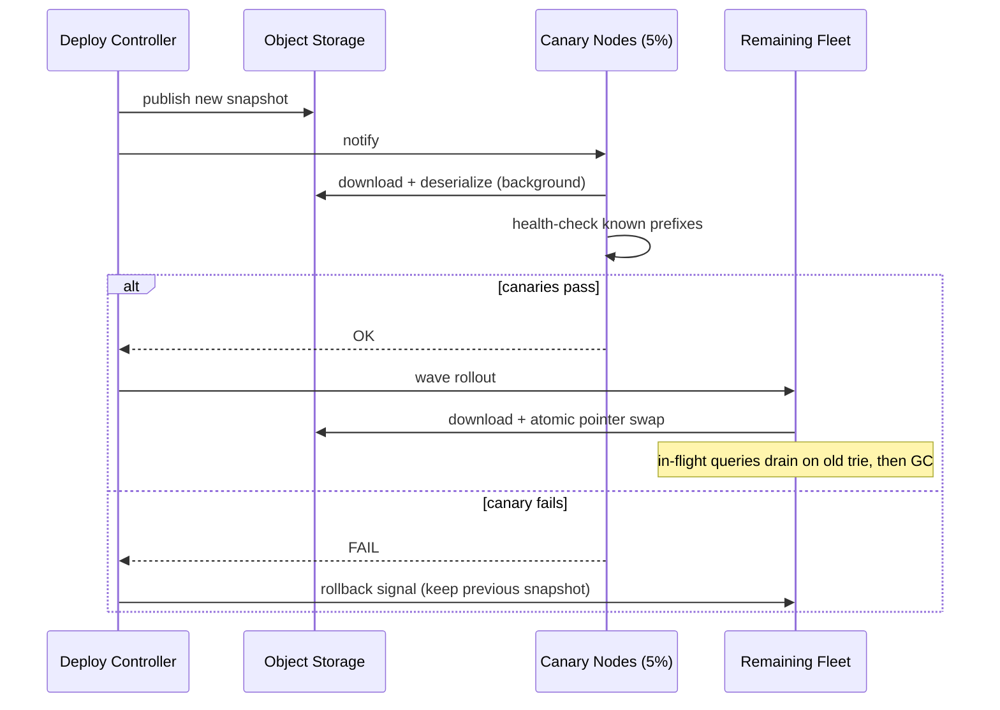

# Design Typeahead Suggestion (Autocomplete)

> Ranked query completions for any prefix, in < 100 ms p99, at ~60K QPS, with rankings that reflect the last 15–30 minutes of search activity.

---

## 1. Requirements

### Functional (top 3, prioritized)

1. **Prefix lookup** — as a user types, return the **top 5–10 ranked suggestion strings** matching the prefix, within 100 ms.
2. **Signal ingestion + periodic aggregation** — ingest completed searches / clicks, aggregate every **15–30 min** to recompute popularity scores.
3. **Content suppression** — remove/suppress offensive or policy-violating phrases **without** waiting for a full index rebuild.

**Clarifications locked (and why they matter):**
- *Prefix-only, plain strings — no fuzzy match, no rich entities* → serving layer is a **prefix-keyed trie with per-node top-K**, not an edit-distance or embedding index.
- *Rankings must reflect last 15–30 min* → **periodic batch aggregation** at that cadence + **atomic snapshot swaps**, not nightly rebuilds.
- *Short prefixes are orders of magnitude hotter* → **full vocabulary replicated on every node**, never range-sharded by prefix (which would recreate the hotspot on one shard).
- *Zero-downtime refresh* → **RCU-style swap**: hold the old snapshot until in-flight readers drain, then flip.

### Non-functional (top 5, quantified)

- **Latency:** < **100 ms p99** end-to-end for prefix lookup (single-digit ms on the trie itself).
- **Throughput:** ~**60K QPS** peak (5 keystrokes × 500M daily searches ≈ 2.5B lookups/day).
- **Freshness:** rankings reflect the most recent **15–30 min** window.
- **Availability:** ≥ **99.9%** on the read path, *including during rebuilds and partial failures*.
- **Consistency:** read path is **eventually consistent** (bounded staleness OK); suppression is **strongly authoritative** at query time. *(DDIA Ch. 5 — the trie is a derived, replicated read view; the signal log is the leader/truth.)*

### Capacity note

Only one number changes a decision: raw uncompressed trie ≈ **5–8 GB** for 50M phrases @ ~25 chars → **fits in RAM on one node**. That single fact is why we **replicate the full trie per node instead of sharding the vocabulary**. Everything else is standard.

---

## 2. Core Entities

- **Signal** — a completed search or click event (`phrase`, `type`, `timestamp`). Append-only truth.
- **SuggestionScore** — aggregated `(phrase → popularity_score)`, regenerated each cycle.
- **TrieSnapshot** — serialized, immutable, top-K-cached trie; the derived serving index.
- **SuppressionEntry** — an admin-blocklisted phrase, authoritative over score.

---

## 3. API / Interface

REST is sufficient — the read path is a stateless, independent lookup that completes in single-digit ms, so **WebSockets add nothing**; client-side debouncing (50–100 ms) handles keystroke rate.

```
GET  /v1/suggestions?prefix={prefix}&limit={k}     # hot read path
POST /v1/signals                                    # fire-and-forget ingest → Kafka
DELETE /v1/suggestions/{phrase}                     # admin suppression (authed)
```

`GET /v1/suggestions` response:

```json
{ "suggestions": ["best buy", "best movies 2026", "best restaurants near me"], "cached": false }
```

- **Prefix query** is the *only* endpoint that must be fast — public, no auth, IP/session rate-limited.
- **Signals** are fire-and-forget; duplicate signals barely move an aggregate, so **no idempotency key** needed.
- **Suppression** is admin-only and takes effect within seconds via node polling/push.

---

## 4. High-Level Design

**Why the obvious approaches fail:**

| Approach | Why it breaks |
|---|---|
| Relational `LIKE 'prefix%' ORDER BY score` | 60K QPS × range scans over 50M rows; sort touches too many rows → p99 blows past 100 ms. |
| Redis sorted set per prefix | Works, but pays a **network hop per keystroke** when the data fits in local RAM. Demote to *optional* hot-prefix cache only. |
| **In-memory trie w/ per-node top-K** ✅ | Lookup is **O(prefix_length)** — walk to the node, read the pre-computed top-K. No hop, no sort, no subtree scan. |

The two pressures that force the *full* design: (1) freshness — rebuild every 15–30 min **without locking live reads**; (2) skew — a static single node can't absorb 60K QPS of hot-prefix traffic. So the **ingestion pipeline must run independently of serving**, and **snapshot distribution is first-class**.



**Flow 1 — Prefix serving:** LB → query node → traverse `b → e` in the in-memory trie → read cached top-K → filter against suppression list → return. Single-digit ms.

**Flow 2 — Ingestion:** `POST /v1/signals` → Kafka (returns immediately). Every 15–30 min, Spark consumes the window, counts frequencies (recency-weighted), writes `suggestion_scores`. The **trie builder** reads all scores, inserts phrases, and **propagates top-K lists bottom-up** — this precompute is what makes serving O(prefix_length).

---

## 5. Deep Dives

### 5.1 Rebuild without disrupting live reads (RCU swap)

Build offline → swap atomically → GC the old copy. Distribution is **canary-then-fleet**: ~5% of nodes download + deserialize + health-check known prefixes; if canaries pass, wave to the fleet; if any fails, **rollback to the previous valid snapshot**. On each node the swap is a single pointer flip; in-flight queries finish on the old trie, which is GC'd once no request references it — the exact **read-copy-update** pattern.



**Failure handling:** a failed/corrupt pipeline run means nodes **keep serving the previous valid snapshot** — *stale-but-correct beats broken*. Pipeline retries next cycle; alert on consecutive failures. *(DDIA Ch. 3 — derived data can always be rebuilt from the log of truth.)*

### 5.2 Hot prefixes at 60K QPS

Levers in order of preference:
1. **Replicated trie** — every node serves every prefix, so plain LB + horizontal scale absorbs most growth. No sharding, no cross-node coordination (all nodes serve the same immutable snapshot).
2. **Redis result cache** *(only if measured)* — cache hot prefixes with TTL aligned to the aggregation cycle; worthwhile only when saved local work > the network hop.
3. **CDN edge cache** for extreme cases — 5–10 s TTL; trending suggestions change slowly relative to that, so mild extra staleness is acceptable.

### 5.3 Suppression outside the rebuild cycle

`DELETE` → `suppression_list` table → query nodes **poll every few seconds** (or push). At query time, after reading top-K from the trie, filter blocklisted phrases before returning. The phrase still lives in the trie until the next rebuild (builder can optionally exclude it then), but is invisible now. **Consistency boundary:** suppression list is authoritative for *what users see*; the trie is authoritative for *ranking among non-suppressed phrases*.

### 5.4 Memory optimization

- **Radix / Patricia compression** — collapse single-child chains (`h→e→l→l→o` → `hello`).
- **Vocabulary pruning** — drop phrases below a score threshold (only top-K ever surfaces anyway): 30–50% cut, negligible quality loss.
- Together: ~8 GB → **2–4 GB per node**, comfortably commodity-replicable.

---

## Real-World Anchor

Google, Bing, and Amazon search boxes all serve autocomplete from **precomputed, replicated prefix structures with offline rebuilds** rather than live DB range scans — the same derived-index-over-a-signal-log split. Bytebytego's typeahead treatment mirrors this: trie serving layer + periodic aggregation + hot-prefix caching, with the atomic snapshot swap as the freshness mechanism.

---

## 🔍 Senior-Signal Questions to Ask in Your Interview

- **"What breaks first if freshness tightens from 15 min to sub-minute?"** → *Why it matters: exposes the batch→streaming inflection — Spark micro-batch/Flink incremental top-K instead of full rebuilds, and whether per-node swaps can keep pace.*
- **"Is the top-K correct at boundary nodes, or can bottom-up propagation miss a globally-top phrase that isn't locally top?"** → *Why it matters: tests understanding that each node must aggregate its subtree's top-K, not just its children's — a real correctness trap.*
- **"How do we bound memory blowup for CJK / multi-language tries?"** → *Why it matters: branching factor explodes from ~36 to thousands; signals awareness that one-trie-per-locale is the clean scaling answer.*
- **"During a canary failure mid-wave, can the fleet end up split across two snapshot versions — and does that matter?"** → *Why it matters: probes rollout consistency; the answer (immutable snapshots → both versions correct, just different freshness) shows you reason about partial-deploy states.*
- **"Where's the dual-write risk between Kafka and the score table?"** → *Why it matters: surfaces that the score table is a pure derived read model rebuilt from the log, so there's no dual-write to reconcile — a clean truth-vs-derived boundary.*