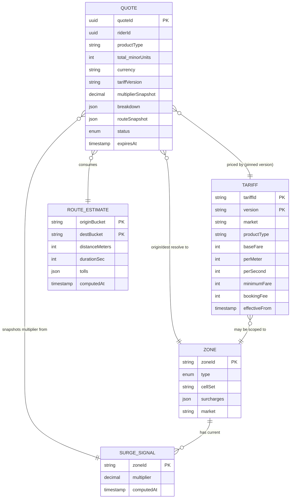
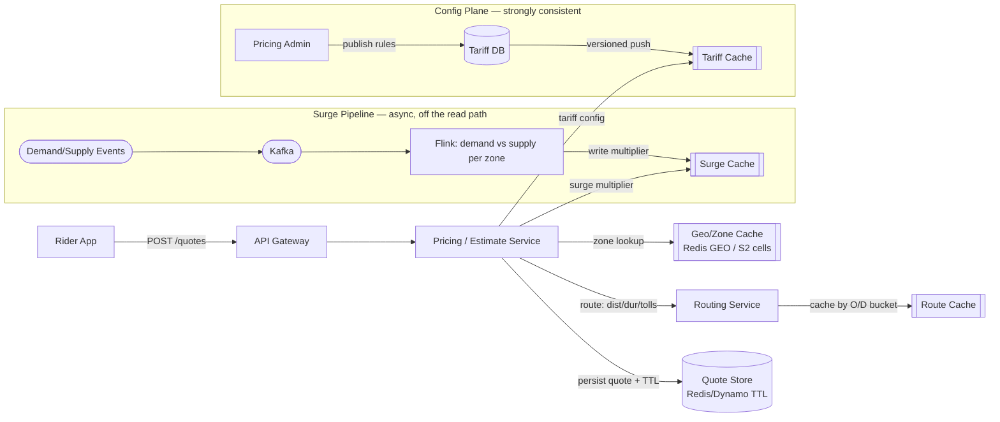
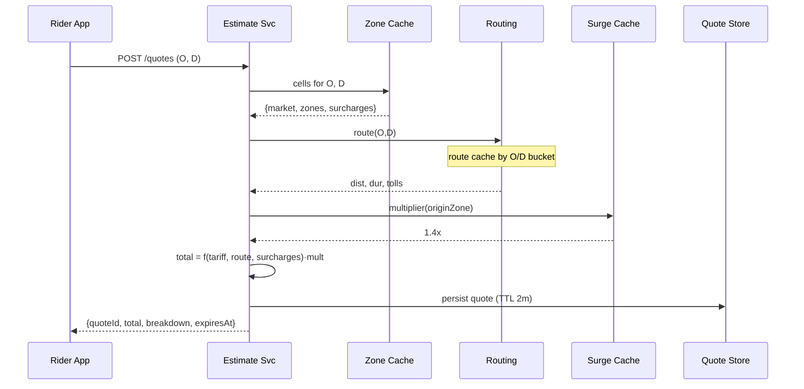

# Design a Ride Price Estimation Service (Robotaxi)

> **Interview framing.** This is the flagship prompt for the Tesla Core Services / Robotaxi team: real-time, low-latency, high-availability ride pricing. The trap is treating the estimate as authoritative money. It is not — the estimate is a *cached, non-authoritative quote*; the final bill is recomputed server-side from actual ride telemetry. Keep those two paths separate and you're already signaling senior.

---

## 1. Requirements (~5 min)

### Functional (top 3, prioritized)
1. **Return a fare estimate** for a given (pickup, dropoff) at request time — base fare + distance + time + surcharges (traffic, tolls, airport fees) + demand multiplier.
2. **Support location-based pricing** — different pricing rules/zones per market and per geofence (airport, city core, event zone).
3. **Produce a quote artifact** (quoteId, price, breakdown, TTL) that the booking flow can reference — so the price shown is the price honored (within TTL).

*Clarifying questions I'd ask:* Is the estimate binding (locked) or advisory? → Assume **locked for a short TTL** (e.g. 2 min), then re-quote. Do we support upfront pricing (fixed) or metered (recompute at end)? → Assume **upfront estimate + server-authoritative final bill** that can differ if the route materially changed.

### Non-functional (top 4, quantified)
- **Latency:** p99 estimate < **150 ms** end-to-end. This is a pre-booking screen; users abandon on lag.
- **Availability:** **99.99%** on the read/estimate path. A down estimator = no bookings = direct revenue loss. Favor **AP** here (*DDIA Ch. 9* — an estimate is not a linearizable operation; a slightly stale surge multiplier is acceptable, unavailability is not).
- **Scalability:** bursty — surge events, airport arrivals, rush hour. Read-heavy (estimates >> completed rides; many quotes never convert).
- **Freshness:** surge/traffic inputs may be **seconds-to-minutes stale**; acceptable. Pricing *rules* (config) must be strongly consistent — a bad rule mis-charges every rider.

**Estimation note:** I'll only compute numbers if they change a decision. Relevant one: if estimates run ~50–100× completed rides at peak, the read path must be cache-first and never block on the write/billing DB.

---

## 2. Core Entities (~2 min)

A first-draft data model — just the design-relevant fields. In the interview, name the entities fast, then let the fields fall out during High-Level Design as you see what each request reads/mutates. The one worth dwelling on is **Quote**, because its stored breakdown is what makes the shown price trustworthy at booking time.

**Quote** — the artifact the estimate produces; the handoff to booking. *Immutable once created; recomputed by issuing a new quote, never edited.*
| Field | Type | Why it's here |
|---|---|---|
| `quoteId` | UUID | Idempotency + the booking handoff reference |
| `riderId` | UUID | Derived from auth token, not the body |
| `origin`, `destination` | `{lat,lng}` | The priced O/D pair |
| `productType` | enum | Robotaxi tier / vehicle class → which tariff |
| `currency` | ISO-4217 | Market currency, frozen at quote time |
| `total` | money (minor units) | The headline price honored within TTL |
| `breakdown` | struct | `{ base, distanceComponent, timeComponent, surcharges[], multiplier }` — the itemization shown + audited |
| `tariffVersion` | string | **Which pricing-rule version priced this** — pins the quote so a mid-flight rule change can't retro-alter it |
| `multiplierSnapshot` | decimal | The surge value *at quote time* (frozen — not re-read later) |
| `routeSnapshot` | struct | `{distanceMeters, durationSec, tolls[]}` used, so the bill can diff against actuals |
| `status` | enum | `ACTIVE → CONSUMED` (booked) / `EXPIRED` (TTL lapsed). Forward-only |
| `expiresAt` | timestamp | Short TTL (~2 min); after this the price is re-quoted |
| `createdAt` | timestamp | Audit + TTL basis |

Store money as **integer minor units** (cents), never floats — rounding drift on a money field is a real bug. Freeze `currency`, `tariffVersion`, and `multiplierSnapshot` *into* the quote so the price is reproducible and immune to later config/surge changes.

**PricingRule / Tariff** — the price schedule, keyed by market + product (+ optionally zone). *Versioned, immutable, strongly consistent.*
- `tariffId`, `version` (immutable version id — services pin a version and roll forward)
- `market`, `productType`, `currency`
- `baseFare`, `perMeter` (or perMile), `perSecond` (or perMin), `minimumFare`, `bookingFee`
- `effectiveFrom` / `effectiveTo` (time-bounded, so you can price a past ride with the rule in effect *then*)
- `status` (`DRAFT → PUBLISHED → RETIRED`)

**Zone / Geofence** — a priced region: airport, surge cell, toll area, market boundary.
- `zoneId`, `type` (`AIRPORT | SURGE | TOLL | MARKET`)
- `cellSet` — the S2/H3 cell ids covering the polygon (what the hot-path lookup keys on) **or** `polygon` (GeoJSON, for offline cell-set generation)
- `surcharges[]` — `{ name, amount | percentage }` (e.g. airport pickup fee)
- `market` it belongs to

**SurgeSignal** — the live demand multiplier per zone; the async pipeline's only output. *Ephemeral, eventually consistent.*
- `zoneId` (key)
- `multiplier` (decimal, e.g. 1.4)
- `computedAt` / `windowEnd` (so a reader can judge staleness)
- `demand`, `supply` (optional, for observability/debugging)
- short TTL — a stale multiplier falls back to 1.0 rather than lingering forever

**RouteEstimate** — distance/time/tolls for an O/D pair, from the routing provider; cached.
- `originBucket`, `destBucket` (coarsened O/D → the cache key; exact coords would never cache-hit)
- `distanceMeters`, `durationSec`
- `tolls[]` — `{ segmentId, amount }`
- `computedAt`, `ttl` (traffic-dependent duration ages out faster than distance)

> **Entity relationships in one line:** a **Quote** is priced by pinning one **Tariff** version, reading a **SurgeSignal** for its origin **Zone**, and consuming a **RouteEstimate** — freezing a snapshot of all three so the number is reproducible at booking and diffable at final-bill time.



---

## 3. API / Interface (~5 min)

REST. Rider identity from auth token, never the body.

```
POST /v1/quotes
  body: { origin:{lat,lng}, destination:{lat,lng}, productType, scheduledTime? }
  200:  { quoteId, currency, total, breakdown:{ base, distance, time, surcharges[], multiplier },
          expiresAt }

GET /v1/quotes/{quoteId}
  200:  { ...quote..., status: ACTIVE|EXPIRED|CONSUMED }
```

The `quoteId` is the handoff to the booking service: booking references a quote, and the quote's stored breakdown is what gets honored. That linkage is what makes the shown price trustworthy.

---

## 4. High-Level Design (~12 min)

Endpoint-by-endpoint. `POST /quotes` drives everything.

**Estimate flow:**
1. Resolve **zones** for origin & destination (geofence lookup — which market, is it an airport, is it in a surge cell).
2. Fetch **route** (distance/duration/tolls) from routing provider (cached per O/D bucket).
3. Load **tariff** for market+product (hot config in cache).
4. Read **surge multiplier** for origin zone (fast store, continuously updated).
5. Compute: `total = max(minimum, base + perMile·miles + perMin·minutes + Σsurcharges) · multiplier`.
6. Persist the **Quote** (with TTL) and return it.



**Key structural decision:** the **surge pipeline is fully asynchronous** and off the request path. The estimate service only ever *reads* a precomputed multiplier from cache. It never computes demand inline. This is what buys the 150 ms p99 and the 99.99% availability — the read path touches only fast stores, never Kafka/Flink/OLTP.

---

## 5. Deep Dives (~12 min)

### 5.1 Zone resolution: point-in-polygon at low latency
Naive point-in-polygon against every market polygon is too slow. Use a hierarchical cell index — **S2 cells** (or geohash/H3). Precompute a mapping `cell → {market, zones, surcharges}` and load it into memory/Redis. A lookup becomes: point → cell id → hash lookup. O(1), no geometry math on the hot path.

- Airport surcharge (JD calls this out explicitly) = a zone whose polygon covers the terminal roads; membership adds a fixed fee + possibly its own multiplier.
- *Real-world anchor:* Uber uses hexagonal cells (H3, their own library) for exactly this — pricing, surge, and supply/demand bucketing all key off the cell id.

### 5.2 Surge as a two-level streaming aggregation
Demand (quote requests, open app sessions) and supply (idle vehicles) stream as events → Kafka, **partitioned by zone/cell** (the ordering unit — never partition by a low-cardinality field). Flink keys by zone, windows over the last N minutes, computes `f(demand/supply)` → writes the multiplier to the surge cache.

- Two-level combiner: pre-aggregate per (cell) at the edge, then combine per (zone) — reduces shuffle. (*Your two-level aggregation pattern.*)
- Staleness is a feature, not a bug: a multiplier that's 10–30 s old is fine. Never block a quote on fresh surge computation.



### 5.3 Estimate vs. final bill — the correctness boundary
The quote is **advisory and cached**. The final bill is **authoritative and recomputed** at ride end from actual telemetry (real distance, real duration, real tolls, actual route). Design rule:

- Quote lives in a fast TTL store; it is *not* the source of truth for money.
- At ride completion, the billing service (separate doc) recomputes from server-side ride facts. If upfront pricing is promised, you honor the quote *unless* the route materially deviated (rider changed destination) — that's a forward-only state transition into a re-price, not a silent edit.
- **Server-side time & telemetry as authority** — client-reported distance is an input, never the truth.

### 5.4 Availability & failure modes
- **Routing provider down** → fall back to haversine distance × road-factor + historical avg speed. Degraded but available. Never fail the quote.
- **Surge cache down** → default multiplier to 1.0 (charge base). Fail *open toward the rider* (undercharge risk) rather than block bookings; alert.
- **Tariff cache miss** → this is the one thing you cannot guess. Fall back to last-known-good versioned config baked into the service; if truly absent, fail the quote (never invent a price).
- Multi-region active-active on the read path; quote store is regional (quotes are short-lived, no need to replicate globally).

### 5.5 Consistency split
- **Pricing rules / tariffs → strongly consistent, versioned.** A bad rule mis-charges everyone. Publish immutably with a version id; services pin a version and roll forward. (*DDIA Ch. 5 — versioned config as a replicated log.*)
- **Surge / route / quote → eventual / AP.** Staleness tolerable, availability paramount.

---

## 🔍 Senior-Signal Questions to Ask in Your Interview
- **"Is the upfront estimate contractually binding, or advisory with a server-authoritative final bill?"** → *Signals you understand the estimate/settlement correctness boundary and won't treat a cached quote as money.*
- **"What's our tolerance for surge staleness, and do we fail open or closed when the surge signal is unavailable?"** → *Shows you reason about degraded-mode pricing and the revenue/UX trade-off of failing open.*
- **"How do we version and roll out pricing rules so a bad tariff doesn't mis-charge an entire market?"** → *Config-as-a-replicated-log thinking; the highest-blast-radius failure in pricing.*
- **"Do we partition surge computation by cell or by zone, and how do we avoid hot partitions during airport arrivals or event lets-out?"** → *Hot-spot awareness on the streaming layer — the classic scaling inflection.*
- **"What geospatial index — S2, H3, geohash, PostGIS — and why?"** → *Signals you know point-in-polygon at scale is a solved problem with a specific right answer, not runtime geometry.*

**DDIA anchors:** Ch. 9 (linearizability vs. availability — why estimates are AP), Ch. 5 (versioned config replication), Ch. 11 (stream processing for surge).
**Real-world anchor:** Uber's H3 cell system for surge & pricing; upfront-pricing model (quote honored within a window, recomputed on route deviation).