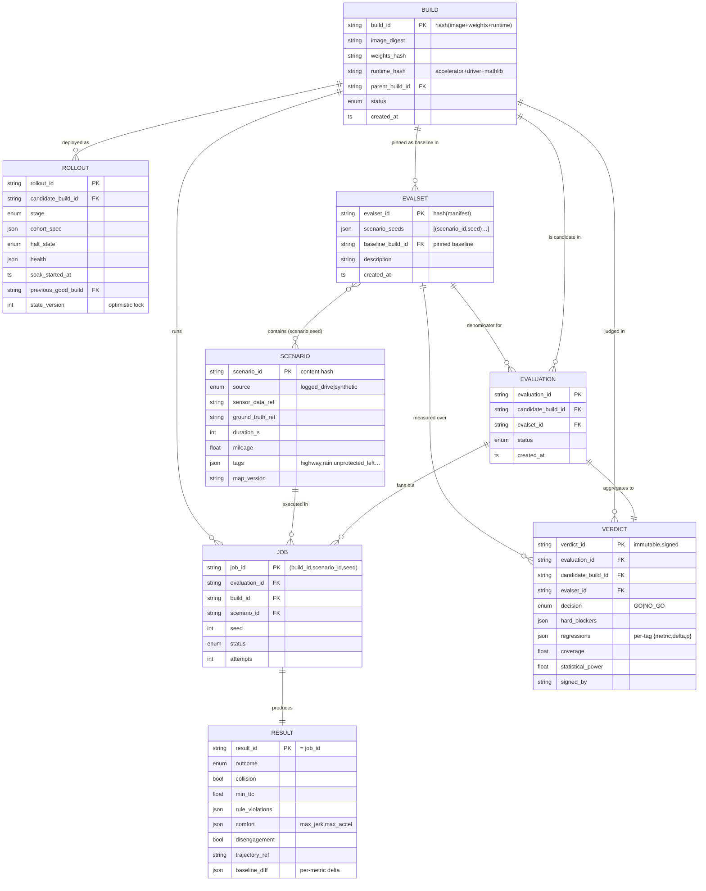
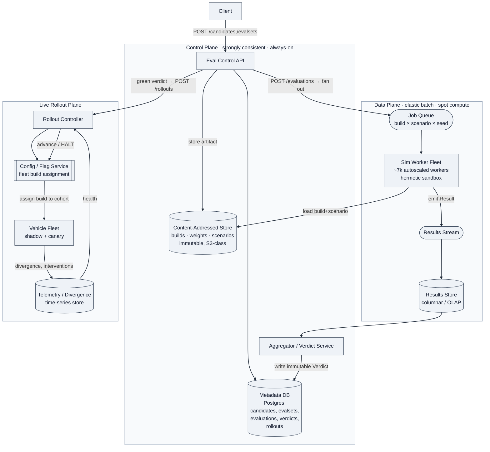
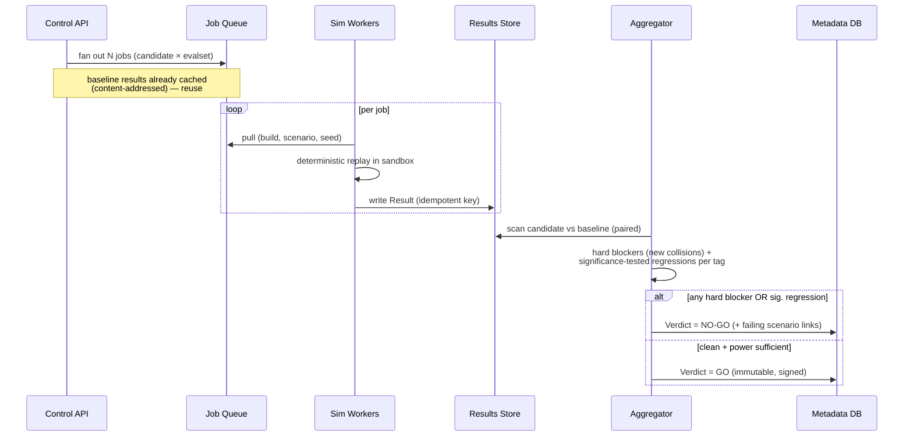
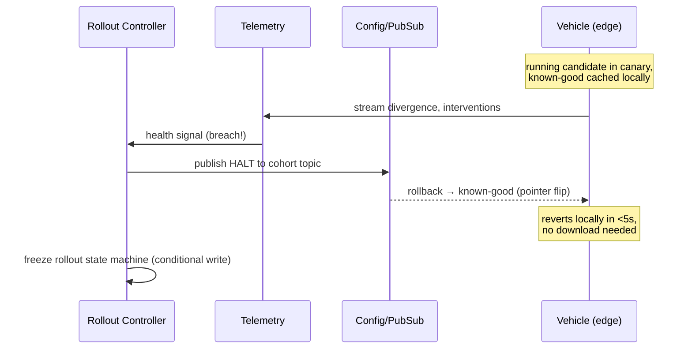

# Design an Autonomous Driving Software Evaluation Platform

> The system that decides whether a new AV software build (a "candidate") is safe enough to ship to the fleet. Think of it as **CI/CD for a driving policy**, where the "tests" are millions of miles of scenario replay plus a small, carefully-gated live rollout.

---

## The organizing thesis

**A candidate build is *guilty until proven innocent*, and "proven" means a statistically-defensible verdict computed from a frozen, reproducible corpus — never from a single run.**

Every design decision propagates from that: evaluation must be *deterministic and reproducible* (same build + same scenario + same seed → same result, always), the verdict must be *aggregated over a fixed denominator* (you can't declare a regression if the eval set silently changed underneath you), and the live-rollout stage exists only to catch what simulation *cannot* — and must be able to **halt in seconds**, not minutes.

This is a **correctness-tier problem, not a throughput problem.** Throughput (millions of sim-miles/day) is a cost/latency constraint. Correctness is: *did we compare the right build against the right baseline on the right frozen data, and is the "ship" decision reproducible and auditable months later when someone asks why?*

---

## 1. Requirements (~5 min)

### Clarifying questions I'd ask first

- **What are we evaluating — the full stack or a module?** Assume the full driving *policy* (perception→prediction→planning→control), evaluated as a black box that consumes sensor input and emits vehicle controls. This is the general, harder case.
- **Do we have logged real-world drives to replay against?** Yes — assume a large corpus of recorded fleet drives (sensor logs + ground-truth) plus a curated library of hand-authored/synthetic scenarios (the hard, rare, safety-critical cases). This is the Tesla/Waymo model.
- **Sim-only, or sim + live?** Both. Simulation is the gate; a **shadow-mode + limited live rollout** is the final confirmation before fleet-wide.
- **Who is the decision-maker?** A human safety board *approves*, but the platform must produce the go/no-go signal and the evidence. We're not fully automating the ship decision — we're making it defensible.

### Functional Requirements (top 3)

1. **Submit a candidate build and run it against a frozen evaluation corpus** (logged-drive replay + scenario library) at massive parallelism, producing per-scenario pass/fail + safety metrics.
2. **Compute an aggregate verdict vs. a baseline build** — regression detection on safety-critical metrics (collisions, near-misses, disengagements, comfort, rule violations) with statistical significance, not raw counts.
3. **Progressive live rollout with shadow mode → staged canary → auto-halt** — run the candidate on real vehicles behind a safety envelope, monitor real-world divergence, and roll back in seconds on trigger.

*Out of scope (stated explicitly):* training the model, sensor calibration, the sim engine's physics fidelity itself (we consume it), the HD-map pipeline.

### Non-Functional Requirements (top 5, quantified)

| NFR | Target | Why |
|---|---|---|
| **Reproducibility / determinism** | Bit-exact or metric-stable replay: same (build, scenario, seed) → same verdict, indefinitely | The verdict is legal/safety evidence. Non-determinism = no defensible decision. |
| **Evaluation throughput** | 10M+ sim-miles per candidate, full suite in < 12h wall-clock | Ship cadence. A 3-day eval kills iteration. |
| **Rollout halt latency** | Global fleet halt/rollback command propagates in **< 5s** | This is the safety kill-switch. Minutes is unacceptable. |
| **Verdict integrity (consistency)** | Strong consistency on the eval-set manifest, baseline pointer, and verdict record | You must never compare against a mutated denominator. Correctness > availability *here*. |
| **Auditability / durability** | Every verdict immutable + reproducible for years; zero loss of eval results | Regulatory. "Why did we ship build 4.7?" must be answerable in 2029. |

### On estimation

I won't front-load QPS math. The one number that *changes a decision*: **10M sim-miles at ~30 s of real-vehicle-time per sim-mile ≈ 83k sim-hours per candidate.** To finish in 12h wall-clock you need **~7k concurrent sim workers**. That number is why the sim tier is an autoscaling batch fleet on spot/preemptible compute, not a standing service — I'll return to it in the deep dive.

---

## 2. Core Entities (~2 min)

- **Build (Candidate)** — an immutable, content-addressed software artifact (container image digest + model weights hash). The unit under test.
- **Baseline** — a pinned Build the candidate is measured against (usually current production).
- **Scenario** — one evaluable unit: a logged-drive segment *or* a synthetic scene. Immutable, versioned, tagged (`highway`, `unprotected-left`, `pedestrian-occlusion`, `rain`).
- **EvalSet (Suite Manifest)** — a *frozen, versioned* set of Scenario IDs + seeds. The denominator. This is the entity that must never mutate mid-run.
- **Job / Run** — one (Build × Scenario × seed) execution. Produces a Result.
- **Result** — per-scenario outcome + metrics (collision?, min-TTC, jerk, rule violations, disengagement, trajectory divergence from baseline).
- **Verdict** — the aggregated go/no-go for (Candidate vs. Baseline over EvalSet), with significance stats. Immutable.
- **Rollout** — a live-fleet deployment record: stage, cohort, health, halt-state.

### Attributes (and why each field earns its place)

The one-liners above are the whiteboard version. In an interview I'd expand only the entities carrying an invariant — Build identity, EvalSet immutability, and the Verdict — but here's the full shape:

**Build (Candidate)**
```
build_id            content hash of (image_digest + weights_hash + runtime_hash)  ← PK, immutable
image_digest        container image the policy runs in
weights_hash        model weights artifact hash
runtime_hash        pinned accelerator type + driver + math-lib version
parent_build_id     lineage (what this branched from)
status              registered | evaluating | approved | rejected | in_rollout | retired
created_at, author
```
The load-bearing choice: `build_id` is a content hash that **includes the runtime**, not just the model. Two builds with identical weights but a different CUDA/driver version are *different builds*, because float drift across runtimes can flip a collision outcome (see determinism deep dive). If `runtime_hash` weren't in the identity, you could cache a baseline Result from hardware A and compare a candidate on hardware B — silent verdict corruption.

**Baseline** — *not a separate table.* A pinned pointer to a `build_id`, stored **inside** the EvalSet. Modeling it as its own mutable "current baseline" entity is the trap: if the pointer can move between the baseline run and the candidate run, you're comparing against a shifting denominator.

**Scenario**
```
scenario_id         content hash of the scene data  ← PK, immutable
source              logged_drive | synthetic
sensor_data_ref     pointer into content-addressed store (raw logs / scene spec)
ground_truth_ref    labeled objects, right-of-way, map context
duration_s, mileage
tags[]              highway, unprotected_left, pedestrian_occlusion, rain, night…
map_version         HD-map snapshot it was authored against
```
Content-addressed `scenario_id` means a "fixed" scenario is a **new** scenario, never a mutation of the old one. `tags[]` are what make the verdict sliceable ("regressions on unprotected-lefts in rain") — without them the aggregate is a single undifferentiated pass rate that hides the safety-critical pockets.

**EvalSet (Suite Manifest)** — *the* correctness entity.
```
evalset_id          content hash of the manifest contents  ← PK, immutable
scenario_seeds[]    ordered list of (scenario_id, seed) pairs  ← the frozen denominator
baseline_build_id   pinned baseline (see Baseline above)
description          "safety-critical regression suite v12"
created_at, author
```
An immutable, content-addressed set of exact `(scenario_id, seed)` pairs **plus** the pinned baseline. The seed is part of the tuple because determinism requires it — same scenario, different seed = a different evaluable unit. Freezing this guarantees candidate and baseline ran on a bit-identical corpus.

**Job / Run**
```
job_id              (build_id, scenario_id, seed)  ← PK is the tuple itself
evaluation_id       which evaluation fanned it out
status              queued | running | done | failed | preempted
worker_id, attempts
result_id           → Result (once done)
```
The PK **is** the tuple, which makes Jobs idempotent: a preempted spot worker's Job requeues and overwrites the same key, so at-least-once delivery is safe and duplicates are harmless. It's also why baseline Jobs are free on re-run — the tuple already exists, so it's a cache hit.

**Result**
```
result_id           = job_id (1:1)  ← PK
outcome             pass | fail | error
collision           bool + severity
min_ttc             minimum time-to-collision (near-miss proxy)
rule_violations[]   ran_red, wrong_lane, illegal_turn…
comfort             max jerk, max accel
disengagement       did the safety envelope trip?
trajectory_ref      full replay artifact for human review
baseline_diff       per-metric delta vs. baseline on the SAME (scenario, seed)
```
`baseline_diff` is the entity-level expression of the paired-diff insight: because build and baseline ran identical input, the Result stores a direct delta, not two independent measurements to reconcile later. `trajectory_ref` links back to a replayable artifact so a "fail" is inspectable, not just a boolean.

**Verdict**
```
verdict_id          ← PK, immutable, signed
evaluation_id, candidate_build_id, evalset_id
decision            GO | NO_GO
hard_blockers[]     new collisions the baseline didn't have  ← auto NO_GO, no stats
regressions[]       per-tag {metric, delta, p_value, significant}
coverage            scenarios_run / scenarios_in_evalset  ← guards partial runs
statistical_power   was N sufficient to detect the target effect size?
signed_by, created_at
```
Immutable and **signed** because it's durable safety evidence — "why did we ship build 4.7?" must be answerable years later. Two fields separate a rigorous verdict from a naive one: `hard_blockers` (a new collision on identical input is an automatic NO_GO — no significance test needed) and `coverage` + `statistical_power` (you can't declare GO on a partial run, or on an N too small to detect the regression you care about).

**Rollout**
```
rollout_id          ← PK
candidate_build_id
stage               shadow | canary_1pct | 5pct | 25pct | 100pct
cohort_spec         which vehicles (geo, model, opt-in)
halt_state          active | halted | rolled_back
health              current divergence / intervention rate
soak_started_at     stage-entry time (gates min soak before advance)
previous_good_build fallback pointer for instant rollback
state_version       optimistic-lock version  ← every advance is a guarded CAS
```
`state_version` makes every `advance`/`halt` a conditional write on the state machine — you can't advance a stage that's already halted, and concurrent monitors can't race. `previous_good_build` is what makes the <5s halt a pointer flip instead of a download, biasing the fail-safe toward known-good.

### Entity-Relationship diagram



*(Note: `erDiagram` doesn't have the subgraph-background problem the flowcharts did — it renders on the default theme with dark text/lines, so no `classDef` styling is needed here.)*

### A concrete row-level trace

Suppose engineer *S. Kumar* registers candidate **`build_9f3a…`** (weights `w_44e1`, runtime `rt_cu122` = CUDA 12.2 on A100). Production is **`build_7c02…`**. She freezes **`evalset_5b1d…`**, a manifest of 3 scenarios each at seed 42: **`scn_hwy_01`** (`tags:[highway,clear]`, 4.2 mi), **`scn_ul_07`** (`tags:[unprotected_left,rain,night]`, 0.6 mi), **`scn_ped_12`** (`tags:[pedestrian_occlusion,urban]`, 0.9 mi), with `baseline_build_id = build_7c02`. Submitting **`eval_3311`** fans out 6 Jobs — the candidate and the baseline each ×3 scenarios — but the three baseline Jobs `(build_7c02, scn_*, 42)` already exist as cached Results, so only the candidate's three actually run on sim workers.

The candidate's Results come back: on **`scn_hwy_01`** → `outcome:pass, collision:false, min_ttc:3.1s, baseline_diff:{min_ttc:-0.1}` (statistically indistinguishable). On **`scn_ped_12`** → `pass, collision:false, min_ttc:1.8s, comfort:{max_jerk:+0.4 vs baseline}` — slightly harsher braking, a soft regression, flagged but not blocking. On **`scn_ul_07`** → **`fail, collision:true, severity:moderate`**, while the baseline's cached Result on the *identical* `(scn_ul_07, seed 42)` was `collision:false`. That's a **new collision on identical input** → a `hard_blocker`. The Aggregator writes **`verdict_88f0`**: `decision:NO_GO`, `hard_blockers:[{scenario:scn_ul_07, type:new_collision}]`, `coverage:1.0` (all 3 ran), `regressions:[{tag:pedestrian_occlusion, metric:max_jerk, delta:+0.4, p:0.21, significant:false}]`, signed by the aggregator key. Because the verdict is red, no **Rollout** row is ever created — `build_9f3a` never leaves the eval gate, and the `trajectory_ref` on the failing Result gives the safety team the exact replay of the rain-night unprotected-left where the candidate hit something the baseline didn't.

### The same trace as table rows

**BUILD**

| build_id | image_digest | weights_hash | runtime_hash | parent_build_id | status |
|---|---|---|---|---|---|
| build_7c02 | img_a1 | w_39c0 | rt_cu122 | build_6b90 | in_rollout |
| build_9f3a | img_a2 | w_44e1 | rt_cu122 | build_7c02 | rejected |

**SCENARIO**

| scenario_id | source | tags | duration_s | mileage | map_version |
|---|---|---|---|---|---|
| scn_hwy_01 | logged_drive | [highway, clear] | 420 | 4.2 | map_v18 |
| scn_ul_07 | synthetic | [unprotected_left, rain, night] | 55 | 0.6 | map_v18 |
| scn_ped_12 | logged_drive | [pedestrian_occlusion, urban] | 80 | 0.9 | map_v18 |

**EVALSET**

| evalset_id | scenario_seeds | baseline_build_id | description |
|---|---|---|---|
| evalset_5b1d | [(scn_hwy_01,42),(scn_ul_07,42),(scn_ped_12,42)] | build_7c02 | safety-critical regression suite v12 |

**EVALUATION**

| evaluation_id | candidate_build_id | evalset_id | status |
|---|---|---|---|
| eval_3311 | build_9f3a | evalset_5b1d | done |

**JOB** — 6 fanned out; the 3 baseline tuples resolve to cached Results (no worker run)

| job_id | evaluation_id | build_id | scenario_id | seed | status | attempts |
|---|---|---|---|---|---|---|
| (build_9f3a, scn_hwy_01, 42) | eval_3311 | build_9f3a | scn_hwy_01 | 42 | done | 1 |
| (build_9f3a, scn_ul_07, 42) | eval_3311 | build_9f3a | scn_ul_07 | 42 | done | 1 |
| (build_9f3a, scn_ped_12, 42) | eval_3311 | build_9f3a | scn_ped_12 | 42 | done | 2 |
| (build_7c02, scn_hwy_01, 42) | eval_3311 | build_7c02 | scn_hwy_01 | 42 | cached | 0 |
| (build_7c02, scn_ul_07, 42) | eval_3311 | build_7c02 | scn_ul_07 | 42 | cached | 0 |
| (build_7c02, scn_ped_12, 42) | eval_3311 | build_7c02 | scn_ped_12 | 42 | cached | 0 |

**RESULT** — candidate rows (fresh) and baseline rows (cached), paired on identical (scenario, seed)

| result_id | outcome | collision | min_ttc | rule_violations | comfort (max_jerk) | disengagement | baseline_diff |
|---|---|---|---|---|---|---|---|
| (build_9f3a, scn_hwy_01, 42) | pass | false | 3.1 | [] | 1.2 | false | {min_ttc: -0.1} |
| (build_9f3a, scn_ped_12, 42) | pass | false | 1.8 | [] | 1.9 | false | {max_jerk: +0.4} |
| (build_9f3a, scn_ul_07, 42) | **fail** | **true** | 0.0 | [] | 3.3 | true | {collision: +1} |
| (build_7c02, scn_hwy_01, 42) | pass | false | 3.2 | [] | 1.2 | false | — (is baseline) |
| (build_7c02, scn_ped_12, 42) | pass | false | 1.9 | [] | 1.5 | false | — (is baseline) |
| (build_7c02, scn_ul_07, 42) | pass | false | 2.4 | [] | 1.6 | false | — (is baseline) |

**VERDICT**

| verdict_id | evaluation_id | candidate_build_id | decision | hard_blockers | regressions | coverage | statistical_power | signed_by |
|---|---|---|---|---|---|---|---|---|
| verdict_88f0 | eval_3311 | build_9f3a | **NO_GO** | [{scenario: scn_ul_07, type: new_collision}] | [{tag: pedestrian_occlusion, metric: max_jerk, delta: +0.4, p: 0.21, significant: false}] | 1.0 | 0.83 | aggregator_key_1 |

**ROLLOUT** — *(empty: red verdict, so no rollout row is ever created)*

| rollout_id | candidate_build_id | stage | halt_state | previous_good_build | state_version |
|---|---|---|---|---|---|
| — | — | — | — | — | — |

---

## 3. API / System Interface (~5 min)

REST for control-plane; the data-plane (sim results) flows over a queue, not the API. Identity from auth token; every mutating call is authorized against the safety-ops role.

```
POST /candidates                         → register build (image digest, weights hash) → candidate_id
POST /evalsets                           → freeze a suite {scenario_ids[], seeds, baseline_id} → evalset_id (immutable)
POST /evaluations                        → {candidate_id, evalset_id} → evaluation_id  (fans out N jobs)
GET  /evaluations/{id}                   → progress, partial metrics
GET  /evaluations/{id}/verdict           → aggregated verdict + per-tag regression breakdown + significance
GET  /evaluations/{id}/results?filter=…  → drill into failures (e.g. all collisions), links to replay artifacts

POST /rollouts                           → {candidate_id, stage:"shadow", cohort_spec} → rollout_id
POST /rollouts/{id}/advance              → shadow → canary(1%) → 5% → … (gated on health)
POST /rollouts/{id}/halt                 → EMERGENCY: broadcast rollback to cohort (the <5s path)
GET  /rollouts/{id}/health               → real-world divergence, interventions, telemetry
```

**Design note:** `POST /evalsets` returns an **immutable, content-addressed** manifest. `POST /evaluations` binds a candidate to that frozen manifest ID. You *cannot* run an evaluation against a mutable "latest scenarios" set — that's the correctness invariant enforced at the API boundary. The baseline is pinned *inside* the evalset, so "candidate vs. baseline over exactly these scenarios+seeds" is a fully-specified, reproducible tuple.

---

## 4. Data Flow (~5 min)

This *is* a processing pipeline, so the ordered flow matters:

**Offline evaluation (the gate):**
1. Register candidate build → content-addressed store (immutable).
2. Freeze EvalSet → manifest of (scenario_id, seed) pairs + pinned baseline.
3. Fan out one Job per (build × scenario × seed) onto a queue.
4. Sim workers pull a Job: load scenario, spin the driving stack in a hermetic sandbox, replay deterministically, emit Result.
5. **Also run the baseline** on the identical set (or read cached baseline Results — cacheable because builds+scenarios are content-addressed).
6. Aggregator consumes Results, computes per-tag + global metrics, runs significance tests vs. baseline → **Verdict**.
7. Verdict + all Results persisted immutably; failures link back to replayable artifacts.

**Online confirmation (the last mile sim can't reach):**
8. On green verdict → shadow mode: candidate runs *alongside* production on real vehicles, controls **not actuated**, divergence logged.
9. Staged canary: actuate on a tiny cohort → monitor → advance.
10. Any trigger → halt broadcast → rollback.

---

## 5. High-Level Design (~10–15 min)

Two planes: a **control plane** (small, strongly-consistent, always-on) that owns builds/evalsets/verdicts/rollout state, and a **data plane** (huge, elastic, batch) that does the actual simulation.



### What lives where, and why

- **Metadata DB → Postgres (strong consistency).** Candidates, evalsets, evaluations, verdicts, rollout state. This is small (millions of rows, not billions) and demands transactional integrity: "advance rollout stage" and "record halt" are conditional writes on a state machine. *DDIA Ch. 7 (transactions):* the rollout state machine is exactly the "every transition is a guarded conditional write" pattern. **Correctness lives here.**
- **Content-Addressed Store → S3-class object store.** Builds, weights, scenarios are all **immutable and content-addressed** (hash = key). This is what makes reproducibility free: a Result is keyed by (build_hash, scenario_hash, seed), so re-running is idempotent and baseline Results are *cacheable forever*. *DDIA Ch. 3/4 (encoding, immutability).*
- **Job Queue → durable queue (Kafka or SQS).** Fan-out point. One message per (build×scenario×seed). Must survive worker death; at-least-once with idempotent Results (same key overwrites, so duplicates are harmless).
- **Sim Worker Fleet → autoscaled batch on spot/preemptible.** The ~7k-worker number. Stateless, hermetic, interruptible — spot pricing is fine *because Jobs are idempotent and requeryable.*
- **Results Store → columnar/OLAP** (e.g. ClickHouse/BigQuery). Results are write-once, read-analytically ("show me all collisions on unprotected lefts in rain, candidate vs baseline"). Aggregation is a scan-and-group, not a point lookup — OLAP, not OLTP.
- **Config/Flag Service → the fleet build-assignment plane.** Owns which vehicle runs which build. This is the **halt path** and gets its own hardening below.

**Callouts I'm deferring to deep dives:** how determinism is actually enforced; how the verdict avoids the multiple-comparisons trap; and how the <5s halt works. Flagging now, moving on.

---

## 6. Deep Dives (~10 min)

### 6.1 Determinism: the reproducibility invariant

If replay isn't deterministic, the verdict is noise. Sources of non-determinism and how each is nailed down:

- **Wall-clock / timing** → sim runs on **logical time**, not wall time. The stack's clock is virtualized; no `now()` reaches the policy.
- **Floating-point / hardware variance** → pin to a fixed accelerator type + driver + math-library version, baked into the content-addressed *build image*. If you evaluate on mixed GPUs, you get mixed floats → flaky collisions. This is why the build hash includes the runtime, not just the model.
- **Concurrency / scheduling** → single-scenario execution is single-tenant and fixed-thread; RNG is seeded (the seed is part of the Job key).
- **Scenario immutability** → scenarios are content-addressed; a "fixed" scenario is a *new* scenario ID, so it can't silently change a verdict.

**Senior nuance:** perfect bit-exactness across a heterogeneous fleet is often impractical. The fallback is **metric-stable determinism** — accept tiny float drift but require that *outcome classification* (collision / no-collision, rule-violation / not) is stable, and treat any scenario whose verdict flips under re-run as itself a bug to quarantine. State the threshold; don't pretend bit-exactness is free.

### 6.2 The verdict: don't get fooled by 10M scenarios

Naive design: "candidate had 3 collisions, baseline had 2 → regression." **Wrong on two axes:**

1. **Rare events + huge N = multiple-comparisons hell.** With millions of scenarios across dozens of metrics and tags, *something* will look worse by chance. You need significance testing with correction (e.g. sequential testing / FDR control), and you gate on **safety-critical metrics as hard blockers** (any *new* collision the baseline didn't have on the same scenario+seed = automatic no-go, no statistics needed — it's a direct A/B on identical input).
2. **Paired, not independent.** Because build and baseline run the *identical* (scenario, seed), you do a **paired diff per scenario**, which is vastly more powerful than comparing two independent distributions. The right question is "on which specific inputs did behavior change, and did it get worse?" — a diff, surfaced for human review.



*DDIA Ch. 5 (replication) analogy:* the paired baseline is like read-repair — you're comparing two versions against the same input to detect divergence, not measuring in isolation.

### 6.3 The <5s halt: why the config plane is the real safety system

Simulation can't cover the true long tail; the last gate is real vehicles, and the non-negotiable requirement is **instant rollback**. Two things make 5s achievable:

- **Push, don't poll.** Vehicles hold a persistent connection (or subscribe to a pub/sub topic) to the Config service. Halt = publish a rollback command to the cohort topic; edge devices act on receipt. Polling on a 30s interval structurally can't hit 5s.
- **Fail-safe default at the edge.** The vehicle stores the *previous known-good build* locally and can revert without a network round-trip to fetch it. The halt message is a *pointer flip*, not a download. It also degrades safely: **loss of connection biases toward the known-good build, never toward the candidate.** The candidate is guilty-until-proven.



**Rollout as a guarded state machine:** shadow → 1% → 5% → 25% → 100%, each `advance` a conditional write in Postgres gated on (a) elapsed soak time and (b) health within bounds. Halt is a terminal transition that any monitor — or any human — can force, and once halted the machine won't auto-advance. *DDIA Ch. 8/9 (faults, consistency):* the state machine is the single source of truth; the config plane is its enforcement arm.

### 6.4 Cost & the spot-fleet bet

7k workers for 12h per candidate, many candidates/week, is the dominant cost. The lever: **idempotent, content-addressed Jobs make preemptible/spot compute safe** — a killed worker's Job just gets requeued, and *baseline Results are computed once and cached forever* (they never change for a fixed baseline+scenario+seed). So a candidate eval only pays to run the *candidate* side; the baseline side is a cache read. This is the single biggest cost win and it falls directly out of the immutability thesis.

---

## Real-World Anchor

- **Waymo / Cruise "Simulation City" & structured replay:** the industry pattern is exactly this two-plane split — massive offline replay of logged + synthetic scenarios as the gate, then shadow mode on real vehicles as confirmation. The "did the new build do something *different* than the old one on this exact logged drive" paired-diff is the core evaluation primitive.
- **Bytebytego / Netflix progressive delivery:** the shadow → canary → staged-rollout → auto-rollback machine is the same shape as Netflix's canary analysis (compare canary vs baseline cluster on live metrics, auto-abort on regression) — here the "cluster" is a cohort of cars and the stakes are lives, so the halt SLA is seconds, not minutes.
- **CI/CD framing:** the whole platform is "CI for a driving policy" — the evalset is the test suite, the frozen manifest is the pinned-dependency lockfile, and the verdict is a required, signed status check before merge-to-fleet.

---

## 🔍 Senior-Signal Questions to Ask in Your Interview

- **"Is the goal bit-exact determinism, or metric-stable determinism?"** → *Why it matters: signals you know perfect reproducibility across heterogeneous hardware is often impractical, and that the real invariant is stability of the outcome classification, not the floats.*
- **"Do build and baseline run on identical (scenario, seed) so we can do a paired diff, or independent draws?"** → *Why it matters: paired evaluation is dramatically more statistically powerful and turns 'regression detection' into a targeted per-input diff — this is the difference between a naive and a rigorous verdict.*
- **"With millions of scenarios and dozens of metrics, how do we avoid declaring regressions that are pure multiple-comparisons noise?"** → *Why it matters: shows you understand that huge N makes spurious 'regressions' inevitable, and that safety-critical events need hard-blocker gating while soft metrics need significance correction.*
- **"What's the halt propagation SLA, and does the vehicle fail toward the candidate or toward known-good on connection loss?"** → *Why it matters: this is the actual safety system; fail-safe-to-known-good and push-based (<5s) rollback is the correctness-tier answer vs. a poll-based one that can't meet the SLA.*
- **"Can we reproduce the exact verdict for build X in two years for a regulator?"** → *Why it matters: forces the immutable/content-addressed design and demonstrates you're treating the verdict as durable legal evidence, not an ephemeral test result.*
- **"How do we keep the eval set from silently drifting between the baseline run and the candidate run?"** → *Why it matters: surfaces the frozen-manifest invariant — comparing against a mutated denominator is the subtle bug that invalidates the whole comparison.*