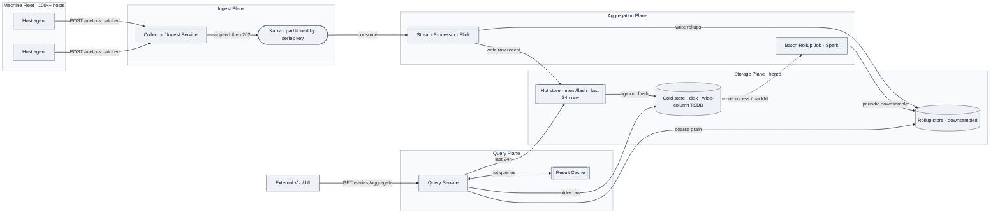
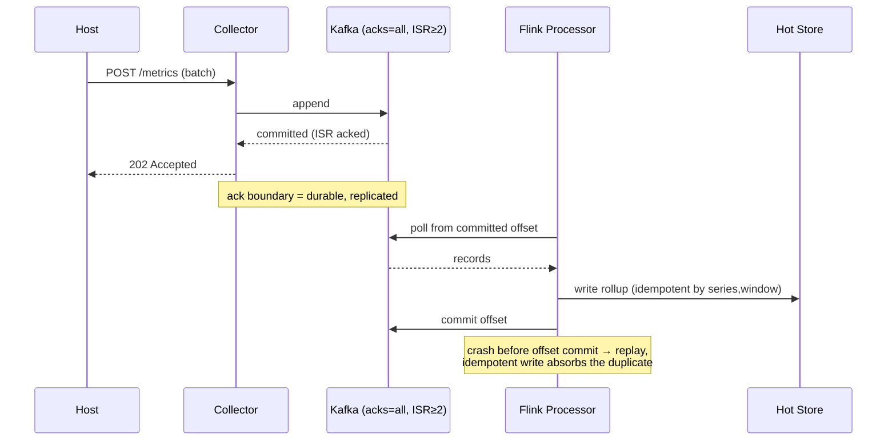

# Statistics Aggregation System — Staff-Level Design & Talk Track

> **Interview context:** LinkedIn SI Design round · Target level **Staff+ (IC4+)** · 45-min format
> **Problem source:** *"Design a metric collection and querying system"* — metric = `[timestamp, node, metric, value]`
> **Calibration goal:** Clear the **AE (Above Expectations / score 4)** bar — pass every axis, exceed in **Depth** and **Fault Tolerance**.

---

## 0. How this maps to LinkedIn's rubric

LinkedIn scores six axes. This document is deliberately structured so the interviewer can check each one off. Keep this map in your head — it's the difference between a good answer and a *legible* one.

| Axis | Where I earn the signal | Staff+ bar (what I must show) |
|---|---|---|
| **Requirement Collection** | §1 — scope down, quantify NFRs, anticipate multi-colo / retention | Hardly miss a requirement; anticipate future needs |
| **End-to-End Design** | §4–5 — ingest → durable buffer → aggregation → tiered storage → query | Lead the whole solution, foresee issues preemptively |
| **Tradeoff Analysis** | Called out inline + §8 table | Proactively name when I'm making a tradeoff |
| **Fault Tolerance** | §7 — durability invariant, queue-as-shock-absorber, replication, multi-colo | Fault tolerance as a *core feature*, not bolted on; name the pattern |
| **Scalability** | §6 — partitioning, pre-aggregation, hot shards, 10×/100× | Scalability as a core feature; name the pattern + intuition |
| **Depth** | TSDB internals §5.2, cardinality §6.3, aggregation semantics §5.3 | Educate the interviewer in ≥1 area; draw from mechanism |

**The organizing thesis to state out loud at minute 1:**
> *"This is a write-heavy, read-scaled telemetry system where the hard problems are not business logic — they're durability of a firehose, range-query latency across a retention hierarchy, and cardinality. I'll pick **AP over CP** because a metrics system that's briefly stale is fine, but one that's unavailable during an incident is useless — and incidents are exactly when it's read hardest."*

That last clause — *metrics are read hardest during the outage they're meant to diagnose* — is a Staff-level framing the reference solution doesn't state. Lead with it.

---

## 1. Requirements (~5 min)

### 1.1 Functional (top 3, prioritized)

1. **Ingest** `[timestamp, node, metric, value]` tuples from a large fleet of machines.
2. **Query a specific `[node, metric]`** over an arbitrary time range → returns a time series.
3. **Query a `[metric]` aggregated across all nodes** over a time range → returns a time series (this is the Senior+ extension, and it's where the design gets interesting — it forces a pre-aggregation decision).

Secondary (mention, defer): **metric discovery** — "list all metrics that exist for a given `node`."

### 1.2 Non-functional (quantified — this is a Requirement-Collection signal)

| NFR | Target | Why it drives design |
|---|---|---|
| **CAP** | **AP** — availability > consistency | Metrics tolerate seconds of staleness; must survive partitions during incidents |
| **Availability** | **≥ 99.99%** | ~52 min/yr downtime budget |
| **Write scale** | 100k+ hosts × 100s metrics/host × multiple/min → **~10s of millions of writes/min** | Ingest is the firehose; sizing the buffer depends on it |
| **Read scale** | **10s of thousands of read QPS** | Read path must be independently scalable from write |
| **Read latency** | **p99 < 100ms for last 24h**; multiple seconds acceptable beyond 24h | Justifies a **tiered storage hierarchy** (hot/warm/cold) |
| **Freshness** | Published & visible in **< 1 min** | Bounds how long data may sit unaggregated |
| **Retention** | **1 year**, granularity degrades with age (1-min recent, coarser for 1+ month) | Justifies **downsampling / rollups** |
| **Durability** | No silent loss of acknowledged writes | The correctness invariant — see §7 |

### 1.3 Estimation — only the two numbers that change a decision

I won't front-load a wall of back-of-envelope math. Two numbers matter because they *flip design choices*:

- **Single-series storage over 1 year.** `value` is a double (8B) + timestamp. At 1-min granularity that's ~525k points/series/year. Even lightly encoded, **a single metric's yearly range approaches multiple MB** — the reference notes ~4MB. **Decision it flips:** a naive "scan every point in range" query for a 1-year window blows the 100ms budget → we **must** pre-aggregate/downsample. This is the whole reason rollups exist here.
- **Distinct series (cardinality) = hosts × metrics ≈ 100k × few-hundred = tens of millions of active series.** **Decision it flips:** cost scales with *series count*, not raw bytes — this is the TSDB failure mode (§6.3), and it's why we're careful about what becomes a series key.

> 🗣️ **Talk track:** "I'm going to skip QPS-times-payload arithmetic that just concludes 'it's a lot.' Two numbers actually change my design: single-series yearly size — which forces pre-aggregation — and total cardinality — which is the thing that kills time-series databases. Let me anchor on those."

---

## 2. Core Entities (~2 min)

- **Metric point** — `(timestamp, node, metric, value: double)`. The atom.
- **Series** — the logical stream identified by `(node, metric)`. This is the unit of storage locality and the unit of cardinality.
- **Rollup** — a pre-computed aggregate of a series (or across series) at a coarser grain: `(metric, agg_window, agg_fn, value)`.
- **Node registry** — mapping of `node → metrics it emits`, backing metric discovery.

Naming note: `node` and `metric` are ~32 chars each; `value` is a double. Small, uniform, append-only — this shape is *ideal* for a columnar / LSM sequential store and terrible for a normalized relational schema.

---

## 3. API / Interface (~5 min)

REST for the query side (diverse external viz clients), a lightweight ingest protocol for the write side.

**Ingest (write path — push model, see §4):**
```
POST /v1/metrics
  body: [{ ts, node, metric, value }, ...]   // batched
  → 202 Accepted   (accepted = durably buffered, NOT yet queryable)
```
The `202` (not `200`) is deliberate and a **depth signal**: acknowledgement means *durably enqueued*, not *aggregated and visible*. That gap is the < 1 min freshness budget.

**Query a specific series:**
```
GET /v1/series?node={node}&metric={metric}&from={ts}&to={ts}&step={granularity}
  → { points: [[ts, value], ...] }
```

**Query aggregated-across-nodes:**
```
GET /v1/aggregate?metric={metric}&from={ts}&to={ts}&step={granularity}&fn={avg|sum|p99|max}
  → { points: [[ts, value], ...] }
```

**Metric discovery:**
```
GET /v1/nodes/{node}/metrics  → { metrics: [...] }
```

Design choices to state aloud: **`step` is a first-class query parameter** — the client asks for the grain it wants, and the server serves it from the cheapest tier that satisfies it (raw for fine/recent, rollup for coarse/old). **`fn` is required on `/aggregate`** because the aggregation function determines whether a rollup can even be reused (avg/sum/max compose; p99 does **not** — see §5.3, a depth landmine).

---

## 4. Data Flow — the ingest pipeline (~5 min)

This *is* a data-processing pipeline, so the ordered flow is worth stating explicitly:

1. **Emit** — each host pushes batched metric tuples to a **collector** (frontend ingest service).
2. **Durably buffer** — collector writes to a **durable log (Kafka)**, partitioned by series key, and only then acks `202`.
3. **Aggregate** — stream processors consume the log, compute rollups, and write both raw-recent and rollup data.
4. **Tier & store** — recent data → hot store (memory/flash); older data → cold store (disk); rollups written alongside.
5. **Query** — read path fans a range query to the tier(s) that cover it and stitches the series.

### Push vs. Pull — name the tradeoff (this is an explicit rubric item)

| | Push (chosen) | Pull (Prometheus-style) |
|---|---|---|
| Who initiates | Host → collector | Collector scrapes host |
| Discovery | Simple (host knows endpoint) | Needs a **consistent service registry (ZooKeeper)** to know what to scrape |
| Firehose handling | **Highest-traffic hop is absorbed by the queue** ✅ | Scraper is a pull-scheduling bottleneck |
| Failure semantics | Host must buffer if collector down | Missed scrape = visible gap (arguably nice) |

> 🗣️ **Talk track:** "I'll go **push**, because it lets me put the durable queue at the very first hop — the firehose is handed off to Kafka immediately, and everything downstream consumes at its own pace. Pull is defensible and Prometheus proves it works, but pull needs a strongly-consistent registry like ZooKeeper to know the fleet, and it makes the scraper the scaling bottleneck. I'd only pick pull if 'a missing scrape is a meaningful signal' were a hard requirement." *(Naming that you'd revisit the decision under a different requirement is the Staff move.)*

---

## 5. High-Level Design (~10–15 min)

### 5.1 Architecture



Walk it left to right in the room: **firehose → durable queue → aggregate → tier → serve**. The queue is the load-bearing decision — it decouples write scale from compute scale and is also the durability boundary.

### 5.2 Storage — the tier decision and TSDB internals (**depth landmine — go here**)

The reference explicitly says: *"the interviewer must force the candidate to dig deeper into how time series databases work."* So don't just say "use a TSDB" — **explain the mechanism.**

**Tiering (matches the p99 requirement):**
- **Hot (< 24h):** memory/flash, raw 1-min points → serves p99 < 100ms.
- **Cold (24h–1yr):** disk, sequential/columnar → multiple-seconds SLA is fine.
- **Rollups:** coarse grains for long ranges so a 1-year query never scans 525k raw points.

**Why a TSDB / LSM-columnar store and not SQL — the mechanism:**

- **Append-only + sorted-by-time = LSM-tree fit.** Writes land in an in-memory memtable, flush to immutable sorted SSTables; time-range reads are contiguous sequential scans. *(DDIA Ch. 3 — LSM-trees vs. B-trees: LSM wins on write throughput and sequential range scans, exactly our workload.)* A B-tree would suffer write amplification under this ingest rate.
- **Columnar layout** stores each series' values contiguously → range scan reads one column, and doubles compress hard (delta-of-delta on timestamps, XOR on values — the Gorilla/Facebook encoding). This is *why* a TSDB fits where row-oriented SQL doesn't.
- **NoSQL wide-column (Cassandra / Bigtable / DynamoDB)** is the pragmatic alternative: partition key = series, clustering key = timestamp → **primary keys kept sorted → fast range queries**, horizontal scale, AP-friendly. This is the answer if you don't want to hand-roll a TSDB.

**Why not SQL:** relational DBs are heavyweight for this uniform append-only shape, and they typically **prioritize CA** — but we chose **AP**. *(DDIA Ch. 9 — linearizability costs availability under partition; we don't want to pay it for telemetry.)*

> 🗣️ **Depth talk track:** "The reason a time-series DB isn't magic — it's an LSM-tree with a columnar, time-sorted layout and specialized compression. Delta-of-delta on timestamps and XOR on consecutive doubles gets Gorilla-style ratios because adjacent samples barely change. Range queries become sequential column scans over sorted SSTables. If I *couldn't* use an off-the-shelf TSDB, I'd reach for Cassandra with `(series_key)` as partition and `timestamp` as clustering column to get the same sorted-range property."

### 5.3 Aggregation semantics — the composability trap (**second depth landmine**)

The cross-node `/aggregate` query is where juniors get quietly wrong. State the rule explicitly:

- **Composable aggregates (avg via sum+count, sum, min, max, count):** a rollup can be computed *from other rollups*. Downsample once, reuse across ranges. `avg` must be stored as `(sum, count)` pairs, **not** pre-divided — you cannot average averages of unequal buckets.
- **Non-composable (percentiles: p50/p99/median):** you **cannot** roll up a p99 from bucket p99s. You must either (a) keep raw data, (b) store a **mergeable sketch** — t-digest or HDR histogram — as the rollup, or (c) accept approximation. This is the correct, deep answer.

> 🗣️ **Talk track:** "One trap on the aggregated query: `avg`, `sum`, `max` compose, so I downsample once and reuse — but I store `avg` as sum-and-count, never the pre-divided mean, or I'd be averaging averages over unequal buckets. Percentiles don't compose at all. For p99 across nodes I'd store a **t-digest sketch** per bucket, because sketches are mergeable — that's how I keep percentile queries cheap without retaining raw."

That t-digest answer is an **AE / educate-the-interviewer** moment. Say it.

### 5.4 Streaming vs. Batch aggregation — name the tradeoff

- **Streaming (Flink):** near-real-time, satisfies the < 1 min freshness budget, more expensive to run.
- **Batch (Spark):** cheaper, simpler, higher latency — fine for **older rollups and backfill/reprocessing**.
- **Chosen: both.** Streaming for the fresh recent grain; batch for long-horizon downsampling and recomputation. *(Lambda-ish, but justified by the two different freshness SLAs, not by dogma.)*

---

## 6. Scalability Deep Dive (~ rubric: Scalability axis)

### 6.1 Partitioning — name the pattern and the key choice

Partition the Kafka log and the store **by series key `hash(node, metric)`**.
- **Why not partition by `node` alone?** Low-ish cardinality relative to load and correlated hot hosts → skew.
- **Why not by `metric` alone?** *Catastrophic* — a handful of ubiquitous metrics (e.g. `cpu.util` emitted by every host) become mega-hot partitions. **Never partition on a low-cardinality key** — Kafka ordering/throughput is per-partition, so you'd bottleneck on two or three partitions. *(This is the same trap as partitioning a poll by vote-choice.)*
- **`hash(node, metric)`** spreads load evenly and keeps each series' points co-located and time-sorted for range scans. *(DDIA Ch. 6 — key-range vs. hash partitioning: hash for even load, and we recover range-scan-ability within a series because the clustering key is time.)*

### 6.2 Pre-aggregation & downsampling — the scalability lever that makes reads feasible

Two aggregation dimensions, both needed:
- **Time aggregation (down the grain):** older data kept coarser. A 1-year query hits 1-hour rollups, not 1-min raw → bounded scan.
- **Per-metric aggregation (across nodes):** pre-compute the cross-node aggregate for heavily-queried metrics so `/aggregate` doesn't scatter-gather millions of series at read time. Essential for wide-fan metrics; wasteful (skip it) for sparse ones.

> 🗣️ **Talk track:** "Rollup *grain* and rollup *emit frequency* are different knobs — a 3-second freshness SLA on a 1-minute aggregation grain just means I emit partial 1-min buckets more often, not that I change the grain. Interviewers conflate these."

### 6.3 Cardinality explosion — the TSDB killer (**depth + scalability**)

> **The single most important scalability insight in this whole problem.**

TSDB cost scales with **distinct active series count**, *not* data volume — because each series carries memory-resident overhead (index entry, open chunk in memtable). Tens of millions of series is already the ceiling. The failure mode: someone tags a metric with an **unbounded-cardinality label** (`request_id`, `user_id`, `pod_hash`) and series count explodes → memory blows up → the DB falls over.

**Mitigations (say these — it's the educate-the-interviewer axis):**
- **Reject/limit high-cardinality labels at ingest** — cardinality budgets per metric.
- **Series-churn awareness:** ephemeral pods that come and go create new series constantly; use TTL/compaction on stale series.
- **Don't let query dimensions become storage keys** unless they're bounded.

### 6.4 Hot shards — split by cause

The reference asks "how do you handle hot shards?" The Staff answer is that **there are two different hot-shard causes with different fixes:**
- **Legitimately high-volume series** (a genuinely popular metric): **split the shard** — sub-partition by a time-bucket or a secondary hash so one series' load spreads across consumers. But a *single un-shardable series* (all writes share one key) is the hard case — mitigate with **local pre-aggregation at the collector** (combine same-series points in a window before they hit the log).
- **Abusive / runaway traffic** (a misconfigured host spamming): **rate-limit / quota at ingest**, isolate the noisy tenant. Different problem, different tool.

### 6.5 10× / 100× — what changes

- **10×:** more Kafka partitions + consumers, more storage nodes. Mostly horizontal; the architecture holds.
- **100×:** the read-side scatter-gather on `/aggregate` and **cardinality** become the walls. Push harder on pre-aggregation, add a **result cache** for repeated dashboard queries, and consider **per-metric materialized cross-node rollups** so reads never fan out. Storage cost forces more aggressive downsampling / retention tiering.
- **Caching caveat (tradeoff):** caching has *limited* value on the fresh path (data changes every minute, and the store is already read-optimized), but it's genuinely useful for (a) **repeated historical dashboard queries** (immutable once aged) and (b) **shielding hot shards**. So cache the warm/cold repeated reads, not the live tip.

---

## 7. Fault Tolerance Deep Dive (~ rubric: Fault Tolerance axis — make it a *core feature*)

**Lead with the durability invariant, not the transport.** (This is the house rule and the Staff bar.)

> **Invariant: an acknowledged write (`202`) must not be silently lost.** The publish boundary is *"durably in the replicated Kafka log,"* not *"received by the collector."*

### 7.1 The durable-buffer pattern (name it)

Two durability strategies, and why the queue wins here:
- **Persist-immediately-to-DB before ack:** works, fits pull, but couples ingest latency to DB write latency.
- **Durable queue first (chosen):** collector appends to **Kafka with `acks=all` + `min.insync.replicas ≥ 2`**, *then* returns `202`. The highest-traffic hop is absorbed by a replicated log; downstream consumers replay on failure via committed offsets. **This is the transactional-outbox/durable-log pattern — the fix for "acked but lost."**

> 🗣️ **Talk track:** "My durability boundary is the replicated log. Collector does `acks=all` with at least two in-sync replicas before it acks the host. If a stream processor crashes mid-aggregation, it hasn't advanced its offset, so on restart it replays from the last committed offset — at-least-once. I make the rollup write idempotent (keyed by `(series, window)`, last-write-wins on a deterministic aggregate) so replay doesn't double-count. That converts at-least-once delivery into effectively-once *state*."

### 7.2 Component-by-component failure



- **Collector down:** host buffers locally + retries (bounded local WAL); load balancer routes to healthy collectors. Push model means the host owns the retry.
- **Kafka broker down:** ISR replicas cover it; `unclean.leader.election=false` so we never elect a stale leader and lose committed writes (**durability > availability *at this one hop*** — the exception to global AP, and worth naming).
- **Stream processor down:** offsets un-advanced → replay → idempotent writes. No loss, no double count.
- **Hot store node down:** replicated; reads fail over. Recent data also still in Kafka within retention → rebuildable.
- **Query service down:** stateless, horizontally replicated behind LB.

### 7.3 Multi-colo / network partition (fault tolerance + the multi-colo follow-up)

- **Hosts pin to their local datacenter's collector** → writes stay local, no cross-colo write latency.
- **Active-active** across colos: each colo ingests and aggregates its own fleet; **cross-colo `/aggregate` queries fan out and merge** (again, composable aggregates + mergeable sketches make this clean — you merge sums and t-digests across colos).
- **On partition:** each colo keeps serving its local data (**AP** — availability preserved), cross-colo aggregates are marked partial/stale until heal. **Anti-entropy replication reconciles afterward** — but note: *gossip/anti-entropy guarantees convergence, not write preservation; merge semantics (LWW vs. mergeable aggregate) determine correctness.* For our aggregates, merges are commutative, so convergence *is* correctness here — a nice property to point out.

> 🗣️ **Talk track:** "Active-active. Each colo is self-sufficient for ingest and local queries, so a partition degrades cross-colo aggregates to 'partial' rather than taking anything down — that's the AP choice honoring the 99.99% target. The reason I *can* merge across colos cleanly is that my aggregates are commutative and my percentile sketches are mergeable, so reconciliation converges to the correct value, not just *a* value."

---

## 8. Tradeoff summary (~ rubric: Tradeoff Analysis — one glance for the interviewer)

| Decision | Chose | Over | Because |
|---|---|---|---|
| Consistency | **AP** | CP | Metrics tolerate staleness; must survive partitions during incidents |
| Ingest model | **Push + queue** | Pull/scrape | Firehose absorbed by durable log at first hop; no ZK registry needed |
| Durability boundary | **Kafka `acks=all`** | DB-before-ack | Decouples ingest latency from storage; replay on failure |
| Storage engine | **LSM columnar TSDB / wide-column** | SQL | Append-only time-sorted workload; AP; sequential range scans |
| Aggregation | **Stream + batch** | One or the other | Two freshness SLAs (fresh recent vs. cheap historical) |
| Partition key | **`hash(node,metric)`** | `metric` or `node` alone | Even load; avoids mega-hot low-cardinality partitions |
| Percentile rollups | **t-digest sketches** | Store raw / naive rollup | Percentiles don't compose; sketches merge |
| Caching | **Warm/historical only** | Cache everything | Live tip changes every minute; cache immutable aged reads |

---

## 9. Real-World Anchor

- **Facebook Gorilla (VLDB 2015)** — the in-memory TSDB whose delta-of-delta + XOR encoding is the compression I described in §5.2; the reference architecture for "recent data in memory, older on disk."
- **Prometheus + Thanos** — Prometheus is the canonical *pull* model (the alternative I rejected and why); **Thanos compactor** is exactly the batch downsampling/rollup tier in §5.4/§6.2.
- **Uber M3 / M3DB** — production example of TSDB-at-scale with explicit **cardinality** limits and multi-colo aggregation — validates §6.3 and §7.3.
- **VictoriaMetrics / ClickHouse** — the wide-column-store-as-TSDB path from §5.2; ClickHouse `*MergeTree` engines do exactly the sorted-merge-on-key rollup.

*(DDIA anchors used: Ch. 3 LSM vs B-tree & column storage; Ch. 5 replication & leader/follower + anti-entropy; Ch. 6 partitioning & hot-key skew; Ch. 9 linearizability cost & CAP.)*

---

## 🔍 Senior-Signal Questions to Ask in Your Interview

- **"Should the `202` ack mean 'durably queued' or 'queryable'? What's the freshness contract we're promising the dashboards?"** → *Why it matters: forces the durability-vs-visibility boundary into the open — the single most important correctness line in the system, and stating it unprompted is the Staff signal.*
- **"What's our cardinality budget, and do we reject high-cardinality labels at ingest or absorb them?"** → *Why it matters: shows I know the actual failure mode of TSDBs is series count, not bytes — the depth axis.*
- **"For the cross-node percentile query, are we willing to store mergeable sketches (t-digest) or do we keep raw?"** → *Why it matters: surfaces the non-composability of percentiles, which quietly breaks naive rollup designs.*
- **"On a cross-colo partition, do we serve partial aggregates or fail the query?"** → *Why it matters: pins down where AP actually bites, and whether our merge semantics are commutative enough to converge correctly.*
- **"Where's the read-side scatter-gather wall — at what scale does `/aggregate` force materialized cross-node rollups instead of fan-out-on-read?"** → *Why it matters: names the scaling inflection point rather than hand-waving 'add more nodes.'*