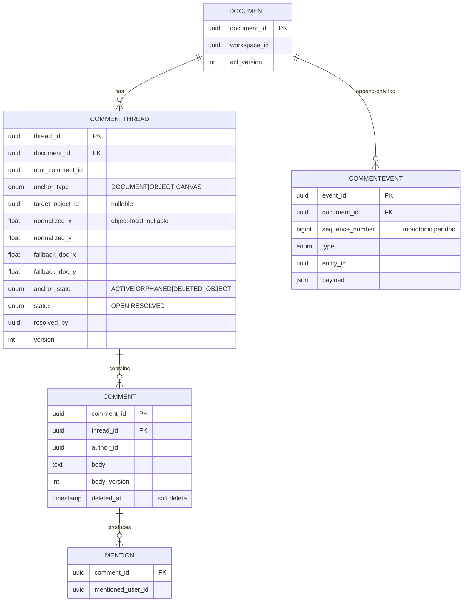
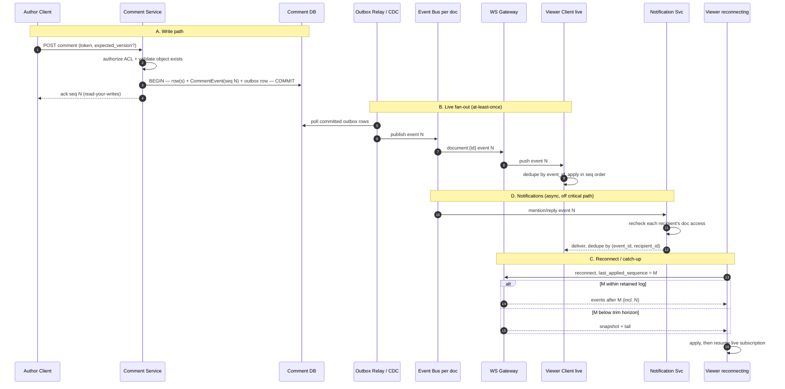
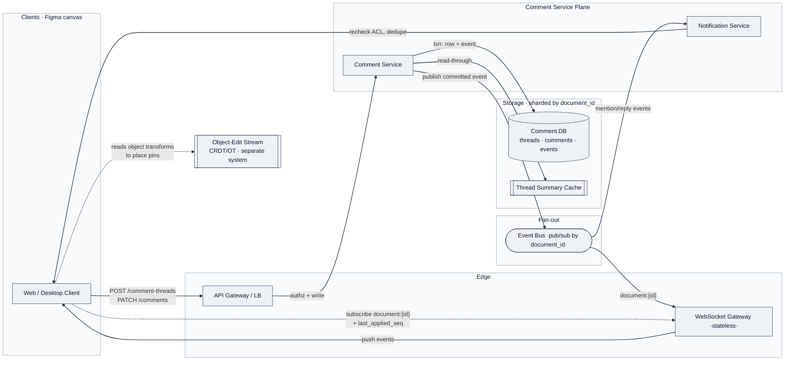
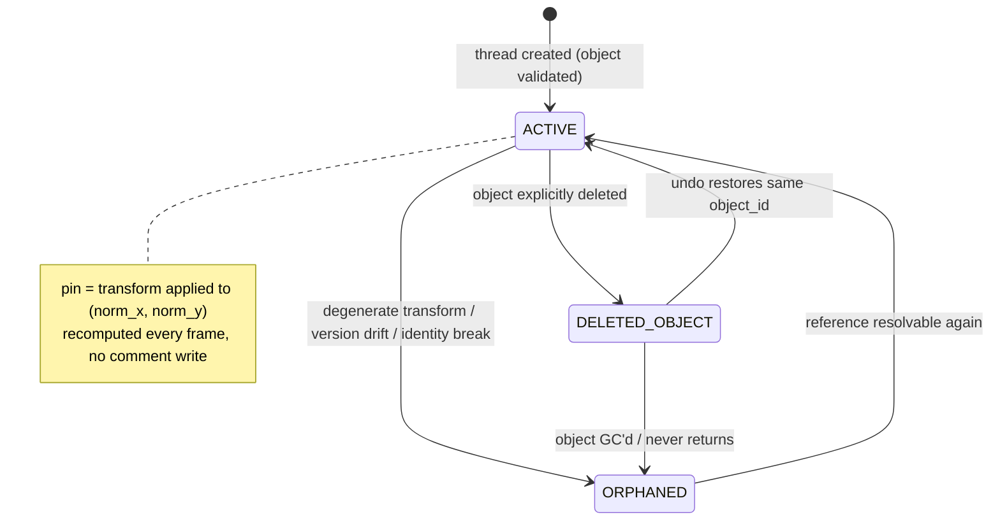
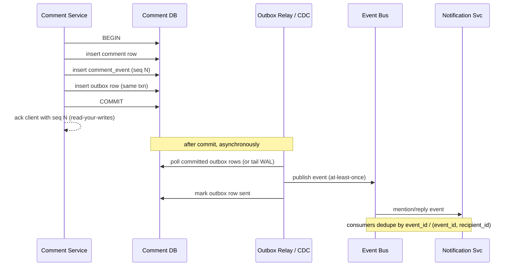

# Design Figma's Commenting System

> **Format:** "System Design in a Hurry" delivery walkthrough (HelloInterview idiom).
> **Source:** Reconstructed and hardened from a passing candidate's interview experience. Where my design diverges from the candidate's stated solution, I flag it explicitly as **⚠️ Divergence from passing design** so you can decide which line to take in the room.

---

## The Question

> Design the commenting system for a Figma-like collaborative canvas. Users leave comments on a whole document, a canvas region, or a specific object; reply in threads; @-mention teammates; resolve/reopen threads; and see comments update live for everyone connected. Comment operations must be durable and ordered per document.

**Interviewee's hint:** *The trap is treating comments as "just CRUD + WebSocket." The signal comes from (1) the **anchoring model** — a comment pinned to an object that then moves, rotates, scales, or gets deleted — and (2) keeping the comment stream **independent from but referentially tied to** the object-editing (CRDT/OT) stream. Don't try to shove comments into the same collaboration engine that powers multiplayer editing.*

---

## 1. Requirements (~5 min)

### Clarifying questions I'd ask first

| Question | Answer I'll assume | Why it matters |
|---|---|---|
| Do comments share the same realtime engine as multiplayer object editing? | **No** — separate stream, but comments *reference* object IDs + a document version | Decides whether we need CRDT semantics for comment text (we don't) |
| Do we need OT/CRDT for the comment *body* itself (concurrent editing of one comment)? | No — a comment body is single-author; edits are optimistic-concurrency replace | Avoids over-engineering; comment ≠ collaborative doc |
| What consistency does a connected client need? | **Read-your-writes** + eventual convergence across clients | Sets the bar: not linearizable, but no lost writes and no permanent divergence |
| What happens to a comment when its anchor object is deleted? | Thread survives, anchor marked `ORPHANED`/`DELETED_OBJECT`, shown in list | This is the core "senior" edge case |
| Scale? | Assume large workspaces — millions of docs, a hot doc with hundreds of concurrent viewers | Drives partition key = `document_id` and stateless gateways |

### Functional Requirements (top 3, prioritized)

1. **Create/reply/edit/delete comments** on a document, canvas region, or object, organized as **threads**. (Core CRUD + threading.)
2. **Anchor a comment to an object** such that the pin tracks the object through move/rotate/scale, and **degrades gracefully** when the object is deleted or restored.
3. **Live updates** — resolve/reopen and new comments/replies propagate to all connected clients in near-real-time, with **@-mentions** producing notifications.

*(Lower priority, mention and defer: rich text/attachments, reactions, comment search across a workspace.)*

### Non-Functional Requirements (quantified, top 5)

- **Consistency:** Per-document **total order** of comment events; **read-your-writes** for the author; **eventual convergence** for other connected clients. This is an **AP-leaning** system with a strong per-document ordering guarantee — *not* global linearizability. *(DDIA Ch. 9: we want a per-partition total order, achievable with a single-writer log per document, without paying for cross-partition consensus.)*
- **Durability:** A committed comment is **never lost**. Write is durable in the DB *before* it is acknowledged or fanned out. Target: 0 acknowledged-then-lost comments.
- **Latency:** Comment write acked in **< 200 ms p99**; live fan-out to other viewers in **< 500 ms p99** on the same document.
- **Availability:** Comment reads/writes stay available under a single-AZ loss; realtime fan-out may briefly degrade to catch-up-on-reconnect.
- **Ordering + idempotency:** Delivery is **at-least-once**; clients dedupe by `event_id` and apply in `sequence_number` order, so re-delivery is safe.

**Capacity note (only where it changes a decision):** I won't front-load QPS math. The one number that matters: a **single hot document** with, say, 500 concurrent viewers means fan-out is per-*document*, not per-user-global — so the fan-out unit and the partition key are both `document_id`. That's the decision the estimate drives; everything else is "it's a lot, shard it."

---

## 2. Core Entities & Data Model (~4 min)

- **Document** — the canvas being commented on; carries `workspace_id` and an `acl_version`.
- **CommentThread** — a rooted conversation with an **anchor** (document / object / canvas region), a **status** (OPEN/RESOLVED), and an **anchor_state** (ACTIVE/ORPHANED/DELETED_OBJECT).
- **Comment** — one message in a thread; single author; has a `body_version` for optimistic edits.
- **Mention** — a `(comment_id, mentioned_user_id)` edge driving notifications.
- **CommentEvent** — the **immutable, per-document, monotonically-sequenced** log entry. This is the spine of the whole design: catch-up, ordering, debugging, and fan-out all ride on it.

The pairing to call out loud: **an append-only `CommentEvent` log for ordering + catch-up, plus materialized `Thread`/`Comment` tables for efficient reads.** Same idea as event-sourcing with a read model — *DDIA Ch. 11 (event logs / derived state)*.

### Schema (design-relevant fields)




Two things to notice in this schema, because they're the whole ballgame:

1. **`sequence_number` is monotonic *per `document_id`***, not global. That's what lets us shard by document while keeping a clean per-document total order — the ordering guarantee is *local to the partition*, which is exactly the cheap kind to provide.
2. **The anchor is stored twice** — once as `(target_object_id, normalized_x, normalized_y)` in object-local space, and once as `(fallback_doc_x, fallback_doc_y)` in document space. The dual storage is what makes graceful degradation possible when the object disappears.

#### Materialized tables vs. the event log — a worked trace

A common question here is "isn't the `Comment` data duplicated in `CommentEvent`?" **No** — they're different representations for different jobs. The **tables hold current state** (what a read returns); the **log holds the ordered history of transitions** (what happened, and when). The log is the source of truth; the tables are a **derived read-model** you rebuild by folding the log (*DDIA Ch. 11: event log + materialized view*).

Take one thread and four operations:

1. Alice creates a thread with comment *"Move this left"*
2. Bob replies *"Agreed"*
3. Alice edits her comment to *"Move this left ~20px"*
4. Bob resolves the thread

**`CommentThread` table — current state only:**

| thread_id | root_comment_id | anchor_type | anchor_state | status | resolved_by | version |
|---|---|---|---|---|---|---|
| t1 | c1 | OBJECT | ACTIVE | RESOLVED | bob | 4 |

**`Comment` table — current state only:**

| comment_id | thread_id | author_id | body | body_version | deleted_at |
|---|---|---|---|---|---|
| c1 | t1 | alice | "Move this left ~20px" | 2 | null |
| c2 | t1 | bob | "Agreed" | 1 | null |

**`CommentEvent` log — append-only, every transition:**

| sequence_number | type | entity_id | payload |
|---|---|---|---|
| 1 | THREAD_CREATED | t1 | `{anchor_type: OBJECT, target_object_id: obj9, normalized_x: 0.5, ...}` |
| 2 | COMMENT_CREATED | c1 | `{author: alice, body: "Move this left"}` |
| 3 | COMMENT_CREATED | c2 | `{author: bob, body: "Agreed"}` |
| 4 | COMMENT_EDITED | c1 | `{body: "Move this left ~20px", body_version: 2}` |
| 5 | THREAD_RESOLVED | t1 | `{resolved_by: bob}` |

What each side knows that the other can't:

- **The log retains what the table overwrote.** Alice's *original* text "Move this left" survives only at `seq=2`; the `Comment` table shows only the latest body — it mutated `c1.body` in place. Edit history, "who resolved and when," and audit all live in the log. The table is lossy by design.
- **The table answers "now" in one indexed query; the log can't.** Rendering the sidebar ("all OPEN threads + current comments") is a single read on the materialized tables. Deriving the same answer from the log means replaying every event for the document from `seq=1` — fine for one thread, catastrophic on a doc with thousands of events per page load. That performance gap *is* the reason the tables exist.

They map straight to the two read APIs: `GET /comment-threads` reads the **tables** (fast current state); `GET /comment-events?afterSequence=N` reads the **log** (the delta since you were last online, for reconnect).

The one real overlap: the *current* body appears both in `c1.body` and in the `seq=4` payload. That's genuine, but not wasteful redundancy — log payloads are immutable point-in-time facts ("at seq 4 the body became X"), while the table holds only the latest mutable value. Different lifetimes, different purposes. If large bodies ever made double-storage costly, keep full bodies in the table and store only a reference/diff in the payload — not worth the complexity at comment scale.

---

## 3. API / Interface (~5 min)

REST for the CRUD surface (default choice — resource-shaped, cache-friendly), **WebSocket** for the live channel. Identity always comes from the auth token, **never** from a body field.

```
POST   /documents/{documentId}/comment-threads      # create thread (first comment + anchor)
POST   /comment-threads/{threadId}/comments          # reply
PATCH  /comments/{commentId}                          # edit body (If-Match: body_version)
DELETE /comments/{commentId}                          # soft delete (sets deleted_at)
POST   /comment-threads/{threadId}:resolve            # thread state transition
POST   /comment-threads/{threadId}:reopen
GET    /documents/{documentId}/comment-threads?cursor=...        # materialized read
GET    /documents/{documentId}/comment-events?afterSequence=N    # catch-up read
WS     document:{documentId}                          # live subscribe (after authz)
```

**Contract rules:**
- Every write carries caller identity (from token) and **optionally an `expected_version`** (`If-Match` on edits) for optimistic concurrency.
- The server, in **one transaction**, validates ACL + object existence (when the anchor requires it), writes the materialized row(s) **and** appends the `CommentEvent`, then returns the assigned `sequence_number`. That returned sequence number is what gives the author **read-your-writes** — the client knows it's already applied up to N.
- Catch-up is `GET .../comment-events?afterSequence=N`; if N is too old (log trimmed), server returns a **snapshot + tail**.

**⚠️ Divergence from passing design (minor, worth stating):** the candidate lists `PATCH`/`DELETE` returning a sequence number implicitly. I'd make the **returned `sequence_number` an explicit part of every write response**, because it's the mechanism that makes read-your-writes work on reconnect — it's not just a debugging aid. Same design, sharper articulation.

---

## 4. Data Flow (~5 min)

The system has **four** distinct flows worth enumerating as ordered pipelines, because the ordering *is* the design:

**A. Write path (create/reply/edit/resolve):**
1. Client `POST`s with token (+ optional `expected_version`).
2. Comment Service authorizes against document ACL (and validates `target_object_id` exists if `anchor_type = OBJECT`).
3. **Single transaction:** write materialized row(s) → append `CommentEvent` with next `sequence_number` → commit.
4. Return `sequence_number` to caller (read-your-writes).
5. **After commit**, publish the event to the fan-out bus (outbox — see deep dive).

**B. Live fan-out path:**
1. Committed event lands on the fan-out bus, keyed by `document_id`.
2. Gateways subscribed to `document:{id}` receive it.
3. Each gateway pushes to its locally-connected, still-authorized WebSocket clients.
4. Clients dedupe by `event_id`, apply in `sequence_number` order.

**C. Reconnect / catch-up path:**
1. Client reconnects, sends `last_applied_sequence`.
2. Server returns events after N, **or** a snapshot + tail if N is below the trim horizon.
3. Client applies, then resumes the live subscription.

**D. Notification path (async, off the critical path):**
1. A committed `COMMENT_CREATED` event with mentions is consumed by the Notification Service.
2. It re-checks that each mentioned user can access the document (ACLs change).
3. Dedupe delivery by `(event_id, recipient_id)`, then emit email/push/in-app.

The four pipelines aren't independent — they chain off a single committed write. This diagram traces one comment from `POST` through commit (A), out to other viewers via the outbox + bus (B), into notifications (D), and shows a second client picking it up on reconnect (C):



The load-bearing detail the diagram makes visible: the **ack to the author (A) happens right after COMMIT, before any fan-out** — so durability never depends on B/C/D succeeding. Everything downstream is at-least-once replay off the committed log, which is exactly why both consumers dedupe (`event_id` for viewers, `(event_id, recipient_id)` for notifications).

---

## 5. High-Level Design (~10–15 min)

Going endpoint-by-endpoint, the architecture that falls out:



**Reading the diagram:**

- **Comment Service** is the only writer. It owns the transaction that couples the materialized row and the event append. This is the durability + ordering anchor.
- **Comment DB** is sharded by `document_id`. All of a document's threads, comments, and events live on one shard, so the per-document total order and multi-row atomic writes are a **single-shard transaction** — no distributed commit. *(This is the DDIA Ch. 6/7 point: co-locate data that must be written atomically and ordered together under one partition key.)*
- **Event Bus** fans out per `document_id`. **WebSocket gateways are stateless** — they hold connections and a subscription table, nothing authoritative. Any gateway can serve any client; state of record is the DB + event log.
- **The object-edit stream is deliberately a separate system.** The comment client *reads* current object transforms from it to place the pin, but comments never write to it and don't share its CRDT machinery. The only coupling is referential: a comment stores an `object_id` + a document version.

**Callouts I'd make verbally and defer:** the thread-summary cache (for hot docs), the outbox pattern for the publish step, and log trimming/snapshotting — all pushed to Deep Dives so I don't over-build the first pass.

---

## 6. Deep Dives (~10 min)

### Deep Dive 1 — The anchoring model (the heart of the question)

This is where the interview is won or lost. The candidate's hint is exactly right: a comment pinned to an object is not a fixed `(x, y)` — it's a **relationship to an object's transform** that must survive move/rotate/scale/delete/restore.

**Storage:** for an `OBJECT` anchor, store `target_object_id` + `(normalized_x, normalized_y)` in the object's **local bounding-box space** (0–1 within the object's bounds), *plus* a `(fallback_doc_x, fallback_doc_y)` in document space.

**Why normalized/local coordinates, not absolute:** if you store the pin as an absolute document coordinate, then the moment the object moves the pin is stranded in empty space. By storing it relative to the object's local bounds, the client **re-derives** the on-screen position every frame from the object's *current* transform:

```
displayed_pin = current_object_transform · (normalized_x, normalized_y)
```

So move/rotate/scale are **free** — the pin follows because it was never stored in absolute terms. No write happens on the comment when the object moves; the object-edit stream moves the object, and the comment client recomputes. **This is the key decoupling:** object motion is a read-side transform, not a comment write.

**Object deleted:** the thread must survive (people still want the conversation). Transition `anchor_state`:
- `ACTIVE` → `DELETED_OBJECT` when the referenced object ID is gone from the current document version.
- The UI still lists the thread in the comment sidebar, and can optionally render it at `(fallback_doc_x, fallback_doc_y)` so it's not literally nowhere.

**Object restored (undo):** if an undo brings back the *same* `object_id`, the anchor flips back to `ACTIVE` and the pin re-attaches. This is why we key on **stable object ID**, not a positional guess — identity is what lets restoration be clean.

**When each `anchor_state` exists** (only meaningful for `anchor_type = OBJECT` — a `DOCUMENT` or `CANVAS` anchor is effectively always `ACTIVE`, since it doesn't depend on a specific object surviving):

- **`ACTIVE`** — `target_object_id` **exists in the current document version** and its normalized coordinates resolve to a sensible point. The normal case. A thread is *created* `ACTIVE` (server validates the object exists at creation), stays `ACTIVE` through every move/rotate/scale (pure read-side transform, no write), and *returns* to `ACTIVE` if a deleted object is restored under the same ID.
- **`DELETED_OBJECT`** — the object was **explicitly removed** from the document; `target_object_id` no longer exists in the current version. The clean, known-cause case. Thread survives, drops out of canvas pin-tracking, stays in the sidebar, optionally renders at the fallback doc coordinate. **Recoverable**: undo restoring the same object ID flips it back to `ACTIVE`.
- **`ORPHANED`** — the softer "can't resolve the anchor" case, where the object wasn't cleanly deleted but the pin no longer maps to a meaningful location: a **degenerate transform** (object scaled to zero area) so the normalized point resolves to nothing sensible; **document-version drift** where the reference is unresolvable but you can't confidently say it was deleted; or an identity change that breaks the reference with no corresponding delete. Thread survives, but re-attachment is **not** an expected clean path the way it is for `DELETED_OBJECT`.

The practical difference between the two non-active states is **cause and expectation**, and the UI leans on it: `DELETED_OBJECT` says "the thing this was pinned to was deleted" and undo-restore is expected; `ORPHANED` says "we couldn't place this pin" and no clean restore is promised.



**⚠️ Design question worth pre-empting — do we need *both* soft states?** The candidate's design keeps `ORPHANED` and `DELETED_OBJECT` distinct, and I'd keep them too — but I'd frame it as a deliberate choice, not an accident: the two-state split only earns its keep if the product surfaces the user something different for each (different sidebar messaging, different re-attach expectation). If the UI treated them identically, I'd **collapse them into a single `DETACHED` state** and drop the complexity. Naming *when you'd merge them* is a stronger signal than reciting the three states.

```mermaid
sequenceDiagram
    participant OE as Object-Edit Stream
    participant CL as Comment Client
    participant CS as Comment Service
    participant DB as Comment DB

    Note over CL,DB: Create object-anchored comment
    CL->>CS: POST thread (object_id, normalized_x/y, fallback_x/y)
    CS->>DB: validate object exists in doc version, write row+event
    DB-->>CS: sequence_number
    CS-->>CL: ack (seq N), anchor_state=ACTIVE

    Note over OE,CL: Object moves / rotates / scales
    OE-->>CL: object transform updated
    CL->>CL: recompute pin = transform · (norm_x, norm_y)
    Note over CL: NO comment write — pure read-side transform

    Note over OE,CL: Object deleted
    OE-->>CL: object_id removed
    CL->>CS: report anchor unresolved (or server detects on next read)
    CS->>DB: anchor_state = DELETED_OBJECT (+ event)
    Note over CL: thread stays in sidebar, optional fallback pin

    Note over OE,CL: Undo restores same object_id
    OE-->>CL: object_id back
    CS->>DB: anchor_state = ACTIVE (+ event)
```



**Who detects deletion?** Two viable designs, worth naming the trade-off:
- **Client-observed (lazy):** the comment client notices `object_id` isn't in the current doc and asks the server to transition. Simple, but relies on a client being present.
- **Server-side reconciliation:** a listener tails the object-edit stream's delete events and transitions anchors server-side. More robust (works with zero viewers), but couples the comment service to the object stream's event feed.

I'd **lead with client-observed for simplicity and mention server reconciliation as the hardening step** for correctness when no client is watching. Naming *which failure it prevents* — "a thread whose object was deleted while nobody had the doc open would otherwise stay `ACTIVE` forever and render a ghost pin for the next viewer" — is the senior signal, more than naming the pattern.

### Deep Dive 2 — Durability + the dual-write trap (transactional outbox)

Step A5 in the write path — "publish the committed event to the fan-out bus" — is a **dual write**: we write to the DB *and* to the message bus. If we commit the DB transaction and then crash before publishing, the comment is durable but **never fans out** — other clients never see it until they reconnect and catch up (tolerable but laggy), and *notifications never fire* (not tolerable). If we publish first and the DB write fails, we've fanned out a comment that doesn't exist.

**Fix: the transactional outbox.** Inside the *same* DB transaction that writes the comment row + `CommentEvent`, also write an **outbox row**. A separate relay process (or CDC tailing the DB log) reads committed outbox rows and publishes to the bus, marking them sent. Because the outbox write is in the same transaction as the data, there's **no window** where the data exists but the intent-to-publish doesn't.



The outbox makes fan-out **at-least-once**, which is exactly why the client-side `event_id` dedupe + `sequence_number` ordering from Section 5 matters — the two halves are designed together. *(DDIA Ch. 11 on the outbox / log-based message delivery; this is the canonical fix for dual-write data loss.)*

**Durability invariant, stated the way I'd say it in the room:** *"The comment is durable the instant the DB transaction commits — before any ack, before any fan-out. Everything downstream is at-least-once replay off a log, so a crash costs latency, never a comment."* Leading with the invariant rather than the transport is the framing that scores.

### Deep Dive 3 — Concurrency & the resolve/reopen race

Two different concurrency regimes, deliberately:

- **Comment body edits → optimistic concurrency.** `PATCH` carries `If-Match: body_version`. If it doesn't match, reject (409) and let the client rebase. A comment body is single-author short text; there's **no need for CRDT/OT** here. This is a place to explicitly *reject* the fancier option: "I would *not* run the multiplayer-editing CRDT engine on comment bodies — the write pattern doesn't justify it, and it'd couple two systems we're keeping separate."

- **Thread resolve/reopen → last-write-wins is acceptable**, *provided* every transition emits an audit event (`resolved_by`, `resolved_at`, sequence number). If two users resolve/reopen near-simultaneously, LWW on `status` converges and the event log shows exactly who did what when. The `version` field on the thread lets a client that cares assert `expected_version` and get conflict feedback, but the default is LWW-plus-audit.

Why LWW is fine here and not for, say, payments: resolving is **idempotent-ish and low-stakes** — the worst case is a thread flips state once extra and a user clicks again. The audit trail preserves accountability, which is the actual requirement. *(DDIA Ch. 5 on LWW and its dangers — the danger is silent lost updates on data you can't reconstruct; here the event log reconstructs everything, so LWW is defensible.)*

### Deep Dive 4 — ACL revocation must eject live subscribers

A subtle correctness hole: authorization is checked on subscribe, but a user can **lose access mid-session**. If they're holding a live WebSocket to `document:{id}`, they'll keep receiving comment events for a document they can no longer see.

**Fix:** ACL changes bump `acl_version` on the document and emit a control event on the same bus. Gateways subscribed to that document **re-evaluate** affected sessions and **forcibly close** subscriptions for now-unauthorized users. Mention notifications independently re-check access at *delivery* time (Section 4-D step 2), because a mention created while you had access shouldn't notify you after it's revoked. The senior signal here is naming the two distinct enforcement points — **subscription time and delivery time** — not just "we check ACLs."

### Deep Dive 5 — Hot documents, caching, and log trimming

- **Thread-summary cache** for frequently-opened docs: cache the materialized OPEN-thread list per document, read-through, invalidated by the write path (or by consuming the event stream). Keeps the sidebar snappy for a doc with hundreds of threads.
- **Stateless gateways** scale horizontally; a hot doc with 500 viewers is 500 connections spread across gateways, all subscribed to one `document:{id}` bus key. Fan-out cost is per-document, which is why the partition key matters.
- **Log trimming + snapshots:** the `CommentEvent` log can't grow forever. Retain enough tail for realistic reconnect windows; archive older events. A client that's been offline past the trim horizon gets a **snapshot + tail** instead of a full replay (Section 4-C). Monitor **reconnect catch-up size** — a rising distribution means the trim horizon is too aggressive for real offline durations.

**What I'd monitor:** event lag (commit → fan-out delivery), reconnect catch-up size distribution, WebSocket fan-out p99, notification delivery failures, and authorization-failure rate (a spike may mean an ACL propagation bug). These five map directly to the five things that can silently break.

---

## ⚠️ Where I'd diverge from the passing candidate's design

None of these say the candidate was *wrong* — they passed. These are places where I'd tighten the articulation or where an interviewer might push, and I want you armed for that push:

1. **Make the outbox explicit, don't hand-wave "publish committed events."** The candidate's writeup says the server "writes the materialized data plus an event in one transaction" and separately "publishes committed events to a fan-out system." That leaves the **dual-write gap between the DB commit and the publish** unaddressed. It's the single most likely place a sharp interviewer probes ("what if you crash right after commit?"). Lead with the transactional outbox and you close it before they ask. *(Deep Dive 2.)*

2. **Name who transitions the anchor to `DELETED_OBJECT`, and when nobody's watching.** The candidate describes the *states* well but leaves detection implicit ("if the referenced object is deleted"). The gap: if the object is deleted while **no client has the doc open**, a purely client-observed scheme never transitions the anchor. State the client-observed-vs-server-reconciliation trade-off and pick one. *(Deep Dive 1.)*

3. **Return `sequence_number` on *every* write, framed as the read-your-writes mechanism** — not just as a debugging convenience. The candidate mentions returning the sequence number but frames the event log primarily as "catch-up and debugging." The stronger framing: the returned sequence number is *the* thing that makes read-your-writes work on reconnect. Small reframe, better signal. *(Section 3.)*

4. **Two ACL enforcement points, stated separately.** The candidate says "a user who loses access must be removed from active subscriptions promptly" and "mention notifications verify access." Good — but I'd say explicitly that these are **two distinct enforcement points (subscription-time and delivery-time)** and that ACL changes ride the same bus as a control event. Otherwise "promptly" is doing a lot of unexamined work. *(Deep Dive 4.)*

5. **Explicitly reject CRDT for comment bodies.** The candidate never mentions CRDT/OT — which is correct, but *silence* on it can read as "didn't consider it." Proactively saying "I'm deliberately *not* using the multiplayer CRDT engine for comment text because the write pattern is single-author, optimistic-concurrency replace" turns an omission into a demonstrated trade-off. *(Deep Dive 3.)*

The through-line of all five: the candidate's design is **structurally correct**; the upgrade is converting *implicit* correctness into *explicitly named* invariants and failure modes. That conversion is the difference between "meets" and "above expectations."

---

## Real-World Anchor

**Figma's own architecture** splits exactly this way: the **multiplayer document engine** (their Rust-based sync server running an OT-like model over document objects) is a *separate* system from ancillary features layered on top. Comments reference the document and object IDs but don't flow through the same CRDT/OT machinery — which is precisely the decoupling this design enforces. Bytebytego's Figma case study emphasizes the same lesson: the realtime object-sync engine is the hard, specialized core, and you keep peripheral collaborative features (comments, presence, notifications) on their own simpler rails rather than overloading the sync engine. The "comments are event-sourced with a materialized read model, fanned out over stateless gateways" shape here mirrors how large collaborative products keep the auxiliary streams cheap and independently scalable.

---

## 🔍 Senior-Signal Questions to Ask in Your Interview

- **"Should anchor deletion be detected client-side or by a server-side listener tailing the object-edit stream's delete events?"** → *Why it matters: surfaces that you've thought about the zero-viewers case, where a lazy client-observed scheme silently leaves ghost anchors ACTIVE forever.*
- **"Do we need the transactional outbox, or is at-least-once fan-out with reconnect catch-up enough on its own?"** → *Why it matters: shows you can locate the dual-write gap between DB commit and publish, and reason about whether losing fan-out (but not the comment) is acceptable for this domain.*
- **"Is per-document total ordering sufficient, or does any feature need cross-document ordering?"** → *Why it matters: probes the CAP/partitioning trade-off — per-partition order is cheap, global order is expensive, and you're asserting we don't need the expensive one.*
- **"How do we bound reconnect catch-up cost — where's the snapshot/trim horizon, and what happens to a client offline for a week?"** → *Why it matters: distinguishes a design that works in the demo from one that survives real offline durations and log growth.*
- **"When an object is restored by undo, do we re-attach the anchor by stable object ID or attempt positional re-matching?"** → *Why it matters: tests whether you understand that identity-based re-attachment is clean and positional guessing is a source of subtle bugs.*