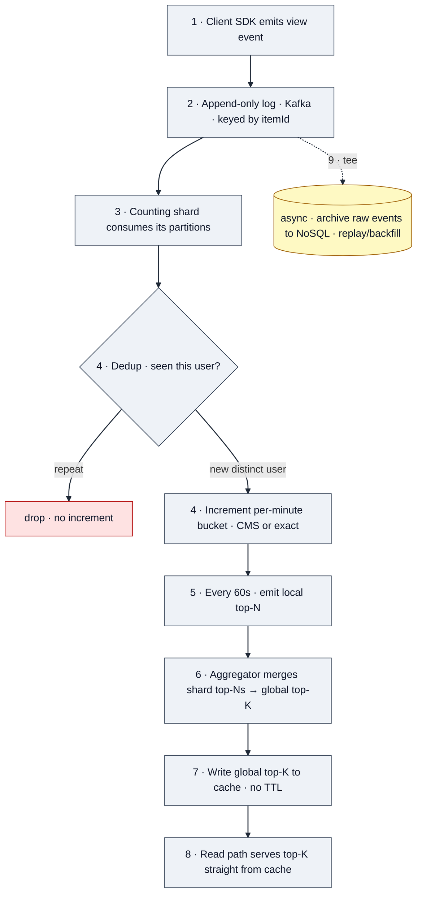
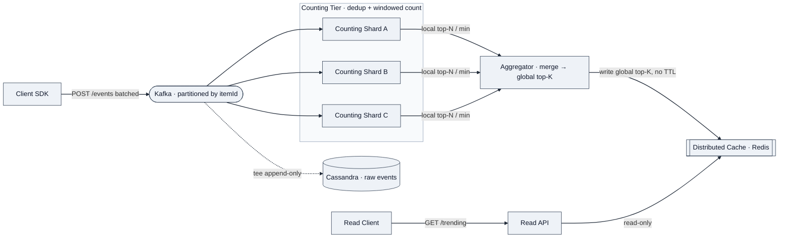
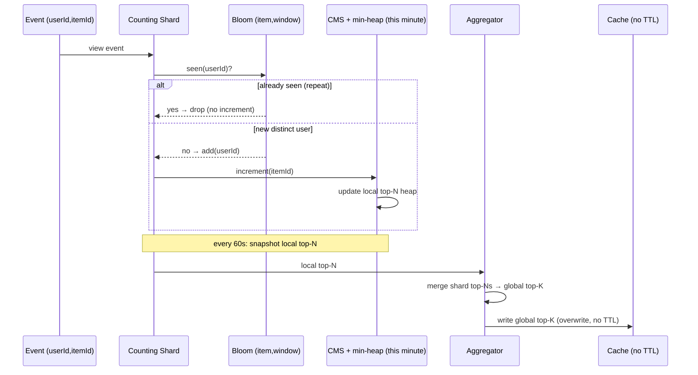

# Design a Real-Time Trending / Top-K Hot-Items Service

> **Prompt (Figma, onsite system design, ~60 min):** Ingest a high-volume stream of impression/view events and serve a frequently-updated **global (non-personalized) top-K** list of the hottest items (files, search terms, articles). The list refreshes on a short cadence (minute-level) over a rolling window (daily). Discuss **dedup** (distinct users per item within the window), **windowed counting**, **approximate top-K**, and a **read path that stays available**.

---

## 1. Requirements (~5 min)

### Clarifying questions I'd ask first

| Question | Why it matters | Assumption I commit to |
|---|---|---|
| Is the list **global** or per-team/per-space? | Global = one heap; per-tenant = K heaps, changes sharding | **Global, non-personalized** |
| What counts as "hot" — **raw views** or **distinct viewers**? | Distinct-user dedup needs a set/Bloom structure per item, not just a counter | **Distinct users per item** within the window (a bot refreshing 10k times ≠ trending) |
| Window semantics: **rolling** or **fixed calendar day**? | Rolling daily needs per-minute buckets that expire; fixed day is a truncated counter | **Rolling 24h**, evaluated at **1-min cadence** |
| Is **exact** top-K required, or is approximate OK? | Exact needs full per-item counts in RAM; approximate unlocks CMS/sampling | **Approximate is acceptable** — top-K by definition tolerates fuzz in the tail |
| How recent must a newly-hot item be reflected? | Sets the freshness SLA and merge cadence | **≤ 1 min staleness** |
| Scale? | **Don't over-engineer** — Figma's real QPS here is modest | Design for ~**100k–1M events/s** ceiling but note the path degrades gracefully lower |

> **Scope discipline (this problem's trap):** the notes flag that *over-engineering is penalized*. I calibrate to the stated scale and only reach for CMS/sampling as a **memory-bound follow-up**, not the opening move.

### Functional Requirements (top 3)
1. **Ingest** a high-volume append-only stream of `(userId, itemId, ts)` view events.
2. Serve **`GET /trending?k=100`** — global top-K hottest items over the rolling daily window.
3. **Dedup** so a count reflects **distinct users** per item within the window.

### Non-Functional Requirements (top 4, quantified)
1. **Read availability > write consistency** — the top-K read must survive backend hiccups. Target **99.99%** read availability; the list may be **stale by up to ~1 min** (this is an **AP** choice — *DDIA Ch. 9*, we deliberately give up linearizability on the read path).
2. **Freshness:** newly-hot item appears within **≤ 60 s**.
3. **Bounded memory** for counting: sub-linear in #distinct-items using sketches — must not require a counter per item in RAM at the tail.
4. **Ingest durability:** no silent event loss — raw events persisted append-only for replay/backfill.

**Capacity note (only where it changes a decision):** at ~1M events/s the question is *"can one node hold all counters?"* If distinct items ≈ 10⁸ and we kept an exact `int64` per item that's ~800 MB just for counts, plus a per-item distinct-user set — that's the number that forces **sharded counting + sketches** rather than a single min-heap. That's the only math I front-load.

---

## 2. Core Entities (~2 min)

| Entity | Role | Example |
|---|---|---|
| **ViewEvent** | The raw ingested fact — one view. `userId` derived from auth token, not the body. | `{ userId: "u_8213", itemId: "file_A9f", ts: 1725360000 }` |
| **CountBucket** | Per-item, per-minute distinct-user count — the atom of the rolling window. Keyed by `(itemId, minute)`. | `{ itemId: "file_A9f", minute: "2026-09-03T15:04", distinct: 342 }` |
| **ShardLocalTopN** | One counting shard's local top-N snapshot, emitted every 60s. Partial, per-shard — this is `file_A9f`'s *full* daily estimate, since all its events live on shard B. | `{ shard: "B", asOf: 1725360240, top: [ {itemId:"file_A9f", est:20431}, {itemId:"file_3c1", est:9330}, … ] }` |
| **GlobalTopK** | The merged, served list — what the read path returns. Interleaves top items from *different* shards (`file_A9f` from shard B, `search_kubernetes` from another); each score equals its owning shard's estimate — the merge reorders, never sums. Lives in cache, no TTL. | `{ asOf: 1725360240, items: [ {rank:1, itemId:"file_A9f", score:20431}, {rank:2, itemId:"search_kubernetes", score:18205}, … ] }` |

Trace the same item (`file_A9f`) across the four stages. It lives entirely on **one shard** (shard B) because events partition by `itemId` — so its count is never split across shards. The score grows *only* at the shard roll-up (summing 1440 minute-buckets into a daily total); the merge step just places it in the global ranking and leaves the value unchanged:

| Stage | Entity | What happens to `file_A9f` | Value |
|---|---|---|---|
| 1 · Ingest | **ViewEvent** | A single view arrives (after dedup, a new distinct user) | `{ userId:"u_8213", itemId:"file_A9f", ts:1725360000 }` |
| 2 · Count | **CountBucket** | Folded into its per-minute distinct-user bucket on **shard B** | `{ itemId:"file_A9f", minute:"15:04", distinct:342 }` |
| 3 · Shard roll-up | **ShardLocalTopN** | Shard B sums `file_A9f`'s 1440 buckets over 24h → daily estimate | `{ itemId:"file_A9f", est:20431 }` (rank 1 on shard B) |
| 4 · Merge | **GlobalTopK** | Aggregator places shard B's entry into the global ranking — **value unchanged** | `{ rank:1, itemId:"file_A9f", score:20431 }` |

> **Why the score is flat from stage 3 → 4:** the aggregator merges each shard's *top-N list* (disjoint items — shard A's hot files, shard B's, shard C's), it does **not** sum one item's count across shards. Since all of `file_A9f`'s events live on shard B, its global score equals shard B's estimate. The merge reorders and interleaves; it never adds.

---

## 3. API / System Interface (~5 min)

**Read (the SLA-critical path):**
```
GET /v1/trending?window=24h&k=100
→ 200 { asOf: <ts>, items: [ { itemId, score, rank }, ... ] }
```
Served **entirely from cache**; idempotent; heavily cacheable at the edge (short CDN TTL, e.g. 10–30 s).

**Write (ingest):**
```
POST /v1/events        # usually not a public REST call —
{ itemId, ts }         # events land on a log (Kafka), userId derived from auth token
```
> **Identity:** `userId` is **derived from the auth token**, never trusted from the body — otherwise dedup is trivially spoofable.

Protocol: **REST** for both. Ingest is fire-and-forget onto a durable log; the client SDK batches. No need for gRPC/GraphQL here.

---

## 4. Data Flow (~5 min)

This *is* a pipeline, so I state it explicitly:

```
1. Client SDK emits view event
2. → Append-only event log (Kafka), keyed by itemId
3. → Counting shards consume their partitions
4.    each shard: dedup (Bloom) → increment per-minute bucket (CMS or exact)
5. → every minute, each shard emits its local top-N
6. → Aggregator merges shard top-Ns into global top-K
7. → write global top-K to distributed cache (no TTL)
8. Read path serves top-K straight from cache
9. (async) raw events also archived to NoSQL for replay/backfill
```

The key architectural seam: **partition by `itemId`** so all events for one item land on one shard — that makes per-item dedup and counting **local** (no cross-shard coordination to count one item).

Rendered as a pipeline — note the two divergent sinks off the log: the **hot path** (dedup → count → merge → cache) and the **cold path** (durable archive for replay):



The hot path is where freshness and availability live; the tee'd cold path is where **durability** lives (`"let the sketch serve the read; let the log tell the truth"`) — the same append-only log that feeds counting also underwrites an exact offline recompute.

---

## 5. High-Level Design (~10–15 min)

Endpoint-by-endpoint.

### Write path — `POST /events`
Client SDK batches events onto **Kafka**, partitioned by `itemId` (consistent hashing). A pool of **counting shards** each owns a set of partitions. Because a given `itemId` is always on the same partition/shard, **all counting for that item is single-shard** — no distributed counter, no coordination.

Each shard maintains, per item:
- a **rolling ring of per-minute buckets** (1440 buckets = 24h). The daily count is the sum over the ring; expiring the window is just dropping the oldest bucket each minute — clean and O(1).
- a **dedup structure** (Bloom filter) per (item, window) so repeat views by the same user don't inflate the distinct-user count.

Events are **also** tee'd append-only into **NoSQL (Cassandra)** for durable replay — *"durability lives in the DB."*

### Aggregation
Every minute, each shard computes its **local top-N** (N a few× larger than K) and pushes it to an **Aggregator**. Because events partition by `itemId`, each item's full count lives on one shard — so the aggregator merges **disjoint top-N lists** (different items from different shards) into one global ranking; it does *not* sum an item's count across shards. The generous N guards the real failure mode: an item that's globally top-K but ranks *below its own shard's* top-N — e.g. it landed on a shard that happens to own many hotter files — and would be culled locally before the aggregator ever sees it. The aggregator merges via a bounded min-heap, then **writes the result into a distributed cache with no TTL.**

### Read path — `GET /trending`
Reads hit the **distributed cache directly** and never touch the counting tier. *"The cache is the source of truth for the read path, not a performance helper"* — with **no TTL**, a total collapse of the counting/aggregation tier just means the served list goes stale, not unavailable. That's the deliberate AP trade.



**Callouts I make and defer:** dedup structure choice, memory bounds via sketches, hot-item skew, and aggregator failure — all go to Deep Dives.

---

## 6. Deep Dives (~10 min)

### 6a. Dedup — distinct users per item (Bloom filter)

Naively, distinct-user dedup means a `Set<userId>` per (item, window) — unbounded. Instead: a **Bloom filter per (item, window)**. On each event, test-and-add `userId`; if already present, it's a repeat → don't increment.

- **Trade-off:** Bloom filters have **false positives, never false negatives**. A false positive here means we *wrongly think we've seen this user* → we **under-count** distinct users. For *trending ranking* (relative order of hot items), a small, uniform under-count is acceptable; we're not billing on it.
- Size the filter for the expected distinct-user cardinality per hot item at a target FP rate (~1%).
- Alternative for exact-ish distinct **cardinality** (not membership): **HyperLogLog** — O(1.5 KB) per item for a distinct-count estimate with ~2% error. HLL gives you the *number* of distinct users cheaply but can't answer "have I seen this specific user?" — so **Bloom for dedup decisions, HLL if you only need the distinct-count**. I'd volunteer HLL as the better fit if the requirement is purely "how many distinct users," and keep Bloom if we must suppress the repeat increment itself.

### 6b. Windowed counting + approximate top-K (Count-Min Sketch)

If #distinct items is huge and we can't afford an exact counter per item, the frequency side uses a **Count-Min Sketch** per per-minute bucket:
- Fixed-size 2D array of counters, `d` hash rows × `w` columns. Increment = hash into each row and bump. Query = **min** over the rows.
- **Bias:** CMS **only over-estimates** (hash collisions add phantom counts; taking the min bounds it). It **never under-counts**. So a cold item can look slightly hotter than it is, but a genuinely hot item is never hidden — which is exactly the bias you want for *finding heavy hitters*.
- CMS gives you a **count for an item you name**, not the top-K itself. So pair it with a **min-heap of size N** tracking the current heavy hitters: on each increment, query CMS for the item's estimate and conditionally push/replace in the heap. This is the canonical **"CMS + heap" heavy-hitter** structure.

**Rolling daily window from per-minute buckets:** keep **1440 CMS+heap buckets** in a ring. The daily estimate for an item = sum of its per-minute estimates across the ring. Every minute: allocate a fresh bucket, drop the one 1440 minutes old. This is why per-minute granularity matters — **expiry is bucket eviction, not per-event bookkeeping.**



### 6c. Read path that stays available (the headline NFR)

The cache holds the global top-K with **no TTL**. Consequences:
- If the aggregator, a shard, or Kafka dies, `GET /trending` **keeps serving the last-good list** — availability is decoupled from the counting tier's health. Staleness, not downtime.
- Replicate the cache (Redis with replicas / cross-AZ) so a cache node loss doesn't drop reads.
- Front with a **short CDN/edge TTL (10–30 s)** — a global non-personalized list is the ideal CDN object: high read amplification, one shared value, near-100% hit ratio. This absorbs the read fan-out entirely and is the single biggest reason this read path is cheap.
- *Contrast with a per-user feed:* that would be private, read-once → CDN hit ratio ≈ 0. Here the **shared, public** nature of the list is what makes edge caching actually work.

### 6d. Hot-item skew & sampling optimization

One viral file can dominate a single partition (hot shard). Two levers:
- **Event-frequency-based sampling:** once an item is clearly a heavy hitter, **sample its events at a lower rate** (e.g. 1-in-10) and scale the count back up. A top-K item's rank is insensitive to exact count, so this cuts the write load on the hottest keys — the ones that hurt most — with negligible ranking impact. Volunteer this proactively; it's the intended optimization.
- **Salting** the hottest keys across sub-partitions and summing at aggregation, if one item still saturates a shard.

### 6e. Aggregator failure & correctness

- Aggregator is **stateless** — it reads shard top-Ns and writes cache. On crash, a standby takes over; worst case the cache goes stale for one merge cycle (bounded by the no-TTL guarantee).
- **Local top-N > K** (say N = 5K): an item's whole count lives on one shard, so the risk is that *that* shard's local top-N cutoff drops it (because the shard owns many hotter files) even though it's globally top-K. A generous N keeps such near-cutoff items in the report. Larger N shrinks this risk at linear merge cost.
- **Exact backfill:** because raw events are in Cassandra append-only, we can recompute an authoritative top-K offline to audit sketch drift — *"let the sketch serve the read; let the log tell the truth."*

---

## Real-World Anchor

- **Bytebytego "Top-K / Heavy Hitters"** pattern is exactly this shape: Kafka → sharded counters → per-shard top-N → aggregator → served list, with **Count-Min Sketch** as the memory-bounded frequency estimator and a **min-heap** for the top-K itself.
- **Figma**'s own recent-files/trending surfaces are modest-QPS, which is why the notes warn against reflexively designing for extreme throughput — the *shape* matters more than the scale here.
- *DDIA Ch. 11 (Stream Processing)* underpins the whole design: **tumbling per-minute windows**, the **append-only log as the source of truth**, and reprocessing from the log for correction. *DDIA Ch. 9* frames the deliberate **AP** read-path choice (availability over linearizability).

---

## 🔍 Senior-Signal Questions to Ask in Your Interview

- **"Is the trending signal raw views or distinct viewers — and are we OK under-counting distinct users via Bloom false positives?"** → *Why it matters: forces the interviewer to commit to the dedup semantics before you pick a structure; shows you know Bloom under-counts and CMS over-counts and that the bias direction is a design choice, not an accident.*
- **"What's the acceptable staleness on the read path — is a 60-second-old list fine if it means the read survives a counting-tier outage?"** → *Why it matters: surfaces the explicit AP/availability trade and the no-TTL cache decision (DDIA Ch. 9).*
- **"Rolling window or fixed calendar day — does a view at 23:59 fall out of the window at 00:00, or 24h later?"** → *Why it matters: the notes call this out specifically — the window/refresh boundary decides the whole aggregation path (per-minute ring vs. truncated counter).*
- **"How large do we make each shard's local top-N relative to global K?"** → *Why it matters: names the concrete failure mode — an item whose owning shard is crowded with hotter files, so it falls below that shard's local cutoff despite being globally top-K — and shows you understand mergeability of disjoint per-shard top-Ns.*
- **"Should we sample the hottest items' events to shed load, given rank is insensitive to exact count?"** → *Why it matters: volunteering event-frequency sampling is the intended optimization and signals you optimize the tail that actually hurts (hot shards), not uniformly.*
- **"Do we need an offline exact recompute from the raw log to audit sketch drift?"** → *Why it matters: shows you treat the append-only log as ground truth and the sketch as a serving approximation — the durability/approximation split.*