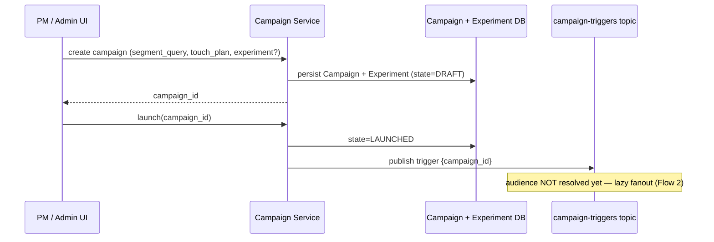
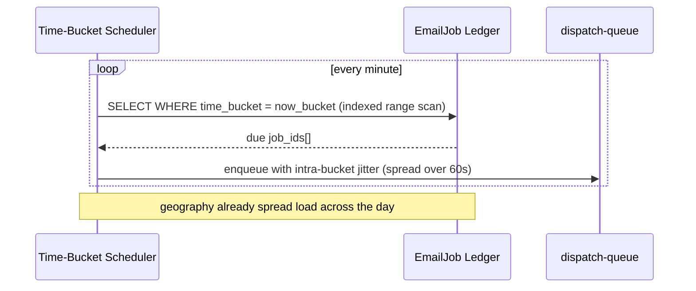
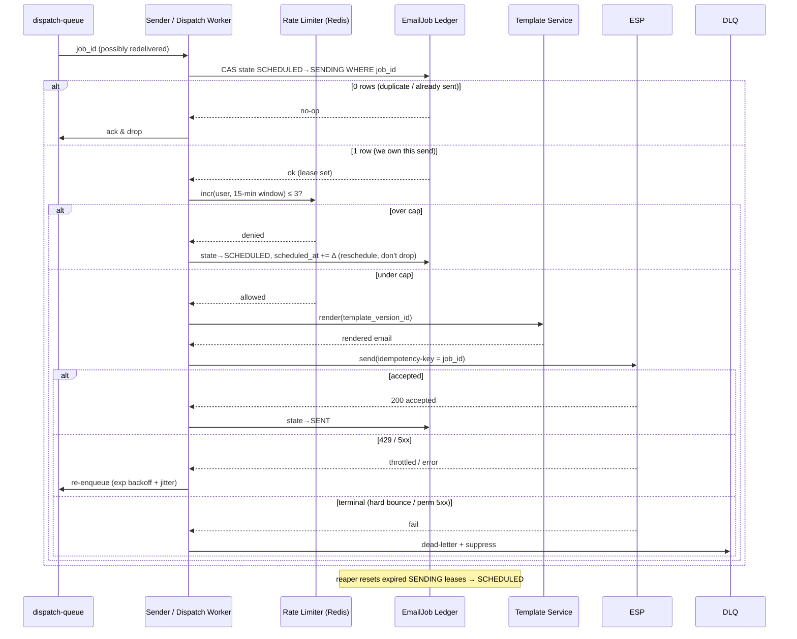
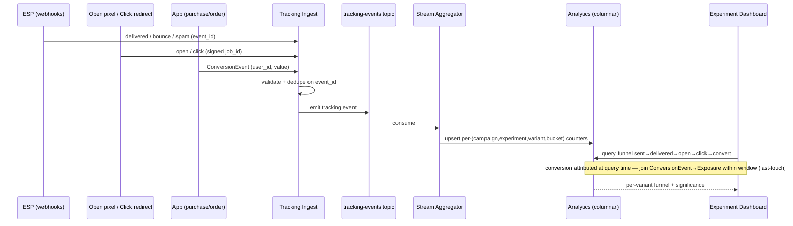
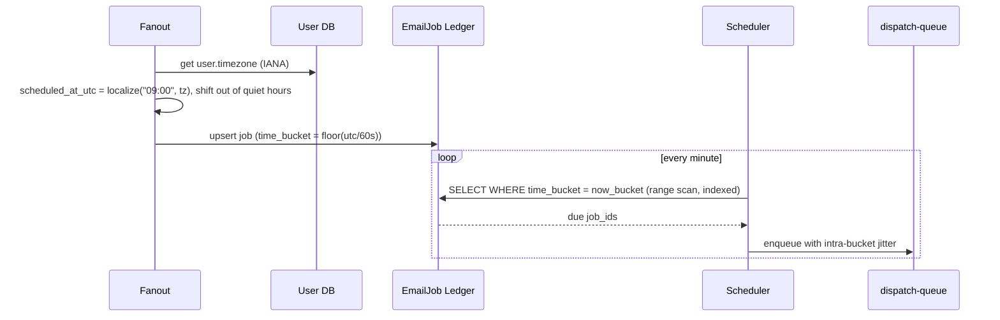

# Design: Marketing Email System — Scheduling, Time Zones, A/B Testing, Tracking

> **Open with the invariant, not the architecture:**
> *"A campaign fans out into one immutable `EmailJob` per (user, campaign-touch); the job's send time is computed to UTC at generation using the user's timezone; a time-bucketed scheduler fires jobs into a throttled sender that talks to an idempotent ESP; and everything after 'ESP accepted' is an append-only event-attribution problem. The two hard invariants are **no duplicate sends** (idempotency on the job) and **stable experiment bucketing** (deterministic, not stored-coin-flip)."*

The prompt is really three sub-systems bolted onto a fanout pipeline: **timezone-aware scheduling**, **consistent A/B bucketing + exposure logging**, and **an event/attribution pipeline**. The interviewer said *focus on those three* — so the high-level design is deliberately lean and the depth goes there.

---

## 1. Requirements & Assumptions (~5 min)

### Stated constraints — my assumptions (state + justify)

| Dimension | Assumption | Justification |
|---|---|---|
| **Users** | 50M total, ~20M targetable/day | Mid-size B2C marketing list; large enough to force real fanout + sharding, small enough that one ESP relationship works |
| **Daily volume** | 20M users × ~2.5 emails/window = **~50M sends/day**; peak campaigns burst 10M jobs in minutes | The 2–3-per-15-min rule is the multiplier |
| **Sustained QPS** | ~600 sends/s avg | 50M / 86400 |
| **Peak QPS** | 30–50k jobs/s *generated*; sending throttled to ESP ceiling (say 5k/s) | Generation is bursty; **sending is rate-limited by the ESP, so the queue absorbs the burst** — this gap is a core design point |
| **Tracking events** | ~3× sends = **~150M events/day** (accepted, delivered, open, click, some conversions) | Forces tracking off the OLTP path onto a stream + columnar store |
| **SLA** | **Best-effort within the 15-min window**; scheduling precision ±1 min; delivery latency loose (minutes OK) | Marketing email is not transactional — *late is fine, duplicate/lost is not*. This relaxation is what lets the whole send path be AP. |
| **ESP** | Managed provider (SES/SendGrid), idempotency-key support, delivery/bounce **webhooks** | We own scheduling + experimentation + attribution; we do **not** own MX/SMTP/deliverability plumbing |

### Functional Requirements (top 3, prioritized)

1. **Fan a campaign out to one send-job per (user, touch), scheduled at the user's local time, respecting a per-user frequency cap** (2–3 / 15-min window).
2. **A/B experiments**: consistently bucket each user, deliver the bucketed variant, and **record an exposure** at send time.
3. **Track & attribute**: sent → delivered → open → click → **conversion**, joinable back to `(campaign, experiment, variant)`.

### Non-Functional Requirements (top 4, quantified)

- **No duplicate sends** *(hard invariant)*: a `(user, campaign_touch)` is sent **exactly once** despite at-least-once queues + worker crashes. Consistency requirement on the **job ledger**, not on the email.
- **Consistent bucketing** *(hard invariant)*: a user's variant assignment is **stable across retries, restarts, and re-fanout** — never re-rolled.
- **AP on the send path**: an ESP/region outage degrades to *delayed*, never *lost or duplicated*. The only strongly-consistent operation is the per-job state transition (the dedup gate).
- **Scale**: absorb a 10M-job burst without dropping; scheduler must not full-scan 50M rows to find what's due.

> **Capacity note (only where it changes a decision):** 150M tracking events/day is why opens are **not** counted as `UPDATE job SET opens=opens+1` (150M writes/day of row contention + couples analytics to the send path). It goes to a stream → columnar store instead. That's the one number that changes an architecture decision; I won't front-load the rest.

---

## 2. Core Data Models (~4 min)

Only design-relevant fields (skipping obvious `created_at`, `name`, etc.).

**Campaign** — the marketing initiative + schedule policy.
```
campaign_id (PK)
segment_query            -- defines the audience
schedule_policy          -- { mode: LOCAL_TIME|FIXED_WINDOW, local_time:"09:00",
                            --   window:[start,end], respect_quiet_hours:true }
touch_plan               -- ordered touches within the 15-min window, e.g.
                            --   [{seq:1, template_id, offset:0m},
                            --    {seq:2, template_id, offset:5m}]
experiment_id (nullable) -- FK if this campaign is under an experiment
channel                  -- EMAIL | SMS | PUSH  (extensibility hook)
state                    -- DRAFT|LAUNCHED|PAUSED|DONE
```

**Experiment** — the A/B definition, decoupled from Campaign so an experiment can span dimensions.
```
experiment_id (PK)
unit                     -- USER (bucketing unit)
salt                     -- immutable random salt; freezing this freezes assignments
variants                 -- [{variant_id, weight, overrides:{subject|template|send_offset|offer}}]
dimension                -- SUBJECT | CONTENT | SEND_TIME | OFFER  (extensible)
state                    -- RUNNING | STOPPED
```

**EmailJob** *(the ledger row — the heart of the system)* — one immutable unit of work; the **dedup + idempotency anchor**.
```
job_id (PK)                        -- deterministic: hash(user_id, campaign_id, touch_seq)
UNIQUE(user_id, campaign_id, touch_seq)   -- the dedup key
user_id, campaign_id, touch_seq
channel
variant_id                         -- resolved A/B arm (also derivable deterministically)
template_version_id                -- pinned version → reproducible renders
scheduled_at_utc                   -- computed from user tz at generation
time_bucket                        -- floor(scheduled_at_utc / 60s)  → scheduler index
state                              -- SCHEDULED|SENDING|SENT|FAILED|SUPPRESSED
lease_expires_at                   -- for crash reclamation
idempotency_key                    -- = job_id, passed to ESP
```

**UserSchedule / User** — timezone + consent + budget (extensibility: per-channel consent).
```
user_id (PK)
timezone                 -- IANA tz, e.g. "America/Los_Angeles"
email, phone, push_token
consent                  -- { EMAIL:bool, SMS:bool, PUSH:bool }
quiet_hours              -- local [start,end]
```

**Exposure** *(append-only)* — records that a user was **shown** a variant. Written at send time, not assignment time — exposure = "we actually sent the variant," which is what analysis needs.
```
exposure_id (PK)
experiment_id, variant_id, user_id
job_id                   -- links exposure to the concrete send
exposed_at
UNIQUE(experiment_id, user_id)   -- one exposure per user per experiment
```

**DeliveryEvent** *(append-only, high-volume)* — the tracking stream sink.
```
event_id (PK)
job_id                   -- joins back to campaign/experiment/variant
type                     -- ACCEPTED|DELIVERED|BOUNCE|OPEN|CLICK|SPAM|UNSUB
occurred_at
meta                     -- { url for click, bounce_reason, ... }
```

**ConversionEvent** *(append-only)* — business outcome, attributed by window + user.
```
conversion_id (PK)
user_id
type                     -- PURCHASE|SIGNUP|...
value                    -- revenue
occurred_at
-- attribution done at query time: last/first-touch join to Exposure within window
```

> **Why Exposure and DeliveryEvent are separate tables:** exposure is the *experiment* fact (did we show variant X?), delivery is the *channel* fact (did the ESP accept/open?). Conflating them means a bounced email still counts as an exposure — which corrupts experiment denominators. Keeping them separate lets analysis choose: *sent-basis* vs *delivered-basis* conversion rate. Naming that unprompted is a senior signal.

### Worked example — one scenario traced across every table

*Scenario: campaign `cmp_42` ("Spring Sale") runs experiment `exp_7` (50/50 subject-line test) with a 2-touch plan. We follow user `u_1001` (Los Angeles, converts) and `u_1002` (London, bounces).*

**Campaign**

| campaign_id | segment_query | touch_plan | schedule_policy | experiment_id | channel | state |
|---|---|---|---|---|---|---|
| `cmp_42` | `active_last_30d AND cart_abandoned` | `[{seq:1,tpl:t_spring,offset:0m},{seq:2,tpl:t_reminder,offset:5m}]` | `{mode:LOCAL_TIME, local_time:"09:00", quiet_hours:true}` | `exp_7` | EMAIL | LAUNCHED |

**Experiment**

| experiment_id | unit | salt | variants | dimension | state |
|---|---|---|---|---|---|
| `exp_7` | USER | `9f3a1c` | `[{v:A,weight:50,overrides:{subject:"Spring Sale 🌸"}}, {v:B,weight:50,overrides:{subject:"20% off — today only"}}]` | SUBJECT | RUNNING |

**User**

| user_id | timezone | email | consent | quiet_hours |
|---|---|---|---|---|
| `u_1001` | `America/Los_Angeles` | ada@ex.com | `{EMAIL:true}` | `[21:00,07:00]` |
| `u_1002` | `Europe/London` | ben@ex.com | `{EMAIL:true}` | `[22:00,08:00]` |

**EmailJob** — `hash(salt ⊕ u_1001)` → variant **A**; `hash(salt ⊕ u_1002)` → variant **B**. Two touches per user → 4 rows. Note the `scheduled_at_utc` differs by timezone (09:00 PDT = 16:00 UTC; 09:00 BST = 08:00 UTC), so London fires 8h *before* LA despite the same "9am local."

| job_id | user_id | campaign_id | touch_seq | variant_id | template_version_id | scheduled_at_utc | time_bucket | state | lease_expires_at |
|---|---|---|---|---|---|---|---|---|---|
| `j_a1` | `u_1001` | `cmp_42` | 1 | A | `t_spring_v3` | `2026-04-02T16:00:00Z` | `29051760` | SENT | — |
| `j_a2` | `u_1001` | `cmp_42` | 2 | A | `t_reminder_v3` | `2026-04-02T16:05:00Z` | `29051765` | SENT | — |
| `j_b1` | `u_1002` | `cmp_42` | 1 | B | `t_spring_v3` | `2026-04-02T08:00:00Z` | `29051280` | FAILED | — |
| `j_b2` | `u_1002` | `cmp_42` | 2 | B | `t_reminder_v3` | `2026-04-02T08:05:00Z` | `29051285` | SUPPRESSED | — |

*(`j_b1` hard-bounced → `j_b2` auto-**SUPPRESSED** before send, since `u_1002`'s address is now on the suppression list. This is why touch 2 never went out.)*

**Exposure** — written at **send** time, so only successfully-sent variants appear. `u_1002` bounced on touch 1 but the ESP *accepted* it first, so the exposure exists on a **sent-basis**; a *delivered-basis* analysis would later exclude it via the DeliveryEvent bounce.

| exposure_id | experiment_id | variant_id | user_id | job_id | exposed_at |
|---|---|---|---|---|---|
| `x_1` | `exp_7` | A | `u_1001` | `j_a1` | `2026-04-02T16:00:03Z` |
| `x_2` | `exp_7` | B | `u_1002` | `j_b1` | `2026-04-02T08:00:02Z` |

*(One row per `(experiment,user)` — touch 2 does **not** create a second exposure; the user is already exposed to their arm.)*

**DeliveryEvent** — append-only funnel, keyed by `job_id`. `u_1001` opens+clicks; `u_1002` hard-bounces.

| event_id | job_id | type | occurred_at | meta |
|---|---|---|---|---|
| `e_01` | `j_a1` | ACCEPTED | `16:00:03Z` | — |
| `e_02` | `j_a1` | DELIVERED | `16:00:31Z` | — |
| `e_03` | `j_a1` | OPEN | `16:14:10Z` | `{mpp:true}` |
| `e_04` | `j_a1` | CLICK | `16:14:52Z` | `{url:"/spring"}` |
| `e_05` | `j_b1` | ACCEPTED | `08:00:02Z` | — |
| `e_06` | `j_b1` | BOUNCE | `08:00:44Z` | `{reason:"550 mailbox not found"}` |

*(`e_03` carries `mpp:true` — Apple pre-fetched the pixel, so this open is untrustworthy; the CLICK `e_04` is the real engagement signal.)*

**ConversionEvent** — carries only `user_id` + time + value. **No experiment/variant column** — attribution is a query-time join to Exposure within the window.

| conversion_id | user_id | type | value | occurred_at |
|---|---|---|---|---|
| `c_1` | `u_1001` | PURCHASE | 48.00 | `2026-04-02T16:22:00Z` |

*(Attribution: `c_1.user_id = u_1001` → join Exposure `x_1` → credits **variant A** of `exp_7`, because the purchase falls inside the attribution window after exposure. Change the window or switch to first-touch and the same rows re-attribute differently — that's the point of deciding it at query time.)*

---

## 3. High-Level Architecture (~10 min)

Lean core; depth deferred to the three focus areas.

```mermaid
flowchart LR
    Admin[Campaign / Experiment Config UI] --> CDB[(Campaign + Experiment DB)]
    Admin -->|launch| Trig([campaign-triggers topic])

    Trig --> Fan[Audience + Fanout Service]
    Fan -->|resolve segment| UDB[(User DB · tz, consent)]
    Fan -->|assign variant + compute utc time| EX[Experiment Service]
    Fan -->|"idempotent upsert<br/>1 EmailJob per (user,campaign,touch)"| JDB[(EmailJob Ledger)]
    Fan -->|write exposure at send-gen| XDB[(Exposure)]

    subgraph SCHED["Scheduling plane"]
        Sched[Time-Bucket Scheduler] -->|due bucket| DQ([dispatch-queue])
    end
    JDB -->|index: time_bucket| Sched

    DQ --> Disp[Sender / Dispatch Worker]
    Disp -->|"≤3/15min?"| RL[[Rate Limiter · Redis]]
    Disp -->|"CAS SCHEDULED→SENDING"| JDB
    Disp -->|render| TS[Template Service · versioned]
    Disp -->|"send, idempotency-key=job_id"| ESP[ESP · SES/SendGrid]
    Disp -.retry/backoff.-> DQ
    Disp -->|terminal fail| DLQ([DLQ])

    ESP -->|delivered/bounce webhook| TIng[Tracking Ingest]
    Pixel([open pixel / click redirect]) --> TIng
    Store([app: purchase/order]) --> TIng
    TIng --> TK([tracking-events topic])
    TK --> AGG[Stream Aggregator]
    AGG --> ADB[(Analytics · columnar)]
    ADB --> Dash[Experiment Analysis / Dashboards]

    classDef node fill:#eef2f7,stroke:#334155,color:#0f172a;
    classDef plane fill:#f8fafc,stroke:#94a3b8,color:#0f172a;
    class Admin,CDB,Trig,Fan,UDB,EX,JDB,XDB,Sched,DQ,Disp,RL,TS,ESP,DLQ,TIng,Pixel,Store,TK,AGG,ADB,Dash node;
    class SCHED plane;
    linkStyle default stroke:#1f2937,stroke-width:1.5px;
```



**Component roles (one line each):**
- **Campaign/Experiment Config + DB** — source of truth for what to send, to whom, under which experiment. Low write volume, strongly consistent.
- **Audience + Fanout Service** — the amplifier: expands segment → concrete users, materializes one `EmailJob` per (user, campaign, touch). Idempotent on that key. Batched + checkpointed so a 10M fanout is resumable.
- **Experiment Service** — deterministic bucketing + variant override resolution.
- **EmailJob Ledger** — durable store of pending/sent work; the dedup + scheduling substrate.
- **Time-Bucket Scheduler** — reads only the *due* time bucket, pushes job_ids to dispatch-queue.
- **Sender/Dispatch Worker** — the state machine + throttle + ESP call; the only component that talks to the provider.
- **Template Service** — versioned rendering; job pins `template_version_id`.
- **Tracking Ingest → Kafka → Aggregator → columnar** — the append-only attribution pipeline, fully decoupled from the send path.

---

## 4. Core Flows (~5 min)

**(1) Campaign creation & audience selection** — PM defines segment + touch plan + optional experiment; launch publishes a trigger. Audience is resolved **lazily** (fanout is Flow 2), so launch is cheap.



**(2) Generating send jobs (fanout)** — the amplifier: 1 trigger → millions of jobs. Streamed in **cursor-checkpointed batches** so a 10M fanout is crash-resumable; idempotent upsert on `(user, campaign, touch)` makes re-processing a no-op. Variant assigned + exposure written here.

```mermaid
sequenceDiagram
    participant K as campaign-triggers
    participant F as Fanout Service
    participant U as User DB
    participant X as Experiment Service
    participant J as EmailJob Ledger
    participant XDB as Exposure
    K->>F: trigger {campaign_id}
    loop each batch (cursor-checkpointed)
        F->>U: resolve segment page (tz, consent)
        U-->>F: users[] + timezone + consent
        loop each user × each touch
            F->>X: bucket(salt ⊕ user_id) → variant
            X-->>F: variant_id
            F->>F: scheduled_at_utc = localize(local_time, tz)<br/>time_bucket = floor(utc/60s)
            F->>J: UPSERT job (user,campaign,touch) idempotent
            F->>XDB: write Exposure (unique per experiment,user)
        end
        F->>F: checkpoint cursor
    end
    Note over F,J: crash → resume from checkpoint; re-run upserts same rows (no dup)
```

**(3) Time-zone aware scheduling** — `scheduled_at_utc` was already computed at fanout, so the scheduler does **no tz math** — just an indexed range scan of the due `time_bucket`, with intra-bucket jitter smearing the within-minute herd.



**(4) Sending with throttling/retries** — the dedup + throttle core. **CAS `SCHEDULED→SENDING`** is the single-writer gate (0 rows = duplicate, dropped); cap check in Redis; ESP called with `idempotency-key=job_id`; 429/5xx backoff, terminal → DLQ; stuck `SENDING` reclaimed by lease reaper.



**(5) Event ingestion & attribution** — a decoupled append-only pipeline. ESP webhooks + pixel + click + purchase → Kafka → aggregator → columnar. **Conversion attribution is a query-time join** to Exposure within a window, so the model can change without re-ingesting.



---

## 5. Deep Dive A — Time Zones (a focus area)

**Compute UTC at write time, never at read time.** The naive design does timezone math in the scheduler's query (`WHERE localize(local_time, tz) <= now()`), which is un-indexable and forces a full scan. Instead:

- At **fanout**, resolve `scheduled_at_utc = localize(campaign.local_time, user.tz)`, push out of quiet hours, store `time_bucket = floor(utc/60s)`.
- Scheduler reads only the due bucket → a bounded **range scan on an indexed column**, not a scan of 50M rows. *(DDIA Ch. 6 — this is range partitioning by key; the scheduler touches one partition at a time.)*

**Timezones become free load-smoothing, not a problem.** "9am local" for a global list means IST users fire ~13.5h before PST users in UTC — the load is *already spread across the day* by geography. The within-bucket thundering herd (everyone in one tz at 9:00:00) is smeared with **intra-bucket jitter** across the 60s.

**Edge cases to name (senior signal):** DST transitions (store IANA tz, not fixed offset, so `localize` handles the jump); users who change timezone between generation and send (accept the stale schedule — best-effort SLA covers it, re-fanout would break idempotency); "fixed window" mode (schedule uniformly across `[start,end]` rather than a point time).



---

## 6. Deep Dive B — A/B Testing (a focus area)

### Consistent bucketing without a stored coin flip

`variant = weighted_pick( hash(experiment.salt ⊕ user_id), variants[].weight )`.

- **Deterministic** → the same user always lands in the same arm; a retry, restart, or re-fanout recomputes the *identical* variant with **zero stored state needed for correctness**. We still persist `variant_id` on the job for the analytics join, but correctness doesn't depend on that write surviving.
- **Freezing the assignment = freezing `experiment.salt`.** Because the salt is immutable once RUNNING, assignments never move even if you resize the variant list later. (If you must add a variant mid-flight, only *new* users can land in it unless you re-salt — and re-salting re-randomizes everyone, which you almost never want.)
- **Salt per experiment** (not global) prevents *carryover bias* — a user who happened to be in "arm A" of experiment 1 isn't correlated into arm A of experiment 2.

### Exposure logging: at send, on the sent-basis

Write the **Exposure** when the job is *dispatched*, not when the variant is *assigned at fanout* — because a job can be suppressed (bounce list, cap, DST edge) between assignment and send. An exposure must mean "the user was actually sent this variant," or your experiment denominator is wrong. `UNIQUE(experiment_id, user_id)` makes exposure idempotent under retry.

### Analysis trade-off: what metric decides the winner

- **Don't lead with open-rate.** Apple Mail Privacy Protection pre-fetches the tracking pixel, inflating opens for a large fraction of users — post-2021 this makes open-rate a **vanity/biased metric**. Lead A/B decisions on **click-through and conversion**.
- Report the **full funnel per variant** (sent → delivered → open → click → convert) and require **statistical significance** (e.g., a two-proportion z-test on conversion) before declaring a winner — otherwise you're reacting to noise.
- **Send-time as an experiment dimension** (the prompt lists it) is elegant here: the variant override is just a different `send_offset`, so "9am vs 6pm" A/B falls out of the same scheduling machinery with no special-casing.

---

## 7. Deep Dive C — Tracking & Attribution (a focus area)

**Off the OLTP path.** 150M events/day cannot be `UPDATE`s on the job row. Pixel/click/webhook/purchase → `tracking-events` topic → **Stream Aggregator** maintains per-`(campaign, experiment, variant, bucket)` counters in a columnar store (ClickHouse / Druid / BigQuery). The send path never feels tracking load. *(DDIA Ch. 11 — stream processing for derived, append-only aggregates.)*

**Attribution is a query-time join, not a write-time decision.** ConversionEvent carries only `user_id` + time + value. Attribution = *join conversions to Exposures within an attribution window*, with a configurable model (last-touch default; first-touch / linear as query variants). Doing it at query time means you can **re-attribute historically** when the model changes — a write-time attribution bakes in one model forever.

**Composability caveat (the trade-off the interviewer wants):**
- Conversion **rates** are composable — count numerators/denominators per bucket and roll up freely.
- **Percentiles are not composable.** If asked for p99 time-to-open, you cannot average bucketed p99s; you keep **t-digest sketches** per bucket and merge the sketches. *(DDIA Ch. 1's tail-latency aside.)* Naming this distinction is a strong senior signal.
- **Open-rate is structurally unreliable** (MPP) → treat delivered/click/convert as the trustworthy layer.

**Idempotent ingestion:** every tracking event carries a provider-supplied `event_id`; the aggregator dedupes on it, so ESP webhook retries don't double-count. Opens/clicks carry a **signed** `job_id` (not a raw user id) so they can't be forged or enumerated.

---

## 8. Reliability

- **Idempotency / dedup**: `job_id = hash(user, campaign, touch)` + `UNIQUE(user, campaign, touch)` → re-fanout is a no-op. The **CAS `SCHEDULED→SENDING`** is the single-writer serialization point (0-rows update = duplicate, dropped). ESP `idempotency-key=job_id` covers the crash-after-accept-before-`SENT` gap. **Effect is idempotent, so at-least-once queues are safe.** *(DDIA Ch. 7 & 9.)*
- **Retries**: exponential backoff + jitter on ESP 429/5xx, capped attempts.
- **DLQ**: terminal failures (hard bounce, permanent 5xx) → DLQ + suppression-list update to protect sender reputation.
- **Crash reclamation**: `lease_expires_at` on `SENDING`; a reaper resets expired leases to `SCHEDULED`. *Concrete failure prevented: a worker dying mid-send otherwise strands a recipient in `SENDING` forever.*
- **Backpressure**: sending is throttled to the ESP ceiling; the dispatch-queue buffers the burst. Best-effort SLA means we **shed into delay, never drop**.
- **Observability**: alert on **accept-rate** (delivery health — leads, unlike opens which lag/are noisy), bounce-spike (list quality), and funnel-delta per stage. Instrument fanout lag, scheduler bucket-drain time, queue depth, DLQ rate.

---

## 9. Extensibility

- **New channels (SMS/Push)**: `channel` is a first-class field on Campaign + EmailJob; the Sender is a strategy per channel behind one interface (ESP adapter / SMS gateway / push service). Scheduling, bucketing, dedup, tracking are **channel-agnostic** — only the dispatch adapter and consent field differ. Adding Push = new adapter + `consent.PUSH`, no ledger change.
- **New experiment dimensions**: `Experiment.dimension` + `variant.overrides` is an open map — SUBJECT/CONTENT/SEND_TIME/OFFER already fit; a new dimension is a new override key resolved at render/schedule time.
- **Template versioning**: job pins `template_version_id` at generation, so an in-flight campaign renders reproducibly even if the template is edited mid-send; and A/B on template = two versions, no schema change.

---

## Real-World Anchor

- **Bytebytego's notification-system / distributed-scheduler case studies** use this exact split — durable "to-send" store + time-partitioned scheduler + idempotent workers + a separate analytics pipeline — and generalize it across email/SMS/push, mirroring the channel-adapter extensibility above.
- **Braze / Customer.io / Mailchimp** all down-weight open-rate for A/B decisions post-Apple-MPP and attribute conversions on a delivered/click basis — the concrete, current reason Deep Dive C treats opens as the untrustworthy layer.

---

## 🔍 Senior-Signal Questions to Ask in Your Interview

- **"Is a duplicate send strictly worse than a dropped send under our SLA?"** → *Why it matters: pins the consistency model. Confirming yes justifies at-least-once + idempotent effect over chasing exactly-once delivery, and focuses the whole design on the CAS dedup gate.*
- **"Do we convert to the user's UTC send time at fanout or in the scheduler query?"** → *Why it matters: write-time conversion makes timezones free load-smoothing and keeps the scheduler an indexed range scan; read-time recreates a full-scan hotspot. Signals you've located the real bottleneck.*
- **"Do we log the Exposure at variant-assignment or at actual send?"** → *Why it matters: send-time is the only correct answer — a job suppressed after assignment would otherwise inflate the experiment denominator. Tests whether you separate the experiment fact from the channel fact.*
- **"Given Apple MPP inflates opens, what's the A/B decision metric?"** → *Why it matters: distinguishes vanity metrics from business impact and shows current deliverability awareness — moves the discussion from open-rate to conversion + significance.*
- **"Is conversion attribution decided at write time or query time?"** → *Why it matters: query-time joins to Exposure let you re-attribute historically when the model changes; write-time bakes one model in forever. Signals you treat attribution as an evolving analytical concern, not a fixed pipeline step.*
- **"What reclaims a job stuck in `SENDING` after a worker crash?"** → *Why it matters: naming the lease + reaper (the concrete stuck-workflow failure) rather than 'we just retry' is the difference between reciting the pattern and having run it.*