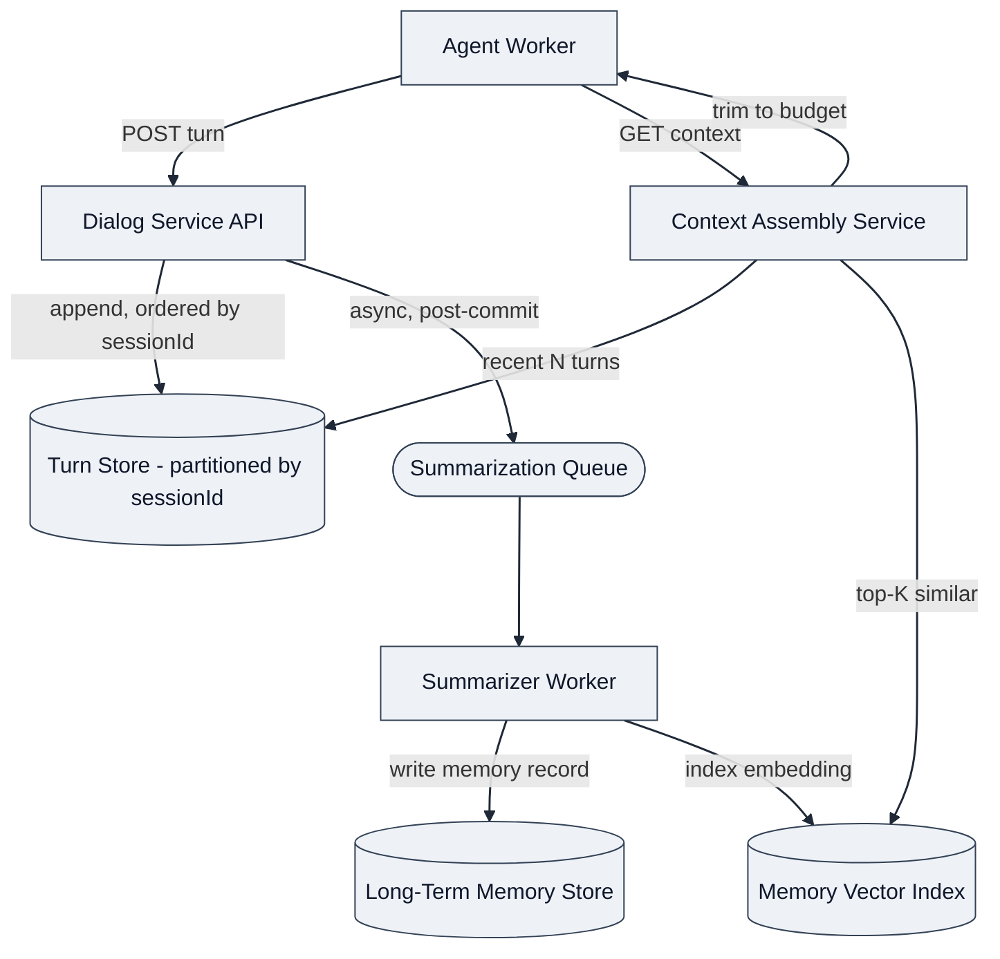
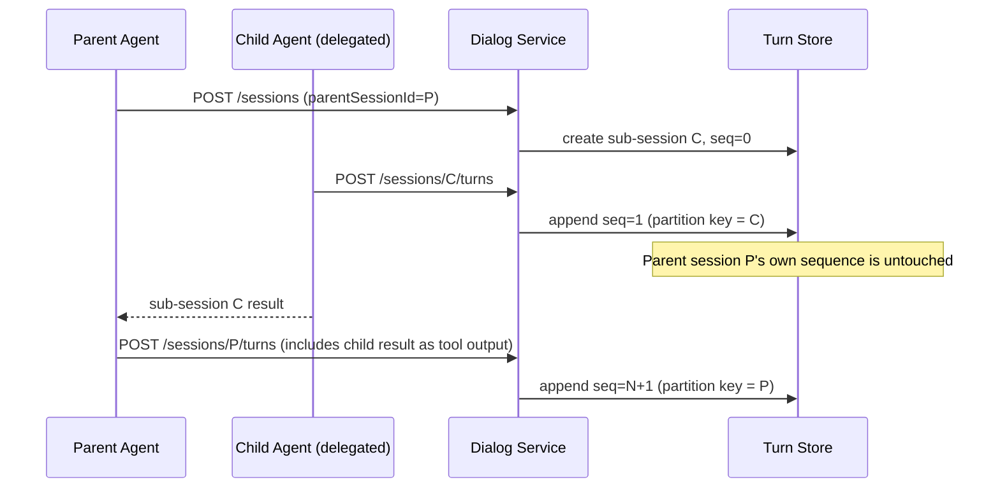
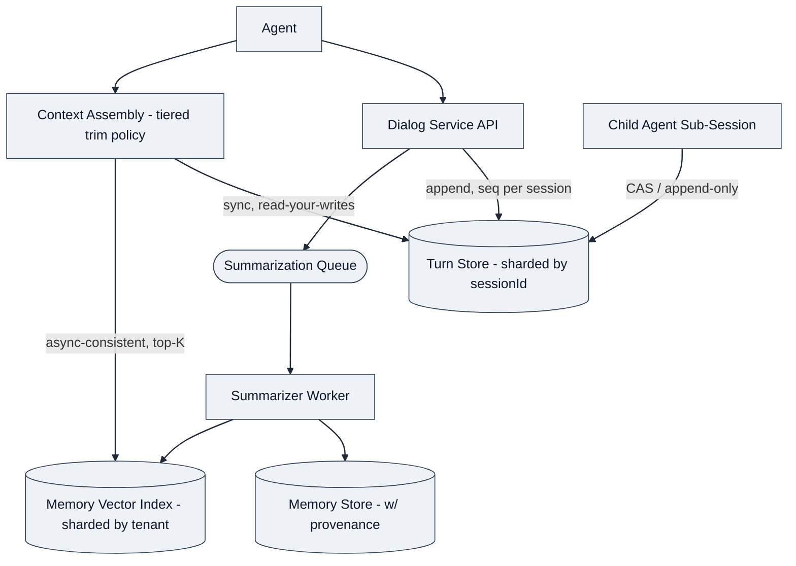

# Design: Stateful Dialog & Memory Service for Multi-Turn Agents

*Interview framing: "Design a service that manages conversation state and memory for multi-turn, context-aware agents — supporting many concurrent sessions at scale." This maps directly onto his Conversation Builder rearchitecture (websockets/Redis → gRPC/Kafka, made stateless and scalable) — he will be unusually sensitive to hand-wavy state management here, since fixing exactly this got him promoted.*

---

## 1. Requirements

**Functional Requirements** (top 3)
1. Maintain **conversation state** across turns for a session: message history, current plan/step, tool results referenced earlier in the conversation.
2. Support **long-term memory** that persists *across* sessions for a given user/tenant (facts, preferences, prior resolutions) — distinct from short-term in-session context.
3. Provide **context assembly** for each new agent turn: given a session + a new message, return the right context window (recent turns + relevant long-term memory) within a token budget — this is the actual hard product requirement, not just "store messages."

Clarifying questions:
- Is "memory" just a rolling window of recent messages, or does it require **semantic retrieval** over history (RAG over the user's own past conversations)? → **Assume both**: short-term = recent turns; long-term = retrieval-augmented, since the JD explicitly separates "State & Memory Management" from RAG pipelines but a mature design will show how they compose.
- Single-writer per session (one agent, one user, no concurrent turns) or can multiple agents/workers touch the same session concurrently (e.g. parallel sub-agent delegation writing back to a shared session)? → **Assume concurrent writers are possible** — this is exactly the case the multi-agent orchestration design creates (a parent and child Run both touching related state), and it's the crux of what made his old Conversation Builder pipeline non-scalable.
- Durability expectation if the service crashes mid-turn? → **Assume no data loss** for committed turns; **at most one in-flight turn** may need to be replayed/retried, not silently lost.

**Non-functional Requirements**
- **Latency**: context assembly must add low tens-of-ms, not hundreds — it's on the critical path of every agent turn (this is the same "gateway is on the hot path" theme as the LLM Gateway design).
- **Statelessness of compute / horizontal scalability**: workers serving turns should be stateless and horizontally scalable — session state lives in a shared store, not in worker memory. **This is the single most important NFR to state explicitly, because it's the exact fix he made at LivePerson** (moved off in-process/Redis-pubsub-coupled state to a scalable, stateless architecture).
- **Consistency**: within a single session, turn ordering must be strictly preserved (a reply must see all prior committed turns) — eventual consistency is *not* acceptable for the active session's own history, even if long-term memory retrieval can be eventually consistent.
- **Bounded memory growth**: sessions and long-term memory must not grow unbounded — summarization/eviction is a first-class concern, not an afterthought.

---

## 2. Core Entities
- **Session** — one conversation thread: sessionId, tenantId, userId, status, pointer to current turn.
- **Turn** — one message exchange within a session (user input, agent output, tool calls referenced) — append-only, ordered.
- **Memory Record** — a long-term, cross-session fact/summary about a user, with an embedding for retrieval and a source turn reference (provenance).
- **Context Window** — the *derived*, not stored, assembled context for a given turn: N recent turns + top-K retrieved memory records, trimmed to a token budget.

---

## 3. API / System Interface

```
POST /v1/sessions                          # create a session
POST /v1/sessions/{id}/turns               # append a turn (user msg); returns agent's turn once processed
GET  /v1/sessions/{id}/context?budget=4000 # assemble context for the next turn, given a token budget
POST /v1/memory                            # explicitly write/upsert a long-term memory record
GET  /v1/memory/search?userId=&query=      # retrieve relevant long-term memory (used internally by context assembly, also exposed for debugging/admin)
```

- `GET /context` is the key differentiated endpoint — it's what separates this from "just a message store." It's what the Agent Worker (from the orchestration design) calls before each LLM reasoning step.
- Tenant/user identity from the auth token.

---

## 5. High-Level Design



Endpoint walkthrough:
- **`POST /sessions/{id}/turns`**: append-only write to the Turn Store, **partitioned/sharded by `sessionId`** — this is the direct analog of Kafka-partitioning-by-key from his messaging migration: it guarantees per-session ordering while allowing the store to scale horizontally across sessions. No in-memory session affinity required on the API layer — any stateless worker can serve any session, because ordering is enforced by the store's partition key, not by which process happens to hold the session.
- **`GET /context`**: reads the last N turns (partition-local, fast) + queries the Memory Vector Index for top-K semantically relevant long-term records, trims by token budget (recent turns prioritized over retrieved memory when budget is tight), and returns an assembled prompt-ready context. This is a **read-time fan-in**, not a stored artifact — recomputed every turn, which keeps the design simple and avoids a second source of truth to keep in sync.
- **Summarization is asynchronous and off the hot path**: after a turn commits, a queue triggers background summarization into long-term Memory Records once a session ends or crosses a length threshold — turn latency is never blocked on memory-write latency.

**Stay simple first**: this satisfies state + memory + context assembly. Concurrent-writer conflicts, context budget trimming strategy, and memory staleness are Deep Dives.

---

## 6. Deep Dives

### 6.1 Concurrent writers on one session (the multi-agent case)
*DDIA Ch. 7 (Transactions) and Ch. 9 (Consistency/Consensus) are the backbone.* If a parent agent and a delegated child agent both want to write turns into a related session concurrently, naive last-write-wins can silently drop a turn — this is precisely the class of bug his stateless-pipeline rearchitecture eliminated.

- Each turn write is **append-only with a monotonic per-session sequence number** (not overwrite-in-place) — this removes the write-write conflict entirely; there's nothing to "win," every write just gets the next sequence number.
- If two agents genuinely need to reference the *same* logical turn slot (rare — usually parent/child have distinct sub-session IDs instead), use a **conditional write (compare-and-swap on expected sequence number)** and have the loser retry against the new head — optimistic concurrency, same pattern as MVCC.
- **Design choice worth stating explicitly**: prefer giving child agent delegations their **own sub-session** (linked via `parentSessionId`) rather than writing into the parent's turn stream directly — this sidesteps the conflict problem structurally instead of resolving it with locking, which is the more senior answer.



### 6.2 Context budget trimming — what gets cut when it doesn't fit
Naive "keep last N messages" breaks when a single tool result is huge (e.g. a big RAG chunk) or when the most relevant memory is from turn 1 of a 200-turn session.

- **Tiered trimming policy**: (1) always include system prompt + current turn, (2) sliding window of recent turns up to a token cap, (3) fill remaining budget with top-K retrieved long-term memory ranked by relevance score, (4) if still over budget, **summarize** (not truncate) the oldest in-window turns rather than dropping them silently — truncation loses information invisibly, summarization degrades it visibly and predictably.
- This trimming policy is itself a **tenant/agent-level config**, not hardcoded — different agents (a support bot vs. a coding agent) have very different "what matters most" answers, same design lesson as the LLM Gateway's per-tenant routing policy.

### 6.3 Memory staleness and correctness
Long-term memory is asynchronously written — a fact learned in turn 50 might not be indexed yet if turn 51 needs it "immediately."

- Accept **read-your-own-writes for the current session** (the Turn Store, read synchronously) but **eventual consistency for cross-session long-term memory** (the Memory Index, read asynchronously) — this is a deliberate, stated CAP trade-off: strong consistency where it's cheap and matters (current session), eventual where it's expensive and rarely matters (memory index staleness of a few seconds is fine).
- **Conflicting memory records** (user said X, later said not-X) — resolve by **recency-weighted retrieval**, not deletion; keep provenance (source turn) so an agent can reason about "the user previously said X, but more recently said not-X" rather than the system silently picking one.

### 6.4 Scaling the Turn Store and Memory Index independently
- **Turn Store**: partitioned by `sessionId`, similar to how he partitioned Kafka by conversation in the messaging pipeline — write-heavy, append-only, read pattern is "give me the last N for this session" (cheap, partition-local).
- **Memory Vector Index**: a separate scaling problem — read-heavy (every turn triggers a similarity search), and the index needs to scale independently of raw turn volume since not every turn generates a memory write. Shard the vector index by tenant to bound blast radius and keep per-tenant index size manageable (ties to the multi-tenant isolation NFR).

**Updated architecture:**



---

## Real-World Anchor
Bytebytego's chat-system case studies (WhatsApp/Discord message ordering, per-conversation partitioning) map directly onto 6.1 and 6.4. *DDIA Ch. 5 (Replication)* and *Ch. 7 (Transactions — snapshot isolation, write skew)* back the concurrent-writer discussion in 6.1. This design is, structurally, "Conversation Builder for agents" — if the interviewer probes for "how is this different from what you built at LivePerson," the honest answer is: the memory layer (long-term, cross-session, retrieval-based) is new; the session/turn-ordering problem is the same one he already solved.

---

## 🔍 Senior-Signal Questions to Ask in Your Interview
- **"When a parent and delegated child agent both need to touch related state, do you give them separate sub-sessions or resolve write conflicts on a shared one?"** → *Why it matters: this is the exact class of problem his Conversation Builder rearchitecture fixed — shows you'd reach for the same structural fix, not ad hoc locking.*
- **"Is context assembly synchronous on the hot path, or is there a pre-computed/cached context per session?"** → *Why it matters: probes whether you understand the latency trade-off of "always correct, recomputed" vs. "fast, possibly stale" context.*
- **"What's your consistency model difference between in-session turn history and cross-session long-term memory?"** → *Why it matters: this is a real CAP trade-off with product consequences (stale memory is embarrassing but tolerable; stale current-turn history is a correctness bug) — stating it explicitly is a senior signal.*
- **"How do you keep the memory index from becoming a single scaling bottleneck as tenants grow?"** → *Why it matters: tests whether you'd naively scale everything together vs. recognizing turn storage and memory retrieval are different scaling problems.*
- **"When budget-trimming context, do you truncate or summarize the overflow?"** → *Why it matters: distinguishes "aware of the failure mode" from "actually designed for it" — truncation silently loses information, which is a subtle but real product bug class.*