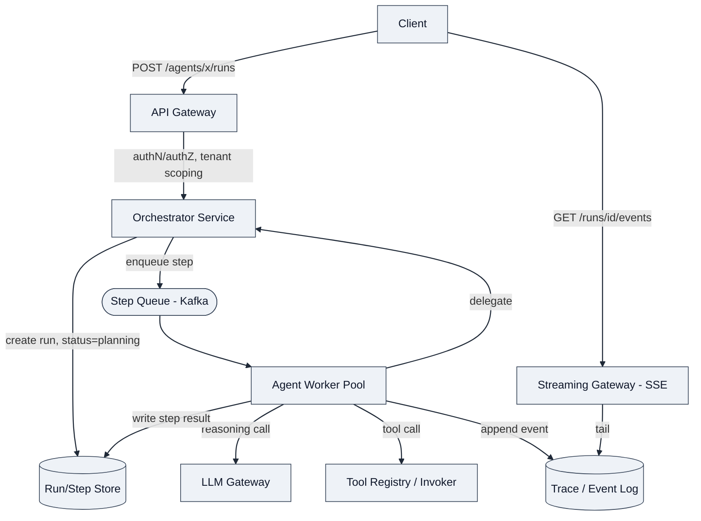
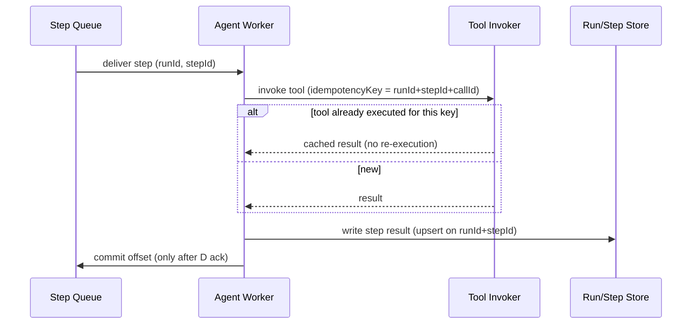
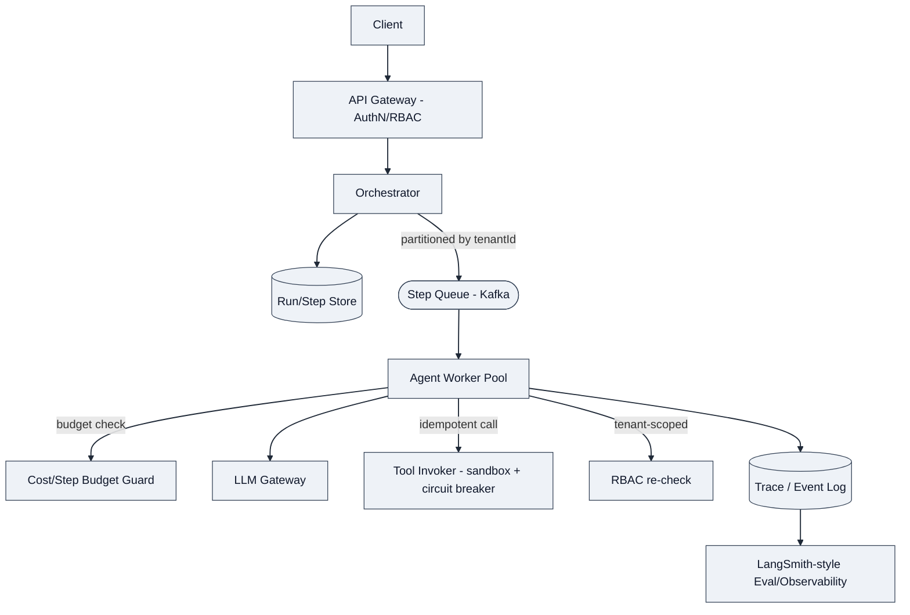

# Design: Multi-Agent Orchestration / Agent Runtime Platform

*Interview framing: "Design a platform that lets teams build and run reasoning agents that plan, invoke tools, and collaborate with other agents to complete a task." This is near-verbatim what the Freshworks Principal AI Architect owns today — expect him to probe against his own architecture, not a textbook answer.*

---

## 1. Requirements

**Functional Requirements** (top 3, prioritized)
1. Clients can submit a task/goal to an agent, which **plans** (decomposes into steps), **invokes tools** (APIs, retrieval, code execution), and returns a result — potentially over multiple reasoning turns.
2. The platform supports **multi-agent collaboration**: one agent (orchestrator/supervisor) can delegate sub-tasks to other specialized agents and aggregate their outputs (A2A — agent-to-agent communication).
3. Developers can **register new agents/tools** via an SDK/config without redeploying the core runtime (extensibility — this is the platform-as-product requirement, not just a single agent).

Clarifying questions I'd ask:
- Synchronous (chat-style, user waiting) or asynchronous (long-running, fire-and-forget with callback/webhook)? → **Assume both**: short agent turns are sync over streaming HTTP/SSE; multi-step workflows that span tool latency (e.g. minutes) are async, checkpointed, resumable.
- Single-tenant internal tool or multi-tenant SaaS surface (per JD: "multi-tenant isolation")? → **Assume multi-tenant**, each tenant has isolated agents, tools, and conversation data.
- Do agents call other agents transitively (arbitrary depth) or is it a fixed supervisor→worker topology? → **Assume bounded-depth graph** (DAG or cyclic-with-max-hops), not unbounded recursion — this is a real failure mode to call out.

**Non-functional Requirements** (top 4, quantified)
- **Latency**: first-token/first-action within ~1–2s for interactive turns; full multi-step plan completion can be seconds-to-minutes — the system must not block a thread per in-flight agent run.
- **Availability**: orchestration control plane 99.9%+; a single tool/agent failure must **degrade gracefully** (partial results, retry, fallback) not cascade.
- **Scalability**: thousands of concurrent agent sessions, each potentially fanning out into N sub-agent/tool calls — this is a **fanout-heavy, bursty, I/O-bound** workload, not CPU-bound.
- **Consistency/Durability**: agent execution state (plan, step history, tool outputs) must survive a worker crash mid-run — this is a **durable execution** problem, not just a request/response problem.
- **Cost/observability** (platform-specific NFR, not classic CAP): every LLM call, tool call, and token must be attributable to a run/tenant for cost control and evaluation (LangSmith-style tracing).

**Capacity estimation**: skipped up front — I'll reason about fanout depth and step count inline in Deep Dives, since that's what actually drives the design (state size per run, not raw QPS).

---

## 2. Core Entities

- **Agent** — a registered persona: system prompt, allowed tools, model config, sub-agents it can delegate to.
- **Run** (or Session) — one invocation of an agent against a user goal; has a status (planning/running/waiting-on-tool/done/failed) and belongs to a tenant.
- **Step** — one unit of execution within a Run: a reasoning turn, a tool call, or a delegation to another agent's Run.
- **Tool** — a registered callable (API, retriever, code executor) with an input/output schema.
- **Message / Trace Event** — the append-only log of everything that happened in a Run (LLM calls, tool I/O, agent handoffs) — this *is* the audit/observability/eval substrate.

---

## 3. API / System Interface

REST for control-plane operations (create/inspect runs, register agents/tools), **SSE/streaming** for the interactive execution channel — mirrors what a real agent SDK looks like.

```
POST   /v1/agents                      # register an agent (system prompt, tools, sub-agents)
POST   /v1/agents/{agentId}/runs       # start a run: { goal, input, tenantId }
GET    /v1/runs/{runId}                # poll run status + latest step
GET    /v1/runs/{runId}/events (SSE)   # stream step-by-step trace (planning, tool calls, tokens)
POST   /v1/runs/{runId}/resume         # human-in-the-loop: supply missing input / approve a tool call
POST   /v1/tools                       # register a tool (schema + invocation target)
```

- Current user/tenant derived from the auth token, never from the body — critical for the multi-tenant isolation requirement.
- `runId` is the durable handle a client polls or resumes — this is what makes long-running agent work resumable across client disconnects.

---

## 4. Data Flow (this *is* a pipeline system — worth drawing explicitly)

`Goal submitted → Orchestrator plans (LLM call) → for each planned step: {tool call | delegate to sub-agent} → step result appended to trace → replan/continue or terminate → final result assembled → returned/streamed`

This is the ReAct-style loop (reason → act → observe), looped until a terminal condition (goal met, max steps, error).

---

## 5. High-Level Design



Walking the endpoints:
- **`POST /runs`**: Orchestrator validates the agent config, creates a `Run` row (status=planning), and enqueues the first planning step onto a Kafka topic keyed by `runId` — this preserves per-run ordering while allowing massive horizontal fanout across runs.
- **Agent Workers** are stateless consumers: pull a step, call the LLM Gateway for the next reasoning/action decision, execute a tool call or emit a delegation event back to the Orchestrator (which spawns a child Run), append everything to the append-only Trace, and write the updated Run/Step state.
- **Delegation (A2A)** is modeled as: parent Run creates a child Run via the same `/runs` API, with `parentRunId` set. The parent's step is marked "waiting-on-child" and resumes when the child completes (via an event on the Step Queue) — this reuses the exact same primitives instead of inventing a separate agent-to-agent protocol, which is the senior move here.
- **Streaming**: clients don't poll the workers directly — they tail the Trace via a Streaming Gateway, decoupling execution from delivery so a client disconnect never affects the run.

**Stay simple first**: this already satisfies functional req 1–3. Caching, replanning-loop limits, and tool-call isolation are Deep Dives.

---

## 6. Deep Dives

### 6.1 Durable execution — surviving a worker crash mid-run
*DDIA Ch. 11 (stream processing, exactly-once semantics) is the backbone here.*

The naive design above has a gap: if a Worker crashes after calling a tool but before writing the step result, that side effect (e.g. "charged a customer," "sent an email") may be lost or, worse, retried and duplicated.

Fix: every step write is **idempotent, keyed by `(runId, stepId)`**, and tool invocations carry an **idempotency key** derived from `(runId, stepId, toolCallId)` that the Tool Invoker enforces before calling an external API. Kafka consumer offsets are only committed *after* the step result is durably persisted (at-least-once delivery + idempotent apply = effectively-once outcome). This is exactly the pattern behind Temporal's "workflow determinism + activity idempotency" model — worth naming explicitly since the JD calls out Temporal.



### 6.2 Bounded planning / runaway agent loops
Agents can loop forever (replan → replan → replan) or fan out exponentially (agent delegates to agent delegates to agent). This is a real production incident class, and a senior candidate should raise it unprompted.

- **Max step budget** and **max delegation depth** per Run, enforced by the Orchestrator, not the LLM's own judgment.
- **Cost/token budget** per Run, checked before each LLM call (ties into the LLM Gateway's cost-control role — see next design doc).
- Circular delegation (A → B → A) detected via a `visitedAgents` set carried in the Run's causal chain, similar to loop detection in a call graph.

### 6.3 Tool call isolation and blast radius
Tools are arbitrary code/API calls a model *chooses* to invoke — untrusted input effectively drives execution. Deep dive on:
- **Sandboxed execution** for code-running tools (separate from the Worker's own process/container).
- **Per-tool timeout + circuit breaker** so one flaky third-party API doesn't stall the Worker pool (bulkhead pattern) — directly mirrors the JD's "Tenant Isolation" and his own OAuth/credentials-service background at LivePerson.
- **Human-in-the-loop gate**: sensitive tools (send email, spend money) require the Run to pause in a "waiting-approval" state and resume via `POST /runs/{id}/resume` — already modeled by the same durable-state mechanism as 6.1.

### 6.4 Multi-tenant isolation and scaling the Step Queue
- Partition the Step Queue by `tenantId` (or `tenantId+runId` composite key) so one noisy tenant's fanout can't starve others' latency — classic Kafka partitioning-for-fairness problem, same class of problem as his gRPC/Kafka messaging pipeline migration.
- RBAC enforced at the API Gateway (tenant + role from the auth token) *and* re-checked at the Tool Invoker (defense in depth — a compromised or misbehaving agent shouldn't be able to call a tool outside its tenant's grant).

**Updated architecture with hardening:**



---

## Real-World Anchor
Bytebytego's notification/workflow-engine case studies and Uber's Cadence (Temporal's predecessor) are the closest public analogs: durable, replayable workflow execution decoupled from the worker that happens to run it. The A2A delegation-as-child-Run pattern mirrors how Temporal models "child workflows." Worth citing Cadence/Temporal by name — it signals you understand *why* the JD asks for Temporal experience, not just that you've heard of it.

---

## 🔍 Senior-Signal Questions to Ask in Your Interview
- **"How do you version an agent's system prompt/tool config without breaking in-flight runs?"** → *Why it matters: signals you think about deploys as a distributed-systems problem (in-flight state referencing an old schema), not just a config change.*
- **"What's your replanning strategy when a tool call fails — retry, fallback tool, or surface to the user?"** → *Why it matters: shows you understand agent reliability is a product decision, not just an engineering one.*
- **"Is delegation depth/fanout bounded by policy, or does the model decide when to stop?"** → *Why it matters: this is the exact runaway-cost failure mode a Principal AI Architect running an LLM gateway would have hit personally.*
- **"How do you keep the trace log from becoming a bottleneck at high fanout — is it the source of truth or a side-effect sink?"** → *Why it matters: probes whether you'd conflate the durable-state store with the observability store, a common design smell.*
- **"Where does human-in-the-loop approval live in the state machine — a separate service or a Run status?"** → *Why it matters: tests whether your design treats HITL as a first-class execution state, not a bolt-on.*