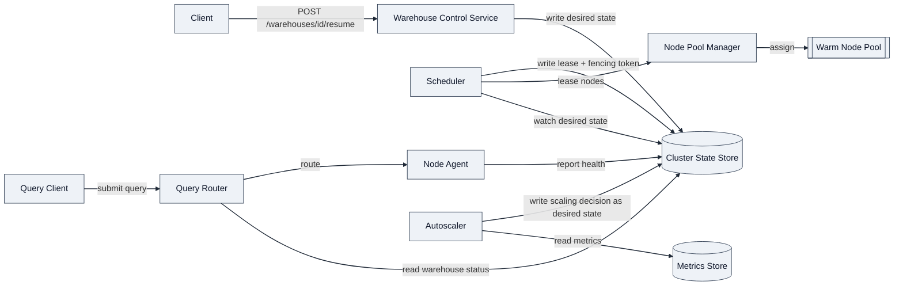
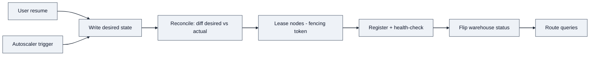
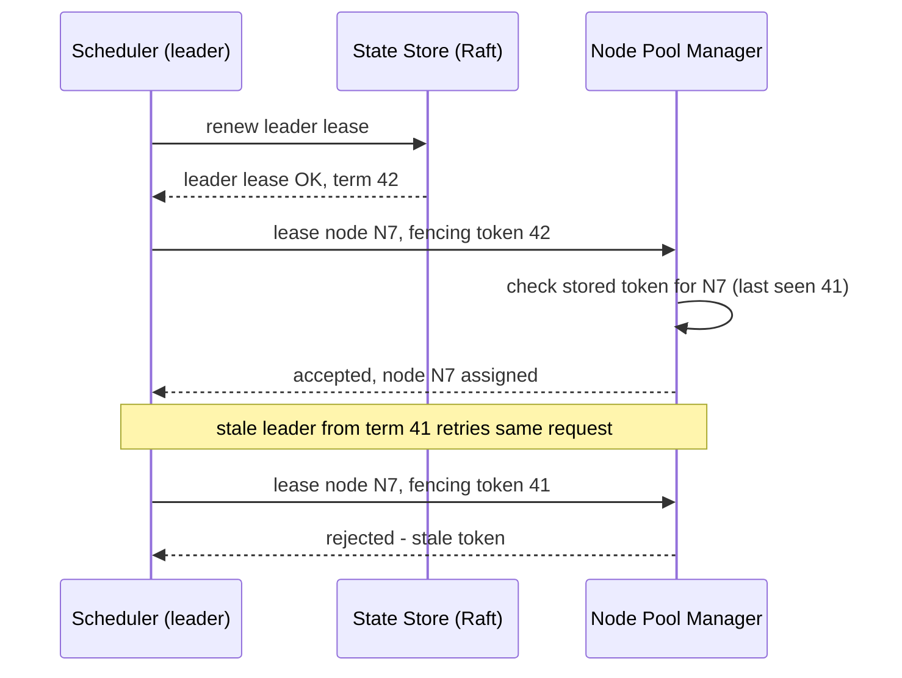

# Design a Compute-Cluster Scheduler / Orchestrator (On-Demand Warehouse Provisioning)

*Interview context: Snowflake, Warehouse UX pod — Senior SWE round with Ying Huang (Staff Cloud Engineer, ex-Kubernetes scale/orchestration architect). Expect her to push hardest on control-plane consistency and failure recovery, not on the API shape.*

---

## 1. Requirements

**Functional (top 3)**
- Users can **create a warehouse** (a named, sized compute cluster) and have it become queryable within a bounded time.
- The system **auto-scales / auto-suspends** a warehouse based on load and idle time, without the user managing infrastructure.
- The system **schedules queries onto provisioned compute** such that one tenant's warehouse never silently borrows another tenant's capacity.

**Clarifying questions to pose out loud** (then commit to an assumption):
- Is warehouse compute **dedicated** per tenant, or a **shared pool** with logical partitioning? → *Assume dedicated node sets per warehouse, drawn from a shared warm pool — this is Snowflake's actual model and it's the harder, more interesting design.*
- Does resize mean **vertical** (bigger nodes) or **horizontal** (more clusters, multi-cluster warehouses)? → *Assume horizontal scaling of identical-size nodes; vertical resize is a user-initiated resize, not autoscaling.*

**Non-functional (top 4, quantified)**
- **Control-plane availability: 99.99%** — the system that *decides* placement must stay up even if individual nodes die.
- **Provisioning latency: warehouse resume in < 5–10s** (warm path), **< 60s** cold path — this is the "UX" the pod name refers to.
- **Strong consistency on cluster state** — the source of truth for "which nodes belong to which warehouse" must never allow two schedulers to hand the same node to two warehouses (split-brain double-allocation). *CAP: choose CP for the control plane's placement decisions; the data plane (query execution) can degrade gracefully.*
- **Scale: 10K+ concurrent active warehouses, 100K+ nodes in the fleet, scaling decisions every few seconds per warehouse** — so the scheduler's hot path can't be a single lock-serialized service.

**Capacity estimation:** skipped up front — I'll do inline math only if it changes a decision (e.g., whether the state store can be a single Raft group or needs to be sharded by region).

---

## 2. Core Entities

- **Warehouse** — logical customer-facing unit: name, target size, min/max cluster count, auto-suspend timeout.
- **Cluster** — one physical instance of a warehouse's compute (a warehouse can have multiple clusters when multi-cluster scaling is on).
- **Node** — a single compute unit (VM/container) leased from the fleet.
- **NodeLease** — binds a Node to a Cluster with a TTL and a **fencing token** (critical for the deep dive).
- **ScalingDecision** — an event emitted by the autoscaler: scale-out, scale-in, suspend, resume.

---

## 3. API / System Interface

REST for the control surface (user-facing, low QPS relative to query traffic); internal scheduler-to-node-pool calls are gRPC.

```
POST   /warehouses                     create a warehouse (size, auto-suspend policy)
POST   /warehouses/{id}/resume         explicit resume (or implicit on first query)
POST   /warehouses/{id}/suspend        explicit suspend
PATCH  /warehouses/{id}                resize / change scaling policy
GET    /warehouses/{id}/status         current state: SUSPENDED | STARTING | RUNNING | SCALING
```

Current tenant is derived from the auth token, never from the body. Query submission is a **separate** system (Query Router) that reads warehouse status and either routes immediately (RUNNING) or triggers a resume-then-route path.

---

## 4. High-Level Design

Endpoint-by-endpoint, building the architecture to serve each one:

- `POST /warehouses/{id}/resume` → **Warehouse Control Service** (stateless, horizontally scaled) writes a desired-state record ("this warehouse wants N nodes") to the **Cluster State Store**, then hands off to the **Scheduler**.
- **Scheduler** reconciles desired vs. actual state: it leases nodes from the **Node Pool Manager** (which maintains a warm pool of pre-booted, unassigned VMs) and issues **NodeLeases** with fencing tokens.
- **Node Agents** on each leased node register health back to the state store; once enough nodes report healthy, the Control Service flips warehouse status to RUNNING.
- **Query Router** reads warehouse status (cache-through from the state store) to route incoming queries to the live cluster's nodes.
- **Autoscaler** watches per-warehouse metrics (queue depth, queued-query wait time, idle duration) and emits ScalingDecisions, which flow back through the same desired-state path as resume/suspend — i.e., **autoscaling and manual resize use the identical reconciliation loop**, not a separate code path (this is the Kubernetes-controller pattern, and it's the single design choice most likely to earn senior signal with this interviewer).



**Stay simple here** — this satisfies "provision, scale, suspend, route." The obvious weak spots to defer to deep dives: (1) what stops two Scheduler replicas from double-leasing the same node, (2) how a warm pool stays warm without wasting cost, (3) what happens when a node or the state store partitions mid-operation.

---

## 5. Data Flow

The interesting flow here isn't a data-processing pipeline in the classic sense — it's the **resume/scale decision loop**, and walking it as an ordered sequence is what makes the reconciliation pattern in the HLD legible:

1. **Trigger** — either a user hits `resume`, or the Autoscaler detects queue depth/idle-timeout crossing a threshold.
2. **Desired-state write** — the trigger is normalized into a single desired-state record in the Cluster State Store (`warehouse X wants N nodes`), regardless of whether it came from a user action or the autoscaler.
3. **Reconcile** — the Scheduler leader diffs desired vs. actual state and computes the delta (lease 2 more nodes / release 1 node).
4. **Lease** — Scheduler requests nodes from the Node Pool Manager, attaching a fencing token; warm-pool hit returns immediately, miss falls back to cold provisioning.
5. **Register + health-check** — Node Agents on newly leased nodes register and report healthy back to the State Store.
6. **Status flip** — once the healthy-node count satisfies desired state, Warehouse Control Service flips status to RUNNING (or back to a smaller RUNNING count on scale-in).
7. **Route** — Query Router, watching status, begins routing queries to the now-live nodes.



The key point to make out loud: **steps 2–7 are identical whether the trigger was a manual resume or an autoscale decision** — there's one loop, not two parallel code paths, which is what keeps the system correct under concurrent triggers (e.g., a user manually resumes while the autoscaler also fires).

---

## 6. Deep Dives

### 5.1 Control-plane consistency — no split-brain scheduling

This is the question I'd expect Ying to open with, given her Kubernetes-scale background.

- The **Cluster State Store** is the single source of truth — modeled as a **Raft-replicated** key-value store (etcd-style), not a plain relational DB with app-level locking. Desired state and actual state both live here as versioned keys.
- The **Scheduler runs as multiple replicas but only one is active** — leader election via the same Raft group (or a lease-based lock, e.g., "acquire scheduler-leader key with 10s TTL, renew every 3s"). Only the leader issues NodeLeases.
- Even with leader election, a **stale leader** can still act after a GC pause or network blip before it realizes it lost leadership — this is the classic distributed-systems trap. Fix: every NodeLease carries a **fencing token** (monotonically increasing counter from the Raft term). The Node Pool Manager rejects any lease request carrying a token lower than the last one it accepted for that node. *(DDIA Ch. 9, "The leader and the lock" — this exact failure mode and fencing-token fix is Kleppmann's canonical example.)*
- **Trade-off called out explicitly:** a single strongly-consistent Raft group caps write throughput (~thousands of ops/sec). At 10K+ warehouses with per-few-seconds scaling decisions, one global group is a bottleneck → **shard the state store by warehouse-id hash into multiple Raft groups**, each independently leader-elected. Cross-shard coordination is never needed because a warehouse's nodes are only ever scheduled within its own shard's scope.



### 5.2 Multi-tenant isolation — the "noisy neighbor" problem

- Nodes are **dedicated per warehouse**, not shared — this is the simplest isolation boundary and matches the "assume dedicated node sets" assumption from Requirements. No cgroup-sharing tricks needed at the compute layer.
- Isolation risk shifts to the **shared warm pool and the scheduler itself**: if one tenant's burst of scale-out requests saturates the Node Pool Manager's lease throughput, other tenants' resumes get delayed. Fix: **per-tenant rate limiting / fair-queuing at the Scheduler's admission path** (token bucket per warehouse before a request even reaches the leader), so one tenant can't starve the shared control plane — this is the same problem Kubernetes API server QPS/burst flow-control solves for a shared cluster, directly in her wheelhouse.
- **Bin-packing trade-off:** the warm pool holds generic-shape nodes. If warehouses request heterogeneous sizes, greedy bin-packing fragments the pool. Called out but deferred (not core to functional requirements) — worth mentioning proactively as a senior-signal aside rather than solving live.

### 5.3 Fast provisioning — warm pool vs. cold start

- **Warm pool**: a background reconciliation loop keeps N pre-booted, unassigned nodes ready (VM booted, agent registered, health-checked, but unleased). Resume path becomes a **lease**, not a **provision** — this is what gets to sub-10s.
- **Cold path** (pool exhausted): falls back to actual VM provisioning from the cloud provider, 30–60s. The Scheduler must **not block** the fast path behind the slow path — resume requests fan out to "try warm pool first, async-provision on miss," and the warehouse status stays STARTING with real progress, not a spinner lying about ETA.
- **Cost trade-off, stated explicitly:** warm pool size is itself a scaling decision — too large wastes idle compute cost (which directly fights the billing/metering half of this team's charter), too small reintroduces cold-start latency. Right lever: size the warm pool off **rolling historical demand**, not a fixed constant.

### 5.4 Failure recovery — the reconciliation-loop payoff

- Because resume, suspend, and autoscale all write to the **same desired-state record** and the Scheduler continuously reconciles desired vs. actual (Kubernetes-controller pattern, not an imperative RPC chain), a Scheduler crash mid-operation is **not a special case** — the new leader simply re-reads desired state from the Raft-backed store and resumes reconciling. No saga/compensating-transaction logic needed for control-plane crashes specifically.
- Node crash mid-query: Node Agent heartbeat timeout removes the node from actual state; reconciler schedules a replacement lease; Query Router's in-flight query fails over per its own retry/idempotency contract (out of scope for this system, but worth naming the boundary).

---

## Real-World Anchor

Bytebytego's coverage of Kubernetes' controller/reconciliation pattern (desired-state vs. actual-state converging via a watch loop) is the direct model for this design, and it's very likely the exact mental model Ying built at 60K-node scale — leaning on it explicitly ("this mirrors the K8s controller pattern") is a low-risk way to signal shared vocabulary rather than reinventing her domain to her.

---

## 🔍 Senior-Signal Questions to Ask in Your Interview

- **"Should warehouse state and node-lease state live in the same consensus group, or be sharded separately?"** → *Why it matters: shows you're thinking about write-throughput bottlenecks in the control plane before being asked, not just correctness.*
- **"What's the SLA difference between control-plane availability and data-plane availability here — can queries keep running on already-leased nodes if the Scheduler itself is down?"** → *Why it matters: separates "the thing that decides" from "the thing that executes," which is exactly the CP-vs-availability trade-off a Kubernetes-background interviewer will want to hear articulated, not assumed.*
- **"How do we prevent a flapping autoscaler — scale-out then scale-in seconds later — from thrashing the warm pool?"** → *Why it matters: signals operational maturity (hysteresis/cooldown windows), a common gap in first-pass designs.*
- **"Given this team also owns metering — does a node that was leased but never actually ran a query get billed?"** → *Why it matters: ties the orchestration design back to the JD's explicit "billing-related functionality" scope, showing you read the room on what the team actually owns.*
- **"At 100K+ nodes, is a single warm-pool manager a bottleneck, and would you shard it by AZ/region the same way the state store is sharded?"** → *Why it matters: extends the sharding trade-off consistently across every component instead of stopping at the one place it was asked.*